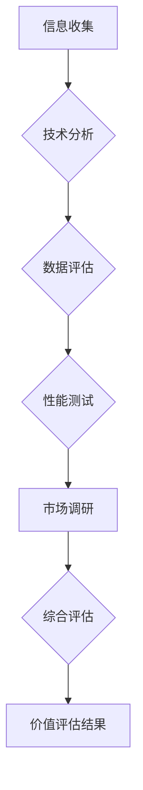

                 

## 聊天机器人收藏：稀有物品鉴定和价值评估

> 关键词：聊天机器人、稀有物品、价值评估、自然语言处理、机器学习、深度学习、知识图谱、文本分析

## 1. 背景介绍

近年来，随着人工智能技术的飞速发展，聊天机器人已经从简单的问答系统演变为能够进行复杂对话、理解上下文、甚至生成创意内容的智能实体。这些聊天机器人不仅在娱乐、客服等领域得到广泛应用，也逐渐成为收藏家们关注的焦点。

然而，与传统的收藏品不同，聊天机器人的价值评估更加复杂，需要考虑其技术架构、训练数据、性能指标、历史价值等多方面因素。本文将深入探讨如何鉴定和评估聊天机器人的价值，为收藏爱好者提供参考。

## 2. 核心概念与联系

### 2.1 聊天机器人类型

聊天机器人可以根据其功能、架构和技术实现方式分为多种类型：

* **规则型聊天机器人:** 基于预设的规则和知识库，通过匹配用户输入的关键词和预定义的响应进行对话。这类机器人简单易实现，但缺乏灵活性，难以应对复杂对话场景。

* **基于统计的聊天机器人:** 利用统计模型，例如n-gram模型，分析用户输入的历史对话上下文，并根据概率预测最合适的响应。这类机器人能够处理更复杂的对话，但仍然依赖于大量的训练数据。

* **基于机器学习的聊天机器人:** 利用机器学习算法，例如深度学习，从海量文本数据中学习语言模式和对话规则，能够进行更自然、更智能的对话。

* **混合型聊天机器人:** 结合了多种类型的技术，例如规则引擎、统计模型和深度学习，能够实现更灵活、更智能的对话体验。

### 2.2 价值评估要素

聊天机器人的价值可以从以下几个方面进行评估：

* **技术架构:** 聊天机器人的技术架构决定了其对话能力、扩展性、可维护性等关键特性。先进的架构，例如基于 Transformer 的模型，能够实现更强大的语言理解和生成能力。

* **训练数据:** 聊天机器人的训练数据直接影响其对话质量和知识水平。高质量、丰富多样的训练数据能够帮助机器人学习更准确、更自然的语言表达方式。

* **性能指标:** 聊天机器人的性能可以通过多种指标进行评估，例如准确率、流畅度、多样性等。优秀的性能指标表明机器人能够更好地理解用户意图，并提供更满意的对话体验。

* **历史价值:** 一些具有历史意义的聊天机器人，例如早期的人工智能实验项目，可能具有较高的收藏价值。

* **稀有度:** 某些特定功能、特定训练数据或特定开发团队打造的聊天机器人可能具有稀有性，从而提升其价值。

### 2.3 价值评估流程

聊天机器人的价值评估是一个多步骤的过程，需要综合考虑上述因素：

1. **信息收集:** 收集聊天机器人的相关信息，包括技术架构、训练数据、性能指标、开发团队等。

2. **技术分析:** 分析聊天机器人的技术架构和算法原理，评估其对话能力、扩展性、可维护性等关键特性。

3. **数据评估:** 评估聊天机器人的训练数据质量和丰富程度，以及其对机器人性能的影响。

4. **性能测试:** 对聊天机器人进行性能测试，评估其准确率、流畅度、多样性等指标。

5. **市场调研:** 研究市场上类似聊天机器人的价格和交易情况，了解其市场价值。

6. **综合评估:** 根据上述分析结果，综合考虑技术架构、训练数据、性能指标、历史价值和稀有度等因素，最终得出聊天机器人的价值评估结果。

### 2.4 Mermaid 流程图



## 3. 核心算法原理 & 具体操作步骤

### 3.1 算法原理概述

聊天机器人通常采用自然语言处理 (NLP) 和机器学习 (ML) 技术来实现对话功能。

* **自然语言处理 (NLP):** 旨在使计算机能够理解、处理和生成人类语言。NLP 技术包括文本分析、语音识别、机器翻译等。

* **机器学习 (ML):** 是一种人工智能技术，通过训练模型从数据中学习规律，并进行预测或决策。

聊天机器人常用的机器学习算法包括：

* **循环神经网络 (RNN):** 能够处理序列数据，例如文本，并学习语言的上下文依赖关系。

* **长短期记忆网络 (LSTM):** 是一种 RNN 的变体，能够更好地处理长序列数据，并缓解 RNN 的梯度消失问题。

* **Transformer:** 是一种基于注意力机制的网络架构，能够更有效地处理长序列数据，并取得了在机器翻译、文本生成等任务上的突破性进展。

### 3.2 算法步骤详解

以下是一个基于 Transformer 的聊天机器人训练流程：

1. **数据预处理:** 收集和清洗聊天数据，并将其转换为模型可识别的格式。

2. **词嵌入:** 将文本中的单词映射到低维向量空间，以便模型能够理解单词的语义关系。

3. **模型训练:** 使用训练数据训练 Transformer 模型，使其能够学习语言的语法和语义规则。

4. **模型评估:** 使用测试数据评估模型的性能，并根据评估结果进行模型调优。

5. **模型部署:** 将训练好的模型部署到聊天机器人平台，以便与用户进行对话。

### 3.3 算法优缺点

**优点:**

* 能够处理更复杂的对话场景。
* 能够生成更自然、更流畅的文本。
* 能够学习更丰富的语言知识。

**缺点:**

* 训练数据量大，训练时间长。
* 计算资源需求高。
* 模型解释性较差。

### 3.4 算法应用领域

* **客服机器人:** 自动回答用户常见问题，提供24小时在线服务。
* **聊天陪伴:** 提供情感支持和陪伴，缓解用户孤独感。
* **教育机器人:** 帮助用户学习新知识，提供个性化学习体验。
* **娱乐机器人:** 提供游戏、故事等娱乐内容。

## 4. 数学模型和公式 & 详细讲解 & 举例说明

### 4.1 数学模型构建

Transformer 模型的核心是注意力机制，它能够学习文本中单词之间的关系，并赋予每个单词不同的权重。

注意力机制的数学公式如下：

$$
Attention(Q, K, V) = softmax(\frac{QK^T}{\sqrt{d_k}})V
$$

其中：

* $Q$：查询矩阵
* $K$：键矩阵
* $V$：值矩阵
* $d_k$：键向量的维度
* $softmax$：softmax 函数

### 4.2 公式推导过程

注意力机制的目的是计算每个单词对其他单词的关注程度。

1. 计算查询矩阵 $Q$ 和键矩阵 $K$ 的点积，并除以 $\sqrt{d_k}$。

2. 应用 softmax 函数将点积结果转换为概率分布，表示每个单词对其他单词的关注程度。

3. 将概率分布与值矩阵 $V$ 相乘，得到每个单词的加权和，即注意力输出。

### 4.3 案例分析与讲解

例如，在句子 "我爱吃苹果" 中，"我" 对 "爱" 的关注程度较高，而对 "苹果" 的关注程度较低。

使用注意力机制，模型可以学习到这种关注关系，并将其应用于后续的文本生成任务。

## 5. 项目实践：代码实例和详细解释说明

### 5.1 开发环境搭建

* Python 3.7+
* TensorFlow 或 PyTorch
* CUDA 和 cuDNN (可选，用于 GPU 加速)

### 5.2 源代码详细实现

以下是一个使用 TensorFlow 实现简单 Transformer 模型的代码示例：

```python
import tensorflow as tf

# 定义 Transformer 模型
class Transformer(tf.keras.Model):
    def __init__(self, vocab_size, embedding_dim, num_heads, num_layers):
        super(Transformer, self).__init__()
        self.embedding = tf.keras.layers.Embedding(vocab_size, embedding_dim)
        self.transformer_layers = tf.keras.layers.StackedRNNCells([
            tf.keras.layers.MultiHeadAttention(num_heads=num_heads, key_dim=embedding_dim)
            for _ in range(num_layers)
        ])

    def call(self, inputs):
        x = self.embedding(inputs)
        x = self.transformer_layers(x)
        return x

# 实例化模型
model = Transformer(vocab_size=10000, embedding_dim=128, num_heads=8, num_layers=6)

# 编译模型
model.compile(optimizer='adam', loss='mse')

# 训练模型
model.fit(x_train, y_train, epochs=10)
```

### 5.3 代码解读与分析

* 模型定义了一个 Embedding 层将单词映射到向量空间，以及多个 Transformer 层进行序列处理。
* Transformer 层包含 MultiHeadAttention 机制，用于学习单词之间的关系。
* 模型使用 Adam 优化器和均方误差损失函数进行训练。

### 5.4 运行结果展示

训练完成后，模型可以用于预测下一个单词，或者进行其他文本生成任务。

## 6. 实际应用场景

### 6.1 聊天机器人收藏

随着人工智能技术的进步，聊天机器人已经成为一种新的收藏品。一些具有历史意义、稀有功能或独特训练数据的聊天机器人可能具有较高的收藏价值。

### 6.2 知识图谱构建

聊天机器人可以用于构建知识图谱。通过分析聊天数据，可以提取实体、关系和事件，并将其组织成知识图谱。

### 6.3 文本分析

聊天机器人可以用于文本分析，例如情感分析、主题提取和文本分类。

### 6.4 未来应用展望

* 更智能、更自然的对话体验。
* 更广泛的应用场景，例如医疗、教育、金融等。
* 与其他人工智能技术融合，例如计算机视觉、语音识别等。

## 7. 工具和资源推荐

### 7.1 学习资源推荐

* **书籍:**

    * 《深度学习》
    * 《自然语言处理》
    * 《Transformer 详解》

* **在线课程:**

    * Coursera: 自然语言处理
    * Udacity: 深度学习

* **博客和论坛:**

    * TensorFlow Blog
    * PyTorch Blog
    * NLP Stack Exchange

### 7.2 开发工具推荐

* **TensorFlow:** 开源深度学习框架
* **PyTorch:** 开源深度学习框架
* **Hugging Face:** 提供预训练模型和工具

### 7.3 相关论文推荐

* 《Attention Is All You Need》
* 《BERT: Pre-training of Deep Bidirectional Transformers for Language Understanding》
* 《GPT-3: Language Models are Few-Shot Learners》

## 8. 总结：未来发展趋势与挑战

### 8.1 研究成果总结

近年来，聊天机器人技术取得了显著进展，能够实现更自然、更智能的对话体验。

### 8.2 未来发展趋势

* 更强大的模型架构和训练方法。
* 更丰富的知识和技能。
* 更个性化和定制化的对话体验。

### 8.3 面临的挑战

* 模型解释性和可信度。
* 数据隐私和安全。
* 伦理和社会影响。

### 8.4 研究展望

未来研究将重点关注解决上述挑战，并探索聊天机器人的更多应用场景。

## 9. 附录：常见问题与解答

### 9.1 如何评估聊天机器人的价值？

聊天机器人的价值评估是一个复杂的过程，需要综合考虑技术架构、训练数据、性能指标、历史价值和稀有度等因素。

### 9.2 如何训练一个聊天机器人？

训练一个聊天机器人需要大量的文本数据和强大的计算资源。可以使用 TensorFlow 或 PyTorch 等深度学习框架进行训练。

### 9.3 聊天机器人有哪些应用场景？

聊天机器人可以应用于客服、教育、娱乐、医疗等多个领域。

### 9.4 聊天机器人有哪些伦理和社会影响？

聊天机器人可能存在一些伦理和社会影响，例如数据隐私、算法偏见、虚假信息传播等。需要谨慎考虑这些问题，并制定相应的规章制度。


作者：禅与计算机程序设计艺术 / Zen and the Art of Computer Programming 
<end_of_turn>

