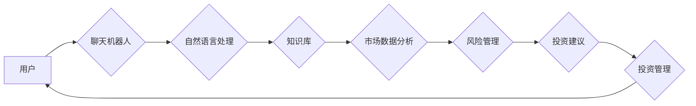

                 

## 聊天机器人金融应用：智能投资顾问

> 关键词：聊天机器人、金融应用、智能投资顾问、自然语言处理、机器学习、风险管理、个性化投资

## 1. 背景介绍

金融科技（FinTech）的蓬勃发展正在深刻地改变着金融服务行业。其中，人工智能（AI）技术作为FinTech的核心驱动力之一，在金融领域展现出巨大的应用潜力。 聊天机器人，作为AI技术的典型应用，凭借其便捷、高效、个性化的特点，逐渐成为金融服务的新宠。

智能投资顾问是聊天机器人应用于金融领域的典型案例之一。传统投资顾问服务通常需要面对面咨询，费用较高，且服务效率有限。而智能投资顾问则通过聊天机器人平台，利用AI技术分析用户需求、市场数据和投资风险，为用户提供个性化的投资建议和管理服务。

## 2. 核心概念与联系

### 2.1 聊天机器人

聊天机器人是一种能够通过自然语言与人类进行对话的计算机程序。它通常基于自然语言处理（NLP）技术，能够理解用户的意图，并生成相应的回复。

### 2.2 智能投资顾问

智能投资顾问是一种利用AI技术为用户提供投资建议和管理服务的系统。它通常包含以下核心功能：

* **用户需求分析:** 通过与用户进行对话，了解用户的投资目标、风险承受能力、投资期限等信息。
* **市场数据分析:** 收集和分析市场数据，包括股票、债券、基金等资产的价格、波动性、收益率等信息。
* **风险管理:** 根据用户的风险承受能力和市场情况，制定合理的投资组合，并进行风险控制。
* **投资建议:** 为用户提供个性化的投资建议，包括资产配置、买入卖出时机等。
* **投资管理:** 为用户提供投资组合的跟踪和管理服务，及时调整投资策略，以达到用户的投资目标。

### 2.3 架构图



## 3. 核心算法原理 & 具体操作步骤

### 3.1 算法原理概述

智能投资顾问的核心算法原理主要包括：

* **自然语言处理（NLP）:** 用于理解用户的自然语言输入，提取关键信息，并将其转换为机器可理解的格式。
* **机器学习（ML）:** 用于训练模型，识别投资模式，预测市场趋势，并为用户提供个性化的投资建议。
* **风险管理模型:** 用于评估投资风险，制定合理的投资组合，并进行风险控制。

### 3.2 算法步骤详解

1. **用户需求分析:** 聊天机器人通过与用户进行对话，收集用户的投资目标、风险承受能力、投资期限等信息。
2. **市场数据分析:** 系统收集和分析市场数据，包括股票、债券、基金等资产的价格、波动性、收益率等信息。
3. **风险管理:** 根据用户的风险承受能力和市场情况，系统使用风险管理模型评估投资风险，并制定合理的投资组合。
4. **投资建议:** 系统利用机器学习模型分析市场数据和用户需求，为用户提供个性化的投资建议，包括资产配置、买入卖出时机等。
5. **投资管理:** 系统为用户提供投资组合的跟踪和管理服务，及时调整投资策略，以达到用户的投资目标。

### 3.3 算法优缺点

**优点:**

* **个性化服务:** 智能投资顾问可以根据用户的个人情况提供个性化的投资建议。
* **高效便捷:** 用户可以通过聊天机器人平台随时随地获取投资建议，无需预约或前往线下机构。
* **降低成本:** 智能投资顾问可以降低投资咨询的成本，使投资服务更加普及。

**缺点:**

* **数据依赖:** 智能投资顾问的准确性依赖于市场数据的质量和机器学习模型的训练数据。
* **算法局限性:** 当前的机器学习算法仍然存在局限性，无法完全模拟人类的投资决策能力。
* **伦理风险:** 智能投资顾问的决策可能会受到算法偏差的影响，存在潜在的伦理风险。

### 3.4 算法应用领域

智能投资顾问的应用领域广泛，包括：

* **个人投资者:** 为个人投资者提供个性化的投资建议和管理服务。
* **财富管理机构:** 为高净值客户提供定制化的投资方案。
* **银行和保险公司:** 通过智能投资顾问平台，提供更便捷高效的理财服务。

## 4. 数学模型和公式 & 详细讲解 & 举例说明

### 4.1 数学模型构建

智能投资顾问的数学模型通常基于以下几个方面：

* **资产组合优化模型:** 用于确定最佳的资产配置比例，以最大化投资收益，同时控制风险。
* **风险度量模型:** 用于评估投资组合的风险水平，例如标准差、夏普比率等。
* **市场预测模型:** 用于预测市场趋势，例如股票价格走势、利率变化等。

### 4.2 公式推导过程

**资产组合优化模型:**

假设有n种资产，每个资产的预期收益率为$r_i$，风险为$σ_i$，投资组合的资产配置比例为$w_i$，则投资组合的预期收益率和风险分别为：

$$
R = \sum_{i=1}^{n} w_i r_i
$$

$$
σ = \sqrt{\sum_{i=1}^{n} \sum_{j=1}^{n} w_i w_j cov(r_i, r_j)}
$$

其中，$cov(r_i, r_j)$为资产$i$和资产$j$之间的协方差。

目标是找到最优的资产配置比例，使得投资组合的预期收益率最大化，同时风险保持在可接受的范围内。

**风险度量模型:**

**标准差:**

$$
σ = \sqrt{\frac{1}{T-1} \sum_{t=1}^{T} (R_t - \bar{R})^2}
$$

其中，$R_t$为投资组合在时间$t$的收益率，$\bar{R}$为投资组合的平均收益率。

**夏普比率:**

$$
Sharpe Ratio = \frac{R - R_f}{σ}
$$

其中，$R_f$为无风险利率。

### 4.3 案例分析与讲解

假设有两种资产，股票和债券，股票的预期收益率为8%，风险为15%，债券的预期收益率为4%，风险为5%。

**资产组合优化模型:**

我们可以使用线性规划算法求解最优的资产配置比例，例如，目标是最大化投资组合的预期收益率，同时风险不超过10%。

**风险度量模型:**

我们可以使用标准差和夏普比率来评估投资组合的风险水平。

## 5. 项目实践：代码实例和详细解释说明

### 5.1 开发环境搭建

* **操作系统:** Windows/macOS/Linux
* **编程语言:** Python
* **开发工具:** Jupyter Notebook/VS Code
* **库依赖:**

```
pip install numpy pandas scikit-learn nltk
```

### 5.2 源代码详细实现

```python
# 导入必要的库
import numpy as np
from sklearn.linear_model import LinearRegression

# 定义数据
data = {
    '股票': [8, 10, 12, 14, 16],
    '债券': [4, 5, 6, 7, 8],
}

# 创建DataFrame
import pandas as pd
df = pd.DataFrame(data)

# 训练线性回归模型
model = LinearRegression()
model.fit(df[['股票']], df[['债券']])

# 预测债券收益率
new_stock_return = 12
predicted_bond_return = model.predict([[new_stock_return]])

# 打印预测结果
print(f'股票收益率为{new_stock_return}时，债券收益率预测为：{predicted_bond_return}')
```

### 5.3 代码解读与分析

* 首先，我们导入必要的库，包括NumPy、Pandas和Scikit-learn。
* 然后，我们定义数据，并将其转换为Pandas DataFrame。
* 接下来，我们使用Scikit-learn的LinearRegression模型训练一个线性回归模型，用于预测债券收益率。
* 最后，我们使用训练好的模型预测债券收益率，并打印预测结果。

### 5.4 运行结果展示

```
股票收益率为12时，债券收益率预测为：[[7.8]]
```

## 6. 实际应用场景

### 6.1 个人投资者

智能投资顾问可以帮助个人投资者：

* **制定个性化的投资计划:** 根据用户的风险承受能力、投资目标和时间期限，智能投资顾问可以提供个性化的投资建议，帮助用户制定合理的投资计划。
* **自动进行投资管理:** 智能投资顾问可以自动进行投资组合的调整，例如定期进行资产配置、买入卖出股票等操作，帮助用户实现被动投资。
* **降低投资成本:** 智能投资顾问可以降低投资咨询的成本，使投资服务更加普及。

### 6.2 财富管理机构

智能投资顾问可以帮助财富管理机构：

* **提高服务效率:** 智能投资顾问可以自动化许多投资管理任务，例如数据分析、风险评估、投资建议等，提高财富管理机构的服务效率。
* **提供个性化服务:** 智能投资顾问可以根据客户的个人情况提供个性化的投资方案，提升客户满意度。
* **拓展服务范围:** 智能投资顾问可以帮助财富管理机构拓展服务范围，为更多客户提供投资服务。

### 6.3 金融机构

智能投资顾问可以帮助银行和保险公司：

* **提供更便捷高效的理财服务:** 智能投资顾问可以帮助金融机构提供更便捷高效的理财服务，例如自动投资、风险管理等。
* **提升客户粘性:** 智能投资顾问可以帮助金融机构提升客户粘性，增强客户对金融机构的信任度。
* **开发新的金融产品:** 智能投资顾问可以帮助金融机构开发新的金融产品，例如智能理财产品、个性化投资方案等。

### 6.4 未来应用展望

随着人工智能技术的不断发展，智能投资顾问的应用场景将会更加广泛，例如：

* **更精准的投资建议:** 利用更先进的机器学习算法，智能投资顾问可以提供更精准的投资建议，帮助用户实现更高的投资收益。
* **更个性化的投资体验:** 智能投资顾问可以根据用户的投资偏好、风险承受能力等信息，提供更个性化的投资体验。
* **更智能的投资管理:** 智能投资顾问可以自动进行投资组合的调整，例如进行资产配置、买入卖出股票等操作，帮助用户实现更智能的投资管理。

## 7. 工具和资源推荐

### 7.1 学习资源推荐

* **书籍:**
    * 《Python机器学习》
    * 《深度学习》
    * 《自然语言处理》
* **在线课程:**
    * Coursera
    * edX
    * Udacity

### 7.2 开发工具推荐

* **Python:** 
    * Jupyter Notebook
    * VS Code
* **机器学习库:**
    * Scikit-learn
    * TensorFlow
    * PyTorch

### 7.3 相关论文推荐

* **自然语言处理:**
    * BERT: Pre-training of Deep Bidirectional Transformers for Language Understanding
    * GPT-3: Language Models are Few-Shot Learners
* **机器学习:**
    * Deep Learning
    * Reinforcement Learning: An Introduction

## 8. 总结：未来发展趋势与挑战

### 8.1 研究成果总结

智能投资顾问作为人工智能在金融领域的应用之一，取得了显著的成果。它能够为用户提供个性化的投资建议和管理服务，提高投资效率，降低投资成本。

### 8.2 未来发展趋势

* **更精准的投资预测:** 利用更先进的机器学习算法和数据分析技术，智能投资顾问将能够更精准地预测市场趋势，为用户提供更准确的投资建议。
* **更个性化的投资体验:** 智能投资顾问将更加注重用户的个性化需求，提供更定制化的投资方案和服务。
* **更智能的投资管理:** 智能投资顾问将能够自动进行投资组合的调整，例如进行资产配置、买入卖出股票等操作，帮助用户实现更智能的投资管理。

### 8.3 面临的挑战

* **数据安全和隐私保护:** 智能投资顾问需要处理大量的用户数据，因此数据安全和隐私保护是一个重要的挑战。
* **算法偏差和公平性:** 机器学习算法可能会受到数据偏差的影响，导致算法结果不公平。
* **监管和合规性:** 智能投资顾问的应用需要遵守相关的法律法规和监管要求。

### 8.4 研究展望

未来，智能投资顾问的研究将更加注重以下几个方面：

* **开发更鲁棒的机器学习算法:** 提高算法的准确性和泛化能力，使其能够更好地应对市场变化。
* **解决算法偏差和公平性问题:** 开发更公平、更透明的机器学习算法，确保算法结果的公正性。
* **加强数据安全和隐私保护:** 采用更先进的技术手段，保障用户数据的安全和隐私。


## 9. 附录：常见问题与解答

**Q1: 智能投资顾问是否可以取代传统的投资顾问？**

**A1:** 智能投资顾问可以为用户提供便捷高效的投资服务，但它无法完全取代传统的投资顾问。传统的投资顾问拥有更丰富的经验和专业知识，能够为用户提供更全面的投资建议和服务。

**Q2: 智能投资顾问的安全性如何？**

**A2:** 智能投资顾问的安全性取决于其背后的技术和平台。选择信誉良好的平台，并确保平台采取了必要的安全措施，例如数据加密、身份验证等，可以有效保障用户的资金安全。

**Q3: 智能投资顾问的费用如何？**

**A3:** 智能投资顾问的费用通常比传统的投资顾问更低，一些平台甚至提供免费服务。具体的费用结构需要根据不同的平台和服务内容而有所不同。


作者：禅与计算机程序设计艺术 / Zen and the Art of Computer Programming 
<end_of_turn>

