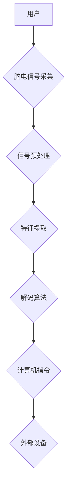

                 

## 脑机接口技术的发展：直接用思维控制设备

> 关键词：脑机接口、神经信号、解码算法、机器学习、应用场景、未来趋势

### 1. 背景介绍

脑机接口 (Brain-Computer Interface, BCI) 技术，顾名思义，是一种介于大脑和外部设备之间的接口，它能够直接读取大脑神经信号，并将其转换为可被计算机理解的指令，从而实现人与机器的交互。 

BCI 技术的出现，标志着人类与科技的融合迈向了新的阶段。它不仅为残疾人提供了新的希望，例如帮助瘫痪患者控制机械臂或轮椅，还能在未来应用于游戏、医疗、教育等各个领域，彻底改变我们的生活方式。

### 2. 核心概念与联系

**2.1 核心概念**

* **神经信号:**  大脑活动产生的电信号，通过电解质介质传播，可以被传感器检测到。
* **解码算法:** 将神经信号转换为计算机指令的算法，需要对神经信号进行分析和识别，并建立神经信号与指令之间的映射关系。
* **机器学习:**  一种人工智能技术，可以从数据中学习，并不断改进解码算法的准确性。

**2.2 架构图**



**2.3 联系**

BCI 系统的核心是将大脑的电信号转换为计算机指令。 

1. 首先，通过脑电图 (EEG) 等传感器采集脑电信号。
2. 然后，对采集到的信号进行预处理，去除噪声和干扰。
3. 接着，提取脑电信号中的特征，例如频率、幅度等。
4. 最后，利用解码算法将提取的特征映射到相应的计算机指令，并控制外部设备。

### 3. 核心算法原理 & 具体操作步骤

**3.1 算法原理概述**

BCI 解码算法的原理是建立神经信号与指令之间的映射关系。 

常见的解码算法包括：

* **特征空间分类:** 将脑电信号特征映射到一个特征空间，然后使用分类器（如支持向量机、神经网络）将不同指令对应的特征区分开来。
* **时间序列分析:** 利用时频分析等方法分析脑电信号的时间序列特征，识别不同指令对应的脑电活动模式。
* **深度学习:** 使用深度神经网络对脑电信号进行端到端的学习，自动提取特征并进行分类。

**3.2 算法步骤详解**

以特征空间分类为例，其具体操作步骤如下：

1. **数据采集:** 收集不同指令下对应的脑电信号数据。
2. **数据预处理:** 对采集到的脑电信号进行滤波、去噪等预处理，去除无关信息。
3. **特征提取:** 从预处理后的脑电信号中提取特征，例如功率谱、互信息等。
4. **模型训练:** 使用训练数据训练分类器，建立神经信号特征与指令之间的映射关系。
5. **模型测试:** 使用测试数据评估模型的性能，例如准确率、召回率等。
6. **实时解码:** 将实时采集到的脑电信号输入到训练好的模型中，解码出相应的指令。

**3.3 算法优缺点**

* **优点:** 
    * 准确率较高，能够识别多种指令。
    * 算法相对成熟，已有大量的研究成果和应用案例。
* **缺点:** 
    * 需要大量的训练数据，训练过程耗时较长。
    * 对脑电信号的质量要求较高，容易受到噪声和干扰的影响。

**3.4 算法应用领域**

* **医疗领域:** 帮助瘫痪患者控制机械臂、轮椅等设备，恢复日常生活能力。
* **游戏领域:** 实现脑控游戏，提供更加沉浸式的游戏体验。
* **教育领域:** 帮助学生进行脑力训练，提高学习效率。

### 4. 数学模型和公式 & 详细讲解 & 举例说明

**4.1 数学模型构建**

假设我们想要解码两种指令： "向上" 和 "向下"。 

我们可以将脑电信号特征表示为一个向量 **x**，其中每个元素代表一个特征值。 

则，我们可以使用线性分类器来构建数学模型：

$$
y = sign(w^T x + b)
$$

其中：

* **y** 是预测的指令，取值为 1 或 -1，分别代表 "向上" 和 "向下"。
* **w** 是权重向量，决定了每个特征对指令预测的影响程度。
* **b** 是偏置项，用于调整分类阈值。
* **sign()** 是符号函数，返回向量 **w^T x + b** 的符号。

**4.2 公式推导过程**

线性分类器的目标是找到最优的权重向量 **w** 和偏置项 **b**，使得分类器能够正确地将不同指令的脑电信号特征区分开来。

可以使用最大间隔分类 (Maximum Margin Classification) 等算法来求解最优的 **w** 和 **b**。

**4.3 案例分析与讲解**

假设我们收集到 100 个 "向上" 指令对应的脑电信号特征向量，以及 100 个 "向下" 指令对应的脑电信号特征向量。

我们可以使用这些数据训练线性分类器，并得到最优的权重向量 **w** 和偏置项 **b**。

然后，当我们采集到一个新的脑电信号特征向量 **x** 时，我们可以将其输入到训练好的分类器中，得到预测的指令 **y**。

### 5. 项目实践：代码实例和详细解释说明

**5.1 开发环境搭建**

* **操作系统:** Linux 或 Windows
* **编程语言:** Python
* **库:** NumPy, Scikit-learn, Matplotlib

**5.2 源代码详细实现**

```python
import numpy as np
from sklearn.linear_model import LogisticRegression
from sklearn.model_selection import train_test_split
import matplotlib.pyplot as plt

# 假设我们有 200 个脑电信号特征向量，以及对应的指令标签
X = np.random.rand(200, 10)  # 200 个样本，每个样本有 10 个特征
y = np.array([1] * 100 + [-1] * 100)  # 100 个 "向上" 指令，100 个 "向下" 指令

# 将数据分成训练集和测试集
X_train, X_test, y_train, y_test = train_test_split(X, y, test_size=0.2)

# 使用逻辑回归模型训练分类器
model = LogisticRegression()
model.fit(X_train, y_train)

# 对测试集进行预测
y_pred = model.predict(X_test)

# 计算模型的准确率
accuracy = np.mean(y_pred == y_test)
print(f"模型准确率: {accuracy}")

# 可视化决策边界
plt.scatter(X_train[:, 0], X_train[:, 1], c=y_train, cmap='viridis')
plt.xlabel('Feature 1')
plt.ylabel('Feature 2')
plt.title('Decision Boundary')
plt.show()
```

**5.3 代码解读与分析**

* 首先，我们使用 NumPy 生成一些随机的脑电信号特征向量和指令标签。
* 然后，我们使用 Scikit-learn 的 `train_test_split` 函数将数据分成训练集和测试集。
* 接着，我们使用 Scikit-learn 的 `LogisticRegression` 类训练一个逻辑回归分类器。
* 然后，我们使用训练好的分类器对测试集进行预测。
* 最后，我们计算模型的准确率，并使用 Matplotlib 可视化决策边界。

**5.4 运行结果展示**

运行代码后，会输出模型的准确率，以及决策边界的可视化图。

### 6. 实际应用场景

**6.1 医疗领域**

* **瘫痪患者辅助控制:** BCI 可以帮助瘫痪患者控制机械臂、轮椅等设备，恢复日常生活能力。
* **脑机接口辅助治疗:** BCI 可以用于治疗脑损伤、失语症等疾病。

**6.2 游戏领域**

* **脑控游戏:** BCI 可以实现脑控游戏，提供更加沉浸式的游戏体验。
* **游戏辅助工具:** BCI 可以帮助游戏玩家提高游戏技能，例如控制角色移动、攻击等。

**6.3 教育领域**

* **脑力训练:** BCI 可以帮助学生进行脑力训练，提高学习效率。
* **个性化学习:** BCI 可以根据学生的脑电活动特征，提供个性化的学习内容和方法。

**6.4 未来应用展望**

* **增强现实/虚拟现实:** BCI 可以与增强现实/虚拟现实技术结合，提供更加沉浸式的体验。
* **人机协作:** BCI 可以帮助人类与机器更好地协作，提高工作效率。
* **脑科学研究:** BCI 可以用于研究大脑功能，帮助我们更好地理解人类大脑。

### 7. 工具和资源推荐

**7.1 学习资源推荐**

* **书籍:**
    * "Brain-Computer Interfaces: Principles and Applications" by Niels Birbaumer
    * "Brain-Computer Interfaces: A Primer" by José del R Millán
* **在线课程:**
    * Coursera: "Brain-Computer Interfaces" by University of California, San Diego
    * edX: "Introduction to Brain-Computer Interfaces" by University of California, Berkeley

**7.2 开发工具推荐**

* **OpenBCI:** 开源脑机接口平台，提供硬件和软件工具。
* **Muse Headband:**  一款便携式脑电头戴设备，可以用于开发BCI应用。
* **BrainVision Analyzer:**  一款专业的脑电信号分析软件。

**7.3 相关论文推荐**

* "A Review of Brain-Computer Interfaces" by Wolpaw et al. (2002)
* "Brain-Computer Interfaces: A Review of the Current State of the Art" by Kübler et al. (2005)
* "Brain-Computer Interfaces: Progress and Challenges" by Blankertz et al. (2010)

### 8. 总结：未来发展趋势与挑战

**8.1 研究成果总结**

近年来，BCI 技术取得了长足的进步，在医疗、游戏、教育等领域展现出巨大的应用潜力。

**8.2 未来发展趋势**

* **非侵入式BCI:**  开发更加舒适、便携的非侵入式BCI设备，例如基于脑电、磁脑成像等技术的BCI。
* **高精度解码:**  提高BCI解码的精度和速度，能够识别更加细粒度的指令。
* **个性化BCI:**  开发个性化的BCI系统，根据用户的脑电特征和需求进行定制。

**8.3 面临的挑战**

* **信号质量:**  脑电信号容易受到噪声和干扰的影响，需要开发更加有效的信号处理方法。
* **算法复杂度:**  BCI解码算法的复杂度较高，需要开发更加高效的算法。
* **伦理问题:**  BCI技术的发展也带来了伦理问题，例如数据隐私、意识控制等，需要进行深入的探讨和规范。

**8.4 研究展望**

BCI 技术的发展前景广阔，未来将继续朝着更加安全、高效、便捷的方向发展，为人类带来更加美好的未来。

### 9. 附录：常见问题与解答

**9.1 如何使用BCI设备？**

使用BCI设备需要先进行头戴设备的佩戴，然后根据设备的指示进行操作。

**9.2 BCI技术有哪些应用场景？**

BCI技术应用场景广泛，包括医疗、游戏、教育、人机交互等。

**9.3 BCI技术有哪些发展趋势？**

BCI技术的发展趋势包括非侵入式、高精度解码、个性化等。


作者：禅与计算机程序设计艺术 / Zen and the Art of Computer Programming 
<end_of_turn>

