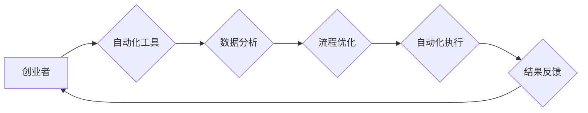

                 

## 自动化创业中的人机协作

> 关键词：自动化、创业、人机协作、人工智能、机器学习、流程自动化、数据分析、决策支持

## 1. 背景介绍

在当今科技飞速发展的时代，创业者面临着前所未有的机遇和挑战。一方面，新兴技术如人工智能、机器学习等为创业提供了强大的工具和资源，另一方面，竞争日益激烈，创业者需要更高效、更智能的方式来应对挑战。自动化创业，即利用技术手段自动化完成创业过程中重复性、耗时的任务，成为创业者追求效率和创新的重要方向。

人机协作，即人与机器共同完成任务，在自动化创业中扮演着至关重要的角色。它不仅可以帮助创业者提高效率，还能激发创造力，最终实现创业目标。

## 2. 核心概念与联系

### 2.1 自动化创业

自动化创业是指利用技术手段，将创业过程中重复性、耗时的任务自动化，从而提高效率、降低成本、释放人力资源，专注于更具战略意义的决策和创新。

### 2.2 人机协作

人机协作是指人与机器共同完成任务，充分发挥各自的优势，实现协同工作。

**人机协作在自动化创业中的关系：**

* 人提供创意、战略决策、情感理解等高层次的能力。
* 机器提供数据分析、流程自动化、重复性任务执行等低层次的能力。

**人机协作模式：**

* **监督式协作:** 人员对机器的决策和执行进行监督和控制。
* **协同式协作:** 人员和机器共同参与决策和执行，相互补充。
* **分工式协作:** 人员和机器分别负责不同的任务，并通过数据交换进行协同。

**Mermaid 流程图：**



## 3. 核心算法原理 & 具体操作步骤

### 3.1 算法原理概述

自动化创业的核心算法原理主要包括：

* **机器学习:** 利用算法从数据中学习模式，自动完成预测、分类、聚类等任务。
* **自然语言处理:** 处理和理解人类语言，用于自动生成文本、翻译语言、分析用户反馈等。
* **流程自动化:** 自动化完成重复性、规则性任务，例如数据录入、报表生成、邮件发送等。

### 3.2 算法步骤详解

**机器学习算法步骤:**

1. **数据收集:** 收集与创业相关的各种数据，例如市场数据、用户数据、财务数据等。
2. **数据预处理:** 对收集到的数据进行清洗、转换、特征提取等处理，使其适合机器学习算法的训练。
3. **模型选择:** 根据创业目标和数据特点选择合适的机器学习算法，例如回归算法、分类算法、聚类算法等。
4. **模型训练:** 利用训练数据训练机器学习模型，使其能够学习数据中的模式。
5. **模型评估:** 利用测试数据评估模型的性能，例如准确率、召回率、F1-score等。
6. **模型部署:** 将训练好的模型部署到实际应用场景中，用于完成预测、分类、聚类等任务。

**流程自动化步骤:**

1. **流程识别:** 识别创业过程中需要自动化的流程，例如客户 onboarding 流程、订单处理流程、财务报表生成流程等。
2. **流程建模:** 建立流程的流程图，明确每个步骤的执行者、输入、输出等信息。
3. **自动化工具选择:** 选择合适的自动化工具，例如 RPA、BPM 等，用于实现流程自动化。
4. **流程配置:** 配置自动化工具，按照流程图的步骤进行自动化执行。
5. **流程测试:** 测试自动化流程的正确性、效率和可靠性。
6. **流程部署:** 将自动化流程部署到实际应用场景中，用于自动完成流程执行。

### 3.3 算法优缺点

**机器学习算法:**

* **优点:** 可以自动学习数据模式，提高预测准确率，自动化完成复杂任务。
* **缺点:** 需要大量数据进行训练，训练过程耗时，对数据质量要求高，解释性较差。

**流程自动化算法:**

* **优点:** 可以提高效率，降低成本，减少人为错误，释放人力资源。
* **缺点:** 需要对流程进行详细建模，自动化程度有限，难以处理复杂、非结构化的流程。

### 3.4 算法应用领域

* **市场分析:** 利用机器学习算法分析市场数据，预测市场趋势，识别潜在客户。
* **产品开发:** 利用机器学习算法分析用户反馈，改进产品功能，开发新产品。
* **运营管理:** 利用流程自动化工具自动化完成运营任务，例如客户服务、订单处理、财务管理等。
* **营销推广:** 利用机器学习算法进行精准营销，提高营销效果。

## 4. 数学模型和公式 & 详细讲解 & 举例说明

### 4.1 数学模型构建

在自动化创业中，可以使用数学模型来描述和预测创业过程中的各种现象。例如，可以使用线性回归模型来预测市场需求，可以使用Logistic 回归模型来预测客户转化率。

### 4.2 公式推导过程

**线性回归模型:**

目标是找到一条直线，使得这条直线与数据点之间的距离最小。

$$
y = mx + c
$$

其中：

* $y$ 是预测值
* $x$ 是输入变量
* $m$ 是斜率
* $c$ 是截距

**最小二乘法:**

使用最小二乘法来求解 $m$ 和 $c$ 的值，使得误差平方和最小。

$$
\min_{m,c} \sum_{i=1}^{n} (y_i - mx_i - c)^2
$$

### 4.3 案例分析与讲解

**案例:** 假设我们想要预测一个新产品的销售量，已知该产品的价格和市场营销投入。我们可以使用线性回归模型来建立预测模型。

* $x_1$：产品价格
* $x_2$：市场营销投入
* $y$：销售量

根据历史数据，我们可以使用最小二乘法求解 $m$ 和 $c$ 的值，得到预测模型：

$$
y = 0.5x_1 + 0.2x_2 + 10
$$

这意味着，每增加 1 元的价格，销售量会增加 0.5 单位；每增加 1 元的市场营销投入，销售量会增加 0.2 单位；基础销售量为 10 单位。

## 5. 项目实践：代码实例和详细解释说明

### 5.1 开发环境搭建

* Python 3.x
* Jupyter Notebook
* scikit-learn 库
* pandas 库
* matplotlib 库

### 5.2 源代码详细实现

```python
import pandas as pd
from sklearn.linear_model import LinearRegression
from sklearn.model_selection import train_test_split
import matplotlib.pyplot as plt

# 加载数据
data = pd.read_csv('sales_data.csv')

# 准备数据
X = data[['price', 'marketing']]
y = data['sales']

# 将数据分成训练集和测试集
X_train, X_test, y_train, y_test = train_test_split(X, y, test_size=0.2, random_state=42)

# 创建线性回归模型
model = LinearRegression()

# 训练模型
model.fit(X_train, y_train)

# 预测测试集数据
y_pred = model.predict(X_test)

# 评估模型性能
print('Coefficients:', model.coef_)
print('Intercept:', model.intercept_)
print('R-squared:', model.score(X_test, y_test))

# 可视化预测结果
plt.scatter(y_test, y_pred)
plt.xlabel('Actual Sales')
plt.ylabel('Predicted Sales')
plt.title('Linear Regression Model')
plt.show()
```

### 5.3 代码解读与分析

* 首先，我们加载数据并准备数据，将价格和市场营销投入作为输入变量，销售量作为输出变量。
* 然后，我们将数据分成训练集和测试集，用于训练和评估模型。
* 创建线性回归模型并训练模型，使用训练集数据来学习模型参数。
* 预测测试集数据，并评估模型性能，例如 R-squared 值。
* 最后，可视化预测结果，观察模型的预测效果。

### 5.4 运行结果展示

运行代码后，会输出模型的系数、截距和 R-squared 值，以及预测结果的可视化图。

## 6. 实际应用场景

### 6.1 市场分析

* 利用机器学习算法分析市场数据，预测市场趋势，识别潜在客户。
* 例如，可以利用机器学习算法分析用户搜索行为、购买记录等数据，预测哪些产品或服务有更高的市场需求。

### 6.2 产品开发

* 利用机器学习算法分析用户反馈，改进产品功能，开发新产品。
* 例如，可以利用机器学习算法分析用户评论、反馈表单等数据，识别用户对产品功能的满意度和改进建议。

### 6.3 运营管理

* 利用流程自动化工具自动化完成运营任务，例如客户服务、订单处理、财务管理等。
* 例如，可以利用 RPA 工具自动化完成客户服务回复、订单处理流程等，提高运营效率。

### 6.4 未来应用展望

* 人机协作将更加智能化，机器学习算法将更加精准，自动化创业将更加高效。
* 人工智能技术将进一步融入创业各个环节，例如自动生成商业计划书、自动进行市场调研等。
* 创业者将更加注重数据分析和决策支持，利用数据驱动创业决策。

## 7. 工具和资源推荐

### 7.1 学习资源推荐

* **在线课程:** Coursera、edX、Udacity 等平台提供机器学习、数据分析等方面的在线课程。
* **书籍:** 《Python机器学习实战》、《深度学习》等书籍可以帮助你深入了解机器学习和人工智能相关知识。
* **博客和论坛:** 机器学习和人工智能领域的博客和论坛可以让你了解最新的技术趋势和最佳实践。

### 7.2 开发工具推荐

* **Python:** 作为机器学习和数据分析的常用语言，Python 提供了丰富的库和工具，例如 scikit-learn、pandas、matplotlib 等。
* **R:** 另一个流行的数据分析语言，R 也提供了许多用于机器学习和统计分析的包。
* **Jupyter Notebook:** 一个交互式笔记本环境，方便进行代码编写、数据分析和可视化。

### 7.3 相关论文推荐

* **《ImageNet Classification with Deep Convolutional Neural Networks》:** 这篇论文介绍了深度卷积神经网络在图像分类领域的应用，对计算机视觉领域产生了重大影响。
* **《Attention Is All You Need》:** 这篇论文提出了 Transformer 模型，一种新的序列到序列模型，在自然语言处理领域取得了突破性进展。

## 8. 总结：未来发展趋势与挑战

### 8.1 研究成果总结

自动化创业利用人工智能、机器学习等技术，可以帮助创业者提高效率、降低成本、释放人力资源，专注于更具战略意义的决策和创新。

### 8.2 未来发展趋势

* 人机协作将更加智能化，机器学习算法将更加精准，自动化创业将更加高效。
* 人工智能技术将进一步融入创业各个环节，例如自动生成商业计划书、自动进行市场调研等。
* 创业者将更加注重数据分析和决策支持，利用数据驱动创业决策。

### 8.3 面临的挑战

* 数据质量问题：机器学习算法对数据质量要求高，数据不准确或不完整会影响模型的性能。
* 模型解释性问题：一些机器学习算法的决策过程难以解释，这可能会导致创业者对模型结果缺乏信任。
* 伦理问题：人工智能技术的发展也带来了伦理问题，例如算法偏见、数据隐私等，需要引起重视和解决。

### 8.4 研究展望

* 研究更鲁棒、更解释性强的机器学习算法。
* 研究如何更好地利用数据分析和决策支持，帮助创业者做出更明智的决策。
* 研究人工智能技术在创业领域的伦理问题，并制定相应的规范和制度。

## 9. 附录：常见问题与解答

### 9.1 如何选择合适的机器学习算法？

选择合适的机器学习算法取决于具体的创业目标和数据特点。例如，如果要预测连续数值，可以使用回归算法；如果要分类数据，可以使用分类算法；如果要发现数据中的聚类，可以使用聚类算法。

### 9.2 如何处理数据质量问题？

数据质量问题是机器学习算法面临的常见挑战。可以采取以下措施来处理数据质量问题：

* 数据清洗：删除重复数据、缺失值和错误数据。
* 数据转换：将数据转换为适合机器学习算法的格式。
* 数据特征工程：提取新的特征，提高数据的表达能力。

### 9.3 如何评估机器学习模型的性能？

可以使用多种指标来评估机器学习模型的性能，例如准确率、召回率、F1-score、AUC 等。选择合适的评估指标取决于具体的创业目标和数据特点。


作者：禅与计算机程序设计艺术 / Zen and the Art of Computer Programming 
<end_of_turn>

