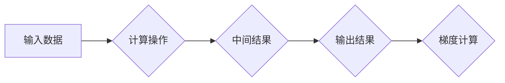

                 

## 自动微分：PyTorch与JAX的核心魔法

> 关键词：自动微分、PyTorch、JAX、梯度计算、深度学习、机器学习、数值计算

## 1. 背景介绍

深度学习的蓬勃发展离不开自动微分这一强大的技术。自动微分是指自动计算函数的梯度，它为深度学习模型的训练提供了高效的解决方案。传统的数值微分方法虽然可以计算梯度，但效率低下，难以处理复杂的模型结构。自动微分算法则能够高效地计算任意复杂函数的梯度，为深度学习模型的训练提供了强大的支持。

PyTorch和JAX是目前深度学习领域的两大主流框架，它们都内置了高效的自动微分引擎。PyTorch的自动微分引擎基于静态图的计算图，而JAX的自动微分引擎则基于动态图的计算图。两种引擎各有优缺点，但都为深度学习模型的训练提供了强大的工具。

## 2. 核心概念与联系

### 2.1 自动微分原理

自动微分的核心思想是通过链式法则和微分规则，将复杂的函数分解成一系列简单的微分操作，并逐级计算梯度。

**计算图**是自动微分算法的核心数据结构。计算图是一个有向图，其中每个节点代表一个操作，每个边代表一个数据流。通过构建计算图，我们可以将复杂的函数表示成一系列简单的操作，并利用链式法则高效地计算梯度。

**链式法则**是自动微分算法的基础。它指出，复合函数的导数等于各个子函数导数的乘积。通过链式法则，我们可以将复杂的函数梯度分解成一系列子函数梯度的乘积，并逐级计算。

### 2.2 PyTorch与JAX的自动微分引擎

**PyTorch**

PyTorch的自动微分引擎基于**静态图**。这意味着在执行计算之前，PyTorch会先构建整个计算图，并根据图结构计算梯度。静态图的优点是计算效率高，缺点是模型结构需要提前确定。

**JAX**

JAX的自动微分引擎基于**动态图**。这意味着JAX会在计算过程中动态构建计算图，并根据计算结果计算梯度。动态图的优点是模型结构更加灵活，缺点是计算效率相对较低。

**Mermaid 流程图**



## 3. 核心算法原理 & 具体操作步骤

### 3.1 算法原理概述

自动微分算法的核心是利用链式法则和微分规则，将复杂的函数分解成一系列简单的微分操作，并逐级计算梯度。

**链式法则**

对于复合函数 $f(g(x))$，其导数为：

$$
\frac{df}{dx} = \frac{df}{dg} \cdot \frac{dg}{dx}
$$

**微分规则**

对于常见的数学运算，例如加法、减法、乘法、除法等，都有对应的微分规则。

### 3.2 算法步骤详解

1. **构建计算图:** 将函数分解成一系列操作，并构建相应的计算图。
2. **前向传播:** 根据计算图，计算函数的输出值。
3. **反向传播:** 从输出值开始，利用链式法则和微分规则，逐级计算每个操作的梯度。
4. **更新参数:** 根据计算的梯度，更新模型的参数。

### 3.3 算法优缺点

**优点:**

* **高效:** 自动微分算法能够高效地计算任意复杂函数的梯度。
* **灵活:** 可以应用于各种类型的函数和模型。
* **易于使用:** PyTorch和JAX等框架都提供了方便的自动微分接口。

**缺点:**

* **内存消耗:** 计算图的构建和存储可能消耗大量内存。
* **可解释性:** 计算图的结构可能难以理解，导致模型的可解释性降低。

### 3.4 算法应用领域

自动微分算法广泛应用于深度学习、机器学习、数值计算等领域。

* **深度学习:** 自动微分是深度学习模型训练的基础。
* **机器学习:** 自动微分可以用于优化机器学习模型的参数。
* **数值计算:** 自动微分可以用于求解复杂的微分方程。

## 4. 数学模型和公式 & 详细讲解 & 举例说明

### 4.1 数学模型构建

假设我们有一个函数 $f(x)$，其中 $x$ 是输入向量，$f(x)$ 是输出值。我们的目标是计算 $f(x)$ 对 $x$ 的梯度，即 $\frac{df}{dx}$。

### 4.2 公式推导过程

根据链式法则，我们可以将 $\frac{df}{dx}$ 表示为：

$$
\frac{df}{dx} = \frac{df}{dz} \cdot \frac{dz}{dx}
$$

其中 $z$ 是 $f(x)$ 的中间变量。

### 4.3 案例分析与讲解

**例子:**

假设我们有一个函数 $f(x) = x^2$。

1. 我们可以将 $f(x)$ 表示为 $f(x) = z^2$，其中 $z = x$。
2. 则 $\frac{df}{dz} = 2z$ 和 $\frac{dz}{dx} = 1$。
3. 根据链式法则，我们可以得到 $\frac{df}{dx} = \frac{df}{dz} \cdot \frac{dz}{dx} = 2z \cdot 1 = 2x$。

## 5. 项目实践：代码实例和详细解释说明

### 5.1 开发环境搭建

* Python 3.7+
* PyTorch 1.7+ 或 JAX 0.3+

### 5.2 源代码详细实现

**PyTorch**

```python
import torch

# 定义一个简单的函数
def f(x):
  return x**2

# 创建一个张量
x = torch.randn(1)

# 计算梯度
y = f(x)
y.backward()

# 打印梯度
print(x.grad)
```

**JAX**

```python
import jax
import jax.numpy as jnp

# 定义一个简单的函数
def f(x):
  return x**2

# 创建一个数组
x = jax.random.normal(jax.random.PRNGKey(0), shape=(1,))

# 计算梯度
y = f(x)
grad_fn = jax.grad(f)
grad = grad_fn(x)

# 打印梯度
print(grad)
```

### 5.3 代码解读与分析

* **PyTorch:** 使用 `torch.autograd.grad()` 函数计算梯度。
* **JAX:** 使用 `jax.grad()` 函数计算梯度。

### 5.4 运行结果展示

运行上述代码，可以得到相应的梯度值。

## 6. 实际应用场景

### 6.1 深度学习模型训练

自动微分是深度学习模型训练的基础。通过自动微分，我们可以高效地计算模型参数的梯度，并利用梯度下降算法更新模型参数，从而训练出更准确的模型。

### 6.2 机器学习模型优化

自动微分可以用于优化机器学习模型的参数。例如，我们可以使用自动微分来计算支持向量机模型的核函数的梯度，并利用梯度下降算法优化核函数的参数。

### 6.3 数值计算

自动微分可以用于求解复杂的微分方程。例如，我们可以使用自动微分来求解Navier-Stokes方程，该方程描述流体的运动。

### 6.4 未来应用展望

随着深度学习和人工智能技术的不断发展，自动微分将在更多领域得到应用。例如，我们可以使用自动微分来优化控制系统、设计新的算法、分析复杂数据等。

## 7. 工具和资源推荐

### 7.1 学习资源推荐

* **PyTorch官方文档:** https://pytorch.org/docs/stable/index.html
* **JAX官方文档:** https://jax.readthedocs.io/en/latest/
* **深度学习书籍:** 《深度学习》

### 7.2 开发工具推荐

* **PyCharm:** https://www.jetbrains.com/pycharm/
* **VS Code:** https://code.visualstudio.com/

### 7.3 相关论文推荐

* **Automatic Differentiation in Machine Learning:** https://arxiv.org/abs/1604.06188
* **JAX: NumPy for the Multi-core Age:** https://arxiv.org/abs/1906.08401

## 8. 总结：未来发展趋势与挑战

### 8.1 研究成果总结

自动微分技术已经取得了显著的成果，为深度学习和人工智能的发展做出了重要贡献。

### 8.2 未来发展趋势

* **更高效的自动微分算法:** 研究人员将继续探索更高效的自动微分算法，以提高计算速度和降低内存消耗。
* **更广泛的应用场景:** 自动微分技术将在更多领域得到应用，例如控制系统、优化算法、科学计算等。
* **更强大的自动微分工具:** 开发人员将继续开发更强大的自动微分工具，以方便用户使用和应用自动微分技术。

### 8.3 面临的挑战

* **可解释性:** 自动微分算法的计算过程可能难以理解，导致模型的可解释性降低。
* **复杂模型:** 对于非常复杂的模型，自动微分算法的计算效率可能下降。
* **硬件限制:** 自动微分算法的计算量较大，需要强大的硬件支持。

### 8.4 研究展望

未来，自动微分技术将继续发展，并为深度学习和人工智能的发展带来更多创新。


## 9. 附录：常见问题与解答

### 9.1 什么是自动微分？

自动微分是指自动计算函数的梯度，它为深度学习模型的训练提供了高效的解决方案。

### 9.2 PyTorch和JAX的自动微分引擎有什么区别？

PyTorch的自动微分引擎基于静态图，而JAX的自动微分引擎则基于动态图。

### 9.3 如何使用自动微分进行深度学习模型训练？

可以使用PyTorch或JAX框架中的自动微分功能，计算模型参数的梯度，并利用梯度下降算法更新模型参数。


作者：禅与计算机程序设计艺术 / Zen and the Art of Computer Programming 
<end_of_turn>

