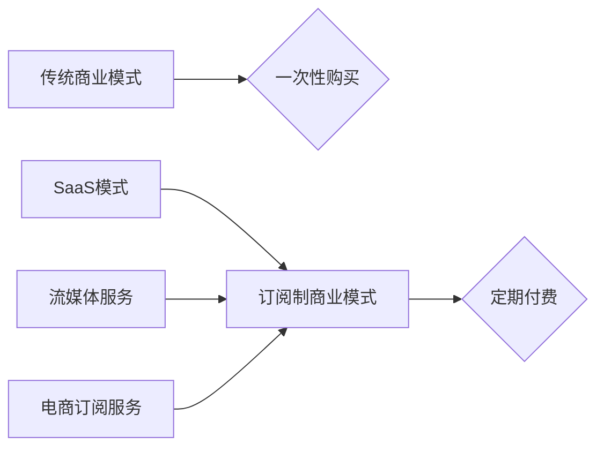

                 

## 关键词：订阅制商业模式， SaaS，订阅服务，收入预测，客户留存，用户体验，竞争优势

## 1. 背景介绍

随着互联网技术的蓬勃发展和云计算的普及，订阅制商业模式（Subscription Business Model）逐渐成为一种流行的商业模式，尤其是在软件行业中。订阅制商业模式是指企业通过向用户提供持续的服务或产品，并以定期付费的方式获取收入。这种模式与传统的一次性购买模式相比，具有许多独特的优势和挑战。

### 1.1 订阅制商业模式的兴起

订阅制商业模式的兴起与以下几个因素密切相关：

* **互联网技术的进步**: 互联网技术的快速发展使得企业能够更方便地向用户提供在线服务和产品，并通过网络平台进行交易。
* **云计算的普及**: 云计算的普及使得企业能够更灵活地提供服务，并根据用户的需求进行按需付费。
* **用户消费习惯的变化**: 用户越来越倾向于订阅服务，而不是一次性购买产品。这主要是因为订阅服务能够提供更灵活、更便捷的消费体验。

### 1.2 订阅制商业模式的应用场景

订阅制商业模式广泛应用于各个行业，例如：

* **软件行业**: SaaS（软件即服务）模式是订阅制商业模式在软件行业最常见的应用场景。例如，Microsoft Office 365、Adobe Creative Cloud 等都是基于订阅模式的软件服务。
* **媒体行业**: 订阅制模式也被广泛应用于媒体行业，例如，Netflix、Spotify、Amazon Prime Video 等都是基于订阅模式的流媒体服务。
* **电商行业**: 一些电商平台也开始采用订阅模式，例如，Amazon Subscribe & Save、Dollar Shave Club 等。

## 2. 核心概念与联系

订阅制商业模式的核心概念包括：

* **订阅服务**: 企业向用户提供持续的服务或产品，用户需要定期付费才能继续使用。
* **订阅周期**: 订阅服务的付费周期，可以是每月、每年或其他周期。
* **订阅价格**: 用户为订阅服务支付的费用，可以是固定价格或根据使用情况进行计费。
* **客户留存**: 订阅服务的客户持续使用服务的比例，是衡量订阅制商业模式成功的重要指标。

订阅制商业模式与其他商业模式的关系可以概括如下：



## 3. 核心算法原理 & 具体操作步骤

订阅制商业模式的核心算法原理在于 **预测收入和管理客户留存**。

### 3.1 算法原理概述

* **收入预测**: 通过分析历史数据，预测未来订阅收入。常用的算法包括时间序列分析、回归分析等。
* **客户留存**: 通过分析用户行为数据，预测用户是否会续订订阅服务。常用的算法包括生存分析、客户生命周期分析等。

### 3.2 算法步骤详解

1. **数据收集**: 收集用户行为数据，例如订阅时间、使用频率、付费情况等。
2. **数据预处理**: 对收集到的数据进行清洗、转换和特征工程，以便于算法训练。
3. **模型训练**: 使用机器学习算法对数据进行训练，建立收入预测和客户留存模型。
4. **模型评估**: 使用测试数据对模型进行评估，并根据评估结果进行模型调优。
5. **模型部署**: 将训练好的模型部署到生产环境中，用于实时预测收入和客户留存。

### 3.3 算法优缺点

* **优点**: 能够准确预测收入和客户留存，帮助企业制定更有效的商业策略。
* **缺点**: 需要大量的历史数据进行训练，模型的准确性依赖于数据质量。

### 3.4 算法应用领域

* **软件行业**: 预测 SaaS 产品的订阅收入和客户留存率。
* **媒体行业**: 预测流媒体服务的订阅用户数和付费率。
* **电商行业**: 预测电商平台的订阅服务收入和用户活跃度。

## 4. 数学模型和公式 & 详细讲解 & 举例说明

### 4.1 数学模型构建

订阅制商业模式的收入预测模型可以构建为以下形式：

$$
R(t) = f(D(t), P(t), L(t))
$$

其中：

* $R(t)$ 表示在时间 $t$ 时的订阅收入。
* $D(t)$ 表示在时间 $t$ 时的订阅用户数。
* $P(t)$ 表示在时间 $t$ 时的平均订阅价格。
* $L(t)$ 表示在时间 $t$ 时的客户留存率。

### 4.2 公式推导过程

订阅收入 $R(t)$ 可以通过以下公式推导：

$$
R(t) = D(t) \times P(t) \times (1 - L(t))
$$

其中：

* $D(t) \times P(t)$ 表示在时间 $t$ 时的总订阅费用。
* $(1 - L(t))$ 表示在时间 $t$ 时的用户流失率。

### 4.3 案例分析与讲解

假设一家 SaaS 公司在时间 $t$ 时的订阅用户数为 1000 人，平均订阅价格为 $100/年，客户留存率为 80%。那么，该公司的订阅收入为：

$$
R(t) = 1000 \times 100 \times (1 - 0.8) = 20000
$$

## 5. 项目实践：代码实例和详细解释说明

### 5.1 开发环境搭建

* 操作系统：Windows/macOS/Linux
* 编程语言：Python
* 库依赖：pandas, numpy, scikit-learn

### 5.2 源代码详细实现

```python
import pandas as pd
from sklearn.linear_model import LinearRegression

# 加载数据
data = pd.read_csv('subscription_data.csv')

# 数据预处理
# ...

# 训练模型
model = LinearRegression()
model.fit(X_train, y_train)

# 预测收入
predictions = model.predict(X_test)

# 评估模型
# ...
```

### 5.3 代码解读与分析

* 数据加载：使用 pandas 库加载订阅数据。
* 数据预处理：对数据进行清洗、转换和特征工程，例如处理缺失值、编码类别变量等。
* 模型训练：使用 scikit-learn 库的线性回归模型训练收入预测模型。
* 预测收入：使用训练好的模型预测未来订阅收入。
* 模型评估：使用测试数据评估模型的准确性，例如使用均方误差 (MSE) 或 R-squared 等指标。

### 5.4 运行结果展示

运行代码后，可以得到预测的订阅收入值，并通过图表或其他方式进行展示。

## 6. 实际应用场景

订阅制商业模式在各个行业都有广泛的应用场景，例如：

### 6.1 软件行业

* **SaaS 产品**: 例如，Microsoft Office 365、Adobe Creative Cloud 等都是基于订阅模式的软件服务。
* **游戏行业**: 例如，Fortnite、League of Legends 等游戏采用免费游戏 + 订阅服务模式，提供额外的游戏内容和功能。

### 6.2 媒体行业

* **流媒体服务**: 例如，Netflix、Spotify、Amazon Prime Video 等都是基于订阅模式的流媒体服务。
* **数字出版**: 例如，一些杂志和书籍开始采用订阅模式，提供定期更新的内容。

### 6.3 电商行业

* **订阅盒**: 例如，Dollar Shave Club、Birchbox 等提供定期配送订阅盒的服务。
* **会员服务**: 例如，Amazon Prime、Walmart+ 等电商平台提供会员服务，提供免费配送、折扣等优惠。

### 6.4 未来应用展望

随着技术的进步和用户习惯的变化，订阅制商业模式将继续发展和演变，应用场景也将更加广泛。例如：

* **个性化订阅**: 根据用户的需求和喜好，提供个性化的订阅服务。
* **混合订阅**: 将订阅模式与其他商业模式相结合，例如免费试用 + 订阅服务。
* **物联网订阅**: 将订阅模式应用于物联网设备，提供设备管理、数据分析等服务。

## 7. 工具和资源推荐

### 7.1 学习资源推荐

* **书籍**:
    * 《订阅制商业模式》
    * 《The Subscription Economy》
* **在线课程**:
    * Coursera 上的《Subscription Business Models》课程
    * Udemy 上的《Subscription Business Model Mastery》课程

### 7.2 开发工具推荐

* **数据分析工具**: pandas, NumPy, Scikit-learn
* **云平台**: AWS, Azure, Google Cloud
* **数据库**: MySQL, PostgreSQL, MongoDB

### 7.3 相关论文推荐

* **Subscription Business Models: A Literature Review**
* **The Impact of Subscription Models on Customer Retention**

## 8. 总结：未来发展趋势与挑战

### 8.1 研究成果总结

订阅制商业模式已经成为一种成熟的商业模式，并取得了显著的成功。通过分析收入预测和客户留存算法，企业能够更有效地管理订阅服务，并提高盈利能力。

### 8.2 未来发展趋势

订阅制商业模式将继续发展和演变，未来发展趋势包括：

* **个性化订阅**: 根据用户的需求和喜好，提供个性化的订阅服务。
* **混合订阅**: 将订阅模式与其他商业模式相结合，例如免费试用 + 订阅服务。
* **物联网订阅**: 将订阅模式应用于物联网设备，提供设备管理、数据分析等服务。

### 8.3 面临的挑战

订阅制商业模式也面临一些挑战，例如：

* **客户留存**: 提高客户留存率是订阅制商业模式的关键，需要不断优化服务和体验。
* **竞争**: 订阅制商业模式的竞争日益激烈，需要企业不断创新和 differentiation。
* **数据安全**: 订阅服务需要收集和处理大量用户数据，需要确保数据安全和隐私。

### 8.4 研究展望

未来研究方向包括：

* **更精准的收入预测模型**: 开发更精准的收入预测模型，能够更好地预测未来订阅收入。
* **更有效的客户留存策略**: 研究更有效的客户留存策略，提高客户留存率。
* **订阅模式的应用场景**: 探索订阅模式在更多领域的应用场景，例如教育、医疗等。

## 9. 附录：常见问题与解答

* **什么是订阅制商业模式？**

订阅制商业模式是指企业通过向用户提供持续的服务或产品，并以定期付费的方式获取收入。

* **订阅制商业模式的优势有哪些？**

订阅制商业模式的优势包括：

* **稳定的收入流**: 订阅收入更加稳定，能够更好地预测未来收入。
* **更强的客户粘性**: 订阅服务能够建立更强的客户粘性，提高客户忠诚度。
* **更灵活的商业模式**: 订阅模式能够根据用户的需求进行灵活调整，例如提供不同订阅周期和价格方案。

* **订阅制商业模式的挑战有哪些？**

订阅制商业模式的挑战包括：

* **客户留存**: 提高客户留存率是订阅制商业模式的关键，需要不断优化服务和体验。
* **竞争**: 订阅制商业模式的竞争日益激烈，需要企业不断创新和 differentiation。
* **数据安全**: 订阅服务需要收集和处理大量用户数据，需要确保数据安全和隐私。


作者：禅与计算机程序设计艺术 / Zen and the Art of Computer Programming 
<end_of_turn>

