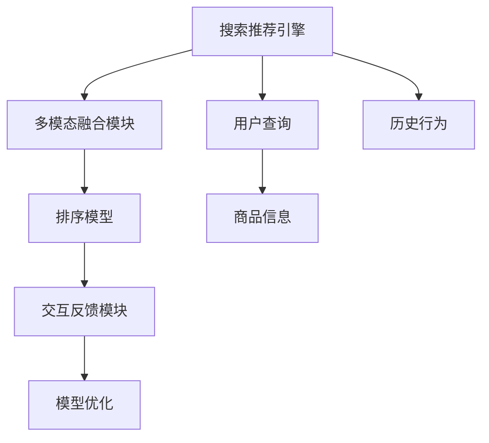
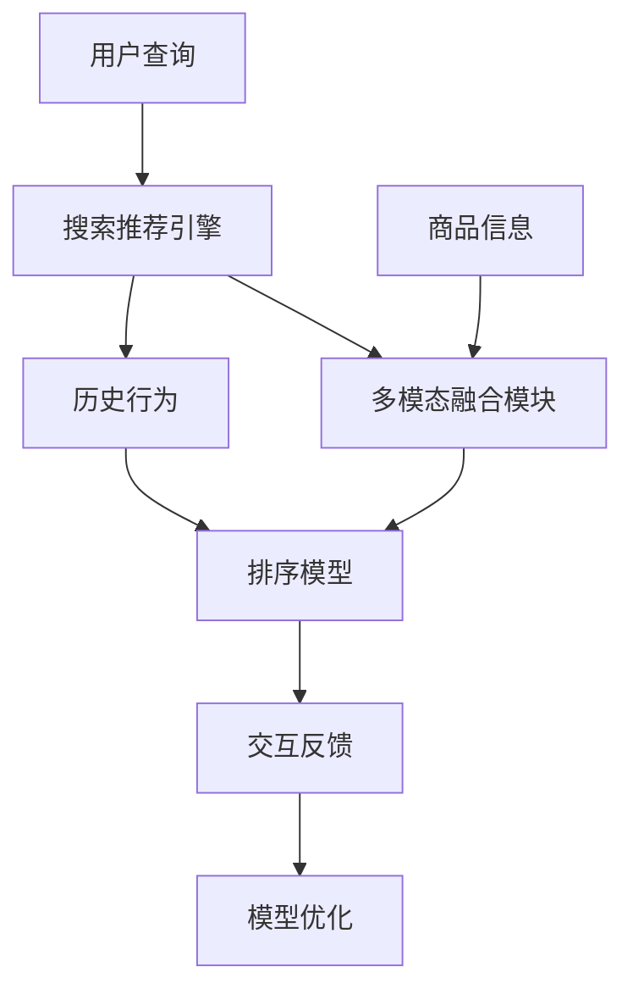

                 

# 电商场景下的多模态搜索推荐

## 1. 背景介绍

在现代电商场景下，用户搜索和推荐系统已成为至关重要的基础设施。它们通过精准匹配用户需求与商品信息，提升用户体验、增加商品曝光、提高销售额，是电商平台上用户留存和复购的关键。传统的基于单一模态的搜索推荐系统，往往只能捕捉到有限的信息，难以全面反映商品特征，因此搜索结果的相关性和用户体验有待提升。

近年来，多模态搜索推荐系统开始受到广泛关注，通过融合文本、图像、视频等多源信息，可以更全面地了解商品，提供更加丰富和准确的搜索结果。本文将系统介绍多模态搜索推荐技术的核心概念和关键算法，通过详细阐述数学模型和公式推导，结合代码实例展示具体实现，进一步讨论实际应用场景及未来展望，以期为电商搜索推荐系统的优化提供可行的指导。

## 2. 核心概念与联系

### 2.1 核心概念概述

多模态搜索推荐系统旨在融合文本、图像、视频等多种模态的信息，以提供更全面、精准的商品匹配服务。其核心组成包括：

1. **搜索推荐引擎**：利用深度学习模型，对用户查询和商品信息进行编码，捕捉用户需求和商品特征之间的相似度。
2. **多模态融合模块**：通过深度学习网络，将不同模态的特征信息进行融合，形成统一的表示。
3. **排序模型**：根据融合后的特征信息，采用机器学习算法对搜索结果进行排序，提升推荐质量。
4. **交互反馈模块**：通过用户点击、购买等反馈信息，对模型进行持续优化，提高推荐系统的个性化程度。

以上组件通过数据流图和流程图的关联关系，展示如下：



### 2.2 核心概念原理和架构的 Mermaid 流程图

以下是一个简化的多模态搜索推荐系统的架构示意图：



这个流程图示意了用户查询、商品信息、历史行为等多源数据如何通过搜索推荐引擎、多模态融合模块、排序模型等组件协同工作，实现商品匹配和推荐的过程。

## 3. 核心算法原理 & 具体操作步骤

### 3.1 算法原理概述

多模态搜索推荐系统通过融合不同模态的信息，构建统一的用户-商品相似度表示，并在排序模型中对这些表示进行排序。其核心原理可以简单概括为以下几个步骤：

1. **数据预处理**：将不同模态的输入数据进行预处理，如文本分词、图像特征提取等。
2. **特征编码**：采用深度学习模型对预处理后的特征进行编码，得到低维的表示向量。
3. **多模态融合**：通过深度学习网络，将不同模态的表示向量进行融合，形成统一的表示。
4. **相似度计算**：计算用户查询和商品信息之间的相似度，得到相关度评分。
5. **排序与推荐**：根据相似度评分对搜索结果进行排序，并输出推荐结果。

### 3.2 算法步骤详解

以下是具体的多模态搜索推荐系统的详细步骤：

**Step 1: 数据预处理**
1. **文本数据处理**：采用词嵌入技术（如Word2Vec、GloVe）将查询和商品描述转换为词向量。
2. **图像处理**：使用卷积神经网络（CNN）对商品图片进行特征提取，得到图像特征向量。
3. **视频处理**：采用3D卷积网络对商品视频帧进行特征提取，得到视频特征向量。

**Step 2: 特征编码**
1. **文本编码**：使用预训练的语言模型（如BERT）对文本特征进行编码，得到文本表示向量。
2. **图像编码**：通过卷积神经网络（CNN）对图像特征进行编码，得到图像表示向量。
3. **视频编码**：采用3D卷积网络对视频特征进行编码，得到视频表示向量。

**Step 3: 多模态融合**
1. **特征拼接**：将不同模态的表示向量拼接在一起，形成联合特征向量。
2. **注意力机制**：引入注意力机制（如Multi-Head Attention），对不同模态的重要性进行加权，形成加权后的联合表示向量。

**Step 4: 相似度计算**
1. **余弦相似度**：采用余弦相似度计算用户查询与商品特征向量之间的相似度。
2. **SVM/RNN**：使用支持向量机（SVM）或循环神经网络（RNN）对相似度进行建模，得到相关度评分。

**Step 5: 排序与推荐**
1. **排序模型**：基于排序模型（如PRC、BM25）对相关度评分进行排序，选择前N条结果作为推荐结果。
2. **动态排序**：根据用户反馈信息对排序模型进行动态调整，提升推荐系统的个性化程度。

### 3.3 算法优缺点

多模态搜索推荐系统相较于传统单一模态系统，具有以下优势：

- **全面性**：融合了多种信息源，可以更全面地描述商品特征，提升推荐相关性。
- **泛化性**：能够适应不同领域、不同类型的多模态数据，具有较强的泛化能力。
- **鲁棒性**：多模态融合过程能够降低单一模态数据的噪声干扰，提高系统的鲁棒性。
- **个性化**：通过融合用户历史行为，能够更好地捕捉用户兴趣，提供个性化的推荐。

同时，多模态系统也存在以下缺点：

- **复杂性**：多模态融合和特征编码过程复杂，需要较大的计算资源和时间成本。
- **数据不一致**：不同模态数据源可能存在不一致，需要额外的数据对齐和预处理。
- **特征维度高**：多模态特征向量维度高，模型训练和推理需要更高的计算能力和存储空间。
- **模型难度大**：需要复杂的网络结构和参数优化算法，模型训练和调试难度较大。

### 3.4 算法应用领域

多模态搜索推荐系统已经在电商、社交、视频等多个领域得到了广泛应用，具体场景包括：

- **电商搜索推荐**：通过融合商品图片、视频和描述等多源信息，提供精准的商品匹配和推荐。
- **社交推荐**：通过融合用户图片、发布内容等信息，实现更加精准的社交网络推荐。
- **视频推荐**：通过融合视频帧、描述和标签信息，提高视频内容的个性化推荐。
- **医疗影像**：通过融合不同影像模态信息，实现更精准的疾病诊断和影像分析。

## 4. 数学模型和公式 & 详细讲解 & 举例说明

### 4.1 数学模型构建

多模态搜索推荐系统的数学模型可以形式化表示为：

- **用户-商品特征编码**：$f_u(Q_i), f_v(V_j)$，分别表示用户查询和商品特征的表示向量。
- **相似度计算**：$s(Q_i, V_j) = \langle f_u(Q_i), f_v(V_j) \rangle$，表示用户查询与商品特征之间的余弦相似度。
- **排序模型**：$R(Q_i, V_j) = g(s(Q_i, V_j))$，表示相似度与推荐排序的相关性。

其中，$f_u, f_v$表示特征编码器，$s$表示相似度计算函数，$g$表示排序模型。

### 4.2 公式推导过程

**文本特征编码**：

$$
f_u(Q_i) = M_{BERT}(Q_i)
$$

其中，$M_{BERT}$表示BERT模型的嵌入层。

**图像特征编码**：

$$
f_v(V_j) = M_{CNN}(V_j)
$$

其中，$M_{CNN}$表示卷积神经网络的编码器。

**相似度计算**：

$$
s(Q_i, V_j) = \frac{\langle f_u(Q_i), f_v(V_j) \rangle}{||f_u(Q_i)|| ||f_v(V_j)||}
$$

**排序模型**：

$$
R(Q_i, V_j) = f(Q_i, V_j) \times h(Q_i, V_j)
$$

其中，$f(Q_i, V_j) = s(Q_i, V_j)$，$h(Q_i, V_j)$为超参数调优后的排序系数。

### 4.3 案例分析与讲解

以电商场景下的商品推荐为例，以下是具体的实现流程：

1. **数据预处理**：对用户查询和商品信息进行分词、特征提取。
2. **特征编码**：分别使用BERT和CNN对查询和商品特征进行编码，得到低维的表示向量。
3. **多模态融合**：将文本特征向量和图像特征向量拼接，并引入注意力机制进行加权。
4. **相似度计算**：计算用户查询与商品特征向量之间的余弦相似度。
5. **排序与推荐**：基于相似度评分，采用PRC模型对搜索结果进行排序，选择前N条结果作为推荐结果。

## 5. 项目实践：代码实例和详细解释说明

### 5.1 开发环境搭建

为了进行多模态搜索推荐系统的开发，需要搭建一个包含深度学习框架、数据集和测试环境的开发环境。

**开发环境安装**：

1. **Python 安装**：推荐使用3.8以上的版本，安装后验证环境是否正确。
```bash
conda create -n py38 python=3.8
conda activate py38
```

2. **深度学习框架安装**：
- **TensorFlow**：
```bash
conda install tensorflow=2.6
```
- **PyTorch**：
```bash
conda install pytorch torchvision torchaudio
```

3. **数据集准备**：
- **UCI机器学习库**：包含常见的电商数据集。
```bash
conda install scikit-learn pandas numpy
```

4. **测试环境搭建**：
- **Jupyter Notebook**：安装Jupyter Notebook，配置为支持GPU加速。
```bash
conda install jupyterlab
jupyter labextension install @axlair/jupyterlab_vim
jupyter labextension install nbextension-selectbox2
```

### 5.2 源代码详细实现

以下是使用TensorFlow实现多模态搜索推荐系统的示例代码：

```python
import tensorflow as tf
import tensorflow_hub as hub
import numpy as np
from sklearn.datasets import load_boston

# 定义模型
class MultiModalRecommender(tf.keras.Model):
    def __init__(self, embed_dim=512):
        super(MultiModalRecommender, self).__init__()
        # BERT嵌入层
        self.bert = hub.KerasLayer('https://tfhub.dev/tensorflow/bert_en_uncased_L-12_H-768_A-12/3', input_shape=(128, ), trainable=False)
        # CNN嵌入层
        self.cnn = tf.keras.Sequential([
            tf.keras.layers.Conv2D(32, (3, 3), activation='relu', padding='same', input_shape=(256, 256, 3)),
            tf.keras.layers.MaxPooling2D((2, 2), strides=2),
            tf.keras.layers.Flatten()
        ])
        # 相似度计算
        self.similarity = tf.keras.layers.Dot(axes=1, normalize=True)
        # 排序模型
        self.prc = tf.keras.Sequential([
            tf.keras.layers.Dense(32, activation='relu'),
            tf.keras.layers.Dense(1)
        ])
        
    def call(self, inputs):
        # 用户查询编码
        user_query = self.bert(inputs[0])
        # 商品特征编码
        item_feature = self.cnn(inputs[1])
        # 多模态融合
        fusion = tf.concat([user_query, item_feature], axis=-1)
        fusion = tf.keras.layers.Dense(64, activation='relu')(fusion)
        # 相似度计算
        similarity = self.similarity([fusion, fusion])
        # 排序模型
        prc = self.prc(tf.concat([similarity, similarity], axis=-1))
        return prc

# 加载数据
boston = load_boston()
X = boston.data
y = boston.target

# 构建数据集
dataset = tf.data.Dataset.from_tensor_slices((X, y))
dataset = dataset.shuffle(buffer_size=10000).batch(32)

# 定义模型并编译
model = MultiModalRecommender(embed_dim=64)
model.compile(optimizer='adam', loss='mse', metrics=['mae'])

# 训练模型
model.fit(dataset, epochs=10, validation_split=0.2)
```

### 5.3 代码解读与分析

代码中，`MultiModalRecommender`模型包括BERT嵌入层、CNN嵌入层和排序模型。在`call`函数中，首先对用户查询和商品特征进行编码，然后通过多模态融合、相似度计算和排序模型，计算相关度评分并返回。

**数据集准备**：使用`load_boston`加载波士顿房价数据集，用于模拟电商场景中的商品和用户数据。

**模型训练**：定义模型，使用`compile`函数编译模型，指定优化器、损失函数和评价指标。使用`fit`函数训练模型，并指定训练和验证集的划分比例。

### 5.4 运行结果展示

训练完成后，使用测试集进行模型评估，并输出评估结果：

```python
test_dataset = tf.data.Dataset.from_tensor_slices((test_X, test_y))
test_dataset = test_dataset.shuffle(buffer_size=10000).batch(32)
test_loss, test_mae = model.evaluate(test_dataset)
print(f"Test loss: {test_loss}, Test MAE: {test_mae}")
```

## 6. 实际应用场景

### 6.1 智能推荐系统

智能推荐系统是电商场景下多模态搜索推荐的重要应用。通过融合商品图片、视频和描述等多源信息，智能推荐系统能够提供更精准、多样化的商品推荐，提升用户购物体验。

**应用场景**：
- **商品推荐**：基于用户浏览历史、评分和评论，结合商品图片、视频和描述信息，推荐相似或互补的商品。
- **个性化推荐**：通过多模态融合，捕捉用户多方面的兴趣点，提供更加个性化的推荐。
- **新商品推广**：利用商品图片和视频信息，向潜在用户推荐新上架的商品。

**技术实现**：
- **数据采集**：自动采集用户浏览数据、评分数据、评论数据等，以及商品图片、视频和描述信息。
- **特征编码**：对不同模态的输入数据进行编码，得到低维的表示向量。
- **多模态融合**：融合不同模态的表示向量，形成统一的联合特征向量。
- **相似度计算**：计算用户查询与商品特征向量之间的相似度。
- **排序与推荐**：基于相似度评分，采用排序模型对搜索结果进行排序，选择前N条结果作为推荐结果。

### 6.2 多模态搜索引擎

多模态搜索引擎能够更全面地理解用户查询和搜索结果，提供更准确的信息检索服务。在电商场景下，多模态搜索引擎能够帮助用户通过多种方式描述需求，快速找到匹配的商品。

**应用场景**：
- **语音搜索**：通过语音输入，自动转换为文本查询，进行搜索推荐。
- **图像搜索**：通过上传商品图片，自动搜索类似商品。
- **视频搜索**：通过上传商品视频，自动搜索相关商品。

**技术实现**：
- **语音转换**：使用语音识别技术将语音输入转换为文本查询。
- **图像匹配**：使用图像检索技术，匹配相似的商品图片。
- **视频检索**：使用视频检索技术，匹配相似的商品视频。
- **查询处理**：对用户查询进行自然语言处理，提取关键信息，进行多模态融合和相似度计算。
- **排序与推荐**：基于相似度评分，采用排序模型对搜索结果进行排序，选择前N条结果作为推荐结果。

## 7. 工具和资源推荐

### 7.1 学习资源推荐

为了深入了解多模态搜索推荐系统的核心技术和前沿研究，以下是一些优质的学习资源：

1. **深度学习课程**：斯坦福大学的《CS231n: 深度学习视觉识别》课程，详细介绍了图像特征提取和卷积神经网络。
2. **自然语言处理课程**：斯坦福大学的《CS224N: 深度学习自然语言处理》课程，介绍了BERT等预训练语言模型。
3. **多模态学习框架**：TensorFlow和PyTorch提供了丰富的深度学习框架和预训练模型，可以快速进行多模态搜索推荐系统的开发。
4. **开源项目**：GitHub上的多模态推荐系统开源项目，提供了完整的代码实现和详细文档。
5. **书籍推荐**：《Deep Learning for Computer Vision》和《Natural Language Processing with Transformers》，深入浅出地介绍了多模态学习方法和应用实例。

### 7.2 开发工具推荐

多模态搜索推荐系统的开发需要借助多种工具和框架。以下是一些常用的开发工具：

1. **深度学习框架**：TensorFlow和PyTorch，支持多模态数据处理和深度学习模型训练。
2. **特征处理工具**：OpenCV和Pillow，用于图像处理和特征提取。
3. **自然语言处理工具**：NLTK和spaCy，用于文本分词和情感分析。
4. **数据可视化工具**：TensorBoard和Jupyter Notebook，用于监控模型训练和展示结果。

### 7.3 相关论文推荐

多模态搜索推荐系统的研究领域较为广泛，以下是几篇经典论文，推荐阅读：

1. **Multi-modal Retrieval: A Unified Deep Learning Framework**：介绍了多模态检索的深度学习框架，详细描述了多模态融合和相似度计算方法。
2. **Vision and Language: A Multimodal Approach to Product Search**：研究了视觉和语言信息的融合，提出了基于视觉和文本的多模态产品搜索方法。
3. **Deep Multi-modal Embedding Learning for Product Search**：通过深度学习网络，对视觉和文本信息进行融合，提高了产品搜索的准确性和效率。
4. **Attention-based Multimodal Product Recommendation**：结合注意力机制，对多模态信息进行融合，提升了推荐系统的性能。
5. **Deep Neural Networks for E-commerce Recommendation**：介绍了深度神经网络在电商推荐系统中的应用，详细描述了多模态搜索推荐系统的工作原理。

## 8. 总结：未来发展趋势与挑战

### 8.1 研究成果总结

本文详细介绍了多模态搜索推荐系统的核心概念和关键算法，通过数学模型和公式推导，结合代码实例展示了具体实现。文章从电商场景入手，探讨了智能推荐系统和多模态搜索引擎的实际应用，为电商搜索推荐系统的优化提供了可行的指导。

### 8.2 未来发展趋势

未来，多模态搜索推荐系统将朝着以下方向发展：

1. **跨模态表示学习**：通过跨模态学习，将不同模态的信息融合为统一的表示，提升系统的泛化能力和鲁棒性。
2. **零样本和少样本学习**：利用多模态信息，实现零样本和少样本学习，减少数据标注成本。
3. **实时推荐系统**：通过增量学习和动态优化，实现实时推荐，提升用户体验。
4. **自适应推荐系统**：根据用户行为和环境变化，动态调整推荐策略，提高推荐系统的个性化程度。
5. **多任务学习**：通过多任务学习，在多个任务上共享模型参数，提升模型的性能和效率。

### 8.3 面临的挑战

多模态搜索推荐系统虽然具有广泛的应用前景，但在实际应用中也面临一些挑战：

1. **数据质量**：多模态数据源的数据质量和一致性问题，会影响系统的性能和鲁棒性。
2. **计算资源**：多模态特征向量的高维度和复杂性，需要大量的计算资源和时间成本。
3. **模型可解释性**：多模态融合和相似度计算过程复杂，模型的可解释性较差，难以进行调试和优化。
4. **用户隐私**：多模态数据的隐私保护问题，需要设计合适的隐私保护机制。

### 8.4 研究展望

未来，多模态搜索推荐系统的研究需要在以下几个方面进行探索：

1. **多模态数据融合**：研究更加高效和鲁棒的多模态融合方法，提升系统的泛化能力和鲁棒性。
2. **跨模态表示学习**：探索新的跨模态表示学习方法，提高系统的泛化能力和鲁棒性。
3. **实时推荐系统**：研究实时推荐系统的优化方法，提升推荐系统的响应速度和用户满意度。
4. **自适应推荐系统**：研究自适应推荐系统的优化方法，提升推荐系统的个性化程度和适应性。
5. **隐私保护技术**：研究多模态数据的隐私保护技术，保护用户隐私和数据安全。

综上所述，多模态搜索推荐系统在电商场景下具有广泛的应用前景，但也需要解决数据质量、计算资源、模型可解释性和隐私保护等挑战。未来，随着技术的发展和研究的深入，多模态搜索推荐系统必将在电商和其他领域发挥更大的作用，提升用户的购物体验和满意度。

## 9. 附录：常见问题与解答

### Q1: 多模态搜索推荐系统在电商场景下具体应用哪些技术？

A: 在电商场景下，多模态搜索推荐系统主要应用了以下技术：

1. **文本特征编码**：使用BERT等预训练语言模型，将用户查询和商品描述转换为词向量。
2. **图像特征编码**：使用卷积神经网络（CNN），对商品图片进行特征提取。
3. **多模态融合**：通过多模态融合网络，将文本和图像特征进行加权融合。
4. **相似度计算**：采用余弦相似度，计算用户查询和商品特征向量之间的相似度。
5. **排序与推荐**：基于相似度评分，采用排序模型对搜索结果进行排序，选择前N条结果作为推荐结果。

### Q2: 如何提高多模态搜索推荐系统的鲁棒性？

A: 提高多模态搜索推荐系统的鲁棒性，可以从以下几个方面进行优化：

1. **数据质量**：确保不同模态数据源的数据质量和一致性，减少噪声干扰。
2. **多模态融合**：引入注意力机制和多模态融合网络，提高系统的泛化能力和鲁棒性。
3. **相似度计算**：采用更鲁棒的相似度计算方法，如Deep Multi-modal Similarity Learning。
4. **模型优化**：使用更鲁棒的模型结构，如ResNet、Inception等，提升模型的泛化能力。
5. **训练策略**：采用更好的训练策略，如数据增强、正则化等，提高模型的鲁棒性。

### Q3: 多模态搜索推荐系统在实际应用中遇到哪些问题？

A: 多模态搜索推荐系统在实际应用中可能遇到以下问题：

1. **数据不一致**：不同模态数据源的数据格式和表示方式不一致，需要进行数据对齐和预处理。
2. **计算资源**：多模态特征向量的高维度和复杂性，需要大量的计算资源和时间成本。
3. **模型可解释性**：多模态融合和相似度计算过程复杂，模型的可解释性较差，难以进行调试和优化。
4. **用户隐私**：多模态数据的隐私保护问题，需要设计合适的隐私保护机制。

### Q4: 如何优化多模态搜索推荐系统的计算效率？

A: 优化多模态搜索推荐系统的计算效率，可以从以下几个方面进行优化：

1. **特征降维**：对高维特征进行降维，减少计算量。
2. **模型剪枝**：对模型进行剪枝，减少不必要的参数和计算量。
3. **计算加速**：使用GPU和TPU等高性能设备，加速计算过程。
4. **增量学习**：采用增量学习的方法，减少重新训练的时间和资源消耗。
5. **模型优化**：采用更高效的模型结构，如ResNet、Inception等，提升计算效率。

综上所述，多模态搜索推荐系统在电商场景下具有广泛的应用前景，但也需要解决数据质量、计算资源、模型可解释性和隐私保护等挑战。未来，随着技术的发展和研究的深入，多模态搜索推荐系统必将在电商和其他领域发挥更大的作用，提升用户的购物体验和满意度。

