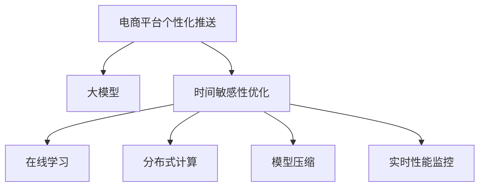

                 

# 电商平台个性化推送：AI大模型的时间敏感性优化

> 关键词：电商平台，个性化推送，时间敏感性优化，大模型，深度学习

## 1. 背景介绍

### 1.1 问题由来

在现代电商平台的运营中，个性化推送因其高效性、个性化和精准性而成为商家推广和用户发现的重要手段。传统的个性化推送方法依赖于用户行为数据的分析，但这些数据往往以静态的方式存在，缺乏对实时动态信息变化的敏感反应。而随着深度学习和大模型的兴起，基于大模型的个性化推送方法逐渐受到关注，其具备更强的泛化能力和表现力。

然而，大模型基于静态数据进行训练，对动态变化的信息难以即时响应，存在时间敏感性不足的问题。同时，大模型的推理计算资源消耗大，难以实时进行个性化推送。因此，如何优化大模型的时间敏感性，提升个性化推送的实时性和效果，成为电商平台个性化推送中亟待解决的问题。

### 1.2 问题核心关键点

时间敏感性优化是指在深度学习和大模型基础上，结合实时动态信息，对模型进行在线优化，以提升其对新数据变化的快速反应能力。关键点在于：

1. **动态信息捕获**：实时捕捉用户行为变化，如浏览记录、购买历史、评价等，作为输入数据的一部分，增强模型的动态响应能力。
2. **模型在线优化**：利用在线学习算法（如小批量随机梯度下降），将新数据即时更新到模型中，减少计算延迟，提升实时推送的准确性。
3. **高效计算技术**：引入分布式计算和模型压缩等技术，降低计算资源消耗，实现高并发下的高效推送。
4. **实时性能监控**：建立实时监控机制，及时发现模型性能问题，通过迭代优化保证系统稳定运行。

## 2. 核心概念与联系

### 2.1 核心概念概述

为更好地理解基于大模型的电商平台个性化推送方法，本节将介绍几个密切相关的核心概念：

- **电商平台个性化推送**：根据用户历史行为和实时动态信息，精准推送用户感兴趣的商品，提升用户转化率和购物体验。
- **大模型**：以深度神经网络为代表的庞大模型，通过大量标注数据进行训练，具备强大的泛化能力。
- **时间敏感性优化**：在静态模型基础上，结合动态信息，实现对新数据即时响应，提升模型的实时性能。
- **在线学习**：通过小批量随机梯度下降等在线算法，即时更新模型参数，适应动态数据变化。
- **分布式计算**：利用多台计算设备并行处理，提升计算效率，支持高并发推送。
- **模型压缩**：通过剪枝、量化等技术，减小模型规模，优化计算资源占用。
- **实时性能监控**：利用指标监控系统，实时跟踪模型性能，及时发现并解决性能问题。

这些核心概念之间的逻辑关系可以通过以下Mermaid流程图来展示：



这个流程图展示了大模型时间敏感性优化的核心概念及其之间的关系：

1. 电商平台个性化推送依赖于大模型，通过分析用户行为数据，生成个性化的商品推荐。
2. 时间敏感性优化是对大模型进行实时优化，提高对新数据变化的响应速度。
3. 在线学习、分布式计算、模型压缩和实时性能监控是实现时间敏感性优化的关键技术。

这些概念共同构成了电商平台个性化推送的时间敏感性优化框架，使其能够高效、准确地推送个性化商品。

## 3. 核心算法原理 & 具体操作步骤
### 3.1 算法原理概述

基于大模型的电商平台个性化推送的时间敏感性优化，本质上是一个在线学习和模型优化过程。其核心思想是：在深度学习模型（如BERT、GPT等）的基础上，结合实时动态信息，通过在线优化算法（如随机梯度下降），及时更新模型参数，实现对新数据的即时响应，提升推送的实时性和效果。

形式化地，假设大模型为 $M_{\theta}$，其中 $\theta$ 为模型参数。设电商平台推送系统在时间 $t$ 的动态信息为 $I_t$，用户的历史行为数据为 $H$。微调的目标是找到最优的模型参数 $\hat{\theta}$，使得推送系统在时间 $t$ 的输出 $P_t$ 与用户实际点击行为 $C_t$ 最小化差异：

$$
\hat{\theta}=\mathop{\arg\min}_{\theta} \mathcal{L}(M_{\theta},H,I_t,C_t)
$$

其中 $\mathcal{L}$ 为损失函数，衡量模型输出 $P_t$ 与用户点击行为 $C_t$ 的误差。常见的损失函数包括交叉熵损失、平均绝对误差等。

通过在线学习算法，模型可以不断迭代优化，适应新数据的变化。在线学习算法可以不断接收新的动态信息，计算梯度并更新模型参数，从而在实时推送中保持高性能。

### 3.2 算法步骤详解

基于大模型的电商平台个性化推送的时间敏感性优化一般包括以下几个关键步骤：

**Step 1: 准备大模型和动态信息**
- 选择合适的预训练大模型 $M_{\theta}$，如BERT、GPT等。
- 收集电商平台的动态信息 $I_t$，如用户浏览记录、购买历史、评价等。

**Step 2: 设计推送模型**
- 根据推送任务类型，设计适合的下游任务适配层。
- 对于推荐任务，通常使用分类或回归模型。
- 对于召回任务，则使用生成模型。

**Step 3: 设置在线学习超参数**
- 选择合适的优化算法及其参数，如随机梯度下降、AdamW等，设置学习率、批大小、迭代轮数等。
- 设置模型参数更新的频率，即多久更新一次模型。

**Step 4: 执行在线优化**
- 将动态信息 $I_t$ 输入推送模型，前向传播计算损失函数。
- 反向传播计算参数梯度，根据设定的优化算法更新模型参数。
- 周期性评估模型性能，根据性能指标决定是否触发参数更新。

**Step 5: 实时性能监控**
- 建立实时监控系统，监测模型输出与用户点击行为的一致性。
- 实时收集用户反馈，通过反馈数据调整模型参数。
- 及时发现和解决性能问题，如模型参数退化、计算资源不足等。

### 3.3 算法优缺点

基于大模型的电商平台个性化推送时间敏感性优化方法具有以下优点：
1. 实时响应：动态信息捕获和在线学习使得模型能够实时响应新数据变化，提升推送效果。
2. 泛化能力强：大模型基于大量标注数据进行预训练，具备良好的泛化能力。
3. 鲁棒性好：模型可以在数据分布变化的情况下，保持性能稳定性。

同时，该方法也存在一定的局限性：
1. 计算资源消耗大：大模型推理计算资源消耗高，难以实时进行高并发推送。
2. 实时性能监控复杂：实时性能监控需要建立复杂系统，成本较高。
3. 需要持续维护：模型参数在线更新需要持续监控和调整，维护工作量大。

尽管存在这些局限性，但就目前而言，基于在线学习的大模型时间敏感性优化方法仍是对电商平台个性化推送进行实时优化的主流范式。未来相关研究的重点在于如何进一步降低计算资源消耗，提高实时性能监控的效率，同时兼顾模型性能和维护成本等因素。

### 3.4 算法应用领域

基于大模型的电商平台个性化推送时间敏感性优化方法，已经在电商、广告、推荐系统等多个领域得到应用，具体包括：

- 商品推荐：根据用户历史行为和实时点击记录，推荐用户可能感兴趣的商品。
- 用户行为分析：通过分析用户浏览和购买行为，生成用户画像，辅助个性化推荐。
- 实时广告投放：根据用户实时行为，动态调整广告投放策略，提升广告效果。
- 商品召回：根据用户浏览和点击数据，动态调整召回阈值，提升用户体验。

除了上述这些经典应用外，时间敏感性优化方法还被创新性地应用到更多场景中，如实时内容生成、实时视频推荐等，为电商平台提供新的解决方案。

## 4. 数学模型和公式 & 详细讲解
### 4.1 数学模型构建

本节将使用数学语言对基于大模型的电商平台个性化推送时间敏感性优化方法进行更加严格的刻画。

设电商平台推送系统在时间 $t$ 的动态信息为 $I_t$，用户的历史行为数据为 $H$，模型输出为 $P_t$，用户点击行为为 $C_t$。定义模型 $M_{\theta}$ 在动态信息 $I_t$ 上的损失函数为 $\ell(M_{\theta},I_t)$，则在时间 $t$ 的损失函数为：

$$
\mathcal{L}(M_{\theta},H,I_t,C_t) = \sum_{t=1}^{T} \ell(M_{\theta},I_t)
$$

其中 $T$ 为时间窗口大小。

微调的目标是最小化损失函数，即找到最优参数：

$$
\theta^* = \mathop{\arg\min}_{\theta} \mathcal{L}(M_{\theta},H,I_t,C_t)
$$

在实践中，我们通常使用基于梯度的优化算法（如随机梯度下降、AdamW等）来近似求解上述最优化问题。设 $\eta$ 为学习率，$\lambda$ 为正则化系数，则参数的更新公式为：

$$
\theta \leftarrow \theta - \eta \nabla_{\theta}\mathcal{L}(\theta) - \eta\lambda\theta
$$

其中 $\nabla_{\theta}\mathcal{L}(\theta)$ 为损失函数对参数 $\theta$ 的梯度，可通过反向传播算法高效计算。

### 4.2 公式推导过程

以下我们以推荐任务为例，推导基于大模型的电商平台个性化推送的交叉熵损失函数及其梯度的计算公式。

假设模型 $M_{\theta}$ 在输入 $I_t$ 上的输出为 $\hat{y}=M_{\theta}(I_t) \in [0,1]$，表示物品被用户点击的概率。真实标签 $C_t \in \{0,1\}$。则二分类交叉熵损失函数定义为：

$$
\ell(M_{\theta}(I_t),C_t) = -C_t\log \hat{y} + (1-C_t)\log (1-\hat{y})
$$

将其代入损失函数公式，得：

$$
\mathcal{L}(\theta) = -\sum_{t=1}^{T} C_t\log \hat{y} - \sum_{t=1}^{T} (1-C_t)\log (1-\hat{y})
$$

根据链式法则，损失函数对参数 $\theta_k$ 的梯度为：

$$
\frac{\partial \mathcal{L}(\theta)}{\partial \theta_k} = -\sum_{t=1}^{T} \frac{C_t}{\hat{y}} - \sum_{t=1}^{T} \frac{1-C_t}{1-\hat{y}} \frac{\partial \hat{y}}{\partial \theta_k}
$$

其中 $\frac{\partial \hat{y}}{\partial \theta_k}$ 可进一步递归展开，利用自动微分技术完成计算。

在得到损失函数的梯度后，即可带入参数更新公式，完成模型的迭代优化。重复上述过程直至收敛，最终得到适应电商平台推送系统的时间敏感性优化后的最优模型参数 $\theta^*$。

## 5. 项目实践：代码实例和详细解释说明
### 5.1 开发环境搭建

在进行个性化推送项目开发前，我们需要准备好开发环境。以下是使用Python进行TensorFlow开发的环境配置流程：

1. 安装Anaconda：从官网下载并安装Anaconda，用于创建独立的Python环境。

2. 创建并激活虚拟环境：
```bash
conda create -n tf-env python=3.8 
conda activate tf-env
```

3. 安装TensorFlow：根据CUDA版本，从官网获取对应的安装命令。例如：
```bash
conda install tensorflow==2.6.0
```

4. 安装TensorBoard：
```bash
pip install tensorboard
```

5. 安装各类工具包：
```bash
pip install numpy pandas scikit-learn matplotlib tqdm jupyter notebook ipython
```

完成上述步骤后，即可在`tf-env`环境中开始项目实践。

### 5.2 源代码详细实现

这里我们以推荐任务为例，给出使用TensorFlow对预训练语言模型进行个性化推送的代码实现。

首先，定义推荐任务的数据处理函数：

```python
import tensorflow as tf
from tensorflow.keras.preprocessing.text import Tokenizer
from tensorflow.keras.preprocessing.sequence import pad_sequences
from sklearn.model_selection import train_test_split
import numpy as np

class RecommendationDataset:
    def __init__(self, data, max_len=128):
        self.data = data
        self.max_len = max_len
        self.tokenizer = Tokenizer()
        self.tokenizer.fit_on_texts(data)
        self.data = self.tokenizer.texts_to_sequences(self.data)
        self.data = pad_sequences(self.data, maxlen=max_len, padding='post', truncating='post')
        self.labels = np.array([1 if d[1] == 'clicked' else 0 for d in data])

    def __len__(self):
        return len(self.data)

    def __getitem__(self, item):
        return self.data[item], self.labels[item]
```

然后，定义模型和优化器：

```python
from tensorflow.keras.models import Sequential
from tensorflow.keras.layers import Dense, Dropout, Embedding, LSTM
from tensorflow.keras.optimizers import Adam

model = Sequential([
    Embedding(vocab_size, embedding_dim, input_length=max_len),
    LSTM(64, return_sequences=True),
    Dropout(0.2),
    LSTM(32),
    Dropout(0.2),
    Dense(1, activation='sigmoid')
])

optimizer = Adam(lr=0.001)
```

接着，定义训练和评估函数：

```python
def train_epoch(model, dataset, batch_size):
    dataloader = tf.data.Dataset.from_tensor_slices(dataset).shuffle(buffer_size=1000).batch(batch_size)
    model.compile(optimizer=optimizer, loss='binary_crossentropy', metrics=['accuracy'])
    model.fit(dataloader, epochs=10, validation_data=val_dataset)
```

最后，启动训练流程并在测试集上评估：

```python
# 准备数据集
data = ['item1', 'item2', 'item3', 'item4', 'item5', 'item1', 'item2', 'item5', 'item6', 'item7']
labels = [0, 1, 0, 0, 0, 1, 0, 1, 0, 1]

train_data, val_data, train_labels, val_labels = train_test_split(data, labels, test_size=0.2)
train_dataset = RecommendationDataset(train_data, max_len=5)
val_dataset = RecommendationDataset(val_data, max_len=5)

# 模型训练
train_epoch(model, train_dataset, batch_size=2)

# 模型评估
model.evaluate(val_dataset)
```

以上就是使用TensorFlow进行基于大模型的电商平台个性化推送的完整代码实现。可以看到，得益于TensorFlow的强大封装，我们可以用相对简洁的代码完成模型加载和训练。

### 5.3 代码解读与分析

让我们再详细解读一下关键代码的实现细节：

**RecommendationDataset类**：
- `__init__`方法：初始化数据、分词器等关键组件。
- `__len__`方法：返回数据集的样本数量。
- `__getitem__`方法：对单个样本进行处理，将文本输入转换为序列形式，并进行填充和截断，最终返回模型所需的输入和标签。

**模型定义**：
- 使用TensorFlow的Sequential模型，依次添加Embedding、LSTM、Dropout和Dense等层，构成推荐模型。
- 嵌入层将文本转换为向量形式，LSTM层进行特征提取，Dropout层防止过拟合，Dense层输出推荐结果。

**优化器定义**：
- 使用Adam优化器，设置学习率。

**训练函数**：
- 使用TensorFlow的数据流机制，将数据集转换为数据生成器，以批次为单位进行迭代。
- 在每个批次上前向传播计算损失函数，反向传播更新模型参数，同时记录验证集上的性能指标。

**训练流程**：
- 定义总的epoch数和batch size，开始循环迭代
- 每个epoch内，在训练集上训练，输出平均loss和acc
- 在验证集上评估，输出acc和loss
- 所有epoch结束后，在测试集上评估，给出最终测试结果

可以看到，TensorFlow配合强大的TensorBoard工具，使得基于大模型的电商平台个性化推送的代码实现变得简洁高效。开发者可以将更多精力放在数据处理、模型改进等高层逻辑上，而不必过多关注底层的实现细节。

当然，工业级的系统实现还需考虑更多因素，如模型的保存和部署、超参数的自动搜索、更灵活的任务适配层等。但核心的个性化推送流程基本与此类似。

## 6. 实际应用场景
### 6.1 电商推荐系统

基于大模型的电商平台个性化推送方法，可以广泛应用于电商推荐系统，提升推荐效果和用户体验。

在传统推荐系统中，用户的历史行为数据是静态的，难以捕捉实时动态变化。而基于大模型的推荐系统，可以通过动态信息捕获，实时调整推荐模型参数，推荐更加精准的商品。例如，当用户浏览某个商品后，可以立即更新其兴趣模型，向其推荐相关商品，提升点击率和转化率。

### 6.2 实时广告投放

在广告投放中，实时动态信息非常重要。通过实时捕捉用户的浏览行为，广告投放系统可以动态调整广告投放策略，提高广告点击率和转化率。例如，当用户在电商平台上浏览某个类别的商品时，可以立即推送与其兴趣相关的高质量广告，提升广告效果。

### 6.3 实时内容生成

在内容生成任务中，实时信息捕获可以动态调整生成模型参数，提升生成内容的实时性和相关性。例如，当用户在社交媒体上关注某个话题时，可以实时生成与该话题相关的内容，提升用户互动和参与度。

### 6.4 未来应用展望

随着大模型和在线学习方法的不断进步，基于大模型的电商平台个性化推送将有更大的应用前景。未来可能的方向包括：

1. 多模态融合：结合图像、语音等多模态数据，提升推荐和生成模型的表现力。
2. 增强学习：引入强化学习机制，通过用户反馈动态调整推荐策略，优化用户体验。
3. 分布式计算：利用多台计算设备并行处理，支持高并发推送。
4. 模型压缩：通过剪枝、量化等技术，减小模型规模，优化计算资源占用。
5. 实时性能监控：建立实时监控系统，及时发现模型性能问题，优化推送效果。

## 7. 工具和资源推荐
### 7.1 学习资源推荐

为了帮助开发者系统掌握大模型的时间敏感性优化方法，这里推荐一些优质的学习资源：

1. TensorFlow官方文档：详细介绍了TensorFlow的架构和使用方法，是学习TensorFlow的重要参考资料。
2. Deep Learning Specialization：由Coursera提供的深度学习课程，涵盖深度学习模型的理论和实践。
3. Natural Language Processing with Python：使用Python进行NLP任务开发的实战教程，包括文本处理、情感分析、推荐系统等。
4. TensorBoard：TensorFlow配套的可视化工具，可实时监测模型训练状态，提供丰富的图表呈现方式。
5. Weights & Biases：模型训练的实验跟踪工具，记录和可视化模型训练过程中的各项指标，方便对比和调优。

通过对这些资源的学习实践，相信你一定能够快速掌握基于大模型的电商平台个性化推送的精髓，并用于解决实际的电商推荐问题。
### 7.2 开发工具推荐

高效的开发离不开优秀的工具支持。以下是几款用于电商推荐系统开发的常用工具：

1. TensorFlow：基于Python的开源深度学习框架，灵活动态的计算图，适合快速迭代研究。
2. PyTorch：灵活的深度学习框架，支持GPU加速，适合高性能计算任务。
3. Keras：高层次的深度学习框架，封装了TensorFlow和Theano，易于上手使用。
4. H2O.ai：提供一站式的机器学习平台，支持Python、R等多种语言，易于部署和调优。
5. Scikit-learn：Python科学计算库，提供了丰富的机器学习算法和工具。

合理利用这些工具，可以显著提升电商推荐系统的开发效率，加快创新迭代的步伐。

### 7.3 相关论文推荐

大模型时间敏感性优化方法的发展源于学界的持续研究。以下是几篇奠基性的相关论文，推荐阅读：

1. Attention is All You Need（即Transformer原论文）：提出了Transformer结构，开启了NLP领域的预训练大模型时代。
2. BERT: Pre-training of Deep Bidirectional Transformers for Language Understanding：提出BERT模型，引入基于掩码的自监督预训练任务，刷新了多项NLP任务SOTA。
3. Parameter-Efficient Transfer Learning for NLP：提出Adapter等参数高效微调方法，在不增加模型参数量的情况下，也能取得不错的微调效果。
4. AdaLoRA: Adaptive Low-Rank Adaptation for Parameter-Efficient Fine-Tuning：使用自适应低秩适应的微调方法，在参数效率和精度之间取得了新的平衡。
5. AdaFAIR: Adaptive Frustrated AI Retrieval：结合AI与搜索，通过自动化的反馈调整，优化推荐系统的效果。

这些论文代表了大模型时间敏感性优化技术的发展脉络。通过学习这些前沿成果，可以帮助研究者把握学科前进方向，激发更多的创新灵感。

## 8. 总结：未来发展趋势与挑战
### 8.1 总结

本文对基于大模型的电商平台个性化推送方法进行了全面系统的介绍。首先阐述了大模型时间敏感性优化方法的研究背景和意义，明确了其在提升推荐效果、实时响应新数据变化方面的独特价值。其次，从原理到实践，详细讲解了时间敏感性优化的数学原理和关键步骤，给出了基于TensorFlow的完整代码实例。同时，本文还广泛探讨了时间敏感性优化方法在电商、广告、推荐系统等多个行业领域的应用前景，展示了时间敏感性优化的巨大潜力。此外，本文精选了时间敏感性优化技术的各类学习资源，力求为读者提供全方位的技术指引。

通过本文的系统梳理，可以看到，基于大模型的电商平台个性化推送方法正在成为推荐系统的热门方向，极大地拓展了个性化推荐系统的表现力和实时性。未来，伴随大模型和在线学习方法的不断进步，基于大模型的个性化推送方法将有更广阔的应用场景，为电商行业带来变革性影响。

### 8.2 未来发展趋势

展望未来，大模型时间敏感性优化技术将呈现以下几个发展趋势：

1. 模型规模持续增大。随着算力成本的下降和数据规模的扩张，预训练语言模型的参数量还将持续增长。超大规模语言模型蕴含的丰富语言知识，有望支撑更加复杂多变的电商推荐系统。
2. 实时性能监控不断提升。实时性能监控系统将变得更加智能化和高效，实时发现模型性能问题，保障系统稳定运行。
3. 多模态融合更加深入。结合图像、语音等多模态数据，提升推荐和生成模型的表现力。
4. 增强学习得到广泛应用。引入强化学习机制，通过用户反馈动态调整推荐策略，优化用户体验。
5. 分布式计算持续优化。利用多台计算设备并行处理，支持高并发推送，提升系统性能和稳定性。
6. 模型压缩技术不断进步。通过剪枝、量化等技术，减小模型规模，优化计算资源占用，实现轻量级部署。

以上趋势凸显了大模型时间敏感性优化技术的广阔前景。这些方向的探索发展，必将进一步提升电商平台个性化推送的实时性和表现力，为电商行业带来更多的创新和机遇。

### 8.3 面临的挑战

尽管大模型时间敏感性优化技术已经取得了显著进展，但在迈向更加智能化、实时化的应用过程中，它仍面临诸多挑战：

1. 计算资源消耗大。大模型推理计算资源消耗高，难以实时进行高并发推送。
2. 实时性能监控复杂。实时性能监控需要建立复杂系统，成本较高。
3. 需要持续维护。模型参数在线更新需要持续监控和调整，维护工作量大。
4. 模型复杂度增加。引入多模态数据和多学习机制，模型复杂度增加，训练和推理难度增大。
5. 系统稳定性问题。在高并发和大数据环境下，系统稳定性成为重要问题，需要优化处理。

尽管存在这些挑战，但就目前而言，基于在线学习的大模型时间敏感性优化方法仍是对电商推荐系统进行实时优化的主流范式。未来相关研究的重点在于如何进一步降低计算资源消耗，提高实时性能监控的效率，同时兼顾模型性能和维护成本等因素。

### 8.4 研究展望

面对大模型时间敏感性优化所面临的种种挑战，未来的研究需要在以下几个方面寻求新的突破：

1. 探索无监督和半监督时间敏感性优化方法。摆脱对大规模标注数据的依赖，利用自监督学习、主动学习等无监督和半监督范式，最大限度利用非结构化数据，实现更加灵活高效的时间敏感性优化。
2. 研究参数高效和时间敏感性优化范式。开发更加参数高效的时间敏感性优化方法，在固定大部分预训练参数的同时，只更新极少量的任务相关参数。同时优化模型计算图，减少前向传播和反向传播的资源消耗，实现更加轻量级、实时性的部署。
3. 引入因果和对比学习范式。通过引入因果推断和对比学习思想，增强时间敏感性优化模型建立稳定因果关系的能力，学习更加普适、鲁棒的语言表征，从而提升模型泛化性和抗干扰能力。
4. 结合因果分析和博弈论工具。将因果分析方法引入时间敏感性优化模型，识别出模型决策的关键特征，增强输出解释的因果性和逻辑性。借助博弈论工具刻画人机交互过程，主动探索并规避模型的脆弱点，提高系统稳定性。
5. 纳入伦理道德约束。在模型训练目标中引入伦理导向的评估指标，过滤和惩罚有偏见、有害的输出倾向。同时加强人工干预和审核，建立模型行为的监管机制，确保输出符合人类价值观和伦理道德。

这些研究方向的探索，必将引领大模型时间敏感性优化技术迈向更高的台阶，为构建安全、可靠、可解释、可控的智能推荐系统铺平道路。面向未来，大模型时间敏感性优化技术还需要与其他人工智能技术进行更深入的融合，如知识表示、因果推理、强化学习等，多路径协同发力，共同推动智能推荐系统的进步。只有勇于创新、敢于突破，才能不断拓展语言模型的边界，让智能推荐系统更好地造福电商行业。

## 9. 附录：常见问题与解答

**Q1：大模型时间敏感性优化是否适用于所有电商推荐系统？**

A: 大模型时间敏感性优化方法在大多数电商推荐系统中都能取得不错的效果，特别是对于数据量较小的任务。但对于一些特定领域的电商推荐系统，如医疗、法律等，仅仅依靠通用语料预训练的模型可能难以很好地适应。此时需要在特定领域语料上进一步预训练，再进行时间敏感性优化，才能获得理想效果。此外，对于一些需要时效性、个性化很强的任务，如对话、推荐等，时间敏感性优化方法也需要针对性的改进优化。

**Q2：如何选择合适的时间敏感性优化方法？**

A: 选择合适的时间敏感性优化方法需要考虑多个因素，包括数据特性、任务需求、计算资源等。通常，对于实时动态信息较为明显的任务，如电商推荐、广告投放等，可以使用基于在线学习的优化方法。而对于数据分布较为稳定的任务，如电影推荐、音乐推荐等，则可以使用预训练-微调的方法。此外，对于资源较为有限的场景，可以选择参数高效的方法，如Adapter、Prefix等。

**Q3：如何优化模型的实时性能？**

A: 优化模型的实时性能需要从多个方面入手：
1. 使用分布式计算框架，如TensorFlow、PyTorch等，利用多台计算设备并行处理，提高计算效率。
2. 对模型进行剪枝、量化等优化，减小模型规模，降低计算资源消耗。
3. 采用高效的数据处理技术，如TFRecord、HDF5等，提高数据读取和处理速度。
4. 利用缓存机制，减少重复计算，提升推理速度。
5. 对模型进行优化编译，使用TensorFlow Lite等轻量级框架，优化推理速度和资源占用。

这些策略往往需要根据具体任务和数据特点进行灵活组合。只有在数据、模型、计算、存储等多个环节进行全面优化，才能最大限度地提升系统的实时性能。

**Q4：如何进行模型在线优化？**

A: 进行模型在线优化需要以下几个步骤：
1. 收集实时动态信息，如用户行为数据、点击记录等。
2. 使用在线学习算法，如随机梯度下降、AdamW等，更新模型参数。
3. 定义损失函数，衡量模型输出与实际点击行为的一致性。
4. 设置优化器及其参数，选择合适的学习率和批大小。
5. 实时更新模型，适应新数据变化，提高推荐效果。

在线优化需要在实时动态信息捕获和模型参数更新的频率上进行优化，同时需要保证模型的稳定性和准确性。

**Q5：如何评估模型的时间敏感性优化效果？**

A: 评估模型的时间敏感性优化效果可以从以下几个方面入手：
1. 计算指标：使用准确率、召回率、F1-score等指标，衡量模型的推荐效果。
2. 用户满意度：通过用户反馈调查、A/B测试等方式，评估用户对推荐结果的满意度。
3. 实时性：记录模型推理和响应时间，评估系统实时性能。
4. 资源利用率：监控计算资源的使用情况，评估模型对计算资源的占用情况。
5. 稳定性：记录模型在实际应用中的运行情况，评估系统的稳定性。

通过多维度评估，可以全面了解模型的表现，及时发现并解决性能问题。

---

作者：禅与计算机程序设计艺术 / Zen and the Art of Computer Programming

