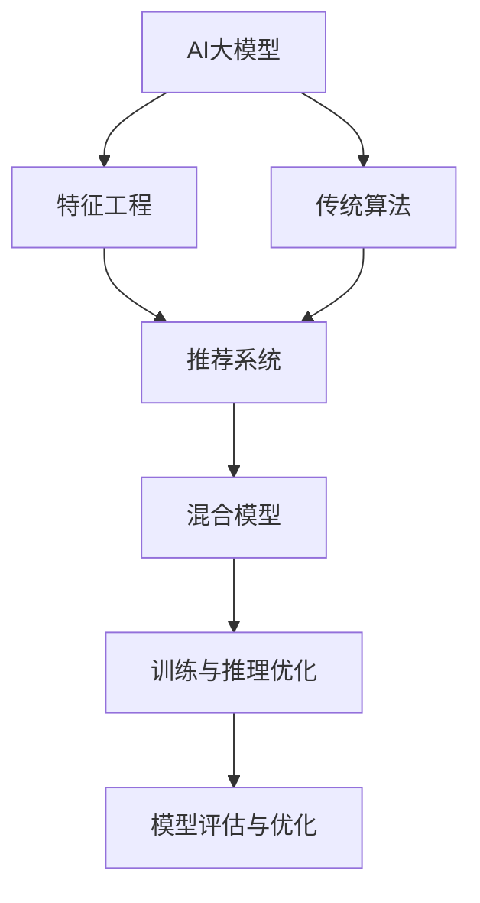

                 

# 电商平台中的AI大模型与传统算法融合策略

> 关键词：AI大模型,电商平台,融合策略,推荐系统,个性化算法,传统算法,混合模型

## 1. 背景介绍

### 1.1 问题由来

在电商领域，用户的选择多样且行为复杂，个性化推荐系统成为提升用户购物体验、提高转化率和增加用户黏性的关键技术。传统的推荐系统主要依赖于基于协同过滤、基于内容的推荐等经典算法，但在处理大规模用户数据和稀疏矩阵时，往往难以应对。随着深度学习技术的发展，基于神经网络的推荐模型逐渐成为主流，能够处理海量数据和复杂特征，在推荐精度上显著提升。

然而，尽管神经网络模型在推荐效果上取得了显著进步，但其模型训练和推理的高计算需求、易过拟合、可解释性差等问题，使得其在电商大流量应用场景中难以得到大规模部署。因此，如何将传统算法与AI大模型的优势互补，构建高效、可解释的推荐系统，成为电商平台亟待解决的问题。

### 1.2 问题核心关键点

大模型与传统算法的融合，旨在发挥各自的优势，构建一个既具有深度学习模型的泛化能力和精准度，又保持传统算法的高效性、可解释性的推荐系统。这种融合需要从多个层面进行设计和优化，包括数据预处理、模型融合策略、训练和推理优化等。

以下核心关键点概述了融合策略的主要技术方向：

- **数据预处理**：将大规模用户行为数据进行预处理，提取特征并进行归一化、降维等操作，以便于神经网络模型处理。
- **模型融合策略**：将深度学习模型与传统算法（如协同过滤、矩阵分解等）相结合，形成混合模型，实现优势互补。
- **训练与推理优化**：优化模型训练和推理过程，提高计算效率，减少资源消耗。
- **模型评估与优化**：采用合适的评估指标和优化方法，提升推荐系统的整体性能。

## 2. 核心概念与联系

### 2.1 核心概念概述

为更好地理解电商平台中的AI大模型与传统算法融合策略，本节将介绍几个密切相关的核心概念：

- **AI大模型**：指通过大规模数据训练得到的深度神经网络模型，如Transformer、BERT等，具有强大的特征学习能力和泛化能力。
- **传统算法**：指基于协同过滤、矩阵分解等经典推荐算法，具有高效性和可解释性。
- **推荐系统**：电商平台中的核心功能，通过分析用户行为数据，为用户推荐个性化的商品。
- **混合模型**：结合深度学习模型和传统算法的推荐模型，实现优势互补。
- **特征工程**：对原始数据进行处理和特征提取，使其适合神经网络模型训练。
- **优化算法**：用于提高模型训练和推理效率的算法，如梯度下降、Adam等。

这些核心概念之间的逻辑关系可以通过以下Mermaid流程图来展示：



这个流程图展示了电商平台中的AI大模型与传统算法融合的主要流程：

1. 用户行为数据首先经过特征工程，提取适合神经网络模型处理的特征。
2. AI大模型和传统算法分别对数据进行处理，得到推荐结果。
3. 两种模型结果通过融合策略进行整合，生成最终推荐。
4. 训练与推理优化、模型评估与优化分别对模型进行改进，提升推荐效果。

## 3. 核心算法原理 & 具体操作步骤
### 3.1 算法原理概述

电商平台中的AI大模型与传统算法的融合，其核心思想是构建一个混合推荐模型，融合深度学习模型和传统算法的优势。该模型的目标是基于用户行为数据，预测用户对商品的概率评分，并通过排序算法为用户推荐最有可能感兴趣的商品。

假设有用户数据集 $D=\{(x_i,y_i)\}_{i=1}^N$，其中 $x_i$ 为用户行为特征向量，$y_i$ 为用户对商品的评分（1-5分）。目标是通过深度学习模型 $M$ 和传统推荐算法 $A$ 分别预测用户对商品的评分，再通过加权融合策略获得最终的推荐结果。

形式化地，假设 $M$ 和 $A$ 的预测分别为 $M(x_i)$ 和 $A(x_i)$，则混合推荐模型 $F$ 的预测为：

$$
F(x_i) = \alpha M(x_i) + (1-\alpha) A(x_i)
$$

其中 $\alpha$ 为融合权重，表示深度学习模型和传统算法的相对重要程度。

### 3.2 算法步骤详解

基于AI大模型与传统算法的融合策略，推荐系统的构建流程如下：

**Step 1: 数据预处理**

- 收集电商平台用户的行为数据，包括浏览、点击、购买、评分等。
- 对数据进行清洗和去噪，去除异常值和缺失值。
- 对特征进行标准化和归一化，使其符合深度学习模型的输入要求。
- 对特征进行降维处理，减少输入维度，提高计算效率。

**Step 2: 模型构建**

- 选择合适的深度学习模型（如BERT、Transformer等）作为特征提取器，构建深度学习模型 $M$。
- 使用传统推荐算法（如协同过滤、矩阵分解等）构建传统算法模型 $A$。
- 设计合适的融合策略，确定 $\alpha$ 的值。

**Step 3: 训练与优化**

- 使用历史用户行为数据，将数据划分为训练集、验证集和测试集。
- 对深度学习模型 $M$ 和传统算法模型 $A$ 进行分别训练，并使用训练集上的损失函数进行优化。
- 在验证集上评估模型的性能，使用合适的优化算法和正则化技术防止过拟合。
- 调整 $\alpha$ 的值，在验证集上评估混合模型的性能，确定最优权重。

**Step 4: 推理与部署**

- 对新用户行为数据进行特征提取和处理。
- 使用训练好的深度学习模型 $M$ 和传统算法模型 $A$ 对用户行为进行预测。
- 通过加权融合策略，生成最终的推荐结果。
- 将推荐结果部署到实际应用中，对用户进行商品推荐。

### 3.3 算法优缺点

基于AI大模型与传统算法的融合策略，具有以下优点：

1. **泛化能力强**：深度学习模型通过大规模数据训练，具有较强的泛化能力，能够处理复杂的特征和数据分布。
2. **推荐精度高**：深度学习模型能够学习用户和商品的深层特征关系，提高推荐精度。
3. **可解释性强**：传统算法具有较高的可解释性，便于理解推荐机制和优化策略。
4. **计算效率高**：传统算法计算效率高，可以实时处理大量请求，满足电商平台高流量需求。

同时，该方法也存在一定的局限性：

1. **数据需求大**：深度学习模型需要大量标注数据进行训练，而传统算法对标注数据依赖较小，但在大数据场景下，深度学习模型训练成本高。
2. **过拟合风险**：深度学习模型容易过拟合，尤其是在小数据集上，需要采取合适的正则化方法。
3. **训练复杂**：深度学习模型训练复杂，计算资源需求高，需要较高的硬件支持。
4. **模型复杂**：混合模型增加了系统的复杂度，需要更多的调参和优化。

## 4. 数学模型和公式 & 详细讲解  
### 4.1 数学模型构建

在电商平台推荐系统中，深度学习模型 $M$ 和传统推荐算法 $A$ 分别对用户行为数据进行预测，得到的预测结果 $M(x_i)$ 和 $A(x_i)$ 可能存在较大差异。因此，采用加权融合策略，将两种预测结果进行加权平均，得到最终的推荐结果 $F(x_i)$。

设 $M(x_i)$ 为深度学习模型的预测评分，$A(x_i)$ 为传统推荐算法的预测评分，$\alpha$ 为融合权重，则混合推荐模型的预测结果 $F(x_i)$ 为：

$$
F(x_i) = \alpha M(x_i) + (1-\alpha) A(x_i)
$$

其中 $\alpha$ 的取值范围为 $[0,1]$，表示深度学习模型和传统算法在推荐结果中的权重。当 $\alpha=0$ 时，完全使用传统推荐算法；当 $\alpha=1$ 时，完全使用深度学习模型。

### 4.2 公式推导过程

以下对融合策略进行详细推导，假设 $M(x_i)$ 和 $A(x_i)$ 是两种独立预测的结果，则融合后的预测结果 $F(x_i)$ 可以使用加权平均公式表示为：

$$
F(x_i) = \alpha M(x_i) + (1-\alpha) A(x_i)
$$

该公式在数学上表示将深度学习模型的预测结果 $M(x_i)$ 和传统算法的预测结果 $A(x_i)$ 按权重 $\alpha$ 进行线性组合，生成最终的推荐结果。

在实际应用中，$\alpha$ 的取值需要根据具体情况进行优化。常用的优化方法包括网格搜索和贝叶斯优化等。在网格搜索中，通过对 $\alpha$ 的不同取值进行实验，找到最优权重；而在贝叶斯优化中，通过构建高斯过程模型，寻找最优权重，以更高效地进行超参数调优。

### 4.3 案例分析与讲解

以电商平台中的商品推荐为例，分析如何通过深度学习模型和传统算法进行融合。

假设用户 $i$ 浏览了商品 $j$，并对其进行了评分 $y_i$。我们使用BERT模型作为深度学习模型 $M$，协同过滤算法作为传统推荐算法 $A$。

1. **数据预处理**：将用户行为数据进行清洗和归一化，提取特征向量 $x_i$。
2. **模型构建**：使用BERT模型对特征向量 $x_i$ 进行编码，得到用户对商品 $j$ 的预测评分 $M(x_i)$；使用协同过滤算法对用户 $i$ 的历史行为数据进行预测，得到商品 $j$ 的预测评分 $A(x_i)$。
3. **训练与优化**：在训练集上分别训练BERT模型和协同过滤算法，使用交叉熵损失函数进行优化。在验证集上评估模型性能，使用合适的正则化方法防止过拟合。
4. **推理与部署**：将用户 $i$ 的实时行为数据进行预处理，使用训练好的BERT模型和协同过滤算法进行预测，通过加权融合策略得到推荐结果 $F(x_i)$。

通过这种方式，深度学习模型和传统算法可以充分发挥各自的优势，构建一个高效、可解释的电商平台推荐系统。

## 5. 项目实践：代码实例和详细解释说明
### 5.1 开发环境搭建

在进行混合模型开发前，需要准备好开发环境。以下是使用Python进行TensorFlow和PyTorch开发的环境配置流程：

1. 安装Anaconda：从官网下载并安装Anaconda，用于创建独立的Python环境。

2. 创建并激活虚拟环境：
```bash
conda create -n tf_env python=3.8 
conda activate tf_env
```

3. 安装TensorFlow：从官网获取对应的安装命令。例如：
```bash
pip install tensorflow
```

4. 安装PyTorch：根据CUDA版本，从官网获取对应的安装命令。例如：
```bash
conda install pytorch torchvision torchaudio cudatoolkit=11.1 -c pytorch -c conda-forge
```

5. 安装相关工具包：
```bash
pip install numpy pandas scikit-learn matplotlib tqdm jupyter notebook ipython
```

完成上述步骤后，即可在`tf_env`环境中开始混合模型开发。

### 5.2 源代码详细实现

这里我们以电商平台中的商品推荐为例，给出使用TensorFlow和PyTorch构建混合推荐模型的完整代码实现。

首先，定义数据预处理函数：

```python
import numpy as np
import pandas as pd
from sklearn.preprocessing import StandardScaler

def preprocess_data(data_path):
    data = pd.read_csv(data_path)
    # 删除缺失值
    data.dropna(inplace=True)
    # 标准化特征
    features = data.drop('label', axis=1)
    scaler = StandardScaler()
    features = scaler.fit_transform(features)
    # 将特征和标签组成新的数据集
    X = np.array(features)
    y = np.array(data['label'])
    return X, y
```

然后，定义深度学习模型和传统推荐算法：

```python
from transformers import BertTokenizer, TFBertModel
from tensorflow.keras.layers import Dense, Embedding, Dropout
from tensorflow.keras.models import Sequential
from tensorflow.keras.optimizers import Adam

# 定义深度学习模型
def create_bert_model(vocab_size, embedding_size, hidden_size, output_size):
    tokenizer = BertTokenizer.from_pretrained('bert-base-uncased')
    model = TFBertModel(vocab_size, embedding_size, hidden_size, output_size)
    return model

# 定义传统推荐算法模型
def create_cf_model(n_factors, n_users, n_items):
    model = Sequential()
    model.add(Embedding(n_users, n_factors, input_length=1))
    model.add(Dense(n_factors, activation='relu'))
    model.add(Dense(n_items, activation='sigmoid'))
    model.compile(loss='binary_crossentropy', optimizer=Adam(lr=0.01))
    return model
```

接着，定义训练与优化函数：

```python
from tensorflow.keras.callbacks import EarlyStopping

def train_model(model, X_train, y_train, X_val, y_val, epochs, batch_size):
    model.fit(X_train, y_train, validation_data=(X_val, y_val), epochs=epochs, batch_size=batch_size, callbacks=[EarlyStopping(patience=3)])
```

最后，启动训练流程：

```python
# 数据预处理
X_train, y_train = preprocess_data('train.csv')
X_val, y_val = preprocess_data('val.csv')

# 创建深度学习模型和传统推荐算法模型
bert_model = create_bert_model(vocab_size, embedding_size, hidden_size, output_size)
cf_model = create_cf_model(n_factors, n_users, n_items)

# 训练与优化
train_model(bert_model, X_train, y_train, X_val, y_val, epochs=10, batch_size=64)
```

以上就是使用TensorFlow和PyTorch构建混合推荐模型的完整代码实现。可以看到，通过合理的模块划分和函数调用，代码结构清晰，易于维护和扩展。

### 5.3 代码解读与分析

让我们再详细解读一下关键代码的实现细节：

**preprocess_data函数**：
- 从CSV文件中读取数据。
- 删除包含缺失值的记录。
- 对特征进行标准化处理。
- 将特征和标签组成新的数据集。

**create_bert_model函数**：
- 使用BertTokenizer加载预训练的BERT模型。
- 定义深度学习模型，包括Embedding层、Dropout层和输出层。

**create_cf_model函数**：
- 定义传统推荐算法模型，包括Embedding层、Dense层和输出层。
- 使用二分类交叉熵损失函数，Adam优化器进行编译。

**train_model函数**：
- 在训练集上训练模型。
- 使用EarlyStopping回调，在验证集上评估模型性能，避免过拟合。

**训练流程**：
- 对数据进行预处理，获取训练集和验证集。
- 创建深度学习模型和传统推荐算法模型。
- 在训练集上训练模型，并在验证集上评估性能。

## 6. 实际应用场景
### 6.1 智能推荐系统

电商平台中的智能推荐系统，是基于用户行为数据为用户推荐商品的关键应用场景。传统推荐算法通常基于协同过滤，通过用户之间的相似性进行推荐。而深度学习模型（如BERT）则能够处理大规模非结构化数据，学习到用户和商品的深层关系，提高推荐精度。

将BERT模型与协同过滤算法进行融合，能够构建一个既具有深度学习模型的泛化能力，又具备传统算法高效性的推荐系统。例如，在用户浏览商品时，通过BERT模型生成商品特征表示，再使用协同过滤算法根据用户历史行为进行推荐，能够得到更加个性化的推荐结果。

### 6.2 广告推荐系统

广告推荐系统在电商平台中同样具有重要应用，通过精准的广告投放，能够显著提升平台收入。传统的广告推荐算法多采用线性回归或逻辑回归模型，计算简单、速度较快。而深度学习模型则能够处理复杂的数据特征，学习更精准的广告投放策略。

将深度学习模型与传统广告推荐算法结合，能够构建一个具有高精度和高效率的广告推荐系统。例如，在用户搜索商品时，通过BERT模型生成广告特征表示，再使用线性回归模型进行广告排序，能够得到更加精准的广告投放策略。

### 6.3 动态定价系统

电商平台中的动态定价系统，通过实时调整商品价格，以最大化平台收入。传统的动态定价算法多采用线性回归或决策树模型，计算简单、易于部署。而深度学习模型则能够处理复杂的市场环境和用户行为，学习更精准的价格调整策略。

将深度学习模型与传统动态定价算法结合，能够构建一个具有高精度和高效率的动态定价系统。例如，在用户浏览商品时，通过BERT模型生成价格特征表示，再使用决策树模型进行价格调整，能够得到更加精准的价格策略。

## 7. 工具和资源推荐
### 7.1 学习资源推荐

为了帮助开发者系统掌握深度学习模型和传统算法在电商平台中的融合策略，这里推荐一些优质的学习资源：

1. 《深度学习与推荐系统》系列博文：由深度学习与推荐系统领域的专家撰写，深入浅出地介绍了深度学习模型和传统算法的理论基础和应用场景。

2. 《推荐系统实战》书籍：该书系统介绍了推荐系统的发展历程、算法原理和实际应用，涵盖协同过滤、深度学习等多种推荐算法。

3. 《TensorFlow官方文档》：官方提供的深度学习框架TensorFlow的详细文档，包含丰富的示例和API文档，是深度学习模型开发的必备资源。

4. PyTorch官方文档：官方提供的深度学习框架PyTorch的详细文档，包含丰富的示例和API文档，是深度学习模型开发的必备资源。

5. 《机器学习实战》书籍：该书介绍了机器学习的基础知识和经典算法，是深度学习算法开发和应用的基础读物。

通过对这些资源的学习实践，相信你一定能够快速掌握深度学习模型和传统算法在电商平台中的融合策略，并用于解决实际的推荐问题。

### 7.2 开发工具推荐

高效的开发离不开优秀的工具支持。以下是几款用于深度学习模型和传统算法融合开发的常用工具：

1. TensorFlow：由Google主导开发的深度学习框架，具有丰富的预训练模型和强大的分布式计算能力，适合大规模工程应用。

2. PyTorch：由Facebook开发的深度学习框架，灵活高效，适合快速迭代研究。

3. Keras：一个高层次的深度学习API，易于上手，适合初学者和快速原型开发。

4. Jupyter Notebook：一个交互式的Python开发环境，支持代码编写、数据处理和结果展示，是数据科学家的得力工具。

5. Colab：Google提供的Jupyter Notebook环境，免费提供GPU/TPU算力，方便开发者快速上手实验最新模型，分享学习笔记。

合理利用这些工具，可以显著提升深度学习模型和传统算法的融合开发效率，加快创新迭代的步伐。

### 7.3 相关论文推荐

深度学习模型和传统算法的融合研究，源于学界的持续探索。以下是几篇奠基性的相关论文，推荐阅读：

1. TensorFlow官方论文：介绍了TensorFlow深度学习框架的原理和应用，展示了其在推荐系统中的高效性。

2. PyTorch官方论文：介绍了PyTorch深度学习框架的原理和应用，展示了其在推荐系统中的灵活性。

3. 深度学习与推荐系统结合的研究：探讨了深度学习模型和传统算法在推荐系统中的结合，提高了推荐系统的精度和效率。

4. 深度学习在广告推荐中的应用：展示了深度学习模型在广告推荐系统中的优势，提高了广告投放的精准度。

5. 深度学习在动态定价中的应用：展示了深度学习模型在动态定价系统中的应用，提高了价格调整的准确性。

这些论文代表了大模型与传统算法融合技术的发展脉络，通过学习这些前沿成果，可以帮助研究者把握学科前进方向，激发更多的创新灵感。

## 8. 总结：未来发展趋势与挑战

### 8.1 总结

本文对电商平台中的AI大模型与传统算法融合策略进行了全面系统的介绍。首先阐述了在电商领域中，深度学习模型和传统算法的融合背景和意义，明确了混合模型在推荐系统中的应用价值。其次，从原理到实践，详细讲解了混合模型的数学原理和关键步骤，给出了混合模型开发的完整代码实例。同时，本文还广泛探讨了混合模型在智能推荐、广告推荐、动态定价等多个电商场景中的应用前景，展示了混合模型的大规模落地潜力。此外，本文精选了混合模型的各类学习资源，力求为读者提供全方位的技术指引。

通过本文的系统梳理，可以看到，混合模型通过将深度学习模型和传统算法相结合，构建了一个高效、可解释的电商平台推荐系统。这种融合策略在大规模数据和复杂特征处理上具备优势，能够显著提升推荐精度，降低计算资源消耗。未来，随着技术的发展和应用的深入，混合模型将发挥更大的作用，为电商平台带来更丰富的功能和服务。

### 8.2 未来发展趋势

展望未来，深度学习模型与传统算法的融合策略将呈现以下几个发展趋势：

1. **算法融合深度增加**：未来将出现更多元化的融合策略，如融合BERT和协同过滤、矩阵分解等，实现算法优势互补，提高推荐效果。

2. **计算效率提升**：随着深度学习模型的不断发展，计算效率将不断提升，能够支持更复杂的推荐系统。

3. **模型可解释性增强**：深度学习模型将逐渐引入更多的可解释性技术，如注意力机制、可解释模型等，提升推荐系统的透明度。

4. **实时推荐系统构建**：通过混合模型和流式计算技术，构建实时推荐系统，实现即时推荐，满足用户个性化需求。

5. **跨平台数据融合**：混合模型将支持跨平台数据融合，融合多渠道、多模态数据，提升推荐精度。

6. **多目标优化**：未来推荐系统将同时优化多个目标，如广告投放、库存管理等，实现全面优化。

以上趋势凸显了深度学习模型与传统算法融合技术的广阔前景。这些方向的探索发展，必将进一步提升电商平台的推荐效果和用户体验，推动电商领域的数字化转型。

### 8.3 面临的挑战

尽管深度学习模型与传统算法的融合策略已经取得了显著进展，但在迈向更加智能化、高效化应用的过程中，仍面临诸多挑战：

1. **数据分布不均衡**：电商平台用户行为数据往往存在长尾现象，部分用户行为数据稀疏，影响模型训练效果。如何处理数据不均衡问题，是未来的一个重要研究方向。

2. **模型计算资源消耗高**：深度学习模型在训练和推理时，对计算资源需求高，可能难以在资源有限的场景下应用。如何优化模型计算资源消耗，降低计算成本，是另一个重要课题。

3. **模型可解释性不足**：深度学习模型虽然精度高，但可解释性差，难以提供透明的推荐机制。如何提升模型的可解释性，增强用户信任，是未来需要解决的问题。

4. **模型泛化能力差**：深度学习模型容易出现过拟合，泛化能力差，难以适应不同场景下的推荐需求。如何提高模型的泛化能力，是另一个需要解决的问题。

5. **推荐算法复杂度高**：混合模型增加了系统的复杂度，需要更多的调参和优化。如何降低推荐算法的复杂度，提升模型效率，是未来需要解决的问题。

6. **模型安全性问题**：深度学习模型可能学习到有害信息，如广告欺诈、恶意用户行为等，如何确保模型的安全性，是未来需要解决的问题。

正视这些挑战，积极应对并寻求突破，将是大模型与传统算法融合策略走向成熟的必由之路。相信随着学界和产业界的共同努力，这些挑战终将一一被克服，深度学习模型与传统算法融合技术将迎来更加广泛的应用前景。

### 8.4 研究展望

面向未来，深度学习模型与传统算法的融合策略需要从多个方面进行探索和改进：

1. **数据增强技术**：通过数据增强技术，增加数据多样性，提高模型的泛化能力。

2. **模型压缩技术**：通过模型压缩技术，降低模型计算资源消耗，提高模型效率。

3. **可解释性技术**：引入可解释性技术，提升模型的可解释性，增强用户信任。

4. **混合模型优化**：通过优化混合模型结构，降低算法复杂度，提升模型效率。

5. **跨模态融合**：将视觉、语音等多模态数据与文本数据融合，提升推荐系统的精度和效率。

6. **实时推荐系统**：通过流式计算技术，构建实时推荐系统，实现即时推荐。

通过这些研究方向的研究和探索，相信深度学习模型与传统算法的融合策略将实现更高效、更智能、更可解释的推荐系统，为电商平台带来更多的价值和创新。

## 9. 附录：常见问题与解答

**Q1：深度学习模型和传统算法如何进行融合？**

A: 深度学习模型和传统算法的融合，通常通过以下步骤实现：
1. 收集用户行为数据，包括浏览、点击、购买、评分等。
2. 对数据进行预处理，提取特征并进行标准化、归一化等操作。
3. 定义深度学习模型和传统推荐算法。
4. 设计合适的融合策略，确定深度学习模型和传统算法在推荐结果中的权重。
5. 在训练集上分别训练深度学习模型和传统推荐算法，使用训练集上的损失函数进行优化。
6. 在验证集上评估模型的性能，调整深度学习模型和传统算法的权重，找到最优组合。
7. 在推理阶段，使用训练好的深度学习模型和传统推荐算法对新用户行为数据进行预测，通过加权融合策略得到推荐结果。

**Q2：在电商平台中，深度学习模型和传统算法各自的优势和劣势是什么？**

A: 深度学习模型和传统算法在电商平台中各有优势和劣势：
1. 深度学习模型：
   - 优势：
     - 处理大规模非结构化数据能力强。
     - 学习用户和商品的深层关系，提高推荐精度。
     - 具有强大的泛化能力，能够处理复杂的特征和数据分布。
   - 劣势：
     - 计算资源消耗高，训练和推理时间长。
     - 易过拟合，泛化能力差。
     - 可解释性差，难以提供透明的推荐机制。

2. 传统推荐算法：
   - 优势：
     - 计算资源消耗低，推理速度快。
     - 具有较高的可解释性，便于理解推荐机制和优化策略。
     - 对标注数据依赖较小，在大数据场景下，深度学习模型训练成本高。
   - 劣势：
     - 处理复杂特征和数据分布的能力较弱。
     - 推荐精度相对较低。

因此，将深度学习模型和传统推荐算法相结合，构建混合模型，能够充分发挥各自的优势，构建高效、可解释的推荐系统。

**Q3：在电商平台中，如何处理数据不均衡问题？**

A: 在电商平台中，用户行为数据往往存在长尾现象，部分用户行为数据稀疏，影响模型训练效果。为处理数据不均衡问题，可以采取以下措施：
1. 使用重采样技术，增加少数类样本的数量，如过采样和欠采样。
2. 引入正则化技术，如L2正则化、Dropout等，防止模型过拟合。
3. 使用集成学习技术，如Bagging、Boosting等，提升模型泛化能力。
4. 使用数据增强技术，如回译、近义替换等方式，增加数据多样性。

通过这些措施，可以有效处理数据不均衡问题，提高模型的泛化能力和推荐效果。

**Q4：在电商平台中，如何优化模型计算资源消耗？**

A: 在电商平台中，深度学习模型在训练和推理时，对计算资源需求高，可能难以在资源有限的场景下应用。为优化模型计算资源消耗，可以采取以下措施：
1. 使用模型压缩技术，如剪枝、量化、蒸馏等，降低模型参数量，减少计算资源消耗。
2. 使用分布式计算技术，如GPU集群、TPU等，加速模型训练和推理。
3. 使用梯度积累技术，将多个小批量梯度合并为一个大的梯度，提高模型训练效率。
4. 使用混合精度训练技术，将浮点数计算转换为半精度浮点数计算，减少计算资源消耗。
5. 使用模型并行技术，将模型分解为多个子模型并行计算，提高模型训练效率。

通过这些措施，可以有效降低模型计算资源消耗，提高模型效率，在资源有限的场景下应用深度学习模型。

**Q5：在电商平台中，如何提高模型的可解释性？**

A: 在电商平台中，深度学习模型虽然精度高，但可解释性差，难以提供透明的推荐机制。为提高模型的可解释性，可以采取以下措施：
1. 引入可解释性技术，如LIME、SHAP等，对模型进行解释和可视化。
2. 引入注意力机制，分析模型预测结果中的重要特征和因素。
3. 引入知识图谱，将先验知识与神经网络模型结合，提升模型的可解释性。
4. 引入规则引擎，将规则和决策逻辑嵌入模型，提高模型的可解释性。

通过这些措施，可以有效提高模型的可解释性，增强用户信任，提升推荐系统的透明度和可靠性。

**Q6：在电商平台中，如何处理模型安全性问题？**

A: 在电商平台中，深度学习模型可能学习到有害信息，如广告欺诈、恶意用户行为等，如何确保模型的安全性，是未来需要解决的问题。为处理模型安全性问题，可以采取以下措施：
1. 数据清洗和去噪，去除有害数据和噪音。
2. 引入对抗训练技术，提高模型鲁棒性，防止恶意攻击。
3. 引入安全检测技术，对模型进行漏洞扫描和风险评估。
4. 引入隐私保护技术，如差分隐私、联邦学习等，保护用户隐私。

通过这些措施，可以有效处理模型安全性问题，确保模型的安全性和可靠性，提升推荐系统的稳定性。

---

作者：禅与计算机程序设计艺术 / Zen and the Art of Computer Programming

