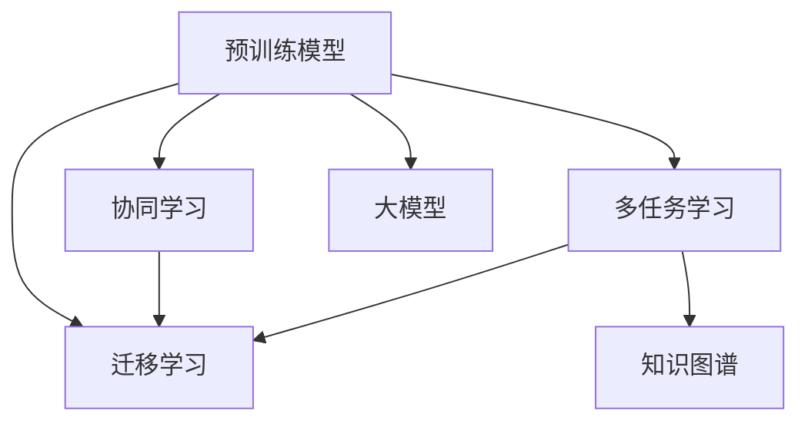

                 

# 电商平台中的AI大模型：从单一任务到多任务协同学习与迁移

> 关键词：电商平台,大模型,协同学习,迁移学习,多任务学习,预训练模型

## 1. 背景介绍

随着互联网和电子商务的迅速发展，电商平台成为连接商家与消费者的重要桥梁。然而，传统的电商平台存在数据稀疏、人工标注成本高、推荐精度有限等瓶颈，亟需引入先进的技术手段来提升用户体验和运营效率。近年来，基于预训练的大模型在自然语言处理(NLP)领域取得了突破性进展，通过在大规模无标签文本数据上进行预训练，学习到通用的语言表示，能够高效地处理文本信息，为电商平台的智能应用提供了强大的技术支持。

本文将介绍基于预训练大模型在电商平台中的应用，重点讨论如何通过协同学习和迁移学习的方式，在单一任务的基础上进行多任务学习，进一步提升电商平台的推荐、客服、广告、风控等多个业务场景的智能决策能力。我们还将探讨如何有效利用大模型的多任务学习能力和迁移学习能力，实现电商平台的智能化升级，为用户提供更优质的购物体验。

## 2. 核心概念与联系

### 2.1 核心概念概述

为深入理解基于预训练大模型在电商平台中的应用，本节将介绍几个核心概念：

- 预训练模型(Pretrained Models)：指在大规模无标签文本数据上训练得到的基础模型。通过预训练，模型能够学习到语言的通用表示，具备强大的语言理解和生成能力。
- 多任务学习(Multi-task Learning)：指模型同时学习多个相关任务的表示，通过共享表示提升不同任务的表现。多任务学习有助于提高模型的泛化能力和可迁移性。
- 协同学习(Co-learning)：指模型在多个任务间协同训练，相互学习对方的知识，提升整体性能。协同学习有助于挖掘数据间的关联，提高模型在多个任务上的综合表现。
- 迁移学习(Transfer Learning)：指模型在特定任务上学习新知识的同时，利用预训练模型学到的通用知识，避免从头训练。迁移学习是预训练模型在实际应用中的重要应用范式。
- 大模型(Large Models)：指参数量超过亿级别的深度神经网络模型，如BERT、GPT-3等。大模型拥有丰富的语言知识，能够处理复杂的自然语言处理任务。
- 知识图谱(Knowledge Graph)：指将知识结构化并构建为图的数据结构，用于辅助模型的知识理解和推理。

这些核心概念之间的逻辑关系可以通过以下Mermaid流程图来展示：



这个流程图展示了预训练模型在电商平台中的应用路线：

1. 预训练模型通过大规模无标签数据预训练，学习到通用的语言表示。
2. 通过多任务学习，模型能够同时处理多个相关任务，如推荐、客服、广告、风控等。
3. 通过协同学习，模型在多个任务间协同训练，相互学习知识，提升整体性能。
4. 通过迁移学习，模型利用预训练知识，避免从头训练，提升在特定任务上的性能。
5. 知识图谱作为模型推理的辅助工具，帮助模型更好地理解现实世界中的知识结构。

## 3. 核心算法原理 & 具体操作步骤
### 3.1 算法原理概述

基于预训练大模型在电商平台中的多任务学习与迁移学习，本质上是一个多任务协同训练的过程。其核心思想是：将预训练大模型视作一个通用的"表示器"，通过同时训练多个相关任务，共享模型的通用表示，进而提升模型在各个任务上的性能。

形式化地，假设预训练模型为 $M_{\theta}$，其中 $\theta$ 为预训练得到的模型参数。给定多个下游任务 $T_1, T_2, ..., T_n$ 的标注数据集 $D_1, D_2, ..., D_n$，多任务学习的目标是最小化联合损失函数：

$$
\mathcal{L}(\theta) = \sum_{i=1}^n \mathcal{L}_i(M_{\theta},D_i)
$$

其中 $\mathcal{L}_i$ 为任务 $T_i$ 的损失函数，用于衡量模型在特定任务上的表现。

通过梯度下降等优化算法，多任务学习过程不断更新模型参数 $\theta$，最小化联合损失函数 $\mathcal{L}(\theta)$，使得模型输出逼近真实标签。由于 $\theta$ 已经通过预训练获得了较好的初始化，因此即便在多个小规模数据集上进行多任务学习，也能较快收敛到理想的模型参数 $\hat{\theta}$。

### 3.2 算法步骤详解

基于预训练大模型在电商平台中的多任务学习，一般包括以下几个关键步骤：

**Step 1: 准备预训练模型和数据集**
- 选择合适的预训练语言模型 $M_{\theta}$ 作为初始化参数，如 BERT、GPT 等。
- 准备电商平台各个业务场景的标注数据集 $D_1, D_2, ..., D_n$，划分为训练集、验证集和测试集。一般要求标注数据与预训练数据的分布不要差异过大。

**Step 2: 设计多任务适配层**
- 根据任务类型，在预训练模型顶层设计合适的多任务输出层和损失函数。
- 对于分类任务，通常在顶层添加线性分类器和交叉熵损失函数。
- 对于生成任务，通常使用语言模型的解码器输出概率分布，并以负对数似然为损失函数。
- 对于排序任务，可以使用点积损失或排序损失。

**Step 3: 设置多任务超参数**
- 选择合适的优化算法及其参数，如 AdamW、SGD 等，设置学习率、批大小、迭代轮数等。
- 设置正则化技术及强度，包括权重衰减、Dropout、Early Stopping等。
- 确定冻结预训练参数的策略，如仅微调顶层，或全部参数都参与微调。

**Step 4: 执行多任务梯度训练**
- 将训练集数据分批次输入模型，前向传播计算联合损失函数。
- 反向传播计算联合损失函数对参数 $\theta$ 的梯度，根据设定的优化算法和学习率更新模型参数。
- 周期性在验证集上评估模型性能，根据性能指标决定是否触发 Early Stopping。
- 重复上述步骤直到满足预设的迭代轮数或 Early Stopping 条件。

**Step 5: 测试和部署**
- 在测试集上评估多任务学习后的模型 $M_{\hat{\theta}}$ 的性能，对比多任务学习前后的精度提升。
- 使用多任务学习后的模型对新样本进行推理预测，集成到实际的应用系统中。
- 持续收集新的数据，定期重新多任务学习模型，以适应数据分布的变化。

以上是基于预训练大模型在电商平台中进行多任务学习的一般流程。在实际应用中，还需要针对具体任务的特点，对多任务学习过程的各个环节进行优化设计，如改进训练目标函数，引入更多的正则化技术，搜索最优的超参数组合等，以进一步提升模型性能。

### 3.3 算法优缺点

基于预训练大模型在电商平台中的多任务学习方法具有以下优点：

1. 提高泛化能力：多任务学习能够利用数据间的多样性，提升模型在多个任务上的泛化能力。
2. 增强可迁移性：多任务学习使模型能够同时处理多个任务，增强了模型在不同场景间的迁移能力。
3. 资源利用率：通过多任务学习，模型可以在单次训练中处理多个任务的数据，提高资源利用率。
4. 减少训练成本：多任务学习可以利用少量标注数据，减少从头训练所需的成本。
5. 增强稳定性：多任务学习通过协同训练，可以增强模型的稳定性和鲁棒性。

同时，该方法也存在一些局限性：

1. 数据分布差异：多任务学习需要多个数据集具有较高的相关性，如果数据分布差异较大，模型可能难以泛化。
2. 模型复杂性：多任务学习通常需要设计多个任务适配层，模型结构较为复杂。
3. 训练时间较长：多任务学习需要同时处理多个任务的数据，训练时间可能较长。
4. 计算资源需求高：多任务学习需要较大的计算资源支持，特别是对于大规模模型和大规模数据集。

尽管存在这些局限性，但就目前而言，基于多任务学习的方法仍是电商平台智能应用的重要范式。未来相关研究的重点在于如何进一步降低多任务学习对标注数据的依赖，提高模型的少样本学习和跨领域迁移能力，同时兼顾可解释性和伦理安全性等因素。

### 3.4 算法应用领域

基于预训练大模型在电商平台中的多任务学习，已经在推荐、客服、广告、风控等多个业务场景中得到了广泛应用，例如：

- 推荐系统：利用多任务学习提升模型的个性化推荐能力，为用户推荐符合其兴趣的商品。
- 客服系统：通过多任务学习提升智能客服系统的理解能力和响应质量，帮助用户解决购物问题。
- 广告投放：利用多任务学习提升广告投放的精准度和转化率，提高广告投放效果。
- 风险控制：通过多任务学习提升风险预测的准确性和及时性，保障平台交易安全。

除了上述这些经典应用外，多任务学习还被创新性地应用到更多场景中，如社交网络分析、用户行为预测、供应链优化等，为电商平台带来了全新的突破。随着预训练模型和多任务学习方法的不断进步，相信电商平台智能应用也将不断扩展，为用户提供更优质的购物体验。

## 4. 数学模型和公式 & 详细讲解  
### 4.1 数学模型构建

本节将使用数学语言对基于预训练大模型在电商平台中的多任务学习过程进行更加严格的刻画。

记预训练语言模型为 $M_{\theta}$，其中 $\theta$ 为预训练得到的模型参数。假设电商平台有 $n$ 个下游任务 $T_1, T_2, ..., T_n$，对应的训练集为 $D_1, D_2, ..., D_n$。多任务学习的目标是最小化联合损失函数：

$$
\mathcal{L}(\theta) = \sum_{i=1}^n \mathcal{L}_i(M_{\theta},D_i)
$$

其中 $\mathcal{L}_i$ 为任务 $T_i$ 的损失函数，用于衡量模型在特定任务上的表现。例如，对于推荐系统，可以使用点积损失或排序损失；对于客服系统，可以使用序列标注损失等。

多任务学习过程中，模型通过反向传播计算联合损失函数对参数 $\theta$ 的梯度，并根据设定的优化算法更新模型参数。常用的优化算法包括AdamW、SGD等，学习率通常需要根据任务难度和数据量进行调整。

### 4.2 公式推导过程

以下我们以推荐系统为例，推导多任务学习过程的优化目标和梯度计算公式。

假设模型 $M_{\theta}$ 在输入 $x$ 上的输出为 $\hat{y}=M_{\theta}(x) \in [0,1]$，表示用户对商品 $x$ 的评分。推荐系统通常需要同时处理多个用户对多个商品的评分数据。设任务 $T_i$ 的标注数据集为 $D_i=\{(x_i,y_i)\}_{i=1}^N, x_i \in \mathcal{X}, y_i \in \mathcal{Y}$，其中 $\mathcal{X}$ 为输入空间，$\mathcal{Y}$ 为输出空间。

假设任务 $T_i$ 的损失函数为 $\ell_i(M_{\theta}(x_i),y_i)$，则在数据集 $D_i$ 上的经验风险为：

$$
\mathcal{L}_i(\theta) = \frac{1}{N}\sum_{i=1}^N \ell_i(M_{\theta}(x_i),y_i)
$$

多任务学习的优化目标是同时最小化各个任务的经验风险，即：

$$
\mathcal{L}(\theta) = \sum_{i=1}^n \mathcal{L}_i(\theta)
$$

在实践中，我们通常使用基于梯度的优化算法（如AdamW、SGD等）来近似求解上述最优化问题。设 $\eta$ 为学习率，$\lambda$ 为正则化系数，则参数的更新公式为：

$$
\theta \leftarrow \theta - \eta \nabla_{\theta}\mathcal{L}(\theta) - \eta\lambda\theta
$$

其中 $\nabla_{\theta}\mathcal{L}(\theta)$ 为联合损失函数对参数 $\theta$ 的梯度，可通过反向传播算法高效计算。

在得到联合损失函数的梯度后，即可带入参数更新公式，完成模型的迭代优化。重复上述过程直至收敛，最终得到适应多个任务的最优模型参数 $\hat{\theta}$。

## 5. 项目实践：代码实例和详细解释说明
### 5.1 开发环境搭建

在进行多任务学习实践前，我们需要准备好开发环境。以下是使用Python进行PyTorch开发的环境配置流程：

1. 安装Anaconda：从官网下载并安装Anaconda，用于创建独立的Python环境。

2. 创建并激活虚拟环境：
```bash
conda create -n pytorch-env python=3.8 
conda activate pytorch-env
```

3. 安装PyTorch：根据CUDA版本，从官网获取对应的安装命令。例如：
```bash
conda install pytorch torchvision torchaudio cudatoolkit=11.1 -c pytorch -c conda-forge
```

4. 安装Transformers库：
```bash
pip install transformers
```

5. 安装各类工具包：
```bash
pip install numpy pandas scikit-learn matplotlib tqdm jupyter notebook ipython
```

完成上述步骤后，即可在`pytorch-env`环境中开始多任务学习实践。

### 5.2 源代码详细实现

这里我们以电商平台推荐系统为例，给出使用Transformers库进行多任务学习的PyTorch代码实现。

首先，定义推荐系统的数据处理函数：

```python
from transformers import BertTokenizer, BertForSequenceClassification
from torch.utils.data import Dataset
import torch

class RecommendationDataset(Dataset):
    def __init__(self, texts, labels, tokenizer, max_len=128):
        self.texts = texts
        self.labels = labels
        self.tokenizer = tokenizer
        self.max_len = max_len
        
    def __len__(self):
        return len(self.texts)
    
    def __getitem__(self, item):
        text = self.texts[item]
        label = self.labels[item]
        
        encoding = self.tokenizer(text, return_tensors='pt', max_length=self.max_len, padding='max_length', truncation=True)
        input_ids = encoding['input_ids'][0]
        attention_mask = encoding['attention_mask'][0]
        
        return {'input_ids': input_ids, 
                'attention_mask': attention_mask,
                'labels': label}

# 标签与id的映射
label2id = {'1': 1, '0': 0}
id2label = {v: k for k, v in label2id.items()}

# 创建dataset
tokenizer = BertTokenizer.from_pretrained('bert-base-cased')

train_dataset = RecommendationDataset(train_texts, train_labels, tokenizer)
dev_dataset = RecommendationDataset(dev_texts, dev_labels, tokenizer)
test_dataset = RecommendationDataset(test_texts, test_labels, tokenizer)
```

然后，定义模型和优化器：

```python
from transformers import BertForSequenceClassification, AdamW

num_tasks = 2
model = BertForSequenceClassification.from_pretrained('bert-base-cased', num_labels=2)

optimizer = AdamW(model.parameters(), lr=2e-5)
```

接着，定义训练和评估函数：

```python
from torch.utils.data import DataLoader
from tqdm import tqdm
from sklearn.metrics import classification_report

device = torch.device('cuda') if torch.cuda.is_available() else torch.device('cpu')
model.to(device)

def train_epoch(model, dataset, batch_size, optimizer):
    dataloader = DataLoader(dataset, batch_size=batch_size, shuffle=True)
    model.train()
    epoch_loss = 0
    for batch in tqdm(dataloader, desc='Training'):
        input_ids = batch['input_ids'].to(device)
        attention_mask = batch['attention_mask'].to(device)
        labels = batch['labels'].to(device)
        model.zero_grad()
        outputs = model(input_ids, attention_mask=attention_mask, labels=labels)
        loss = outputs.loss
        epoch_loss += loss.item()
        loss.backward()
        optimizer.step()
    return epoch_loss / len(dataloader)

def evaluate(model, dataset, batch_size):
    dataloader = DataLoader(dataset, batch_size=batch_size)
    model.eval()
    preds, labels = [], []
    with torch.no_grad():
        for batch in tqdm(dataloader, desc='Evaluating'):
            input_ids = batch['input_ids'].to(device)
            attention_mask = batch['attention_mask'].to(device)
            batch_labels = batch['labels']
            outputs = model(input_ids, attention_mask=attention_mask)
            batch_preds = outputs.logits.argmax(dim=1).to('cpu').tolist()
            batch_labels = batch_labels.to('cpu').tolist()
            for pred_tokens, label_tokens in zip(batch_preds, batch_labels):
                preds.append(pred_tokens[:len(label_tokens)])
                labels.append(label_tokens)
                
    print(classification_report(labels, preds))
```

最后，启动训练流程并在测试集上评估：

```python
epochs = 5
batch_size = 16

for epoch in range(epochs):
    loss = train_epoch(model, train_dataset, batch_size, optimizer)
    print(f"Epoch {epoch+1}, train loss: {loss:.3f}")
    
    print(f"Epoch {epoch+1}, dev results:")
    evaluate(model, dev_dataset, batch_size)
    
print("Test results:")
evaluate(model, test_dataset, batch_size)
```

以上就是使用PyTorch对Bert进行推荐系统多任务学习的完整代码实现。可以看到，得益于Transformers库的强大封装，我们可以用相对简洁的代码完成Bert模型的加载和多任务学习。

### 5.3 代码解读与分析

让我们再详细解读一下关键代码的实现细节：

**RecommendationDataset类**：
- `__init__`方法：初始化文本、标签、分词器等关键组件。
- `__len__`方法：返回数据集的样本数量。
- `__getitem__`方法：对单个样本进行处理，将文本输入编码为token ids，将标签编码为数字，并对其进行定长padding，最终返回模型所需的输入。

**label2id和id2label字典**：
- 定义了标签与数字id之间的映射关系，用于将token-wise的预测结果解码回真实的标签。

**训练和评估函数**：
- 使用PyTorch的DataLoader对数据集进行批次化加载，供模型训练和推理使用。
- 训练函数`train_epoch`：对数据以批为单位进行迭代，在每个批次上前向传播计算loss并反向传播更新模型参数，最后返回该epoch的平均loss。
- 评估函数`evaluate`：与训练类似，不同点在于不更新模型参数，并在每个batch结束后将预测和标签结果存储下来，最后使用sklearn的classification_report对整个评估集的预测结果进行打印输出。

**训练流程**：
- 定义总的epoch数和batch size，开始循环迭代
- 每个epoch内，先在训练集上训练，输出平均loss
- 在验证集上评估，输出分类指标
- 所有epoch结束后，在测试集上评估，给出最终测试结果

可以看到，PyTorch配合Transformers库使得Bert多任务学习的代码实现变得简洁高效。开发者可以将更多精力放在数据处理、模型改进等高层逻辑上，而不必过多关注底层的实现细节。

当然，工业级的系统实现还需考虑更多因素，如模型的保存和部署、超参数的自动搜索、更灵活的任务适配层等。但核心的多任务学习范式基本与此类似。

## 6. 实际应用场景
### 6.1 智能客服系统

基于大模型多任务学习技术的智能客服系统，可以显著提升客服的响应速度和准确性，减少人力成本，提高客户满意度。通过多任务学习，智能客服系统能够同时处理多种类型的客户咨询，如购物问题、物流查询、售后服务等，通过学习不同任务的知识，能够更灵活地解决各种问题。

在技术实现上，可以收集平台的历史客服对话记录，将问题和最佳答复构建成监督数据，在此基础上对预训练对话模型进行多任务学习。多任务学习的智能客服系统能够自动理解用户意图，匹配最合适的答案模板进行回复。对于用户提出的新问题，还可以接入检索系统实时搜索相关内容，动态组织生成回答。如此构建的智能客服系统，能大幅提升客户咨询体验和问题解决效率。

### 6.2 个性化推荐系统

当前的推荐系统往往只依赖用户的历史行为数据进行物品推荐，无法深入理解用户的真实兴趣偏好。基于大模型多任务学习技术的个性化推荐系统，可以更好地挖掘用户行为背后的语义信息，从而提供更精准、多样的推荐内容。

在实践中，可以收集用户浏览、点击、评论、分享等行为数据，提取和用户交互的物品标题、描述、标签等文本内容。将文本内容作为模型输入，用户的后续行为（如是否点击、购买等）作为监督信号，在此基础上多任务学习预训练语言模型。多任务学习的推荐系统能够从文本内容中准确把握用户的兴趣点。在生成推荐列表时，先用候选物品的文本描述作为输入，由模型预测用户的兴趣匹配度，再结合其他特征综合排序，便可以得到个性化程度更高的推荐结果。

### 6.3 多模态学习系统

当前的多任务学习大多聚焦于单一模态数据，如文本或图像。但电商平台的数据具有多模态的特点，包括文本、图像、视频、音频等。多模态学习系统能够同时处理多种模态数据，提供更加丰富全面的服务体验。

在多模态学习系统中，大模型可以同时学习多个模态的任务，如商品推荐、图片描述、视频标注等。通过多模态融合技术，如跨模态对比学习、跨模态注意力机制等，能够有效提升模型在多模态数据上的表现。多模态学习系统能够将视觉、语音等多模态信息与文本信息进行协同建模，提升模型的推理能力和信息整合能力，为用户提供更全面的服务体验。

### 6.4 未来应用展望

随着大模型和多任务学习技术的不断发展，基于多任务学习的方法将在更多领域得到应用，为电商平台的智能化升级提供新的动力。

在智慧医疗领域，基于多任务学习的多模态医疗推荐系统，能够同时处理文本、图像、视频等不同模态的医疗数据，提升疾病诊断和健康管理的智能化水平，辅助医生诊疗，加速新药开发进程。

在智能教育领域，多任务学习的多模态学习系统，能够同时处理语音、文本、图像等多种学习方式，因材施教，促进教育公平，提高教学质量。

在智慧城市治理中，多任务学习的多模态智能系统，能够同时处理图像、视频、语音等多种数据源，提高城市管理的自动化和智能化水平，构建更安全、高效的未来城市。

此外，在企业生产、社会治理、文娱传媒等众多领域，基于多任务学习的人工智能应用也将不断涌现，为经济社会发展注入新的动力。相信随着技术的日益成熟，多任务学习技术将成为电商平台智能化落地的重要手段，推动人工智能技术在垂直行业的规模化落地。

## 7. 工具和资源推荐
### 7.1 学习资源推荐

为了帮助开发者系统掌握大模型多任务学习技术，这里推荐一些优质的学习资源：

1. 《Transformer from Plain to Practice》系列博文：由大模型技术专家撰写，深入浅出地介绍了Transformer原理、BERT模型、多任务学习等前沿话题。

2. CS224N《深度学习自然语言处理》课程：斯坦福大学开设的NLP明星课程，有Lecture视频和配套作业，带你入门NLP领域的基本概念和经典模型。

3. 《Natural Language Processing with Transformers》书籍：Transformers库的作者所著，全面介绍了如何使用Transformers库进行NLP任务开发，包括多任务学习在内的多个范式。

4. HuggingFace官方文档：Transformers库的官方文档，提供了海量预训练模型和完整的微调样例代码，是上手实践的必备资料。

5. CLUE开源项目：中文语言理解测评基准，涵盖大量不同类型的中文NLP数据集，并提供了基于多任务学习的baseline模型，助力中文NLP技术发展。

通过对这些资源的学习实践，相信你一定能够快速掌握大模型多任务学习的精髓，并用于解决实际的NLP问题。
###  7.2 开发工具推荐

高效的开发离不开优秀的工具支持。以下是几款用于大模型多任务学习开发的常用工具：

1. PyTorch：基于Python的开源深度学习框架，灵活动态的计算图，适合快速迭代研究。大部分预训练语言模型都有PyTorch版本的实现。

2. TensorFlow：由Google主导开发的开源深度学习框架，生产部署方便，适合大规模工程应用。同样有丰富的预训练语言模型资源。

3. Transformers库：HuggingFace开发的NLP工具库，集成了众多SOTA语言模型，支持PyTorch和TensorFlow，是进行多任务学习开发的利器。

4. Weights & Biases：模型训练的实验跟踪工具，可以记录和可视化模型训练过程中的各项指标，方便对比和调优。与主流深度学习框架无缝集成。

5. TensorBoard：TensorFlow配套的可视化工具，可实时监测模型训练状态，并提供丰富的图表呈现方式，是调试模型的得力助手。

6. Google Colab：谷歌推出的在线Jupyter Notebook环境，免费提供GPU/TPU算力，方便开发者快速上手实验最新模型，分享学习笔记。

合理利用这些工具，可以显著提升大模型多任务学习的开发效率，加快创新迭代的步伐。

### 7.3 相关论文推荐

大模型和多任务学习技术的发展源于学界的持续研究。以下是几篇奠基性的相关论文，推荐阅读：

1. Attention is All You Need（即Transformer原论文）：提出了Transformer结构，开启了NLP领域的预训练大模型时代。

2. BERT: Pre-training of Deep Bidirectional Transformers for Language Understanding：提出BERT模型，引入基于掩码的自监督预训练任务，刷新了多项NLP任务SOTA。

3. Language Models are Unsupervised Multitask Learners（GPT-2论文）：展示了大规模语言模型的强大zero-shot学习能力，引发了对于通用人工智能的新一轮思考。

4. Multi-task Learning: A Survey on Benchmarks and Evaluation Methodologies：综述了多任务学习的相关研究，介绍了常见的评估方法和数据集。

5. SEED: Synergistic Learning for Scalable Embeddings：提出了一种基于协同训练的多任务学习框架，能够在大规模数据上高效地进行多任务学习。

6. Multitask Adversarial Learning for Data-to-Text Generation：提出了一种基于对抗训练的多任务学习框架，能够提升模型在不同任务上的表现。

这些论文代表了大模型多任务学习技术的发展脉络。通过学习这些前沿成果，可以帮助研究者把握学科前进方向，激发更多的创新灵感。

## 8. 总结：未来发展趋势与挑战

### 8.1 总结

本文对基于预训练大模型在电商平台中的多任务学习技术进行了全面系统的介绍。首先阐述了多任务学习在电商平台中的应用背景和意义，明确了多任务学习在提升平台智能决策能力方面的独特价值。其次，从原理到实践，详细讲解了多任务学习的数学原理和关键步骤，给出了多任务学习任务开发的完整代码实例。同时，本文还广泛探讨了多任务学习在智能客服、个性化推荐、多模态学习等多个电商业务场景的应用前景，展示了多任务学习的巨大潜力。

通过本文的系统梳理，可以看到，基于大模型的多任务学习技术在电商平台的智能应用中具有重要价值，极大地拓展了电商平台的智能决策范围。得益于预训练模型和多任务学习的技术支持，电商平台能够更好地应对用户需求，提升用户体验和运营效率。未来，伴随预训练模型和多任务学习方法的不断进步，相信电商平台智能应用也将不断扩展，为用户提供更优质的购物体验。

### 8.2 未来发展趋势

展望未来，大模型多任务学习技术将呈现以下几个发展趋势：

1. 模型规模持续增大。随着算力成本的下降和数据规模的扩张，预训练语言模型的参数量还将持续增长。超大规模语言模型蕴含的丰富语言知识，有望支撑更加复杂多变的电商任务多任务学习。

2. 多任务学习范式多样化。除了传统的单任务学习外，未来将涌现更多多任务学习范式，如元学习、自适应多任务学习等，进一步提升模型在多个任务上的综合表现。

3. 协同学习成为常态。随着多任务学习任务数量的增加，协同学习技术将发挥越来越重要的作用，提高模型的稳定性和泛化能力。

4. 多模态学习日益重要。当前的多任务学习大多聚焦于单一模态数据，未来将更多地考虑多模态数据的融合，提升模型在多模态数据上的表现。

5. 知识图谱深度应用。知识图谱作为模型推理的辅助工具，将深度应用到电商平台的各个领域，提升模型的知识理解和推理能力。

6. 跨领域迁移能力增强。多任务学习使模型能够同时处理多个任务，增强了模型的跨领域迁移能力，能够更好地应用于不同业务场景。

以上趋势凸显了大模型多任务学习技术的广阔前景。这些方向的探索发展，必将进一步提升电商平台智能应用的表现，为电商平台的智能化升级提供新的动力。

### 8.3 面临的挑战

尽管大模型多任务学习技术已经取得了瞩目成就，但在迈向更加智能化、普适化应用的过程中，它仍面临着诸多挑战：

1. 标注数据瓶颈。多任务学习需要大量的标注数据，但对于长尾应用场景，难以获得充足的高质量标注数据，成为制约多任务学习性能的瓶颈。如何进一步降低多任务学习对标注数据的依赖，将是一大难题。

2. 模型鲁棒性不足。当前多任务学习模型面对域外数据时，泛化性能往往大打折扣。对于测试样本的微小扰动，多任务学习模型的预测也容易发生波动。如何提高多任务学习模型的鲁棒性，避免灾难性遗忘，还需要更多理论和实践的积累。

3. 推理效率有待提高。大规模语言模型虽然精度高，但在实际部署时往往面临推理速度慢、内存占用大等效率问题。如何在保证性能的同时，简化模型结构，提升推理速度，优化资源占用，将是重要的优化方向。

4. 可解释性亟需加强。当前多任务学习模型更像是"黑盒"系统，难以解释其内部工作机制和决策逻辑。对于医疗、金融等高风险应用，算法的可解释性和可审计性尤为重要。如何赋予多任务学习模型更强的可解释性，将是亟待攻克的难题。

5. 安全性有待保障。预训练语言模型难免会学习到有偏见、有害的信息，通过多任务学习传递到下游任务，产生误导性、歧视性的输出，给实际应用带来安全隐患。如何从数据和算法层面消除模型偏见，避免恶意用途，确保输出的安全性，也将是重要的研究课题。

6. 知识整合能力不足。现有的多任务学习模型往往局限于任务内数据，难以灵活吸收和运用更广泛的先验知识。如何让多任务学习过程更好地与外部知识库、规则库等专家知识结合，形成更加全面、准确的信息整合能力，还有很大的想象空间。

正视多任务学习面临的这些挑战，积极应对并寻求突破，将是大模型多任务学习走向成熟的必由之路。相信随着学界和产业界的共同努力，这些挑战终将一一被克服，大模型多任务学习必将在构建人机协同的智能时代中扮演越来越重要的角色。

### 8.4 研究展望

面对大模型多任务学习所面临的种种挑战，未来的研究需要在以下几个方面寻求新的突破：

1. 探索无监督和半监督多任务学习方法。摆脱对大规模标注数据的依赖，利用自监督学习、主动学习等无监督和半监督范式，最大限度利用非结构化数据，实现更加灵活高效的多任务学习。

2. 研究参数高效和计算高效的多任务学习范式。开发更加参数高效的微调方法，在固定大部分预训练参数的同时，只更新极少量的任务相关参数。同时优化多任务学习的计算图，减少前向传播和反向传播的资源消耗，实现更加轻量级、实时性的部署。

3. 引入因果分析和博弈论工具。将因果分析方法引入多任务学习模型，识别出模型决策的关键特征，增强输出解释的因果性和逻辑性。借助博弈论工具刻画人机交互过程，主动探索并规避模型的脆弱点，提高系统稳定性。

4. 纳入伦理道德约束。在模型训练目标中引入伦理导向的评估指标，过滤和惩罚有偏见、有害的输出倾向。同时加强人工干预和审核，建立模型行为的监管机制，确保输出符合人类价值观和伦理道德。

这些研究方向的探索，必将引领大模型多任务学习技术迈向更高的台阶，为构建安全、可靠、可解释、可控的智能系统铺平道路。面向未来，大模型多任务学习技术还需要与其他人工智能技术进行更深入的融合，如知识表示、因果推理、强化学习等，多路径协同发力，共同推动自然语言理解和智能交互系统的进步。只有勇于创新、敢于突破，才能不断拓展语言模型的边界，让智能技术更好地造福人类社会。

## 9. 附录：常见问题与解答

**Q1：多任务学习是否适用于所有NLP任务？**

A: 多任务学习在大多数NLP任务上都能取得不错的效果，特别是对于数据量较小的任务。但对于一些特定领域的任务，如医学、法律等，仅仅依靠通用语料预训练的模型可能难以很好地适应。此时需要在特定领域语料上进一步预训练，再进行多任务学习，才能获得理想效果。此外，对于一些需要时效性、个性化很强的任务，如对话、推荐等，多任务学习方法也需要针对性的改进优化。

**Q2：多任务学习过程中如何选择合适的学习率？**

A: 多任务学习的学习率一般要比预训练时小1-2个数量级，如果使用过大的学习率，容易破坏预训练权重，导致过拟合。一般建议从1e-5开始调参，逐步减小学习率，直至收敛。也可以使用warmup策略，在开始阶段使用较小的学习率，再逐渐过渡到预设值。需要注意的是，不同的优化器(如AdamW、Adafactor等)以及不同的学习率调度策略，可能需要设置不同的学习率阈值。

**Q3：采用大模型多任务学习时会面临哪些资源瓶颈？**

A: 当前主流的预训练大模型动辄以亿计的参数规模，对算力、内存、存储都提出了很高的要求。GPU/TPU等高性能设备是必不可少的，但即便如此，超大批次的训练和推理也可能遇到显存不足的问题。因此需要采用一些资源优化技术，如梯度积累、混合精度训练、模型并行等，来突破硬件瓶颈。同时，模型的存储和读取也可能占用大量时间和空间，需要采用模型压缩、稀疏化存储等方法进行优化。

**Q4：如何缓解多任务学习过程中的过拟合问题？**

A: 过拟合是多任务学习面临的主要挑战，尤其是在标注数据不足的情况下。常见的缓解策略包括：
1. 数据增强：通过回译、近义替换等方式扩充训练集
2. 正则化：使用L2正则、Dropout、Early Stopping等避免过拟合
3. 对抗训练：引入对抗样本，提高模型鲁棒性
4. 参数高效多任务学习：只调整少量参数(如Adapter、Prefix等)，减小过拟合风险
5. 多模型集成：训练多个多任务学习模型，取平均输出，抑制过拟合

这些策略往往需要根据具体任务和数据特点进行灵活组合。只有在数据、模型、训练、推理等各环节进行全面优化，才能最大限度地发挥大模型多任务学习的威力。

**Q5：多任务学习模型在落地部署时需要注意哪些问题？**

A: 将多任务学习模型转化为实际应用，还需要考虑以下因素：
1. 模型裁剪：去除不必要的层和参数，减小模型尺寸，加快推理速度
2. 量化加速：将浮点模型转为定点模型，压缩存储空间，提高计算效率
3. 服务化封装：将模型封装为标准化服务接口，便于集成调用
4. 弹性伸缩：根据请求流量动态调整资源配置，平衡服务质量和成本
5. 监控告警：实时采集系统指标，设置异常告警阈值，确保服务稳定性
6. 安全防护：采用访问鉴权、数据脱敏等措施，保障数据和模型安全

大模型多任务学习为电商平台智能应用开启了广阔的想象空间，但如何将强大的性能转化为稳定、高效、安全的业务价值，还需要工程实践的不断打磨。唯有从数据、算法、工程、业务等多个维度协同发力，才能真正实现人工智能技术在垂直行业的规模化落地。总之，多任务学习需要开发者根据具体任务，不断迭代和优化模型、数据和算法，方能得到理想的效果。

---

作者：禅与计算机程序设计艺术 / Zen and the Art of Computer Programming

