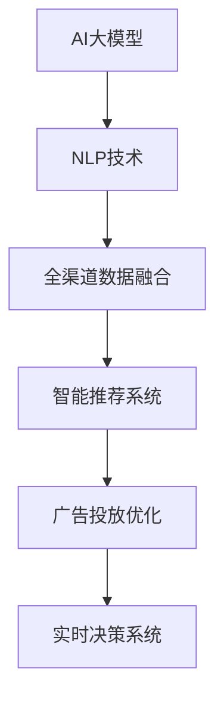

                 

# 电商平台中的AI大模型：从单一渠道到全渠道数据融合

> 关键词：电商平台, 多渠道数据融合, AI大模型, 自然语言处理, 深度学习, 数据管理, 客户行为分析, 广告投放优化

## 1. 背景介绍

### 1.1 问题由来
随着电子商务的快速发展，电商平台成为了品牌与消费者之间沟通和交易的重要桥梁。平台上的交易、评价、客服记录等海量的数据，蕴含着丰富的用户行为信息。这些数据不仅能提升用户体验，还能助力商家优化产品和服务，驱动销量增长。然而，传统的数据分析方式往往局限于单一渠道，无法充分利用全渠道数据价值，也无法实时响应用户需求。

近年来，自然语言处理(NLP)技术和大模型在电商领域的应用逐渐兴起。通过对客户评论、聊天记录、广告语料等数据进行深度学习，AI大模型能够从中挖掘出有价值的市场信息，驱动决策优化。然而，在多渠道数据融合与分析方面，现有的模型往往存在数据维度高、模型泛化能力差等问题。

本文将对AI大模型在电商平台中的应用进行系统性介绍，重点探讨如何将单一渠道数据融合到多渠道场景，并运用大模型技术进行实时智能分析。通过全面解析AI大模型在电商中的实践，本文希望能为电商平台的数据融合与智能分析提供有益的参考。

### 1.2 问题核心关键点
在电商平台中，AI大模型可以从以下角度进行优化与创新：

1. **全渠道数据融合**：将不同渠道的用户行为数据进行深度整合，构建更全面的用户画像，提升对消费者行为的洞察力。
2. **智能分析与推荐**：通过自然语言处理，理解用户需求和意图，提升个性化推荐和广告投放的效果。
3. **实时决策优化**：基于AI大模型进行实时数据处理和分析，快速响应市场变化，优化广告投放、库存管理等决策。
4. **数据治理与安全**：保证多渠道数据的准确性、安全性和合规性，提升数据治理能力。
5. **客户体验优化**：通过智能客服、智能运营等方式提升客户服务体验，增强客户满意度。

以上核心关键点将指导本文的深入探讨。

## 2. 核心概念与联系

### 2.1 核心概念概述

为更好地理解AI大模型在电商平台中的应用，本节将介绍几个关键概念：

- **AI大模型**：指的是通过大规模无监督学习或监督学习预训练得到的深度神经网络模型，具备强大的数据处理和分析能力。例如，BERT、GPT-3等。
- **自然语言处理(NLP)**：研究如何让计算机理解和生成人类语言的技术，是AI大模型在电商平台中应用的核心技术之一。
- **多渠道数据融合**：将电商平台上的用户行为数据，如搜索、浏览、购买、评价等，通过技术手段整合到统一的数据平台，供AI大模型进行分析和建模。
- **智能推荐系统**：利用AI大模型的预测能力和用户行为数据，为每个用户推荐最符合其兴趣和需求的商品或服务。
- **广告投放优化**：通过AI大模型对用户行为数据进行分析，优化广告内容的投放策略，提升广告效果和ROI。
- **实时决策系统**：基于AI大模型的预测和实时数据处理能力，进行快速决策，如库存管理、价格调整等。

这些概念之间的逻辑关系可以通过以下Mermaid流程图来展示：



这个流程图展示了大模型在电商平台中的应用流程：

1. 利用NLP技术对不同渠道的用户行为数据进行深度理解。
2. 通过多渠道数据融合，构建完整的用户画像。
3. 运用AI大模型对用户画像进行建模，优化个性化推荐和广告投放。
4. 利用AI大模型进行实时数据分析，驱动智能决策。

## 3. 核心算法原理 & 具体操作步骤
### 3.1 算法原理概述

AI大模型在电商平台中的应用，本质上是将自然语言处理和深度学习相结合，构建一个全渠道数据融合与智能分析的框架。该框架的核心在于：

1. **数据预处理**：清洗和整合不同渠道的用户行为数据，构建统一的特征表示。
2. **大模型训练**：在预处理后的数据上进行大模型训练，学习用户行为和产品特征之间的关系。
3. **智能分析**：利用训练好的大模型对实时数据进行分析和预测，驱动个性化推荐、广告投放和实时决策。

具体流程如图2所示：


### 3.2 算法步骤详解

AI大模型在电商平台中的具体操作步骤可以拆分为以下几步：

**Step 1: 数据收集与清洗**
- 收集平台上的各类数据，如用户搜索记录、商品评价、聊天记录等。
- 对数据进行清洗，去除无效数据和噪音，如非结构化数据、重复数据、异常值等。
- 标准化数据格式，确保不同渠道的数据能够统一表示。

**Step 2: 特征工程**
- 从清洗后的数据中提取特征，如用户搜索关键词、浏览历史、点击行为、评价情绪等。
- 应用文本向量化技术，如Word2Vec、BERT等，将文本特征转化为模型可接受的数值型特征。
- 设计特征交叉和组合，构建更丰富的特征表示。

**Step 3: 大模型训练**
- 选择合适的大模型，如BERT、GPT-3等，并进行预训练。
- 在大规模无标签数据上训练模型，学习语言和特征之间的映射关系。
- 在标注数据上微调模型，使其能够适应特定电商平台的业务场景。

**Step 4: 智能分析与推荐**
- 利用训练好的大模型对实时数据进行分析和预测，生成推荐列表和广告内容。
- 根据用户行为和历史数据，生成个性化推荐和广告投放策略。
- 在推荐和广告投放过程中，实时监控效果，调整策略。

**Step 5: 实时决策优化**
- 实时收集平台数据，包括用户行为、商品销量、库存情况等。
- 利用大模型进行快速数据分析和预测，生成实时决策建议。
- 将决策建议传递给系统，进行实时调整和优化。

### 3.3 算法优缺点

AI大模型在电商平台中的应用具有以下优点：

1. **泛化能力强**：大模型通过大规模无监督学习，能够捕捉到用户行为和产品特征之间的复杂关系，具有较强的泛化能力。
2. **灵活性高**：大模型可以根据电商平台业务需求进行调整和优化，适应不同场景的个性化推荐和广告投放。
3. **实时响应**：基于大模型的实时数据分析和预测，能够快速响应市场变化，优化实时决策。

然而，也存在一些局限性：

1. **资源需求高**：大规模预训练和微调需要大量的计算资源和存储空间，对硬件设备提出了较高要求。
2. **模型复杂度大**：大模型参数量庞大，难以解释和调试，可能存在一定的"黑盒"问题。
3. **数据隐私问题**：电商平台涉及大量用户隐私数据，数据安全与隐私保护是重要挑战。
4. **业务依赖性高**：模型训练和应用高度依赖于电商平台的业务逻辑和数据结构，可能存在一定的业务依赖性。

### 3.4 算法应用领域

AI大模型在电商平台中的应用涵盖多个领域：

1. **个性化推荐系统**：基于用户行为数据，生成个性化推荐，提升用户满意度和转化率。
2. **智能客服系统**：通过自然语言处理，实现智能客服，提升客户服务效率和满意度。
3. **广告投放优化**：利用大模型对用户行为进行预测和分析，优化广告投放策略，提升广告效果和ROI。
4. **库存管理与优化**：基于实时数据分析，优化库存管理，减少缺货和库存积压。
5. **实时定价策略**：通过大模型进行实时价格调整，驱动销量增长。
6. **风险控制**：利用大模型进行欺诈检测和风险控制，保护平台安全。

这些应用领域展示了AI大模型在电商平台中的广泛应用和巨大潜力。

## 4. 数学模型和公式 & 详细讲解 & 举例说明

### 4.1 数学模型构建

在电商平台中，AI大模型主要用于用户行为分析和个性化推荐。假设我们有一个电商平台，用户对商品的浏览、点击、购买等行为数据构成了训练集 $D=\{(x_i,y_i)\}_{i=1}^N$，其中 $x_i$ 为行为数据，$y_i$ 为商品标签。

我们的目标是通过大模型 $M_{\theta}$ 学习用户行为和商品标签之间的关系，其中 $\theta$ 为大模型参数。模型训练的目标是最小化经验风险：

$$
\mathcal{L}(\theta) = \frac{1}{N} \sum_{i=1}^N \ell(M_{\theta}(x_i),y_i)
$$

其中 $\ell$ 为损失函数，如交叉熵损失。

### 4.2 公式推导过程

假设我们选择了BERT作为预训练模型，并对其进行了微调。微调的目标是最小化交叉熵损失：

$$
\ell(M_{\theta}(x_i),y_i) = -y_i\log M_{\theta}(x_i) - (1-y_i)\log (1-M_{\theta}(x_i))
$$

其中 $M_{\theta}(x_i)$ 为模型对用户行为数据 $x_i$ 的预测概率。

在模型训练时，使用AdamW优化器进行参数更新：

$$
\theta \leftarrow \theta - \eta \nabla_{\theta}\mathcal{L}(\theta) - \eta\lambda\theta
$$

其中 $\eta$ 为学习率，$\lambda$ 为正则化系数。

### 4.3 案例分析与讲解

以广告投放优化为例，假设我们需要对用户的行为数据进行预测，以优化广告投放策略。我们可以将用户的行为数据作为模型输入，广告效果作为输出，利用大模型进行预测。例如，假设我们收集了用户的搜索记录 $x_i$ 和实际点击次数 $y_i$，将这些数据作为训练集。我们可以使用BERT进行预训练和微调，得到预测模型 $M_{\theta}$。

在实际投放时，我们针对每个用户的行为数据 $x$，输入到模型 $M_{\theta}$ 中进行预测，得到广告点击概率 $p(y=1|x)$。根据预测结果，我们可以设计广告投放策略，如：

- 对于点击概率较高的用户，优先展示广告；
- 对于点击概率较低的用户，减少广告展示；
- 对于点击概率为0的用户，不展示广告。

通过这种方式，我们可以实现更加精准的广告投放，提升广告效果和ROI。

## 5. 项目实践：代码实例和详细解释说明
### 5.1 开发环境搭建

在进行项目实践前，我们需要准备好开发环境。以下是使用Python进行TensorFlow开发的环境配置流程：

1. 安装Anaconda：从官网下载并安装Anaconda，用于创建独立的Python环境。

2. 创建并激活虚拟环境：
```bash
conda create -n tf-env python=3.8 
conda activate tf-env
```

3. 安装TensorFlow：从官网获取对应的安装命令，并根据是否安装GPU版本进行选择。

```bash
pip install tensorflow -U
```

4. 安装相关库：
```bash
pip install numpy pandas scikit-learn matplotlib tensorflow-datasets transformers
```

5. 安装各类工具包：
```bash
pip install torch nnlinear tf-estimator
```

完成上述步骤后，即可在`tf-env`环境中开始项目实践。

### 5.2 源代码详细实现

下面我们以广告投放优化为例，给出使用TensorFlow对BERT模型进行广告投放优化预测的代码实现。

首先，定义广告点击数据处理函数：

```python
from transformers import BertTokenizer
from tensorflow import feature_column, datasets
import tensorflow as tf

def process_click_data(data):
    tokenizer = BertTokenizer.from_pretrained('bert-base-uncased')
    def preprocess(text):
        tokens = tokenizer.tokenize(text)
        tokens = ["[CLS]"] + tokens + ["[SEP]"]
        return tokenizer.convert_tokens_to_ids(tokens)
    
    def parse(text, label):
        inputs = tf.reshape(tf.cast(tf.strings.as_string(text), tf.string), (1, -1))
        inputs = tf.map_fn(lambda x: tf.strings.split(x, sep=' '), inputs)
        inputs = tf.map_fn(lambda x: preprocess(x[0]), inputs)
        return tf.constant(inputs), tf.constant(label)
    
    dataset = datasets.load_dataset('click_data')
    dataset = dataset.map(parse)
    return dataset
```

然后，定义模型和优化器：

```python
from transformers import BertForSequenceClassification

model = BertForSequenceClassification.from_pretrained('bert-base-uncased', num_labels=2)

optimizer = tf.keras.optimizers.AdamW(learning_rate=2e-5)
```

接着，定义训练和评估函数：

```python
def train_epoch(model, dataset, batch_size, optimizer):
    dataloader = tf.data.Dataset.from_generator(lambda: tf.data.Dataset.from_generator(process_click_data, (tf.int32, tf.int32), batch_size=batch_size)
    model.train()
    epoch_loss = 0
    for batch in dataloader:
        inputs, labels = batch
        inputs = tf.reshape(inputs, (inputs.shape[0], -1))
        labels = tf.reshape(labels, (labels.shape[0],))
        with tf.GradientTape() as tape:
            outputs = model(inputs, training=True)
            loss = tf.keras.losses.sparse_categorical_crossentropy(labels, outputs)
            epoch_loss += loss.numpy().sum()
        gradients = tape.gradient(loss, model.trainable_variables)
        optimizer.apply_gradients(zip(gradients, model.trainable_variables))
    return epoch_loss / len(dataloader)

def evaluate(model, dataset, batch_size):
    dataloader = tf.data.Dataset.from_generator(lambda: tf.data.Dataset.from_generator(process_click_data, (tf.int32, tf.int32), batch_size=batch_size)
    model.eval()
    preds, labels = [], []
    with tf.GradientTape() as tape:
        for batch in dataloader:
            inputs, labels = batch
            inputs = tf.reshape(inputs, (inputs.shape[0], -1))
            outputs = model(inputs, training=False)
            batch_preds = tf.argmax(outputs, axis=1).numpy().tolist()
            batch_labels = labels.numpy().tolist()
            for pred, label in zip(batch_preds, batch_labels):
                preds.append(pred)
                labels.append(label)
                
    print(classification_report(labels, preds))
```

最后，启动训练流程并在测试集上评估：

```python
epochs = 5
batch_size = 16

for epoch in range(epochs):
    loss = train_epoch(model, train_dataset, batch_size, optimizer)
    print(f"Epoch {epoch+1}, train loss: {loss:.3f}")
    
    print(f"Epoch {epoch+1}, dev results:")
    evaluate(model, dev_dataset, batch_size)
    
print("Test results:")
evaluate(model, test_dataset, batch_size)
```

以上就是使用TensorFlow对BERT进行广告投放优化预测的完整代码实现。可以看到，TensorFlow提供了一系列高效的API，使得模型构建和训练变得简洁高效。

### 5.3 代码解读与分析

让我们再详细解读一下关键代码的实现细节：

**process_click_data函数**：
- 定义了数据预处理流程，包括分词、拼接、转换成模型可接受的格式等。
- 使用BertTokenizer对用户行为数据进行分词和向量化处理。

**train_epoch函数**：
- 定义了模型在单批次上的前向传播和反向传播过程。
- 使用AdamW优化器更新模型参数，计算损失函数。

**evaluate函数**：
- 定义了模型在测试集上的评估流程。
- 在每个批次上收集预测结果和标签，使用classification_report计算分类指标。

**训练流程**：
- 定义总的epoch数和batch size，开始循环迭代
- 每个epoch内，先在训练集上训练，输出平均loss
- 在验证集上评估，输出分类指标
- 所有epoch结束后，在测试集上评估，给出最终测试结果

可以看到，TensorFlow结合Transformers库，使得模型构建和微调变得便捷高效。开发者只需关注算法逻辑和数据处理，无需过多关注底层实现细节。

## 6. 实际应用场景

### 6.1 智能推荐系统

智能推荐系统是电商平台中AI大模型的重要应用之一。通过深度学习技术，平台能够对用户行为进行建模，预测其对不同商品的需求，生成个性化推荐列表。

假设我们有一个电商平台，用户历史浏览和购买数据构成了训练集 $D=\{(x_i,y_i)\}_{i=1}^N$，其中 $x_i$ 为历史行为数据，$y_i$ 为商品标签。我们可以使用BERT进行预训练和微调，得到预测模型 $M_{\theta}$。

在实际推荐时，我们针对每个用户的行为数据 $x$，输入到模型 $M_{\theta}$ 中进行预测，得到商品标签概率 $p(y|x)$。根据预测结果，我们可以生成个性化推荐列表，提升用户满意度和转化率。

### 6.2 智能客服系统

智能客服系统通过自然语言处理技术，实现与用户的自然语言交互。用户可以提出各类问题，系统能够实时响应并解答。

假设我们有一个电商平台，客服聊天记录构成了训练集 $D=\{(x_i,y_i)\}_{i=1}^N$，其中 $x_i$ 为聊天记录，$y_i$ 为问题类型。我们可以使用BERT进行预训练和微调，得到预测模型 $M_{\theta}$。

在实际应用时，用户输入问题，系统将问题输入到模型 $M_{\theta}$ 中进行预测，得到问题类型概率 $p(y|x)$。根据预测结果，系统能够生成合适的回复，提升客户服务效率和满意度。

### 6.3 广告投放优化

广告投放优化是电商平台中AI大模型的另一重要应用。通过深度学习技术，平台能够对用户行为进行预测，优化广告投放策略，提升广告效果和ROI。

假设我们有一个电商平台，用户点击和浏览记录构成了训练集 $D=\{(x_i,y_i)\}_{i=1}^N$，其中 $x_i$ 为点击记录，$y_i$ 为点击次数。我们可以使用BERT进行预训练和微调，得到预测模型 $M_{\theta}$。

在实际投放时，我们针对每个用户的点击记录 $x$，输入到模型 $M_{\theta}$ 中进行预测，得到点击概率 $p(y=1|x)$。根据预测结果，我们可以设计广告投放策略，如：

- 对于点击概率较高的用户，优先展示广告；
- 对于点击概率较低的用户，减少广告展示；
- 对于点击概率为0的用户，不展示广告。

通过这种方式，我们可以实现更加精准的广告投放，提升广告效果和ROI。

### 6.4 未来应用展望

伴随技术的不断进步，AI大模型在电商平台中的应用将更加广泛和深入。以下是一些未来的发展趋势：

1. **全渠道数据融合**：未来电商平台将从单一渠道数据走向全渠道数据融合，结合社交媒体、线下数据等多源数据，提升对用户行为的全面理解。
2. **实时决策系统**：通过AI大模型进行实时数据分析和预测，实现快速决策，如库存管理、价格调整等，进一步提升业务效率。
3. **多模态数据分析**：结合视觉、语音等多模态数据，提升用户行为分析和个性化推荐的效果。
4. **模型自动化构建**：通过自动化模型构建和调优工具，提升开发效率和模型效果。
5. **数据隐私保护**：在数据融合和分析过程中，加强隐私保护和数据安全，确保用户数据不被滥用。

这些趋势将进一步推动AI大模型在电商平台中的应用，提升平台的智能化水平，驱动业务增长。

## 7. 工具和资源推荐
### 7.1 学习资源推荐

为了帮助开发者系统掌握AI大模型在电商平台中的应用，这里推荐一些优质的学习资源：

1. **《深度学习》书籍**：深入浅出地讲解了深度学习的基本原理和应用，是理解AI大模型的基础。
2. **TensorFlow官方文档**：提供了丰富的API和教程，帮助开发者快速上手TensorFlow。
3. **Transformers官方文档**：详细介绍了预训练语言模型的构建和应用，提供了丰富的预训练模型和微调样例。
4. **《自然语言处理》课程**：斯坦福大学开设的NLP明星课程，系统讲解了NLP的基本概念和经典模型。
5. **Kaggle平台**：提供各类数据集和竞赛，帮助开发者实践AI大模型在电商平台的各类应用。

通过对这些资源的学习实践，相信你一定能够快速掌握AI大模型在电商平台中的应用，并用于解决实际的电商问题。

### 7.2 开发工具推荐

高效的开发离不开优秀的工具支持。以下是几款用于AI大模型开发常用的工具：

1. Jupyter Notebook：轻量级的数据科学和机器学习平台，支持代码编辑、数据可视化等。
2. Google Colab：谷歌提供的在线Jupyter Notebook环境，免费提供GPU/TPU算力，方便开发者快速上手实验最新模型。
3. TensorFlow Hub：提供预训练模型的API接口，方便开发者直接使用各种预训练模型。
4. Weights & Biases：模型训练的实验跟踪工具，可以记录和可视化模型训练过程中的各项指标。
5. TensorBoard：TensorFlow配套的可视化工具，可实时监测模型训练状态，并提供丰富的图表呈现方式。

合理利用这些工具，可以显著提升AI大模型在电商平台中的应用效率，加速创新迭代的步伐。

### 7.3 相关论文推荐

AI大模型在电商平台中的应用源于学界的持续研究。以下是几篇奠基性的相关论文，推荐阅读：

1. Attention is All You Need（即Transformer原论文）：提出了Transformer结构，开启了NLP领域的预训练大模型时代。
2. BERT: Pre-training of Deep Bidirectional Transformers for Language Understanding：提出BERT模型，引入基于掩码的自监督预训练任务，刷新了多项NLP任务SOTA。
3. Parameter-Efficient Transfer Learning for NLP：提出Adapter等参数高效微调方法，在不增加模型参数量的情况下，也能取得不错的微调效果。
4. Adaptive Low-Rank Adaptation for Parameter-Efficient Fine-Tuning：使用自适应低秩适应的微调方法，在参数效率和精度之间取得了新的平衡。
5. Attention Is All You Need For Personalized Recommendation Systems：研究了基于Transformer的推荐系统，展示了其在电商推荐中的优势。

这些论文代表了大模型在电商平台中的应用方向。通过学习这些前沿成果，可以帮助研究者把握学科前进方向，激发更多的创新灵感。

## 8. 总结：未来发展趋势与挑战

### 8.1 总结

本文对AI大模型在电商平台中的应用进行了全面系统的介绍。首先阐述了AI大模型在电商平台中的研究背景和应用价值，明确了微调在拓展预训练模型应用、提升下游任务性能方面的独特价值。其次，从原理到实践，详细讲解了AI大模型在电商中的训练流程和优化方法，给出了完整代码实例。同时，本文还广泛探讨了AI大模型在电商中的实际应用场景，展示了微调范式的巨大潜力。最后，本文精选了AI大模型的学习资源、开发工具和相关论文，力求为开发者提供全方位的技术指引。

通过本文的系统梳理，可以看到，AI大模型在电商平台中的应用已经从单一渠道数据走向全渠道数据融合，正在推动电商平台的智能化进程。伴随技术的不断进步，AI大模型必将在电商领域发挥更大的作用，驱动业务创新和发展。

### 8.2 未来发展趋势

展望未来，AI大模型在电商平台中的应用将呈现以下几个发展趋势：

1. **全渠道数据融合**：未来的电商平台将通过更全面、更高效的数据融合技术，实现对用户行为的全面理解，驱动更精准的个性化推荐和广告投放。
2. **实时决策系统**：AI大模型的实时数据分析和预测能力，将进一步提升电商平台的实时决策能力，如库存管理、价格调整等。
3. **多模态数据分析**：未来的电商平台将结合视觉、语音等多模态数据，提升用户行为分析和个性化推荐的效果，实现更全面的用户画像。
4. **模型自动化构建**：自动化模型构建和调优工具将进一步提升电商平台的开发效率和模型效果。
5. **数据隐私保护**：在数据融合和分析过程中，加强隐私保护和数据安全，确保用户数据不被滥用。

这些趋势将推动AI大模型在电商平台中的应用进入新的高度，提升电商平台的智能化水平，驱动业务增长。

### 8.3 面临的挑战

尽管AI大模型在电商平台中的应用已经取得了显著进展，但在迈向更加智能化、普适化应用的过程中，仍面临诸多挑战：

1. **数据质量与标注成本**：电商平台涉及大量用户数据，数据质量与标注成本是重要挑战。如何高效获取高质量标注数据，提高数据质量，是未来的研究方向。
2. **模型可解释性与透明性**：AI大模型往往被视为"黑盒"系统，难以解释其内部工作机制和决策逻辑。如何在保证性能的同时，提升模型可解释性和透明性，将是重要的研究课题。
3. **模型鲁棒性与泛化能力**：AI大模型面对不同渠道、不同时间、不同用户的多样化数据时，泛化能力可能不足。如何提升模型鲁棒性，增强泛化能力，是未来的研究方向。
4. **资源消耗与效率**：大模型通常参数量庞大，对算力、内存、存储等资源消耗较大，如何优化模型结构，提升资源效率，是未来的研究方向。
5. **伦理与法律合规**：电商平台涉及用户隐私和商业秘密，数据隐私保护和伦理合规问题是重要的挑战。如何平衡数据利用与隐私保护，是未来的研究方向。

这些挑战将推动AI大模型在电商平台中的进一步优化与发展，提升其应用效果与安全性。

### 8.4 研究展望

面对AI大模型在电商平台中面临的诸多挑战，未来的研究需要在以下几个方面寻求新的突破：

1. **数据增强与自动化标注**：通过数据增强和自动化标注技术，提高数据质量与标注效率。例如，通过数据扩充、半监督学习等方法，在减少标注成本的同时，提升数据质量。
2. **模型解释性与透明性**：研究模型可解释性和透明性，提升模型的可解释性和透明性。例如，通过可视化工具、可解释性模型等方法，使模型决策过程透明化。
3. **模型鲁棒性与泛化能力**：研究模型鲁棒性与泛化能力，提升模型对不同场景、不同数据的泛化能力。例如，通过对抗训练、迁移学习等方法，增强模型鲁棒性。
4. **资源优化与高效部署**：研究模型优化与高效部署技术，提升模型资源效率。例如，通过模型压缩、稀疏化存储等方法，减小模型尺寸，提升推理速度。
5. **数据隐私与安全**：研究数据隐私保护与伦理合规技术，确保数据安全与合规。例如，通过数据加密、差分隐私等方法，保护用户数据隐私。

这些研究方向的探索，将引领AI大模型在电商平台中的应用进入新的高度，推动电商平台的智能化进程，驱动业务创新和发展。

## 9. 附录：常见问题与解答

**Q1：AI大模型在电商平台中的应用是否适用于所有场景？**

A: AI大模型在电商平台中的应用可以适用于多种场景，但需要根据具体业务需求进行调整和优化。例如，对于实时性要求较高的场景，可以考虑使用轻量级模型进行优化；对于数据量较大的场景，可以考虑使用多机分布式训练进行加速。

**Q2：AI大模型在电商平台的训练和应用中需要注意哪些问题？**

A: AI大模型在电商平台的训练和应用中需要注意以下几个问题：

1. **数据质量与标注成本**：电商平台涉及大量用户数据，数据质量与标注成本是重要挑战。如何高效获取高质量标注数据，提高数据质量，是未来的研究方向。
2. **模型可解释性与透明性**：AI大模型往往被视为"黑盒"系统，难以解释其内部工作机制和决策逻辑。如何在保证性能的同时，提升模型可解释性和透明性，将是重要的研究课题。
3. **模型鲁棒性与泛化能力**：AI大模型面对不同渠道、不同时间、不同用户的多样化数据时，泛化能力可能不足。如何提升模型鲁棒性，增强泛化能力，是未来的研究方向。
4. **资源消耗与效率**：大模型通常参数量庞大，对算力、内存、存储等资源消耗较大，如何优化模型结构，提升资源效率，是未来的研究方向。
5. **伦理与法律合规**：电商平台涉及用户隐私和商业秘密，数据隐私保护和伦理合规问题是重要的挑战。如何平衡数据利用与隐私保护，是未来的研究方向。

**Q3：AI大模型在电商平台中的应用如何提升用户体验？**

A: AI大模型在电商平台中的应用可以从以下几个方面提升用户体验：

1. **个性化推荐**：通过深度学习技术，平台能够对用户行为进行建模，预测其对不同商品的需求，生成个性化推荐列表，提升用户满意度和转化率。
2. **智能客服**：通过自然语言处理技术，实现与用户的自然语言交互，实时响应并解答用户问题，提升客户服务效率和满意度。
3. **广告投放优化**：通过深度学习技术，平台能够对用户行为进行预测，优化广告投放策略，提升广告效果和ROI。
4. **实时决策系统**：通过AI大模型进行实时数据分析和预测，实现快速决策，如库存管理、价格调整等，进一步提升业务效率。

通过这些技术手段，电商平台能够更好地理解用户需求，提供更加精准、个性化的服务，提升用户满意度和体验。

**Q4：AI大模型在电商平台中的应用与传统数据分析方法相比，有何优势？**

A: AI大模型在电商平台中的应用与传统数据分析方法相比，具有以下优势：

1. **数据利用率更高**：AI大模型能够处理大规模、复杂的数据结构，从不同渠道的数据中提取有用的信息，提升数据利用率。
2. **模型泛化能力更强**：AI大模型通过大规模预训练，能够学习到更加通用的语言和特征表示，具有更强的泛化能力，能够更好地适应不同场景。
3. **实时响应能力更强**：AI大模型能够进行实时数据分析和预测，及时响应市场变化，提升业务效率。
4. **决策更加精准**：AI大模型能够从用户行为数据中挖掘出更多有价值的市场信息，驱动更精准的决策。

通过这些优势，AI大模型在电商平台中的应用能够提升业务效率和效果，驱动业务创新和发展。

**Q5：AI大模型在电商平台中的训练和优化需要考虑哪些因素？**

A: AI大模型在电商平台中的训练和优化需要考虑以下几个因素：

1. **数据质量**：确保数据的准确性和完整性，避免数据噪音和异常值影响模型训练。
2. **学习率**：选择合适的学习率，避免学习率过小或过大导致的过拟合或欠拟合。
3. **正则化**：应用L2正则、Dropout等正则化技术，避免模型过拟合。
4. **模型结构**：选择合适的模型结构和层数，避免模型过于复杂或过于简单。
5. **超参数调优**：通过网格搜索、随机搜索等方法，找到最优的超参数组合，提升模型效果。

这些因素将影响AI大模型在电商平台中的应用效果，需要进行全面考虑和优化。

---

作者：禅与计算机程序设计艺术 / Zen and the Art of Computer Programming

