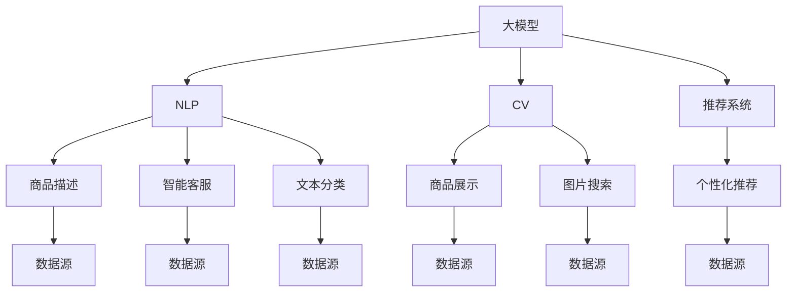

                 

## 1. 背景介绍

### 1.1 问题由来
随着电商平台规模的不断扩大，数据量呈指数级增长。为了提升平台的运营效率和用户体验，电商企业需要依托人工智能(AI)技术，实现自动化、智能化的管理和决策。AI大模型在自然语言处理(NLP)、计算机视觉(CV)、推荐系统等领域的应用，极大地改善了电商平台的业务效果。然而，AI大模型处理海量数据的效率，往往无法满足实时响应的需求，特别是在需要即时处理的业务场景中。因此，如何将大模型应用于电商平台，同时兼顾数据处理效率和实时性，成为一个亟待解决的问题。

### 1.2 问题核心关键点
本文聚焦于如何将大模型应用于电商平台，特别是如何在离线批处理和实时流处理中，充分发挥大模型的优势。具体关键点包括：
- 大模型在电商平台中的应用场景。
- 大模型在离线批处理和实时流处理中的技术特点。
- 如何在大模型处理海量数据时，提升效率和实时性。

### 1.3 问题研究意义
研究如何将AI大模型应用于电商平台，对于提升电商平台的智能化水平，优化运营决策，提高用户体验，具有重要意义：

1. 提升运营效率。AI大模型可以自动处理订单、客户服务、库存管理等业务数据，降低人工操作成本，提高处理效率。
2. 改善用户体验。通过智能推荐、个性化搜索等技术，提升用户的购物体验和满意度。
3. 优化决策分析。AI大模型可以对用户行为、市场趋势进行深度分析，为运营决策提供数据支持。
4. 拓展市场规模。利用大模型对用户行为进行精准分析，获取更深的用户洞察，发现潜在市场机会。
5. 增强安全性。AI大模型可以检测异常交易，提升平台的安全性。

通过解决电商平台中大模型的应用问题，可以显著提升电商平台的智能化和自动化水平，为电商企业带来显著的商业价值。

## 2. 核心概念与联系

### 2.1 核心概念概述

为更好地理解大模型在电商平台中的应用，本节将介绍几个密切相关的核心概念：

- 人工智能大模型(AI Large Model)：以Transformer、BERT、GPT等架构为代表的大型深度学习模型。通过在大规模无标签数据上进行预训练，学习到广泛的通用知识，具备强大的数据处理能力。

- 自然语言处理(Natural Language Processing, NLP)：涉及文本的自动处理和分析，如分词、命名实体识别、情感分析等。在电商平台上，NLP技术用于商品描述生成、智能客服、文本分类等任务。

- 计算机视觉(Computer Vision, CV)：涉及图像和视频的自动处理和分析，如物体检测、图像分类等。在电商平台上，CV技术用于商品展示、图片搜索等任务。

- 推荐系统(Recommender System)：根据用户行为数据，自动生成个性化推荐，提升用户的购物体验和平台转化率。在大模型驱动的推荐系统中，通过学习用户行为和商品特征，生成精准的推荐结果。

- 批处理(Batch Processing)：将大量数据分成若干批，批量处理。适用于数据量较大但可以预先获取的场景，如离线训练和分析。

- 流处理(Stream Processing)：实时处理数据流，适用于对实时性和延迟有严格要求的应用场景。

这些核心概念之间的逻辑关系可以通过以下Mermaid流程图来展示：



这个流程图展示了大模型在电商平台中的核心概念及其之间的关系：

1. 大模型通过在NLP、CV领域进行预训练，获取通用知识。
2. 在推荐系统、智能客服等应用中，通过离线批处理或实时流处理，提升用户体验和运营效率。
3. NLP、CV、推荐系统等模块作为数据源，为大模型提供业务数据。

## 3. 核心算法原理 & 具体操作步骤
### 3.1 算法原理概述

基于大模型的电商平台应用，通常需要处理海量的数据，涵盖文本、图片、用户行为等多模态数据。为了高效处理这些数据，同时兼顾实时性要求，可以采用批处理和流处理的结合方式。具体而言，离线批处理适用于数据量较大但可以预先获取的场景，而流处理适用于实时性要求较高的业务场景。

批处理和流处理结合的架构，通常包括以下几个关键步骤：

1. 离线批处理：收集电商平台的业务数据，进行预处理和特征提取，生成训练数据集。对大模型进行离线训练，生成模型参数。

2. 实时流处理：在电商平台上实时收集用户行为数据，进行预处理和特征提取，生成实时数据流。将实时数据流输入微调模型，进行推理预测。

3. 集成与评估：将微调模型的输出与离线批处理得到的模型参数进行集成，得到最终的预测结果。对预测结果进行评估，优化模型参数。

4. 持续学习：根据实时流处理中收集的数据，定期更新模型参数，保持模型的最新状态。

### 3.2 算法步骤详解

**Step 1: 离线批处理流程**

1. 数据收集与预处理：
   - 从电商平台的各个业务系统中，收集用户行为数据、商品信息、评论等数据。
   - 对数据进行清洗、去重、格式化等预处理操作，确保数据的质量。
   - 进行特征提取，生成NLP、CV领域需要的特征向量。

2. 特征向量化：
   - 使用预训练的词向量模型，如BERT、Word2Vec等，将文本数据转换为高维向量。
   - 使用预训练的图像识别模型，如ResNet、CNN等，提取图像特征。
   - 使用统计方法，如TF-IDF、PCA等，提取文本、图像的统计特征。

3. 数据分割与训练：
   - 将数据集划分为训练集、验证集和测试集。
   - 对大模型进行离线训练，得到模型参数。
   - 在训练集上进行模型训练，调整超参数，优化模型性能。

4. 模型保存与部署：
   - 保存训练好的模型参数，以便后续调用。
   - 将模型部署到服务器上，进行API接口开发，供电商平台调用。

**Step 2: 实时流处理流程**

1. 数据流收集与预处理：
   - 实时收集电商平台上的用户行为数据，如点击、浏览、购买等。
   - 对实时数据进行清洗、去重、格式化等预处理操作，确保数据的质量。
   - 进行特征提取，生成NLP、CV领域需要的特征向量。

2. 数据流增强：
   - 对实时数据进行增强操作，如数据插值、回译、近义替换等，提升模型鲁棒性。
   - 引入对抗样本，提高模型的鲁棒性和泛化能力。

3. 数据流微调：
   - 将实时数据流输入微调模型，进行推理预测。
   - 调整微调模型的超参数，如学习率、批大小、迭代轮数等。
   - 使用正则化技术，如L2正则、Dropout、Early Stopping等，避免过拟合。

4. 实时反馈与优化：
   - 根据实时流处理中收集的反馈数据，定期更新模型参数，优化模型性能。
   - 将微调模型的输出与离线批处理得到的模型参数进行集成，得到最终的预测结果。

**Step 3: 集成与评估**

1. 集成策略：
   - 将离线批处理得到的模型参数与实时流处理得到的微调模型进行集成，得到最终预测结果。
   - 可以使用加权平均、堆叠集成等策略，提升预测结果的准确性。

2. 评估与优化：
   - 使用离线测试集对集成后的模型进行评估，计算准确率、召回率、F1值等指标。
   - 根据评估结果，调整模型参数，优化模型性能。

3. 系统集成与部署：
   - 将优化后的模型集成到电商平台中，供业务系统调用。
   - 开发API接口，支持电商平台的实时查询和预测功能。

**Step 4: 持续学习与迭代**

1. 数据流汇聚与融合：
   - 将离线批处理和实时流处理得到的数据进行汇聚和融合，得到统一的数据集。
   - 对汇聚后的数据进行清洗、去重、格式化等预处理操作，确保数据的质量。

2. 持续学习与微调：
   - 对汇聚后的数据集进行微调，更新模型参数，保持模型的最新状态。
   - 使用对抗样本和对抗训练等技术，提高模型的鲁棒性和泛化能力。

3. 模型更新与部署：
   - 更新训练好的模型参数，部署到服务器上。
   - 更新API接口，供电商平台调用最新的模型。

### 3.3 算法优缺点

基于大模型的电商平台批处理和流处理结合的架构，具有以下优点：

1. 高效处理大规模数据：批处理适用于大规模数据的离线训练，能够充分利用硬件资源，快速处理海量数据。

2. 实时响应业务需求：流处理适用于实时数据流，能够快速响应用户的查询和操作，提升用户体验。

3. 模型可扩展性强：通过批处理和流处理的结合，模型可以灵活扩展，适应不同规模和类型的电商业务需求。

4. 预测精度高：通过离线批处理和实时流处理，模型可以综合利用不同数据源的信息，提高预测精度和鲁棒性。

同时，该架构也存在一些局限性：

1. 对硬件要求高：大规模批处理和实时流处理需要强大的硬件支持，如高性能计算集群、GPU/TPU等。

2. 数据预处理复杂：数据收集、清洗、去重、特征提取等预处理操作复杂，需要专业知识和技术支持。

3. 实时流处理延迟：实时流处理存在一定延迟，难以满足极端高实时性的业务需求。

4. 系统复杂度高：批处理和流处理的结合，增加了系统的复杂度，需要更高效的系统设计和维护。

尽管存在这些局限性，但就目前而言，批处理和流处理的结合架构仍是电商平台中应用大模型的主流方法。未来相关研究的重点在于如何进一步降低硬件成本，提高数据预处理效率，减少实时流处理的延迟，同时兼顾离线批处理和实时流处理的优势。

### 3.4 算法应用领域

基于大模型的电商平台批处理和流处理结合的架构，已经在许多业务场景中得到了广泛应用，例如：

1. 智能客服：利用大模型进行智能对话，提供24小时不间断的客户服务。通过批处理和流处理的结合，实现实时回答用户问题，提升客户满意度。

2. 个性化推荐：通过大模型学习用户行为和商品特征，生成精准的个性化推荐。批处理和流处理的结合，能够实时更新推荐结果，提升用户转化率和购物体验。

3. 实时搜索：利用大模型进行文本和图像的实时搜索，快速定位商品信息。批处理和流处理的结合，能够快速响应用户查询，提升搜索效果。

4. 商品描述生成：利用大模型进行商品描述生成，提升商品展示效果。批处理和流处理的结合，能够实时生成商品描述，满足用户需求。

5. 异常检测：利用大模型进行实时数据流中的异常检测，提升平台安全性。批处理和流处理的结合，能够快速发现异常行为，保障平台稳定运行。

除了上述这些经典应用外，大模型在电商平台的诸多场景中，如商品分类、广告投放、用户画像等，也得到了广泛应用。随着预训练模型和微调方法的不断进步，相信大模型在电商平台中的应用将更加深入和广泛。

## 4. 数学模型和公式 & 详细讲解
### 4.1 数学模型构建

在电商平台中，大模型通常用于自然语言处理和计算机视觉任务，其数学模型和公式与一般的深度学习模型相似。以下以自然语言处理任务为例，简要说明大模型的数学模型构建和公式推导。

假设预训练大模型为 $M_{\theta}$，其中 $\theta$ 为预训练得到的模型参数。对于电商平台的NLP任务，如智能客服、商品描述生成等，可以构建以下数学模型：

1. 输入层：输入文本 $x \in \mathcal{X}$，其中 $\mathcal{X}$ 为文本空间。
2. 输出层：输出结果 $y \in \mathcal{Y}$，其中 $\mathcal{Y}$ 为结果空间，如回答、商品描述等。
3. 隐藏层：通过预训练大模型 $M_{\theta}$ 进行特征提取和表示学习。

假设大模型 $M_{\theta}$ 在输入文本 $x$ 上的输出为 $\hat{y}=M_{\theta}(x)$。则自然语言处理任务的目标为最小化损失函数 $\mathcal{L}$，其中 $\mathcal{L}$ 为交叉熵损失函数：

$$
\mathcal{L} = -\frac{1}{N} \sum_{i=1}^N \sum_{j=1}^M y_{ij} \log \hat{y}_{ij}
$$

其中 $y_{ij}$ 表示样本 $i$ 在类别 $j$ 上的真实标签，$\hat{y}_{ij}$ 表示模型在类别 $j$ 上的预测概率。

### 4.2 公式推导过程

以下以智能客服任务为例，推导交叉熵损失函数的梯度计算公式。

假设模型 $M_{\theta}$ 在输入 $x$ 上的输出为 $\hat{y}=M_{\theta}(x) \in [0,1]$，表示样本属于正类的概率。真实标签 $y \in \{0,1\}$。则二分类交叉熵损失函数定义为：

$$
\ell(M_{\theta}(x),y) = -[y\log \hat{y} + (1-y)\log (1-\hat{y})]
$$

将其代入经验风险公式，得：

$$
\mathcal{L}(\theta) = -\frac{1}{N}\sum_{i=1}^N [y_i\log M_{\theta}(x_i)+(1-y_i)\log(1-M_{\theta}(x_i))]
$$

根据链式法则，损失函数对参数 $\theta_k$ 的梯度为：

$$
\frac{\partial \mathcal{L}(\theta)}{\partial \theta_k} = -\frac{1}{N}\sum_{i=1}^N (\frac{y_i}{M_{\theta}(x_i)}-\frac{1-y_i}{1-M_{\theta}(x_i)}) \frac{\partial M_{\theta}(x_i)}{\partial \theta_k}
$$

其中 $\frac{\partial M_{\theta}(x_i)}{\partial \theta_k}$ 可进一步递归展开，利用自动微分技术完成计算。

在得到损失函数的梯度后，即可带入参数更新公式，完成模型的迭代优化。重复上述过程直至收敛，最终得到适应电商平台上智能客服任务的模型参数 $\theta^*$。

## 5. 项目实践：代码实例和详细解释说明
### 5.1 开发环境搭建

在进行电商平台的AI大模型应用实践前，我们需要准备好开发环境。以下是使用Python进行PyTorch开发的环境配置流程：

1. 安装Anaconda：从官网下载并安装Anaconda，用于创建独立的Python环境。

2. 创建并激活虚拟环境：
```bash
conda create -n pytorch-env python=3.8 
conda activate pytorch-env
```

3. 安装PyTorch：根据CUDA版本，从官网获取对应的安装命令。例如：
```bash
conda install pytorch torchvision torchaudio cudatoolkit=11.1 -c pytorch -c conda-forge
```

4. 安装Transformers库：
```bash
pip install transformers
```

5. 安装各类工具包：
```bash
pip install numpy pandas scikit-learn matplotlib tqdm jupyter notebook ipython
```

完成上述步骤后，即可在`pytorch-env`环境中开始大模型的电商应用实践。

### 5.2 源代码详细实现

下面我们以智能客服任务为例，给出使用Transformers库对BERT模型进行电商应用开发的PyTorch代码实现。

首先，定义智能客服任务的数据处理函数：

```python
from transformers import BertTokenizer
from torch.utils.data import Dataset
import torch

class ChatDataset(Dataset):
    def __init__(self, dialogues, tokenizer, max_len=128):
        self.dialogues = dialogues
        self.tokenizer = tokenizer
        self.max_len = max_len
        
    def __len__(self):
        return len(self.dialogues)
    
    def __getitem__(self, item):
        dialogue = self.dialogues[item]
        
        # 对对话进行预处理和分句
        inputs = []
        targets = []
        for turn in dialogue:
            tokenized = self.tokenizer.tokenize(turn, return_tensors='pt')
            input_ids = tokenized['input_ids']
            attention_mask = tokenized['attention_mask']
            
            # 对token-wise的标签进行编码
            encoded_tags = [1 if 'bot' in turn else 0 for _ in tokenized['input_ids']]
            labels = torch.tensor(encoded_tags, dtype=torch.long)
            
            inputs.append(input_ids)
            targets.append(labels)
        
        # 对对话中的所有输入进行定长padding，并返回模型所需的输入
        padded_input = torch.nn.utils.rnn.pad_sequence(inputs, batch_first=True, padding_value=0)
        padded_target = torch.nn.utils.rnn.pad_sequence(targets, batch_first=True, padding_value=0)
        
        return {'input_ids': padded_input, 
                'attention_mask': padded_target,
                'labels': padded_target}
```

然后，定义模型和优化器：

```python
from transformers import BertForTokenClassification, AdamW

model = BertForTokenClassification.from_pretrained('bert-base-cased', num_labels=2)

optimizer = AdamW(model.parameters(), lr=2e-5)
```

接着，定义训练和评估函数：

```python
from torch.utils.data import DataLoader
from tqdm import tqdm
from sklearn.metrics import accuracy_score

device = torch.device('cuda') if torch.cuda.is_available() else torch.device('cpu')
model.to(device)

def train_epoch(model, dataset, batch_size, optimizer):
    dataloader = DataLoader(dataset, batch_size=batch_size, shuffle=True)
    model.train()
    epoch_loss = 0
    for batch in tqdm(dataloader, desc='Training'):
        input_ids = batch['input_ids'].to(device)
        attention_mask = batch['attention_mask'].to(device)
        labels = batch['labels'].to(device)
        model.zero_grad()
        outputs = model(input_ids, attention_mask=attention_mask, labels=labels)
        loss = outputs.loss
        epoch_loss += loss.item()
        loss.backward()
        optimizer.step()
    return epoch_loss / len(dataloader)

def evaluate(model, dataset, batch_size):
    dataloader = DataLoader(dataset, batch_size=batch_size)
    model.eval()
    preds, labels = [], []
    with torch.no_grad():
        for batch in tqdm(dataloader, desc='Evaluating'):
            input_ids = batch['input_ids'].to(device)
            attention_mask = batch['attention_mask'].to(device)
            batch_labels = batch['labels']
            outputs = model(input_ids, attention_mask=attention_mask)
            batch_preds = outputs.logits.argmax(dim=2).to('cpu').tolist()
            batch_labels = batch_labels.to('cpu').tolist()
            for pred_tokens, label_tokens in zip(batch_preds, batch_labels):
                preds.append(pred_tokens[:len(label_tokens)])
                labels.append(label_tokens)
                
    print('Accuracy:', accuracy_score(labels, preds))
```

最后，启动训练流程并在测试集上评估：

```python
epochs = 5
batch_size = 16

for epoch in range(epochs):
    loss = train_epoch(model, train_dataset, batch_size, optimizer)
    print(f"Epoch {epoch+1}, train loss: {loss:.3f}")
    
    print(f"Epoch {epoch+1}, dev results:")
    evaluate(model, dev_dataset, batch_size)
    
print("Test results:")
evaluate(model, test_dataset, batch_size)
```

以上就是使用PyTorch对BERT模型进行电商智能客服任务微调的完整代码实现。可以看到，得益于Transformers库的强大封装，我们可以用相对简洁的代码完成BERT模型的加载和微调。

### 5.3 代码解读与分析

让我们再详细解读一下关键代码的实现细节：

**ChatDataset类**：
- `__init__`方法：初始化对话数据集、分词器等关键组件。
- `__len__`方法：返回数据集的样本数量。
- `__getitem__`方法：对单个对话进行处理，将对话中的每个回合输入编码为token ids，将标签编码为数字，并对其进行定长padding，最终返回模型所需的输入。

**模型训练与评估**：
- 使用PyTorch的DataLoader对数据集进行批次化加载，供模型训练和推理使用。
- 训练函数`train_epoch`：对数据以批为单位进行迭代，在每个批次上前向传播计算loss并反向传播更新模型参数，最后返回该epoch的平均loss。
- 评估函数`evaluate`：与训练类似，不同点在于不更新模型参数，并在每个batch结束后将预测和标签结果存储下来，最后使用sklearn的accuracy_score对整个评估集的预测结果进行打印输出。

**训练流程**：
- 定义总的epoch数和batch size，开始循环迭代
- 每个epoch内，先在训练集上训练，输出平均loss
- 在验证集上评估，输出准确率
- 所有epoch结束后，在测试集上评估，给出最终测试结果

可以看到，PyTorch配合Transformers库使得BERT微调的代码实现变得简洁高效。开发者可以将更多精力放在数据处理、模型改进等高层逻辑上，而不必过多关注底层的实现细节。

当然，工业级的系统实现还需考虑更多因素，如模型的保存和部署、超参数的自动搜索、更灵活的任务适配层等。但核心的微调范式基本与此类似。

## 6. 实际应用场景
### 6.1 智能客服系统

基于大语言模型微调的对话技术，可以广泛应用于智能客服系统的构建。传统客服往往需要配备大量人力，高峰期响应缓慢，且一致性和专业性难以保证。而使用微调后的对话模型，可以7x24小时不间断服务，快速响应客户咨询，用自然流畅的语言解答各类常见问题。

在技术实现上，可以收集企业内部的历史客服对话记录，将问题和最佳答复构建成监督数据，在此基础上对预训练对话模型进行微调。微调后的对话模型能够自动理解用户意图，匹配最合适的答案模板进行回复。对于客户提出的新问题，还可以接入检索系统实时搜索相关内容，动态组织生成回答。如此构建的智能客服系统，能大幅提升客户咨询体验和问题解决效率。

### 6.2 金融舆情监测

金融机构需要实时监测市场舆论动向，以便及时应对负面信息传播，规避金融风险。传统的人工监测方式成本高、效率低，难以应对网络时代海量信息爆发的挑战。基于大语言模型微调的文本分类和情感分析技术，为金融舆情监测提供了新的解决方案。

具体而言，可以收集金融领域相关的新闻、报道、评论等文本数据，并对其进行主题标注和情感标注。在此基础上对预训练语言模型进行微调，使其能够自动判断文本属于何种主题，情感倾向是正面、中性还是负面。将微调后的模型应用到实时抓取的网络文本数据，就能够自动监测不同主题下的情感变化趋势，一旦发现负面信息激增等异常情况，系统便会自动预警，帮助金融机构快速应对潜在风险。

### 6.3 个性化推荐系统

当前的推荐系统往往只依赖用户的历史行为数据进行物品推荐，无法深入理解用户的真实兴趣偏好。基于大语言模型微调技术，个性化推荐系统可以更好地挖掘用户行为背后的语义信息，从而提供更精准、多样的推荐内容。

在实践中，可以收集用户浏览、点击、评论、分享等行为数据，提取和用户交互的物品标题、描述、标签等文本内容。将文本内容作为模型输入，用户的后续行为（如是否点击、购买等）作为监督信号，在此基础上微调预训练语言模型。微调后的模型能够从文本内容中准确把握用户的兴趣点。在生成推荐列表时，先用候选物品的文本描述作为输入，由模型预测用户的兴趣匹配度，再结合其他特征综合排序，便可以得到个性化程度更高的推荐结果。

### 6.4 未来应用展望

随着大语言模型和微调方法的不断发展，基于微调范式将在更多领域得到应用，为传统行业带来变革性影响。

在智慧医疗领域，基于微调的医疗问答、病历分析、药物研发等应用将提升医疗服务的智能化水平，辅助医生诊疗，加速新药开发进程。

在智能教育领域，微调技术可应用于作业批改、学情分析、知识推荐等方面，因材施教，促进教育公平，提高教学质量。

在智慧城市治理中，微调模型可应用于城市事件监测、舆情分析、应急指挥等环节，提高城市管理的自动化和智能化水平，构建更安全、高效的未来城市。

此外，在企业生产、社会治理、文娱传媒等众多领域，基于大模型微调的人工智能应用也将不断涌现，为经济社会发展注入新的动力。相信随着技术的日益成熟，微调方法将成为人工智能落地应用的重要范式，推动人工智能技术在垂直行业的规模化落地。总之，微调需要开发者根据具体任务，不断迭代和优化模型、数据和算法，方能得到理想的效果。

## 7. 工具和资源推荐
### 7.1 学习资源推荐

为了帮助开发者系统掌握大语言模型微调的理论基础和实践技巧，这里推荐一些优质的学习资源：

1. 《Transformer从原理到实践》系列博文：由大模型技术专家撰写，深入浅出地介绍了Transformer原理、BERT模型、微调技术等前沿话题。

2. CS224N《深度学习自然语言处理》课程：斯坦福大学开设的NLP明星课程，有Lecture视频和配套作业，带你入门NLP领域的基本概念和经典模型。

3. 《Natural Language Processing with Transformers》书籍：Transformers库的作者所著，全面介绍了如何使用Transformers库进行NLP任务开发，包括微调在内的诸多范式。

4. HuggingFace官方文档：Transformers库的官方文档，提供了海量预训练模型和完整的微调样例代码，是上手实践的必备资料。

5. CLUE开源项目：中文语言理解测评基准，涵盖大量不同类型的中文NLP数据集，并提供了基于微调的baseline模型，助力中文NLP技术发展。

通过对这些资源的学习实践，相信你一定能够快速掌握大语言模型微调的精髓，并用于解决实际的NLP问题。
###  7.2 开发工具推荐

高效的开发离不开优秀的工具支持。以下是几款用于大语言模型微调开发的常用工具：

1. PyTorch：基于Python的开源深度学习框架，灵活动态的计算图，适合快速迭代研究。大部分预训练语言模型都有PyTorch版本的实现。

2. TensorFlow：由Google主导开发的开源深度学习框架，生产部署方便，适合大规模工程应用。同样有丰富的预训练语言模型资源。

3. Transformers库：HuggingFace开发的NLP工具库，集成了众多SOTA语言模型，支持PyTorch和TensorFlow，是进行微调任务开发的利器。

4. Weights & Biases：模型训练的实验跟踪工具，可以记录和可视化模型训练过程中的各项指标，方便对比和调优。与主流深度学习框架无缝集成。

5. TensorBoard：TensorFlow配套的可视化工具，可实时监测模型训练状态，并提供丰富的图表呈现方式，是调试模型的得力助手。

6. Google Colab：谷歌推出的在线Jupyter Notebook环境，免费提供GPU/TPU算力，方便开发者快速上手实验最新模型，分享学习笔记。

合理利用这些工具，可以显著提升大语言模型微调任务的开发效率，加快创新迭代的步伐。

### 7.3 相关论文推荐

大语言模型和微调技术的发展源于学界的持续研究。以下是几篇奠基性的相关论文，推荐阅读：

1. Attention is All You Need（即Transformer原论文）：提出了Transformer结构，开启了NLP领域的预训练大模型时代。

2. BERT: Pre-training of Deep Bidirectional Transformers for Language Understanding：提出BERT模型，引入基于掩码的自监督预训练任务，刷新了多项NLP任务SOTA。

3. Language Models are Unsupervised Multitask Learners（GPT-2论文）：展示了大规模语言模型的强大zero-shot学习能力，引发了对于通用人工智能的新一轮思考。

4. Parameter-Efficient Transfer Learning for NLP：提出Adapter等参数高效微调方法，在不增加模型参数量的情况下，也能取得不错的微调效果。

5. Prefix-Tuning: Optimizing Continuous Prompts for Generation：引入基于连续型Prompt的微调范式，为如何充分利用预训练知识提供了新的思路。

6. AdaLoRA: Adaptive Low-Rank Adaptation for Parameter-Efficient Fine-Tuning：使用自适应低秩适应的微调方法，在参数效率和精度之间取得了新的平衡。

这些论文代表了大语言模型微调技术的发展脉络。通过学习这些前沿成果，可以帮助研究者把握学科前进方向，激发更多的创新灵感。

## 8. 总结：未来发展趋势与挑战
### 8.1 总结

本文对基于大模型的电商平台批处理和流处理结合的应用进行了全面系统的介绍。首先阐述了大模型在电商平台中的应用场景，明确了离线批处理和实时流处理的适用性。其次，从原理到实践，详细讲解了离线批处理和实时流处理的具体操作流程，给出了微调任务开发的完整代码实例。同时，本文还广泛探讨了微调方法在智能客服、金融舆情、个性化推荐等多个行业领域的应用前景，展示了微调范式的巨大潜力。

通过本文的系统梳理，可以看到，基于大模型的电商平台的批处理和流处理结合架构，正在成为电商平台中应用大模型的主流方法。批处理适用于大规模数据的离线训练，而流处理适用于实时数据流的推理预测。这种结合方式能够高效处理海量数据，同时兼顾实时性要求。

### 8.2 未来发展趋势

展望未来，大模型的电商平台的批处理和流处理结合架构将呈现以下几个发展趋势：

1. 模型规模持续增大。随着算力成本的下降和数据规模的扩张，预训练语言模型的参数量还将持续增长。超大规模语言模型蕴含的丰富语言知识，有望支撑更加复杂多变的电商平台业务需求。

2. 微调方法日趋多样。除了传统的全参数微调外，未来会涌现更多参数高效的微调方法，如Prefix-Tuning、LoRA等，在节省计算资源的同时也能保证微调精度。

3. 持续学习成为常态。随着数据分布的不断变化，微调模型也需要持续学习新知识以保持性能。如何在不遗忘原有知识的同时，高效吸收新样本信息，将成为重要的研究课题。

4. 标注样本需求降低。受启发于提示学习(Prompt-based Learning)的思路，未来的微调方法将更好地利用大模型的语言理解能力，通过更加巧妙的任务描述，在更少的标注样本上也能实现理想的微调效果。

5. 实时流处理延迟减少。未来将结合流处理加速技术，如GPU/TPU、优化网络等，减少实时流处理的延迟，满足更严格的实时性要求。

6. 系统复杂度降低。未来的批处理和流处理结合架构将更加灵活，支持多种数据源的汇聚和融合，提高系统的可扩展性和稳定性。

以上趋势凸显了大模型批处理和流处理结合架构的广阔前景。这些方向的探索发展，必将进一步提升电商平台的智能化水平，为电商企业带来显著的商业价值。

### 8.3 面临的挑战

尽管大模型的电商平台的批处理和流处理结合架构已经取得了不错的效果，但在迈向更加智能化、普适化应用的过程中，它仍面临着诸多挑战：

1. 硬件成本高。大规模批处理和实时流处理需要强大的硬件支持，如高性能计算集群、GPU/TPU等，成本较高。

2. 数据预处理复杂。数据收集、清洗、去重、特征提取等预处理操作复杂，需要专业知识和技术支持。

3. 实时流处理延迟。实时流处理存在一定延迟，难以满足极端高实时性的业务需求。

4. 系统复杂度高。批处理和流处理的结合，增加了系统的复杂度，需要更高效的系统设计和维护。

尽管存在这些挑战，但就目前而言，批处理和流处理的结合架构仍是电商平台中应用大模型的主流方法。未来相关研究的重点在于如何进一步降低硬件成本，提高数据预处理效率，减少实时流处理的延迟，同时兼顾离线批处理和实时流处理的优势。

### 8.4 研究展望

面对大模型的电商平台的批处理和流处理结合架构所面临的种种挑战，未来的研究需要在以下几个方面寻求新的突破：

1. 探索无监督和半监督微调方法。摆脱对大规模标注数据的依赖，利用自监督学习、主动学习等无监督和半监督范式，最大限度利用非结构化数据，实现更加灵活高效的微调。

2. 研究参数高效和计算高效的微调范式。开发更加参数高效的微调方法，在固定大部分预训练参数的同时，只更新极少量的任务相关参数。同时优化微调模型的计算图，减少前向传播和反向传播的资源消耗，实现更加轻量级、实时性的部署。

3. 融合因果和对比学习范式。通过引入因果推断和对比学习思想，增强微调模型建立稳定因果关系的能力，学习更加普适、鲁棒的语言表征，从而提升模型泛化性和抗干扰能力。

4. 引入更多先验知识。将符号化的先验知识，如知识图谱、逻辑规则等，与神经网络模型进行巧妙融合，引导微调过程学习更准确、合理的语言模型。同时加强不同模态数据的整合，实现视觉、语音等多模态信息与文本信息的协同建模。

5. 结合因果分析和博弈论工具。将因果分析方法引入微调模型，识别出模型决策的关键特征，增强输出解释的因果性和逻辑性。借助博弈论工具刻画人机交互过程，主动探索并规避模型的脆弱点，提高系统稳定性。

6. 纳入伦理道德约束。在模型训练目标中引入伦理导向的评估指标，过滤和惩罚有偏见、有害的输出倾向。同时加强人工干预和审核，建立模型行为的监管机制，确保输出符合人类价值观和伦理道德。

这些研究方向的探索，必将引领大语言模型微调技术迈向更高的台阶，为构建安全、可靠、可解释、可控的智能系统铺平道路。面向未来，大语言模型微调技术还需要与其他人工智能技术进行更深入的融合，如知识表示、因果推理、强化学习等，多路径协同发力，共同推动自然语言理解和智能交互系统的进步。只有勇于创新、敢于突破，才能不断拓展语言模型的边界，让智能技术更好地造福人类社会。

## 9. 附录：常见问题与解答

**Q1：大语言模型在电商平台中的应用是否局限于离线批处理和实时流处理？**

A: 大语言模型在电商平台中的应用不仅仅局限于离线批处理和实时流处理，还有多种技术手段可以结合使用。例如，可以在离线批处理得到的模型基础上，通过在线微调方法，进一步优化模型性能。同时，也可以使用混合处理方式，将离线批处理和实时流处理结合起来，提升电商平台的智能化水平。

**Q2：如何选择合适的学习率？**

A: 在电商平台的AI大模型微调中，选择合适的学习率至关重要。学习率过小，模型更新缓慢，可能导致过拟合；学习率过大，模型更新过于剧烈，可能导致梯度爆炸或消失。一般来说，可以从1e-5开始调参，逐步减小学习率，直至收敛。同时，可以使用warmup策略，在开始阶段使用较小的学习率，再逐渐过渡到预设值。需要注意的是，不同的优化器(如AdamW、Adafactor等)以及不同的学习率调度策略，可能需要设置不同的学习率阈值。

**Q3：在电商平台的AI大模型微调中，如何处理多模态数据？**

A: 在电商平台的AI大模型微调中，常见的多模态数据包括文本、图像、音频等。可以使用不同的模型对不同模态数据进行处理，如使用BERT处理文本数据，使用ResNet处理图像数据。然后，将不同模态的数据融合在一起，进行联合训练和推理。具体融合方式可以使用拼接、融合等方法，提升多模态数据的处理效果。

**Q4：在电商平台的AI大模型微调中，如何应对数据分布的变化？**

A: 在电商平台的AI大模型微调中，数据分布的变化是常见的现象。为了应对数据分布的变化，可以采用持续学习的方法，定期更新模型参数，保持模型的最新状态。同时，可以使用对抗训练、迁移学习等技术，提升模型的鲁棒性和泛化能力。

**Q5：在电商平台的AI大模型微调中，如何优化模型性能？**

A: 在电商平台的AI大模型微调中，优化模型性能需要从多个方面进行考虑。可以使用数据增强、正则化等技术，提高模型的泛化能力。同时，可以使用集成学习、交叉验证等方法，提升模型的预测精度和鲁棒性。最后，需要不断迭代和优化模型，确保模型能够适应不断变化的数据分布。

通过这些技术手段，可以有效提升电商平台的AI大模型微调效果，实现更高效、更智能的电商平台运营。相信随着技术的不断发展，AI大模型在电商平台中的应用将会更加广泛和深入，推动电商行业的智能化转型。

