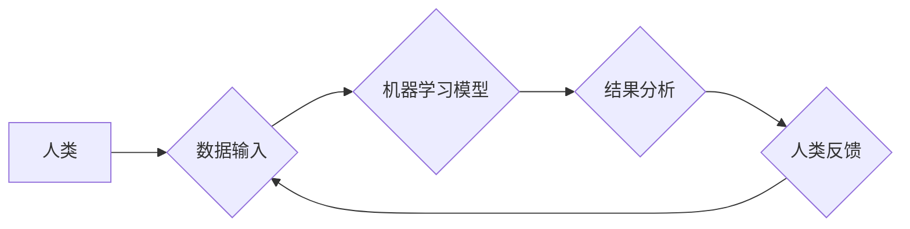

                 

## 连接人类智慧的纽带：人类计算的协作精神

> 关键词：人类计算、协作智能、人工智能、机器学习、数据分析、人类-计算机交互、未来趋势

### 1. 背景介绍

在信息爆炸的时代，人类面临着海量数据的处理和分析挑战。传统人工智能（AI）方法，尽管取得了显著进展，但在某些领域仍然难以胜任，例如需要复杂推理、创造性思维和对社会情境的理解。人类计算应运而生，它强调人类和机器的协同合作，充分发挥各自的优势，共同解决复杂问题。

人类计算的概念源于对人类认知能力的认识。人类拥有丰富的经验、知识和直觉，能够进行抽象思考、批判性分析和情感判断。而机器擅长处理大量数据、执行重复性任务和进行精确计算。将两者结合，可以形成一个强大的协同智能系统，超越单一智能的局限性。

### 2. 核心概念与联系

人类计算的核心是建立高效的人机交互机制，让人类能够与机器自然、流畅地合作。

**2.1 人类计算的架构**



**2.2 核心概念**

* **人类智能:** 包括认知能力、创造力、情感判断等，是人类计算的核心驱动力。
* **机器智能:** 包括数据处理、计算能力、模式识别等，为人类提供工具和支持。
* **协作机制:**  指人类和机器之间进行信息交换、任务分配和结果评估的机制，例如：
    * **任务分工:** 将复杂任务分解成多个子任务，由人类和机器分别负责。
    * **反馈循环:** 人类对机器的输出进行反馈，帮助机器学习和改进。
    * **交互界面:** 提供直观、易用的界面，方便人类与机器进行交互。

### 3. 核心算法原理 & 具体操作步骤

人类计算的算法原理主要基于机器学习和自然语言处理技术。

**3.1 算法原理概述**

* **机器学习:**  通过训练模型，让机器从数据中学习规律，并进行预测或分类。
* **自然语言处理:**  使机器能够理解和处理人类语言，例如文本分析、语音识别等。

**3.2 算法步骤详解**

1. **数据收集和预处理:** 收集相关数据，并进行清洗、转换和格式化。
2. **模型选择和训练:** 选择合适的机器学习模型，并使用训练数据进行模型训练。
3. **模型评估和优化:**  评估模型的性能，并根据评估结果进行模型优化。
4. **人类反馈和迭代:** 人类对模型的输出进行反馈，帮助模型改进和完善。

**3.3 算法优缺点**

* **优点:**
    * 能够处理复杂、非结构化数据。
    * 具备学习和适应能力，可以不断改进。
    * 可以提高效率和准确性。
* **缺点:**
    * 需要大量数据进行训练。
    * 模型解释性较差，难以理解模型的决策过程。
    * 容易受到数据偏差的影响。

**3.4 算法应用领域**

* **医疗诊断:**  辅助医生诊断疾病，提高诊断准确率。
* **金融风险管理:**  识别和评估金融风险，降低损失。
* **客户服务:**  提供智能客服，提高客户满意度。
* **教育教学:**  个性化学习推荐，提高学习效率。

### 4. 数学模型和公式 & 详细讲解 & 举例说明

人类计算的算法通常基于数学模型和公式进行实现。

**4.1 数学模型构建**

* **概率模型:**  用于描述数据之间的概率关系，例如贝叶斯网络、隐马尔可夫模型等。
* **决策树模型:**  用于分类和预测，将数据按照特征进行分层决策。
* **神经网络模型:**  模拟人脑神经网络结构，用于处理复杂数据模式。

**4.2 公式推导过程**

例如，在贝叶斯网络中，可以使用贝叶斯公式计算条件概率：

$$P(A|B) = \frac{P(B|A)P(A)}{P(B)}$$

其中：

* $P(A|B)$ 是事件 A 在事件 B 发生的条件概率。
* $P(B|A)$ 是事件 B 在事件 A 发生的条件概率。
* $P(A)$ 是事件 A 的概率。
* $P(B)$ 是事件 B 的概率。

**4.3 案例分析与讲解**

假设我们有一个医疗诊断系统，需要根据患者的症状预测疾病类型。我们可以使用贝叶斯网络模型，将患者的症状作为输入节点，疾病类型作为输出节点，并根据医学知识构建概率关系。

例如，如果患者出现发烧和咳嗽症状，那么患感冒的概率会更高。我们可以根据历史数据训练贝叶斯网络模型，学习这些概率关系。

### 5. 项目实践：代码实例和详细解释说明

以下是一个简单的代码实例，演示了如何使用 Python 库实现人类计算的基本功能。

**5.1 开发环境搭建**

* Python 3.x 环境
* Jupyter Notebook 或类似的开发环境

**5.2 源代码详细实现**

```python
import nltk
from nltk.sentiment import SentimentIntensityAnalyzer

# 下载 NLTK 数据集
nltk.download('vader_lexicon')

# 初始化 SentimentIntensityAnalyzer
analyzer = SentimentIntensityAnalyzer()

# 获取用户输入
user_input = input("请输入您的文本：")

# 分析文本情感
scores = analyzer.polarity_scores(user_input)

# 打印结果
print(f"文本情感分析结果：\n{scores}")
```

**5.3 代码解读与分析**

* 该代码首先使用 NLTK 库下载情感分析词典。
* 然后初始化 SentimentIntensityAnalyzer 对象，用于分析文本情感。
* 获取用户输入的文本，并使用 analyzer.polarity_scores() 函数进行情感分析。
* 最后打印分析结果，包括正面、负面、中性情感分数和合计情感分数。

**5.4 运行结果展示**

```
请输入您的文本：今天天气真好！
文本情感分析结果：
{'neg': 0.0, 'neu': 0.292, 'pos': 0.708, 'compound': 0.8978}
```

结果显示，该文本情感倾向为正面，情感分数较高。

### 6. 实际应用场景

人类计算已在多个领域得到应用，例如：

* **科学研究:**  加速科学发现，例如蛋白质结构预测、药物研发等。
* **创意设计:**  辅助设计师进行创意构思，例如服装设计、建筑设计等。
* **社会治理:**  提高决策效率，例如城市规划、公共安全等。

**6.4 未来应用展望**

随着人工智能技术的发展，人类计算将发挥越来越重要的作用。未来，人类计算将更加智能化、个性化和协同化，并应用于更多领域。

### 7. 工具和资源推荐

**7.1 学习资源推荐**

* **书籍:**
    * 《人类计算：人工智能与人类合作的未来》
    * 《人工智能：一种现代方法》
* **在线课程:**
    * Coursera: 人工智能
    * edX: 人工智能与机器学习

**7.2 开发工具推荐**

* **Python:**  广泛用于机器学习和数据分析。
* **TensorFlow:**  开源深度学习框架。
* **PyTorch:**  另一个流行的深度学习框架。

**7.3 相关论文推荐**

* **《人类计算：人工智能与人类合作的未来》**
* **《人类-计算机交互中的协作智能》**

### 8. 总结：未来发展趋势与挑战

**8.1 研究成果总结**

人类计算已取得了显著进展，在多个领域展现出巨大的潜力。

**8.2 未来发展趋势**

* **更智能的人机交互:**  开发更加自然、流畅的人机交互方式，例如语音交互、体感交互等。
* **更强大的协作能力:**  提高人类和机器之间的协作效率，实现更有效的任务分工和结果评估。
* **更广泛的应用场景:**  将人类计算应用于更多领域，例如医疗、教育、金融等。

**8.3 面临的挑战**

* **数据隐私和安全:**  确保人类计算过程中数据的隐私和安全。
* **算法解释性和可信度:**  提高算法的解释性和可信度，让人类能够理解和信任机器的决策。
* **伦理和社会影响:**  关注人类计算的伦理和社会影响，确保其发展符合人类利益。

**8.4 研究展望**

未来，人类计算将继续朝着更智能、更协同、更广泛的方向发展。我们需要加强基础研究，探索更有效的协作机制和算法模型，并关注人类计算的伦理和社会影响，确保其健康发展。

### 9. 附录：常见问题与解答

* **什么是人类计算？**

人类计算是指人类和机器协同合作，共同解决复杂问题的计算模式。

* **人类计算有哪些优势？**

人类计算能够结合人类的智慧和机器的计算能力，克服单一智能的局限性，提高解决复杂问题的效率和准确性。

* **人类计算有哪些应用场景？**

人类计算已应用于科学研究、创意设计、社会治理等多个领域。

* **如何参与人类计算？**

您可以通过学习相关知识、参与开源项目、提供数据和反馈等方式参与人类计算。


作者：禅与计算机程序设计艺术 / Zen and the Art of Computer Programming 
<end_of_turn>

