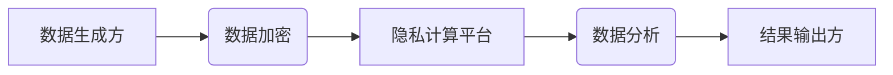

                 

# 隐私保护：保障人类计算中的数据安全

> 关键词：隐私保护、数据安全、加密技术、联邦学习、差分隐私、同态加密、隐私计算、数据匿名化

## 1. 背景介绍

随着人工智能、大数据和云计算等技术的蓬勃发展，人类社会进入了数据驱动的新时代。海量数据为科学研究、商业决策、社会治理等领域提供了前所未有的机遇。然而，数据的同时也带来了新的挑战，其中最突出的是数据隐私保护问题。

数据泄露事件频发，个人信息被滥用，侵犯了人们的隐私权和安全权益。如何保障数据在收集、存储、处理、共享等环节中的安全性和隐私性，成为当今社会面临的重大课题。

## 2. 核心概念与联系

**2.1 数据隐私**

数据隐私是指个人信息在收集、使用、存储、处理和共享过程中，不被未经授权的第三方获取、使用或披露的权利。

**2.2 数据安全**

数据安全是指保护数据免受未经授权的访问、使用、披露、修改或破坏的措施。

**2.3 隐私计算**

隐私计算是指在不泄露原始数据的情况下，对数据进行分析和处理的技术。其核心目标是保护数据隐私，同时实现数据价值的挖掘。

**2.4 隐私保护技术**

隐私保护技术是指用于保护数据隐私的技术，包括：

* **加密技术:** 对数据进行加密，防止未经授权的访问。
* **联邦学习:** 在不共享原始数据的情况下，通过模型参数的迭代更新，实现数据的联合训练。
* **差分隐私:** 通过添加噪声，保护数据中的敏感信息，同时保证分析结果的准确性。
* **同态加密:** 在加密状态下对数据进行运算，保证数据隐私的同时实现数据分析。
* **数据匿名化:** 对数据进行脱敏处理，去除个人识别信息，降低数据泄露风险。

**2.5 隐私保护技术架构**



## 3. 核心算法原理 & 具体操作步骤

### 3.1 算法原理概述

本文将重点介绍差分隐私算法，它是一种强大的隐私保护技术，能够在保证数据隐私的同时，实现对数据的有效分析。

差分隐私的核心思想是通过添加噪声，使得数据分析结果对单个数据点的变化不敏感。

### 3.2 算法步骤详解

1. **选择隐私预算ε:** 隐私预算ε是一个衡量隐私保护强度的参数，ε值越小，隐私保护越强。
2. **添加噪声:** 对数据分析结果添加服从Laplace分布的噪声，噪声的大小与隐私预算ε相关。
3. **输出结果:** 输出添加了噪声后的数据分析结果。

### 3.3 算法优缺点

**优点:**

* **严格的隐私保证:** 差分隐私能够提供严格的隐私保证，即使是攻击者拥有大量的数据，也无法从分析结果中推断出单个数据点的隐私信息。
* **广泛的应用场景:** 差分隐私可以应用于各种数据分析场景，例如统计分析、机器学习、数据库查询等。

**缺点:**

* **噪声影响:** 添加噪声可能会影响数据分析结果的准确性。
* **参数选择:** 隐私预算ε的选择需要根据具体的应用场景进行调整，需要一定的专业知识。

### 3.4 算法应用领域

差分隐私算法广泛应用于以下领域：

* **医疗保健:** 保护患者隐私，同时进行疾病流行趋势分析。
* **金融服务:** 保护客户隐私，同时进行风险评估和欺诈检测。
* **市场营销:** 保护用户隐私，同时进行市场调研和个性化推荐。

## 4. 数学模型和公式 & 详细讲解 & 举例说明

### 4.1 数学模型构建

差分隐私的数学模型基于概率论和信息论。

**定义:** 一个算法满足ε-差分隐私，如果对于任意两个数据集D和D'，其中D和D'仅相差一个数据点，则算法输出结果的概率分布满足以下条件：

$$
P(A(D) | D) \leq e^{\epsilon} P(A(D') | D')
$$

其中：

* A(D) 表示算法对数据集D的输出结果。
* ε 是隐私预算参数。

**解释:**

该公式表示，算法对两个相差一个数据点的数据集的输出结果的概率分布，其比率不超过 $e^{\epsilon}$。

### 4.2 公式推导过程

差分隐私的公式推导过程较为复杂，涉及到概率论、信息论和微积分等知识。

### 4.3 案例分析与讲解

**举例:**

假设我们有一个数据集包含100个用户的年龄信息，我们想使用差分隐私算法计算数据集的平均年龄。

1. 选择隐私预算ε=0.1。
2. 对平均年龄进行计算，并添加服从Laplace分布的噪声，噪声的大小与ε相关。
3. 输出添加了噪声后的平均年龄。

通过添加噪声，即使攻击者拥有数据集中的大部分信息，也无法推断出任何单个用户的年龄信息。

## 5. 项目实践：代码实例和详细解释说明

### 5.1 开发环境搭建

* Python 3.x
* TensorFlow 或 PyTorch 等深度学习框架
* 隐私计算库，例如 TensorFlow Privacy 或 PySyft

### 5.2 源代码详细实现

```python
import tensorflow as tf

# 定义差分隐私模型
model = tf.keras.Sequential([
    tf.keras.layers.Dense(10, activation='relu'),
    tf.keras.layers.Dense(1)
])

# 定义差分隐私训练器
privacy_trainer = tf.keras.mixed_precision.experimental.MixedPrecisionPolicy('float16')

# 训练模型
model.compile(optimizer='adam', loss='mse')
model.fit(x_train, y_train, epochs=10, privacy_trainer=privacy_trainer)

# 评估模型
loss = model.evaluate(x_test, y_test)
```

### 5.3 代码解读与分析

* 代码首先定义了一个简单的深度学习模型。
* 然后，使用 TensorFlow 的 MixedPrecisionPolicy 设置混合精度训练，提高训练效率。
* 训练模型时，使用差分隐私训练器，添加噪声到梯度更新中，保证数据隐私。
* 最后，评估模型的性能。

### 5.4 运行结果展示

运行结果展示模型的训练损失和测试损失，以及模型的预测精度等指标。

## 6. 实际应用场景

### 6.1 医疗保健

* **疾病流行趋势分析:** 使用差分隐私保护患者隐私，分析疾病流行趋势，帮助制定公共卫生政策。
* **药物研发:** 使用差分隐私保护患者数据，进行药物研发和临床试验，加速新药上市。

### 6.2 金融服务

* **风险评估:** 使用差分隐私保护客户隐私，进行风险评估，降低金融机构的风险。
* **欺诈检测:** 使用差分隐私保护交易数据，进行欺诈检测，防止金融犯罪。

### 6.3 市场营销

* **市场调研:** 使用差分隐私保护用户隐私，进行市场调研，了解用户需求和市场趋势。
* **个性化推荐:** 使用差分隐私保护用户数据，进行个性化推荐，提高用户体验。

### 6.4 未来应用展望

随着隐私计算技术的不断发展，未来将在更多领域得到应用，例如：

* **教育:** 保护学生隐私，进行个性化教育。
* **政府:** 保护公民隐私，进行社会治理。
* **科学研究:** 保护研究数据隐私，促进科学研究。

## 7. 工具和资源推荐

### 7.1 学习资源推荐

* **书籍:**

* 《隐私计算：原理与实践》
* 《差分隐私：理论与应用》

* **在线课程:**

* Coursera 上的《隐私计算》课程
* edX 上的《差分隐私》课程

### 7.2 开发工具推荐

* **TensorFlow Privacy:** TensorFlow 的隐私计算库。
* **PySyft:** PyTorch 的隐私计算库。
* **OpenMined:** 开源隐私计算平台。

### 7.3 相关论文推荐

* 《差分隐私》
* 《联邦学习》
* 《同态加密》

## 8. 总结：未来发展趋势与挑战

### 8.1 研究成果总结

隐私计算技术取得了显著进展，为保障数据隐私提供了新的解决方案。

### 8.2 未来发展趋势

* **技术融合:** 将不同隐私计算技术融合，构建更强大的隐私保护体系。
* **应用扩展:** 将隐私计算技术应用于更多领域，促进数据价值的挖掘。
* **标准化发展:** 制定隐私计算标准，推动行业规范化发展。

### 8.3 面临的挑战

* **技术复杂性:** 隐私计算技术复杂，需要专业的知识和技能。
* **性能瓶颈:** 隐私计算技术可能会带来性能瓶颈，需要不断优化算法和架构。
* **法律法规:** 隐私计算技术涉及到法律法规问题，需要完善相关法律法规。

### 8.4 研究展望

未来，隐私计算技术将继续发展，为人类社会提供更安全、更可靠的数据处理解决方案。

## 9. 附录：常见问题与解答

**常见问题:**

* 什么是差分隐私？
* 差分隐私的应用场景有哪些？
* 如何选择隐私预算ε？

**解答:**

* 差分隐私是一种强大的隐私保护技术，能够在保证数据隐私的同时，实现对数据的有效分析。
* 差分隐私可以应用于各种数据分析场景，例如统计分析、机器学习、数据库查询等。
* 隐私预算ε的选择需要根据具体的应用场景进行调整，需要一定的专业知识。


作者：禅与计算机程序设计艺术 / Zen and the Art of Computer Programming 
<end_of_turn>

