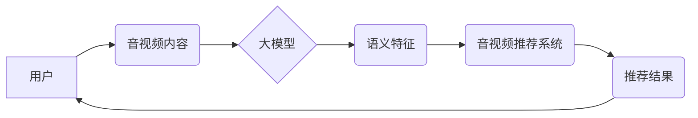

                 

## 音视频推荐：大模型的内容理解

> 关键词：大模型、音视频推荐、内容理解、多模态学习、Transformer、BERT、CLIP

## 1. 背景介绍

随着互联网的发展，音视频内容的爆炸式增长，用户对个性化内容的需求日益强烈。传统的音视频推荐系统主要依赖于用户行为数据，例如观看历史、点赞、评论等，但这些数据往往难以捕捉内容的语义信息，导致推荐结果缺乏精准度和多样性。

大模型的出现为音视频推荐带来了新的机遇。大模型具备强大的语义理解能力，能够从音视频内容中提取丰富的特征，从而实现更精准、更个性化的推荐。

## 2. 核心概念与联系

### 2.1 音视频内容理解

音视频内容理解是指机器能够理解和解释音视频内容的语义信息，包括但不限于：

* **文本信息提取**: 从字幕、视频描述等文本中提取关键信息，例如人物、地点、事件等。
* **视觉信息提取**: 从视频画面中提取视觉特征，例如物体、场景、动作等。
* **音频信息提取**: 从音频信号中提取语音信息、音乐信息、音效等。
* **多模态融合**: 将文本、视觉、音频等多模态信息融合，构建更完整的音视频内容理解模型。

### 2.2 大模型

大模型是指参数量巨大、训练数据海量的人工智能模型。大模型通常通过深度学习技术训练，能够学习到复杂的模式和关系，从而实现强大的泛化能力和适应性。

### 2.3 音视频推荐系统

音视频推荐系统旨在根据用户的兴趣和偏好，推荐用户可能感兴趣的音视频内容。传统的音视频推荐系统主要依赖于用户行为数据，而大模型能够从音视频内容本身中提取语义信息，为推荐系统提供更丰富的特征，从而提升推荐精准度和多样性。

**核心概念与联系流程图**



## 3. 核心算法原理 & 具体操作步骤

### 3.1 算法原理概述

大模型在音视频推荐中的核心算法主要包括：

* **Transformer**: Transformer是一种基于注意力机制的深度学习模型，能够有效地捕捉序列数据中的长距离依赖关系，适用于处理文本、音频等序列数据。
* **BERT**: BERT是一种基于Transformer的预训练语言模型，能够理解文本的语义信息，并用于各种自然语言处理任务，例如文本分类、问答系统等。
* **CLIP**: CLIP是一种多模态学习模型，能够将文本和图像进行联合学习，从而实现跨模态的理解和生成。

### 3.2 算法步骤详解

1. **数据预处理**: 将音视频数据转换为模型可处理的格式，例如将文本数据转换为词向量，将图像数据转换为特征向量。
2. **模型训练**: 使用大模型训练数据训练模型，例如使用BERT预训练模型进行微调，或者使用CLIP模型进行多模态联合学习。
3. **特征提取**: 将训练好的模型应用于新的音视频数据，提取语义特征。
4. **推荐模型**: 使用提取的语义特征作为输入，训练推荐模型，例如使用协同过滤算法、深度学习算法等。
5. **推荐结果**: 根据用户的兴趣和偏好，使用推荐模型生成推荐结果。

### 3.3 算法优缺点

**优点**:

* 能够从音视频内容本身中提取语义信息，提升推荐精准度和多样性。
* 能够处理多种模态数据，例如文本、图像、音频等，构建更完整的音视频理解模型。
* 具有强大的泛化能力和适应性，能够应用于不同的音视频推荐场景。

**缺点**:

* 训练数据量大，计算资源需求高。
* 模型复杂度高，推理速度相对较慢。
* 需要对音视频数据进行复杂的预处理，技术难度较高。

### 3.4 算法应用领域

* **视频推荐**: 推荐用户可能感兴趣的视频内容，例如电影、电视剧、短视频等。
* **音乐推荐**: 推荐用户可能喜欢的音乐，例如歌曲、专辑、艺术家等。
* **直播推荐**: 推荐用户可能感兴趣的直播内容，例如游戏直播、音乐直播、教育直播等。
* **音视频搜索**: 根据用户输入的关键词，搜索相关音视频内容。

## 4. 数学模型和公式 & 详细讲解 & 举例说明

### 4.1 数学模型构建

大模型在音视频推荐中的数学模型通常基于深度学习框架，例如TensorFlow、PyTorch等。模型结构通常包括多个神经网络层，例如卷积层、循环层、注意力层等，这些层通过复杂的数学运算来提取音视频内容的特征。

### 4.2 公式推导过程

由于大模型的数学模型非常复杂，难以在本文中详细推导公式。但可以简单介绍一些常用的数学公式，例如：

* **注意力机制**: 用于计算模型对不同输入元素的关注程度，公式如下：

$$
Attention(Q, K, V) = softmax(\frac{QK^T}{\sqrt{d_k}})V
$$

其中，Q、K、V分别代表查询矩阵、键矩阵、值矩阵，$d_k$代表键向量的维度。

* **Transformer**: 使用多头注意力机制和前馈神经网络，公式较为复杂，需要参考相关论文进行深入学习。

### 4.3 案例分析与讲解

例如，使用BERT模型进行音视频内容理解，可以将视频字幕作为输入，训练BERT模型学习字幕的语义信息。然后，将提取的语义特征作为输入，训练推荐模型，例如使用协同过滤算法，推荐用户可能感兴趣的视频内容。

## 5. 项目实践：代码实例和详细解释说明

### 5.1 开发环境搭建

* **操作系统**: Linux、macOS、Windows
* **编程语言**: Python
* **深度学习框架**: TensorFlow、PyTorch
* **其他工具**: Git、Docker等

### 5.2 源代码详细实现

由于篇幅限制，无法在此处提供完整的源代码。但可以提供一些关键代码片段，例如使用BERT模型提取视频字幕的语义特征：

```python
from transformers import BertTokenizer, BertModel

# 加载BERT模型和词典
tokenizer = BertTokenizer.from_pretrained('bert-base-uncased')
model = BertModel.from_pretrained('bert-base-uncased')

# 将视频字幕转换为BERT模型可处理的格式
text = "这是一个关于机器学习的视频。"
inputs = tokenizer(text, return_tensors="pt")

# 使用BERT模型提取语义特征
outputs = model(**inputs)
embeddings = outputs.last_hidden_state[:, 0, :]

# 打印语义特征
print(embeddings)
```

### 5.3 代码解读与分析

* 使用`transformers`库加载预训练的BERT模型和词典。
* 将视频字幕转换为BERT模型可处理的格式，即将文本转换为词向量。
* 使用BERT模型提取语义特征，并将特征存储在`embeddings`变量中。

### 5.4 运行结果展示

运行上述代码后，将输出BERT模型提取的视频字幕语义特征。这些特征可以作为输入，训练推荐模型，实现音视频推荐。

## 6. 实际应用场景

### 6.1 视频平台推荐

* **个性化推荐**: 根据用户的观看历史、点赞、评论等行为数据，推荐用户可能感兴趣的视频内容。
* **内容发现**: 通过分析视频内容的语义信息，推荐用户可能未曾接触过的优质视频内容。
* **广告投放**: 根据用户的兴趣偏好，精准投放相关广告，提高广告转化率。

### 6.2 音乐平台推荐

* **音乐发现**: 通过分析音乐的风格、节奏、歌词等信息，推荐用户可能喜欢的音乐。
* **个性化歌单**: 根据用户的音乐偏好，自动生成个性化歌单。
* **音乐直播推荐**: 根据用户的音乐兴趣，推荐用户可能感兴趣的音乐直播。

### 6.3 直播平台推荐

* **直播推荐**: 根据用户的观看历史、点赞、评论等行为数据，推荐用户可能感兴趣的直播内容。
* **互动推荐**: 根据用户的实时互动行为，例如聊天、点赞、打赏等，推荐更相关的直播内容。
* **主播推荐**: 根据用户的兴趣偏好，推荐可能感兴趣的主播。

### 6.4 未来应用展望

随着大模型技术的不断发展，音视频推荐系统将更加智能化、个性化。未来，音视频推荐系统将能够：

* 更准确地理解音视频内容的语义信息，提供更精准的推荐结果。
* 更加个性化地推荐内容，满足用户的多样化需求。
* 与其他人工智能技术结合，例如自然语言处理、计算机视觉等，实现更丰富的交互体验。

## 7. 工具和资源推荐

### 7.1 学习资源推荐

* **书籍**:
    * 《深度学习》 - Ian Goodfellow, Yoshua Bengio, Aaron Courville
    * 《自然语言处理入门》 - Jacob Eisenstein
* **在线课程**:
    * Coursera: 深度学习 Specialization
    * Udacity: 自然语言处理 Nanodegree
* **博客**:
    * The Gradient
    * Towards Data Science

### 7.2 开发工具推荐

* **深度学习框架**: TensorFlow, PyTorch
* **自然语言处理库**: NLTK, spaCy, Hugging Face Transformers
* **数据处理工具**: Pandas, NumPy

### 7.3 相关论文推荐

* BERT: Pre-training of Deep Bidirectional Transformers for Language Understanding
* CLIP: Contrastive Language-Image Pretraining
* Transformer: Attention Is All You Need

## 8. 总结：未来发展趋势与挑战

### 8.1 研究成果总结

大模型在音视频推荐领域取得了显著的成果，能够有效地提升推荐精准度和多样性。

### 8.2 未来发展趋势

* **模型规模和能力的提升**: 未来，大模型的规模和能力将进一步提升，能够处理更复杂、更丰富的音视频数据。
* **多模态学习的深入研究**: 多模态学习将成为未来音视频推荐的重要研究方向，能够更好地理解音视频内容的语义信息。
* **个性化推荐的增强**: 未来，音视频推荐系统将更加个性化，能够根据用户的细粒度兴趣偏好提供更精准的推荐结果。

### 8.3 面临的挑战

* **数据获取和标注**: 大模型训练需要海量数据，获取和标注高质量的音视频数据仍然是一个挑战。
* **模型训练和推理效率**: 大模型的训练和推理效率仍然需要提升，降低计算资源需求。
* **模型解释性和可解释性**: 大模型的决策过程往往难以解释，如何提高模型的解释性和可解释性是一个重要的研究方向。

### 8.4 研究展望

未来，音视频推荐领域将继续朝着更智能化、更个性化、更可解释的方向发展。大模型将发挥越来越重要的作用，为用户提供更丰富、更优质的音视频体验。

## 9. 附录：常见问题与解答

* **Q: 大模型训练需要多少数据？**

A: 大模型训练需要海量数据，通常需要数十亿甚至上百亿个样本。

* **Q: 大模型训练需要多少计算资源？**

A: 大模型训练需要大量的计算资源，例如GPU、TPU等。

* **Q: 如何评估大模型的性能？**

A: 大模型的性能可以通过各种指标进行评估，例如准确率、召回率、F1-score等。

* **Q: 如何部署大模型？**

A: 大模型可以部署在云端、边缘设备等多种平台。

* **Q: 大模型的安全性如何保证？**

A: 大模型的安全性需要通过多种技术手段保证，例如数据加密、模型安全审计等。


作者：禅与计算机程序设计艺术 / Zen and the Art of Computer Programming 
<end_of_turn>

