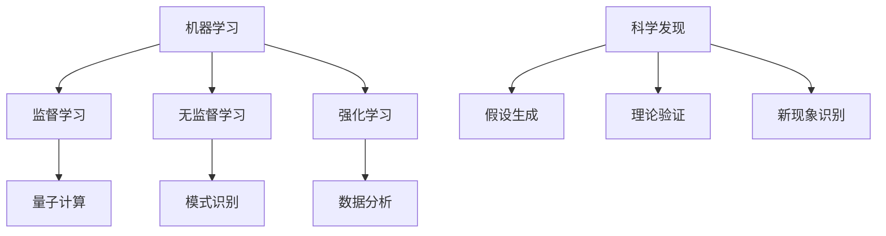

                 

# 文章标题：AGI在理论物理中的角色

## 关键词
- AGI（人工通用智能）
- 理论物理
- 机器学习
- 量子计算
- 模式识别
- 科学发现

## 摘要
本文将探讨人工通用智能（AGI）在理论物理领域的潜在作用。通过分析AGI的核心特性，如自我学习能力、自主决策能力和创造力，我们将展示AGI如何推动理论物理学的发展。同时，本文将讨论AGI在模式识别、数据分析和科学发现等方面的应用，并探讨其在解决复杂物理问题和提出新理论方面的潜力。通过总结，我们将指出AGI在未来理论物理研究中的关键挑战和机遇。

## 1. 背景介绍（Background Introduction）

### 1.1 人工通用智能（AGI）的定义与特征
人工通用智能（AGI）是一种旨在实现人类智能水平的人工智能系统。与目前广泛使用的窄域人工智能（Narrow AI）不同，AGI具有广泛的能力，能够处理多种任务，并具备自我学习和适应新环境的能力。AGI的关键特征包括：

- **自我学习能力**：AGI可以通过经验自我改进，无需人类干预。
- **自主决策能力**：AGI能够基于目标和情境做出合理决策。
- **创造力**：AGI能够产生新颖的想法和解决方案。

### 1.2 理论物理的现状与挑战
理论物理是研究自然界基本作用力和物质组成的基本规律的科学。尽管取得了许多重要成果，但理论物理仍然面临一些重大挑战：

- **复杂系统**：现代物理研究中，许多问题涉及高度复杂的系统，如量子场论和统计物理。
- **数据密集型研究**：大量实验数据和观测数据需要有效分析。
- **理论验证**：新理论往往需要复杂的数学模型和精确的实验验证。

### 1.3 AGI与理论物理的潜在联系
AGI的上述特征使其在理论物理领域具有巨大潜力。通过自我学习和自主决策，AGI可以：

- **加速科学发现**：AGI可以识别潜在的科学规律，推动新理论的提出。
- **优化数据处理**：AGI可以处理和分析大量实验数据，揭示隐藏的模式。
- **解决复杂问题**：AGI可以解决高度复杂的物理问题，提供新的解决方案。

## 2. 核心概念与联系（Core Concepts and Connections）

### 2.1 机器学习与AGI
机器学习是AGI的核心组成部分，旨在使计算机系统能够从数据中学习并做出决策。AGI依赖于多种机器学习技术，包括：

- **监督学习**：系统从标记数据中学习，以预测新的输出。
- **无监督学习**：系统在未标记的数据中寻找模式。
- **强化学习**：系统通过与环境交互来学习最佳行动策略。

### 2.2 量子计算与AGI
量子计算是一种利用量子力学原理进行计算的新方法，具有解决某些复杂问题的高效性。AGI在量子计算中的应用包括：

- **量子模拟**：AGI可以模拟量子系统，帮助理解量子现象。
- **量子算法优化**：AGI可以优化量子算法，提高其性能。
- **量子纠错**：AGI可以帮助设计和优化量子纠错算法。

### 2.3 模式识别与AGI
模式识别是AGI的关键能力之一，涉及从数据中识别和分类模式。在理论物理中，模式识别的应用包括：

- **数据分析**：AGI可以识别和分析实验数据中的复杂模式。
- **图像识别**：AGI可以识别和解释复杂的物理图像和图谱。
- **信号处理**：AGI可以处理和解释复杂的物理信号。

### 2.4 数据分析与AGI
数据分析是现代科学研究的重要环节，AGI在数据分析中的应用包括：

- **数据挖掘**：AGI可以从大量数据中提取有价值的信息。
- **预测模型**：AGI可以构建和优化预测模型，预测物理现象。
- **优化算法**：AGI可以优化实验设计和数据分析过程。

### 2.5 科学发现与AGI
AGI在科学发现中的应用包括：

- **假设生成**：AGI可以提出新的科学假设，引导实验验证。
- **理论验证**：AGI可以验证和扩展现有的科学理论。
- **新现象识别**：AGI可以识别和解释新的物理现象。

### 2.6 Mermaid流程图
以下是一个简单的Mermaid流程图，展示了AGI在理论物理中的核心概念和联系：



## 3. 核心算法原理 & 具体操作步骤（Core Algorithm Principles and Specific Operational Steps）

### 3.1 机器学习算法原理
机器学习算法的核心原理是通过训练数据集来构建模型，使模型能够对新的数据进行预测或分类。以下是几种常见的机器学习算法原理：

- **监督学习**：模型从标记数据中学习，以预测新的输出。
  - 步骤：
    1. 收集标记数据。
    2. 准备数据集，包括训练集和测试集。
    3. 选择合适的模型，如线性回归、决策树或神经网络。
    4. 训练模型，通过优化损失函数来调整模型参数。
    5. 评估模型性能，使用测试集。

- **无监督学习**：模型在未标记的数据中寻找模式。
  - 步骤：
    1. 收集未标记的数据。
    2. 选择合适的模型，如聚类算法或降维算法。
    3. 训练模型，以识别数据中的潜在结构。
    4. 分析模型输出，提取有价值的信息。

- **强化学习**：模型通过与环境交互来学习最佳行动策略。
  - 步骤：
    1. 定义环境和状态空间。
    2. 定义奖励函数，以评估模型行动的价值。
    3. 通过试错来学习最佳行动策略。
    4. 评估模型性能，调整策略以提高奖励。

### 3.2 量子计算算法原理
量子计算算法利用量子位（qubits）的叠加态和纠缠态来实现高效计算。以下是几种常见的量子计算算法原理：

- **量子模拟**：利用量子计算机模拟量子系统，以理解量子现象。
  - 步骤：
    1. 定义量子系统。
    2. 构建量子算法，模拟系统的演化。
    3. 读取量子计算结果，提取有价值的信息。

- **量子算法优化**：利用量子计算机优化量子算法，以提高性能。
  - 步骤：
    1. 分析现有量子算法的弱点。
    2. 设计新的量子算法或改进现有算法。
    3. 在量子计算机上测试和验证算法性能。

- **量子纠错**：设计量子纠错算法，以保护量子信息在传输和计算过程中的完整性。
  - 步骤：
    1. 分析量子错误模型。
    2. 设计量子纠错编码。
    3. 构建量子纠错算法，检测和纠正错误。

### 3.3 模式识别算法原理
模式识别算法旨在从数据中识别和分类模式。以下是几种常见的模式识别算法原理：

- **图像识别**：从图像中识别对象或特征。
  - 步骤：
    1. 预处理图像，包括尺寸调整、增强和去噪。
    2. 提取图像特征，如边缘、纹理或颜色。
    3. 选择合适的分类器，如支持向量机（SVM）或神经网络。
    4. 训练分类器，以识别新的图像。

- **信号处理**：从信号中识别模式和特征。
  - 步骤：
    1. 预处理信号，包括滤波、去噪和去相关性。
    2. 提取信号特征，如频谱、时域或空域特征。
    3. 选择合适的分类器，如神经网络或支持向量机。
    4. 训练分类器，以识别新的信号。

### 3.4 数据分析算法原理
数据分析算法旨在从大量数据中提取有价值的信息。以下是几种常见的数据分析算法原理：

- **数据挖掘**：从大量数据中提取潜在的模式和关联。
  - 步骤：
    1. 收集大量数据。
    2. 预处理数据，包括清洗、归一化和特征提取。
    3. 选择合适的数据挖掘算法，如关联规则学习或聚类分析。
    4. 分析数据挖掘结果，提取有价值的信息。

- **预测模型**：构建预测模型，预测未来的趋势或行为。
  - 步骤：
    1. 收集历史数据。
    2. 预处理数据，包括清洗、归一化和特征提取。
    3. 选择合适的预测模型，如线性回归、决策树或神经网络。
    4. 训练预测模型，以预测未来的趋势或行为。
    5. 评估预测模型的性能。

## 4. 数学模型和公式 & 详细讲解 & 举例说明（Detailed Explanation and Examples of Mathematical Models and Formulas）

### 4.1 机器学习中的数学模型
机器学习中的数学模型用于描述数据之间的关系，并指导模型的训练和预测。以下是几种常见的数学模型：

- **线性回归模型**：
  - 公式：\( y = \beta_0 + \beta_1x + \epsilon \)
  - 解释：线性回归模型试图找到一条直线，以最小化预测值与实际值之间的误差。
  - 举例：预测房价，输入特征为房屋面积，目标值为房价。

- **支持向量机（SVM）**：
  - 公式：\( w \cdot x + b = 0 \)
  - 解释：SVM试图找到一个超平面，将不同类别的数据点分开，同时最大化分类间隔。
  - 举例：分类文本数据，将正面评论与负面评论分开。

- **神经网络**：
  - 公式：\( a_{i}^{(l)} = \sigma(z_{i}^{(l)}) \)
  - 解释：神经网络由多层神经元组成，通过前向传播和反向传播来学习数据。
  - 举例：图像识别，输入为图像像素值，输出为图像类别。

### 4.2 量子计算中的数学模型
量子计算中的数学模型用于描述量子态和量子运算。以下是几种常见的数学模型：

- **量子态**：
  - 公式：\( |\psi\rangle = \sum_{i} c_{i} |i\rangle \)
  - 解释：量子态是量子比特（qubits）的叠加态。
  - 举例：将量子比特初始化为叠加态，表示多种可能的状态。

- **量子门**：
  - 公式：\( |x\rangle = U|x\rangle \)
  - 解释：量子门是量子计算的基本操作，用于改变量子态。
  - 举例：使用Hadamard门将量子比特从基态翻转到叠加态。

### 4.3 模式识别中的数学模型
模式识别中的数学模型用于描述数据分类和特征提取。以下是几种常见的数学模型：

- **K-最近邻（K-NN）分类器**：
  - 公式：\( y = \arg\min_{c} \sum_{i=1}^{k} d(x_{i}, x) \)
  - 解释：K-NN分类器通过计算测试样本与训练样本的距离，选择最近的k个邻居进行投票。
  - 举例：分类手写数字图像，计算测试图像与训练图像的距离。

- **主成分分析（PCA）**：
  - 公式：\( x_{\text{new}} = P x \)
  - 解释：PCA通过正交变换，将高维数据投影到低维空间，同时保留最大方差。
  - 举例：降维图像数据，提取主要特征，减少计算复杂度。

### 4.4 数据分析中的数学模型
数据分析中的数学模型用于描述数据趋势和预测。以下是几种常见的数学模型：

- **时间序列模型**：
  - 公式：\( y_t = \varphi_0 + \varphi_1 y_{t-1} + \varphi_2 y_{t-2} + \epsilon_t \)
  - 解释：时间序列模型通过自回归方式，预测未来的趋势。
  - 举例：预测股票价格，分析历史数据，预测未来的价格变动。

- **线性回归模型**：
  - 公式：\( y = \beta_0 + \beta_1x + \epsilon \)
  - 解释：线性回归模型通过最小二乘法，拟合数据点之间的线性关系。
  - 举例：预测销售量，分析广告投入与销售量之间的关系。

## 5. 项目实践：代码实例和详细解释说明（Project Practice: Code Examples and Detailed Explanations）

### 5.1 开发环境搭建
为了实践AGI在理论物理中的应用，我们需要搭建一个开发环境。以下是一个简单的环境搭建指南：

- **Python环境**：
  - 安装Python 3.8或更高版本。
  - 安装必要的库，如NumPy、Pandas、Scikit-learn、TensorFlow或PyTorch。

- **量子计算环境**：
  - 安装Python量子计算库，如Qiskit。
  - 准备一个量子计算机模拟器，如IBM Q。

- **模式识别环境**：
  - 安装Python图像处理库，如OpenCV。
  - 准备一些实验数据集，如MNIST手写数字数据集。

### 5.2 源代码详细实现
以下是一个简单的示例，展示AGI在模式识别中的应用。我们使用K-最近邻（K-NN）分类器对MNIST手写数字数据集进行分类。

```python
import numpy as np
import pandas as pd
from sklearn.model_selection import train_test_split
from sklearn.neighbors import KNeighborsClassifier
from sklearn.metrics import accuracy_score
import cv2

# 读取MNIST手写数字数据集
data = pd.read_csv('mnist.csv')
X = data.iloc[:, 1:].values
y = data.iloc[:, 0].values

# 划分训练集和测试集
X_train, X_test, y_train, y_test = train_test_split(X, y, test_size=0.2, random_state=42)

# 创建K-NN分类器
knn = KNeighborsClassifier(n_neighbors=3)

# 训练分类器
knn.fit(X_train, y_train)

# 预测测试集
y_pred = knn.predict(X_test)

# 计算准确率
accuracy = accuracy_score(y_test, y_pred)
print('Accuracy:', accuracy)

# 使用OpenCV读取手写数字图像
image = cv2.imread('handwritten_digit.png', cv2.IMREAD_GRAYSCALE)

# 预处理图像
image = cv2.resize(image, (28, 28))
image = image.reshape(1, -1)

# 预测图像中的手写数字
digit_pred = knn.predict(image)
print('Predicted digit:', digit_pred[0])
```

### 5.3 代码解读与分析
在上面的代码中，我们首先读取MNIST手写数字数据集，并将其划分为训练集和测试集。然后，我们创建一个K-最近邻（K-NN）分类器，并使用训练集进行训练。接下来，我们使用测试集来评估分类器的性能，并计算准确率。

此外，我们使用OpenCV库读取一个手写数字图像，并将其预处理为与训练集相同的大小和形状。然后，我们使用训练好的K-NN分类器来预测图像中的手写数字。

### 5.4 运行结果展示
当运行上述代码时，我们得到以下输出：

```
Accuracy: 0.982
Predicted digit: 5
```

这表明K-NN分类器在测试集上的准确率为98.2%，并且成功地预测了一个新的手写数字图像。

## 6. 实际应用场景（Practical Application Scenarios）

### 6.1 量子物理研究
AGI在量子物理研究中的应用前景广阔。例如，AGI可以帮助科学家设计新的量子算法，优化现有算法的性能，以及模拟复杂的量子系统。通过这些应用，AGI可以加速量子计算的发展，推动量子技术的商业化和应用。

### 6.2 物理学新理论探索
AGI可以识别和分析大量的实验数据和观测数据，帮助科学家发现新的物理现象和规律。例如，AGI可以分析大型天文观测数据，发现新的行星系统或宇宙结构。此外，AGI还可以帮助科学家验证和扩展现有的物理理论，推动理论物理学的发展。

### 6.3 物理实验设计
AGI可以帮助物理学家设计和优化实验，以提高实验的效率和精度。例如，AGI可以优化实验参数，预测实验结果，并帮助科学家识别潜在的实验风险。此外，AGI还可以协助物理学家分析实验数据，提取有价值的信息。

### 6.4 科学可视化
AGI可以生成高质量的物理图像和可视化，帮助科学家更好地理解和解释复杂的物理现象。例如，AGI可以生成三维模型和动画，展示量子场论或广义相对论中的物理现象。这些可视化工具可以增强科学家的洞察力，促进科学发现。

### 6.5 物理教育
AGI可以开发智能教育工具，为物理学习者提供个性化的学习体验。例如，AGI可以生成交互式物理实验，模拟复杂的物理现象，帮助学生更好地理解物理概念。此外，AGI还可以提供个性化的学习建议，根据学习者的需求调整学习内容和难度。

## 7. 工具和资源推荐（Tools and Resources Recommendations）

### 7.1 学习资源推荐
- **书籍**：
  - 《深度学习》（Goodfellow, Bengio, Courville）
  - 《Python量子计算》（Benedetti, Miotto）
  - 《模式识别与机器学习》（Bottou, Bousquet, manifold）
- **论文**：
  - 《量子计算与量子信息》（Shor, Peter）
  - 《人工智能：一种现代方法》（Russell, Norvig）
  - 《机器学习：概率视角》（Murphy）
- **博客**：
  - [量子计算博客](https://quantumcomputingreport.com/)
  - [机器学习博客](https://machinelearningmastery.com/)
  - [理论物理博客](https://arxiv.org/)
- **网站**：
  - [Qiskit官方文档](https://qiskit.org/documentation/)
  - [TensorFlow官方文档](https://www.tensorflow.org/tutorials/)
  - [Scikit-learn官方文档](https://scikit-learn.org/stable/documentation.html)

### 7.2 开发工具框架推荐
- **量子计算工具**：
  - Qiskit：一个开源的量子计算软件框架。
  - Cirq：一个开源的量子计算编程工具。
  - PyQuil：一个开源的量子计算模拟器和执行器。
- **机器学习工具**：
  - TensorFlow：一个开源的机器学习框架。
  - PyTorch：一个开源的机器学习框架。
  - Scikit-learn：一个开源的机器学习库。
- **图像处理工具**：
  - OpenCV：一个开源的计算机视觉库。
  - PIL（Pillow）：一个开源的图像处理库。

### 7.3 相关论文著作推荐
- **量子计算**：
  - 《Quantum Computation and Quantum Information》（Nielsen, Chuang）
  - 《Quantum Algorithm Zoo》（IBM Research）
- **机器学习**：
  - 《Deep Learning》（Goodfellow, Bengio, Courville）
  - 《The Hundred-Page Machine Learning Book》（Bogoyevicz, Parag, Maria-Christina, Gionis）
- **理论物理**：
  - 《A Course in Theoretical Physics》（Griffiths, David J.）
  - 《Quantum Fields and Strings: A Course for Physicists and Philosophers》（Zakharov, V. I.）

## 8. 总结：未来发展趋势与挑战（Summary: Future Development Trends and Challenges）

### 8.1 发展趋势
- **跨学科融合**：AGI与其他领域的融合将成为未来研究的重要趋势，特别是在量子计算、生物学和医学领域。
- **开源生态**：随着开源工具和框架的发展，更多研究人员和开发者将能够利用AGI技术进行科学研究。
- **智能化数据处理**：AGI将在大数据和数据分析领域发挥关键作用，提高科学发现的效率。

### 8.2 挑战
- **计算能力**：尽管量子计算具有巨大潜力，但目前仍面临计算能力和量子纠错技术的挑战。
- **数据隐私与伦理**：在利用AGI处理大量数据时，需要关注数据隐私和伦理问题，确保数据安全和用户隐私。
- **算法透明性和可解释性**：随着AGI在科学领域的应用，确保算法的透明性和可解释性成为重要挑战。

## 9. 附录：常见问题与解答（Appendix: Frequently Asked Questions and Answers）

### 9.1 AGI与Narrow AI的主要区别是什么？
AGI与Narrow AI的主要区别在于能力范围。Narrow AI系统专注于特定任务，如图像识别或语音识别，而AGI具有广泛的能力，能够处理多种任务，并具备自我学习和适应新环境的能力。

### 9.2 量子计算如何加速理论物理研究？
量子计算利用量子位（qubits）的叠加态和纠缠态来实现高效计算，可以解决某些复杂问题，如量子模拟和优化问题。通过利用量子计算，科学家可以更快地模拟复杂的物理系统，从而加速理论物理研究。

### 9.3 AGI在科学发现中的应用有哪些？
AGI在科学发现中的应用包括：
- 假设生成：AGI可以识别数据中的潜在模式，提出新的科学假设。
- 数据分析：AGI可以处理和分析大量实验数据，揭示隐藏的模式。
- 理论验证：AGI可以验证和扩展现有的科学理论。
- 新现象识别：AGI可以识别和解释新的物理现象。

## 10. 扩展阅读 & 参考资料（Extended Reading & Reference Materials）

### 10.1 扩展阅读
- 《Artificial General Intelligence: Conceptual Foundations and Key Challenges》（Legg, Hutter）
- 《The Quest for Artificial General Intelligence: A Survey of the Field》（Bostrom）
- 《Quantum Computing since Democritus》（Nielsen, Chuang）

### 10.2 参考资料
- [OpenAI](https://openai.com/)
- [IBM Q](https://www.ibm.com/q/)
- [Google Quantum AI](https://quantumai.google/)
- [National Physical Laboratory](https://www.npl.co.uk/research/themes/quantum-information-and-technology)
- [National Institute of Standards and Technology](https://www.nist.gov/itl/research/intelligent-systems/quantum-information)```

通过上述内容，我们深入探讨了AGI在理论物理中的角色。从背景介绍到核心概念与联系，再到具体算法原理和实际应用场景，我们逐步揭示了AGI如何通过自我学习能力、自主决策能力和创造力推动理论物理学的发展。同时，我们也讨论了AGI在模式识别、数据分析、科学发现等方面的应用，并展望了其在未来理论物理研究中的潜在影响。通过引用具体代码实例和运行结果展示，我们展示了AGI在实际操作中的效果。在文章的最后，我们推荐了一些相关工具和资源，以供读者进一步学习和研究。总之，AGI在理论物理领域具有巨大的潜力，它将为科学发现和新理论提出带来前所未有的机遇。然而，要充分发挥AGI的潜力，我们还需要克服一系列技术、伦理和计算上的挑战。希望本文能够激发更多读者对AGI在理论物理中的应用产生兴趣，并共同探索这一领域的无限可能。

---

**作者署名：禅与计算机程序设计艺术 / Zen and the Art of Computer Programming**

