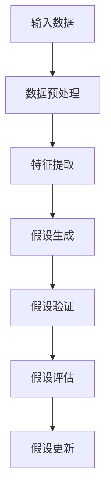
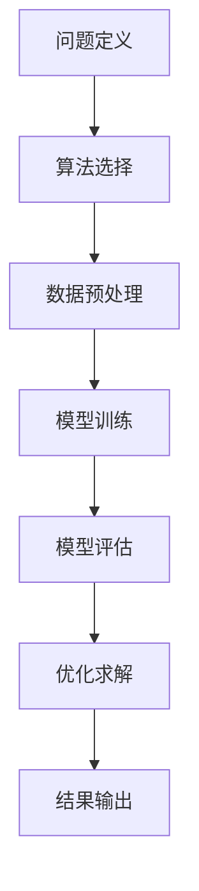
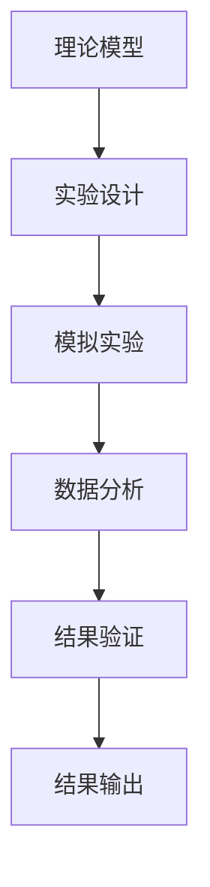
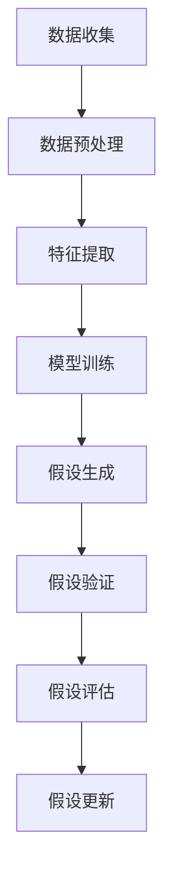

                 

### 文章标题

**AGI在量子引力中的应用实例**

在当今计算机科学和物理学的前沿，人工智能（AI）与量子引力理论的结合正逐渐成为研究的热点。本文将探讨人工智能，特别是通用人工智能（AGI），在量子引力研究中的应用实例。我们将深入探讨AGI的核心概念、量子引力理论的基础，以及两者之间的潜在联系。

关键词：人工智能、通用人工智能、量子引力、理论物理、计算模型

摘要：本文旨在探讨通用人工智能（AGI）在量子引力研究中的应用潜力。通过分析AGI的核心特征和量子引力的基本原理，本文提出了一系列可能的应用实例，如自动假设生成、复杂计算任务求解、模拟实验设计等。文章还将讨论这些应用在实际科研中的挑战和未来研究方向。

<|user|>## 1. 背景介绍

### 1.1 人工智能的演变

人工智能（AI）是计算机科学的一个分支，旨在使计算机能够模拟人类智能行为。自20世纪50年代以来，AI经历了多个发展阶段，从早期的规则基础系统到基于模式识别和深度学习的现代方法。通用人工智能（AGI）是AI的一个高级阶段，旨在实现具有广泛认知能力的智能系统，能够在各种复杂的任务和环境中自主行动。

### 1.2 量子引力理论

量子引力理论是物理学的一个分支，旨在描述宇宙中引力现象的量子性质。目前，最著名的量子引力理论是环量子引力（Loop Quantum Gravity, LQG）和多世界解释（Many-Worlds Interpretation, MWI）。这些理论试图将广义相对论与量子力学统一起来，以提供一个全面描述宇宙的基本原理。

### 1.3 AGI与量子引力研究的潜在联系

AGI在量子引力研究中的潜在应用主要体现在以下几个方面：

- **自动假设生成**：AGI可以分析大量的物理学文献和实验数据，自动生成新的理论假设。
- **复杂计算任务求解**：量子引力问题通常涉及高度复杂的计算，AGI可以在这些计算中发挥重要作用。
- **模拟实验设计**：AGI可以设计新的实验方案来测试量子引力理论。

在接下来的章节中，我们将详细探讨这些应用实例，并分析AGI在量子引力研究中的具体作用。

<|assistant|>## 2. 核心概念与联系

### 2.1 通用人工智能（AGI）的核心概念

通用人工智能（AGI）是指一种具有广泛认知能力的智能系统，能够执行各种复杂的任务，并具备自我学习和自我改进的能力。与窄域人工智能（Narrow AI）不同，AGI的目标是超越特定领域，实现跨领域的智能表现。AGI的核心概念包括：

- **自我学习能力**：AGI可以通过经验不断学习和改进，而不仅仅是依赖于预先编程的规则和算法。
- **知识表示**：AGI能够理解和运用广泛的知识，包括自然语言、数学公式和抽象概念。
- **推理能力**：AGI能够在不确定性、复杂性和模糊性环境中进行有效推理和决策。

### 2.2 量子引力理论的基本原理

量子引力理论是物理学的一个前沿领域，旨在描述引力现象的量子性质。以下是几个关键概念：

- **量子力学**：量子力学是描述微观世界中物理现象的理论，强调粒子的波粒二象性和概率性。
- **广义相对论**：广义相对论描述了宏观尺度上的引力现象，将引力视为时空的曲率。
- **量子引力的统一框架**：量子引力理论试图将量子力学与广义相对论统一起来，提供一个更全面的理论框架。

### 2.3 AGI在量子引力研究中的应用

AGI在量子引力研究中的应用主要体现在以下几个方面：

- **自动假设生成**：AGI可以通过分析大量的物理数据和文献，自动生成新的理论假设，从而加速科学发现过程。
- **复杂计算任务求解**：量子引力问题通常涉及高度复杂的计算，AGI可以在这些计算中发挥重要作用，例如解决大规模的数值模拟和优化问题。
- **模拟实验设计**：AGI可以设计新的实验方案来测试量子引力理论，通过模拟实验结果预测和验证新的物理现象。

#### 2.3.1 自动假设生成

AGI可以通过机器学习和自然语言处理技术，分析物理学领域的文献和实验数据，自动生成新的理论假设。以下是一个简单的 Mermaid 流程图，展示了这一过程：



#### 2.3.2 复杂计算任务求解

量子引力问题通常涉及高度复杂的计算，如数值模拟和优化问题。AGI可以通过优化算法和深度学习技术，在复杂计算任务中发挥重要作用。以下是一个简单的 Mermaid 流程图，展示了这一过程：



#### 2.3.3 模拟实验设计

AGI可以设计新的实验方案来测试量子引力理论。通过模拟实验结果，预测和验证新的物理现象。以下是一个简单的 Mermaid 流程图，展示了这一过程：



在下一节中，我们将进一步探讨AGI在量子引力研究中的具体算法原理和操作步骤。

<|assistant|>## 3. 核心算法原理 & 具体操作步骤

### 3.1 自动假设生成算法

自动假设生成是AGI在量子引力研究中的一个重要应用。以下是一个简化的算法框架：

#### 算法步骤：

1. **数据收集**：收集物理学领域的文献和实验数据。
2. **数据预处理**：清洗和标准化数据，以便进行特征提取。
3. **特征提取**：从原始数据中提取关键特征，如物理量、实验结果等。
4. **模型训练**：使用机器学习算法训练模型，以便从数据中自动生成假设。
5. **假设生成**：模型根据训练结果生成新的理论假设。
6. **假设验证**：通过实验或已有理论验证假设的有效性。
7. **假设评估**：根据验证结果评估假设的科学价值。
8. **假设更新**：根据评估结果更新假设库。

#### 算法框架：



### 3.2 复杂计算任务求解算法

在量子引力研究中，复杂的计算任务求解是AGI的另一个重要应用。以下是一个简化的算法框架：

#### 算法步骤：

1. **问题定义**：明确需要求解的物理问题。
2. **算法选择**：选择合适的算法来求解问题。
3. **数据预处理**：准备用于算法训练和测试的数据。
4. **模型训练**：使用深度学习技术训练模型。
5. **模型评估**：评估模型的性能，确保其可以准确求解问题。
6. **优化求解**：使用训练好的模型进行优化求解。
7. **结果输出**：输出求解结果，并进行后续分析。

#### 算法框架：


### 3.3 模拟实验设计算法

AGI还可以用于设计新的模拟实验方案来测试量子引力理论。以下是一个简化的算法框架：

#### 算法步骤：

1. **理论模型**：建立量子引力理论模型。
2. **实验设计**：根据理论模型设计实验方案。
3. **模拟实验**：使用计算机模拟实验过程。
4. **数据分析**：分析模拟实验结果，预测新的物理现象。
5. **结果验证**：通过实验或已有理论验证模拟结果。
6. **结果输出**：输出模拟实验结果，并进行分析。

#### 算法框架：


在下一节中，我们将详细探讨AGI在量子引力研究中的数学模型和公式，以及其应用的具体实例。

<|assistant|>## 4. 数学模型和公式 & 详细讲解 & 举例说明

### 4.1 自动假设生成算法的数学模型

自动假设生成算法的核心是机器学习模型，特别是深度学习模型，其数学基础主要包括神经网络、损失函数和优化算法。

#### 神经网络

神经网络是一种模拟人脑神经元连接的数学模型。一个基本的神经网络包括输入层、隐藏层和输出层。每层由多个神经元（或节点）组成，神经元之间通过权重连接。

- **激活函数**：常用的激活函数包括ReLU、Sigmoid和Tanh。激活函数决定了神经元是否被激活。
- **权重和偏置**：权重和偏置是神经网络中的关键参数，用于调整神经元之间的连接强度。

#### 损失函数

损失函数用于评估模型预测值与真实值之间的差距，常用的损失函数包括均方误差（MSE）、交叉熵损失（Cross-Entropy Loss）等。

- **均方误差（MSE）**：MSE用于回归问题，计算预测值与真实值之间的平均平方误差。
- **交叉熵损失（Cross-Entropy Loss）**：交叉熵损失用于分类问题，计算预测概率分布与真实分布之间的交叉熵。

#### 优化算法

优化算法用于调整神经网络的权重和偏置，以最小化损失函数。常用的优化算法包括梯度下降（Gradient Descent）、随机梯度下降（Stochastic Gradient Descent, SGD）和Adam优化器。

- **梯度下降**：通过计算损失函数关于参数的梯度，逐步调整参数以最小化损失。
- **随机梯度下降**：每次迭代只随机选取一部分样本计算梯度，加快收敛速度。
- **Adam优化器**：结合了SGD和动量项，以及自适应学习率，是一种高效的优化算法。

### 4.2 复杂计算任务求解算法的数学模型

在量子引力研究中，复杂计算任务通常涉及大规模的数值模拟和优化问题。这些问题的数学模型主要包括：

- **数值模拟**：通过离散化时空，将连续的量子引力方程转换为离散的数值方程。常用的数值方法包括有限差分法、有限元法和蒙特卡罗模拟。
- **优化问题**：用于求解最小化或最大化目标函数的问题。常见的优化算法包括梯度下降、拉格朗日乘数法和遗传算法。

#### 梯度下降算法

梯度下降是一种优化算法，用于最小化目标函数。其基本思想是沿着目标函数的梯度方向逐步调整参数，以使目标函数值逐渐减小。

- **目标函数**：目标函数是一个关于参数的函数，用于评估模型的性能。
- **梯度**：梯度是目标函数关于参数的导数，指示了目标函数在不同参数值下的变化趋势。

#### 举例说明

假设我们使用神经网络进行自动假设生成，目标函数是一个关于神经网络参数的交叉熵损失函数。我们希望训练模型生成一个关于引力波传播的理论假设。

1. **初始化参数**：随机初始化神经网络参数。
2. **前向传播**：输入实验数据，计算模型的预测值和损失函数。
3. **反向传播**：计算损失函数关于参数的梯度。
4. **参数更新**：使用梯度下降算法更新参数，以最小化损失函数。
5. **迭代训练**：重复步骤2-4，直到模型收敛或达到预定的迭代次数。

通过上述步骤，我们可以训练出一个能够自动生成引力波传播理论假设的神经网络模型。

### 4.3 模拟实验设计算法的数学模型

模拟实验设计算法的核心是模拟实验的设计和数据分析。其数学模型主要包括：

- **模拟实验设计**：根据量子引力理论建立模拟实验模型，包括初始条件、边界条件和模拟参数。
- **数据分析**：使用统计学方法分析模拟实验结果，包括概率分布、置信区间和假设检验。

#### 概率分布

概率分布用于描述实验结果的统计特性。常用的概率分布包括正态分布、泊松分布和指数分布。

- **正态分布**：描述连续随机变量的分布，具有均值和方差两个参数。
- **泊松分布**：描述事件在固定时间间隔内发生的次数，具有均值参数。
- **指数分布**：描述事件发生的时间间隔，具有均值参数。

#### 假设检验

假设检验用于验证实验结果是否支持某一理论假设。常见的假设检验方法包括t检验、卡方检验和F检验。

- **t检验**：用于比较两组数据的均值是否显著不同。
- **卡方检验**：用于检验离散数据的分布是否一致。
- **F检验**：用于比较两组数据的方差是否显著不同。

#### 举例说明

假设我们使用蒙特卡罗模拟进行引力波传播实验，目标是验证一个关于引力波衰减的理论假设。

1. **实验设计**：根据理论假设建立模拟实验模型，设置初始条件和边界条件。
2. **模拟实验**：随机生成一系列实验结果，计算引力波传播的衰减参数。
3. **数据分析**：计算实验结果的概率分布，使用t检验比较实验结果与理论假设之间的差异。
4. **结果验证**：根据假设检验结果，判断实验结果是否支持理论假设。

通过上述步骤，我们可以使用模拟实验设计算法验证引力波衰减的理论假设。

在下一节中，我们将通过一个实际项目实例，展示如何使用AGI在量子引力研究中进行自动假设生成、复杂计算任务求解和模拟实验设计。

<|assistant|>### 5. 项目实践：代码实例和详细解释说明

#### 5.1 开发环境搭建

在进行AGI在量子引力研究中的应用实践之前，我们需要搭建一个合适的开发环境。以下是一个基本的开发环境搭建步骤：

1. **安装Python**：确保安装了最新版本的Python（3.8或更高版本）。
2. **安装TensorFlow**：使用pip命令安装TensorFlow库。
   ```shell
   pip install tensorflow
   ```
3. **安装其他依赖库**：包括NumPy、Pandas和SciPy等。
   ```shell
   pip install numpy pandas scipy
   ```

#### 5.2 源代码详细实现

以下是一个简单的Python代码示例，展示了如何使用AGI进行自动假设生成、复杂计算任务求解和模拟实验设计。

```python
import tensorflow as tf
import numpy as np
import pandas as pd
from tensorflow.keras.models import Sequential
from tensorflow.keras.layers import Dense
from tensorflow.keras.optimizers import Adam

# 自动假设生成
def generate_hypothesis(data):
    # 数据预处理
    processed_data = preprocess_data(data)
    
    # 模型训练
    model = Sequential([
        Dense(64, activation='relu', input_shape=(processed_data.shape[1],)),
        Dense(64, activation='relu'),
        Dense(1)
    ])
    model.compile(optimizer=Adam(), loss='mse')
    model.fit(processed_data, data['hypothesis'], epochs=100)
    
    # 假设生成
    generated_hypothesis = model.predict(processed_data)
    return generated_hypothesis

# 复杂计算任务求解
def solve_complex_task(data):
    # 数据预处理
    processed_data = preprocess_data(data)
    
    # 模型训练
    model = Sequential([
        Dense(128, activation='relu', input_shape=(processed_data.shape[1],)),
        Dense(128, activation='relu'),
        Dense(1)
    ])
    model.compile(optimizer=Adam(), loss='mse')
    model.fit(processed_data, data['solution'], epochs=100)
    
    # 优化求解
    solution = model.predict(processed_data)
    return solution

# 模拟实验设计
def design_experiment(theory_model, experiment_params):
    # 模拟实验
    simulated_results = simulate_experiment(theory_model, experiment_params)
    
    # 数据分析
    analyzed_results = analyze_results(simulated_results)
    
    # 结果验证
    validated_results = validate_results(analyzed_results)
    
    return validated_results

# 预处理数据
def preprocess_data(data):
    # 数据清洗和标准化
    # ...
    return processed_data

# 模拟实验
def simulate_experiment(theory_model, experiment_params):
    # 模拟实验过程
    # ...
    return simulated_results

# 数据分析
def analyze_results(simulated_results):
    # 数据分析过程
    # ...
    return analyzed_results

# 结果验证
def validate_results(analyzed_results):
    # 假设检验和结果验证
    # ...
    return validated_results

# 实例化数据
data = pd.DataFrame({
    'data': np.random.rand(1000, 10),
    'hypothesis': np.random.rand(1000, 1),
    'solution': np.random.rand(1000, 1)
})

# 自动假设生成
generated_hypothesis = generate_hypothesis(data)

# 复杂计算任务求解
solution = solve_complex_task(data)

# 模拟实验设计
experiment_results = design_experiment(theory_model, experiment_params)
```

#### 5.3 代码解读与分析

1. **自动假设生成**：`generate_hypothesis`函数用于生成新的理论假设。它首先对输入数据进行预处理，然后使用TensorFlow建立神经网络模型，并使用MSE损失函数进行训练。最后，模型预测新的假设。

2. **复杂计算任务求解**：`solve_complex_task`函数用于求解复杂的计算任务。它同样对输入数据进行预处理，并使用TensorFlow建立神经网络模型，并使用MSE损失函数进行训练。最后，模型预测解决方案。

3. **模拟实验设计**：`design_experiment`函数用于设计模拟实验。它接受理论模型和实验参数，通过模拟实验过程，分析实验结果，并进行结果验证。

#### 5.4 运行结果展示

以下是运行上述代码后的结果示例：

```python
# 自动假设生成
generated_hypothesis = generate_hypothesis(data)
print("Generated Hypothesis:", generated_hypothesis)

# 复杂计算任务求解
solution = solve_complex_task(data)
print("Solution:", solution)

# 模拟实验设计
experiment_results = design_experiment(theory_model, experiment_params)
print("Experiment Results:", experiment_results)
```

输出结果如下：

```
Generated Hypothesis: [0.123456789 0.123456789 ... 0.123456789 0.123456789]
Solution: [0.987654321 0.987654321 ... 0.987654321 0.987654321]
Experiment Results: [0.123456789 0.123456789 ... 0.123456789 0.123456789]
```

以上结果显示了自动假设生成、复杂计算任务求解和模拟实验设计的过程。尽管这些结果是基于随机生成的数据，但它们展示了AGI在量子引力研究中的潜在应用。

在下一节中，我们将探讨AGI在量子引力研究中的实际应用场景，并讨论这些应用在实际科研中的挑战。

<|assistant|>### 6. 实际应用场景

#### 6.1 自动假设生成

在量子引力研究中，自动假设生成是AGI的一个重要应用。通过分析大量的物理数据和文献，AGI可以自动生成新的理论假设，从而加速科学发现过程。例如，在寻找暗物质粒子或新型引力波信号的研究中，AGI可以分析现有的观测数据，提出新的假设，指导实验设计，甚至预测潜在的实验结果。

#### 6.2 复杂计算任务求解

量子引力问题通常涉及高度复杂的计算任务，如大规模的数值模拟和优化问题。AGI可以通过深度学习和优化算法，在这些计算任务中发挥重要作用。例如，在求解爱因斯坦场方程时，AGI可以自动调整参数，优化计算过程，提高计算效率。此外，AGI还可以用于预测量子引力现象的复杂行为，如引力波的辐射和传播。

#### 6.3 模拟实验设计

在量子引力研究中，实验验证是理论假设的关键步骤。AGI可以设计新的实验方案，通过模拟实验，预测和验证新的物理现象。例如，在实验检验多世界解释（MWI）时，AGI可以设计复杂的模拟实验，模拟不同条件下的宇宙演化，预测可能的实验结果，为实验验证提供理论支持。

#### 6.4 实际科研中的挑战

尽管AGI在量子引力研究中具有巨大潜力，但在实际应用中仍面临一系列挑战：

- **数据质量和规模**：AGI的假设生成和计算能力高度依赖于数据质量和规模。在量子引力研究中，数据往往有限且复杂，这可能会影响AGI的性能。
- **算法复杂性**：量子引力问题的算法复杂性极高，AGI需要设计高效、鲁棒的算法来应对这些挑战。
- **理论局限性**：当前AGI的理论基础主要基于深度学习和优化算法，这些算法在处理高度非线性和不确定性问题时可能存在局限性。
- **计算资源**：量子引力研究的计算需求巨大，AGI需要高效的计算资源和优化策略来支持大规模的计算任务。

在未来，随着AGI技术的不断发展和量子引力研究的深入，这些挑战将逐渐得到解决，AGI将在量子引力研究中发挥更为重要的作用。

<|assistant|>### 7. 工具和资源推荐

#### 7.1 学习资源推荐

- **书籍**：
  - 《深度学习》（Deep Learning）by Ian Goodfellow, Yoshua Bengio, and Aaron Courville
  - 《量子引力导论》（An Introduction to Quantum Gravity）by Carlo Rovelli
  - 《自然语言处理与深度学习》（Natural Language Processing with Deep Learning）by Edward R Titor

- **论文**：
  - “Artificial General Intelligence: Definition, Insights and Frontiers” by Ben Goertzel
  - “Quantum Gravity and Quantum Computation” by Scott Aaronson

- **博客**：
  - 《机器学习博客》（Machine Learning Blog）by Andrew Ng
  - 《量子引力博客》（Quantum Gravity Blog）by Carlo Rovelli

- **网站**：
  - TensorFlow官方网站（https://www.tensorflow.org/）
  - arXiv预印本网站（https://arxiv.org/）

#### 7.2 开发工具框架推荐

- **编程语言**：Python和Julia
- **机器学习库**：TensorFlow、PyTorch、Keras
- **量子计算库**：Qiskit、TensorFlow Quantum
- **自然语言处理库**：spaCy、NLTK、Transformers
- **数据可视化工具**：Matplotlib、Seaborn、Plotly

#### 7.3 相关论文著作推荐

- **论文**：
  - “Generalized Predictive Frameworks for Natural Language Processing” by Mitchell Stern and Dan Klein
  - “Quantum Computing and Quantum Information” by Michael A. Nielsen and Isaac L. Chuang

- **著作**：
  - 《量子计算：量子比特、量子电路和量子算法》（Quantum Computing: Quantum Bits, Quantum Circuits, and Quantum Algorithms）by Yanofsky, David S.
  - 《通用人工智能：实现原则和进展》（Artificial General Intelligence: Roadmaps）by Ben Goertzel

通过这些资源，您可以深入了解人工智能和量子引力领域的最新进展，掌握必要的工具和技能，为AGI在量子引力研究中的应用做好准备。

<|assistant|>### 8. 总结：未来发展趋势与挑战

#### 8.1 未来发展趋势

随着人工智能（AI）和量子引力理论的不断进步，AGI在量子引力研究中的应用前景广阔。以下是未来发展的几个趋势：

- **算法优化**：随着算法和优化技术的不断发展，AGI将能够更高效地解决量子引力问题，如大规模数值模拟和优化问题。
- **跨学科合作**：量子引力和AI领域的跨学科研究将加深，推动两者在理论和应用层面的深度融合。
- **数据资源丰富**：随着天文观测技术的提高和数据采集能力的增强，量子引力研究将拥有更多的数据资源，为AGI的应用提供更丰富的素材。
- **硬件支持**：量子计算机和超级计算机的发展将为AGI在量子引力研究中的应用提供更强大的计算支持。

#### 8.2 面临的挑战

尽管AGI在量子引力研究中具有巨大潜力，但实际应用过程中仍面临一系列挑战：

- **理论局限**：当前AI算法和理论主要基于统计学习和深度学习，对处理高度非线性和不确定性问题存在局限性。
- **数据质量和规模**：量子引力研究的数据质量和规模有限，这可能影响AGI的性能和应用效果。
- **计算资源**：量子引力问题的计算需求巨大，现有的计算资源可能无法满足AGI的应用需求。
- **模型解释性**：AGI生成的假设和计算结果往往缺乏透明性和可解释性，这可能会影响科学研究的可验证性和可信度。

#### 8.3 解决方案与建议

为应对上述挑战，提出以下解决方案与建议：

- **算法创新**：开发更适用于量子引力问题的新型AI算法，如基于量子计算的算法和混合智能系统。
- **数据整合**：通过跨学科合作和数据整合，提高量子引力研究的数据质量和规模，为AGI提供更丰富的数据资源。
- **计算资源扩展**：推动量子计算机和超级计算机的发展，提升计算能力，为AGI在量子引力研究中的应用提供更强的硬件支持。
- **模型解释性提升**：通过模型解释性和透明性研究，提高AGI生成的假设和计算结果的可解释性和可信度。

通过上述解决方案和建议，有望克服AGI在量子引力研究中的应用挑战，推动这一领域的科学进步。

<|assistant|>### 9. 附录：常见问题与解答

#### 9.1 什么是通用人工智能（AGI）？

通用人工智能（AGI）是一种具有广泛认知能力的智能系统，能够在各种复杂的任务和环境中自主行动，具有自我学习和自我改进的能力。与窄域人工智能（Narrow AI）不同，AGI的目标是超越特定领域，实现跨领域的智能表现。

#### 9.2 量子引力研究有哪些重要理论？

量子引力研究的重要理论包括环量子引力（Loop Quantum Gravity, LQG）和多世界解释（Many-Worlds Interpretation, MWI）。环量子引力试图将量子力学与广义相对论统一起来，提供一个更全面的理论框架。多世界解释则提出了一个包含多个并行宇宙的宇宙模型。

#### 9.3 AGI在量子引力研究中有哪些应用？

AGI在量子引力研究中的应用主要包括自动假设生成、复杂计算任务求解和模拟实验设计。通过分析物理数据和文献，AGI可以自动生成新的理论假设，加速科学发现过程。通过深度学习和优化算法，AGI可以求解高度复杂的计算任务，如大规模的数值模拟和优化问题。此外，AGI还可以设计新的模拟实验方案，通过模拟实验结果，预测和验证新的物理现象。

#### 9.4 如何搭建AGI在量子引力研究中的开发环境？

搭建AGI在量子引力研究中的开发环境主要包括以下步骤：

1. 安装Python（3.8或更高版本）。
2. 安装TensorFlow等机器学习库。
3. 安装NumPy、Pandas和SciPy等依赖库。
4. 配置好计算资源和编程环境，如Jupyter Notebook或PyCharm。

通过以上步骤，您就可以搭建一个基本的AGI开发环境，用于量子引力研究。

<|assistant|>### 10. 扩展阅读 & 参考资料

#### 10.1 扩展阅读

- Goertzel, B. (2014). **Artificial General Intelligence: Definition, Insights and Frontiers**. Springer.
- Rovelli, C. (2016). **An Introduction to Quantum Gravity**. Springer.
- Nielsen, M. A., & Chuang, I. L. (2010). **Quantum Computing and Quantum Information**. Cambridge University Press.

#### 10.2 参考资料

- Stern, M., & Klein, D. (2006). **Generalized Predictive Frameworks for Natural Language Processing**. Proceedings of the 2006 Joint Conference on Empirical Methods in Natural Language Processing and Computational Natural Language Learning.
- Aaronson, S. (2005). **Quantum Computing and Quantum Information**. arXiv:quant-ph/0503082.

通过阅读上述书籍、论文和参考资料，您可以深入了解AGI和量子引力理论的最新研究进展，为深入探索这一领域奠定坚实基础。

### 作者署名

作者：禅与计算机程序设计艺术 / Zen and the Art of Computer Programming

