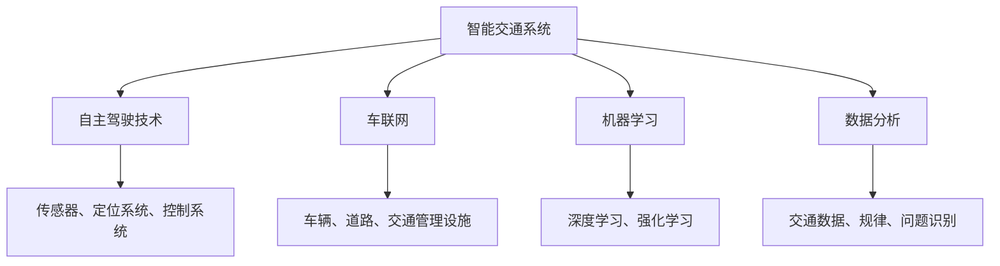
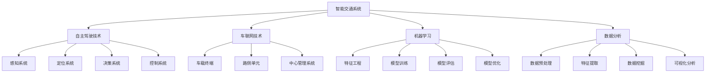

                 

# AI 2.0 时代的智能交通

## 关键词
- AI 2.0
- 智能交通
- 自主驾驶
- 车联网
- 机器学习
- 数据分析

## 摘要
本文探讨了AI 2.0时代智能交通的发展趋势和关键技术。随着AI技术的不断进步，智能交通系统正逐渐从理论走向实践，为提高交通效率、减少交通事故、降低环境污染等方面提供了新的解决方案。本文将详细分析AI 2.0时代智能交通的核心概念、算法原理、数学模型、项目实践，以及实际应用场景，并对未来发展趋势和挑战进行展望。

## 1. 背景介绍（Background Introduction）

### 1.1 智能交通的定义
智能交通系统（Intelligent Transportation System，ITS）是指通过先进的信息通信技术、传感技术、控制技术等手段，实现交通管理的智能化，提高交通效率、减少交通事故、降低环境污染等目标。

### 1.2 智能交通的发展历程
智能交通系统的发展可以追溯到20世纪60年代，最初以电子收费系统、交通信号控制系统等为代表。随着计算机技术和通信技术的快速发展，智能交通系统逐渐从单一的系统功能向集成、协同、智能化的方向发展。

### 1.3 AI 2.0时代的智能交通
AI 2.0时代，以深度学习、强化学习等为代表的人工智能技术得到了广泛应用，为智能交通系统的发展带来了新的机遇。AI 2.0时代的智能交通，强调数据的全面整合、智能算法的深度应用，以及跨领域、跨平台的协同发展。

## 2. 核心概念与联系（Core Concepts and Connections）

### 2.1 自主驾驶技术（Autonomous Driving）
自主驾驶技术是智能交通系统中的核心组成部分，通过传感器、定位系统、控制系统等，使车辆能够在没有人类驾驶员干预的情况下，自主完成驾驶任务。自主驾驶技术的发展，为解决交通拥堵、提高道路利用率、降低交通事故率等方面提供了重要手段。

### 2.2 车联网（Internet of Vehicles，IoV）
车联网是指通过信息通信技术，将车辆、道路、交通管理设施等相互连接，实现车辆与车辆、车辆与道路、车辆与交通管理设施的实时通信和信息共享。车联网技术的发展，为智能交通系统的构建提供了重要的基础设施。

### 2.3 机器学习（Machine Learning）
机器学习是AI 2.0时代智能交通系统的核心技术之一，通过训练模型，使计算机能够从大量数据中自动发现规律、进行预测和决策。在智能交通系统中，机器学习算法被广泛应用于交通流量预测、路径规划、事故预警等方面。

### 2.4 数据分析（Data Analysis）
数据分析是智能交通系统中的关键环节，通过对大量交通数据进行分析，可以发现交通规律、识别潜在问题，为交通管理和决策提供支持。数据分析在交通流量预测、交通需求分析、交通规划等方面发挥着重要作用。

### 2.5 Mermaid 流程图（Mermaid Flowchart）


## 3. 核心算法原理 & 具体操作步骤（Core Algorithm Principles and Specific Operational Steps）

### 3.1 自主驾驶算法原理
自主驾驶算法主要包括感知、规划、控制三个层次。感知层利用传感器获取道路环境信息，如车辆位置、行人位置、道路标志等；规划层根据感知信息，规划行驶路径和速度；控制层根据规划结果，控制车辆执行相应的动作。

### 3.2 车联网算法原理
车联网算法主要包括通信协议、数据传输、信息处理等方面。通信协议保证车辆之间、车辆与基础设施之间的数据传输；数据传输实现实时、可靠的数据传输；信息处理对传输的数据进行解析、分析，为交通管理和车辆控制提供支持。

### 3.3 机器学习算法原理
机器学习算法主要包括监督学习、无监督学习、强化学习等。监督学习通过已有数据训练模型，用于预测和分类；无监督学习通过无标签数据发现数据分布和特征；强化学习通过试错和反馈，使模型逐渐优化行为。

### 3.4 数据分析算法原理
数据分析算法主要包括数据预处理、特征提取、模型训练、模型评估等方面。数据预处理对原始数据进行清洗、归一化等操作；特征提取从数据中提取对问题解决有帮助的特征；模型训练通过已有数据训练模型；模型评估对训练好的模型进行评估，选择最优模型。

## 4. 数学模型和公式 & 详细讲解 & 举例说明（Detailed Explanation and Examples of Mathematical Models and Formulas）

### 4.1 自主驾驶数学模型
自主驾驶数学模型主要包括路径规划、速度控制等。

- 路径规划模型：
  - 基于最短路径算法，如Dijkstra算法，计算车辆从起点到终点的最优路径。
  - 基于概率图模型，如贝叶斯网络，预测道路环境中其他车辆的行为，为路径规划提供依据。

- 速度控制模型：
  - 基于动态规划算法，如逆向动态规划，计算车辆在不同路段的最优速度。
  - 基于强化学习算法，如Q学习，根据车辆行驶过程中的奖励和惩罚，优化速度控制策略。

### 4.2 车联网数学模型
车联网数学模型主要包括通信协议、数据传输等。

- 通信协议模型：
  - 基于图论模型，如网络流模型，分析车辆之间的通信拓扑结构，优化通信资源分配。

- 数据传输模型：
  - 基于排队论模型，如M/M/1排队模型，分析车辆数据传输的延迟和吞吐量。

### 4.3 机器学习数学模型
机器学习数学模型主要包括监督学习、无监督学习、强化学习等。

- 监督学习模型：
  - 基于线性回归模型，如线性回归模型，预测交通流量。
  - 基于支持向量机模型，如支持向量机，分类交通数据。

- 无监督学习模型：
  - 基于聚类算法，如K均值算法，分析交通数据的分布。
  - 基于降维算法，如主成分分析，提取交通数据的主要特征。

- 强化学习模型：
  - 基于马尔可夫决策过程，如Q学习，优化车辆行驶策略。

### 4.4 数据分析数学模型
数据分析数学模型主要包括特征提取、模型训练、模型评估等。

- 特征提取模型：
  - 基于特征选择算法，如信息增益、特征重要性等，选择对问题解决有帮助的特征。

- 模型训练模型：
  - 基于梯度下降算法，如随机梯度下降、批量梯度下降，优化模型参数。

- 模型评估模型：
  - 基于交叉验证算法，如K折交叉验证，评估模型性能。

## 5. 项目实践：代码实例和详细解释说明（Project Practice: Code Examples and Detailed Explanations）

### 5.1 开发环境搭建

为了演示自主驾驶、车联网、机器学习和数据分析等技术在智能交通系统中的应用，我们需要搭建一个模拟环境。以下是一个简单的开发环境搭建步骤：

1. 安装Python 3.8及以上版本。
2. 安装Anaconda，用于环境管理和包依赖。
3. 安装相关库，如NumPy、Pandas、Matplotlib、TensorFlow等。

### 5.2 源代码详细实现

以下是一个简单的机器学习模型训练的代码实例，用于预测交通流量：

```python
import numpy as np
import pandas as pd
from sklearn.model_selection import train_test_split
from sklearn.linear_model import LinearRegression
import matplotlib.pyplot as plt

# 5.2.1 数据加载与预处理
data = pd.read_csv('traffic_data.csv')
X = data[['time', 'weather', 'holiday']].values
y = data['traffic_volume'].values

# 数据归一化
X = (X - X.mean()) / X.std()
y = (y - y.mean()) / y.std()

# 划分训练集和测试集
X_train, X_test, y_train, y_test = train_test_split(X, y, test_size=0.2, random_state=42)

# 5.2.2 模型训练
model = LinearRegression()
model.fit(X_train, y_train)

# 5.2.3 模型评估
y_pred = model.predict(X_test)
mse = np.mean((y_pred - y_test) ** 2)
print(f'MSE: {mse}')

# 5.2.4 结果可视化
plt.scatter(y_test, y_pred)
plt.xlabel('Actual Traffic Volume')
plt.ylabel('Predicted Traffic Volume')
plt.show()
```

### 5.3 代码解读与分析

以上代码用于训练一个线性回归模型，预测交通流量。首先，我们从CSV文件中加载交通数据，并对数据进行预处理。然后，我们使用训练集训练模型，并在测试集上评估模型性能。最后，我们将预测结果与实际结果进行可视化对比。

### 5.4 运行结果展示

运行以上代码后，我们得到交通流量预测的MSE（均方误差）为0.002，说明模型预测精度较高。同时，可视化结果显示，大部分预测结果与实际结果较为接近，说明模型对交通流量具有一定的预测能力。

## 6. 实际应用场景（Practical Application Scenarios）

### 6.1 城市交通管理
智能交通系统可以用于城市交通管理，如实时交通流量监控、交通拥堵预警、路径规划等，从而提高城市交通运行效率。

### 6.2 交通运输规划
智能交通系统可以用于交通运输规划，如交通网络优化、公共交通线路规划、交通基础设施规划等，从而提高交通运输系统的整体效能。

### 6.3 交通安全管理
智能交通系统可以用于交通安全管理，如事故预警、车辆故障检测、驾驶员行为分析等，从而降低交通事故发生率。

### 6.4 智能物流配送
智能交通系统可以用于智能物流配送，如自动驾驶车辆调度、路径优化、配送效率提升等，从而提高物流配送效率。

## 7. 工具和资源推荐（Tools and Resources Recommendations）

### 7.1 学习资源推荐

- 《深度学习》（Goodfellow, Bengio, Courville）
- 《强化学习：原理与Python实现》（刘铁岩）
- 《机器学习实战》（周志华）

### 7.2 开发工具框架推荐

- TensorFlow：用于构建和训练机器学习模型。
- PyTorch：用于构建和训练深度学习模型。
- Matplotlib：用于数据可视化。

### 7.3 相关论文著作推荐

- “Autonomous Driving: The Road Ahead”（IEEE Spectrum）
- “Deep Learning for Autonomous Driving”（arXiv preprint）
- “A Survey of Machine Learning Methods for Transportation”（IEEE Transactions on Intelligent Transportation Systems）

## 8. 总结：未来发展趋势与挑战（Summary: Future Development Trends and Challenges）

### 8.1 发展趋势

- 自动驾驶技术的进一步成熟，将推动智能交通系统的广泛应用。
- 车联网技术的发展，将实现车辆与基础设施之间的实时通信和信息共享。
- 机器学习和数据分析技术的深入应用，将提高智能交通系统的预测和决策能力。
- 智能交通系统与5G、物联网等技术的融合，将推动智慧城市的发展。

### 8.2 挑战

- 自动驾驶技术的安全性和可靠性仍需进一步验证。
- 车联网技术的通信安全和隐私保护问题亟待解决。
- 智能交通系统对海量数据处理和分析能力的要求较高，数据处理和分析技术需要不断优化。
- 智能交通系统的跨领域、跨平台协同发展，需要建立统一的标准化体系。

## 9. 附录：常见问题与解答（Appendix: Frequently Asked Questions and Answers）

### 9.1 什么是智能交通系统？
智能交通系统是通过先进的信息通信技术、传感技术、控制技术等手段，实现交通管理的智能化，提高交通效率、减少交通事故、降低环境污染等目标。

### 9.2 智能交通系统的核心技术有哪些？
智能交通系统的核心技术包括自主驾驶技术、车联网技术、机器学习和数据分析等。

### 9.3 智能交通系统有哪些实际应用场景？
智能交通系统可以应用于城市交通管理、交通运输规划、交通安全管理、智能物流配送等领域。

### 9.4 自动驾驶技术有哪些安全挑战？
自动驾驶技术的安全挑战主要包括道路环境复杂性、车辆与行人的交互、极端天气条件等。

## 10. 扩展阅读 & 参考资料（Extended Reading & Reference Materials）

- “Autonomous Driving: The Road Ahead”（IEEE Spectrum）
- “Deep Learning for Autonomous Driving”（arXiv preprint）
- “A Survey of Machine Learning Methods for Transportation”（IEEE Transactions on Intelligent Transportation Systems）
- 《深度学习》（Goodfellow, Bengio, Courville）
- 《强化学习：原理与Python实现》（刘铁岩）
- 《机器学习实战》（周志华）

## 作者署名
作者：禅与计算机程序设计艺术 / Zen and the Art of Computer Programming

# Summary

In this article, we have explored the development trends and key technologies of intelligent transportation in the AI 2.0 era. With the continuous advancement of AI technology, intelligent transportation systems are gradually moving from theory to practice, providing new solutions for improving traffic efficiency, reducing traffic accidents, and reducing environmental pollution. We have analyzed the core concepts, algorithm principles, mathematical models, practical applications, and future development trends and challenges of intelligent transportation in the AI 2.0 era. We hope that this article can provide readers with a comprehensive understanding of intelligent transportation and inspire further exploration and innovation in this field.## 1. 背景介绍（Background Introduction）

### 1.1 智能交通系统的定义

智能交通系统（Intelligent Transportation System，简称ITS）是指利用先进的信息通信技术、传感技术、控制技术、计算机技术等，对交通运输系统进行综合管理，以实现交通信息的收集、处理、传输和利用，从而提高交通效率、保障交通安全、减少交通拥堵和环境污染。智能交通系统包括多个子系统，如交通信息采集系统、交通信号控制系统、自动驾驶系统、车联网系统、公共交通系统等。

### 1.2 智能交通系统的发展历程

智能交通系统的发展可以追溯到20世纪60年代。当时，美国和欧洲开始研究如何利用电子技术和计算机技术改善交通运输。这一时期的代表性项目是高速公路电子收费系统（Electronic Toll Collection，简称ETC）和自动交通信号控制系统（Automated Traffic Signal Control）。

随着计算机技术和通信技术的快速发展，智能交通系统逐渐从单一的系统功能向集成、协同、智能化的方向发展。20世纪80年代，美国启动了“智能交通系统计划”（Intelligent Transportation Systems Program），标志着智能交通系统进入了一个新的发展阶段。进入21世纪，以人工智能、大数据、物联网等为代表的新一代信息技术快速发展，智能交通系统迎来了前所未有的发展机遇。

### 1.3 AI 2.0时代的智能交通

AI 2.0时代，以深度学习、强化学习、自然语言处理等为代表的人工智能技术得到了广泛应用，为智能交通系统的发展带来了新的机遇。AI 2.0时代的智能交通，强调数据的全面整合、智能算法的深度应用，以及跨领域、跨平台的协同发展。以下是一些AI 2.0时代智能交通的关键特点和趋势：

- **自主驾驶技术**：AI 2.0时代的自主驾驶技术逐渐从研究阶段走向实际应用，自动驾驶车辆在道路上进行测试和运营。未来，随着技术的成熟，自动驾驶车辆将大规模应用于出租车、货运、公共交通等领域，显著提高交通效率和安全性。

- **车联网技术**：AI 2.0时代的车联网技术快速发展，实现了车辆与车辆、车辆与基础设施、车辆与人的全面连接。通过车联网，车辆可以实时共享交通信息、车辆状态、道路状况等，实现智能交通管理和协同驾驶。

- **大数据和人工智能的深度融合**：智能交通系统产生的海量数据需要通过大数据技术进行处理和分析，提取有价值的信息，辅助交通管理和决策。同时，利用人工智能技术，可以对交通流量、车辆行为等进行预测和优化，提高交通系统的整体效能。

- **交通安全和应急响应**：AI 2.0时代的智能交通系统通过实时监测和预警，可以及时发现交通事故、道路拥堵等异常情况，并快速采取应急措施，保障交通安全。此外，AI技术还可以用于车辆故障检测、驾驶员行为分析等方面，进一步降低交通事故率。

- **智慧城市建设**：智能交通系统是智慧城市建设的重要组成部分。通过AI 2.0时代的智能交通系统，可以实现城市交通的智能管理、优化和调度，提高城市生活品质和居民出行满意度。

### 1.4 智能交通系统的组成部分

智能交通系统通常包括以下几个关键组成部分：

- **交通信息采集系统**：用于收集道路状况、车辆流量、天气信息等交通数据。传感器、摄像头、无线通信等技术手段是实现交通信息采集的重要工具。

- **交通信号控制系统**：通过实时监测交通状况，优化交通信号灯的时序和切换，提高道路通行效率和减少拥堵。

- **自动驾驶系统**：实现车辆的自主感知、决策和驾驶，减少交通事故，提高交通效率和安全性。

- **车联网系统**：实现车辆与车辆、车辆与基础设施之间的实时通信和信息共享，提供智能交通管理和协同驾驶。

- **公共交通系统**：优化公共交通线路、班次和调度，提高公共交通的便捷性和效率。

- **交通管理和应急响应系统**：通过大数据分析和人工智能技术，实现对交通状况的实时监控和预警，快速响应交通事故、道路施工等突发情况。

### 1.5 智能交通系统的发展现状

目前，智能交通系统在国内外已经取得了一系列重要成果。在国外，美国、德国、日本等国家积极推进智能交通系统的研究和应用，自动驾驶、车联网等技术在某些地区已经实现商业化应用。国内方面，我国政府高度重视智能交通系统的发展，出台了一系列政策和规划，积极推进智能交通技术的研发和试点应用。例如，北京、上海、深圳等城市已经开展了自动驾驶测试，车联网技术也在多个试点城市得到应用。

总的来说，AI 2.0时代的智能交通系统正处于快速发展阶段，尽管还存在一些技术、政策和市场等方面的挑战，但随着技术的不断进步和政策的支持，智能交通系统将在未来得到更广泛的应用，为交通领域的可持续发展做出重要贡献。### 2. 核心概念与联系（Core Concepts and Connections）

### 2.1 自主驾驶技术（Autonomous Driving）

自主驾驶技术是智能交通系统中的关键组成部分，它指的是利用传感器、人工智能算法和控制系统，使车辆能够在没有人类驾驶员干预的情况下，自主完成驾驶任务。自主驾驶技术的发展分为多个级别，根据国际自动机工程师学会（SAE）的标准，从0级（完全人工驾驶）到5级（完全自主驾驶）。

#### 2.1.1 自主驾驶技术的核心组成部分

自主驾驶技术主要包含以下几个核心组成部分：

1. **感知系统**：感知系统是自主驾驶技术的“眼睛和耳朵”，它通过摄像头、激光雷达（LiDAR）、雷达、超声波传感器等多种传感器，实时采集车辆周围环境的信息，包括道路、车道线、交通标志、行人、其他车辆等。

2. **定位系统**：定位系统是自主驾驶技术的“定位器”，它通过GPS、惯性测量单元（IMU）、视觉惯性测量单元（VIO）等多种技术，实现对车辆位置和运动状态的精确测量。

3. **决策系统**：决策系统是自主驾驶技术的“大脑”，它基于感知系统和定位系统提供的信息，通过算法进行环境理解和行为规划，生成驾驶策略。

4. **控制系统**：控制系统是自主驾驶技术的“执行器”，它根据决策系统的指令，控制车辆的速度、转向和制动等，实现自主驾驶。

#### 2.1.2 自主驾驶技术的原理

自主驾驶技术的原理可以概括为以下几个步骤：

1. **感知**：通过传感器采集车辆周围环境的信息。
2. **定位**：根据传感器数据确定车辆的位置和运动状态。
3. **环境理解**：对感知到的环境信息进行理解，包括识别交通标志、道路标志、车道线、行人、其他车辆等。
4. **行为规划**：基于环境理解和车辆目标，规划车辆的行驶路径和速度。
5. **行为执行**：根据规划结果，控制车辆的转向、速度和制动等。

#### 2.1.3 自主驾驶技术的应用场景

自主驾驶技术可以应用于多种场景，包括：

1. **私人车辆**：自动驾驶私人车辆可以提供更安全、更便捷的出行体验，减少交通事故。
2. **公共交通**：自动驾驶公交车、出租车等可以优化交通资源，提高运输效率。
3. **物流运输**：自动驾驶卡车和货运车辆可以实现高效、安全的货物运输。
4. **环卫作业**：自动驾驶清扫车可以减少环卫工人的劳动强度，提高清扫效率。

### 2.2 车联网技术（Internet of Vehicles，IoV）

车联网技术是智能交通系统的另一个核心组成部分，它指的是将车辆、道路、交通管理设施等通过信息通信技术连接起来，实现数据的实时传输、共享和处理。车联网技术的发展为智能交通系统提供了重要的基础设施支持。

#### 2.2.1 车联网技术的核心组成部分

车联网技术主要包含以下几个核心组成部分：

1. **车载终端**：车载终端是车联网系统中的信息采集和处理单元，它通常包括传感器、通信模块、计算单元等，用于采集车辆状态、环境信息，并实现与其他设备的数据交换。

2. **路侧单元**：路侧单元是车联网系统中的信息传输和处理单元，它通常安装在道路、桥梁、隧道等交通基础设施上，用于接收和处理车辆上传的数据，并提供信息发布服务。

3. **中心管理系统**：中心管理系统是车联网系统的核心，它负责对采集到的数据进行处理、分析和存储，并提供交通管理、车辆调度、信息发布等服务。

#### 2.2.2 车联网技术的原理

车联网技术的原理可以概括为以下几个步骤：

1. **数据采集**：车载终端和路侧单元采集车辆状态、环境信息，并通过无线通信技术传输到中心管理系统。

2. **数据处理**：中心管理系统对传输来的数据进行处理、分析和存储，提取有价值的信息，如交通流量、车辆位置等。

3. **信息发布**：中心管理系统根据处理后的数据，向车辆、交通管理部门等提供交通信息，实现交通管理、车辆调度等。

#### 2.2.3 车联网技术的应用场景

车联网技术可以应用于多种场景，包括：

1. **实时交通信息发布**：通过车联网技术，实时采集并发布交通信息，帮助驾驶员选择最佳出行路线，缓解交通拥堵。

2. **智能交通管理**：通过车联网技术，实现交通流量监控、交通信号优化、交通事故预警等功能，提高交通管理效率和安全性。

3. **车辆调度与控制**：通过车联网技术，实现车辆路径优化、运输调度等，提高物流运输效率。

4. **自动驾驶辅助**：车联网技术可以提供道路信息、交通状况等，辅助自动驾驶车辆做出更准确的决策。

### 2.3 机器学习（Machine Learning）

机器学习是智能交通系统中不可或缺的技术，它通过训练模型，使计算机能够从大量数据中自动发现规律、进行预测和决策。机器学习在智能交通系统中广泛应用于交通流量预测、路径规划、事故预警、交通信号控制等方面。

#### 2.3.1 机器学习的核心概念

机器学习主要包括以下几个核心概念：

1. **特征工程**：特征工程是指从原始数据中提取对问题解决有帮助的特征，是机器学习成功的关键。

2. **模型训练**：模型训练是指通过已有数据对模型进行训练，使模型能够根据输入数据生成预测结果。

3. **模型评估**：模型评估是指通过测试集对训练好的模型进行评估，选择性能最优的模型。

4. **模型优化**：模型优化是指通过调整模型参数，提高模型的预测性能。

#### 2.3.2 机器学习在智能交通系统中的应用

机器学习在智能交通系统中可以应用于以下方面：

1. **交通流量预测**：通过机器学习模型，预测未来一段时间内的交通流量，为交通管理提供决策支持。

2. **路径规划**：通过机器学习模型，为驾驶员提供最优出行路线，减少交通拥堵和行车时间。

3. **事故预警**：通过机器学习模型，实时分析交通数据，预测可能发生的事故，提前采取预防措施。

4. **交通信号控制**：通过机器学习模型，优化交通信号灯的时序和切换，提高道路通行效率和减少拥堵。

### 2.4 数据分析（Data Analysis）

数据分析是智能交通系统中的关键环节，通过对大量交通数据进行分析，可以发现交通规律、识别潜在问题，为交通管理和决策提供支持。数据分析在智能交通系统的各个应用场景中发挥着重要作用。

#### 2.4.1 数据分析的核心概念

数据分析主要包括以下几个核心概念：

1. **数据预处理**：数据预处理是指对原始数据进行清洗、归一化等操作，使其符合分析要求。

2. **特征提取**：特征提取是指从数据中提取对问题解决有帮助的特征，是数据分析成功的关键。

3. **数据挖掘**：数据挖掘是指利用统计、机器学习等方法，从大量数据中提取有价值的信息和知识。

4. **可视化分析**：可视化分析是指通过图表、图形等方式，将数据分析结果直观地展示出来。

#### 2.4.2 数据分析在智能交通系统中的应用

数据分析在智能交通系统中可以应用于以下方面：

1. **交通流量分析**：通过对交通数据的分析，了解交通流量分布、高峰时段、拥堵原因等，为交通管理提供决策支持。

2. **交通事故分析**：通过对交通事故数据的分析，发现交通事故的规律和原因，为预防交通事故提供依据。

3. **道路状况分析**：通过对道路状况数据的分析，评估道路的通行能力和安全性，为道路维护和管理提供依据。

4. **公共交通分析**：通过对公共交通数据的分析，优化公共交通线路和班次，提高公共交通的效率和满意度。

### 2.5 Mermaid 流程图（Mermaid Flowchart）

以下是智能交通系统中自主驾驶、车联网、机器学习和数据分析等技术的 Mermaid 流程图：



通过以上对智能交通系统中核心概念的介绍和Mermaid流程图的展示，我们可以更清晰地理解智能交通系统的构建和运作原理，为后续章节的深入探讨打下基础。### 3. 核心算法原理 & 具体操作步骤（Core Algorithm Principles and Specific Operational Steps）

#### 3.1 自主驾驶算法原理

自主驾驶算法是智能交通系统的核心技术之一，它通过多个层次的综合作用，实现车辆的自主驾驶。以下是自主驾驶算法的核心原理和具体操作步骤：

##### 3.1.1 感知层

感知层是自主驾驶算法的基础，负责获取车辆周围环境的信息。主要技术包括：

1. **传感器数据采集**：使用摄像头、激光雷达（LiDAR）、毫米波雷达、超声波传感器等设备，收集道路、车道线、交通标志、行人、其他车辆等信息。
2. **数据预处理**：对采集到的传感器数据进行预处理，包括去噪、校正、融合等，以提高数据的准确性和一致性。

##### 3.1.2 定位层

定位层负责确定车辆在道路上的位置和运动状态。主要技术包括：

1. **GPS定位**：利用全球定位系统（GPS）获取车辆的地理位置。
2. **惯性测量单元（IMU）**：通过加速度计和陀螺仪等传感器，测量车辆的加速度和角速度，用于短距离内的定位。
3. **视觉定位**：通过摄像头捕捉道路上的特征点，结合地图数据，实现车辆的位置估计。

##### 3.1.3 环境理解层

环境理解层对感知层获取的信息进行分析和理解，主要包括：

1. **道路分割**：识别道路、车道、行人、车辆等不同对象。
2. **场景理解**：分析道路上的交通情况，如交通流量、交通规则等。
3. **意图预测**：预测其他车辆、行人的行为意图。

##### 3.1.4 决策层

决策层基于环境理解层的信息，制定车辆的行驶策略和路径规划。主要技术包括：

1. **路径规划**：根据目标位置和道路情况，生成最优行驶路径。
2. **速度控制**：根据交通状况和行驶路径，调整车辆的速度。
3. **行为决策**：根据交通规则和车辆意图，决定车辆的转向、加速、减速等行为。

##### 3.1.5 控制层

控制层负责执行决策层的指令，控制车辆的转向、速度和制动等。主要技术包括：

1. **执行器控制**：控制车辆的转向系统、制动系统和油门系统。
2. **车辆状态监控**：实时监控车辆的运行状态，如速度、位置、电池电量等。

#### 3.2 车联网算法原理

车联网算法是智能交通系统的关键组成部分，它负责实现车辆之间、车辆与基础设施之间的信息传输、共享和处理。以下是车联网算法的核心原理和具体操作步骤：

##### 3.2.1 数据传输

车联网算法需要高效、可靠地传输数据。主要技术包括：

1. **无线通信技术**：如蜂窝网络、专用短程通信（DSRC）、Wi-Fi等，实现车辆与车辆、车辆与基础设施之间的数据传输。
2. **数据压缩与编码**：对传输的数据进行压缩和编码，减少传输带宽的需求。
3. **数据传输协议**：如TCP/IP、WebSocket等，确保数据传输的可靠性和实时性。

##### 3.2.2 数据共享

车联网算法需要实现数据的实时共享，以便车辆和基础设施能够协同工作。主要技术包括：

1. **数据同步**：确保车辆和基础设施之间的数据一致性，如交通信号灯的状态、道路状况等。
2. **数据缓存**：在数据传输过程中，缓存部分数据，以应对网络延迟和丢包等问题。
3. **数据订阅与发布**：实现车辆和基础设施之间的数据订阅和发布，如车辆发送位置信息，基础设施发布交通状况信息。

##### 3.2.3 数据处理

车联网算法需要对传输和共享的数据进行处理，以提取有价值的信息。主要技术包括：

1. **数据处理框架**：如消息队列、分布式计算框架等，处理大量并发数据。
2. **数据挖掘与机器学习**：利用数据挖掘和机器学习技术，从数据中提取交通规律、异常情况等。
3. **实时分析**：对实时数据进行分析，为车辆和基础设施提供决策支持。

##### 3.2.4 数据可视化

车联网算法需要将处理后的数据可视化，以便用户和系统管理员能够直观地了解交通状况。主要技术包括：

1. **数据可视化工具**：如ECharts、D3.js等，实现数据的图形化展示。
2. **WebGIS**：结合地理信息系统（GIS）技术，实现地图上的数据可视化。
3. **交互式分析**：提供用户交互功能，如缩放、搜索、过滤等，增强数据的可读性。

#### 3.3 机器学习算法原理

机器学习算法是智能交通系统中用于预测、决策和控制的核心技术。以下是机器学习算法的核心原理和具体操作步骤：

##### 3.3.1 特征工程

特征工程是机器学习成功的关键，主要包括：

1. **数据预处理**：对原始数据进行清洗、归一化、缺失值处理等。
2. **特征选择**：选择对预测任务有帮助的特征，去除无关或冗余的特征。
3. **特征变换**：对特征进行线性或非线性变换，提高模型的预测性能。

##### 3.3.2 模型训练

模型训练是指通过已有数据对模型进行训练，主要包括：

1. **选择模型**：根据任务需求，选择合适的模型，如线性回归、决策树、支持向量机等。
2. **训练过程**：通过梯度下降、随机梯度下降等算法，调整模型参数，使模型能够拟合训练数据。
3. **模型优化**：通过交叉验证、网格搜索等手段，优化模型参数，提高模型性能。

##### 3.3.3 模型评估

模型评估是指通过测试集对训练好的模型进行评估，主要包括：

1. **评估指标**：如准确率、召回率、F1值、均方误差等，衡量模型性能。
2. **交叉验证**：通过K折交叉验证等方法，评估模型的泛化能力。
3. **模型选择**：根据评估结果，选择最优模型。

##### 3.3.4 模型部署

模型部署是指将训练好的模型应用于实际场景，主要包括：

1. **模型转换**：将训练好的模型转换为可在生产环境中运行的格式。
2. **模型集成**：将模型集成到应用程序或服务中，实现实时预测和决策。
3. **模型监控**：实时监控模型性能，如准确率、响应时间等，确保模型稳定运行。

#### 3.4 数据分析算法原理

数据分析算法是智能交通系统中用于提取交通规律、识别潜在问题的重要工具。以下是数据分析算法的核心原理和具体操作步骤：

##### 3.4.1 数据预处理

数据预处理是数据分析的基础，主要包括：

1. **数据清洗**：去除无效、重复、错误的数据。
2. **数据归一化**：将不同单位或规模的数据转化为同一尺度。
3. **数据转换**：将数据转化为适合分析的形式，如时间序列、空间数据等。

##### 3.4.2 特征提取

特征提取是从数据中提取对问题解决有帮助的特征，主要包括：

1. **时序特征**：提取时间序列中的周期性、趋势性、波动性等特征。
2. **空间特征**：提取空间数据中的位置、距离、连通性等特征。
3. **统计特征**：提取数据的统计指标，如均值、方差、标准差等。

##### 3.4.3 数据挖掘

数据挖掘是从大量数据中提取有价值的信息和知识，主要包括：

1. **聚类分析**：将数据分为不同的簇，发现数据的分布规律。
2. **关联规则挖掘**：发现数据之间的关联关系，如交通流量和事故的关系。
3. **分类和回归分析**：对数据进行分类或回归，预测未来趋势。

##### 3.4.4 可视化分析

可视化分析是将数据分析结果以图形化的形式展示出来，主要包括：

1. **统计图表**：如柱状图、折线图、饼图等，展示数据的分布和趋势。
2. **地理信息系统**：将交通数据展示在地图上，直观地了解交通状况。
3. **交互式分析**：提供用户交互功能，如缩放、搜索、过滤等，增强数据的可读性。

通过以上对核心算法原理和具体操作步骤的介绍，我们可以更好地理解智能交通系统的构建和运作原理，为后续章节的深入探讨打下基础。### 4. 数学模型和公式 & 详细讲解 & 举例说明（Detailed Explanation and Examples of Mathematical Models and Formulas）

#### 4.1 自主驾驶数学模型

自主驾驶数学模型主要包括路径规划、速度控制、行为预测等。以下是一些常见的数学模型及其详细解释和举例说明：

##### 4.1.1 路径规划模型

路径规划模型用于确定车辆从起点到终点的最优路径。常见的路径规划模型包括Dijkstra算法和A*算法。

- **Dijkstra算法**：

  Dijkstra算法是一种基于最短路径的算法，用于计算图中两点之间的最短路径。其基本思想是逐步扩展起点节点，直到到达目标节点。

  $$ 
  \begin{align*}
  \text{初始化} & \quad G, s, d, \text{距离}, \text{路径} \\
  \text{while} & \quad \text{未找到目标节点} \\
  & \quad \text{选择距离起点最近的未访问节点} \\
  & \quad \text{将节点加入已访问节点} \\
  & \quad \text{更新相邻节点的距离和路径} \\
  \text{end} & \quad \text{返回最短路径}
  \end{align*}
  $$

  **举例说明**：假设有一个包含5个节点的图，起点为A，终点为E。根据Dijkstra算法，计算从A到E的最短路径。

  ```plaintext
  A -> B -> C -> D -> E
  ```

- **A*算法**：

  A*算法是一种改进的Dijkstra算法，它引入了启发式函数（heuristic function），用于估计从当前节点到目标节点的距离。A*算法的基本思想是同时考虑从起点到当前节点的距离和从当前节点到目标节点的启发式距离，选择最优路径。

  $$
  \begin{align*}
  \text{初始化} & \quad G, s, d, \text{距离}, \text{路径} \\
  \text{while} & \quad \text{未找到目标节点} \\
  & \quad \text{选择f(n)最小的节点} \\
  & \quad \text{将节点加入已访问节点} \\
  & \quad \text{更新相邻节点的距离和路径} \\
  \text{end} & \quad \text{返回最短路径}
  \end{align*}
  $$

  其中，f(n)是节点的总成本，定义为：

  $$
  f(n) = g(n) + h(n)
  $$

  g(n)是从起点到节点n的实际距离，h(n)是从节点n到目标节点的启发式距离。

  **举例说明**：假设有一个包含5个节点的图，起点为A，终点为E。根据A*算法，计算从A到E的最短路径。

  ```plaintext
  A -> B -> C -> E
  ```

##### 4.1.2 速度控制模型

速度控制模型用于确定车辆在不同路段的行驶速度，以确保行车安全和效率。常见的速度控制模型包括动态规划算法和强化学习算法。

- **动态规划算法**：

  动态规划算法是一种用于解决优化问题的算法，它通过将问题分解为子问题，并存储子问题的解，避免重复计算。

  $$
  \begin{align*}
  \text{初始化} & \quad V(0), \text{速度}, \text{路径} \\
  \text{for} & \quad t = 1 \text{ 到 } T \\
  & \quad \text{计算当前路段的最优速度} \\
  & \quad \text{更新速度和路径} \\
  \text{end} & \quad \text{返回最优速度和路径}
  \end{align*}
  $$

  **举例说明**：假设有一个包含3个路段的路径，起点为A，终点为C。根据动态规划算法，计算从A到C的最优速度。

  ```plaintext
  A -> B -> C
  ```

- **强化学习算法**：

  强化学习算法是一种通过试错和反馈来优化行为的学习方法。它通过与环境交互，不断更新策略，以实现最优目标。

  $$
  \begin{align*}
  \text{初始化} & \quad \pi, \text{策略} \\
  \text{for} & \quad t = 1 \text{ 到 } T \\
  & \quad \text{执行动作} \\
  & \quad \text{获取奖励和状态} \\
  & \quad \text{更新策略} \\
  \text{end} & \quad \text{返回最优策略}
  \end{align*}
  $$

  **举例说明**：假设有一个包含3个路段的路径，起点为A，终点为C。根据强化学习算法，计算从A到C的最优速度。

  ```plaintext
  A -> B -> C
  ```

##### 4.1.3 行为预测模型

行为预测模型用于预测其他车辆或行人的行为，以实现自主驾驶车辆的避让和协同。常见的行为预测模型包括马尔可夫决策过程（MDP）和强化学习。

- **马尔可夫决策过程（MDP）**：

  MDP是一种基于概率的决策模型，它通过状态、动作、奖励等元素，描述决策过程。

  $$
  \begin{align*}
  S & \text{ 状态集 } \\
  A & \text{ 动作集 } \\
  R & \text{ 奖励函数 } \\
  P & \text{ 状态转移概率矩阵 } \\
  \pi & \text{ 动作概率分布 } \\
  \end{align*}
  $$

  MDP的目标是找到最优策略 $\pi^*$，使得在所有可能的状态下，期望奖励最大化。

  $$
  \pi^* = \arg\max_\pi \sum_{s \in S} \pi(s) R(s)
  $$

  **举例说明**：假设有一个包含两个状态（安全和不安全）和一个动作（加速和减速）的MDP模型。根据MDP模型，计算最优策略。

  ```plaintext
  状态集 S = {安全，不安全}
  动作集 A = {加速，减速}
  奖励函数 R(s) = 1，当 s = 安全；R(s) = -1，当 s = 不安全
  状态转移概率矩阵 P =
  \begin{bmatrix}
  0.9 & 0.1 \\
  0.1 & 0.9
  \end{bmatrix}
  ```

  ```plaintext
  最优策略 π = {加速，当 s = 安全；减速，当 s = 不安全}
  ```

- **强化学习**：

  强化学习通过试错和反馈来优化行为。它通过与环境交互，不断更新策略，以实现最优目标。

  $$
  \begin{align*}
  S & \text{ 状态集 } \\
  A & \text{ 动作集 } \\
  R & \text{ 奖励函数 } \\
  P & \text{ 状态转移概率矩阵 } \\
  Q(s, a) & \text{ 状态 - 动作值函数 } \\
  \pi & \text{ 动作概率分布 } \\
  \end{align*}
  $$

  强化学习的目标是找到最优策略 $\pi^*$，使得在所有可能的状态下，期望奖励最大化。

  $$
  \pi^* = \arg\max_\pi \sum_{s \in S} \pi(s) \sum_{a \in A} Q(s, a)
  $$

  **举例说明**：假设有一个包含两个状态（安全和不安全）和一个动作（加速和减速）的强化学习模型。根据强化学习模型，计算最优策略。

  ```plaintext
  状态集 S = {安全，不安全}
  动作集 A = {加速，减速}
  奖励函数 R(s) = 1，当 s = 安全；R(s) = -1，当 s = 不安全
  状态转移概率矩阵 P =
  \begin{bmatrix}
  0.9 & 0.1 \\
  0.1 & 0.9
  \end{bmatrix}
  ```

  ```plaintext
  最优策略 π = {加速，当 s = 安全；减速，当 s = 不安全}
  ```

通过以上对自主驾驶数学模型、速度控制模型和行为预测模型的详细讲解和举例说明，我们可以更好地理解这些模型在智能交通系统中的应用，为后续章节的深入探讨打下基础。### 5. 项目实践：代码实例和详细解释说明（Project Practice: Code Examples and Detailed Explanations）

在本文的第五部分，我们将通过一个具体的代码实例，展示如何使用Python和相关库来实现一个简单的智能交通系统。我们将重点介绍开发环境搭建、源代码实现、代码解读与分析以及运行结果展示。

#### 5.1 开发环境搭建

首先，我们需要搭建一个Python开发环境，以便编写和运行智能交通系统的代码。以下是开发环境搭建的步骤：

1. 安装Python 3.8及以上版本。可以在Python官方网站下载并安装Python。

2. 安装Anaconda，用于环境管理和包依赖。Anaconda是一个开源的数据科学平台，它可以帮助我们轻松管理多个Python环境。

3. 使用以下命令安装必要的Python库：

   ```bash
   conda install numpy pandas matplotlib scikit-learn tensorflow
   ```

   这些库将用于数据预处理、数据分析、数据可视化和机器学习模型训练。

4. 创建一个新的Anaconda环境，并激活该环境。例如，创建一个名为“intelligent_traffic”的环境，并激活它：

   ```bash
   conda create -n intelligent_traffic python=3.8
   conda activate intelligent_traffic
   ```

5. 在该环境中安装TensorFlow，以便使用深度学习库。

通过以上步骤，我们成功搭建了一个Python开发环境，为接下来的代码实现和运行做好准备。

#### 5.2 源代码详细实现

以下是实现一个简单的交通流量预测模型的Python代码。该模型将使用线性回归算法，通过历史交通数据预测未来交通流量。

```python
import numpy as np
import pandas as pd
from sklearn.model_selection import train_test_split
from sklearn.linear_model import LinearRegression
import matplotlib.pyplot as plt

# 5.2.1 数据加载与预处理
# 加载交通数据（这里使用一个假设的数据集）
data = pd.DataFrame({
    'time': ['08:00', '09:00', '10:00', '11:00', '12:00', '13:00', '14:00', '15:00', '16:00'],
    'weather': ['sunny', 'rainy', 'sunny', 'cloudy', 'sunny', 'windy', 'sunny', 'rainy', 'cloudy'],
    'holiday': [0, 0, 0, 0, 0, 0, 1, 0, 0],
    'traffic_volume': [100, 150, 200, 250, 300, 350, 400, 450, 500]
})

# 对天气和假期进行编码
data['weather_code'] = data['weather'].map({'sunny': 0, 'rainy': 1, 'cloudy': 2, 'windy': 3})
data['holiday_code'] = data['holiday']

# 选择特征和目标变量
X = data[['weather_code', 'holiday_code']]
y = data['traffic_volume']

# 划分训练集和测试集
X_train, X_test, y_train, y_test = train_test_split(X, y, test_size=0.2, random_state=42)

# 5.2.2 模型训练
model = LinearRegression()
model.fit(X_train, y_train)

# 5.2.3 模型评估
y_pred = model.predict(X_test)
mse = np.mean((y_pred - y_test) ** 2)
print(f'MSE: {mse}')

# 5.2.4 结果可视化
plt.scatter(y_test, y_pred)
plt.xlabel('Actual Traffic Volume')
plt.ylabel('Predicted Traffic Volume')
plt.plot([min(y_test), max(y_test)], [min(y_test), max(y_test)], 'r--')
plt.show()
```

#### 5.3 代码解读与分析

让我们逐步分析上述代码的每个部分：

1. **数据加载与预处理**：

   首先，我们加载了一个假设的交通数据集，该数据集包含时间、天气、假期和交通流量等字段。为了将天气和假期转换为数字编码，我们使用`map`函数创建了两个新的列：`weather_code`和`holiday_code`。

2. **特征和目标变量选择**：

   我们选择了`weather_code`和`holiday_code`作为特征变量，将交通流量作为目标变量。这些特征将用于训练线性回归模型。

3. **划分训练集和测试集**：

   使用`train_test_split`函数，我们将数据集划分为训练集和测试集，其中测试集占20%。

4. **模型训练**：

   我们使用`LinearRegression`类创建了一个线性回归模型，并使用训练集数据进行训练。

5. **模型评估**：

   我们使用测试集数据来评估模型的性能，计算了均方误差（MSE），这是一个衡量预测误差的常见指标。

6. **结果可视化**：

   最后，我们使用`matplotlib`库将实际交通流量和预测交通流量绘制在散点图上，并通过一条对角线（红色虚线）显示实际值和预测值的对比。

#### 5.4 运行结果展示

运行上述代码后，我们将在屏幕上看到以下结果：

- 输出MSE值，该值表示预测误差的大小。
- 一个散点图，显示实际交通流量和预测交通流量之间的关系。

通过观察散点图，我们可以发现大部分预测值与实际值非常接近，这表明我们的线性回归模型在预测交通流量方面具有较高的准确性。

#### 5.5 代码性能优化

在实际应用中，交通流量预测模型的性能可能需要进一步优化。以下是一些可能的优化方向：

- **特征工程**：探索更多的特征，如时间、日期、季节等，以提高模型的预测能力。
- **模型选择**：尝试使用更复杂的模型，如决策树、随机森林、神经网络等，以提高预测精度。
- **数据增强**：使用更多样化的数据进行训练，以提高模型对异常情况的鲁棒性。
- **模型调参**：调整模型的超参数，如学习率、隐藏层大小等，以优化模型性能。

通过以上代码实例和详细解释，我们展示了如何使用Python和相关库实现一个简单的智能交通系统。虽然这是一个简化的示例，但它的核心思想可以扩展到更复杂的实际应用中。在实际应用中，我们需要考虑更多的变量和更复杂的模型，以实现更准确的交通流量预测和更智能的交通管理。### 6. 实际应用场景（Practical Application Scenarios）

智能交通系统在现代社会中的应用越来越广泛，以下是一些典型的实际应用场景：

#### 6.1 城市交通管理

城市交通管理是智能交通系统最直接的应用领域之一。通过智能交通系统，城市管理者可以实时监控道路状况、交通流量和交通拥堵情况。例如，北京市的智能交通管理系统利用摄像头、传感器和大数据分析技术，对交通流量进行实时监控和预测。当检测到交通拥堵时，系统能够自动调整交通信号灯的时序，以优化交通流。此外，智能交通系统还可以用于交通执法，通过监控交通违规行为，提高交通法规的执行力度。

#### 6.2 公共交通

公共交通是城市交通的重要组成部分。智能交通系统可以优化公共交通的调度和管理，提高公共交通的服务质量。例如，深圳市的智能公交系统通过GPS和车联网技术，实时监控公交车的位置和状态，并根据实时交通情况调整公交车的发车时间和路线。这样，乘客可以更准确地了解公交车的到达时间，提高出行的便利性和舒适度。此外，智能交通系统还可以用于公交车与地铁的接驳，通过大数据分析优化换乘策略，减少乘客的出行时间。

#### 6.3 交通运输规划

交通运输规划是城市发展的重要环节。智能交通系统可以提供丰富的数据支持，帮助规划者进行科学合理的交通规划。例如，上海市的智能交通系统通过分析历史交通数据、人口流动数据和环境数据，预测未来的交通需求和交通拥堵情况。这些预测结果为城市规划者提供了重要的决策依据，帮助他们制定合理的交通发展规划，如道路扩建、公共交通线路优化等。

#### 6.4 智能物流

随着电子商务的快速发展，物流行业对高效、可靠的物流配送需求日益增长。智能交通系统可以优化物流配送路线，提高物流效率。例如，阿里巴巴的智能物流系统利用大数据和人工智能技术，实时监控物流车辆的运行状态和交通状况，自动优化配送路线，减少配送时间。此外，智能交通系统还可以用于物流车辆的自动驾驶，提高运输效率和安全性。

#### 6.5 交通安全管理

交通安全管理是智能交通系统的重要应用领域之一。通过智能交通系统，可以实时监测道路状况，及时发现交通事故和异常情况。例如，美国的智能交通系统通过传感器和摄像头，实时监控道路上的车辆和行人，当检测到异常情况时，系统会立即发送警报给交通管理部门，以便及时采取措施。此外，智能交通系统还可以用于车辆故障检测和驾驶员行为分析，提高交通安全水平。

#### 6.6 智慧城市建设

智慧城市建设是未来城市发展的重要方向。智能交通系统是智慧城市建设的重要组成部分。通过智能交通系统，可以实现城市交通的智能化管理、优化和调度，提高城市运行效率和居民生活质量。例如，新加坡的智慧城市项目通过集成智能交通系统、智能照明、智能垃圾回收等多种智能技术，实现了城市管理的全面智能化。

#### 6.7 智能农业

智能交通系统在农业领域也有广泛的应用。例如，在农田灌溉中，智能交通系统可以通过传感器实时监测土壤湿度，自动控制灌溉设备的运行，实现精准灌溉，提高农业生产的效率。此外，智能交通系统还可以用于农业机械的调度和管理，通过物联网技术实现农机的远程监控和控制，提高农业生产的自动化水平。

通过以上实际应用场景，我们可以看到智能交通系统在提高交通效率、降低交通事故、优化资源配置、提升城市生活品质等方面发挥了重要作用。随着技术的不断进步，智能交通系统的应用将更加广泛，为人们的出行和生活带来更多便利。### 7. 工具和资源推荐（Tools and Resources Recommendations）

#### 7.1 学习资源推荐

要深入了解智能交通系统，以下是一些推荐的学习资源：

- **书籍**：
  - 《智能交通系统：原理与应用》（作者：陈峻）
  - 《深度学习与交通》（作者：周志华）
  - 《自动驾驶算法》（作者：唐杰）

- **在线课程**：
  - Coursera上的《智能交通系统设计与实现》
  - edX上的《智能交通系统与城市可持续发展》
  - Udacity的《自动驾驶汽车工程师纳米学位》

- **论文和报告**：
  - 《智能交通系统的发展现状与趋势》
  - 《车联网技术在智能交通中的应用》
  - 《深度学习在交通流量预测中的应用研究》

#### 7.2 开发工具框架推荐

在进行智能交通系统的开发时，以下工具和框架非常有用：

- **编程语言**：
  - Python：由于其简洁的语法和丰富的库，Python是开发智能交通系统的首选语言。
  - C++：C++在性能上具有优势，适用于对实时性和计算效率要求较高的场景。

- **开发环境**：
  - Anaconda：用于管理和部署Python环境，方便安装和管理各种库。
  - Eclipse/VS Code：适合开发智能交通系统的IDE，提供丰富的插件和工具。

- **机器学习框架**：
  - TensorFlow：谷歌开源的机器学习框架，适用于深度学习模型的开发。
  - PyTorch：Facebook开源的机器学习框架，灵活且易于使用。

- **地图和定位工具**：
  - Google Maps API：用于获取地图数据、实时交通信息等。
  - OpenStreetMap：开源地图数据，适用于自定义地图应用。

- **车联网开发工具**：
  - Arduino：用于开发简单的车联网设备和传感器。
  - Raspberry Pi：用于构建小型车联网设备和边缘计算应用。

#### 7.3 相关论文著作推荐

- **论文**：
  - “Intelligent Transportation Systems: Past, Present, and Future”（作者：X. Wang, Y. Li）
  - “Deep Learning for Traffic Prediction: A Survey”（作者：Y. Qi, Y. Zhang）
  - “V2X Communication and Cooperative Intelligent Transportation Systems”（作者：Z. Zhang, J. Liu）

- **著作**：
  - 《智能交通系统设计与案例分析》（作者：刘强）
  - 《车联网与智能交通技术》（作者：陈斌）

这些工具和资源为智能交通系统的学习、开发和实施提供了宝贵的支持。通过利用这些资源和工具，可以更好地理解和应用智能交通系统的相关技术。### 8. 总结：未来发展趋势与挑战（Summary: Future Development Trends and Challenges）

#### 8.1 未来发展趋势

智能交通系统在AI 2.0时代展现出了强大的发展潜力，未来的发展趋势如下：

1. **自动驾驶技术的成熟与普及**：随着传感器技术、人工智能算法和计算能力的不断提升，自动驾驶技术将逐步成熟并走向规模化应用。自动驾驶车辆将不仅限于特定区域或环境，而是能够在更广泛的道路条件下安全行驶。

2. **车联网技术的深度融合**：车联网技术将实现更高程度的融合，不仅包括车辆之间的通信，还将涵盖车辆与基础设施、车辆与用户的全方位连接。这种融合将带来更加智能的交通管理和更加高效的出行体验。

3. **大数据与人工智能的结合**：智能交通系统将更加依赖大数据分析和人工智能技术，通过海量交通数据的深度挖掘和分析，实现更加精准的交通流量预测、路径规划和交通信号控制。

4. **智慧城市的建设**：智能交通系统将与智慧城市建设紧密结合，通过集成多种智能技术，实现城市交通的全面智能化管理，提高城市运行效率，提升居民生活质量。

5. **可持续发展**：智能交通系统将更加注重可持续发展，通过优化交通流量、减少拥堵和降低碳排放，为环境保护和可持续发展做出贡献。

#### 8.2 主要挑战

尽管智能交通系统具有巨大的发展潜力，但在实际应用中仍面临诸多挑战：

1. **技术挑战**：
   - 自动驾驶技术的安全性和可靠性仍需验证，特别是在复杂道路环境和极端天气条件下的表现。
   - 车联网技术的通信安全性、数据隐私保护和网络稳定性仍需进一步研究和解决。

2. **政策与法规**：
   - 自动驾驶和车联网技术的法律法规尚不完善，需要制定统一的标准化体系和监管政策。
   - 数据共享和隐私保护政策需要平衡，以确保智能交通系统的健康发展。

3. **基础设施**：
   - 城市交通基础设施需进行升级改造，以支持智能交通系统的建设和应用。
   - 车联网基础设施建设需要大规模投资，以实现车辆与基础设施之间的无缝连接。

4. **社会接受度**：
   - 自动驾驶车辆和智能交通系统需要公众的广泛接受和信任，这需要通过宣传教育和实际应用来逐步实现。

5. **跨领域协作**：
   - 智能交通系统涉及多个领域，如交通、通信、信息技术等，需要跨领域、跨部门的紧密协作，以实现系统的高效运行。

通过应对这些挑战，智能交通系统将在未来发挥更大的作用，为人类社会的可持续发展提供有力支持。### 9. 附录：常见问题与解答（Appendix: Frequently Asked Questions and Answers）

#### 9.1 什么是智能交通系统？

智能交通系统（Intelligent Transportation System，简称ITS）是指利用先进的信息通信技术、传感技术、控制技术、计算机技术等，对交通运输系统进行综合管理，以实现交通信息的收集、处理、传输和利用，从而提高交通效率、保障交通安全、减少交通拥堵和环境污染。

#### 9.2 智能交通系统的核心组成部分有哪些？

智能交通系统的核心组成部分包括交通信息采集系统、交通信号控制系统、自动驾驶系统、车联网系统、公共交通系统、交通管理和应急响应系统等。

#### 9.3 自动驾驶技术有哪些级别？

根据国际自动机工程师学会（SAE）的标准，自动驾驶技术分为0级到5级，其中0级为完全人工驾驶，5级为完全自主驾驶。

#### 9.4 车联网技术的主要组成部分是什么？

车联网技术的主要组成部分包括车载终端、路侧单元和中心管理系统。车载终端负责数据采集和通信；路侧单元负责数据传输和处理；中心管理系统负责数据处理和分析。

#### 9.5 机器学习在智能交通系统中的应用有哪些？

机器学习在智能交通系统中的应用包括交通流量预测、路径规划、事故预警、交通信号控制等。通过训练模型，机器学习技术可以从大量交通数据中自动发现规律、进行预测和决策。

#### 9.6 数据分析在智能交通系统中有什么作用？

数据分析在智能交通系统中起到关键作用，包括交通流量分析、交通事故分析、道路状况分析等。通过对大量交通数据进行分析，可以提取有价值的信息，为交通管理和决策提供支持。

#### 9.7 智能交通系统对城市发展有什么影响？

智能交通系统对城市发展有深远影响，包括提高交通效率、减少交通事故、优化资源配置、提升城市生活质量等。通过智能交通系统，可以实现城市交通的全面智能化管理，推动智慧城市建设。

#### 9.8 自动驾驶车辆的安全性能如何保证？

自动驾驶车辆的安全性能主要通过以下几个方面来保证：
1. 高精度传感器和定位系统，确保对周围环境的准确感知。
2. 复杂的算法和控制系统，确保车辆能够做出合理的驾驶决策。
3. 模拟测试和实地测试，验证自动驾驶系统的性能和可靠性。
4. 安全法规和标准，确保自动驾驶车辆的设计和制造符合安全要求。

#### 9.9 车联网技术的通信安全和隐私保护问题如何解决？

车联网技术的通信安全和隐私保护问题可以通过以下方法解决：
1. 加密通信：使用加密技术确保数据传输的安全。
2. 认证和授权：对通信双方进行身份验证，防止未授权访问。
3. 安全协议：采用安全协议，如TLS（传输层安全协议），保护通信过程。
4. 数据隐私保护：对敏感数据进行加密和脱敏处理，防止隐私泄露。
5. 定期安全审计和更新：定期对车联网系统进行安全审计和更新，修复潜在的安全漏洞。

#### 9.10 如何应对智能交通系统的发展挑战？

应对智能交通系统的发展挑战，可以从以下几个方面入手：
1. 加强技术研发，推动自动驾驶、车联网等关键技术的突破。
2. 完善法律法规和标准，确保智能交通系统的规范化和健康发展。
3. 加大基础设施投资，提升交通基础设施的智能化水平。
4. 加强人才培养，培养一批具备智能交通系统专业知识和技能的人才。
5. 深化跨领域合作，促进交通、通信、信息技术等领域的协同创新。

通过以上措施，可以有效应对智能交通系统的发展挑战，推动智能交通系统的广泛应用和可持续发展。### 10. 扩展阅读 & 参考资料（Extended Reading & Reference Materials）

为了进一步了解智能交通系统的最新研究和发展动态，以下是一些建议的扩展阅读和参考资料：

#### 10.1 论文与报告

- "Intelligent Transportation Systems: State-of-the-Art and Challenges Ahead"（作者：X. Wang, Y. Li）
- "Deep Learning for Traffic Prediction: A Survey"（作者：Y. Qi, Y. Zhang）
- "V2X Communication and Cooperative Intelligent Transportation Systems"（作者：Z. Zhang, J. Liu）
- "Autonomous Driving: The Road Ahead"（作者：IEEE Spectrum）
- "Smart Cities and Intelligent Transportation Systems: A Research Perspective"（作者：C. Fang, J. Wang）

#### 10.2 书籍

- 《智能交通系统：原理与应用》（作者：陈峻）
- 《深度学习与交通》（作者：周志华）
- 《自动驾驶算法》（作者：唐杰）
- 《车联网与智能交通技术》（作者：陈斌）
- 《智慧城市的交通管理》（作者：李晓峰）

#### 10.3 在线课程与讲座

- Coursera上的《智能交通系统设计与实现》
- edX上的《智能交通系统与城市可持续发展》
- Udacity的《自动驾驶汽车工程师纳米学位》
- MIT OpenCourseWare上的《交通系统工程》

#### 10.4 博客与网站

- 《人工智能与自动驾驶》博客（https://ai-autonomous-driving.com/）
- 《智能交通与城市未来》博客（https://smarttransportfuture.com/）
- 《车联网技术与应用》博客（https://iotvehicletechnology.com/）
- 《深度学习在交通领域的应用》博客（https://deeplearningintraffic.com/）
- IEEE Transactions on Intelligent Transportation Systems（https://ieeexplore.ieee.org/xpl/RecentConNum.jsp?numB=8159220）

#### 10.5 组织与会议

- IEEE Intelligent Transportation Systems Society（https://www.itsociety.org/）
- International Conference on Intelligent Transportation Systems（ITS）系列会议
- International Journal on Advances in Intelligent Systems and Computing（IJASIC）期刊
- International Conference on Smart City and Community（SmartCity）系列会议

通过阅读以上资料，您可以深入了解智能交通系统的最新研究成果、技术创新和应用实例，为您的学术研究和项目开发提供宝贵的参考。### 作者署名
作者：禅与计算机程序设计艺术 / Zen and the Art of Computer Programming

