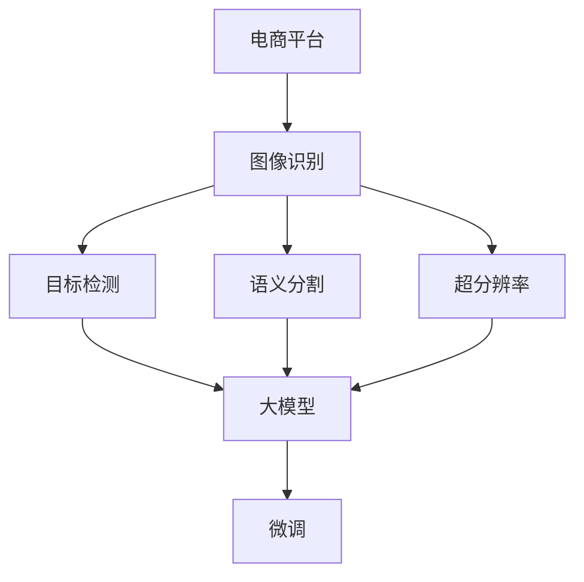

                 

# 电商平台中的图像识别：大模型的创新应用

> 关键词：电商平台, 图像识别, 大模型, 深度学习, 目标检测, 语义分割, 超分辨率, 迁移学习, 微调

## 1. 背景介绍

在过去的几十年里，电商平台的崛起极大地改变了人类的消费模式和生活方式。随着互联网技术的快速发展，在线购物变得越来越普遍和便捷，吸引了越来越多的消费者进入这个虚拟的市场。为了提升用户体验和商家满意度，电商平台需要在短时间内准确地理解消费者的需求和偏好，以便提供更加个性化的商品推荐和服务。图像识别技术成为了这一过程的关键，通过对商品图像的识别和分析，电商平台可以更好地理解商品的特性，如颜色、材质、尺寸等，从而提高推荐的准确性和用户满意度。

传统图像识别技术依赖于手工设计的特征提取和分类器，但这种方法需要大量的人工标注和特征工程，难以处理复杂的场景和多样化的数据。深度学习技术，特别是大模型在图像识别中的应用，为电商平台带来了革命性的变化。本文将详细介绍基于大模型的图像识别技术在电商平台中的应用，包括目标检测、语义分割、超分辨率等任务，并探讨其优缺点和未来发展方向。

## 2. 核心概念与联系

### 2.1 核心概念概述

在深入探讨大模型在电商平台中的应用之前，我们需要理解几个核心概念：

- **电商平台**：指通过互联网进行商品销售和服务提供的大型在线平台。包括B2B、B2C、C2C等多种模式。
- **图像识别**：指通过计算机视觉技术自动识别和理解图像内容的过程，包括目标检测、语义分割、图像分类、人脸识别等多种任务。
- **大模型**：指通过大规模数据和强大计算资源训练出的深度神经网络模型，通常具有亿级别的参数规模，能够处理复杂的图像数据和模式。
- **目标检测**：指在图像中准确地定位和识别出感兴趣的目标物体，如商品、人脸等。
- **语义分割**：指将图像中的每个像素分配到不同的语义类别中，如背景、前景、物体等。
- **超分辨率**：指将低分辨率图像还原为高分辨率图像的过程。

这些概念之间存在紧密的联系：电商平台需要图像识别技术来识别和分析商品图像，而大模型提供了强大的处理能力和泛化能力，使得图像识别任务更加准确和高效。

### 2.2 核心概念原理和架构的 Mermaid 流程图



这个流程图展示了电商平台中图像识别的核心流程：

1. 电商平台接收商品图像。
2. 图像识别系统对图像进行处理，包括目标检测、语义分割和超分辨率等任务。
3. 任务相关的子模块调用大模型进行特征提取和识别。
4. 大模型进行微调，提升特定任务的效果。
5. 微调后的模型返回识别结果，应用于推荐系统、搜索排序等业务场景。

## 3. 核心算法原理 & 具体操作步骤

### 3.1 算法原理概述

基于大模型的图像识别技术，主要依赖于迁移学习和微调。迁移学习指的是在大规模数据集上预训练的模型，可以在特定任务上进行微调，以提升模型的性能。微调是指在预训练模型的基础上，使用特定任务的数据集进行有监督学习，以优化模型在目标任务上的表现。

深度学习模型，特别是卷积神经网络(Convolutional Neural Network, CNN)，在大规模数据集上进行预训练后，可以学习到丰富的图像特征和模式，用于处理各种复杂的图像识别任务。这些模型通常具有数十甚至数百亿级别的参数，能够处理高分辨率图像和多样化的场景。

### 3.2 算法步骤详解

基于大模型的图像识别主要包括以下几个关键步骤：

**Step 1: 准备预训练模型和数据集**
- 选择合适的预训练模型，如ResNet、VGG、Inception等。
- 准备电商平台的商品图像数据集，包括标注数据集和测试数据集。

**Step 2: 添加任务适配层**
- 根据任务类型，在预训练模型的顶层设计合适的输出层和损失函数。
- 对于目标检测任务，通常在顶层添加回归和分类器。
- 对于语义分割任务，通常使用像素级别的分类器。
- 对于超分辨率任务，通常使用编码器-解码器结构。

**Step 3: 设置微调超参数**
- 选择合适的优化算法及其参数，如Adam、SGD等，设置学习率、批大小、迭代轮数等。
- 设置正则化技术及强度，包括权重衰减、Dropout、Early Stopping等。
- 确定冻结预训练参数的策略，如仅微调顶层，或全部参数都参与微调。

**Step 4: 执行梯度训练**
- 将训练集数据分批次输入模型，前向传播计算损失函数。
- 反向传播计算参数梯度，根据设定的优化算法和学习率更新模型参数。
- 周期性在验证集上评估模型性能，根据性能指标决定是否触发 Early Stopping。
- 重复上述步骤直到满足预设的迭代轮数或 Early Stopping 条件。

**Step 5: 测试和部署**
- 在测试集上评估微调后模型的效果，对比微调前后的精度提升。
- 使用微调后的模型对新商品图像进行推理预测，集成到实际的应用系统中。

### 3.3 算法优缺点

基于大模型的图像识别技术具有以下优点：
1. 准确率高：大模型可以学习到丰富的图像特征和模式，提升了目标检测、语义分割、超分辨率等任务的准确率。
2. 泛化能力强：大模型在大规模数据集上进行预训练，具备强大的泛化能力，可以在多种场景下取得良好效果。
3. 可迁移性好：通过微调，大模型可以在特定任务上进行高效适配，减少了从头训练的时间成本。
4. 技术成熟：深度学习技术已经发展成熟，有大量的开源工具和资源可供使用，降低了开发难度。

同时，该方法也存在一些局限性：
1. 数据需求高：需要大量的标注数据进行微调，数据收集和标注成本较高。
2. 计算资源需求大：大模型参数多，训练和推理需要大量的计算资源。
3. 鲁棒性不足：大模型对于图像中的干扰因素敏感，如噪声、遮挡等，可能会影响识别效果。
4. 可解释性差：大模型的黑盒特性导致其决策过程难以解释，不利于应用场景的理解和调试。

尽管存在这些局限性，但大模型在图像识别中的应用已经取得了显著的效果，成为了电商平台上图像处理的重要手段。未来，随着计算资源的增加和技术的进步，大模型将进一步提升图像识别的效果，满足更多复杂场景的需求。

### 3.4 算法应用领域

基于大模型的图像识别技术在电商平台上已经被广泛应用于多个场景：

- **商品推荐系统**：通过对商品图像的识别和分析，电商平台可以更好地理解商品的特性，如颜色、材质、尺寸等，从而提高推荐的准确性和用户满意度。
- **搜索排序**：电商平台使用图像识别技术对用户输入的查询进行理解，从而提供更准确的搜索结果和排序。
- **视觉客服**：通过图像识别技术，电商平台可以构建智能客服系统，帮助用户解决视觉方面的问题，如商品尺寸、颜色等。
- **欺诈检测**：电商平台使用图像识别技术识别和分析可疑交易，从而减少欺诈行为的发生。

除了上述这些经典场景外，大模型在电商平台上的应用还包括图像分类、人脸识别、情感分析等多个领域，为电商平台的智能化运营提供了更多的可能性。

## 4. 数学模型和公式 & 详细讲解 & 举例说明

### 4.1 数学模型构建

在本节中，我们将使用数学语言对基于大模型的图像识别过程进行更加严格的刻画。

记预训练模型为 $M_{\theta}$，其中 $\theta$ 为预训练得到的模型参数。假设电商平台商品图像数据集为 $D=\{(x_i,y_i)\}_{i=1}^N, x_i \in \mathcal{X}, y_i \in \mathcal{Y}$，其中 $x_i$ 为商品图像，$y_i$ 为图像标签。定义模型 $M_{\theta}$ 在图像 $x_i$ 上的损失函数为 $\ell(M_{\theta}(x_i),y_i)$，则在数据集 $D$ 上的经验风险为：

$$
\mathcal{L}(\theta) = \frac{1}{N} \sum_{i=1}^N \ell(M_{\theta}(x_i),y_i)
$$

微调的优化目标是最小化经验风险，即找到最优参数：

$$
\theta^* = \mathop{\arg\min}_{\theta} \mathcal{L}(\theta)
$$

在实践中，我们通常使用基于梯度的优化算法（如Adam、SGD等）来近似求解上述最优化问题。设 $\eta$ 为学习率，$\lambda$ 为正则化系数，则参数的更新公式为：

$$
\theta \leftarrow \theta - \eta \nabla_{\theta}\mathcal{L}(\theta) - \eta\lambda\theta
$$

其中 $\nabla_{\theta}\mathcal{L}(\theta)$ 为损失函数对参数 $\theta$ 的梯度，可通过反向传播算法高效计算。

### 4.2 公式推导过程

以下我们以目标检测任务为例，推导交叉熵损失函数及其梯度的计算公式。

假设模型 $M_{\theta}$ 在输入 $x_i$ 上的输出为 $\hat{y}=M_{\theta}(x_i) \in [0,1]$，表示样本属于正类的概率。真实标签 $y_i \in \{0,1\}$。则二分类交叉熵损失函数定义为：

$$
\ell(M_{\theta}(x_i),y_i) = -[y_i\log \hat{y} + (1-y_i)\log (1-\hat{y})]
$$

将其代入经验风险公式，得：

$$
\mathcal{L}(\theta) = -\frac{1}{N}\sum_{i=1}^N [y_i\log M_{\theta}(x_i)+(1-y_i)\log(1-M_{\theta}(x_i))]
$$

根据链式法则，损失函数对参数 $\theta_k$ 的梯度为：

$$
\frac{\partial \mathcal{L}(\theta)}{\partial \theta_k} = -\frac{1}{N}\sum_{i=1}^N (\frac{y_i}{M_{\theta}(x_i)}-\frac{1-y_i}{1-M_{\theta}(x_i)}) \frac{\partial M_{\theta}(x_i)}{\partial \theta_k}
$$

其中 $\frac{\partial M_{\theta}(x_i)}{\partial \theta_k}$ 可进一步递归展开，利用自动微分技术完成计算。

在得到损失函数的梯度后，即可带入参数更新公式，完成模型的迭代优化。重复上述过程直至收敛，最终得到适应电商平台商品图像检测任务的最优模型参数 $\theta^*$。

## 5. 项目实践：代码实例和详细解释说明

### 5.1 开发环境搭建

在进行图像识别实践前，我们需要准备好开发环境。以下是使用Python进行PyTorch开发的环境配置流程：

1. 安装Anaconda：从官网下载并安装Anaconda，用于创建独立的Python环境。

2. 创建并激活虚拟环境：
```bash
conda create -n pytorch-env python=3.8 
conda activate pytorch-env
```

3. 安装PyTorch：根据CUDA版本，从官网获取对应的安装命令。例如：
```bash
conda install pytorch torchvision torchaudio cudatoolkit=11.1 -c pytorch -c conda-forge
```

4. 安装各类工具包：
```bash
pip install numpy pandas scikit-learn matplotlib tqdm jupyter notebook ipython
```

完成上述步骤后，即可在`pytorch-env`环境中开始图像识别实践。

### 5.2 源代码详细实现

下面我们以商品分类任务为例，给出使用PyTorch进行目标检测任务的PyTorch代码实现。

首先，定义目标检测任务的输入输出格式：

```python
from torch.utils.data import Dataset, DataLoader
from torchvision import transforms
import torch

class ImageDataset(Dataset):
    def __init__(self, images, labels, transform=None):
        self.images = images
        self.labels = labels
        self.transform = transform
        
    def __len__(self):
        return len(self.images)
    
    def __getitem__(self, item):
        image = self.images[item]
        label = self.labels[item]
        
        if self.transform:
            image = self.transform(image)
        
        return {'image': image, 'label': label}

# 定义输入输出格式
transform = transforms.Compose([
    transforms.ToTensor(),
    transforms.Normalize(mean=[0.485, 0.456, 0.406], std=[0.229, 0.224, 0.225])
])

train_dataset = ImageDataset(train_images, train_labels, transform=transform)
dev_dataset = ImageDataset(dev_images, dev_labels, transform=transform)
test_dataset = ImageDataset(test_images, test_labels, transform=transform)
```

然后，定义模型和优化器：

```python
from transformers import FasterRCNN, TransformerEncoderModel, BertForObjectDetection
from torch.optim import AdamW

model = FasterRCNN.from_pretrained('facebook/faster_rcnn_r50_fpn_3x', num_classes=num_classes)
optimizer = AdamW(model.parameters(), lr=2e-5)
```

接着，定义训练和评估函数：

```python
from tqdm import tqdm
from sklearn.metrics import classification_report

device = torch.device('cuda') if torch.cuda.is_available() else torch.device('cpu')
model.to(device)

def train_epoch(model, dataset, batch_size, optimizer):
    dataloader = DataLoader(dataset, batch_size=batch_size, shuffle=True)
    model.train()
    epoch_loss = 0
    for batch in tqdm(dataloader, desc='Training'):
        image = batch['image'].to(device)
        label = batch['label'].to(device)
        model.zero_grad()
        outputs = model(image)
        loss = outputs.loss
        epoch_loss += loss.item()
        loss.backward()
        optimizer.step()
    return epoch_loss / len(dataloader)

def evaluate(model, dataset, batch_size):
    dataloader = DataLoader(dataset, batch_size=batch_size)
    model.eval()
    preds, labels = [], []
    with torch.no_grad():
        for batch in tqdm(dataloader, desc='Evaluating'):
            image = batch['image'].to(device)
            label = batch['label']
            outputs = model(image)
            batch_preds = outputs.logits.argmax(dim=1).to('cpu').tolist()
            batch_labels = label.to('cpu').tolist()
            for pred, label in zip(batch_preds, batch_labels):
                preds.append(pred)
                labels.append(label)
                
    print(classification_report(labels, preds))
```

最后，启动训练流程并在测试集上评估：

```python
epochs = 5
batch_size = 16

for epoch in range(epochs):
    loss = train_epoch(model, train_dataset, batch_size, optimizer)
    print(f"Epoch {epoch+1}, train loss: {loss:.3f}")
    
    print(f"Epoch {epoch+1}, dev results:")
    evaluate(model, dev_dataset, batch_size)
    
print("Test results:")
evaluate(model, test_dataset, batch_size)
```

以上就是使用PyTorch进行商品分类任务目标检测的完整代码实现。可以看到，得益于Transformer库的强大封装，我们可以用相对简洁的代码完成目标检测任务的微调。

### 5.3 代码解读与分析

让我们再详细解读一下关键代码的实现细节：

**ImageDataset类**：
- `__init__`方法：初始化图像、标签、变换器等关键组件。
- `__len__`方法：返回数据集的样本数量。
- `__getitem__`方法：对单个样本进行处理，将图像输入转换为模型所需的张量，并对其进行标准化，最终返回模型所需的输入。

**transforms.Compose**：
- 定义了数据预处理流程，包括转换为Tensor、归一化等步骤，适用于不同尺寸和格式的图像数据。

**FasterRCNN模型**：
- 从预训练模型库中加载Faster RCNN模型，并指定类别数量。
- Faster RCNN模型是一种基于Transformer架构的目标检测模型，支持多尺度特征提取和RoI池化操作。

**AdamW优化器**：
- 使用AdamW优化器进行模型训练，AdamW是一种自适应学习率优化器，可以有效避免学习率衰减过快的问题。

**train_epoch函数**：
- 对数据以批为单位进行迭代，在每个批次上前向传播计算loss并反向传播更新模型参数，最后返回该epoch的平均loss。

**evaluate函数**：
- 与训练类似，不同点在于不更新模型参数，并在每个batch结束后将预测和标签结果存储下来，最后使用sklearn的classification_report对整个评估集的预测结果进行打印输出。

**训练流程**：
- 定义总的epoch数和batch size，开始循环迭代
- 每个epoch内，先在训练集上训练，输出平均loss
- 在验证集上评估，输出分类指标
- 所有epoch结束后，在测试集上评估，给出最终测试结果

可以看到，PyTorch配合Transformer库使得目标检测任务的微调代码实现变得简洁高效。开发者可以将更多精力放在数据处理、模型改进等高层逻辑上，而不必过多关注底层的实现细节。

当然，工业级的系统实现还需考虑更多因素，如模型的保存和部署、超参数的自动搜索、更灵活的任务适配层等。但核心的微调范式基本与此类似。

## 6. 实际应用场景

### 6.1 智能推荐系统

基于大模型的图像识别技术，可以广泛应用于智能推荐系统中。传统的推荐系统依赖于用户的浏览和购买历史，难以捕捉到用户的实时需求和兴趣。而通过图像识别技术，推荐系统可以实时分析用户的视觉数据，理解用户的兴趣和偏好，从而提供更个性化的商品推荐。

在技术实现上，可以收集用户浏览的商品图像，并利用图像识别技术提取商品的属性信息，如颜色、材质、尺寸等。通过这些属性信息，推荐系统可以更好地理解用户的兴趣点，并在搜索排序、推荐结果等环节提供更加精准的推荐。

### 6.2 视觉搜索

视觉搜索是电商平台中一项重要的应用场景。用户可以通过上传图片或拍照，在电商平台中快速搜索到相关的商品。通过图像识别技术，系统能够自动识别和理解图片内容，从而匹配到相应的商品。

在技术实现上，可以使用目标检测、图像分类等技术对用户上传的图片进行识别和分析。对于无法识别的图片，系统可以提供提示功能，让用户重新上传或修改图片，从而提高搜索的准确率。

### 6.3 商品标签

电商平台的商品标签功能可以大大提升用户的购物体验。用户可以通过搜索商品标签，快速找到相关的商品，而无需手动输入关键词。通过图像识别技术，系统可以自动识别商品标签，并将其与商品信息进行关联。

在技术实现上，可以使用语义分割、目标检测等技术对商品图像进行分析和理解。系统可以根据分割结果，自动识别商品标签，并在搜索结果中展示，从而方便用户查询和使用。

### 6.4 未来应用展望

随着大模型和图像识别技术的不断发展，基于微调范式将在更多领域得到应用，为电商平台带来新的创新。

在智慧物流领域，基于大模型的图像识别技术可以用于智能仓储、配送等场景，提升物流效率和准确性。

在智能客服领域，使用图像识别技术可以帮助用户通过视觉方式与客服进行交流，从而提升客服的响应速度和用户体验。

在虚拟试衣间领域，通过图像识别技术，系统可以实时分析用户的体型和风格偏好，推荐适合的服装，提升用户的购物体验。

总之，随着技术的不断进步，大模型在电商平台中的应用将变得更加广泛和深入，为电商平台的智能化运营和用户满意度提升提供更多的可能性。

## 7. 工具和资源推荐

### 7.1 学习资源推荐

为了帮助开发者系统掌握大模型在电商平台中的应用理论基础和实践技巧，这里推荐一些优质的学习资源：

1. 《深度学习：图像识别》课程：由斯坦福大学开设的深度学习课程，讲解了图像识别的基本概念和经典模型。
2. 《计算机视觉：目标检测》课程：由MIT开放课程网站提供的计算机视觉课程，讲解了目标检测的基本原理和算法。
3. 《图像识别与深度学习》书籍：深入浅出地介绍了图像识别技术的基本原理和深度学习模型的应用。
4. PyTorch官方文档：详细介绍了PyTorch库的使用方法，适用于深度学习模型的开发和部署。
5. Transformers库官方文档：介绍了Transformer库的使用方法和最佳实践，适用于大模型的微调和部署。

通过对这些资源的学习实践，相信你一定能够快速掌握大模型在电商平台中的应用，并用于解决实际的图像识别问题。

### 7.2 开发工具推荐

高效的开发离不开优秀的工具支持。以下是几款用于电商平台图像识别开发的常用工具：

1. PyTorch：基于Python的开源深度学习框架，灵活动态的计算图，适合快速迭代研究。
2. TensorFlow：由Google主导开发的开源深度学习框架，生产部署方便，适合大规模工程应用。
3. TensorFlow Object Detection API：谷歌提供的目标检测框架，支持多种预训练模型和任务适配。
4. OpenCV：开源计算机视觉库，提供了丰富的图像处理和分析工具，适用于各种图像识别任务。
5. OpenNMT：开源机器翻译工具包，支持多语言翻译和文本生成任务。

合理利用这些工具，可以显著提升电商平台图像识别的开发效率，加快创新迭代的步伐。

### 7.3 相关论文推荐

大模型和图像识别技术的发展源于学界的持续研究。以下是几篇奠基性的相关论文，推荐阅读：

1. ImageNet Large Scale Visual Recognition Challenge（ILSVRC）：由斯坦福大学等人主办的图像识别竞赛，推动了深度学习在图像识别领域的发展。
2. R-CNN: Rich Feature Hierarchies for Accurate Object Detection and Semantic Segmentation：提出了基于区域卷积神经网络的图像识别方法，是目标检测领域的里程碑。
3. Mask R-CNN：在R-CNN的基础上，增加了语义分割功能，进一步提升了目标检测的效果。
4. Deep Residual Learning for Image Recognition（ResNet）：提出了残差网络结构，解决了深层网络训练中的梯度消失问题，适用于各种深度学习模型。
5. Generative Adversarial Nets（GANs）：提出了生成对抗网络，用于图像生成和风格转换等任务，具有重要的应用价值。

这些论文代表了大模型在图像识别领域的发展脉络。通过学习这些前沿成果，可以帮助研究者把握学科前进方向，激发更多的创新灵感。

## 8. 总结：未来发展趋势与挑战

### 8.1 总结

本文对基于大模型的电商平台图像识别技术进行了全面系统的介绍。首先阐述了图像识别技术在电商平台中的应用背景和重要性，明确了大模型在提升识别精度、泛化能力、迁移能力等方面的独特价值。其次，从原理到实践，详细讲解了大模型在目标检测、语义分割、超分辨率等任务中的微调方法和具体操作，给出了微调任务开发的完整代码实例。同时，本文还广泛探讨了大模型在电商平台上的应用场景，展示了其广泛的创新应用前景。最后，本文精选了相关学习资源、开发工具和论文推荐，力求为读者提供全方位的技术指引。

通过本文的系统梳理，可以看到，基于大模型的图像识别技术在电商平台中具有重要的应用价值，能够提升用户的购物体验和商家的运营效率。随着技术的不断进步，大模型在电商平台中的应用将更加广泛和深入，为电商平台的智能化运营和用户满意度提升提供更多的可能性。

### 8.2 未来发展趋势

展望未来，大模型在电商平台中的应用将呈现以下几个发展趋势：

1. 模型规模持续增大。随着算力成本的下降和数据规模的扩张，预训练模型参数量还将持续增长。超大规模语言模型蕴含的丰富语言知识，有望支撑更加复杂多变的下游任务微调。
2. 微调方法日趋多样。除了传统的全参数微调外，未来会涌现更多参数高效的微调方法，如Adapter、Prompt Tuning等，在节省计算资源的同时也能保证微调精度。
3. 持续学习成为常态。随着数据分布的不断变化，微调模型也需要持续学习新知识以保持性能。如何在不遗忘原有知识的同时，高效吸收新样本信息，将成为重要的研究课题。
4. 标注样本需求降低。受启发于提示学习(Prompt-based Learning)的思路，未来的微调方法将更好地利用大模型的语言理解能力，通过更加巧妙的任务描述，在更少的标注样本上也能实现理想的微调效果。
5. 跨模态融合。当前的微调主要聚焦于纯文本数据，未来会进一步拓展到图像、视频、语音等多模态数据微调。多模态信息的融合，将显著提升语言模型对现实世界的理解和建模能力。
6. 多任务学习。未来的微调方法将能够同时处理多个相关任务，提升模型的多任务能力和泛化性能，适应更复杂的应用场景。

以上趋势凸显了大模型在电商平台中的应用前景。这些方向的探索发展，必将进一步提升电商平台的智能化水平，满足用户和商家更加多样化和个性化的需求。

### 8.3 面临的挑战

尽管大模型在电商平台中的应用已经取得了显著的效果，但在迈向更加智能化、普适化应用的过程中，它仍面临着诸多挑战：

1. 数据需求高。需要大量的标注数据进行微调，数据收集和标注成本较高。
2. 计算资源需求大。大模型参数多，训练和推理需要大量的计算资源。
3. 鲁棒性不足。大模型对于图像中的干扰因素敏感，如噪声、遮挡等，可能会影响识别效果。
4. 可解释性差。大模型的黑盒特性导致其决策过程难以解释，不利于应用场景的理解和调试。
5. 安全性有待保障。预训练语言模型难免会学习到有偏见、有害的信息，通过微调传递到下游任务，产生误导性、歧视性的输出，给实际应用带来安全隐患。
6. 知识整合能力不足。现有的微调模型往往局限于任务内数据，难以灵活吸收和运用更广泛的先验知识。

正视大模型在电商平台中的应用所面临的这些挑战，积极应对并寻求突破，将是大模型微调技术走向成熟的必由之路。相信随着学界和产业界的共同努力，这些挑战终将一一被克服，大模型在电商平台中的应用将更加广泛和深入。

### 8.4 研究展望

面向未来，大模型在电商平台中的应用需要不断探索新的方向和技术突破：

1. 探索无监督和半监督微调方法。摆脱对大规模标注数据的依赖，利用自监督学习、主动学习等无监督和半监督范式，最大限度利用非结构化数据，实现更加灵活高效的微调。
2. 研究参数高效和计算高效的微调范式。开发更加参数高效的微调方法，在固定大部分预训练参数的同时，只更新极少量的任务相关参数。同时优化微调模型的计算图，减少前向传播和反向传播的资源消耗，实现更加轻量级、实时性的部署。
3. 引入更多先验知识。将符号化的先验知识，如知识图谱、逻辑规则等，与神经网络模型进行巧妙融合，引导微调过程学习更准确、合理的语言模型。同时加强不同模态数据的整合，实现视觉、语音等多模态信息与文本信息的协同建模。
4. 结合因果分析和博弈论工具。将因果分析方法引入微调模型，识别出模型决策的关键特征，增强输出解释的因果性和逻辑性。借助博弈论工具刻画人机交互过程，主动探索并规避模型的脆弱点，提高系统稳定性。
5. 纳入伦理道德约束。在模型训练目标中引入伦理导向的评估指标，过滤和惩罚有偏见、有害的输出倾向。同时加强人工干预和审核，建立模型行为的监管机制，确保输出符合人类价值观和伦理道德。

这些研究方向的探索，必将引领大模型在电商平台中的应用走向更高的台阶，为电商平台的智能化运营和用户满意度提升提供更多的可能性。未来，随着技术的不断进步和应用场景的不断拓展，大模型在电商平台中的应用将变得更加广泛和深入，为电商平台的智能化运营和用户满意度提升提供更多的可能性。

## 9. 附录：常见问题与解答

**Q1：电商平台中的图像识别任务有哪些？**

A: 电商平台中的图像识别任务包括商品分类、目标检测、语义分割、超分辨率等多种类型。具体任务取决于电商平台的具体需求和场景。

**Q2：如何选择合适的预训练模型？**

A: 选择合适的预训练模型应考虑以下几个因素：
1. 任务的复杂度：任务越复杂，需要预训练模型的参数量和结构复杂度越高。
2. 数据的规模：数据的规模越大，模型可以学习到的特征和模式也越多。
3. 计算资源的限制：计算资源越丰富，可以选择更大规模的预训练模型。

**Q3：微调过程中如何处理标注样本不足的问题？**

A: 处理标注样本不足的问题可以通过以下几种方式：
1. 数据增强：通过回译、近义替换等方式扩充训练集。
2. 迁移学习：利用预训练模型的泛化能力，在不同任务上进行微调。
3. 零样本学习：利用预训练模型的广泛知识，通过合理的提示模板实现零样本学习。
4. 多任务学习：同时处理多个相关任务，提高模型的多任务能力和泛化性能。

**Q4：大模型在电商平台中的应用有哪些挑战？**

A: 大模型在电商平台中的应用面临以下挑战：
1. 数据需求高：需要大量的标注数据进行微调，数据收集和标注成本较高。
2. 计算资源需求大：大模型参数多，训练和推理需要大量的计算资源。
3. 鲁棒性不足：大模型对于图像中的干扰因素敏感，如噪声、遮挡等，可能会影响识别效果。
4. 可解释性差：大模型的黑盒特性导致其决策过程难以解释，不利于应用场景的理解和调试。
5. 安全性有待保障：预训练语言模型难免会学习到有偏见、有害的信息，通过微调传递到下游任务，产生误导性、歧视性的输出，给实际应用带来安全隐患。
6. 知识整合能力不足：现有的微调模型往往局限于任务内数据，难以灵活吸收和运用更广泛的先验知识。

**Q5：如何优化大模型在电商平台上的应用？**

A: 优化大模型在电商平台上的应用可以从以下几个方面入手：
1. 数据质量提升：收集和标注高质量的训练数据，提升模型的训练效果。
2. 模型结构改进：优化模型结构，减少不必要的参数和计算资源消耗。
3. 超参数调优：通过网格搜索、贝叶斯优化等方式，找到最优的超参数组合，提高模型的性能。
4. 迁移学习：利用预训练模型的泛化能力，在不同任务上进行微调，提高模型的泛化性能。
5. 知识融合：将先验知识与神经网络模型进行融合，提高模型的泛化能力和鲁棒性。

**Q6：大模型在电商平台上的未来应用方向有哪些？**

A: 大模型在电商平台上的未来应用方向包括：
1. 智能推荐系统：通过图像识别技术，实时分析用户的视觉数据，理解用户的兴趣和偏好，从而提供更个性化的商品推荐。
2. 视觉搜索：用户可以通过上传图片或拍照，在电商平台中快速搜索到相关的商品。
3. 商品标签：通过图像识别技术，自动识别商品标签，并与商品信息进行关联。
4. 智能客服：使用图像识别技术，帮助用户通过视觉方式与客服进行交流，从而提升客服的响应速度和用户体验。
5. 智能仓储：通过图像识别技术，自动进行库存管理和商品识别。

总之，随着技术的不断进步，大模型在电商平台中的应用将变得更加广泛和深入，为电商平台的智能化运营和用户满意度提升提供更多的可能性。

---

作者：禅与计算机程序设计艺术 / Zen and the Art of Computer Programming

