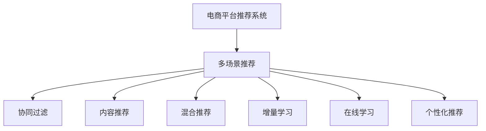

                 

# 电商平台中的多场景推荐策略融合

## 1. 背景介绍

随着互联网电商的飞速发展，平台之间的竞争日益激烈。如何在海量商品中找到用户真正感兴趣的，并促成交易，是各大电商平台面临的共同挑战。传统的推荐系统主要基于协同过滤、内容推荐、混合推荐等基本算法，虽然能一定程度上提升用户购物体验，但难以应对电商多变的环境和需求。而融合多场景推荐策略，可以有效提升推荐系统的效果，成为电商平台提升用户体验的重要途径。

## 2. 核心概念与联系

### 2.1 核心概念概述

为更好地理解电商平台中多场景推荐策略的融合，本节将介绍几个密切相关的核心概念：

- 电商平台推荐系统：利用用户行为数据、商品信息、社交网络等数据，推荐用户可能感兴趣的电商商品，以提高平台转化率和用户满意度。
- 多场景推荐：根据用户在不同场景下的行为和需求，提供多模态的推荐结果，包括商品推荐、个性化广告、商品比价、搜索推荐等。
- 协同过滤(Collaborative Filtering, CF)：通过分析用户行为相似度，推荐用户可能喜欢的商品。
- 内容推荐(Content-Based Filtering, CB)：根据商品属性、用户属性等，推荐用户可能感兴趣的相似商品。
- 混合推荐(Mixed Recommendation)：将CF和CB方法结合，利用两者的优势，提升推荐效果。
- 增量学习(Incremental Learning)：新商品上线时，利用历史用户行为数据，快速学习新商品的推荐分数，避免高延迟。
- 在线学习(Online Learning)：实时更新推荐模型，快速响应用户行为变化，提升推荐实效性。
- 个性化推荐系统(Individualized Recommendation System)：根据用户的历史行为和偏好，提供个性化的推荐内容。

这些核心概念之间的逻辑关系可以通过以下Mermaid流程图来展示：



这个流程图展示了这个核心概念的关系：

1. 电商平台推荐系统作为多场景推荐的基础，集成了协同过滤、内容推荐等多种推荐方法。
2. 多场景推荐则提供多种推荐服务，包括商品推荐、个性化广告、比价搜索等。
3. 协同过滤、内容推荐、混合推荐是推荐系统的基本算法，分别用于不同场景下的推荐。
4. 增量学习和在线学习用于提升模型快速响应用户行为的能力，避免高延迟。
5. 个性化推荐进一步提升推荐系统的效果，根据用户特定需求推荐商品。

## 3. 核心算法原理 & 具体操作步骤
### 3.1 算法原理概述

电商平台的推荐系统通常融合多种推荐策略，以提供更全面、精细的推荐服务。其核心思想是：利用用户历史行为、商品属性、社交网络等多模态数据，构建多种推荐模型，并根据不同场景需求，动态调用这些模型，生成最符合用户需求的推荐结果。

形式化地，假设推荐系统推荐商品 $i$ 给用户 $u$，模型参数为 $\theta$。在电商场景中，推荐系统可以通过协同过滤、内容推荐、混合推荐等多种算法，获取关于用户 $u$ 和商品 $i$ 的评分 $r_{ui}$。根据评分构建推荐模型，即：

$$
r_{ui} = f_{\theta}(u,i) = g_{\theta}(c(u,i)) = h_{\theta}(c(u),r_{ui}(u))
$$

其中 $c(u,i)$ 为用户 $u$ 对商品 $i$ 的评分，$f_{\theta}(u,i)$ 为协同过滤模型，$g_{\theta}(c(u,i))$ 为内容推荐模型，$h_{\theta}(c(u),r_{ui}(u))$ 为混合推荐模型。在实际应用中，常采用线性模型、神经网络等形式表示推荐函数。

### 3.2 算法步骤详解

电商平台的推荐系统融合多场景推荐策略，通常包括以下几个关键步骤：

**Step 1: 数据准备**
- 收集电商平台的各类数据，包括用户行为数据、商品信息、社交网络数据等。
- 进行数据预处理，包括数据清洗、数据归一化、特征选择等。
- 划分为训练集、验证集和测试集，用于模型的训练、评估和测试。

**Step 2: 选择推荐算法**
- 根据不同场景需求，选择合适的推荐算法。
- 如协同过滤算法包括基于用户的CF和基于物品的CF；内容推荐算法包括基于内容的CB和基于知识图的CB等。

**Step 3: 构建推荐模型**
- 将用户行为数据、商品属性、社交网络等数据，通过特征工程，转化为适合模型的特征向量。
- 利用机器学习或深度学习模型，训练推荐模型。
- 选择模型参数进行调优，提升模型的拟合效果。

**Step 4: 集成推荐结果**
- 根据用户行为和需求，动态调用多个推荐算法，生成多模态的推荐结果。
- 结合实时在线学习，实时更新推荐模型，以适应用户行为变化。
- 利用增量学习，快速学习新商品评分，提升推荐模型响应速度。

**Step 5: 测试和部署**
- 在测试集上评估推荐系统的性能，比较不同算法和模型组合的效果。
- 根据测试结果，调整推荐策略和模型参数。
- 将推荐系统集成到电商平台上，实现实时推荐服务。

以上是电商平台多场景推荐策略融合的一般流程。在实际应用中，还需要针对具体电商场景的特点，对推荐过程的各个环节进行优化设计，如改进特征工程、优化推荐算法、设计实时更新机制等，以进一步提升推荐系统的效果。

### 3.3 算法优缺点

融合多场景推荐策略的电商平台推荐系统具有以下优点：

1. 综合多种推荐方法，弥补单一算法的缺陷，提升推荐效果。
2. 利用多模态数据，包括行为、属性、社交等，更全面地理解用户需求和商品特征。
3. 实时更新推荐模型，快速响应用户行为变化，提升推荐的时效性。
4. 快速学习新商品评分，缩短商品上线后的推荐延迟。

但该方法也存在一定的局限性：

1. 多算法融合带来模型复杂度增加，需要更多的计算资源和时间。
2. 需要设计合理的数据流和控制策略，确保多模态数据的一致性和稳定性。
3. 实时更新模型和处理大量用户行为数据，对系统性能和稳定性的要求更高。
4. 算法调优和参数选择较为复杂，需要较强的数据科学和算法工程能力。

尽管存在这些局限性，但就目前而言，多场景推荐融合技术在电商领域已经得到了广泛的应用，成为提升推荐系统性能的重要手段。未来相关研究的方向在于如何进一步降低多模态数据融合的复杂度，提高推荐系统的实时性和泛化能力，同时兼顾算法复杂性和可解释性等因素。

### 3.4 算法应用领域

基于电商平台的推荐系统融合多场景推荐策略，已经在电商推荐、个性化广告、比价搜索等众多领域得到应用，为电商平台带来了显著的业务价值：

1. 商品推荐：根据用户历史行为、兴趣偏好，推荐可能感兴趣的电商商品，提升点击率和转化率。
2. 个性化广告：利用用户属性和行为，精准推送相关广告，提高广告点击率和转化率。
3. 商品比价：展示不同电商平台的商品价格信息，帮助用户找到最优惠的购买渠道，提升用户满意度。
4. 搜索推荐：在用户搜索时，实时推荐相关商品，提升搜索体验，提升用户满意度。

除了上述这些经典应用外，多场景推荐融合技术还创新性地应用于智能客服、库存管理、物流配送等场景，为电商平台带来了更多的创新应用。随着电商市场的进一步发展，相信基于多场景推荐融合技术的应用场景将更加广泛，为电商平台的数字化转型注入新的动力。

## 4. 数学模型和公式 & 详细讲解
### 4.1 数学模型构建

本节将使用数学语言对电商平台多场景推荐策略融合过程进行更加严格的刻画。

假设电商平台推荐系统推荐商品 $i$ 给用户 $u$，推荐模型参数为 $\theta$。在电商场景中，推荐系统可以通过协同过滤、内容推荐、混合推荐等多种算法，获取关于用户 $u$ 和商品 $i$ 的评分 $r_{ui}$。根据评分构建推荐模型，即：

$$
r_{ui} = f_{\theta}(u,i) = g_{\theta}(c(u,i)) = h_{\theta}(c(u),r_{ui}(u))
$$

其中 $c(u,i)$ 为用户 $u$ 对商品 $i$ 的评分，$f_{\theta}(u,i)$ 为协同过滤模型，$g_{\theta}(c(u,i))$ 为内容推荐模型，$h_{\theta}(c(u),r_{ui}(u))$ 为混合推荐模型。

### 4.2 公式推导过程

以下我们以协同过滤模型为例，推导协同过滤模型的评分函数及其梯度计算公式。

假设协同过滤模型基于用户 $u$ 的评分向量 $r$ 和商品 $i$ 的特征向量 $c$，则评分函数可以表示为：

$$
r_{ui} = r_u \cdot c_i
$$

其中 $r_u$ 为用户 $u$ 的评分向量，$c_i$ 为商品 $i$ 的特征向量，$\cdot$ 表示向量的点积运算。

进一步将 $r_u$ 表示为 $K$ 个特征的加权和，即：

$$
r_u = \sum_{k=1}^K \theta_{uk}x_{uk}
$$

其中 $\theta_{uk}$ 为用户的第 $k$ 个特征权重，$x_{uk}$ 为第 $k$ 个特征向量。

则协同过滤模型的评分函数可以写为：

$$
r_{ui} = \sum_{k=1}^K \theta_{uk}x_{uk} \cdot c_i
$$

根据上述公式，协同过滤模型的梯度计算公式为：

$$
\frac{\partial r_{ui}}{\partial \theta_{uk}} = x_{uk} \cdot c_i
$$

在实际应用中，协同过滤模型的评分函数通常使用矩阵乘法实现，梯度计算可以使用自动微分技术完成。

## 5. 项目实践：代码实例和详细解释说明
### 5.1 开发环境搭建

在进行电商平台推荐系统多场景融合开发前，我们需要准备好开发环境。以下是使用Python进行TensorFlow开发的环境配置流程：

1. 安装Anaconda：从官网下载并安装Anaconda，用于创建独立的Python环境。

2. 创建并激活虚拟环境：
```bash
conda create -n tf-env python=3.8 
conda activate tf-env
```

3. 安装TensorFlow：根据CUDA版本，从官网获取对应的安装命令。例如：
```bash
conda install tensorflow-gpu=2.7 -c conda-forge
```

4. 安装相关的依赖包：
```bash
pip install numpy pandas scikit-learn tensorflow-hub tensorflow-io tflite-python
```

5. 安装各种数据处理和可视化工具：
```bash
pip install beautifulsoup4 matplotlib seaborn jupyter notebook ipython
```

完成上述步骤后，即可在`tf-env`环境中开始多场景推荐系统开发。

### 5.2 源代码详细实现

下面我们以基于协同过滤和内容推荐的混合推荐系统为例，给出使用TensorFlow实现的多场景推荐系统的代码实现。

首先，定义协同过滤模型的评分函数：

```python
import tensorflow as tf
import numpy as np

def user_based_cf(r, u_index, user_weight):
    u_vec = r[user_index]
    user_weight = tf.gather(user_weight, u_index, axis=0)
    c_weight = tf.gather(c_weight, item_index, axis=0)
    return tf.reduce_sum(tf.multiply(u_vec, c_weight))
```

接着，定义内容推荐模型的评分函数：

```python
def content_based_recommendation(item, item_index, item_weight):
    item_vec = tf.gather(item_weight, item_index, axis=0)
    return tf.reduce_sum(tf.multiply(item_vec, item))
```

然后，定义混合推荐系统的评分函数：

```python
def mixed_recommendation(user_index, item_index, user_weight, item_weight, alpha=0.5):
    return alpha * user_based_cf(r, user_index, user_weight) + (1-alpha) * content_based_recommendation(item, item_index, item_weight)
```

最后，定义推荐系统的评分函数：

```python
def recommendation(user_index, item_index, user_weight, item_weight, alpha=0.5):
    return mixed_recommendation(user_index, item_index, user_weight, item_weight, alpha)
```

至此，一个简单的基于协同过滤和内容推荐的混合推荐系统构建完成。在实际应用中，需要根据具体电商平台的推荐需求，对模型进行进一步的优化和调整。

### 5.3 代码解读与分析

让我们再详细解读一下关键代码的实现细节：

**用户评分向量**：
- `user_based_cf`函数：利用协同过滤模型计算用户 $u$ 对商品 $i$ 的评分。

**商品评分向量**：
- `content_based_recommendation`函数：利用内容推荐模型计算商品 $i$ 的评分。

**混合推荐模型**：
- `mixed_recommendation`函数：将协同过滤和内容推荐模型的评分进行线性加权组合，得到最终的混合推荐评分。

**推荐评分**：
- `recommendation`函数：将用户行为、商品属性、权重等输入混合推荐模型，得到最终的推荐评分。

在实际应用中，需要根据具体电商平台的推荐需求，对模型进行进一步的优化和调整。同时，需要注意数据预处理、模型调优、实时更新等多个环节的优化。

## 6. 实际应用场景
### 6.1 智能客服系统

基于多场景推荐策略的电商平台推荐系统，可以广泛应用于智能客服系统的构建。传统客服往往需要配备大量人力，高峰期响应缓慢，且一致性和专业性难以保证。而使用推荐系统作为智能客服的辅助工具，可以实时推送相关商品信息，帮助客服快速响应客户咨询，提升客户满意度和响应效率。

在技术实现上，可以收集企业内部的客服对话记录，将用户历史行为数据作为推荐模型输入，实时推送相关商品信息。结合对话分析技术，实时调整推荐策略，提升推荐效果。同时，还可以集成自然语言处理技术，提高自然语言理解和生成能力，进一步优化推荐系统。

### 6.2 个性化广告

个性化广告是电商平台重要的收益来源之一。基于多场景推荐策略的广告系统，可以精准推送相关广告，提高广告点击率和转化率。通过分析用户行为和属性，生成个性化广告内容，满足用户个性化需求，提升广告效果。

在实际应用中，可以收集用户行为数据，包括浏览记录、点击记录、购买记录等，作为推荐模型输入。同时，可以结合用户属性和商品属性，生成多模态的广告内容。结合实时在线学习，快速更新广告内容，适应用户行为变化。

### 6.3 商品比价

在电商平台上，用户往往会对比不同商家的价格信息，寻找最优惠的购买渠道。基于多场景推荐策略的比价系统，可以实时展示不同商家的价格信息，帮助用户找到最优惠的购买渠道。

在技术实现上，可以收集用户浏览记录，包括不同商家的商品页面。将商品价格作为推荐模型输入，生成推荐结果。结合实时更新，快速展示最新价格信息，提升用户体验。

### 6.4 未来应用展望

随着电商平台的不断发展和技术的进步，基于多场景推荐策略的推荐系统将在更多领域得到应用，为电商平台的业务发展带来新的机遇：

1. 动态定价：基于用户行为和需求，实时调整商品价格，提升平台收益。
2. 库存管理：实时监控商品库存情况，自动生成补货计划，优化库存管理。
3. 物流配送：基于用户需求和位置信息，优化配送路线，提升配送效率。
4. 商品评测：收集用户对商品的评价，生成个性化推荐结果，提高用户满意度。

除了上述这些经典应用外，基于多场景推荐策略的技术还将创新性地应用于营销策划、用户行为分析、智能销售等场景，为电商平台的业务创新提供新的动力。相信随着推荐系统的不断进步，基于多场景推荐策略的电商平台推荐系统必将在电商平台的数字化转型中扮演越来越重要的角色。

## 7. 工具和资源推荐
### 7.1 学习资源推荐

为了帮助开发者系统掌握电商平台推荐系统的技术，这里推荐一些优质的学习资源：

1. 《推荐系统实战》：该书由推荐系统领域专家撰写，系统介绍了推荐系统原理、算法、技术栈等，适合初学者和进阶开发者。

2. 《深度学习与推荐系统》：该书由大数据领域的知名专家编写，深入浅出地介绍了推荐系统的深度学习实现方法。

3. Kaggle推荐系统竞赛：Kaggle平台上有多个推荐系统竞赛，通过实战项目了解推荐系统应用场景和算法实现。

4. Arxiv论文：推荐系统领域的顶级期刊，如SIGIR、IEEE TNS等，可以获取最新的研究进展和前沿技术。

5. TensorFlow官方文档：TensorFlow官方文档提供了丰富的推荐系统实现案例和代码库，是快速上手推荐系统的最佳资料。

通过对这些资源的学习实践，相信你一定能够快速掌握电商平台推荐系统的精髓，并用于解决实际的推荐问题。

### 7.2 开发工具推荐

高效的开发离不开优秀的工具支持。以下是几款用于电商平台推荐系统开发的常用工具：

1. TensorFlow：由Google主导开发的深度学习框架，生产部署方便，适合大规模工程应用。提供了丰富的推荐系统实现库和工具。

2. Scikit-learn：Python的机器学习库，提供简单易用的推荐算法实现，适合快速原型设计和数据预处理。

3. PyTorch：开源深度学习框架，灵活动态的计算图，适合快速迭代研究。

4. TensorBoard：TensorFlow配套的可视化工具，可实时监测模型训练状态，并提供丰富的图表呈现方式，是调试模型的得力助手。

5. Weights & Biases：模型训练的实验跟踪工具，可以记录和可视化模型训练过程中的各项指标，方便对比和调优。

6. Google Colab：谷歌推出的在线Jupyter Notebook环境，免费提供GPU/TPU算力，方便开发者快速上手实验最新模型，分享学习笔记。

合理利用这些工具，可以显著提升电商平台推荐系统的开发效率，加快创新迭代的步伐。

### 7.3 相关论文推荐

电商平台推荐系统的多场景融合技术源于学界的持续研究。以下是几篇奠基性的相关论文，推荐阅读：

1. "Collaborative Filtering for Implicit Feedback Datasets"：提出协同过滤算法，通过分析用户行为相似度，推荐用户可能喜欢的商品。

2. "The Matrix Factorization Approach to Recommender System"：介绍基于矩阵分解的内容推荐算法，利用商品属性和用户属性生成推荐结果。

3. "Personalized Ranking with Multi-field Contextual Embeddings"：提出基于多特征上下文的推荐算法，考虑多模态数据融合，提升推荐效果。

4. "Online Learning for Recommendation Systems: A Review"：综述在线学习算法，在电商推荐中实时更新模型，快速响应用户行为变化。

5. "Hybrid Recommender Systems"：综述混合推荐算法，将协同过滤和内容推荐方法结合，提升推荐效果。

6. "Learning Efficient Multi-Task Representations for Recommendations"：提出多任务学习框架，提升推荐模型的泛化能力和实时性。

这些论文代表了大模型微调技术的发展脉络。通过学习这些前沿成果，可以帮助研究者把握学科前进方向，激发更多的创新灵感。

## 8. 总结：未来发展趋势与挑战
### 8.1 总结

本文对电商平台推荐系统的多场景推荐策略融合方法进行了全面系统的介绍。首先阐述了电商平台推荐系统多场景推荐策略融合的研究背景和意义，明确了多场景推荐策略在提升推荐系统效果、拓展推荐应用场景方面的重要价值。其次，从原理到实践，详细讲解了多场景推荐策略的数学模型和关键步骤，给出了推荐系统开发的完整代码实例。同时，本文还广泛探讨了推荐系统在智能客服、个性化广告、比价搜索等多个场景下的应用前景，展示了多场景推荐策略的巨大潜力。此外，本文精选了推荐系统的各类学习资源，力求为读者提供全方位的技术指引。

通过本文的系统梳理，可以看到，基于电商平台推荐系统的多场景推荐策略融合技术正在成为电商推荐系统的重要范式，极大地拓展了电商推荐系统的应用边界，催生了更多的落地场景。受益于大规模用户行为数据和多模态数据预训练的深度学习模型，推荐系统在电商平台上的应用效果显著提升，帮助电商平台提升用户体验和商业价值。未来，伴随推荐系统技术的不断演进，基于多场景推荐策略的电商平台推荐系统必将在电商平台的数字化转型中扮演越来越重要的角色。

### 8.2 未来发展趋势

展望未来，电商平台推荐系统多场景推荐策略的融合技术将呈现以下几个发展趋势：

1. 多场景融合技术将进一步提升推荐系统的个性化和多样性，满足用户多样化的需求。

2. 实时在线学习将进一步提升推荐系统的响应速度，降低推荐延迟。

3. 多任务学习将提升推荐系统的泛化能力和模型效率，增强模型的鲁棒性和适应性。

4. 多模态融合将进一步提升推荐系统的表现，结合用户行为、商品属性、社交网络等多维数据，提升推荐效果。

5. 个性化推荐将进一步提升推荐系统的用户满意度，根据用户历史行为和需求，生成更加个性化的推荐结果。

6. 动态定价、库存管理、物流配送等推荐系统的新应用场景将不断涌现，推动电商平台的数字化转型。

以上趋势凸显了电商平台推荐系统多场景融合技术的广阔前景。这些方向的探索发展，必将进一步提升电商平台的推荐系统效果，为电商平台带来更高的用户满意度和商业价值。

### 8.3 面临的挑战

尽管电商平台推荐系统多场景推荐策略的融合技术已经取得了显著成就，但在迈向更加智能化、普适化应用的过程中，它仍面临着诸多挑战：

1. 多场景数据融合带来数据复杂性增加，需要更多的计算资源和时间。

2. 实时更新推荐模型带来系统复杂度增加，对系统性能和稳定性的要求更高。

3. 算法调优和参数选择较为复杂，需要较强的数据科学和算法工程能力。

4. 多场景数据融合和实时更新需要设计合理的数据流和控制策略，确保数据的一致性和稳定性。

尽管存在这些挑战，但就目前而言，电商平台推荐系统多场景融合技术在电商领域已经得到了广泛的应用，成为提升推荐系统性能的重要手段。未来相关研究的重点在于如何进一步降低多场景数据融合的复杂度，提高推荐系统的实时性和泛化能力，同时兼顾算法复杂性和可解释性等因素。

### 8.4 研究展望

面对电商平台推荐系统多场景推荐策略的融合技术所面临的种种挑战，未来的研究需要在以下几个方面寻求新的突破：

1. 探索更加高效的多模态数据融合方法，降低数据融合的复杂度，提高融合效率。

2. 研究更加高效的在线更新策略，提高推荐系统的实时响应速度和稳定性。

3. 结合多任务学习、混合推荐等前沿技术，提升推荐系统的泛化能力和效果。

4. 结合人工智能技术，如自然语言处理、机器视觉等，提升推荐系统的多样性和个性化。

5. 考虑电商平台的实时数据处理和分析需求，探索更高效的数据处理和算法实现方法。

6. 引入更多先验知识，如知识图谱、逻辑规则等，提升推荐系统的可解释性和可靠性。

这些研究方向的探索，必将引领电商平台推荐系统多场景融合技术迈向更高的台阶，为电商平台带来更高的用户满意度和商业价值。相信随着技术的不断演进，电商平台推荐系统必将在电商平台的数字化转型中扮演越来越重要的角色，推动电商平台的业务发展迈上新的高度。

## 9. 附录：常见问题与解答

**Q1：电商平台推荐系统的多场景推荐策略融合是否适用于所有电商业务？**

A: 电商平台推荐系统的多场景推荐策略融合适用于大多数电商业务。但对于一些特定领域或场景，如B2B、B2G等，可能需要进一步优化推荐策略和算法，以满足业务需求。此外，对于需要时效性、个性化很强的任务，如即时通讯、客服交互等，推荐系统的实现方式也需根据具体情况进行调整。

**Q2：电商平台推荐系统如何平衡个性化和多样化？**

A: 电商平台推荐系统平衡个性化和多样化的关键在于选择合适的推荐算法和设计合理的策略。可以考虑以下方法：

1. 协同过滤算法：通过分析用户行为相似度，推荐用户可能喜欢的商品，提升个性化推荐效果。

2. 内容推荐算法：利用商品属性和用户属性，生成个性化推荐结果，增强推荐的多样性。

3. 混合推荐算法：将协同过滤和内容推荐算法结合，取长补短，提升推荐效果。

4. 增量学习：在新商品上线时，快速学习新商品的推荐分数，减少推荐延迟。

5. 实时在线学习：实时更新推荐模型，快速响应用户行为变化，提升推荐效果。

6. 多任务学习：结合多个任务的数据和特征，提升推荐模型的泛化能力和效果。

7. 多模态融合：结合用户行为、商品属性、社交网络等多维数据，提升推荐效果。

通过合理选择推荐算法和策略，可以更好地平衡个性化和多样化，提升电商平台的推荐效果。

**Q3：电商平台推荐系统的实时更新策略有哪些？**

A: 电商平台推荐系统的实时更新策略主要包括以下几种：

1. 在线学习：通过在线学习算法，实时更新推荐模型，快速响应用户行为变化，提升推荐效果。

2. 增量学习：新商品上线时，利用历史用户行为数据，快速学习新商品的推荐分数，减少推荐延迟。

3. 混合推荐：将在线学习与增量学习结合，提升推荐系统的实时性和稳定性。

4. 实时数据处理：利用流式处理技术，实时处理用户行为数据，提升推荐系统的响应速度。

5. 分布式计算：利用分布式计算技术，提升实时更新的效率和可靠性。

这些策略可以结合具体业务需求，灵活选择和组合，以实现最优的实时更新效果。

**Q4：电商平台推荐系统的多场景推荐策略如何实现？**

A: 电商平台推荐系统的多场景推荐策略主要通过以下步骤实现：

1. 数据准备：收集电商平台的各类数据，进行数据预处理和特征工程。

2. 推荐算法选择：根据具体业务需求，选择合适的推荐算法，如协同过滤、内容推荐、混合推荐等。

3. 模型训练：利用历史数据，训练推荐模型，并进行参数调优。

4. 模型部署：将训练好的推荐模型部署到生产环境，实现实时推荐服务。

5. 实时更新：利用增量学习和在线学习等技术，实时更新推荐模型，快速响应用户行为变化。

6. 多场景融合：根据具体业务需求，动态调用多个推荐算法，生成多模态的推荐结果。

7. 监控和优化：实时监控推荐系统的效果，根据效果指标进行调优，提升推荐效果。

通过以上步骤，电商平台推荐系统的多场景推荐策略可以有效地应用于各种场景，提升用户满意度和商业价值。

---

作者：禅与计算机程序设计艺术 / Zen and the Art of Computer Programming

