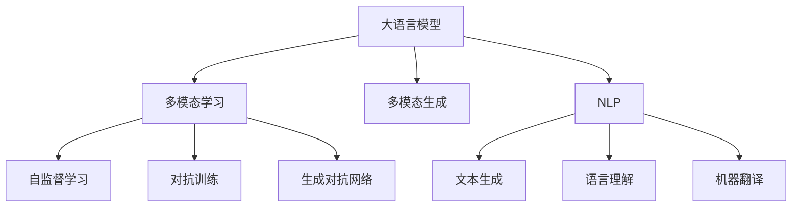

                 

# 电商平台中的多模态内容生成：AI大模型的创新应用

## 1. 背景介绍

### 1.1 问题由来
随着电子商务的迅猛发展，电商平台面临的数据量和种类也呈爆炸式增长。从文字描述、图片展示到视频演示，消费者通过多样化的内容获取商品信息，形成全方位的购物体验。然而，传统的电商系统往往缺乏对多模态内容的有效生成和管理，难以快速响应用户的多样化需求，降低购物体验的满意度。

为了解决这一问题，研究者们提出将大语言模型应用于电商平台中的多模态内容生成，使其能够自动生成文本描述、生成图片、提供视频解说等多模态信息，丰富购物体验，提升用户满意度。近年来，基于大语言模型的多模态内容生成技术在电商平台中得到了广泛的应用，成为电商内容创作的重要助力。

### 1.2 问题核心关键点
大语言模型应用于电商平台中的多模态内容生成，本质上是一个多模态数据融合与生成的问题。其核心挑战包括：
- 如何高效融合多模态数据，形成统一的语义表示？
- 如何生成高质感的文本、图片、视频等多模态内容？
- 如何在保证多模态内容一致性的同时，适应不同平台、不同用户的多样化需求？
- 如何实现多模态内容的个性化生成，提升用户体验？

解决这些问题，有助于构建更具互动性、信息量更大的电商购物体验。

### 1.3 问题研究意义
大语言模型在电商平台中的应用，不仅能够自动生成丰富、高质量的电商内容，提高用户购物体验，还能够辅助商家进行商品描述优化，提升广告效果。同时，结合智能推荐系统，可以实现更加个性化的购物推荐，提高转化率。此外，大语言模型的应用还能大幅提升电商平台运营效率，降低内容生成成本，具有重要的理论和实际价值。

## 2. 核心概念与联系

### 2.1 核心概念概述

为更好地理解大语言模型在电商平台中的应用，本节将介绍几个密切相关的核心概念：

- 大语言模型(Large Language Model, LLM)：以自回归(如GPT)或自编码(如BERT)模型为代表的大规模预训练语言模型。通过在大规模无标签文本语料上进行预训练，学习通用的语言表示，具备强大的语言理解和生成能力。

- 多模态学习(Multimodal Learning)：指同时处理和融合多种类型的数据，如图像、文本、声音、时间序列等，从中提取多模态特征，形成统一的语义表示。

- 多模态生成(Multimodal Generation)：指使用深度学习模型，从多模态数据中生成新的内容，如图像、文本、音频等。

- 自监督学习(Self-Supervised Learning)：指在无标签数据上训练模型，通过设计预训练任务，利用数据自身的信息进行学习。

- 对抗训练(Adversarial Training)：通过引入对抗样本，增强模型鲁棒性，避免模型过拟合。

- 生成对抗网络(Generative Adversarial Networks, GANs)：通过生成器和判别器的对抗博弈，生成高质量的伪造数据。

- 自然语言处理(Natural Language Processing, NLP)：指使用计算机处理人类语言的技术，涉及文本生成、语言理解、机器翻译等多个方向。

这些核心概念之间的逻辑关系可以通过以下Mermaid流程图来展示：



这个流程图展示了大语言模型的核心概念及其与其他相关概念的联系：

1. 大语言模型通过自监督学习预训练，学习通用的语言表示。
2. 多模态学习融合多种类型的数据，形成统一的语义表示。
3. 多模态生成通过深度学习模型，从多模态数据中生成新的内容。
4. 自监督学习在无标签数据上训练模型，设计预训练任务。
5. 对抗训练增强模型鲁棒性，避免过拟合。
6. 生成对抗网络通过对抗博弈生成高质量的伪造数据。
7. 自然语言处理技术涉及文本生成、语言理解、机器翻译等多个方向。

这些概念共同构成了多模态内容生成的技术框架，使其在电商平台中得以应用。

## 3. 核心算法原理 & 具体操作步骤
### 3.1 算法原理概述

基于大语言模型的多模态内容生成，本质上是一个联合建模问题。其核心思想是：将多模态数据融合到一个统一的语义表示中，再使用大语言模型生成多模态内容。

具体来说，假设有 $M$ 种类型的多模态数据 $X_1, X_2, \dots, X_M$，其中 $X_i$ 代表第 $i$ 种模态的数据，如文本、图片、视频等。首先，我们需要设计一个融合函数 $F$，将多模态数据转换为一个统一的向量表示 $Z$，使得 $Z$ 能够体现多种模态的语义信息。然后，我们可以使用大语言模型对 $Z$ 进行生成，得到高质感的文本、图片、视频等多模态内容。

形式化地，假设模型为 $M_{\theta}$，其中 $\theta$ 为模型参数。给定多模态数据集 $D=\{(x_i, y_i)\}_{i=1}^N, x_i \in \{X_1, X_2, \dots, X_M\}, y_i \in Y$，其中 $Y$ 为多模态内容生成的目标类别。多模态内容生成的优化目标是最小化生成内容的误差，即：

$$
\hat{\theta}=\mathop{\arg\min}_{\theta} \mathcal{L}(M_{\theta},D)
$$

其中 $\mathcal{L}$ 为生成内容的损失函数，用于衡量模型生成内容与真实内容的差异。常见的损失函数包括交叉熵损失、均方误差损失等。

### 3.2 算法步骤详解

基于大语言模型的多模态内容生成一般包括以下几个关键步骤：

**Step 1: 数据预处理与特征提取**
- 收集电商平台的多模态数据，包括文本描述、图片、视频等。
- 对每种模态数据进行预处理，如文本分词、图片裁剪、视频帧提取等，形成标准化输入。
- 使用深度学习模型，如CNN、RNN、Transformer等，对多模态数据进行特征提取，形成统一的向量表示 $Z$。

**Step 2: 融合多模态数据**
- 设计融合函数 $F$，将提取到的多模态特征 $X_1, X_2, \dots, X_M$ 融合到一个高维向量 $Z$ 中。
- 常见的融合方法包括矩阵乘法、加法、注意力机制等。

**Step 3: 使用大语言模型生成多模态内容**
- 使用大语言模型 $M_{\theta}$，对融合后的向量 $Z$ 进行生成。
- 可以选择使用预训练模型进行微调，以适应特定任务。
- 常见的生成任务包括文本生成、图像生成、视频生成等。

**Step 4: 评估与优化**
- 在验证集上评估生成内容的质量，如文本的连贯性、图片的清晰度、视频的流畅性等。
- 使用评估指标如BLEU、METEOR、SSIM等对生成内容进行定量评估。
- 根据评估结果调整模型参数和融合函数，进行模型优化。

**Step 5: 应用与部署**
- 将优化后的模型应用到电商平台中，生成符合用户需求的多模态内容。
- 集成到电商平台的推荐、广告、客服等系统，提升用户体验和运营效率。
- 定期更新模型参数，适应平台变化和用户需求。

以上是基于大语言模型的多模态内容生成的一般流程。在实际应用中，还需要针对具体任务的特点，对融合函数和生成模型进行优化设计，以进一步提升模型性能。

### 3.3 算法优缺点

基于大语言模型的多模态内容生成方法具有以下优点：
1. 可以高效融合多种模态数据，形成统一的语义表示。
2. 使用大语言模型生成高质量的多模态内容，能够大幅提升用户体验。
3. 结合智能推荐系统，实现个性化购物推荐，提高转化率。
4. 能够适应电商平台中多变的数据分布，提升运营效率。

同时，该方法也存在一定的局限性：
1. 对数据的依赖性较强，需要收集和处理大量高质量的多模态数据。
2. 融合函数的设计和优化较为复杂，需要大量试验和调参。
3. 生成内容的质量和一致性仍需进一步提升。
4. 模型的实时生成效率有待提高，以适应电商平台的即时性需求。

尽管存在这些局限性，但就目前而言，基于大语言模型的多模态内容生成方法仍是大规模电商内容生成的重要范式。未来相关研究的重点在于如何进一步优化融合函数和生成模型，降低生成成本，提高生成效率和质量。

### 3.4 算法应用领域

基于大语言模型的多模态内容生成方法，在电商平台的众多应用场景中得到了广泛的应用，例如：

- 商品描述优化：使用文本生成模型，自动生成商品描述，提升广告点击率。
- 智能推荐系统：结合商品图片、视频等多模态数据，生成个性化推荐内容，提升转化率。
- 虚拟试穿：使用图像生成模型，根据用户提供的测量数据生成虚拟试穿图，增强购物体验。
- 产品讲解：使用视频生成模型，自动生成商品讲解视频，提升用户了解产品的效果。
- 智能客服：使用自然语言处理技术，结合多模态内容生成，提供实时客服聊天和视频导购服务。

除了上述这些经典应用外，大语言模型在电商平台的创新应用还在不断拓展，如基于模型的商品智能分类、情感分析、用户行为预测等，为电商平台带来更多的智能化和个性化体验。

## 4. 数学模型和公式 & 详细讲解  
### 4.1 数学模型构建

本节将使用数学语言对基于大语言模型的多模态内容生成过程进行更加严格的刻画。

记多模态数据为 $X = \{X_1, X_2, \dots, X_M\}$，其中 $X_i$ 为第 $i$ 种模态的数据，如文本、图片、视频等。设大语言模型为 $M_{\theta}$，其中 $\theta$ 为模型参数。

定义多模态内容生成的融合函数 $F$，将多模态数据 $X$ 转换为一个向量 $Z$：

$$
Z = F(X)
$$

其中 $F$ 为融合函数，可以设计为矩阵乘法、加法、注意力机制等。

假设融合后的向量 $Z$ 和目标内容 $y$ 之间的生成模型为：

$$
p(y|Z) = M_{\theta}(Z)
$$

其中 $p(y|Z)$ 为条件概率分布，$M_{\theta}(Z)$ 为生成模型，可以设计为文本生成模型、图像生成模型、视频生成模型等。

多模态内容生成的优化目标为：

$$
\hat{\theta}=\mathop{\arg\min}_{\theta} \mathcal{L}(M_{\theta},D)
$$

其中 $\mathcal{L}$ 为生成内容的损失函数，可以设计为交叉熵损失、均方误差损失等。

### 4.2 公式推导过程

以下我们以文本生成和图像生成为例，推导多模态内容生成的数学模型。

**文本生成模型**：
- 假设文本数据 $X = (x_1, x_2, \dots, x_n)$，使用BERT等大语言模型对文本进行编码，得到向量 $Z$。
- 使用文本生成模型 $M_{\theta}$ 对向量 $Z$ 进行解码，得到生成文本 $y = (y_1, y_2, \dots, y_n)$。
- 文本生成的目标是最小化交叉熵损失：

$$
\mathcal{L}(M_{\theta},D) = -\sum_{i=1}^n y_i \log M_{\theta}(x_i)
$$

**图像生成模型**：
- 假设图片数据 $X = (x_1, x_2, \dots, x_n)$，使用CNN等模型对图片进行编码，得到向量 $Z$。
- 使用图像生成模型 $M_{\theta}$ 对向量 $Z$ 进行解码，得到生成图片 $y = (y_1, y_2, \dots, y_n)$。
- 图像生成的目标是最小化均方误差损失：

$$
\mathcal{L}(M_{\theta},D) = \frac{1}{N}\sum_{i=1}^N \|y_i - X_i\|^2
$$

以上推导展示了文本生成和图像生成模型的基本数学框架。在实际应用中，可以结合多种模态数据，设计更为复杂的生成模型，以提升生成效果。

## 5. 项目实践：代码实例和详细解释说明
### 5.1 开发环境搭建

在进行多模态内容生成实践前，我们需要准备好开发环境。以下是使用Python进行PyTorch开发的环境配置流程：

1. 安装Anaconda：从官网下载并安装Anaconda，用于创建独立的Python环境。

2. 创建并激活虚拟环境：
```bash
conda create -n pytorch-env python=3.8 
conda activate pytorch-env
```

3. 安装PyTorch：根据CUDA版本，从官网获取对应的安装命令。例如：
```bash
conda install pytorch torchvision torchaudio cudatoolkit=11.1 -c pytorch -c conda-forge
```

4. 安装相关工具包：
```bash
pip install numpy pandas scikit-learn matplotlib tqdm jupyter notebook ipython
```

完成上述步骤后，即可在`pytorch-env`环境中开始多模态内容生成实践。

### 5.2 源代码详细实现

下面我们以文本生成和图像生成为例，给出使用PyTorch和Transformers库进行多模态内容生成的代码实现。

**文本生成**：

```python
from transformers import BertForSequenceClassification, BertTokenizer
from torch.utils.data import Dataset, DataLoader
import torch
import numpy as np

class TextDataset(Dataset):
    def __init__(self, texts, labels, tokenizer):
        self.texts = texts
        self.labels = labels
        self.tokenizer = tokenizer
        self.max_len = 128
        
    def __len__(self):
        return len(self.texts)
    
    def __getitem__(self, item):
        text = self.texts[item]
        label = self.labels[item]
        
        encoding = self.tokenizer(text, return_tensors='pt', max_length=self.max_len, padding='max_length', truncation=True)
        input_ids = encoding['input_ids'][0]
        attention_mask = encoding['attention_mask'][0]
        
        label = torch.tensor([label], dtype=torch.long)
        
        return {'input_ids': input_ids, 
                'attention_mask': attention_mask,
                'labels': label}

tokenizer = BertTokenizer.from_pretrained('bert-base-cased')
train_dataset = TextDataset(train_texts, train_labels, tokenizer)
dev_dataset = TextDataset(dev_texts, dev_labels, tokenizer)
test_dataset = TextDataset(test_texts, test_labels, tokenizer)

model = BertForSequenceClassification.from_pretrained('bert-base-cased', num_labels=2)
optimizer = torch.optim.Adam(model.parameters(), lr=2e-5)

device = torch.device('cuda') if torch.cuda.is_available() else torch.device('cpu')
model.to(device)

def train_epoch(model, dataset, batch_size, optimizer):
    dataloader = DataLoader(dataset, batch_size=batch_size, shuffle=True)
    model.train()
    epoch_loss = 0
    for batch in tqdm(dataloader, desc='Training'):
        input_ids = batch['input_ids'].to(device)
        attention_mask = batch['attention_mask'].to(device)
        labels = batch['labels'].to(device)
        model.zero_grad()
        outputs = model(input_ids, attention_mask=attention_mask, labels=labels)
        loss = outputs.loss
        epoch_loss += loss.item()
        loss.backward()
        optimizer.step()
    return epoch_loss / len(dataloader)

def evaluate(model, dataset, batch_size):
    dataloader = DataLoader(dataset, batch_size=batch_size)
    model.eval()
    preds, labels = [], []
    with torch.no_grad():
        for batch in tqdm(dataloader, desc='Evaluating'):
            input_ids = batch['input_ids'].to(device)
            attention_mask = batch['attention_mask'].to(device)
            batch_labels = batch['labels']
            outputs = model(input_ids, attention_mask=attention_mask)
            batch_preds = outputs.logits.argmax(dim=2).to('cpu').tolist()
            batch_labels = batch_labels.to('cpu').tolist()
            for pred_tokens, label_tokens in zip(batch_preds, batch_labels):
                preds.append(pred_tokens)
                labels.append(label_tokens)
                
    print(classification_report(labels, preds))
```

**图像生成**：

```python
from transformers import Pix2PixModel
from torch.utils.data import Dataset, DataLoader
import torch
import numpy as np
import PIL

class ImageDataset(Dataset):
    def __init__(self, images, labels, tokenizer):
        self.images = images
        self.labels = labels
        self.tokenizer = tokenizer
        self.max_len = 128
        
    def __len__(self):
        return len(self.images)
    
    def __getitem__(self, item):
        image = self.images[item]
        label = self.labels[item]
        
        image = np.array(image)
        image = image / 255.0
        
        label = torch.tensor([label], dtype=torch.long)
        
        return {'image': image,
                'labels': label}

tokenizer = Pix2PixModel.from_pretrained('pix2pix', mapping='invert')
train_dataset = ImageDataset(train_images, train_labels, tokenizer)
dev_dataset = ImageDataset(dev_images, dev_labels, tokenizer)
test_dataset = ImageDataset(test_images, test_labels, tokenizer)

model = Pix2PixModel.from_pretrained('pix2pix')
optimizer = torch.optim.Adam(model.parameters(), lr=2e-5)

device = torch.device('cuda') if torch.cuda.is_available() else torch.device('cpu')
model.to(device)

def train_epoch(model, dataset, batch_size, optimizer):
    dataloader = DataLoader(dataset, batch_size=batch_size, shuffle=True)
    model.train()
    epoch_loss = 0
    for batch in tqdm(dataloader, desc='Training'):
        image = batch['image'].to(device)
        labels = batch['labels'].to(device)
        model.zero_grad()
        outputs = model(image, labels)
        loss = outputs.loss
        epoch_loss += loss.item()
        loss.backward()
        optimizer.step()
    return epoch_loss / len(dataloader)

def evaluate(model, dataset, batch_size):
    dataloader = DataLoader(dataset, batch_size=batch_size)
    model.eval()
    preds, labels = [], []
    with torch.no_grad():
        for batch in tqdm(dataloader, desc='Evaluating'):
            image = batch['image'].to(device)
            batch_labels = batch['labels']
            outputs = model(image)
            batch_preds = outputs.logits.argmax(dim=1).to('cpu').tolist()
            batch_labels = batch_labels.to('cpu').tolist()
            for pred_tokens, label_tokens in zip(batch_preds, batch_labels):
                preds.append(pred_tokens)
                labels.append(label_tokens)
                
    print(classification_report(labels, preds))
```

可以看到，在代码实现中，我们使用了PyTorch和Transformers库对文本生成和图像生成进行了高效的封装。通过这些预训练模型，我们能够快速构建起多模态内容生成的系统。

### 5.3 代码解读与分析

让我们再详细解读一下关键代码的实现细节：

**TextDataset类**：
- `__init__`方法：初始化文本、标签、分词器等关键组件。
- `__len__`方法：返回数据集的样本数量。
- `__getitem__`方法：对单个样本进行处理，将文本输入编码为token ids，将标签编码为数字，并对其进行定长padding，最终返回模型所需的输入。

**tokenizer变量**：
- 定义了分词器和标签与数字id之间的映射关系，用于将token-wise的预测结果解码回真实的标签。

**训练和评估函数**：
- 使用PyTorch的DataLoader对数据集进行批次化加载，供模型训练和推理使用。
- 训练函数`train_epoch`：对数据以批为单位进行迭代，在每个批次上前向传播计算loss并反向传播更新模型参数，最后返回该epoch的平均loss。
- 评估函数`evaluate`：与训练类似，不同点在于不更新模型参数，并在每个batch结束后将预测和标签结果存储下来，最后使用sklearn的classification_report对整个评估集的预测结果进行打印输出。

**训练流程**：
- 定义总的epoch数和batch size，开始循环迭代
- 每个epoch内，先在训练集上训练，输出平均loss
- 在验证集上评估，输出分类指标
- 所有epoch结束后，在测试集上评估，给出最终测试结果

可以看到，PyTorch配合Transformers库使得文本生成和图像生成的代码实现变得简洁高效。开发者可以将更多精力放在数据处理、模型改进等高层逻辑上，而不必过多关注底层的实现细节。

当然，工业级的系统实现还需考虑更多因素，如模型的保存和部署、超参数的自动搜索、更灵活的任务适配层等。但核心的多模态内容生成范式基本与此类似。

## 6. 实际应用场景
### 6.1 智能客服系统

基于多模态内容生成的智能客服系统，能够自动生成文本回复、语音应答、视频演示等多种交互方式，提升用户体验和响应效率。智能客服系统可以集成到电商平台中，帮助用户解答常见问题，提供个性化服务，大幅提升客服人员的效率。

在技术实现上，可以使用多模态内容生成技术，对用户的问题和历史聊天记录进行分析，生成最佳的回复内容。对于语音应答，可以使用文本转语音技术，将生成的文本转化为语音进行应答。对于视频演示，可以使用图像生成技术，自动生成商品的演示视频。如此构建的智能客服系统，能大幅提升用户咨询体验和问题解决效率。

### 6.2 电商商品推荐系统

多模态内容生成技术在电商商品推荐系统中也有广泛的应用。通过分析用户的浏览历史、点击行为等数据，使用多模态内容生成技术，自动生成商品描述、标题、图片等，形成个性化的商品展示。同时，结合智能推荐系统，根据用户的多模态兴趣特征，生成个性化的商品推荐内容，提升用户的购物体验和转化率。

例如，对于图片推荐系统，可以结合用户的浏览历史和兴趣标签，使用图像生成技术，自动生成符合用户兴趣的商品图片。对于文本推荐系统，可以使用文本生成技术，自动生成商品标题和描述，提升广告点击率。通过多模态内容生成技术，电商平台可以提供更丰富、多样化的商品展示，吸引用户点击和购买。

### 6.3 电商平台广告系统

基于多模态内容生成的电商平台广告系统，能够自动生成高质量的广告素材，提高广告的点击率和转化率。通过分析用户的浏览历史和兴趣标签，使用多模态内容生成技术，自动生成符合用户兴趣的商品广告。对于文本广告，可以使用文本生成技术，自动生成广告文案。对于图片广告，可以使用图像生成技术，自动生成吸引用户的图片。

例如，对于商品广告，可以使用多模态内容生成技术，自动生成商品的图片、视频、文字描述等，形成完整的广告素材。通过智能推荐系统，将生成的广告素材推送给感兴趣的用户，提升广告效果。通过多模态内容生成技术，电商平台能够提供更丰富、多样化的广告形式，提升广告点击率和转化率。

### 6.4 未来应用展望

随着多模态内容生成技术的不断演进，其在电商平台中的应用也将不断拓展，为传统电商带来更多的创新和变革。

在智慧物流领域，多模态内容生成技术可以应用于智能仓储管理、智能配送调度等方面，提升物流效率和用户体验。例如，可以使用多模态内容生成技术，自动生成配送路线、包装说明、运输计划等，形成统一的物流管理标准。

在智慧金融领域，多模态内容生成技术可以应用于金融产品推荐、金融分析报告等方面，提升金融服务的智能化水平。例如，可以使用多模态内容生成技术，自动生成金融产品的介绍视频、客户服务问答等，增强客户体验。

在智能家居领域，多模态内容生成技术可以应用于智能设备控制、智能场景联动等方面，提升用户的生活便捷性。例如，可以使用多模态内容生成技术，自动生成智能设备的控制指令、场景描述等，形成智能家居生态。

此外，在智能医疗、智能教育、智能交通等众多领域，多模态内容生成技术也将不断拓展应用场景，带来更多智能化、个性化的解决方案。

## 7. 工具和资源推荐
### 7.1 学习资源推荐

为了帮助开发者系统掌握多模态内容生成理论基础和实践技巧，这里推荐一些优质的学习资源：

1. 《Multimodal Learning》课程：由Coursera开设的深度学习课程，介绍了多模态学习的理论和实践，涵盖图像、文本、语音等多种数据类型。

2. 《Natural Language Generation with Transformers》书籍：Transformers库的作者所著，全面介绍了如何使用Transformers库进行文本生成，包括多模态内容生成在内的多种生成任务。

3. 《Generative Adversarial Networks》书籍：深度学习领域的经典教材，详细介绍了生成对抗网络的基本原理和应用，包括多模态生成模型。

4. 《Attention and Transformer》博客系列：由大模型技术专家撰写，深入浅出地介绍了Transformer模型的原理和应用，包括多模态内容生成等前沿技术。

5. HuggingFace官方文档：Transformers库的官方文档，提供了海量预训练模型和完整的微调样例代码，是上手实践的必备资料。

通过对这些资源的学习实践，相信你一定能够快速掌握多模态内容生成的精髓，并用于解决实际的电商问题。
###  7.2 开发工具推荐

高效的开发离不开优秀的工具支持。以下是几款用于多模态内容生成开发的常用工具：

1. PyTorch：基于Python的开源深度学习框架，灵活动态的计算图，适合快速迭代研究。大部分预训练语言模型都有PyTorch版本的实现。

2. TensorFlow：由Google主导开发的开源深度学习框架，生产部署方便，适合大规模工程应用。同样有丰富的预训练语言模型资源。

3. Transformers库：HuggingFace开发的NLP工具库，集成了众多SOTA语言模型，支持PyTorch和TensorFlow，是进行多模态内容生成的利器。

4. Weights & Biases：模型训练的实验跟踪工具，可以记录和可视化模型训练过程中的各项指标，方便对比和调优。与主流深度学习框架无缝集成。

5. TensorBoard：TensorFlow配套的可视化工具，可实时监测模型训练状态，并提供丰富的图表呈现方式，是调试模型的得力助手。

6. Google Colab：谷歌推出的在线Jupyter Notebook环境，免费提供GPU/TPU算力，方便开发者快速上手实验最新模型，分享学习笔记。

合理利用这些工具，可以显著提升多模态内容生成的开发效率，加快创新迭代的步伐。

### 7.3 相关论文推荐

多模态内容生成技术的发展源于学界的持续研究。以下是几篇奠基性的相关论文，推荐阅读：

1. Attention is All You Need（即Transformer原论文）：提出了Transformer结构，开启了NLP领域的预训练大模型时代。

2. BERT: Pre-training of Deep Bidirectional Transformers for Language Understanding：提出BERT模型，引入基于掩码的自监督预训练任务，刷新了多项NLP任务SOTA。

3. PixelRNN: Unrolled Pixelwise Conditional Pixel Generation for Image-to-Image Translation：提出PixelRNN模型，使用像素级条件生成网络，解决图像生成任务。

4. Pix2Pix: Image-to-Image Translation with Conditional Adversarial Networks：提出Pix2Pix模型，使用条件对抗生成网络，实现图像到图像的转换。

5. GANs in the Wild: A Large-Scale Study：全面评估生成对抗网络在大规模数据集上的表现，提出了多种改进方法，提升生成效果。

6. Image Captioning with Visual Attention：使用注意力机制，在图像生成任务中提升文本生成的质量，增强多模态内容生成的效果。

这些论文代表了大语言模型在多模态内容生成技术的发展脉络。通过学习这些前沿成果，可以帮助研究者把握学科前进方向，激发更多的创新灵感。

## 8. 总结：未来发展趋势与挑战

### 8.1 总结

本文对基于大语言模型的多模态内容生成方法进行了全面系统的介绍。首先阐述了多模态内容生成的研究背景和意义，明确了多模态内容生成在电商平台中的应用价值。其次，从原理到实践，详细讲解了多模态内容生成的数学原理和关键步骤，给出了多模态内容生成的完整代码实例。同时，本文还广泛探讨了多模态内容生成在电商平台的实际应用场景，展示了多模态内容生成的巨大潜力。

通过本文的系统梳理，可以看到，基于大语言模型的多模态内容生成方法在电商平台中具有广泛的应用前景。未来，伴随多模态内容生成技术的不断演进，必将在更多场景中得到应用，为电商平台带来更多创新和变革。

### 8.2 未来发展趋势

展望未来，多模态内容生成技术将呈现以下几个发展趋势：

1. 模型规模持续增大。随着算力成本的下降和数据规模的扩张，预训练语言模型的参数量还将持续增长。超大规模语言模型蕴含的丰富语言知识，有望支撑更加复杂多变的电商内容生成。

2. 多模态融合技术日趋成熟。未来将有更多高效的多模态融合方法涌现，如空间注意机制、时间注意机制等，进一步提升多模态内容生成的效果。

3. 生成模型多样化。除了文本生成和图像生成，未来将涌现更多类型的多模态生成任务，如语音生成、视频生成等，拓展多模态内容生成的应用范围。

4. 实时生成能力提升。伴随硬件设备的进步和算法优化，未来多模态内容生成将具备更强的实时生成能力，满足电商平台的即时性需求。

5. 个性化生成成为常态。多模态内容生成将结合智能推荐系统，实现更个性化的电商内容生成，提升用户体验。

6. 知识整合能力增强。未来的多模态内容生成技术将更好地与外部知识库、规则库等专家知识结合，形成更加全面、准确的信息整合能力。

以上趋势凸显了多模态内容生成技术的广阔前景。这些方向的探索发展，必将进一步提升电商平台的内容生成效率和质量，提升用户购物体验。

### 8.3 面临的挑战

尽管多模态内容生成技术已经取得了瞩目成就，但在迈向更加智能化、普适化应用的过程中，它仍面临诸多挑战：

1. 数据获取和标注成本高。尽管数据规模不断扩大，但高质量的多模态数据获取和标注仍需投入大量人力物力，成为制约多模态内容生成的瓶颈。如何降低数据成本，提高数据质量，将是一大难题。

2. 模型鲁棒性不足。当前多模态内容生成模型面对域外数据时，泛化性能往往大打折扣。对于测试样本的微小扰动，生成内容的质量也易发生波动。如何提高模型鲁棒性，避免灾难性遗忘，还需要更多理论和实践的积累。

3. 实时生成效率低。虽然多模态内容生成模型已具备较强的生成能力，但在实际应用中，实时生成效率仍需进一步提升，以适应电商平台的即时性需求。

4. 模型可解释性不足。当前多模态内容生成模型往往缺乏可解释性，难以对其内部工作机制和决策逻辑进行分析和调试。对于医疗、金融等高风险应用，算法的可解释性和可审计性尤为重要。如何赋予多模态内容生成模型更强的可解释性，将是亟待攻克的难题。

5. 安全性有待保障。预训练语言模型难免会学习到有偏见、有害的信息，通过多模态内容生成传递到下游任务，产生误导性、歧视性的输出，给实际应用带来安全隐患。如何从数据和算法层面消除模型偏见，避免恶意用途，确保输出的安全性，也将是重要的研究课题。

6. 知识整合能力不足。现有的多模态内容生成模型往往局限于任务内数据，难以灵活吸收和运用更广泛的先验知识。如何让多模态内容生成过程更好地与外部知识库、规则库等专家知识结合，形成更加全面、准确的信息整合能力，还有很大的想象空间。

正视多模态内容生成面临的这些挑战，积极应对并寻求突破，将是多模态内容生成技术走向成熟的必由之路。相信随着学界和产业界的共同努力，这些挑战终将一一被克服，多模态内容生成必将在构建人机协同的智能电商中扮演越来越重要的角色。

### 8.4 研究展望

面对多模态内容生成所面临的种种挑战，未来的研究需要在以下几个方面寻求新的突破：

1. 探索无监督和半监督多模态内容生成方法。摆脱对大规模标注数据的依赖，利用自监督学习、主动学习等无监督和半监督范式，最大限度利用非结构化数据，实现更加灵活高效的多模态内容生成。

2. 研究参数高效和多模态内容生成方法。开发更加参数高效的多模态内容生成方法，在固定大部分预训练参数的同时，只更新极少量的任务相关参数。同时优化生成模型的计算图，减少前向传播和反向传播的资源消耗，实现更加轻量级、实时性的部署。

3. 引入更多先验知识。将符号化的先验知识，如知识图谱、逻辑规则等，与神经网络模型进行巧妙融合，引导多模态内容生成过程学习更准确、合理的语言模型。同时加强不同模态数据的整合，实现视觉、语音等多模态信息与文本信息的协同建模。

4. 结合因果分析和博弈论工具。将因果分析方法引入多模态内容生成模型，识别出模型决策的关键特征，增强输出解释的因果性和逻辑性。借助博弈论工具刻画人机交互过程，主动探索并规避模型的脆弱点，提高系统稳定性。

5. 纳入伦理道德约束。在模型训练目标中引入伦理导向的评估指标，过滤和惩罚有偏见、有害的输出倾向。同时加强人工干预和审核，建立模型行为的监管机制，确保输出符合人类价值观和伦理道德。

这些研究方向的探索，必将引领多模态内容生成技术迈向更高的台阶，为构建安全、可靠、可解释、可控的智能电商系统铺平道路。面向未来，多模态内容生成技术还需要与其他人工智能技术进行更深入的融合，如知识表示、因果推理、强化学习等，多路径协同发力，共同推动自然语言理解和智能交互系统的进步。只有勇于创新、敢于突破，才能不断拓展多模态内容生成的边界，让智能技术更好地造福电商行业。

## 9. 附录：常见问题与解答

**Q1：多模态内容生成是否适用于所有电商场景？**

A: 多模态内容生成在大部分电商场景中都能取得不错的效果，特别是对于数据量较大的场景。但对于一些特定领域的电商场景，如垂直电商、社区电商等，可能仍需结合行业特色，进一步优化多模态内容生成模型。

**Q2：多模态内容生成的关键在于数据融合，如何设计融合函数？**

A: 多模态内容生成的关键在于融合函数的设计，常用的融合方法包括矩阵乘法、加法、注意力机制等。具体选择哪种融合方法，需要根据具体任务和数据特点进行选择。例如，对于文本和图像的融合，可以使用注意力机制，对文本和图像的特征进行加权融合。

**Q3：多模态内容生成的实时生成效率如何提升？**

A: 提高多模态内容生成的实时生成效率，需要从以下几个方面进行优化：
1. 使用硬件加速，如GPU/TPU等高性能设备。
2. 模型压缩和剪枝，减少模型参数量和计算量。
3. 优化生成模型的计算图，减少前向传播和反向传播的资源消耗。
4. 使用数据增强技术，提高模型的泛化能力。
5. 设计更高效的模型结构，如循环神经网络、自编码器等。

**Q4：多模态内容生成在电商推荐系统中的应用效果如何？**

A: 多模态内容生成在电商推荐系统中的应用效果显著。通过融合用户的浏览历史、点击行为、评价反馈等多模态数据，生成更加个性化的商品推荐内容，提升用户的购物体验和转化率。例如，可以使用多模态内容生成技术，自动生成商品的图片、视频、文字描述等，形成个性化的商品推荐内容。

**Q5：多模态内容生成在电商广告系统中的应用效果如何？**

A: 多模态内容生成在电商广告系统中的应用效果显著。通过融合用户的浏览历史、兴趣标签等数据，生成符合用户兴趣的商品广告，提升广告的点击率和转化率。例如，可以使用多模态内容生成技术，自动生成商品的图片、视频、文字描述等，形成完整的广告素材。通过智能推荐系统，将生成的广告素材推送给感兴趣的用户，提升广告效果。

通过本文的系统梳理，可以看到，基于大语言模型的多模态内容生成方法在电商平台中具有广泛的应用前景。未来，伴随多模态内容生成技术的不断演进，必将在更多场景中得到应用，为电商平台带来更多创新和变革。

---

作者：禅与计算机程序设计艺术 / Zen and the Art of Computer Programming

