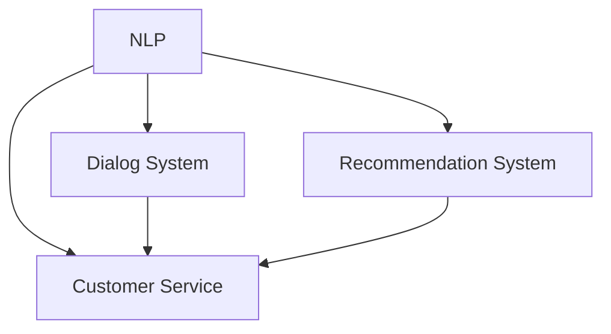

                 

# 电商平台中的对话式AI应用

> 关键词：电商平台,对话式AI,自然语言处理,聊天机器人,推荐系统,客户服务,个性化推荐

## 1. 背景介绍

### 1.1 问题由来

随着电子商务的迅猛发展，客户服务的重要性愈发凸显。传统的客服模式依赖于人工客服，存在着响应时间长、处理能力有限、成本高昂等问题。为了提升客户服务体验，电商平台纷纷引入对话式AI（Conversational AI）技术，通过智能聊天机器人（Chatbot）为客户提供7x24小时不间断服务。

对话式AI技术能够理解自然语言，快速响应客户需求，降低客服成本，提升服务效率和质量。例如，客户可以通过文字聊天的形式，向机器人咨询商品信息、订购商品、查询订单状态等，机器人能够根据对话内容进行合理的回答或提供相应的服务。

### 1.2 问题核心关键点

对话式AI的核心在于自然语言处理（NLP）技术的支持。NLP技术使机器能够理解人类语言的含义，进行语义分析和意图识别，从而进行对话。在电商平台中，对话式AI主要应用于以下几个方面：

- **客户咨询**：处理客户的常见问题，如商品信息查询、订单状态跟踪等。
- **推荐系统**：基于用户的浏览和购买历史，向用户推荐相关商品。
- **营销活动**：通过对话引导用户参与促销活动，提高活动效果。
- **售后服务**：处理退换货、投诉等售后服务请求，提升客户满意度。

### 1.3 问题研究意义

对话式AI技术能够显著提升电商平台的客户体验，提高运营效率，降低人力成本。具体而言：

- **提升服务效率**：通过AI技术快速响应客户需求，减少人工客服的工作量，提升服务响应速度。
- **个性化推荐**：基于用户行为数据进行精准推荐，提高用户购买转化率和满意度。
- **营销效果**：通过对话引导用户参与促销活动，提高营销效果和用户参与度。
- **数据收集**：对话机器人能够收集大量的用户行为数据，用于分析用户需求和行为模式，指导电商平台决策。

总之，对话式AI技术是电商平台智能化的重要手段，通过提升服务效率和用户体验，将为电商平台带来显著的经济效益和社会价值。

## 2. 核心概念与联系

### 2.1 核心概念概述

为了深入理解电商平台中的对话式AI应用，本节将介绍几个密切相关的核心概念：

- **自然语言处理（NLP）**：使计算机能够理解、处理和生成自然语言的技术。包括分词、词性标注、语义分析、命名实体识别、意图识别等。
- **对话系统（Dialog System）**：基于NLP技术，使计算机能够理解人类语言的含义，进行对话的技术。包括机器翻译、问答系统、聊天机器人等。
- **推荐系统（Recommendation System）**：基于用户行为数据，为用户提供个性化的商品推荐。包括协同过滤、基于内容的推荐、深度学习推荐等。
- **客户服务（Customer Service）**：电商平台为满足客户需求，提供的服务体系。包括人工客服、自助服务、客户关系管理等。

这些核心概念之间的逻辑关系可以通过以下Mermaid流程图来展示：



这个流程图展示了对话式AI技术在电商平台中的应用路径：

1. 通过NLP技术处理用户输入的自然语言，理解用户意图。
2. 对话系统根据用户意图，进行相应的回答或操作。
3. 推荐系统根据用户行为数据，提供个性化的商品推荐。
4. 客户服务系统整合对话和推荐功能，提升用户满意度和转化率。

## 3. 核心算法原理 & 具体操作步骤
### 3.1 算法原理概述

在电商平台中，对话式AI技术主要依赖于自然语言处理和推荐系统，通过与用户的对话收集信息，并提供个性化推荐。核心算法原理如下：

1. **意图识别**：对话机器人通过自然语言处理技术，对用户输入的自然语言进行分词、词性标注、命名实体识别、句法分析等处理，提取用户意图。

2. **对话管理**：对话系统根据用户意图，选择合适的回答或操作，并更新对话状态。对话管理可以采用基于规则或基于统计的方法，常用的算法包括状态机、记忆网络等。

3. **推荐算法**：推荐系统基于用户行为数据（如浏览记录、购买记录、评分等），使用协同过滤、内容推荐、深度学习推荐等算法，为用户提供个性化的商品推荐。

4. **对话结果输出**：对话机器人和推荐系统整合信息，根据用户意图和行为，生成相应的回答或推荐列表。

### 3.2 算法步骤详解

对话式AI技术在电商平台中的应用流程如下：

1. **用户输入**：用户通过电商平台提供的聊天界面输入自然语言。

2. **意图识别**：对话机器人通过NLP技术，对用户输入的自然语言进行分词、词性标注、命名实体识别等处理，提取用户意图。

3. **对话管理**：对话系统根据用户意图，选择合适的回答或操作，并更新对话状态。

4. **推荐生成**：推荐系统基于用户行为数据，使用推荐算法生成个性化商品推荐列表。

5. **结果输出**：对话机器人和推荐系统整合信息，根据用户意图和行为，生成相应的回答或推荐列表，并反馈给用户。

6. **用户反馈**：用户对回答或推荐进行反馈，对话系统根据反馈调整对话策略。

### 3.3 算法优缺点

对话式AI技术在电商平台中的主要优缺点如下：

**优点：**

1. **提高服务效率**：通过自动处理常见问题，对话机器人能够快速响应客户需求，减少人工客服的工作量。
2. **降低成本**：对话机器人可以7x24小时不间断工作，降低人工客服的运营成本。
3. **个性化推荐**：基于用户行为数据，推荐系统能够提供个性化的商品推荐，提高用户购买转化率。
4. **提升用户体验**：对话机器人能够提供24小时在线服务，提升用户满意度。

**缺点：**

1. **理解限制**：对话机器人的理解能力有限，对于复杂或模糊的用户意图，可能无法准确把握。
2. **数据依赖**：对话系统和推荐系统依赖大量的用户行为数据，数据质量对系统性能有重要影响。
3. **反馈机制不完善**：用户对回答或推荐的反馈机制不完善，影响对话系统的持续优化。
4. **技术复杂**：对话式AI技术涉及NLP、机器学习等多个领域，技术实现复杂。

### 3.4 算法应用领域

对话式AI技术在电商平台中的应用领域非常广泛，主要包括以下几个方面：

1. **客户咨询**：处理客户的常见问题，如商品信息查询、订单状态跟踪等。
2. **推荐系统**：基于用户的浏览和购买历史，向用户推荐相关商品。
3. **营销活动**：通过对话引导用户参与促销活动，提高活动效果。
4. **售后服务**：处理退换货、投诉等售后服务请求，提升客户满意度。
5. **个性化推荐**：根据用户行为数据，提供个性化的商品推荐。

## 4. 数学模型和公式 & 详细讲解 & 举例说明
### 4.1 数学模型构建

对话式AI技术在电商平台中的应用主要依赖于自然语言处理和推荐系统，其数学模型如下：

1. **意图识别**：基于文本分类算法，对用户输入的自然语言进行分类，提取用户意图。

2. **对话管理**：基于规则或统计方法，选择合适的回答或操作，更新对话状态。

3. **推荐算法**：基于协同过滤、内容推荐、深度学习推荐等算法，生成个性化商品推荐列表。

**案例分析**：
- **意图识别**：假设电商平台需要处理用户查询商品信息的意图。可以采用文本分类算法，将用户输入的文本分类为“查询商品信息”、“查询订单状态”等意图类别。
- **对话管理**：在对话管理中，可以采用状态机方法，根据用户的当前意图和对话历史，选择相应的回答或操作，如“请输入商品ID”、“请确认订单ID”等。
- **推荐算法**：基于用户的浏览和购买历史，使用协同过滤算法生成个性化商品推荐列表。例如，可以基于用户浏览记录和购买记录，计算商品间的相似度，生成推荐列表。

### 4.2 公式推导过程

以下以推荐算法为例，进行详细的公式推导过程。

假设电商平台有$m$个用户，$n$个商品，每个用户的浏览和购买历史可以用向量$x \in \mathbb{R}^n$表示，其中$x_i=1$表示用户浏览过或购买过商品$i$，$x_i=0$表示用户未浏览过或购买过商品$i$。推荐系统的目标是找到一个推荐列表$y \in \mathbb{R}^n$，使得用户对推荐商品的评分最大化。

设用户对商品$i$的评分矩阵为$R \in \mathbb{R}^{m \times n}$，其中$R_{ij}$表示用户$i$对商品$j$的评分。基于用户行为数据的推荐算法可以采用矩阵分解方法，设用户和商品的潜在特征矩阵为$L \in \mathbb{R}^{m \times n}$，则推荐算法可以表示为：

$$
\min_{L} \| R - X_L \|_F^2
$$

其中$X \in \mathbb{R}^{m \times n}$为用户的浏览和购买历史矩阵。通过求解上述最小化问题，得到推荐矩阵$Y = X_L$，即为用户的个性化推荐列表。

### 4.3 案例分析与讲解

假设电商平台收集到用户$A$浏览过商品$1, 2, 3$的记录，未浏览过商品$4, 5, 6$的记录。设用户$A$对商品$1$的评分为$5$，对商品$2$的评分为$4$，对商品$3$的评分为$3$。推荐算法可以采用矩阵分解方法，将用户和商品的潜在特征矩阵表示为：

$$
L = \begin{bmatrix} 
2.5 & -0.5 & -1.5 \\
-0.5 & 2.5 & -1.5 \\
-1.5 & -1.5 & 2.5 \\
\end{bmatrix}
$$

基于上述潜在特征矩阵，计算用户$A$对商品$4, 5, 6$的推荐评分：

$$
\begin{align*}
L_{1,4} &= 0.5 \\
L_{1,5} &= 0 \\
L_{1,6} &= -0.5 \\
\end{align*}
$$

生成推荐列表：

$$
y_A = \begin{bmatrix} 
4.5 \\
3.5 \\
2.5 \\
\end{bmatrix}
$$

即推荐商品$4$的评分为$4.5$，推荐商品$5$的评分为$3.5$，推荐商品$6$的评分为$2.5$。用户$A$可以查看推荐商品列表，选择购买。

## 5. 项目实践：代码实例和详细解释说明
### 5.1 开发环境搭建

在进行对话式AI项目实践前，我们需要准备好开发环境。以下是使用Python进行TensorFlow开发的环境配置流程：

1. 安装Anaconda：从官网下载并安装Anaconda，用于创建独立的Python环境。

2. 创建并激活虚拟环境：
```bash
conda create -n dialog-env python=3.8 
conda activate dialog-env
```

3. 安装TensorFlow：根据CUDA版本，从官网获取对应的安装命令。例如：
```bash
conda install tensorflow -c conda-forge
```

4. 安装TensorBoard：用于可视化模型训练过程和结果。

5. 安装其他相关库：
```bash
pip install tensorflow-addons
pip install scikit-learn
pip install pandas
pip install numpy
pip install matplotlib
```

完成上述步骤后，即可在`dialog-env`环境中开始对话式AI项目开发。

### 5.2 源代码详细实现

下面我们以电商平台中的推荐系统为例，给出使用TensorFlow进行对话式AI项目开发的PyTorch代码实现。

```python
import tensorflow as tf
from tensorflow.keras import layers
import pandas as pd
import numpy as np

# 读取用户行为数据
data = pd.read_csv('user_behavior.csv')

# 定义推荐模型的输入和输出
user_input = tf.keras.layers.Input(shape=(data.shape[1],))
item_input = tf.keras.layers.Input(shape=(data.shape[1],))

# 定义模型的编码层
encoder = layers.LSTM(units=64, return_sequences=True)
encoder_output = encoder(user_input)

# 定义推荐模型的解码层
decoder = layers.Dense(units=64)
decoder_output = decoder(item_input)

# 定义推荐模型的输出
recommender = layers.Dense(units=1)
recommender_output = recommender(encoder_output * decoder_output)

# 定义推荐模型的损失函数
loss = tf.keras.losses.MeanSquaredError()

# 定义推荐模型的优化器
optimizer = tf.keras.optimizers.Adam(learning_rate=0.001)

# 定义推荐模型的训练函数
def train_model(model, x_train, y_train, x_valid, y_valid):
    model.compile(optimizer=optimizer, loss=loss)
    model.fit(x_train, y_train, validation_data=(x_valid, y_valid), epochs=10, batch_size=32)

# 定义推荐模型的评估函数
def evaluate_model(model, x_test, y_test):
    loss = model.evaluate(x_test, y_test)
    print(f'Test loss: {loss:.4f}')
```

以上代码实现了一个基于LSTM的推荐系统，用于生成用户的个性化推荐列表。在实际应用中，需要进一步细化模型的结构，选择合适的损失函数和优化器，并进行模型训练和评估。

### 5.3 代码解读与分析

让我们再详细解读一下关键代码的实现细节：

**数据处理**：
- `data = pd.read_csv('user_behavior.csv')`：读取用户行为数据，存储为Pandas DataFrame。
- `user_input = tf.keras.layers.Input(shape=(data.shape[1],))`：定义用户输入的LSTM模型的输入形状，等于用户行为数据的维度。
- `item_input = tf.keras.layers.Input(shape=(data.shape[1],))`：定义商品输入的LSTM模型的输入形状，等于商品行为数据的维度。

**模型结构**：
- `encoder = layers.LSTM(units=64, return_sequences=True)`：定义用户和商品的LSTM编码层，输出维度为64，并返回序列。
- `encoder_output = encoder(user_input)`：将用户行为数据输入LSTM编码层，得到用户潜在特征。
- `decoder = layers.Dense(units=64)`：定义商品输入的LSTM解码层，输出维度为64。
- `decoder_output = decoder(item_input)`：将商品行为数据输入LSTM解码层，得到商品潜在特征。
- `recommender = layers.Dense(units=1)`：定义推荐输出层，输出单个数值表示推荐评分。
- `recommender_output = recommender(encoder_output * decoder_output)`：将用户和商品的潜在特征进行矩阵乘法，得到推荐评分。

**训练函数**：
- `model.compile(optimizer=optimizer, loss=loss)`：编译模型，选择优化器和损失函数。
- `model.fit(x_train, y_train, validation_data=(x_valid, y_valid), epochs=10, batch_size=32)`：训练模型，选择训练集、验证集、训练轮数和批大小。

**评估函数**：
- `loss = model.evaluate(x_test, y_test)`：评估模型在测试集上的表现，输出损失值。

以上代码展示了TensorFlow实现对话式AI项目的基本流程，包括数据读取、模型定义、训练和评估等环节。

## 6. 实际应用场景
### 6.1 智能客服系统

电商平台中的对话式AI技术可以应用于智能客服系统，提高客户服务效率和体验。智能客服系统通过自然语言处理技术，理解客户提出的问题，并提供快速准确的解答。客户可以通过文字聊天的形式，向智能客服系统咨询商品信息、订单状态等。

在实践中，智能客服系统可以基于客户的历史查询记录和行为数据，进行意图识别和对话管理。例如，当客户咨询商品信息时，智能客服系统可以自动获取客户的查询意图，并从数据库中查找相关商品信息进行回答。客户可以通过对话界面与智能客服系统互动，快速获取所需信息。

### 6.2 推荐系统

对话式AI技术在推荐系统中具有重要应用。推荐系统通过分析用户的浏览和购买历史，生成个性化推荐列表。对话式AI技术可以基于用户的对话内容，动态调整推荐策略，提供更加符合用户需求的推荐。

例如，当用户询问“有哪些新上线的商品”时，推荐系统可以自动分析用户的浏览和购买历史，生成个性化的商品推荐列表。用户可以查看推荐列表，选择购买。通过对话式AI技术，推荐系统可以实时响应用户需求，提升推荐效果和用户体验。

### 6.3 营销活动

电商平台中的对话式AI技术可以应用于营销活动，提高营销效果和用户参与度。通过对话引导用户参与促销活动，可以提升用户的购买转化率和参与度。

例如，当用户询问“双11有哪些优惠活动”时，智能客服系统可以自动推荐相关促销活动，并提供详细的优惠信息。用户可以根据推荐信息选择参与活动，提升用户满意度和营销效果。

### 6.4 未来应用展望

随着对话式AI技术的发展，未来在电商平台中的应用将更加广泛和深入。以下是一些可能的未来应用方向：

1. **个性化推荐**：通过对话式AI技术，基于用户对话内容动态调整推荐策略，提供更加精准和个性化的推荐。

2. **客户服务**：通过对话式AI技术，提供7x24小时不间断的客户服务，提升客户满意度。

3. **营销活动**：基于用户的对话内容，动态调整营销活动策略，提高营销效果和用户参与度。

4. **数据分析**：通过对话式AI技术，收集用户的对话数据，用于分析用户需求和行为模式，指导电商平台决策。

总之，对话式AI技术在电商平台中的应用前景广阔，未来将在更多场景中发挥重要作用，提升电商平台的智能化水平和用户体验。

## 7. 工具和资源推荐
### 7.1 学习资源推荐

为了帮助开发者系统掌握对话式AI技术，这里推荐一些优质的学习资源：

1. **《深度学习》课程**：斯坦福大学开设的深度学习课程，有Lecture视频和配套作业，带你入门深度学习的基本概念和经典模型。

2. **《TensorFlow官方文档》**：TensorFlow的官方文档，提供了完整的API和示例代码，是TensorFlow学习的必备资料。

3. **《自然语言处理综述》**：斯坦福大学发布的自然语言处理综述，涵盖了NLP领域的各个方面，适合初学者系统学习。

4. **《对话系统设计》书籍**：介绍对话系统设计的基本原理和实现方法，适合对对话式AI技术感兴趣的人深入学习。

5. **《推荐系统设计》书籍**：介绍推荐系统设计的基本原理和实现方法，适合对推荐系统感兴趣的人深入学习。

通过对这些资源的学习实践，相信你一定能够快速掌握对话式AI技术的精髓，并用于解决实际的NLP问题。

### 7.2 开发工具推荐

高效的开发离不开优秀的工具支持。以下是几款用于对话式AI开发的工具：

1. **TensorFlow**：由Google主导开发的开源深度学习框架，生产部署方便，适合大规模工程应用。

2. **PyTorch**：基于Python的开源深度学习框架，灵活动态的计算图，适合快速迭代研究。

3. **NLTK**：Python中的自然语言处理库，提供了文本处理、语言分析等功能。

4. **SpaCy**：Python中的自然语言处理库，提供了分词、命名实体识别、句法分析等功能。

5. **Gensim**：Python中的自然语言处理库，提供了主题建模、文本相似度计算等功能。

6. **Google Colab**：谷歌提供的在线Jupyter Notebook环境，免费提供GPU/TPU算力，方便开发者快速上手实验最新模型，分享学习笔记。

合理利用这些工具，可以显著提升对话式AI项目的开发效率，加快创新迭代的步伐。

### 7.3 相关论文推荐

对话式AI技术的发展源于学界的持续研究。以下是几篇奠基性的相关论文，推荐阅读：

1. **《序列到序列学习与神经网络模型》**：提出Seq2Seq模型，广泛应用于机器翻译、对话生成等任务。

2. **《注意力机制在神经机器翻译中的应用》**：提出注意力机制，用于神经机器翻译任务，提升翻译效果。

3. **《基于知识图谱的推荐系统》**：提出基于知识图谱的推荐方法，提高推荐系统的精度和效率。

4. **《基于用户社交网络的推荐系统》**：提出基于社交网络的推荐方法，提高推荐系统的个性化和鲁棒性。

5. **《基于深度学习的推荐系统》**：介绍基于深度学习的推荐方法，涵盖协同过滤、内容推荐、深度学习推荐等算法。

这些论文代表了大语言模型微调技术的发展脉络。通过学习这些前沿成果，可以帮助研究者把握学科前进方向，激发更多的创新灵感。

## 8. 总结：未来发展趋势与挑战
### 8.1 研究成果总结

对话式AI技术在电商平台中的应用取得了显著成效，提升了客户服务效率和用户体验。未来随着技术的不断进步，对话式AI技术将在更多领域得到应用，为传统行业带来变革性影响。

### 8.2 未来发展趋势

展望未来，对话式AI技术将呈现以下几个发展趋势：

1. **智能化水平提升**：通过深度学习和强化学习等技术，对话式AI系统将变得更加智能，能够更好地理解人类语言，提供更精准和个性化的服务。

2. **多模态融合**：未来对话式AI系统将融合视觉、听觉、触觉等多模态信息，提供更加全面和丰富的人机交互体验。

3. **跨领域应用**：对话式AI技术将不仅应用于电商平台，还将广泛应用于医疗、金融、教育等领域，推动各行各业的智能化转型。

4. **数据驱动**：对话式AI系统的智能化水平将更多依赖于大数据的驱动，通过分析海量数据，提高系统的性能和鲁棒性。

5. **伦理和安全性**：对话式AI系统将更加注重伦理和安全性问题，避免有害信息和偏见输出，保护用户隐私和数据安全。

### 8.3 面临的挑战

尽管对话式AI技术在电商平台中已经取得了显著成效，但在迈向更加智能化、普适化应用的过程中，它仍面临诸多挑战：

1. **数据隐私和安全**：对话式AI系统需要收集和处理大量的用户数据，如何保护用户隐私和数据安全是一个重要问题。

2. **语言理解和生成**：对话式AI系统的理解和生成能力有限，对于一些复杂或模糊的用户意图，可能无法准确把握。

3. **多语言支持**：对话式AI系统需要支持多种语言，对于不同语言的用户，系统需要具备多语言处理能力。

4. **技术复杂度**：对话式AI系统涉及自然语言处理、深度学习等多个领域，技术实现复杂。

5. **对话质量提升**：对话式AI系统需要提高对话质量，避免生硬和机械的对话，提高用户满意度。

### 8.4 研究展望

面对对话式AI技术面临的挑战，未来的研究需要在以下几个方面寻求新的突破：

1. **多模态对话系统**：通过融合视觉、听觉、触觉等多模态信息，提高对话式AI系统的感知能力和交互体验。

2. **跨语言对话系统**：通过机器翻译技术，实现跨语言对话系统的开发，支持多语言用户。

3. **语义增强**：通过语义增强技术，提高对话式AI系统的理解和生成能力，解决复杂用户意图处理问题。

4. **对话质量提升**：通过情感计算、生成对抗网络等技术，提高对话式AI系统的自然度和对话质量。

5. **隐私保护**：通过差分隐私、联邦学习等技术，保护对话式AI系统中的用户数据隐私。

总之，对话式AI技术在未来将面临更多的挑战和机遇。只有不断探索和创新，才能将对话式AI技术推向新的高度，为电商平台和更多行业带来革命性的变革。

## 9. 附录：常见问题与解答

**Q1：对话式AI系统如何理解用户意图？**

A: 对话式AI系统通过自然语言处理技术，对用户输入的自然语言进行分词、词性标注、命名实体识别、句法分析等处理，提取用户意图。具体而言，对话系统通常采用意图识别算法，将用户输入的自然语言映射到预定义的意图类别，如查询商品信息、订单状态等。例如，当用户输入“我想看看iPhone 12的评价”时，系统可以自动识别出用户的意图是查询商品评价，并根据意图提供相应的回答。

**Q2：对话式AI系统如何进行对话管理？**

A: 对话式AI系统通常采用对话管理算法，根据用户意图和对话历史，选择合适的回答或操作。对话管理算法可以采用基于规则或基于统计的方法，常用的算法包括状态机、记忆网络等。例如，当用户询问“如何设置收货地址”时，系统可以自动提供“请输入收货地址”的回答，并在用户输入后提供下一步操作指引，如“请输入收货人姓名”、“请输入收货人电话”等。

**Q3：对话式AI系统如何生成个性化推荐？**

A: 对话式AI系统可以通过自然语言处理技术，收集用户的对话内容，分析用户需求和行为模式，生成个性化推荐。具体而言，对话系统可以基于用户对话内容，动态调整推荐策略，提供更加符合用户需求的推荐。例如，当用户询问“推荐一些适合运动的商品”时，系统可以自动生成相关的运动类商品推荐列表，提升用户购买转化率。

**Q4：对话式AI系统如何保护用户隐私？**

A: 对话式AI系统需要收集和处理大量的用户数据，如何保护用户隐私和数据安全是一个重要问题。常见的隐私保护技术包括差分隐私、联邦学习等。差分隐私通过对数据进行扰动，保护用户隐私，同时不破坏数据的统计特性。联邦学习通过在用户端进行模型训练，保护用户数据，避免数据泄露风险。

总之，对话式AI技术在电商平台中的应用前景广阔，未来将在更多领域得到应用，为传统行业带来变革性影响。通过不断的技术探索和创新，对话式AI技术将为人类带来更加智能、便捷、高效的人机交互体验。

