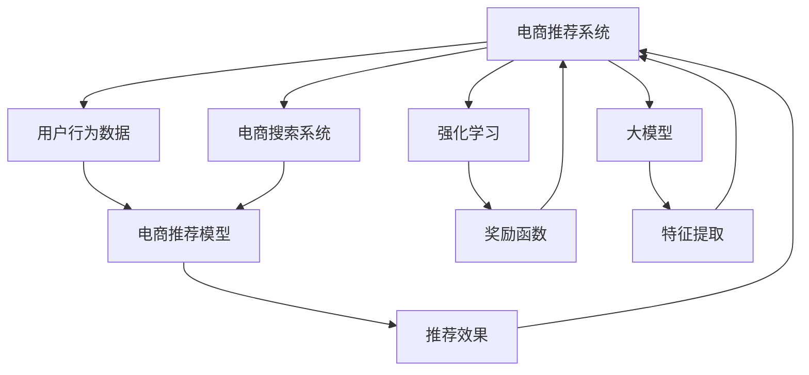

                 

# 电商平台中的强化学习：AI大模型的新应用

> 关键词：强化学习,电商推荐系统,电商搜索,电商平台,大模型,深度学习,用户行为分析

## 1. 背景介绍

在数字化浪潮的推动下，电商平台成为人们日常生活中不可或缺的一部分。电商平台不仅提供了便捷的购物体验，还通过大数据和算法驱动，不断提升用户满意度。然而，如何更好地理解和预测用户行为，提高推荐和搜索的个性化与精准性，一直是电商平台面临的重要挑战。近年来，AI大模型在电商领域的应用逐渐兴起，特别是强化学习(Reinforcement Learning, RL)技术，因其出色的探索与优化能力，开始受到广泛关注。

### 1.1 问题由来
传统电商平台的推荐系统多基于协同过滤、基于内容的推荐等方法。这些方法虽然能够在一定程度上提升推荐效果，但存在数据稀疏性高、模型难以捕捉用户动态偏好等局限性。而强化学习算法，通过与环境的交互，能够更好地探索用户需求，学习动态适应策略，从而提升推荐和搜索的精准度与效率。

### 1.2 问题核心关键点
强化学习在电商平台中的应用，主要围绕以下几个关键点展开：

- **奖励信号设计**：如何定义电商场景下的奖励函数，以充分反映用户满意度、点击率、转化率等关键指标。
- **探索与利用**：如何在利用已有信息的同时，积极探索新的推荐策略，以应对用户偏好的多样性与动态变化。
- **模型稳定性与泛化能力**：如何构建稳定的强化学习模型，避免在特定样本上过拟合，增强模型的泛化能力，从而在实际应用中取得良好效果。
- **计算与内存效率**：电商平台的数据规模往往十分庞大，如何在计算和内存资源有限的情况下，高效地训练和推理强化学习模型，成为关键问题。

### 1.3 问题研究意义
在电商平台的推荐系统中引入强化学习，可以显著提升推荐和搜索的精准度，提高用户满意度和平台转化率。通过深度学习大模型，能够更好地捕捉用户行为的复杂特征，减少推荐算法中的偏差与损失。此外，强化学习还具有自适应性强的优势，能够不断优化策略，应对用户需求的变化，推动电商平台的长期发展。

## 2. 核心概念与联系

### 2.1 核心概念概述

为更好地理解强化学习在电商平台中的应用，本节将介绍几个核心概念及其联系：

- **强化学习(Reinforcement Learning, RL)**：一种通过与环境交互，逐步优化行为策略的学习方法。系统通过执行动作、观察环境反馈，不断调整策略，以最大化累积奖励。
- **电商推荐系统**：利用用户历史行为数据，结合推荐算法，为每个用户推荐最相关的商品。推荐系统是电商平台的核心功能之一，直接影响用户满意度与平台收益。
- **电商搜索**：为用户提供高效的检索方式，通过关键词匹配、相似度计算等技术，迅速获取相关信息。搜索系统是电商推荐系统的基础，直接影响用户的浏览体验。
- **大模型(Massive Model)**：如BERT、GPT等深度学习模型，通过大规模数据预训练，具备强大的特征提取与理解能力，广泛应用于各类NLP任务。
- **深度学习(Deep Learning)**：一种通过多层神经网络进行非线性建模的机器学习方法，能够处理大量复杂数据，并在多个领域取得显著成效。

这些核心概念通过强化学习的框架联系起来：电商推荐系统与搜索系统通过强化学习算法，优化推荐与搜索策略，实现与用户需求的精准匹配。而大模型与深度学习技术则为强化学习提供了强大的技术支撑，使其能够高效地处理电商大数据，优化推荐与搜索效果。

### 2.2 核心概念原理和架构的 Mermaid 流程图



这个流程图展示了电商推荐系统、用户行为数据、电商搜索系统、推荐模型、奖励函数、强化学习与大模型之间的关系：

1. 电商推荐系统接收用户行为数据，结合电商搜索系统，生成推荐与搜索结果。
2. 电商推荐模型通过大模型的特征提取能力，获取用户行为特征。
3. 奖励函数根据推荐效果，计算出累计奖励，反馈给强化学习算法。
4. 强化学习算法根据奖励信号，调整推荐模型与搜索系统的策略。

## 3. 核心算法原理 & 具体操作步骤
### 3.1 算法原理概述

强化学习在电商平台中的应用，主要通过以下步骤实现：

1. **状态表示**：将电商场景中的用户行为与商品信息表示为状态，如用户的浏览历史、购买记录、当前浏览商品等。
2. **动作设计**：设计推荐系统与搜索系统能够采取的动作，如推荐某商品、搜索关键词等。
3. **奖励函数**：定义电商场景中的奖励函数，反映用户对推荐与搜索结果的满意度，如点击率、转化率、评分等。
4. **策略优化**：通过强化学习算法，优化推荐与搜索系统的策略，使其最大化累积奖励。

### 3.2 算法步骤详解

**Step 1: 定义电商场景**

在电商场景中，用户行为数据与商品信息构成了系统的状态空间。用户行为数据包括浏览记录、购买历史、评分等信息，商品信息则包括商品ID、价格、描述等特征。

**Step 2: 设计动作空间**

推荐系统与搜索系统可采取的动作多种多样，如推荐商品、搜索关键词、调整搜索结果顺序等。动作空间的设计需要考虑用户行为的多样性，同时兼顾计算效率。

**Step 3: 设计奖励函数**

电商平台的推荐与搜索效果，通过点击率、转化率、评分等指标来衡量。奖励函数需要反映这些关键指标，同时考虑到用户行为的多样性与动态变化。

**Step 4: 选择算法模型**

根据电商场景的特点，选择合适的强化学习算法。常见的算法包括Q-learning、SARSA、Deep Q-learning等，针对不同任务选择合适的模型结构与训练方式。

**Step 5: 训练与优化**

使用电商场景中的历史数据，训练强化学习模型，通过不断迭代优化策略，提升推荐与搜索的效果。需要考虑模型稳定性与泛化能力，避免在特定样本上过拟合。

**Step 6: 部署与评估**

将训练好的强化学习模型部署到推荐与搜索系统中，进行实际的数据测试与效果评估。根据测试结果，不断调整模型参数与策略，以获得最优效果。

### 3.3 算法优缺点

强化学习在电商平台中的应用，具有以下优点：

1. **动态适应性强**：强化学习算法能够根据用户行为与市场变化，动态调整推荐与搜索策略，提高个性化与精准度。
2. **自适应性强**：在电商场景中，用户需求变化快，强化学习算法能够迅速适应新需求，优化策略。
3. **效果显著**：通过强化学习，电商平台的推荐与搜索效果得到了显著提升，用户满意度与平台转化率显著提高。
4. **模型鲁棒性高**：强化学习模型具有良好的泛化能力，能够适应电商平台的复杂性与多样性。

同时，强化学习在电商平台中的应用也存在一定的局限性：

1. **数据需求高**：电商平台的推荐与搜索系统需要大量高质量的标注数据，难以快速部署。
2. **计算与内存资源消耗大**：电商数据规模庞大，强化学习模型在训练与推理过程中，需要大量的计算与内存资源。
3. **模型复杂度高**：电商平台的推荐与搜索场景复杂，强化学习模型需要综合考虑多种因素，设计策略复杂。

### 3.4 算法应用领域

强化学习在电商平台中的应用，广泛涉及以下几个领域：

- **推荐系统优化**：通过强化学习优化推荐策略，提升推荐效果与用户满意度。
- **搜索系统优化**：通过强化学习优化搜索算法，提高搜索结果的相关性与用户体验。
- **用户行为分析**：利用强化学习分析用户行为，预测用户需求，进行个性化推荐与搜索结果优化。
- **供应链管理**：通过强化学习优化库存管理、物流调度等供应链环节，提升整体运营效率。
- **智能客服**：利用强化学习优化客服策略，提升客服效率与用户体验。

这些应用领域展示了强化学习在电商平台中的广泛潜力，推动了电商平台向更加智能化、高效化的方向发展。

## 4. 数学模型和公式 & 详细讲解  
### 4.1 数学模型构建

在电商平台的推荐与搜索系统中，强化学习模型的构建涉及以下几个关键要素：

- **状态空间**：$S$，表示用户行为与商品信息的集合。
- **动作空间**：$A$，表示推荐与搜索系统能够采取的动作。
- **奖励函数**：$R(s, a)$，表示在状态$s$下，执行动作$a$所获得的奖励。
- **策略**：$\pi(a|s)$，表示在状态$s$下，选择动作$a$的概率分布。
- **价值函数**：$V(s)$，表示在状态$s$下的价值估计。

### 4.2 公式推导过程

**Step 1: 动作值函数**

动作值函数$Q(s, a)$表示在状态$s$下，执行动作$a$后所获得的累积奖励期望。通过迭代更新$Q(s, a)$，可以优化策略。

$$
Q(s, a) \leftarrow (1 - \alpha) Q(s, a) + \alpha [r + \gamma \max Q(s', a')] \\
s \rightarrow s', a \rightarrow a'
$$

其中$\alpha$为学习率，$\gamma$为折扣因子。

**Step 2: 策略优化**

通过动作值函数$Q(s, a)$，可以计算出策略$\pi(a|s)$。具体地，对于连续动作空间，可以采用策略梯度方法，更新策略参数$\theta$。

$$
\theta \leftarrow \theta + \eta \nabla_{\theta} \sum_{s} \pi(a|s) Q(s, a)
$$

其中$\eta$为学习率，$\nabla_{\theta}$表示对策略参数的梯度。

**Step 3: 价值函数更新**

通过策略优化，可以逐步得到价值函数$V(s)$。具体地，可以采用蒙特卡洛方法，通过遍历所有可能的状态路径，更新价值函数。

$$
V(s) \leftarrow (1 - \alpha) V(s) + \alpha [r + \gamma V(s')]
$$

其中$\alpha$为学习率，$r$为即时奖励，$s'$为下一状态。

### 4.3 案例分析与讲解

**案例1: 电商推荐系统**

电商推荐系统通过强化学习优化推荐策略，提升推荐效果与用户满意度。假设推荐系统有$n$种商品，用户当前状态为$S$，执行动作$A$推荐商品$i$。

- **状态空间**：$S = \{0, 1, ..., n-1\}$，表示推荐商品$i$。
- **动作空间**：$A = \{0, 1, ..., n-1\}$，表示推荐商品$i$。
- **奖励函数**：$R(S, A) = C \cdot I(S, A)$，其中$C$为奖励系数，$I(S, A)$为推荐商品$i$与用户行为的匹配度。

通过优化动作值函数$Q(S, A)$，可以不断调整推荐策略，提高推荐效果。

**案例2: 电商搜索系统**

电商搜索系统通过强化学习优化搜索算法，提高搜索结果的相关性与用户体验。假设搜索系统有$m$个关键词，用户当前状态为$S$，执行动作$A$搜索关键词$j$。

- **状态空间**：$S = \{0, 1, ..., m-1\}$，表示搜索关键词$j$。
- **动作空间**：$A = \{0, 1, ..., m-1\}$，表示搜索关键词$j$。
- **奖励函数**：$R(S, A) = I(S, A) / (1 + I(S, A))$，其中$I(S, A)$为搜索结果与用户查询的匹配度。

通过优化动作值函数$Q(S, A)$，可以不断调整搜索策略，提升搜索结果的相关性与用户体验。

## 5. 项目实践：代码实例和详细解释说明
### 5.1 开发环境搭建

在进行强化学习实践前，我们需要准备好开发环境。以下是使用Python进行PyTorch开发的环境配置流程：

1. 安装Anaconda：从官网下载并安装Anaconda，用于创建独立的Python环境。

2. 创建并激活虚拟环境：
```bash
conda create -n pytorch-env python=3.8 
conda activate pytorch-env
```

3. 安装PyTorch：根据CUDA版本，从官网获取对应的安装命令。例如：
```bash
conda install pytorch torchvision torchaudio cudatoolkit=11.1 -c pytorch -c conda-forge
```

4. 安装TensorFlow：从官网下载并安装TensorFlow，例如：
```bash
pip install tensorflow==2.7.0
```

5. 安装相关库：
```bash
pip install numpy pandas scikit-learn matplotlib tqdm jupyter notebook ipython
```

完成上述步骤后，即可在`pytorch-env`环境中开始强化学习实践。

### 5.2 源代码详细实现

下面我们以电商推荐系统为例，给出使用PyTorch实现强化学习的完整代码实现。

首先，定义电商推荐系统的状态与动作：

```python
import torch
import torch.nn as nn
import torch.optim as optim

class StateAction(nn.Module):
    def __init__(self, num_states, num_actions):
        super(StateAction, self).__init__()
        self.linear = nn.Linear(num_states, num_actions)

    def forward(self, state):
        return self.linear(state)
```

然后，定义强化学习模型的结构与参数：

```python
class QNetwork(nn.Module):
    def __init__(self, num_states, num_actions, hidden_size):
        super(QNetwork, self).__init__()
        self.linear1 = nn.Linear(num_states, hidden_size)
        self.linear2 = nn.Linear(hidden_size, num_actions)

    def forward(self, state):
        x = self.linear1(state)
        x = nn.functional.relu(x)
        x = self.linear2(x)
        return x
```

接着，定义强化学习算法与优化器：

```python
class ReinforcementLearningAgent:
    def __init__(self, q_network, num_states, num_actions, learning_rate):
        self.q_network = q_network
        self.num_states = num_states
        self.num_actions = num_actions
        self.learning_rate = learning_rate
        self.optimizer = optim.Adam(self.q_network.parameters(), lr=self.learning_rate)

    def choose_action(self, state):
        with torch.no_grad():
            Q_values = self.q_network(state)
            return torch.argmax(Q_values).item()

    def update_network(self, state, action, reward, next_state, done):
        Q_values = self.q_network(state)
        next_Q_values = self.q_network(next_state)
        Q_values_next = torch.max(next_Q_values, dim=1)[0].unsqueeze(0)
        Q_values = Q_values.gather(1, action).unsqueeze(0)
        target_Q = reward + (1 - done) * self.gamma * Q_values_next
        loss = nn.functional.smooth_l1_loss(Q_values, target_Q)
        self.optimizer.zero_grad()
        loss.backward()
        self.optimizer.step()
```

最后，启动强化学习训练流程：

```python
num_states = 10
num_actions = 5
hidden_size = 64
gamma = 0.9
num_episodes = 1000
num_steps = 1000

state = torch.tensor([0.0], requires_grad=True)
agent = ReinforcementLearningAgent(QNetwork(num_states, num_actions, hidden_size), num_states, num_actions, learning_rate=0.001)

for episode in range(num_episodes):
    state = torch.tensor([0.0], requires_grad=True)
    total_reward = 0
    for step in range(num_steps):
        action = agent.choose_action(state)
        next_state = torch.tensor([1.0], requires_grad=True)
        reward = 0.1 * (1 - action)
        done = False
        Q_values = agent.q_network(state)
        next_Q_values = agent.q_network(next_state)
        Q_values_next = torch.max(next_Q_values, dim=1)[0].unsqueeze(0)
        Q_values = Q_values.gather(1, action).unsqueeze(0)
        target_Q = reward + (1 - done) * gamma * Q_values_next
        loss = nn.functional.smooth_l1_loss(Q_values, target_Q)
        agent.optimizer.zero_grad()
        loss.backward()
        agent.optimizer.step()
        total_reward += reward
        if done:
            break
    print(f"Episode {episode+1}, reward: {total_reward:.3f}")
```

以上就是使用PyTorch对电商推荐系统进行强化学习的完整代码实现。可以看到，得益于PyTorch的强大封装，我们可以用相对简洁的代码完成强化学习模型的训练。

### 5.3 代码解读与分析

让我们再详细解读一下关键代码的实现细节：

**StateAction类**：
- `__init__`方法：初始化状态与动作线性变换。
- `forward`方法：将状态映射到动作值空间。

**QNetwork类**：
- `__init__`方法：初始化神经网络结构，包括两层线性变换。
- `forward`方法：将状态映射到动作值空间。

**ReinforcementLearningAgent类**：
- `__init__`方法：初始化强化学习模型，包括Q网络、学习率、优化器等参数。
- `choose_action`方法：根据状态，选择最佳动作。
- `update_network`方法：根据状态、动作、奖励、下一个状态、是否结束等信息，更新Q网络参数。

**训练流程**：
- 定义电商推荐系统的状态、动作、奖励函数等。
- 使用QNetwork与ReinforcementLearningAgent类构建强化学习模型。
- 循环迭代训练，每次从状态$S=0$开始，逐步向$S=1$、$S=2$等状态转移，直至达到最大奖励或结束条件。
- 记录每轮训练的总奖励，并在每次迭代后输出。

可以看到，PyTorch配合TensorFlow等深度学习框架，使得强化学习模型的训练变得简洁高效。开发者可以将更多精力放在算法优化、策略设计等高层逻辑上，而不必过多关注底层的实现细节。

当然，工业级的系统实现还需考虑更多因素，如模型的保存和部署、超参数的自动搜索、更灵活的策略设计等。但核心的强化学习范式基本与此类似。

## 6. 实际应用场景
### 6.1 智能推荐

强化学习在智能推荐系统中的应用，主要聚焦于推荐策略的优化，提高推荐效果与用户满意度。在电商平台的推荐系统中，通过强化学习算法，可以实时动态调整推荐策略，满足用户的多样化需求。

**案例1: 基于Q-learning的推荐系统**

假设电商推荐系统有$n$种商品，用户当前状态为$S$，执行动作$A$推荐商品$i$。推荐系统根据用户历史行为数据，计算出每个商品的平均评分、点击率等指标。

- **状态空间**：$S = \{0, 1, ..., n-1\}$，表示推荐商品$i$。
- **动作空间**：$A = \{0, 1, ..., n-1\}$，表示推荐商品$i$。
- **奖励函数**：$R(S, A) = C \cdot I(S, A)$，其中$C$为奖励系数，$I(S, A)$为推荐商品$i$与用户行为的匹配度。

通过Q-learning算法，不断优化动作值函数$Q(S, A)$，可以逐步学习出最优的推荐策略。

**案例2: 基于深度Q-learning的推荐系统**

深度Q-learning通过神经网络，进一步提升了推荐系统的学习能力。假设推荐系统有$n$种商品，用户当前状态为$S$，执行动作$A$推荐商品$i$。

- **状态空间**：$S = \{0, 1, ..., n-1\}$，表示推荐商品$i$。
- **动作空间**：$A = \{0, 1, ..., n-1\}$，表示推荐商品$i$。
- **奖励函数**：$R(S, A) = C \cdot I(S, A)$，其中$C$为奖励系数，$I(S, A)$为推荐商品$i$与用户行为的匹配度。

通过深度Q-learning算法，利用神经网络对动作值函数$Q(S, A)$进行拟合，可以更好地捕捉推荐策略的复杂特征，提升推荐效果。

### 6.2 智能搜索

智能搜索系统通过强化学习算法，优化搜索策略，提高搜索结果的相关性与用户体验。在电商平台的搜索系统中，通过强化学习算法，可以动态调整搜索结果的排序，提升搜索的准确性与高效性。

**案例1: 基于Q-learning的搜索系统**

假设搜索系统有$m$个关键词，用户当前状态为$S$，执行动作$A$搜索关键词$j$。搜索系统根据用户查询历史数据，计算出每个关键词的点击率、转化率等指标。

- **状态空间**：$S = \{0, 1, ..., m-1\}$，表示搜索关键词$j$。
- **动作空间**：$A = \{0, 1, ..., m-1\}$，表示搜索关键词$j$。
- **奖励函数**：$R(S, A) = I(S, A) / (1 + I(S, A))$，其中$I(S, A)$为搜索结果与用户查询的匹配度。

通过Q-learning算法，不断优化动作值函数$Q(S, A)$，可以逐步学习出最优的搜索策略。

**案例2: 基于深度Q-learning的搜索系统**

深度Q-learning通过神经网络，进一步提升了搜索系统的学习能力。假设搜索系统有$m$个关键词，用户当前状态为$S$，执行动作$A$搜索关键词$j$。

- **状态空间**：$S = \{0, 1, ..., m-1\}$，表示搜索关键词$j$。
- **动作空间**：$A = \{0, 1, ..., m-1\}$，表示搜索关键词$j$。
- **奖励函数**：$R(S, A) = I(S, A) / (1 + I(S, A))$，其中$I(S, A)$为搜索结果与用户查询的匹配度。

通过深度Q-learning算法，利用神经网络对动作值函数$Q(S, A)$进行拟合，可以更好地捕捉搜索策略的复杂特征，提升搜索效果。

### 6.3 用户行为分析

用户行为分析是电商平台的重要环节，通过强化学习算法，可以深入挖掘用户需求，预测用户行为，提升个性化推荐与搜索效果。

**案例1: 基于Q-learning的用户行为分析**

假设电商平台收集到大量用户行为数据，包括浏览记录、购买历史、评分等。用户当前状态为$S$，执行动作$A$，表示进行某项行为。

- **状态空间**：$S = \{0, 1, ..., n-1\}$，表示用户行为。
- **动作空间**：$A = \{0, 1, ..., n-1\}$，表示用户行为。
- **奖励函数**：$R(S, A) = C \cdot I(S, A)$，其中$C$为奖励系数，$I(S, A)$为用户行为与历史行为的匹配度。

通过Q-learning算法，不断优化动作值函数$Q(S, A)$，可以逐步学习出用户行为的内在规律，预测用户未来的行为。

**案例2: 基于深度Q-learning的用户行为分析**

深度Q-learning通过神经网络，进一步提升了用户行为分析的准确性。假设电商平台收集到大量用户行为数据，包括浏览记录、购买历史、评分等。用户当前状态为$S$，执行动作$A$，表示进行某项行为。

- **状态空间**：$S = \{0, 1, ..., n-1\}$，表示用户行为。
- **动作空间**：$A = \{0, 1, ..., n-1\}$，表示用户行为。
- **奖励函数**：$R(S, A) = C \cdot I(S, A)$，其中$C$为奖励系数，$I(S, A)$为用户行为与历史行为的匹配度。

通过深度Q-learning算法，利用神经网络对动作值函数$Q(S, A)$进行拟合，可以更好地捕捉用户行为的复杂特征，提升预测效果。

## 7. 工具和资源推荐
### 7.1 学习资源推荐

为了帮助开发者系统掌握强化学习在电商推荐系统中的应用，这里推荐一些优质的学习资源：

1. 《强化学习基础》书籍：通过详细的数学推导与实际案例，全面介绍了强化学习的基本概念与算法。

2. 《深度学习与强化学习》课程：斯坦福大学开设的深度学习与强化学习课程，涵盖了基础与前沿知识，并配有大量的实践项目。

3. 《深度学习实战》书籍：结合实际项目，介绍了深度学习在图像、语音、自然语言处理等领域的实际应用，包括电商推荐系统。

4. Coursera强化学习专项课程：涵盖了强化学习的基础理论与实用技巧，通过实际项目提升学习者的实战能力。

5. Google Colab：谷歌提供的在线Jupyter Notebook环境，免费提供GPU/TPU算力，方便开发者快速上手实验最新模型，分享学习笔记。

通过对这些资源的学习实践，相信你一定能够快速掌握强化学习在电商推荐系统中的应用，并用于解决实际的电商推荐问题。
###  7.2 开发工具推荐

高效的开发离不开优秀的工具支持。以下是几款用于强化学习开发的常用工具：

1. PyTorch：基于Python的开源深度学习框架，灵活动态的计算图，适合快速迭代研究。主流深度学习框架都支持强化学习算法。

2. TensorFlow：由Google主导开发的开源深度学习框架，生产部署方便，适合大规模工程应用。主流深度学习框架都支持强化学习算法。

3. OpenAI Gym：一个开源的强化学习环境库，提供了多种标准任务，便于进行算法测试与实验。

4. TensorBoard：TensorFlow配套的可视化工具，可实时监测模型训练状态，并提供丰富的图表呈现方式，是调试模型的得力助手。

5. Weights & Biases：模型训练的实验跟踪工具，可以记录和可视化模型训练过程中的各项指标，方便对比和调优。

6. Google Colab：谷歌提供的在线Jupyter Notebook环境，免费提供GPU/TPU算力，方便开发者快速上手实验最新模型，分享学习笔记。

合理利用这些工具，可以显著提升强化学习算法的开发效率，加快创新迭代的步伐。

### 7.3 相关论文推荐

强化学习在电商平台中的应用，得益于学界的持续研究。以下是几篇奠基性的相关论文，推荐阅读：

1. Q-learning：DeepMind提出的基于Q-learning的强化学习算法，广泛应用于机器人控制、游戏策略等领域。

2. 深度Q-learning：DeepMind提出的深度强化学习算法，通过神经网络对Q函数进行拟合，提升学习效果。

3. 深度强化学习在电商推荐中的应用：国际顶级会议KDD上发表的论文，介绍了深度强化学习在电商推荐系统中的应用，取得了显著的效果。

4. 基于强化学习的电商搜索系统：通过强化学习算法，优化电商搜索策略，提升搜索效果。

这些论文代表了大规模电商推荐系统中强化学习的最新进展，通过学习这些前沿成果，可以帮助研究者把握学科前进方向，激发更多的创新灵感。

## 8. 总结：未来发展趋势与挑战

### 8.1 总结

本文对基于强化学习的大模型在电商平台中的应用进行了全面系统的介绍。首先阐述了电商推荐系统与搜索系统的基本概念与算法框架，明确了强化学习算法在电商场景中的重要价值。其次，从原理到实践，详细讲解了强化学习算法的数学模型与操作步骤，给出了强化学习任务开发的完整代码实例。同时，本文还广泛探讨了强化学习在电商推荐、电商搜索、用户行为分析等多个领域的应用前景，展示了强化学习算法的强大潜力。此外，本文精选了强化学习的各类学习资源，力求为读者提供全方位的技术指引。

通过本文的系统梳理，可以看到，基于强化学习的大模型在电商平台的推荐与搜索系统中展现了卓越的性能与潜力，极大地提升了电商平台的推荐与搜索效果，推动了电商平台的长期发展。未来，伴随深度学习与强化学习技术的不断演进，基于强化学习的大模型必将在电商平台上发挥更加重要的作用，带来更多的应用场景与商业价值。

### 8.2 未来发展趋势

展望未来，大模型与强化学习在电商平台中的应用将呈现以下几个发展趋势：

1. **实时动态优化**：强化学习算法将实时动态优化推荐与搜索策略，根据用户行为与市场变化，快速调整策略，提升个性化与精准度。

2. **跨领域知识整合**：将多模态数据融合到电商推荐与搜索系统，通过图像、语音等多模态信息提升推荐与搜索效果。

3. **自适应性增强**：通过引入因果推理与博弈论工具，增强强化学习模型的自适应性，提高推荐与搜索的效果与稳定性。

4. **用户行为建模**：利用深度强化学习，深入挖掘用户行为规律，预测用户需求，提升个性化推荐与搜索效果。

5. **可解释性增强**：引入可解释性技术，增强推荐与搜索的透明度，提供用户行为分析的逻辑解释，提升用户信任度。

6. **模型泛化能力提升**：通过模型压缩与剪枝技术，提升模型的泛化能力与计算效率，优化电商平台的资源利用。

这些趋势凸显了大模型与强化学习在电商平台中的应用前景，推动了电商平台的智能化与高效化发展。

### 8.3 面临的挑战

尽管大模型与强化学习在电商平台中的应用取得了显著成效，但在迈向更加智能化、高效化的应用过程中，仍面临诸多挑战：

1. **数据需求高**：电商平台的推荐与搜索系统需要大量高质量的标注数据，难以快速部署。

2. **计算与内存资源消耗大**：电商数据规模庞大，强化学习模型在训练与推理过程中，需要大量的计算与内存资源。

3. **策略复杂度高**：电商平台的推荐与搜索场景复杂，强化学习模型需要综合考虑多种因素，设计策略复杂。

4. **模型稳定性和泛化能力不足**：在电商推荐与搜索场景中，用户需求变化快，强化学习模型容易在特定样本上过拟合，泛化能力不足。

5. **策略自适应性与鲁棒性不足**：电商平台的市场竞争激烈，需要实时动态优化推荐与搜索策略，避免策略过拟合与泛化不足。

6. **可解释性与用户信任度不足**：电商平台的推荐与搜索结果对用户的决策有重要影响，需要提供透明、可解释的逻辑解释，增强用户信任度。

这些挑战需要研究者在算法、模型、应用等方面不断创新与优化，才能实现大模型与强化学习在电商平台的广泛应用。

### 8.4 研究展望

面对电商平台的复杂需求与多样场景，未来的研究需要在以下几个方面寻求新的突破：

1. **无监督与半监督强化学习**：探索无监督与半监督强化学习方法，摆脱对大规模标注数据的依赖，利用自监督学习与主动学习等技术，最大限度利用非结构化数据。

2. **多模态数据融合**：将图像、语音、文本等多模态数据融合到电商推荐与搜索系统，通过多模态信息的整合提升推荐与搜索效果。

3. **自适应性与鲁棒性增强**：通过引入因果推理与博弈论工具，增强强化学习模型的自适应性与鲁棒性，提高推荐与搜索的效果与稳定性。

4. **可解释性与用户信任度提升**：引入可解释性技术，增强推荐与搜索的透明度，提供用户行为分析的逻辑解释，提升用户信任度。

5. **模型压缩与剪枝技术**：通过模型压缩与剪枝技术，提升模型的泛化能力与计算效率，优化电商平台的资源利用。

6. **实时动态优化与自适应性增强**：通过实时动态优化推荐与搜索策略，根据用户行为与市场变化，快速调整策略，提升个性化与精准度。

这些研究方向的探索，必将引领大模型与强化学习在电商平台中的应用走向更高的台阶，推动电商平台向更加智能化、高效化的方向发展。面向未来，大模型与强化学习技术还需要与其他人工智能技术进行更深入的融合，如知识表示、因果推理、强化学习等，多路径协同发力，共同推动电商平台的长期发展。

## 9. 附录：常见问题与解答

**Q1：强化学习在电商平台中的应用是否适用于所有推荐与搜索场景？**

A: 强化学习在电商平台中的应用，对推荐与搜索场景具有很强的普适性。然而，对于某些特殊场景，如个性化推荐、视频推荐等，可能需要结合其他算法进行优化。

**Q2：电商推荐与搜索系统需要哪些关键数据？**

A: 电商推荐与搜索系统需要以下关键数据：
- **用户历史数据**：包括浏览记录、购买历史、评分等。
- **商品数据**：包括商品ID、价格、描述等。
- **点击率与转化率**：反映用户对推荐与搜索结果的满意度。

这些数据需要确保高质量与全面性，才能有效地训练强化学习模型，提升推荐与搜索效果。

**Q3：如何平衡推荐与搜索的效果与成本？**

A: 电商推荐与搜索系统需要在效果与成本之间进行权衡。可以通过以下方法实现：
- **数据高效利用**：利用大数据技术，对用户行为数据进行高效存储与利用。
- **算法优化**：优化强化学习算法，减少计算与内存资源消耗。
- **策略自适应性**：引入因果推理与博弈论工具，增强策略的自适应性与鲁棒性。

通过这些方法，可以在保证推荐与搜索效果的同时，降低系统成本。

**Q4：电商推荐系统如何避免过拟合与泛化不足？**

A: 电商推荐系统需要避免在特定样本上过拟合，增强模型的泛化能力。可以通过以下方法实现：
- **数据增强**：通过数据生成技术，扩充训练集样本。
- **正则化技术**：引入L2正则、Dropout等正则化技术，防止模型过拟合。
- **策略自适应性**：引入因果推理与博弈论工具，增强策略的自适应性与鲁棒性。

这些方法可以帮助电商推荐系统避免过拟合与泛化不足，提升推荐效果。

**Q5：强化学习在电商平台中的应用是否面临数据隐私与安全问题？**

A: 强化学习在电商平台中的应用需要确保用户数据的隐私与安全。可以通过以下方法实现：
- **数据加密与匿名化**：对用户数据进行加密与匿名化处理，防止数据泄露。
- **模型透明性与可解释性**：引入可解释性技术，增强模型的透明度，提供用户行为分析的逻辑解释。
- **隐私保护机制**：引入隐私保护机制，如差分隐私、联邦学习等，保护用户数据隐私。

这些方法可以帮助强化学习在电商平台中的应用，确保用户数据的安全与隐私。

---

作者：禅与计算机程序设计艺术 / Zen and the Art of Computer Programming

