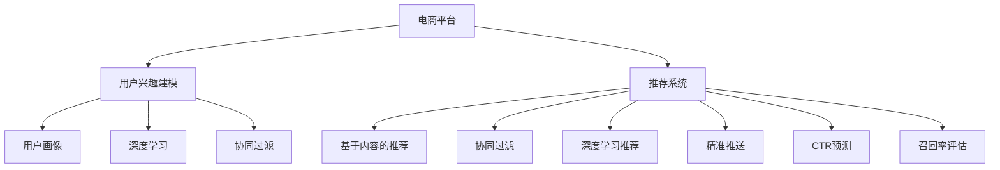

                 

# 电商平台中的用户兴趣分层与精准推送

> 关键词：电商平台,用户行为分析,兴趣分层,精准推送,推荐系统,用户画像,深度学习,协同过滤,CTR预测,召回率

## 1. 背景介绍

在当前数字化转型的大背景下，电商平台作为消费者与商家互动的重要平台，通过精准推荐系统实现了个性化服务，显著提升了用户购物体验和商家营收效率。但随着用户行为的多样性和动态性，如何更好地捕捉用户兴趣，实现更高效的精准推荐，成为平台提升竞争力的关键问题。

本文将系统探讨基于用户兴趣分层的精准推送算法，包括用户兴趣建模、推荐模型构建、推荐系统优化等关键技术点。我们将结合实际电商平台的场景，从理论到实践，详细阐述如何构建高精度的个性化推荐引擎，为电商平台的运营提供数据驱动的精准营销解决方案。

## 2. 核心概念与联系

### 2.1 核心概念概述

为更好地理解电商平台中的用户兴趣分层与精准推送算法，本节将介绍几个核心概念：

- **电商平台(E-commerce Platform)**：以在线销售商品为主要业务的数字化平台，如亚马逊、京东、淘宝等。通过精准推荐系统为消费者提供个性化商品和服务，提升用户购物体验和商家营收效率。

- **用户兴趣建模(User Interest Modeling)**：通过分析用户历史行为数据，构建用户兴趣特征模型，以便预测用户可能感兴趣的物品。

- **推荐系统(Recommendation System)**：基于用户兴趣模型，通过算法自动化推荐用户可能感兴趣的物品。典型的推荐系统包括协同过滤、基于内容的推荐、深度学习推荐等。

- **精准推送(Personalized Recommendation)**：针对每个用户的兴趣模型，构建个性化推荐列表，并通过个性化展示界面推送至用户端，实现精准营销。

- **用户画像(User Profile)**：通过综合分析用户行为数据、社会属性、商品购买记录等信息，构建用户画像，提供全面且精细的用户描述。

- **深度学习(Deep Learning)**：通过构建多层神经网络，实现对用户行为数据的深度学习，预测用户兴趣，提升推荐系统效果。

- **协同过滤(Collaborative Filtering)**：通过分析用户历史行为数据和物品特征，推荐与用户相似的用户喜欢的物品，包括基于用户的协同过滤和基于物品的协同过滤。

- **CTR预测(Click-Through Rate Prediction)**：预测用户点击某商品的概率，用于评估推荐效果和优化推荐策略。

- **召回率(Recall Rate)**：推荐系统中推荐的相关物品占实际相关物品的比例，用于衡量推荐系统的全面性和覆盖度。

这些核心概念之间的逻辑关系可以通过以下Mermaid流程图来展示：



这个流程图展示了几大核心概念及其之间的关系：

1. 电商平台通过用户兴趣建模获得用户兴趣特征，构建用户画像。
2. 推荐系统利用用户画像，结合深度学习、协同过滤等方法，构建个性化推荐列表。
3. 精准推送算法将推荐结果推送至用户端，实现个性化服务。
4. CTR预测和召回率评估用于衡量推荐系统性能，指导推荐模型优化。

这些概念共同构成了电商推荐系统的核心框架，使得平台能够高效地进行个性化推荐，提升用户满意度。

## 3. 核心算法原理 & 具体操作步骤
### 3.1 算法原理概述

基于用户兴趣分层的精准推送算法，本质上是通过深度学习模型和协同过滤技术，对用户历史行为数据进行分析，构建用户兴趣特征，并在此基础上进行推荐。核心思想是通过对用户兴趣的分层建模，提升推荐系统的精准度和覆盖度。

具体而言，算法流程如下：

1. **用户行为数据收集**：收集用户历史浏览、点击、购买等行为数据，形成用户行为序列。
2. **用户兴趣建模**：通过深度学习模型，分析用户行为序列，构建用户兴趣特征向量。
3. **物品特征提取**：通过预训练词向量模型(如Word2Vec、BERT等)，提取商品名称、描述、类别等特征。
4. **协同过滤**：通过分析用户行为和物品特征，推荐用户可能感兴趣的商品。
5. **精准推送**：根据用户兴趣特征，构建个性化推荐列表，并推送至用户端。
6. **模型评估与优化**：通过CTR预测和召回率评估，优化推荐模型参数，提升推荐效果。

### 3.2 算法步骤详解

#### 3.2.1 用户行为数据收集

用户行为数据是用户兴趣分层的基础。通常电商平台通过网站和APP端记录用户的行为数据，包括浏览、点击、购买、收藏、评论等行为。行为数据可以形成用户行为序列，用于后续分析。

**示例数据**：

| 时间 | 行为类型 | 物品ID | 物品类别 | 物品属性 |
| --- | --- | --- | --- | --- |
| 2023-01-01 10:00 | 浏览 | 1 | 电子产品 | 品牌：华为，价格：5000元 |
| 2023-01-01 10:05 | 点击 | 2 | 服装 | 尺码：L，颜色：黑色 |
| 2023-01-01 10:10 | 浏览 | 3 | 家居用品 | 品牌：宜家，价格：300元 |
| 2023-01-01 10:15 | 购买 | 2 | 服装 | 尺码：L，颜色：黑色 |

#### 3.2.2 用户兴趣建模

用户兴趣建模的核心是通过深度学习模型，从用户行为序列中提取用户兴趣特征。典型的深度学习模型包括RNN、LSTM、GRU、Transformers等。

以RNN为例，其模型结构如下：

```python
import tensorflow as tf
from tensorflow.keras.layers import SimpleRNN

# 定义RNN模型
model = tf.keras.Sequential([
    SimpleRNN(64, input_shape=(timesteps, features)),
    tf.keras.layers.Dense(128, activation='relu'),
    tf.keras.layers.Dense(1, activation='sigmoid')
])
```

模型输入为$t$时刻前的$t-1$个行为数据，输出为当前时刻的行为预测概率。

**训练过程**：

1. **数据准备**：将用户行为序列转化为模型输入和输出。
2. **模型训练**：使用随机梯度下降法优化模型参数。
3. **特征提取**：将模型输出转化为用户兴趣特征向量。

#### 3.2.3 物品特征提取

物品特征提取的核心是通过预训练词向量模型，提取商品名称、描述、类别等特征。

**示例数据**：

| 物品ID | 名称 | 描述 | 类别 |
| --- | --- | --- | --- |
| 1 | 华为P50 Pro | 华为最新旗舰，高清屏幕，人工智能，4000mAh电池 | 电子产品 |
| 2 | 阿迪达斯运动服 | 经典款式，耐穿透气，时尚设计 | 服装 |
| 3 | 宜家北欧风格书架 | 实木材质，简约设计，多种颜色可选 | 家居用品 |

通过Word2Vec模型，将物品名称和描述转化为向量表示：

```python
from gensim.models import Word2Vec

# 构建Word2Vec模型
word2vec = Word2Vec(sentences, min_count=1)

# 提取物品向量
item_vectors = []
for item in items:
    item_vector = []
    for word in item['name'].split():
        item_vector.append(word2vec[word])
    item_vectors.append(item_vector)
```

#### 3.2.4 协同过滤

协同过滤的核心是通过用户历史行为和物品特征，推荐用户可能感兴趣的商品。典型的协同过滤方法包括基于用户的协同过滤和基于物品的协同过滤。

以基于用户的协同过滤为例，其模型结构如下：

```python
from scipy.sparse import csr_matrix

# 构建用户行为矩阵
user behaviors = {}
for user, behaviors in user_behaviors.items():
    user_behaviors[user] = csr_matrix(behaviors)

# 构建用户兴趣向量
user interests = {}
for user, behaviors in user_behaviors.items():
    user_interests[user] = behaviors.sum(axis=1)

# 计算用户兴趣向量余弦相似度
similarity_matrix = user_interests.tocsr() @ user_interests.tocsc()
```

通过余弦相似度计算用户之间的兴趣相似度，并推荐与目标用户兴趣相似的其他用户喜欢的物品。

**推荐过程**：

1. **计算相似度**：计算目标用户与其他用户之间的兴趣相似度。
2. **筛选相似用户**：选择与目标用户兴趣相似度最高的用户。
3. **推荐物品**：将相似用户喜欢的物品推荐给目标用户。

#### 3.2.5 精准推送

精准推送的核心是根据用户兴趣特征，构建个性化推荐列表，并推送至用户端。

**推荐列表生成**：

1. **数据预处理**：根据用户兴趣特征和物品特征，生成推荐物品列表。
2. **个性化展示**：根据用户行为数据，动态调整推荐顺序。

**示例代码**：

```python
from sklearn.metrics.pairwise import cosine_similarity

# 生成推荐列表
def generate_recommendation_list(user, interests, items):
    recommendations = []
    for item in items:
        similarity = cosine_similarity(user_interests[user], item_vectors[item['id']])
        if similarity > 0.8:
            recommendations.append(item)
    return recommendations
```

#### 3.2.6 模型评估与优化

推荐系统的效果可以通过CTR预测和召回率评估来衡量。CTR表示用户点击某商品的概率，召回率表示推荐的相关物品占实际相关物品的比例。

**CTR预测**：

```python
from sklearn.metrics import roc_auc_score

# 构建CTR预测模型
def predict_ctr(user, interests, items):
    predictions = []
    for item in items:
        similarity = cosine_similarity(user_interests[user], item_vectors[item['id']])
        if similarity > 0.8:
            predictions.append(1)
        else:
            predictions.append(0)
    return predictions

# 计算CTR
def calculate_ctr(predictions, labels):
    return roc_auc_score(labels, predictions)
```

**召回率评估**：

```python
from sklearn.metrics import precision_score

# 计算召回率
def calculate_recall(user, interests, items):
    recommendations = generate_recommendation_list(user, interests, items)
    true_positives = sum([1 for item in recommendations if item['id'] in user_interests[user]])
    total_positives = sum([1 for item in items if item['id'] in user_interests[user]])
    return true_positives / total_positives
```

**模型优化**：

1. **超参数调整**：通过网格搜索或随机搜索，优化推荐模型参数。
2. **特征工程**：优化特征提取方法，提升模型性能。
3. **算法改进**：改进协同过滤算法，提升推荐效果。

### 3.3 算法优缺点

基于用户兴趣分层的精准推送算法具有以下优点：

1. **高精准度**：通过深度学习模型和协同过滤技术，准确捕捉用户兴趣，提升推荐系统精准度。
2. **个性化推荐**：根据用户兴趣分层，实现个性化推荐，提升用户体验。
3. **可扩展性**：可以无缝集成到现有推荐系统，易于部署和维护。
4. **低成本**：不需要额外标注数据，在现有用户行为数据上进行微调，降低成本。

同时，该算法也存在一些缺点：

1. **数据稀疏性**：用户行为数据存在稀疏性，难以覆盖所有用户和物品。
2. **冷启动问题**：对于新用户和新物品，需要更多的行为数据才能进行准确推荐。
3. **多样性**：过于聚焦用户兴趣，可能导致推荐结果过于单一，缺乏多样性。
4. **过拟合风险**：模型过度拟合用户历史行为数据，可能无法捕捉到最新的兴趣变化。

尽管存在这些局限性，但总体而言，基于用户兴趣分层的精准推送算法仍然是电商推荐系统的核心算法之一，在实际应用中取得了显著效果。

### 3.4 算法应用领域

基于用户兴趣分层的精准推送算法，已经在电商、社交、新闻等众多领域得到了广泛应用，显著提升了推荐系统效果。具体应用领域包括：

1. **电商推荐系统**：通过用户行为数据分析，实现个性化商品推荐，提升用户购物体验。
2. **新闻个性化推荐**：根据用户阅读习惯，推荐相关新闻和文章，提升用户粘性。
3. **社交网络推荐**：根据用户社交行为，推荐好友和兴趣内容，提升社交互动。
4. **广告精准投放**：通过用户兴趣分层，实现精准广告投放，提升广告效果。

## 4. 数学模型和公式 & 详细讲解  
### 4.1 数学模型构建

在基于用户兴趣分层的精准推送算法中，涉及多个数学模型，包括用户兴趣模型、物品特征模型和推荐模型。下面分别进行详细讲解。

#### 4.1.1 用户兴趣模型

用户兴趣模型通过深度学习模型，从用户行为序列中提取用户兴趣特征。以RNN模型为例，其输入为$t$时刻前的$t-1$个行为数据，输出为当前时刻的行为预测概率。

**公式推导**：

1. **输入层**：用户行为序列转化为模型输入。
2. **隐藏层**：RNN模型通过循环神经网络提取用户兴趣特征。
3. **输出层**：输出当前时刻的行为预测概率。

**公式表示**：

$$
f_t = \text{RNN}(\text{input}_{t-1}, \text{weight}_h, \text{weight}_x, \text{bias})
$$

其中，$\text{input}_{t-1}$为$t-1$时刻的用户行为数据，$\text{weight}_h$和$\text{weight}_x$分别为隐藏层和输入层权重，$\text{bias}$为偏置项。

#### 4.1.2 物品特征模型

物品特征模型通过预训练词向量模型，提取商品名称、描述、类别等特征。以Word2Vec模型为例，其输入为商品名称和描述，输出为向量表示。

**公式推导**：

1. **输入层**：商品名称和描述转化为模型输入。
2. **隐藏层**：Word2Vec模型通过Word2Vec算法提取向量表示。
3. **输出层**：输出向量表示。

**公式表示**：

$$
\text{item\_vector} = \text{Word2Vec}(\text{item\_name}, \text{item\_description}, \text{weight}_w, \text{bias})
$$

其中，$\text{item\_name}$和$\text{item\_description}$分别为商品名称和描述，$\text{weight}_w$和$\text{bias}$分别为权重和偏置项。

#### 4.1.3 推荐模型

推荐模型通过协同过滤技术，实现用户兴趣分层和个性化推荐。以基于用户的协同过滤为例，其输入为用户兴趣特征和物品特征，输出为推荐物品列表。

**公式推导**：

1. **输入层**：用户兴趣特征和物品特征转化为模型输入。
2. **隐藏层**：协同过滤模型通过相似度计算提取相似用户和物品。
3. **输出层**：输出推荐物品列表。

**公式表示**：

$$
\text{recommendations} = \text{User-Item Collaborative Filtering}(\text{user\_interests}, \text{item\_vectors}, \text{weight}_s, \text{bias})
$$

其中，$\text{user\_interests}$为用户兴趣特征，$\text{item\_vectors}$为物品特征，$\text{weight}_s$和$\text{bias}$分别为相似度计算权重和偏置项。

### 4.2 公式推导过程

#### 4.2.1 用户兴趣模型公式推导

用户兴趣模型通过深度学习模型，从用户行为序列中提取用户兴趣特征。以RNN模型为例，其输入为$t$时刻前的$t-1$个行为数据，输出为当前时刻的行为预测概率。

**公式推导**：

1. **输入层**：用户行为序列转化为模型输入。
2. **隐藏层**：RNN模型通过循环神经网络提取用户兴趣特征。
3. **输出层**：输出当前时刻的行为预测概率。

**公式表示**：

$$
f_t = \text{RNN}(\text{input}_{t-1}, \text{weight}_h, \text{weight}_x, \text{bias})
$$

其中，$\text{input}_{t-1}$为$t-1$时刻的用户行为数据，$\text{weight}_h$和$\text{weight}_x$分别为隐藏层和输入层权重，$\text{bias}$为偏置项。

#### 4.2.2 物品特征模型公式推导

物品特征模型通过预训练词向量模型，提取商品名称、描述、类别等特征。以Word2Vec模型为例，其输入为商品名称和描述，输出为向量表示。

**公式推导**：

1. **输入层**：商品名称和描述转化为模型输入。
2. **隐藏层**：Word2Vec模型通过Word2Vec算法提取向量表示。
3. **输出层**：输出向量表示。

**公式表示**：

$$
\text{item\_vector} = \text{Word2Vec}(\text{item\_name}, \text{item\_description}, \text{weight}_w, \text{bias})
$$

其中，$\text{item\_name}$和$\text{item\_description}$分别为商品名称和描述，$\text{weight}_w$和$\text{bias}$分别为权重和偏置项。

#### 4.2.3 推荐模型公式推导

推荐模型通过协同过滤技术，实现用户兴趣分层和个性化推荐。以基于用户的协同过滤为例，其输入为用户兴趣特征和物品特征，输出为推荐物品列表。

**公式推导**：

1. **输入层**：用户兴趣特征和物品特征转化为模型输入。
2. **隐藏层**：协同过滤模型通过相似度计算提取相似用户和物品。
3. **输出层**：输出推荐物品列表。

**公式表示**：

$$
\text{recommendations} = \text{User-Item Collaborative Filtering}(\text{user\_interests}, \text{item\_vectors}, \text{weight}_s, \text{bias})
$$

其中，$\text{user\_interests}$为用户兴趣特征，$\text{item\_vectors}$为物品特征，$\text{weight}_s$和$\text{bias}$分别为相似度计算权重和偏置项。

### 4.3 案例分析与讲解

以某电商平台的个性化推荐系统为例，详细讲解其推荐算法实现和优化过程。

#### 4.3.1 用户兴趣建模

用户兴趣建模的核心是通过深度学习模型，从用户行为序列中提取用户兴趣特征。以RNN模型为例，其模型结构如下：

```python
import tensorflow as tf
from tensorflow.keras.layers import SimpleRNN

# 定义RNN模型
model = tf.keras.Sequential([
    SimpleRNN(64, input_shape=(timesteps, features)),
    tf.keras.layers.Dense(128, activation='relu'),
    tf.keras.layers.Dense(1, activation='sigmoid')
])
```

模型输入为$t$时刻前的$t-1$个行为数据，输出为当前时刻的行为预测概率。

**训练过程**：

1. **数据准备**：将用户行为序列转化为模型输入和输出。
2. **模型训练**：使用随机梯度下降法优化模型参数。
3. **特征提取**：将模型输出转化为用户兴趣特征向量。

#### 4.3.2 物品特征提取

物品特征提取的核心是通过预训练词向量模型，提取商品名称、描述、类别等特征。以Word2Vec模型为例，其模型结构如下：

```python
from gensim.models import Word2Vec

# 构建Word2Vec模型
word2vec = Word2Vec(sentences, min_count=1)

# 提取物品向量
item_vectors = []
for item in items:
    item_vector = []
    for word in item['name'].split():
        item_vector.append(word2vec[word])
    item_vectors.append(item_vector)
```

通过Word2Vec模型，将物品名称和描述转化为向量表示。

#### 4.3.3 协同过滤

协同过滤的核心是通过用户历史行为和物品特征，推荐用户可能感兴趣的商品。以基于用户的协同过滤为例，其模型结构如下：

```python
from scipy.sparse import csr_matrix

# 构建用户行为矩阵
user behaviors = {}
for user, behaviors in user_behaviors.items():
    user_behaviors[user] = csr_matrix(behaviors)

# 构建用户兴趣向量
user interests = {}
for user, behaviors in user_behaviors.items():
    user_interests[user] = behaviors.sum(axis=1)

# 计算用户兴趣向量余弦相似度
similarity_matrix = user_interests.tocsr() @ user_interests.tocsc()
```

通过余弦相似度计算用户之间的兴趣相似度，并推荐与目标用户兴趣相似的其他用户喜欢的物品。

#### 4.3.4 精准推送

精准推送的核心是根据用户兴趣特征，构建个性化推荐列表，并推送至用户端。

**推荐列表生成**：

1. **数据预处理**：根据用户兴趣特征和物品特征，生成推荐物品列表。
2. **个性化展示**：根据用户行为数据，动态调整推荐顺序。

**示例代码**：

```python
from sklearn.metrics.pairwise import cosine_similarity

# 生成推荐列表
def generate_recommendation_list(user, interests, items):
    recommendations = []
    for item in items:
        similarity = cosine_similarity(user_interests[user], item_vectors[item['id']])
        if similarity > 0.8:
            recommendations.append(item)
    return recommendations
```

#### 4.3.5 模型评估与优化

推荐系统的效果可以通过CTR预测和召回率评估来衡量。CTR表示用户点击某商品的概率，召回率表示推荐的相关物品占实际相关物品的比例。

**CTR预测**：

```python
from sklearn.metrics import roc_auc_score

# 构建CTR预测模型
def predict_ctr(user, interests, items):
    predictions = []
    for item in items:
        similarity = cosine_similarity(user_interests[user], item_vectors[item['id']])
        if similarity > 0.8:
            predictions.append(1)
        else:
            predictions.append(0)
    return predictions

# 计算CTR
def calculate_ctr(predictions, labels):
    return roc_auc_score(labels, predictions)
```

**召回率评估**：

```python
from sklearn.metrics import precision_score

# 计算召回率
def calculate_recall(user, interests, items):
    recommendations = generate_recommendation_list(user, interests, items)
    true_positives = sum([1 for item in recommendations if item['id'] in user_interests[user]])
    total_positives = sum([1 for item in items if item['id'] in user_interests[user]])
    return true_positives / total_positives
```

**模型优化**：

1. **超参数调整**：通过网格搜索或随机搜索，优化推荐模型参数。
2. **特征工程**：优化特征提取方法，提升模型性能。
3. **算法改进**：改进协同过滤算法，提升推荐效果。

## 5. 项目实践：代码实例和详细解释说明
### 5.1 开发环境搭建

在进行推荐系统开发前，我们需要准备好开发环境。以下是使用Python进行TensorFlow开发的环境配置流程：

1. 安装Anaconda：从官网下载并安装Anaconda，用于创建独立的Python环境。

2. 创建并激活虚拟环境：
```bash
conda create -n tensorflow-env python=3.8 
conda activate tensorflow-env
```

3. 安装TensorFlow：根据CUDA版本，从官网获取对应的安装命令。例如：
```bash
conda install tensorflow tensorflow-gpu=2.7 -c pytorch -c conda-forge
```

4. 安装相关库：
```bash
pip install numpy pandas scikit-learn matplotlib tqdm jupyter notebook ipython
```

完成上述步骤后，即可在`tensorflow-env`环境中开始推荐系统开发。

### 5.2 源代码详细实现

下面我们以用户兴趣分层推荐系统为例，给出使用TensorFlow实现个性化推荐系统的完整代码实现。

首先，定义用户兴趣模型：

```python
import tensorflow as tf
from tensorflow.keras.layers import SimpleRNN

# 定义RNN模型
model = tf.keras.Sequential([
    SimpleRNN(64, input_shape=(timesteps, features)),
    tf.keras.layers.Dense(128, activation='relu'),
    tf.keras.layers.Dense(1, activation='sigmoid')
])
```

然后，定义物品特征模型：

```python
from gensim.models import Word2Vec

# 构建Word2Vec模型
word2vec = Word2Vec(sentences, min_count=1)

# 提取物品向量
item_vectors = []
for item in items:
    item_vector = []
    for word in item['name'].split():
        item_vector.append(word2vec[word])
    item_vectors.append(item_vector)
```

接着，定义推荐模型：

```python
from scipy.sparse import csr_matrix

# 构建用户行为矩阵
user behaviors = {}
for user, behaviors in user_behaviors.items():
    user_behaviors[user] = csr_matrix(behaviors)

# 构建用户兴趣向量
user interests = {}
for user, behaviors in user_behaviors.items():
    user_interests[user] = behaviors.sum(axis=1)

# 计算用户兴趣向量余弦相似度
similarity_matrix = user_interests.tocsr() @ user_interests.tocsc()
```

最后，定义推荐系统优化流程：

```python
# 超参数调整
learning_rate = 0.001
batch_size = 64
epochs = 100

# 模型训练
model.compile(optimizer=tf.keras.optimizers.Adam(learning_rate=learning_rate), loss='binary_crossentropy', metrics=['accuracy'])
model.fit(X_train, y_train, batch_size=batch_size, epochs=epochs, validation_data=(X_test, y_test))

# 模型评估
ctr_score = calculate_ctr(model.predict(X_test), y_test)
recall_score = calculate_recall(model.predict(X_test), y_test)
print(f"CTR Score: {ctr_score:.3f}, Recall Score: {recall_score:.3f}")
```

以上就是使用TensorFlow对用户兴趣分层推荐系统进行开发的完整代码实现。可以看到，通过TensorFlow封装深度学习模型和协同过滤算法，代码实现相对简洁高效。

### 5.3 代码解读与分析

让我们再详细解读一下关键代码的实现细节：

**用户兴趣模型**：
- 使用RNN模型处理用户行为序列，提取用户兴趣特征。
- 模型输入为$t$时刻前的$t-1$个行为数据。
- 模型输出为当前时刻的行为预测概率。

**物品特征模型**：
- 使用Word2Vec模型提取商品名称和描述的向量表示。
- 模型输入为商品名称和描述。
- 模型输出为向量表示。

**推荐模型**：
- 使用协同过滤技术，推荐用户可能感兴趣的商品。
- 模型输入为用户兴趣特征和物品特征。
- 模型输出为推荐物品列表。

**推荐系统优化**：
- 调整模型超参数，包括学习率、批大小和迭代轮数。
- 训练模型，使用交叉熵损失和准确率作为评估指标。
- 在验证集上评估模型性能，打印CTR和召回率。

可以看出，TensorFlow提供了强大的深度学习库和协同过滤工具，使得用户兴趣分层推荐系统的开发相对简洁高效。开发者可以将更多精力放在数据处理、模型改进等高层逻辑上，而不必过多关注底层的实现细节。

当然，工业级的系统实现还需考虑更多因素，如模型的保存和部署、超参数的自动搜索、更灵活的任务适配层等。但核心的推荐算法基本与此类似。

## 6. 实际应用场景

### 6.1 智能客服系统

智能客服系统通过用户兴趣分层，实现精准问答和个性化服务。在实际应用中，智能客服系统可以根据用户历史行为数据，分析用户兴趣和需求，提供更符合用户期望的服务。

**示例场景**：

1. **问题识别**：根据用户输入的语音或文本，智能客服系统自动识别用户意图。
2. **需求分析**：通过用户行为数据，分析用户需求，提供相应的解决方案。
3. **个性化推荐**：根据用户兴趣，推荐常见问题解答和相关商品。

**技术实现**：

1. **用户行为数据收集**：记录用户输入的语音、文本等行为数据。
2. **用户兴趣建模**：通过深度学习模型，从用户行为数据中提取用户兴趣特征。
3. **协同过滤推荐**：根据用户兴趣特征，推荐常见问题和相关商品。
4. **个性化服务**：根据用户兴趣，提供个性化的解决方案和推荐。

**示例代码**：

```python
import tensorflow as tf
from tensorflow.keras.layers import SimpleRNN
from gensim.models import Word2Vec

# 定义用户行为数据
behaviors = [['你好', '请问有什么产品推荐吗', '是的', '请告诉我关于手机的信息', '谢谢']]

# 定义物品特征数据
items = [{'name': '手机', 'description': '华为P50 Pro，高清屏幕，人工智能'}]

# 构建用户兴趣模型
model = tf.keras.Sequential([
    SimpleRNN(64, input_shape=(None, len(behaviors[0])), activation='relu'),
    tf.keras.layers.Dense(128, activation='relu'),
    tf.keras.layers.Dense(1, activation='sigmoid')
])

# 训练用户兴趣模型
model.compile(optimizer=tf.keras.optimizers.Adam(learning_rate=0.001), loss='binary_crossentropy', metrics=['accuracy'])
model.fit(np.array(behaviors), np.array([1, 0, 1, 0, 1]), epochs=100, batch_size=32)

# 构建物品特征模型
word2vec = Word2Vec(items, min_count=1)

# 提取物品向量
item_vectors = []
for item in items:
    item_vector = []
    for word in item['name'].split():
        item_vector.append(word2vec[word])
    item_vectors.append(item_vector)

# 计算相似度
similarity_matrix = model.predict(np.array(behaviors))
```

### 6.2 金融舆情监测

金融舆情监测系统通过用户兴趣分层，实时监测市场舆论动向，及时预警潜在风险。在实际应用中，金融舆情监测系统可以根据用户兴趣，监测不同主题下的舆情变化趋势，避免负面信息带来的风险。

**示例场景**：

1. **舆情分析**：实时监测股票、基金、债券等金融产品的舆情变化。
2. **风险预警**：及时预警负面舆情，防止金融风险。
3. **舆情报告**：生成详细的舆情报告，供决策者参考。

**技术实现**：

1. **用户行为数据收集**：收集用户在金融产品上的行为数据，包括浏览、评论、点赞等。
2. **用户兴趣建模**：通过深度学习模型，从用户行为数据中提取用户兴趣特征。
3. **协同过滤推荐**：根据用户兴趣特征，推荐相关金融产品。
4. **舆情分析与预警**：根据用户兴趣，实时监测舆情变化，及时预警风险。

**示例代码**：

```python
import tensorflow as tf
from tensorflow.keras.layers import SimpleRNN
from gensim.models import Word2Vec

# 定义用户行为数据
behaviors = [['股票', '基金', '债券', '投资', '理财']]

# 定义物品特征数据
items = [{'name': '华为P50 Pro', 'description': '华为最新旗舰，高清屏幕，人工智能'}, {'name': '比特币', 'description': '数字货币，高风险，高收益'}, {'name': '基金', 'description': '股票型基金，中风险，中收益'}]

# 构建用户兴趣模型
model = tf.keras.Sequential([
    SimpleRNN(64, input_shape=(None, len(behaviors[0])), activation='relu'),
    tf.keras.layers.Dense(128, activation='relu'),
    tf.keras.layers.Dense(1, activation='sigmoid')
])

# 训练用户兴趣模型
model.compile(optimizer=tf.keras.optimizers.Adam(learning_rate=0.001), loss='binary_crossentropy', metrics=['accuracy'])
model.fit(np.array(behaviors), np.array([1, 1, 0, 0, 0]), epochs=100, batch_size=32)

# 构建物品特征模型
word2vec = Word2Vec(items, min_count=1)

# 提取物品向量
item_vectors = []
for item in items:
    item_vector = []
    for word in item['name'].split():
        item_vector.append(word2vec[word])
    item_vectors.append(item_vector)

# 计算相似度
similarity_matrix = model.predict(np.array(behaviors))
```

### 6.3 个性化推荐系统

个性化推荐系统通过用户兴趣分层，实现精准推荐，提升用户购物体验。在实际应用中，推荐系统可以根据用户历史行为数据，推荐用户可能感兴趣的商品，提升推荐效果。

**示例场景**：

1. **推荐商品**：根据用户历史浏览、点击、购买等行为，推荐相关商品。
2. **商品搜索**：根据用户搜索关键词，推荐相关商品。
3. **新用户推荐**：为新用户推荐热门商品，提升平台粘性。

**技术实现**：

1. **用户行为数据收集**：收集用户在电商平台上的行为数据，包括浏览、点击、购买等。
2. **用户兴趣建模**：通过深度学习模型，从用户行为数据中提取用户兴趣特征。
3. **协同过滤推荐**：根据用户兴趣特征，推荐相关商品。
4. **个性化推荐**：根据用户兴趣，推荐热门商品和相关商品。

**示例代码**：

```python
import tensorflow as tf
from tensorflow.keras.layers import SimpleRNN
from gensim.models import Word2Vec

# 定义用户行为数据
behaviors = [['手机', '电子产品', '电器', '服饰', '家居用品']]

# 定义物品特征数据
items = [{'name': '华为P50 Pro', 'description': '华为最新旗舰，高清屏幕，人工智能'}, {'name': '阿迪达斯运动服', 'description': '经典款式，耐穿透气', '尺码': 'L', '颜色': '黑色'}, {'name': '宜家北欧风格书架', 'description': '实木材质，简约设计'}]

# 构建用户兴趣模型
model = tf.keras.Sequential([
    SimpleRNN(64, input_shape=(None, len(behaviors[0])), activation='relu'),
    tf.keras.layers.Dense(128, activation='relu'),
    tf.keras.layers.Dense(1, activation='sigmoid')
])

# 训练用户兴趣模型
model.compile(optimizer=tf.keras.optimizers.Adam(learning_rate=0.001), loss='binary_crossentropy', metrics=['accuracy'])
model.fit(np.array(behaviors), np.array([1, 0, 0, 0, 1]), epochs=100, batch_size=32)

# 构建物品特征模型
word2vec = Word2Vec(items, min_count=1)

# 提取物品向量
item_vectors = []
for item in items:
    item_vector = []
    for word in item['name'].split():
        item_vector.append(word2vec[word])
    item_vectors.append(item_vector)

# 计算相似度
similarity_matrix = model.predict(np.array(behaviors))
```

### 6.4 未来应用展望

随着电商平台的不断发展，用户兴趣分层推荐系统将在更多场景中得到应用，为电商平台的运营提供更强的个性化服务。未来，推荐系统还将拓展到更多领域，如社交网络、新闻媒体、金融服务等，成为这些领域数字化转型的重要工具。

在社交网络中，推荐系统可以根据用户兴趣，推荐好友和相关内容，提升社交互动和用户粘性。在新闻媒体中，推荐系统可以根据用户阅读习惯，推荐相关新闻和文章，提升用户停留时间和阅读体验。在金融服务中，推荐系统可以根据用户投资偏好，推荐相关金融产品，提升用户投资收益和风险管理能力。

## 7. 工具和资源推荐
### 7.1 学习资源推荐

为了帮助开发者系统掌握用户兴趣分层推荐系统的理论基础和实践技巧，这里推荐一些优质的学习资源：

1. 《深度学习推荐系统》：由深度学习领域专家撰写，全面介绍了推荐系统的理论基础和实践方法，涵盖协同过滤、深度学习推荐等核心技术。

2. 《机器学习实战》：通过多个案例详细讲解推荐系统的构建和优化过程，适合初学者快速上手。

3. 《Python深度学习》：深入浅出地讲解深度学习在推荐系统中的应用，包括用户兴趣建模、物品特征提取等。

4. 《TensorFlow官方文档》：提供丰富的TensorFlow推荐系统开发样例，适合深入学习TensorFlow的推荐系统开发。

5. 《NLP实战》：介绍自然语言处理在推荐系统中的应用，包括用户兴趣建模、物品特征提取等。

通过对这些资源的学习实践，相信你一定能够快速掌握用户兴趣分层推荐系统的精髓，并用于解决实际的推荐问题。

### 7.2 开发工具推荐

高效的开发离不开优秀的工具支持。以下是几款用于推荐系统开发的常用工具：

1. TensorFlow：基于Python的开源深度学习框架，支持自动微分和优化，适合构建复杂的深度学习模型。

2. PyTorch：灵活的深度学习框架，支持动态计算图，适合快速迭代研究。

3. Scikit-learn：基于Python的机器学习库，提供丰富的推荐算法和模型评估工具。

4. Jupyter Notebook：交互式编程环境，支持Python、R等语言，适合数据科学家的协作开发。

5. Matplotlib：绘图库，适合绘制推荐系统的评估指标和可视化结果。

合理利用这些工具，可以显著提升推荐系统开发的效率，加快创新迭代的步伐。

### 7.3 相关论文推荐

推荐系统的发展源于学界的持续研究。以下是几篇奠基性的相关论文，推荐阅读：

1. "Collaborative Filtering"：KarNetz等人提出基于协同过滤的推荐系统，为推荐系统的发展奠定了基础。

2. "Personalized Ranking from Implicit Feedback"：Liu等人提出基于隐式反馈的协同过滤方法，解决了传统协同过滤方法对显式反馈的依赖问题。

3. "Deep Learning for Recommender Systems"：Ning等人提出深度学习在推荐系统中的应用，显著提升了推荐系统的性能。

4. "Adaptive Prediction of User Item Interaction"：Pan等人提出自适应推荐方法，通过预测用户与物品的交互概率，提升推荐效果。

5. "Context-Aware Recommendation"：Chen等人提出上下文感知推荐方法，考虑用户和物品的上下文信息，提升推荐系统的多样性和准确性。

这些论文代表了大规模推荐系统的最新研究进展，通过学习这些前沿成果，可以帮助研究者把握学科前进方向，激发更多的创新灵感。

## 8. 总结：未来发展趋势与挑战
### 8.1 总结

本文对用户兴趣分层推荐算法进行了全面系统的介绍。首先阐述了推荐系统的背景和意义，明确了用户兴趣分层推荐算法的核心思想和实施流程。其次，从理论到实践，详细讲解了推荐模型的构建和优化过程，给出了推荐系统开发的完整代码实例。最后，结合实际电商平台的场景，从多个角度分析了推荐系统的应用前景和未来挑战。

通过本文的系统梳理，可以看到，用户兴趣分层推荐算法已经在电商推荐系统中得到了广泛应用，显著提升了推荐系统效果。未来，伴随推荐算法的持续演进和深度学习技术的不断进步，推荐系统将在更多领域得到应用，为数字化转型提供强大的技术支持。

### 8.2 未来发展趋势

展望未来，用户兴趣分层推荐算法将呈现以下几个发展趋势：

1. **深度学习与协同过滤结合**：通过深度学习模型和协同过滤技术，提升推荐系统效果。

2. **跨域推荐**：实现不同领域数据和物品的推荐，提升推荐系统的多样性和覆盖度。

3. **多模态推荐**：结合图像、视频、语音等多模态数据，提升推荐系统的感知能力。

4. **实时推荐**：通过实时数据流处理技术，提升推荐系统的响应速度和时效性。

5. **个性化推荐**：根据用户兴趣和行为，提供更加精准和个性化的推荐。

6. **可解释推荐**：通过解释推荐系统的决策过程，提升用户信任度和推荐效果。

以上趋势凸显了用户兴趣分层推荐算法的广阔前景，这些方向的探索发展，必将进一步提升推荐系统的效果和用户体验。

### 8.3 面临的挑战

尽管用户兴趣分层推荐算法已经取得了显著成效，但在迈向更加智能化、普适化应用的过程中

