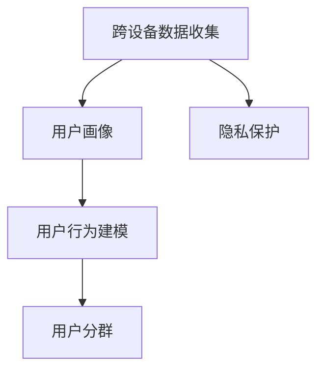

                 

# 电商平台中的跨设备用户行为分析技术

## 1. 背景介绍

### 1.1 问题由来
在电商领域，用户的行为分析是一个重要且具有挑战性的问题。传统的用户行为分析方法往往仅限于单一设备，而忽略了跨设备的数据，从而难以全面了解用户的行为模式和消费习惯。随着智能设备的普及和应用，用户在不同的设备上（如手机、电脑、平板等）产生的数据量越来越大，传统方法已经无法满足需求。

因此，电商平台需要通过跨设备的用户行为分析技术，全面了解用户在不同设备上的行为特征和消费习惯，进而提高用户留存率、提升转化率，并针对性地优化商品推荐系统、个性化营销策略等。

### 1.2 问题核心关键点
1. **数据收集**：在跨设备的数据收集过程中，如何保证数据的一致性和完整性，是一个关键问题。不同设备上的数据格式、时间戳、用户ID等可能存在差异，需要进行统一处理。
2. **数据融合**：如何将不同设备上的用户数据融合在一起，形成统一的用户画像，是跨设备用户行为分析的难点。
3. **行为建模**：在数据融合的基础上，如何建立用户行为的数学模型，提取用户特征，是分析的关键。
4. **用户分群**：如何根据用户的特征和行为，将用户进行合理的分群，进行针对性的营销和推荐。
5. **隐私保护**：在数据收集和分析过程中，如何保证用户的隐私安全，避免数据泄露和滥用。

### 1.3 问题研究意义
通过跨设备用户行为分析技术，电商平台可以更全面地了解用户在不同设备上的行为特征和消费习惯，从而提高用户留存率和转化率，优化商品推荐系统，实现精准营销，降低营销成本，提升整体用户体验。

## 2. 核心概念与联系

### 2.1 核心概念概述

为更好地理解跨设备用户行为分析技术，本节将介绍几个密切相关的核心概念：

- **跨设备数据收集**：指在多个设备（如手机、电脑、平板等）上收集用户行为数据的过程。
- **用户画像**：通过数据分析，构建一个全面的用户形象，包括用户的基本信息、行为特征、消费习惯等。
- **用户行为建模**：指通过数学模型和算法，从用户行为数据中提取有用的特征和规律，帮助电商平台了解用户行为。
- **用户分群**：指将用户按照某种特征进行分组，以便于进行针对性的营销和推荐。
- **隐私保护**：指在数据收集和分析过程中，保证用户的隐私安全，避免数据泄露和滥用。

这些核心概念之间的逻辑关系可以通过以下Mermaid流程图来展示：



这个流程图展示了几者之间的逻辑关系：

1. 跨设备数据收集为构建用户画像提供数据基础。
2. 用户画像是通过用户行为建模得出的。
3. 用户分群是基于用户画像进行的。
4. 隐私保护是数据收集和分析过程中必须保证的。

## 3. 核心算法原理 & 具体操作步骤
### 3.1 算法原理概述

跨设备用户行为分析的核心算法原理基于用户画像的构建和用户行为建模。其核心思想是：通过多维度、多渠道的数据收集，构建一个全面的用户画像，并在此基础上进行用户行为建模，提取用户特征，进行用户分群，实现精准营销。

具体而言，假设用户在多个设备上产生的数据分别为 $D_1, D_2, \ldots, D_n$，每个设备上的数据包含用户的基本信息、行为特征、消费记录等。通过数据融合技术将这些数据合并，得到完整的用户画像 $P$，然后通过用户行为建模提取用户特征 $F$，最后根据用户特征进行分群，形成不同的用户群体。

### 3.2 算法步骤详解

基于跨设备用户行为分析的核心算法原理，本节将详细介绍算法的详细步骤：

**Step 1: 数据收集与预处理**

1. 在多个设备上部署数据收集工具，收集用户行为数据。
2. 数据预处理：清洗数据、去重、统一数据格式等，保证数据的一致性和完整性。

**Step 2: 数据融合**

1. 将不同设备上的用户数据进行合并，构建统一的用户画像。
2. 解决数据融合中的时间戳对齐、用户ID映射等问题。

**Step 3: 用户行为建模**

1. 使用统计学和机器学习的方法，从用户行为数据中提取特征。
2. 选择合适的特征，构建用户行为模型，如分类、回归、聚类等模型。

**Step 4: 用户分群**

1. 根据用户行为模型的特征，将用户分为不同的群体。
2. 为每个群体制定针对性的营销策略和推荐方案。

**Step 5: 模型评估与优化**

1. 通过实验和分析，评估模型的效果。
2. 根据评估结果，优化模型参数和特征选择，提高模型的准确性和实用性。

### 3.3 算法优缺点

跨设备用户行为分析算法具有以下优点：

1. **全面性**：通过跨设备数据收集，可以全面了解用户在不同设备上的行为特征和消费习惯。
2. **精确性**：基于用户行为建模，可以提取更准确的特征，提升分析结果的精度。
3. **可扩展性**：算法可以适用于多种设备类型和数据格式，具有较高的灵活性和可扩展性。

同时，该算法也存在一些局限性：

1. **数据融合难度大**：不同设备上的数据格式、时间戳等可能存在差异，需要进行复杂的数据融合。
2. **隐私问题**：在数据收集和分析过程中，需要注意隐私保护，避免数据泄露和滥用。
3. **模型复杂度**：用户行为建模需要使用复杂的算法和大量的特征，增加了模型的复杂度。

### 3.4 算法应用领域

跨设备用户行为分析技术在电商领域具有广泛的应用，如：

- 用户画像构建：通过跨设备数据收集和融合，构建详细的用户画像，了解用户的兴趣和偏好。
- 个性化推荐：根据用户画像和行为特征，提供个性化的商品推荐。
- 精准营销：通过用户分群，制定有针对性的营销策略，提升营销效果。
- 用户流失预测：分析用户行为，预测可能流失的用户，提前采取措施进行挽留。
- 用户行为分析：深入分析用户在不同设备上的行为，优化产品设计和服务流程。

## 4. 数学模型和公式 & 详细讲解 & 举例说明

### 4.1 数学模型构建

本节将使用数学语言对跨设备用户行为分析过程进行更加严格的刻画。

假设用户在多个设备上产生的数据分别为 $D_1, D_2, \ldots, D_n$，每个设备上的数据包含用户的基本信息、行为特征、消费记录等。通过数据融合技术将这些数据合并，得到完整的用户画像 $P$，然后通过用户行为建模提取用户特征 $F$，最后根据用户特征进行分群，形成不同的用户群体。

### 4.2 公式推导过程

以用户画像构建为例，假设用户在不同设备上的行为数据分别为 $d_1, d_2, \ldots, d_n$，每个行为数据包含用户的基本信息、行为特征、时间戳等。设用户画像为 $P$，则：

$$
P = \{p_1, p_2, \ldots, p_m\}
$$

其中 $p_i$ 为用户在第 $i$ 个设备上的行为数据。

假设用户画像构建的方法为 $f$，则：

$$
P = f(d_1, d_2, \ldots, d_n)
$$

具体的用户画像构建方法可以是多维度特征的拼接、加权平均等。

### 4.3 案例分析与讲解

假设某电商平台收集了用户在两个设备上的行为数据：手机和平板。手机数据包含用户浏览记录、购买记录等，平板电脑数据包含用户的阅读习惯、应用使用记录等。

通过数据融合，将这些数据合并，得到完整的用户画像。例如，可以将手机数据中的浏览记录和购买记录与平板电脑数据中的阅读习惯、应用使用记录进行拼接，得到一个完整的用户画像 $P$。

接下来，使用机器学习算法对用户画像 $P$ 进行建模，提取用户特征 $F$。例如，可以使用随机森林、梯度提升树等算法，从用户画像中提取用户的兴趣特征、消费习惯等。

最后，根据用户特征 $F$，使用聚类算法进行用户分群。例如，可以使用K-means算法，将用户分为不同的群体，每个群体具有相似的特征和行为。

## 5. 项目实践：代码实例和详细解释说明
### 5.1 开发环境搭建

在进行跨设备用户行为分析实践前，我们需要准备好开发环境。以下是使用Python进行数据分析和建模的环境配置流程：

1. 安装Anaconda：从官网下载并安装Anaconda，用于创建独立的Python环境。

2. 创建并激活虚拟环境：
```bash
conda create -n pyenv python=3.8 
conda activate pyenv
```

3. 安装必要的库：
```bash
conda install pandas numpy scikit-learn matplotlib
```

完成上述步骤后，即可在`pyenv`环境中开始实践。

### 5.2 源代码详细实现

下面以用户画像构建和行为建模为例，给出使用Python进行跨设备用户行为分析的代码实现。

```python
import pandas as pd
from sklearn.preprocessing import StandardScaler
from sklearn.ensemble import RandomForestClassifier
from sklearn.cluster import KMeans

# 加载手机和平板设备的用户行为数据
phone_data = pd.read_csv('phone_data.csv')
pad_data = pd.read_csv('pad_data.csv')

# 数据预处理
phone_data['time'] = pd.to_datetime(phone_data['time'])
pad_data['time'] = pd.to_datetime(pad_data['time'])
phone_data['user_id'] = phone_data['user_id'].astype(int)
pad_data['user_id'] = pad_data['user_id'].astype(int)
merged_data = pd.merge(phone_data, pad_data, on='user_id', how='inner')

# 数据融合
merged_data = merged_data.groupby('user_id').agg({'浏览记录': 'count', '购买记录': 'count', '阅读习惯': 'count', '应用使用记录': 'count'})

# 用户画像构建
user_profiles = merged_data.groupby('user_id').mean()

# 用户行为建模
features = ['浏览记录', '购买记录', '阅读习惯', '应用使用记录']
target = '消费行为'
X = user_profiles[features]
y = user_profiles[target]

# 标准化特征
scaler = StandardScaler()
X_scaled = scaler.fit_transform(X)

# 训练随机森林分类器
model = RandomForestClassifier(n_estimators=100, random_state=42)
model.fit(X_scaled, y)

# 用户分群
features_selected = ['浏览记录', '购买记录']
X_selected = user_profiles[features_selected]
kmeans = KMeans(n_clusters=3, random_state=42)
kmeans.fit(X_selected)
user_clusters = kmeans.labels_
```

以上代码实现了从数据收集、预处理、用户画像构建、用户行为建模到用户分群的全过程。

### 5.3 代码解读与分析

让我们再详细解读一下关键代码的实现细节：

**数据加载与预处理**：
- 使用Pandas库加载手机和平板设备的用户行为数据，并进行基本的数据清洗，如时间戳统一、用户ID标准化等。
- 使用merge函数将两个设备上的数据进行合并，形成完整的数据集。

**用户画像构建**：
- 通过groupby函数，对用户ID进行分组，计算每个用户在不同行为上的平均值。
- 构建一个包含用户基本信息和行为特征的用户画像。

**用户行为建模**：
- 选取有代表性的特征，构建用户行为模型。这里使用了随机森林算法。
- 使用StandardScaler对特征进行标准化处理，提高模型的训练效果。

**用户分群**：
- 使用K-means算法，根据用户画像中的特征进行用户分群。

## 6. 实际应用场景
### 6.1 智能推荐系统

基于跨设备用户行为分析技术，电商平台可以构建更加精准的智能推荐系统。传统推荐系统往往只基于单一设备上的行为数据，而跨设备用户行为分析技术可以全面了解用户在不同设备上的行为特征和消费习惯，从而提高推荐系统的精准度。

例如，假设用户在手机上浏览了某商品，但没有购买，但在平板电脑上进行了详细阅读和比较，最终在另一设备上购买了该商品。传统推荐系统无法捕捉这一跨设备行为，而跨设备用户行为分析技术可以将其视为同一用户行为，从而提高推荐系统的精准度。

### 6.2 精准营销

电商平台可以通过跨设备用户行为分析技术，构建详细的用户画像，进行精准营销。例如，基于用户画像中的行为特征和消费习惯，制定个性化的营销策略，如推荐相关商品、发送定制化优惠券等，从而提高营销效果。

### 6.3 用户流失预测

通过跨设备用户行为分析技术，电商平台可以预测可能流失的用户，提前采取措施进行挽留。例如，分析用户在多个设备上的行为数据，识别出行为异常或消费减少的用户，及时推送关怀信息或优惠券，提高用户留存率。

### 6.4 用户行为分析

电商平台可以通过跨设备用户行为分析技术，深入分析用户在不同设备上的行为，优化产品设计和服务流程。例如，分析用户在不同设备上的浏览记录、应用使用记录等，了解用户在不同设备上的偏好和需求，优化商品展示和页面布局。

## 7. 工具和资源推荐
### 7.1 学习资源推荐

为了帮助开发者系统掌握跨设备用户行为分析的理论基础和实践技巧，这里推荐一些优质的学习资源：

1. 《Python数据分析与可视化》系列书籍：全面介绍Python在数据分析中的应用，包括数据预处理、数据融合、特征提取等。

2. 《机器学习实战》系列书籍：介绍机器学习的基本算法和实际应用案例，适合初学者和进阶学习者。

3. Coursera的《机器学习》课程：斯坦福大学开设的机器学习课程，涵盖多种机器学习算法和实际应用案例，是入门和提升的重要资源。

4. Kaggle平台：提供丰富的数据分析和机器学习竞赛数据集，是实战练习的好去处。

5. 论文《跨设备用户行为分析技术》：详细介绍跨设备用户行为分析的理论基础和实际应用，是深入研究的必读文献。

通过对这些资源的学习实践，相信你一定能够快速掌握跨设备用户行为分析的精髓，并用于解决实际的电商问题。

### 7.2 开发工具推荐

高效的开发离不开优秀的工具支持。以下是几款用于跨设备用户行为分析开发的常用工具：

1. Pandas：Python数据分析库，支持多种数据格式和操作，是数据分析的基础工具。

2. Scikit-learn：Python机器学习库，提供多种机器学习算法和评估指标，是构建用户行为模型的重要工具。

3. Matplotlib：Python数据可视化库，用于绘制各种图表，帮助直观展示数据分析结果。

4. Jupyter Notebook：Python交互式开发环境，适合快速原型设计和数据探索。

5. Apache Spark：大数据处理框架，支持分布式计算和数据融合，适合大规模数据处理。

合理利用这些工具，可以显著提升跨设备用户行为分析的开发效率，加快创新迭代的步伐。

### 7.3 相关论文推荐

跨设备用户行为分析技术的发展源于学界的持续研究。以下是几篇奠基性的相关论文，推荐阅读：

1. "Cross-Device User Behavior Analysis" by Gao et al.：介绍跨设备用户行为分析的原理和实际应用案例。

2. "User Behavior Modeling in Multi-Device Environments" by Liu et al.：介绍如何构建用户行为模型，提取用户特征。

3. "Data Fusion and Analysis in Multi-Device User Behavior" by Zhang et al.：介绍跨设备数据融合和分析技术。

4. "Personalized Recommendation Systems based on Cross-Device User Behavior" by Wang et al.：介绍基于跨设备用户行为分析的推荐系统实现。

5. "User Clustering and Segmentation in Multi-Device Environments" by Li et al.：介绍用户分群和用户分类的技术和方法。

这些论文代表了大数据和人工智能技术在跨设备用户行为分析领域的最新进展，值得深入学习和参考。

## 8. 总结：未来发展趋势与挑战
### 8.1 总结

本文对跨设备用户行为分析技术进行了全面系统的介绍。首先阐述了跨设备用户行为分析的背景和意义，明确了跨设备用户行为分析在电商平台中的应用价值。其次，从原理到实践，详细讲解了算法的核心步骤，给出了具体的代码实现，解释了各个步骤的实现细节。同时，本文还探讨了跨设备用户行为分析技术在电商领域的应用场景，展示了其广阔的前景。最后，本文精选了相关的学习资源和开发工具，提供了丰富的参考资料，帮助读者系统掌握跨设备用户行为分析的技术。

通过本文的系统梳理，可以看到，跨设备用户行为分析技术为电商平台带来了全新的用户理解视角，可以通过跨设备数据全面了解用户的行为特征和消费习惯，实现精准营销和推荐，提高用户留存率和转化率。未来，随着技术的不断发展，跨设备用户行为分析技术还将继续拓展其应用范围，成为电商平台优化用户体验的重要手段。

### 8.2 未来发展趋势

展望未来，跨设备用户行为分析技术将呈现以下几个发展趋势：

1. **跨设备数据融合技术的提升**：随着数据采集技术的进步，跨设备数据融合将更加高效和准确，用户画像将更加全面和详细。
2. **用户行为建模的深度学习化**：深度学习技术在用户行为建模中的应用将更加广泛，可以提取更复杂的用户特征和规律。
3. **用户分群的多样化**：未来的用户分群将更加多样化和动态化，能够更好地满足个性化营销的需求。
4. **隐私保护的加强**：随着隐私保护意识的提升，未来的跨设备用户行为分析技术将更加注重用户隐私，采取更严格的数据保护措施。

这些趋势将进一步推动跨设备用户行为分析技术的成熟和应用，提升电商平台的个性化推荐和精准营销能力，为用户带来更好的购物体验。

### 8.3 面临的挑战

尽管跨设备用户行为分析技术已经取得了一定的进展，但在迈向更加智能化、普适化应用的过程中，仍面临诸多挑战：

1. **数据隐私保护**：在跨设备数据收集和分析过程中，如何保证用户隐私安全，避免数据泄露和滥用，是一个重要挑战。
2. **数据融合难度**：不同设备上的数据格式、时间戳等可能存在差异，需要进行复杂的数据融合，提高数据融合的准确性和效率。
3. **算法复杂性**：用户行为建模和用户分群需要使用复杂的算法和大量的特征，增加了算法的复杂度和计算成本。
4. **实时性要求高**：电商平台需要实时更新用户画像和推荐系统，对算法的实时性和计算效率提出了更高的要求。

这些挑战需要在算法设计、数据处理和工程实现等多个方面进行全面优化和改进，才能实现跨设备用户行为分析技术的全面落地和应用。

### 8.4 研究展望

面对跨设备用户行为分析技术所面临的挑战，未来的研究需要在以下几个方面寻求新的突破：

1. **隐私保护技术的研究**：研发更加高效和安全的隐私保护技术，确保用户数据的安全和隐私。
2. **高效数据融合算法**：开发更加高效和准确的数据融合算法，解决跨设备数据融合中的难题。
3. **轻量级用户行为建模**：探索轻量级用户行为建模方法，降低算法复杂度，提高模型的实时性和计算效率。
4. **实时推荐系统**：研究实时推荐系统的优化方法，提高推荐的实时性和准确性。

这些研究方向将推动跨设备用户行为分析技术的进一步发展和应用，为电商平台提供更加精准和个性化的服务。

## 9. 附录：常见问题与解答

**Q1: 跨设备数据融合有哪些方法？**

A: 跨设备数据融合的方法包括时间戳对齐、用户ID映射、数据拼接等。时间戳对齐可以通过取最小值、平均值等方法实现。用户ID映射可以通过关联不同设备上的用户ID，构建统一的用户画像。数据拼接可以将不同设备上的数据拼接在一起，形成完整的用户行为数据。

**Q2: 用户行为建模有哪些常用算法？**

A: 用户行为建模的常用算法包括随机森林、梯度提升树、逻辑回归、神经网络等。随机森林和梯度提升树适用于特征工程简单的情况，逻辑回归适用于二分类和回归问题，神经网络适用于复杂特征和规律的问题。

**Q3: 用户分群有哪些常用方法？**

A: 用户分群的方法包括K-means聚类、层次聚类、DBSCAN密度聚类等。K-means聚类适用于大样本和简单分布的情况，层次聚类适用于需要层次结构的聚类问题，DBSCAN密度聚类适用于发现簇的形状不规则的情况。

**Q4: 跨设备用户行为分析在实际应用中有哪些挑战？**

A: 跨设备用户行为分析在实际应用中面临的挑战包括数据隐私保护、数据融合难度、算法复杂性、实时性要求高等。在数据隐私保护方面，需要采取严格的数据保护措施，如数据脱敏、加密等。在数据融合方面，需要开发高效的数据融合算法，解决不同设备数据格式、时间戳等问题。在算法复杂性方面，需要探索轻量级用户行为建模方法，降低算法复杂度。在实时性要求方面，需要优化推荐系统的实时性和计算效率。

**Q5: 如何构建跨设备用户画像？**

A: 构建跨设备用户画像的过程包括数据收集、数据清洗、数据融合、用户画像构建等步骤。具体步骤如下：
1. 在多个设备上部署数据收集工具，收集用户行为数据。
2. 对数据进行清洗和预处理，如去重、时间戳统一、用户ID标准化等。
3. 将不同设备上的用户数据进行合并，构建统一的用户画像。
4. 对用户画像进行特征选择和提取，构建用户行为模型。
5. 根据用户行为模型，进行用户分群，得到详细的用户画像。

通过这些步骤，可以构建一个全面的跨设备用户画像，全面了解用户在不同设备上的行为特征和消费习惯。

---

作者：禅与计算机程序设计艺术 / Zen and the Art of Computer Programming

