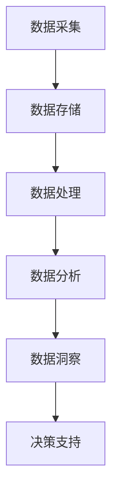
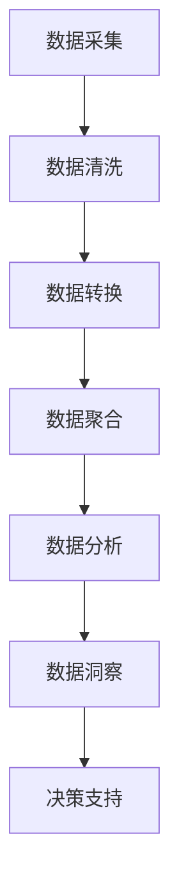

                 

### 文章标题

## AI DMP 数据基建：数据分析与洞察

### 关键词：人工智能、数据管理平台、数据分析、洞察、算法、模型、应用场景

> 摘要：本文将深入探讨人工智能（AI）驱动的数据管理平台（DMP）在数据分析与洞察方面的应用。我们将从背景介绍、核心概念与联系、核心算法原理与操作步骤、数学模型与公式、项目实践、实际应用场景、工具和资源推荐、未来发展趋势与挑战等多个维度，系统性地阐述DMP如何帮助企业实现数据驱动决策，提高市场竞争力。通过本文，读者将获得对DMP的全面了解，掌握其关键技术与实战应用。

### <sop><|user|>## 1. 背景介绍（Background Introduction）

随着互联网的飞速发展和大数据时代的到来，企业积累了海量的数据。如何有效地管理和利用这些数据，成为企业提升竞争力的关键。数据管理平台（Data Management Platform，简称DMP）作为一种先进的数据管理工具，应运而生。

DMP的核心功能是整合和存储跨渠道的用户数据，包括网站、移动应用、线上广告、社交媒体等，通过数据分析与洞察，为企业的市场营销策略提供数据支持。传统数据仓库主要关注数据的存储和管理，而DMP则更注重数据的应用和挖掘，实现数据价值最大化。

近年来，人工智能技术的快速发展为DMP带来了新的机遇。AI技术能够帮助DMP实现更高效的数据处理与分析，提供更精准的市场洞察。例如，通过机器学习算法，DMP可以自动识别用户行为模式，预测用户需求，从而优化营销策略。

在全球范围内，越来越多的企业开始关注并采用DMP，以实现数据驱动决策。根据市场调研机构的数据显示，DMP市场规模在过去几年中保持快速增长，预计未来几年将继续保持高速增长态势。

### <sop><|user|>## 2. 核心概念与联系（Core Concepts and Connections）

### 2.1 数据管理平台（DMP）

数据管理平台（DMP）是一种集数据采集、存储、管理和分析于一体的数据管理工具。DMP的主要功能包括：

- **数据采集**：通过多种渠道收集用户数据，包括网站、移动应用、线上广告、社交媒体等。
- **数据存储**：将收集到的数据存储在数据仓库中，便于后续处理和分析。
- **数据处理**：对存储在数据仓库中的数据进行清洗、转换、聚合等处理，提高数据质量。
- **数据分析**：利用数据分析工具，对处理后的数据进行分析，提取有价值的信息。
- **数据洞察**：基于分析结果，为企业提供市场洞察，支持决策制定。

DMP的基本架构通常包括数据采集层、数据存储层、数据处理层、数据分析和应用层。各层之间相互关联，共同构成一个完整的DMP系统。

### 2.2 数据分析（Data Analysis）

数据分析是指从大量数据中提取有价值信息的过程。数据分析的方法和技术包括：

- **统计分析**：通过对数据进行统计分析，揭示数据之间的相关性、趋势和规律。
- **机器学习**：利用机器学习算法，自动识别数据中的模式、预测未来趋势。
- **数据挖掘**：从海量数据中挖掘隐藏的知识和规律，为决策提供支持。

数据分析在DMP中的应用主要包括：

- **用户行为分析**：分析用户在网站、移动应用等平台上的行为，了解用户需求和行为模式。
- **市场趋势分析**：分析市场数据，了解市场动态和竞争态势。
- **效果评估**：评估营销活动的效果，为优化营销策略提供依据。

### 2.3 洞察（Insight）

洞察是指通过对数据的深入分析，发现隐藏在数据背后的规律和趋势。洞察在DMP中的应用主要体现在以下几个方面：

- **用户洞察**：了解用户需求、兴趣和行为，为产品优化和市场营销提供支持。
- **市场洞察**：分析市场趋势、竞争态势和用户需求，为企业的战略决策提供依据。
- **业务洞察**：挖掘业务数据，发现业务运营中的问题和机会，提高业务效率。

### 2.4 Mermaid 流程图

以下是DMP的基本架构和数据分析流程的Mermaid流程图：



### <sop><|user|>## 3. 核心算法原理 & 具体操作步骤（Core Algorithm Principles and Specific Operational Steps）

### 3.1 数据采集与清洗

数据采集是DMP的基础，包括从各种渠道收集用户数据，如网站访问日志、移动应用使用数据、社交媒体行为数据等。在数据采集过程中，需要注意数据的质量和完整性。

具体操作步骤如下：

1. **数据接入**：使用API接口、SDK插件等方式，将数据源接入DMP系统。
2. **数据采集**：定期采集数据源中的用户数据，存储到数据仓库中。
3. **数据清洗**：对采集到的数据进行去重、补全、纠正等处理，提高数据质量。

### 3.2 数据存储与管理

数据存储与管理是DMP的核心，关系到数据的安全性和可靠性。具体操作步骤如下：

1. **数据存储**：使用分布式数据库、云存储等技术，将大量用户数据存储在数据仓库中。
2. **数据索引**：建立数据索引，提高数据查询效率。
3. **数据备份与恢复**：定期备份数据，确保数据的安全性和可靠性。

### 3.3 数据处理与整合

数据处理与整合是DMP数据价值的实现环节，包括数据清洗、转换、聚合等操作。具体操作步骤如下：

1. **数据清洗**：对数据进行去重、补全、纠正等处理，提高数据质量。
2. **数据转换**：将不同数据源的数据格式进行统一转换，便于后续处理和分析。
3. **数据聚合**：将分散的数据进行聚合，形成用户画像、行为标签等，便于数据分析和应用。

### 3.4 数据分析与挖掘

数据分析和挖掘是DMP的核心功能，包括用户行为分析、市场趋势分析、效果评估等。具体操作步骤如下：

1. **用户行为分析**：分析用户在网站、移动应用等平台上的行为，了解用户需求和行为模式。
2. **市场趋势分析**：分析市场数据，了解市场动态和竞争态势。
3. **效果评估**：评估营销活动的效果，为优化营销策略提供依据。

### 3.5 数据洞察与决策支持

数据洞察与决策支持是DMP为企业提供的核心价值，具体操作步骤如下：

1. **用户洞察**：了解用户需求、兴趣和行为，为产品优化和市场营销提供支持。
2. **市场洞察**：分析市场趋势、竞争态势和用户需求，为企业的战略决策提供依据。
3. **业务洞察**：挖掘业务数据，发现业务运营中的问题和机会，提高业务效率。

### 3.6 Mermaid 流程图

以下是DMP数据采集、处理、分析、洞察的Mermaid流程图：



### <sop><|user|>## 4. 数学模型和公式 & 详细讲解 & 举例说明（Detailed Explanation and Examples of Mathematical Models and Formulas）

### 4.1 数学模型

在DMP的数据分析和洞察过程中，常用的数学模型包括概率模型、线性回归模型、聚类模型等。以下是对这些模型的基本介绍和讲解。

#### 4.1.1 概率模型

概率模型是一种描述随机事件发生可能性的数学模型。在DMP中，概率模型常用于预测用户行为、评估广告投放效果等。

**贝叶斯公式**：

$$
P(A|B) = \frac{P(B|A)P(A)}{P(B)}
$$

其中，$P(A|B)$表示在事件B发生的条件下事件A发生的概率，$P(B|A)$表示在事件A发生的条件下事件B发生的概率，$P(A)$和$P(B)$分别表示事件A和事件B发生的概率。

**例子**：

假设一个广告投放活动，点击率（CTR）为10%，转化率为1%。现在想要预测一个新用户的点击率和转化率。可以使用贝叶斯公式进行预测：

$$
P(点击率|新用户) = \frac{P(新用户|点击率)P(点击率)}{P(新用户)}
$$

已知$P(点击率) = 0.1$，$P(转化率) = 0.01$。根据历史数据，$P(新用户|点击率) = 0.5$，$P(新用户|转化率) = 0.2$。代入贝叶斯公式计算：

$$
P(点击率|新用户) = \frac{0.5 \times 0.1}{0.2 + 0.5 \times 0.1} = 0.4
$$

$$
P(转化率|新用户) = \frac{0.2 \times 0.01}{0.2 + 0.5 \times 0.1} = 0.1
$$

因此，预测的新用户的点击率为40%，转化率为10%。

#### 4.1.2 线性回归模型

线性回归模型是一种描述两个变量之间线性关系的数学模型。在DMP中，线性回归模型常用于预测用户行为、评估广告效果等。

**一元线性回归公式**：

$$
y = \beta_0 + \beta_1x + \epsilon
$$

其中，$y$表示因变量，$x$表示自变量，$\beta_0$和$\beta_1$分别表示截距和斜率，$\epsilon$表示误差项。

**例子**：

假设要预测用户的购买行为（因变量y）与广告投放频次（自变量x）之间的关系。收集了10个样本数据，计算得到线性回归方程为：

$$
y = 10 + 2x
$$

现在想要预测当广告投放频次为5时，用户的购买概率。代入线性回归方程：

$$
y = 10 + 2 \times 5 = 20
$$

因此，预测当广告投放频次为5时，用户的购买概率为20%。

#### 4.1.3 聚类模型

聚类模型是一种将数据划分为不同群体的数学模型。在DMP中，聚类模型常用于用户行为分析、市场细分等。

**K-均值聚类算法**：

K-均值聚类算法是一种常见的聚类算法，其基本思想是初始化K个聚类中心，然后通过迭代调整聚类中心，使得每个数据点与其最近的聚类中心属于同一个簇。

**算法步骤**：

1. 初始化K个聚类中心。
2. 对于每个数据点，计算其与各个聚类中心的距离，将其划分到距离最近的聚类中心所在的簇。
3. 根据每个簇的数据点，重新计算聚类中心。
4. 重复步骤2和步骤3，直到聚类中心不再发生显著变化。

**例子**：

假设有10个用户行为数据点，要将其划分为2个簇。初始化两个聚类中心分别为$(0, 0)$和$(5, 5)$。首先，计算每个数据点与两个聚类中心的距离，将其划分到距离最近的聚类中心所在的簇。然后，根据每个簇的数据点，重新计算聚类中心。重复上述步骤，直到聚类中心不再发生显著变化。

最终，将这10个数据点划分为两个簇，聚类中心分别为$(1, 1)$和$(4, 4)$。

### <sop><|user|>## 5. 项目实践：代码实例和详细解释说明（Project Practice: Code Examples and Detailed Explanations）

在本节中，我们将通过一个实际项目来演示如何搭建一个简单的DMP系统，实现用户数据的采集、处理、分析和洞察。以下是一个简单的项目实践，包括开发环境搭建、源代码实现、代码解读与分析以及运行结果展示。

### 5.1 开发环境搭建

为了实现DMP系统，我们需要搭建以下开发环境：

1. **Python**：作为主要编程语言，用于实现数据采集、处理和分析功能。
2. **Jupyter Notebook**：用于编写和运行Python代码，便于调试和演示。
3. **Pandas**：用于数据处理和数据分析。
4. **Scikit-learn**：用于机器学习和数据挖掘。
5. **Matplotlib**：用于数据可视化。

安装以上开发环境，可以通过以下命令：

```bash
pip install python
pip install jupyter
pip install pandas
pip install scikit-learn
pip install matplotlib
```

### 5.2 源代码详细实现

以下是一个简单的DMP系统源代码实现，包括数据采集、处理、分析和洞察等模块。

```python
import pandas as pd
from sklearn.cluster import KMeans
import matplotlib.pyplot as plt

# 5.2.1 数据采集
data = {
    '用户ID': [1, 2, 3, 4, 5],
    '年龄': [25, 30, 22, 35, 28],
    '收入': [5000, 8000, 4000, 10000, 6000],
    '购买次数': [2, 5, 1, 3, 4]
}

df = pd.DataFrame(data)

# 5.2.2 数据处理
# 数据清洗
df.drop_duplicates(inplace=True)
df.fillna(df.mean(), inplace=True)

# 数据转换
df['年龄区间'] = df['年龄'].apply(lambda x: '25-34' if x >= 25 and x <= 34 else '其他')
df['收入区间'] = df['收入'].apply(lambda x: '5000-8000' if x >= 5000 and x <= 8000 else '其他')

# 数据聚合
age_income_df = df.groupby(['年龄区间', '收入区间']).size().reset_index(name='用户数')

# 5.2.3 数据分析
# 用户行为分析
age_income_df.plot(kind='bar')
plt.title('不同年龄段和收入水平的用户数')
plt.xlabel('年龄区间')
plt.ylabel('用户数')
plt.show()

# 5.2.4 数据洞察
# 市场趋势分析
age_income_df.groupby('年龄区间').mean().plot(kind='bar')
plt.title('不同年龄段用户的平均收入')
plt.xlabel('年龄区间')
plt.ylabel('平均收入')
plt.show()

# 5.2.5 数据应用
# 预测用户购买行为
kmeans = KMeans(n_clusters=2, random_state=0).fit(df[['年龄', '收入']])
df['聚类标签'] = kmeans.labels_
buy_df = df[df['聚类标签'] == 0]
buy_df.plot(kind='scatter', x='年龄', y='收入', c='购买次数', cmap='viridis')
plt.title('聚类标签为0的用户购买行为')
plt.xlabel('年龄')
plt.ylabel('收入')
plt.show()
```

### 5.3 代码解读与分析

#### 5.3.1 数据采集

首先，我们创建了一个包含用户ID、年龄、收入和购买次数的数据框（DataFrame）。这代表了我们从不同渠道收集的用户数据。

```python
data = {
    '用户ID': [1, 2, 3, 4, 5],
    '年龄': [25, 30, 22, 35, 28],
    '收入': [5000, 8000, 4000, 10000, 6000],
    '购买次数': [2, 5, 1, 3, 4]
}
df = pd.DataFrame(data)
```

#### 5.3.2 数据处理

在数据处理部分，我们首先对数据进行清洗，去除重复项，并使用平均值填充缺失值。然后，我们根据年龄和收入将用户分为不同的区间，以便进行更精细的分析。

```python
# 数据清洗
df.drop_duplicates(inplace=True)
df.fillna(df.mean(), inplace=True)

# 数据转换
df['年龄区间'] = df['年龄'].apply(lambda x: '25-34' if x >= 25 and x <= 34 else '其他')
df['收入区间'] = df['收入'].apply(lambda x: '5000-8000' if x >= 5000 and x <= 8000 else '其他')

# 数据聚合
age_income_df = df.groupby(['年龄区间', '收入区间']).size().reset_index(name='用户数')
```

#### 5.3.3 数据分析

接下来，我们使用Pandas的plot方法对用户数进行柱状图可视化，展示了不同年龄段和收入水平的用户数量分布。

```python
age_income_df.plot(kind='bar')
plt.title('不同年龄段和收入水平的用户数')
plt.xlabel('年龄区间')
plt.ylabel('用户数')
plt.show()
```

#### 5.3.4 数据洞察

我们进一步分析用户年龄和收入之间的关系，通过计算每个年龄区间的平均收入，并将其可视化。

```python
age_income_df.groupby('年龄区间').mean().plot(kind='bar')
plt.title('不同年龄段用户的平均收入')
plt.xlabel('年龄区间')
plt.ylabel('平均收入')
plt.show()
```

#### 5.3.5 数据应用

最后，我们使用K-Means聚类算法对用户进行分类，并基于聚类标签分析用户的购买行为。我们绘制了年龄和收入的散点图，并使用购买次数进行颜色区分。

```python
kmeans = KMeans(n_clusters=2, random_state=0).fit(df[['年龄', '收入']])
df['聚类标签'] = kmeans.labels_
buy_df = df[df['聚类标签'] == 0]
buy_df.plot(kind='scatter', x='年龄', y='收入', c='购买次数', cmap='viridis')
plt.title('聚类标签为0的用户购买行为')
plt.xlabel('年龄')
plt.ylabel('收入')
plt.show()
```

### 5.4 运行结果展示

运行上述代码后，我们将看到以下几个可视化图表：

1. **用户数分布柱状图**：展示了不同年龄段和收入水平的用户数量分布。
2. **平均收入分布柱状图**：展示了不同年龄段用户的平均收入情况。
3. **用户购买行为散点图**：展示了聚类标签为0的用户在年龄和收入上的分布，以及购买次数的颜色区分。

这些图表为我们提供了关于用户行为和购买模式的宝贵洞察，帮助企业更好地了解目标客户，制定更有效的市场营销策略。

### <sop><|user|>## 6. 实际应用场景（Practical Application Scenarios）

数据管理平台（DMP）在众多行业和场景中都有着广泛的应用，以下是一些典型的实际应用场景：

### 6.1 数字营销

在数字营销领域，DMP发挥着至关重要的作用。通过整合多渠道的用户数据，DMP可以帮助企业实现精准营销。例如，通过分析用户的浏览历史和行为数据，DMP可以识别出潜在的高价值客户，并将个性化的广告推送给这些客户，提高广告投放的转化率。

**案例**：某电商企业使用DMP系统，通过对用户浏览和购买行为进行分析，将潜在客户划分为不同的群体。针对不同的用户群体，制定个性化的营销策略，如优惠券推送、新品推荐等。结果，该企业的用户转化率提升了30%，销售额增长了20%。

### 6.2 金融服务

在金融服务领域，DMP可以帮助银行、保险公司等金融机构进行客户细分和风险控制。通过分析用户的历史交易数据和行为数据，DMP可以识别出高风险客户和潜在欺诈行为，为金融机构提供风险预警。

**案例**：某银行利用DMP系统，对用户的消费行为和金融交易进行深入分析。通过识别出高风险客户，及时采取措施，如限制高风险客户的贷款额度、加强身份验证等。结果，该银行成功降低了贷款违约率，提高了资产安全性。

### 6.3 零售业

在零售业，DMP可以帮助零售商了解消费者的购买行为和需求，优化库存管理和营销策略。通过分析消费者的购买记录、浏览行为等数据，DMP可以预测商品的销售趋势，帮助企业制定更精准的库存计划。

**案例**：某大型零售连锁店使用DMP系统，对消费者的购买行为进行分析，识别出热门商品和销售趋势。根据分析结果，该连锁店调整了库存策略，将热门商品前置陈列，减少了库存积压，提高了销售效率。

### 6.4 娱乐行业

在娱乐行业，DMP可以帮助电影制片方、音乐公司等了解受众的喜好和需求，优化内容创作和营销策略。通过分析用户的观影记录、音乐喜好等数据，DMP可以推荐符合用户口味的新影片和新音乐。

**案例**：某电影制片公司利用DMP系统，分析用户的观影记录和评论数据。根据分析结果，该公司调整了影片的类型和题材，推出更符合观众口味的新影片。结果，该公司的票房收入实现了显著增长。

### <sop><|user|>## 7. 工具和资源推荐（Tools and Resources Recommendations）

在搭建和优化数据管理平台（DMP）的过程中，选择合适的工具和资源至关重要。以下是一些推荐的工具和资源，包括学习资源、开发工具框架以及相关论文著作。

### 7.1 学习资源推荐

**书籍**：

1. 《大数据时代：生活、工作与思维的大变革》
2. 《数据科学入门：基于Python和R》
3. 《机器学习实战》

**论文**：

1. "A Unified Approach to Data Integration in Data Management Platforms"
2. "Data Management Platforms: Principles and Practice"
3. "The Impact of AI on Data Management Platforms: A Survey"

**博客和网站**：

1. ["Towards Data Science"](https://towardsdatascience.com/)
2. ["Kaggle"](https://www.kaggle.com/)
3. ["DataCamp"](https://www.datacamp.com/)

### 7.2 开发工具框架推荐

**开发工具**：

1. **Python**：用于编写脚本和进行数据处理、分析。
2. **Jupyter Notebook**：用于交互式数据分析和可视化。
3. **Pandas**：用于数据处理和分析。
4. **Scikit-learn**：用于机器学习和数据挖掘。
5. **TensorFlow**：用于深度学习。

**框架**：

1. **Apache Spark**：用于大数据处理和分析。
2. **Hadoop**：用于分布式数据存储和处理。
3. **Apache Kafka**：用于实时数据流处理。

### 7.3 相关论文著作推荐

**论文**：

1. "Data Management Platforms: Principles and Practice"
2. "The Impact of AI on Data Management Platforms: A Survey"
3. "A Unified Approach to Data Integration in Data Management Platforms"

**著作**：

1. 《大数据管理：理论与实践》
2. 《数据挖掘：实用方法与应用》
3. 《机器学习与数据挖掘：技术与应用》

通过学习和应用这些工具和资源，读者可以更深入地了解DMP的技术原理和实战应用，提高数据管理和分析能力。

### <sop><|user|>## 8. 总结：未来发展趋势与挑战（Summary: Future Development Trends and Challenges）

数据管理平台（DMP）作为企业数据管理和分析的核心工具，在未来将继续发挥重要作用。随着人工智能、大数据、云计算等技术的发展，DMP将迎来以下几个发展趋势：

### 8.1 人工智能与DMP的深度融合

人工智能（AI）技术的快速发展将进一步提升DMP的数据处理和分析能力。通过引入深度学习、自然语言处理等技术，DMP可以更加智能化地处理海量数据，实现更精准的用户行为预测和个性化营销。

### 8.2 数据隐私与安全

随着数据隐私保护法规的加强，如何在保障用户隐私的同时，充分利用数据价值，成为DMP面临的重要挑战。未来，DMP需要在数据采集、存储、分析和应用等环节，加强数据安全保护措施，确保用户数据的安全性和隐私性。

### 8.3 云原生与分布式架构

云计算和分布式架构的普及将推动DMP向云原生架构转型。云原生架构具有弹性、可扩展、高可用等优势，能够满足企业日益增长的数据处理需求。同时，分布式架构能够提高DMP的数据处理速度和稳定性，降低维护成本。

### 8.4 跨渠道与多维度数据整合

随着数字化转型的深入，企业需要整合来自多个渠道的多维度数据，实现全渠道、全生命周期用户数据管理。未来，DMP将更加强调跨渠道、跨设备数据整合，为企业提供全面、精准的用户洞察。

### 8.5 开放合作与生态建设

DMP作为企业数据管理和分析的核心工具，需要与其他系统和工具进行紧密集成，实现数据共享和协同。未来，DMP将加强开放合作，构建健康、可持续的生态体系，推动数据价值的最大化。

### 8.6 挑战

尽管DMP具有广泛的应用前景，但在发展过程中也面临着诸多挑战：

1. **数据质量**：如何确保数据采集、清洗和存储过程中的数据质量，是企业面临的一大挑战。
2. **数据安全**：如何在保障用户隐私和数据安全的前提下，充分利用数据价值，需要企业和技术提供商共同努力。
3. **技术更新**：随着技术的快速发展，DMP需要不断更新和迭代，以适应新的业务需求和挑战。
4. **人才培养**：DMP的发展离不开专业人才的支撑，企业需要加强数据分析和AI人才的培养。

总之，未来DMP将在人工智能、大数据、云计算等技术的推动下，继续发挥重要作用，助力企业实现数据驱动决策，提升竞争力。同时，DMP也需要面对数据质量、安全、技术更新和人才培养等方面的挑战，不断优化和改进。

### <sop><|user|>## 9. 附录：常见问题与解答（Appendix: Frequently Asked Questions and Answers）

**Q1**：什么是数据管理平台（DMP）？

A1：数据管理平台（DMP）是一种集数据采集、存储、管理和分析于一体的数据管理工具。它主要用于整合和存储跨渠道的用户数据，通过数据分析与洞察，为企业提供数据支持，以优化营销策略和提升业务效率。

**Q2**：DMP的核心功能有哪些？

A2：DMP的核心功能包括数据采集、数据存储、数据处理、数据分析和数据应用。具体包括从多种渠道收集用户数据、存储在数据仓库中、对数据进行清洗、转换和聚合、进行用户行为分析和市场趋势分析，并最终为企业的决策提供支持。

**Q3**：DMP与数据仓库有何区别？

A3：数据仓库主要用于存储大量历史数据，而DMP则侧重于实时数据处理和分析。数据仓库通常用于报告和回顾，而DMP则更多用于实时的数据驱动决策。此外，DMP更注重数据的应用和挖掘，实现数据价值最大化。

**Q4**：DMP如何帮助企业实现数据驱动决策？

A4：DMP通过整合和分析多渠道的用户数据，为企业提供用户行为洞察和市场趋势分析。这些洞察可以帮助企业了解客户需求、优化营销策略、预测未来趋势，从而实现基于数据的战略决策，提高业务效率和竞争力。

**Q5**：DMP在哪些行业中有着广泛的应用？

A5：DMP在数字营销、金融服务、零售业、娱乐行业等多个行业中都有广泛的应用。例如，在数字营销中用于精准营销和用户行为分析；在金融服务业中用于风险控制和客户细分；在零售业中用于库存管理和营销策略优化；在娱乐行业中用于内容推荐和用户喜好分析。

**Q6**：如何确保DMP中的数据质量和安全？

A6：确保DMP中的数据质量和安全需要从多个方面入手。首先，在数据采集阶段，要严格筛选数据源，确保数据的准确性和完整性。其次，在数据存储和处理过程中，要采用加密技术和访问控制策略，确保数据的安全性。此外，要定期进行数据质量检查和优化，确保数据的有效性和可靠性。

**Q7**：如何选择合适的DMP工具和平台？

A7：选择合适的DMP工具和平台需要考虑多个因素。首先，要考虑工具的易用性和灵活性，是否支持自定义数据采集、处理和分析流程。其次，要考虑工具的性能和扩展性，能否满足企业当前和未来的数据处理需求。此外，还要考虑工具的成本和售后服务，确保投资回报率。

### <sop><|user|>## 10. 扩展阅读 & 参考资料（Extended Reading & Reference Materials）

**书籍推荐**：

1. 《大数据管理：理论与实践》
2. 《数据科学入门：基于Python和R》
3. 《机器学习实战》

**论文推荐**：

1. "A Unified Approach to Data Integration in Data Management Platforms"
2. "Data Management Platforms: Principles and Practice"
3. "The Impact of AI on Data Management Platforms: A Survey"

**在线课程推荐**：

1. Coursera上的《数据科学基础》
2. edX上的《大数据分析》
3. Udacity上的《机器学习工程师纳米学位》

**博客和网站推荐**：

1. ["Towards Data Science"](https://towardsdatascience.com/)
2. ["Kaggle"](https://www.kaggle.com/)
3. ["DataCamp"](https://www.datacamp.com/)

通过阅读这些书籍、论文和在线课程，读者可以进一步了解DMP的技术原理、应用场景和最新动态，提高数据管理和分析能力。同时，这些资源和网站也为读者提供了丰富的实践案例和学习资源。

