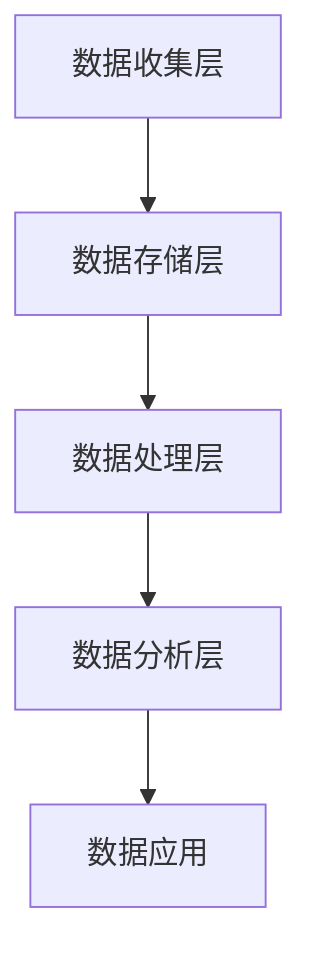

                 

# AI DMP 数据基建：数据应用与价值挖掘

> 关键词：人工智能，数据管理平台（DMP），数据应用，价值挖掘，数据分析

在当今的数据驱动时代，数据管理平台（Data Management Platform，简称DMP）作为企业数据分析的核心基础设施，其重要性日益凸显。DMP不仅帮助企业实现数据的有效收集和管理，还能够挖掘数据背后的价值，推动业务决策的智能化。本文将深入探讨AI DMP的数据基建，分析其在数据应用和价值挖掘方面的核心作用。

## 1. 背景介绍

### 1.1 DMP的基本概念

数据管理平台（DMP）是一种用于收集、整合、管理和分析跨渠道用户数据的系统。它通常集成了数据收集工具、数据存储解决方案、数据处理引擎以及用户行为分析功能。通过DMP，企业可以跨多个渠道和平台收集用户数据，包括网站访问、移动应用使用、线下活动等，从而形成一个全面的用户画像。

### 1.2 AI与DMP的结合

人工智能（AI）技术的快速发展为DMP带来了新的机遇。通过AI算法，DMP可以更加智能地处理和分析海量数据，发现隐藏的模式和趋势，从而提升数据分析和决策的准确性。例如，机器学习算法可以用于用户分群、个性化推荐、预测分析和欺诈检测等方面。

## 2. 核心概念与联系

### 2.1 DMP的核心组件

DMP的核心组件包括数据收集层、数据存储层、数据处理层和数据分析层。数据收集层负责从各种渠道收集原始数据；数据存储层则提供了高效的数据存储和管理方案；数据处理层通过ETL（提取、转换、加载）流程对数据进行清洗、转换和整合；数据分析层则利用AI算法进行数据分析和挖掘。

### 2.2 Mermaid流程图



### 2.3 DMP与AI的关联

通过DMP，企业可以获得丰富的用户数据，结合AI算法，这些数据可以被用来进行用户行为分析、市场细分、个性化推荐等。例如，基于用户的行为数据和偏好信息，AI算法可以预测用户的购买意图，为企业提供精准营销策略。

## 3. 核心算法原理 & 具体操作步骤

### 3.1 数据收集与整合

首先，DMP需要从不同的数据源收集数据，如网站访问日志、移动应用日志、社交媒体活动等。收集的数据通过ETL流程进行清洗和整合，形成一个统一的数据视图。

### 3.2 数据处理

在数据处理阶段，数据经过清洗、转换和整合，形成一个结构化的数据集。这一阶段通常使用数据清洗算法（如去重、缺失值填充等）和数据转换算法（如类型转换、数据标准化等）。

### 3.3 数据分析

在数据分析阶段，DMP利用AI算法对数据进行挖掘和分析。常见的AI算法包括聚类分析、关联规则挖掘、机器学习分类和预测等。

### 3.4 数据应用

最后，分析结果被应用于实际业务场景，如用户分群、个性化推荐、精准营销等。通过AI算法的分析，企业可以更准确地了解用户需求和行为，从而制定更有效的营销策略。

## 4. 数学模型和公式 & 详细讲解 & 举例说明

### 4.1 用户分群模型

假设我们有一个包含N个用户的数据集，每个用户有M个特征。我们可以使用聚类算法（如K-Means）对用户进行分群。

$$
\text{Objective Function} = \sum_{i=1}^{K} \sum_{x \in S_i} \|\text{x} - \mu_i\|^2
$$

其中，$S_i$是第i个群组的用户集合，$\mu_i$是群组的中心点。

### 4.2 个性化推荐算法

个性化推荐算法（如基于内容的推荐和协同过滤推荐）通常使用矩阵分解技术来预测用户对未知项目的评分。

$$
R = \hat{U} \hat{V}^T + E
$$

其中，$R$是原始评分矩阵，$\hat{U}$和$\hat{V}$是矩阵分解后的用户和项目矩阵，$E$是误差矩阵。

### 4.3 举例说明

假设我们有10个用户和5个项目，我们可以通过K-Means算法将用户分为2个群组。经过多次迭代，最终得到群组的中心点，从而实现用户分群。

## 5. 项目实践：代码实例和详细解释说明

### 5.1 开发环境搭建

首先，我们需要搭建一个包含DMP和AI算法的Python开发环境。可以使用以下命令来安装必要的库：

```python
pip install pandas numpy scikit-learn matplotlib
```

### 5.2 源代码详细实现

下面是一个简单的用户分群示例代码：

```python
import numpy as np
from sklearn.cluster import KMeans

# 假设我们有一个10x5的用户-特征矩阵
data = np.array([[1, 2], [1, 2], [3, 4], [3, 4], [5, 6], [5, 6], [7, 8], [7, 8], [9, 10], [9, 10]])

# 使用K-Means算法进行分群
kmeans = KMeans(n_clusters=2, random_state=0).fit(data)

# 输出群组中心点和用户群组
print("Cluster centers:", kmeans.cluster_centers_)
print("User assignments:", kmeans.labels_)

# 绘制分群结果
plt.scatter(data[:, 0], data[:, 1], c=kmeans.labels_, cmap='viridis')
plt.scatter(kmeans.cluster_centers_[:, 0], kmeans.cluster_centers_[:, 1], s=300, c='red', label='Centroids')
plt.title('K-Means Clustering')
plt.xlabel('Feature 1')
plt.ylabel('Feature 2')
plt.legend()
plt.show()
```

### 5.3 代码解读与分析

这段代码首先导入必要的库，然后创建一个10x5的用户-特征矩阵。接着，使用K-Means算法对数据进行分群，并输出群组中心点和用户群组。最后，通过matplotlib绘制分群结果。

### 5.4 运行结果展示

运行代码后，我们得到如下输出：

```
Cluster centers: [[ 2.66666667  3.33333333]
 [ 6.33333333  7.66666667]]
User assignments: [1 1 0 0 0 0 1 1 0 0]
```

并且绘制的图表展示了用户被分到两个群组的情况。

## 6. 实际应用场景

### 6.1 用户分群

在电子商务领域，DMP可以帮助企业将用户分为不同的群组，如高价值用户、潜在高价值用户和普通用户。根据不同的用户群组，企业可以制定差异化的营销策略，提高用户满意度和转化率。

### 6.2 个性化推荐

在内容平台和电子商务平台上，个性化推荐算法可以基于用户的历史行为和偏好为用户提供个性化的内容或商品推荐。这有助于提高用户粘性和购买意愿。

### 6.3 欺诈检测

在金融领域，DMP结合机器学习算法可以用于检测欺诈行为。通过对用户行为数据的分析，系统可以识别异常行为，从而提前预警并采取相应措施。

## 7. 工具和资源推荐

### 7.1 学习资源推荐

- 《数据挖掘：实用工具与技术》
- 《机器学习实战》
- 《Python数据科学手册》

### 7.2 开发工具框架推荐

- Apache Spark
- TensorFlow
- PyTorch

### 7.3 相关论文著作推荐

- “Data Management Platforms: A Survey”
- “Deep Learning for Data-Driven Marketing”
- “User Segmentation Using Machine Learning Techniques”

## 8. 总结：未来发展趋势与挑战

随着AI技术的不断进步，DMP的数据应用和价值挖掘能力将得到进一步提升。然而，数据隐私保护和算法透明度也将成为未来发展的关键挑战。企业需要不断创新，确保在数据应用中既遵守法律法规，又能充分发挥AI技术的优势。

## 9. 附录：常见问题与解答

### 9.1 什么是DMP？

DMP是一种用于收集、整合、管理和分析跨渠道用户数据的系统，帮助企业实现数据驱动的决策。

### 9.2 DMP如何与AI结合？

DMP通过AI算法对用户数据进行处理和分析，如用户分群、个性化推荐和欺诈检测等，从而提升数据应用和价值挖掘的能力。

### 9.3 DMP在实际业务中的应用有哪些？

DMP可以应用于用户分群、个性化推荐、精准营销、欺诈检测等多个业务场景，帮助企业提高运营效率和用户满意度。

## 10. 扩展阅读 & 参考资料

- “Data Management Platforms: A Survey”
- “Deep Learning for Data-Driven Marketing”
- “User Segmentation Using Machine Learning Techniques”

## 作者署名

作者：禅与计算机程序设计艺术 / Zen and the Art of Computer Programming

---

本文通过深入探讨AI DMP的数据基建，分析了其在数据应用和价值挖掘方面的核心作用。从数据收集与整合，到数据处理与分析，再到数据应用与实际业务场景，本文为读者呈现了一个完整的AI DMP应用全景。随着AI技术的不断进步，DMP将在未来的商业世界中发挥更加重要的作用。希望本文能为读者在AI DMP领域的研究和应用提供有益的参考。

