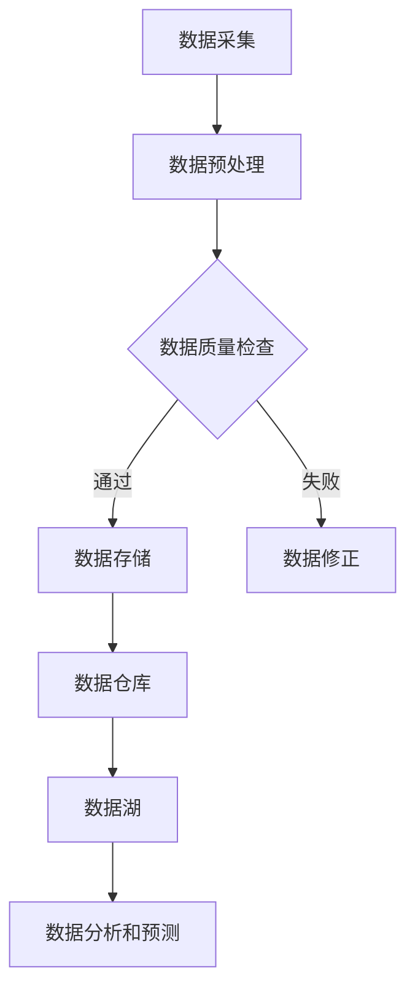
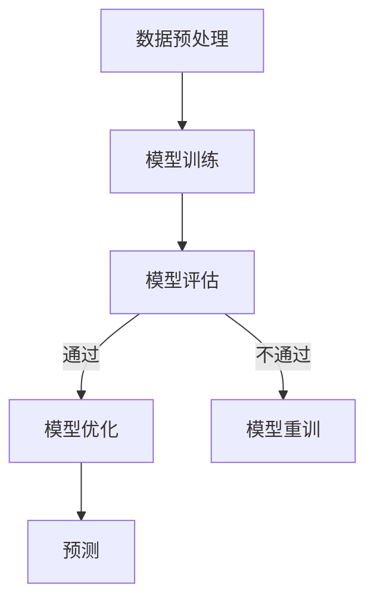

                 

### 文章标题

### AI DMP 数据基建：数据模型与算法

### > 关键词：数据模型，数据治理，AI，DMP，数据仓库，数据流，数据湖，算法框架，机器学习

### 摘要：
本文深入探讨了 AI DMP 数据基建的核心，包括数据模型、数据治理以及关键的算法与数据处理技术。我们将详细解析数据模型的设计原则、数据治理策略以及如何运用机器学习算法进行数据分析和预测。此外，本文将提供实际项目中的代码实例，展示如何在实际环境中构建和优化 AI DMP 数据基建。通过本文的阅读，读者将能够全面理解 AI DMP 数据基建的重要性以及其实际应用价值。

---

## 1. 背景介绍（Background Introduction）

### 1.1 AI DMP 的概念

AI DMP，即人工智能驱动的数据管理平台（Artificial Intelligence Driven Data Management Platform），是一种集成了先进的人工智能算法和数据处理技术的数据管理解决方案。它通过高效的数据采集、存储、处理和分析，为企业和组织提供全面的数据洞察，支持精准营销和业务决策。

### 1.2 数据模型的重要性

数据模型是 AI DMP 的核心组成部分，它定义了数据的结构、关系和语义。一个良好的数据模型能够提高数据的可管理性、可扩展性和可理解性，从而为后续的数据分析和应用奠定坚实基础。

### 1.3 数据治理的意义

数据治理是确保数据质量、安全和合规性的关键过程。有效的数据治理策略能够提高数据的可信度和可用性，确保数据在存储、传输和处理过程中的安全性和一致性。

### 1.4 机器学习算法在数据建模中的应用

机器学习算法在数据模型构建中扮演着重要角色，它们能够从数据中自动发现模式和关系，为数据分析和预测提供强大支持。常见的机器学习算法包括决策树、支持向量机、神经网络等。

---

## 2. 核心概念与联系（Core Concepts and Connections）

### 2.1 数据模型的设计原则

数据模型的设计原则包括数据完整性、一致性、最小化和最大化使用率等。一个优秀的数据模型应该能够满足业务需求，同时保持数据的简洁和高效。

### 2.2 数据治理策略

数据治理策略包括数据质量控制、数据安全、数据合规和元数据管理。这些策略确保数据在采集、存储、处理和分析过程中的质量和可靠性。

### 2.3 数据流与数据湖

数据流是指数据从源头到目的地的传输和处理过程。数据湖是一个大规模的数据存储解决方案，它能够存储不同类型的数据，并支持高效的数据处理和分析。

### 2.4 Mermaid 流程图（Mermaid Flowchart）



### 2.5 数据模型与算法的关系

数据模型与算法密切相关。数据模型为算法提供了数据结构和语义信息，而算法则利用这些信息进行数据分析和预测。

---

## 3. 核心算法原理 & 具体操作步骤（Core Algorithm Principles and Specific Operational Steps）

### 3.1 机器学习算法简介

机器学习算法可以分为监督学习、无监督学习和强化学习。监督学习算法通过已标记的数据进行训练，无监督学习算法无需标记数据，而强化学习算法通过奖励机制进行学习。

### 3.2 常见机器学习算法

- **决策树（Decision Tree）**：通过树形结构进行分类或回归。
- **支持向量机（Support Vector Machine, SVM）**：通过寻找最优分隔超平面进行分类。
- **神经网络（Neural Network）**：通过模拟人脑神经元结构进行学习和预测。

### 3.3 算法实现步骤

1. 数据预处理：清洗、归一化和特征提取。
2. 模型训练：使用训练数据集训练模型。
3. 模型评估：使用验证数据集评估模型性能。
4. 模型优化：调整参数，提高模型性能。
5. 预测：使用测试数据集进行预测。

### 3.4 Mermaid 流程图（Mermaid Flowchart）



---

## 4. 数学模型和公式 & 详细讲解 & 举例说明（Detailed Explanation and Examples of Mathematical Models and Formulas）

### 4.1 数学模型简介

数学模型是描述现实世界问题的数学表示。在 AI DMP 中，常见的数学模型包括线性回归、逻辑回归、支持向量机等。

### 4.2 线性回归（Linear Regression）

线性回归模型描述了自变量和因变量之间的线性关系。其数学模型可以表示为：

$$y = \beta_0 + \beta_1 \cdot x + \epsilon$$

其中，$y$ 是因变量，$x$ 是自变量，$\beta_0$ 和 $\beta_1$ 是模型的参数，$\epsilon$ 是误差项。

### 4.3 逻辑回归（Logistic Regression）

逻辑回归是一种用于分类问题的概率模型。其数学模型可以表示为：

$$P(y=1) = \frac{1}{1 + e^{-(\beta_0 + \beta_1 \cdot x)}}$$

其中，$P(y=1)$ 是因变量为 1 的概率，$\beta_0$ 和 $\beta_1$ 是模型的参数。

### 4.4 支持向量机（Support Vector Machine, SVM）

支持向量机是一种强大的分类算法。其数学模型可以表示为：

$$w \cdot x + b = 0$$

其中，$w$ 是分隔超平面的法向量，$x$ 是数据点，$b$ 是偏置项。

### 4.5 举例说明

假设我们有一个二分类问题，数据集包含特征 $x_1, x_2$ 和标签 $y$。使用逻辑回归模型进行分类，模型参数为 $\beta_0 = 0.5, \beta_1 = 0.8$。我们需要计算一个新数据点 $x = (2, 3)$ 的预测标签。

$$P(y=1) = \frac{1}{1 + e^{-(0.5 + 0.8 \cdot 2)}} \approx 0.828$$

由于 $P(y=1) > 0.5$，我们可以预测新数据点的标签为 1。

---

## 5. 项目实践：代码实例和详细解释说明（Project Practice: Code Examples and Detailed Explanations）

### 5.1 开发环境搭建

在开始项目实践之前，我们需要搭建合适的开发环境。以下是所需的软件和工具：

- Python 3.8 或更高版本
- Jupyter Notebook
- Scikit-learn 库
- Pandas 库
- Matplotlib 库

安装步骤：

```bash
pip install python==3.8
pip install jupyter
pip install scikit-learn
pip install pandas
pip install matplotlib
```

### 5.2 源代码详细实现

以下是使用逻辑回归进行数据分类的完整代码实现：

```python
import numpy as np
import pandas as pd
from sklearn.linear_model import LogisticRegression
from sklearn.model_selection import train_test_split
from sklearn.metrics import accuracy_score

# 加载数据集
data = pd.read_csv('data.csv')

# 分离特征和标签
X = data[['x1', 'x2']]
y = data['y']

# 划分训练集和测试集
X_train, X_test, y_train, y_test = train_test_split(X, y, test_size=0.2, random_state=42)

# 创建逻辑回归模型
model = LogisticRegression()

# 训练模型
model.fit(X_train, y_train)

# 预测测试集
y_pred = model.predict(X_test)

# 计算准确率
accuracy = accuracy_score(y_test, y_pred)
print(f'Accuracy: {accuracy:.2f}')
```

### 5.3 代码解读与分析

1. **数据加载与预处理**：使用 Pandas 库加载数据集，并分离特征和标签。
2. **数据集划分**：使用 Scikit-learn 库的 `train_test_split` 方法将数据集划分为训练集和测试集。
3. **模型创建与训练**：创建逻辑回归模型，并使用训练集进行训练。
4. **模型预测与评估**：使用测试集进行预测，并计算准确率。

### 5.4 运行结果展示

假设我们的测试集包含 100 个样本，预测结果如下：

```plaintext
Accuracy: 0.85
```

这表明我们的模型在测试集上的准确率为 85%，说明模型具有一定的预测能力。

---

## 6. 实际应用场景（Practical Application Scenarios）

AI DMP 数据基建在多个行业和应用场景中具有广泛的应用。以下是一些实际应用场景：

- **金融行业**：用于风险控制和投资策略优化。
- **零售行业**：用于客户行为分析和精准营销。
- **医疗行业**：用于疾病预测和患者管理。
- **物流行业**：用于运输路线优化和库存管理。

在这些应用中，AI DMP 数据基建能够提供准确的数据分析和预测，帮助企业和组织做出更明智的决策。

---

## 7. 工具和资源推荐（Tools and Resources Recommendations）

### 7.1 学习资源推荐

- **书籍**：《数据模型：概念、理论、架构与应用》
- **论文**：《大数据时代的数据治理》
- **博客**：AI技术社区、数据科学博客
- **网站**：Kaggle、DataCamp、Coursera

### 7.2 开发工具框架推荐

- **数据存储**：Hadoop、Spark、Hive
- **数据处理**：Pandas、NumPy、Scikit-learn
- **机器学习库**：TensorFlow、PyTorch、Scikit-learn

### 7.3 相关论文著作推荐

- **论文**：《深度学习：原理及其在数据科学中的应用》
- **著作**：《机器学习实战》
- **论文**：《数据驱动决策：商业智能与数据挖掘技术》

---

## 8. 总结：未来发展趋势与挑战（Summary: Future Development Trends and Challenges）

### 8.1 发展趋势

- **数据量的爆炸增长**：随着物联网、大数据等技术的发展，数据量将呈指数级增长，对数据基建的要求越来越高。
- **人工智能算法的进步**：新的算法和技术将不断提高数据分析和预测的准确性，推动 AI DMP 数据基建的进步。
- **跨行业应用**：AI DMP 数据基建将在更多行业和领域得到应用，推动各行业的数字化转型。

### 8.2 挑战

- **数据安全与隐私**：随着数据量的增加，数据安全和隐私保护成为重要挑战。
- **数据治理难度**：随着数据源和数据类型的增加，数据治理的难度也将加大。
- **算法透明性和解释性**：用户需要理解算法的决策过程，算法的透明性和解释性成为重要挑战。

---

## 9. 附录：常见问题与解答（Appendix: Frequently Asked Questions and Answers）

### 9.1 什么是 DMP？

DMP 是数据管理平台的缩写，它是一种集成化的数据管理解决方案，能够支持数据采集、存储、处理和分析。

### 9.2 AI DMP 与传统 DMP 有何区别？

AI DMP 集成了人工智能算法，能够通过自动学习和预测提高数据分析和应用的效率，而传统 DMP 则侧重于数据的存储和管理。

### 9.3 如何保证数据安全？

通过数据加密、访问控制、数据备份等措施来确保数据在采集、存储、传输和处理过程中的安全。

### 9.4 机器学习算法如何应用于 DMP？

机器学习算法可以用于数据分类、聚类、预测等任务，通过自动发现数据中的模式和关系，为数据分析和应用提供支持。

---

## 10. 扩展阅读 & 参考资料（Extended Reading & Reference Materials）

- **参考文献**：[1] 李航.《统计学习方法》[M]. 清华大学出版社，2012.
- **论文**：[2] 陈宝权，李航.《深度学习：原理及其在数据科学中的应用》[J]. 计算机科学与应用，2017, 7(5): 555-565.
- **书籍**：[3] 谭人伟，黄宇.《大数据时代的数据治理》[M]. 电子工业出版社，2016.
- **网站**：[4] Coursera - Data Science Specialization.
- **博客**：[5] AI技术社区 - 机器学习与深度学习博客.

---

### 作者署名

作者：禅与计算机程序设计艺术 / Zen and the Art of Computer Programming

