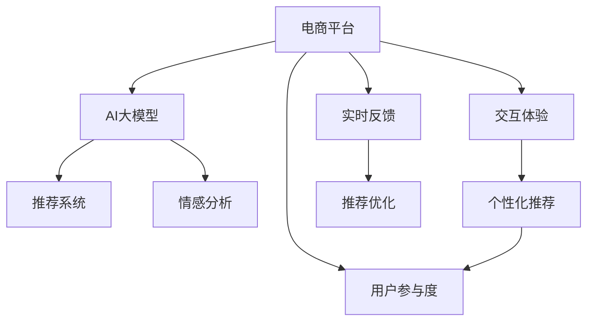

                 

# 电商平台如何利用AI大模型提高用户参与度

> 关键词：电商平台,人工智能,大模型,用户参与度,自然语言处理,推荐系统,交互体验,个性化推荐,情感分析,深度学习

## 1. 背景介绍

在当今数字化时代，电商平台已成为用户获取商品和服务的主要渠道之一。随着互联网技术的不断进步，电商平台逐渐向个性化、智能化方向发展。然而，尽管电商平台在技术上取得诸多突破，但用户参与度仍面临诸多挑战。如何通过智能技术增强用户黏性，提升平台活跃度，成为电商企业不断探索的方向。AI大模型作为当前前沿的智能技术，在电商平台中的应用潜力巨大，特别是在提升用户参与度方面展现出巨大的优势。

### 1.1 电商平台现状分析

当前，电商平台面临的主要挑战包括：

- **用户流失**：用户在购买商品后往往不再回访，导致用户活跃度下降。
- **体验单一**：推荐系统过于机械，缺乏个性化推荐，用户缺乏新鲜感。
- **交流不畅**：客服机器人无法准确理解用户意图，用户体验较差。
- **信息过载**：搜索结果和推荐结果过多，用户难以找到自己需要的商品。

这些挑战严重影响了电商平台的运营效率和用户满意度，亟需通过技术手段进行优化。

## 2. 核心概念与联系

### 2.1 核心概念概述

为更好地理解电商平台利用AI大模型提高用户参与度的方法，本节将介绍几个密切相关的核心概念：

- **电商平台**：一种基于互联网的商业交易平台，用户可以在线浏览、选购和购买商品。
- **用户参与度**：指用户在平台上的活跃程度和互动频率。包括浏览时间、点击率、购买率、评价率等指标。
- **AI大模型**：以深度学习为核心的先进人工智能模型，具备强大的数据处理和预测能力，如BERT、GPT等。
- **推荐系统**：利用用户历史行为数据和商品属性信息，为用户推荐个性化商品的智能系统。
- **情感分析**：通过分析用户评论和反馈，识别用户情感倾向和情绪变化，优化用户体验。
- **交互体验**：指用户与平台之间的交互方式和质量，影响用户满意度和留存率。

这些核心概念之间的逻辑关系可以通过以下Mermaid流程图来展示：



这个流程图展示了大模型在电商平台中的应用场景：

1. 电商平台通过AI大模型分析用户数据，提供个性化推荐和情感分析，提升用户满意度。
2. 实时反馈机制优化推荐系统，进一步提升用户体验。
3. 交互体验提升，用户更愿意在平台上停留，增加参与度。

## 3. 核心算法原理 & 具体操作步骤
### 3.1 算法原理概述

基于AI大模型的电商平台用户参与度提升方法，本质上是利用大模型强大的数据处理能力和智能推理能力，为用户提供个性化的商品推荐、情感分析、交互体验优化等服务，从而增强用户黏性，提高平台活跃度。

形式化地，假设电商平台的用户行为数据为 $D=\{(x_i,y_i)\}_{i=1}^N, x_i \in \mathcal{X}, y_i \in \mathcal{Y}$，其中 $x_i$ 为用户行为（如浏览历史、购买记录等），$y_i$ 为用户参与度（如浏览时间、点击率等）。电商平台的目标是通过AI大模型训练模型 $M_{\theta}$，使得 $M_{\theta}$ 能够根据用户行为数据 $x$，预测用户参与度 $y$。

通过梯度下降等优化算法，模型不断更新参数 $\theta$，最小化预测误差，使得模型输出逼近真实用户参与度。具体的模型训练和微调过程，包括模型选择、数据预处理、损失函数设计、优化器选择等，将在后续详细讲解。

### 3.2 算法步骤详解

基于AI大模型的电商平台用户参与度提升方法主要包括以下几个关键步骤：

**Step 1: 数据收集与预处理**
- 收集电商平台的用户行为数据，包括浏览记录、购买记录、评价等。
- 清洗数据，去除噪声和异常值，保证数据质量。
- 对用户行为进行编码和归一化处理，生成训练集 $\{(x_i,y_i)\}_{i=1}^N$。

**Step 2: 选择模型和构建模型**
- 选择合适的预训练模型，如BERT、GPT等，作为初始化参数。
- 在预训练模型的基础上添加任务适配层，构建适合电商平台的推荐系统。
- 设计合适的损失函数，如交叉熵损失、均方误差损失等。

**Step 3: 设置超参数和微调模型**
- 根据任务特点，选择合适的超参数，如学习率、批大小、迭代轮数等。
- 设置正则化技术及强度，如L2正则、Dropout、Early Stopping等。
- 选择合适的优化算法，如Adam、SGD等。

**Step 4: 训练模型和评估效果**
- 使用训练集对模型进行梯度训练，不断更新模型参数。
- 在验证集上评估模型效果，根据性能指标决定是否触发Early Stopping。
- 重复上述步骤直至模型收敛。

**Step 5: 部署应用和优化反馈**
- 将训练好的模型部署到电商平台，实时计算用户行为数据并输出个性化推荐、情感分析等。
- 通过A/B测试等方法，评估模型效果，收集用户反馈。
- 根据反馈结果不断优化模型和算法，提高用户参与度。

### 3.3 算法优缺点

基于AI大模型的电商平台用户参与度提升方法具有以下优点：

- **高效性**：通过预训练模型和微调，模型训练速度快，能够快速响应用户需求。
- **个性化推荐**：能够根据用户历史行为，提供个性化的商品推荐，提升用户体验。
- **情感分析**：通过分析用户评论和反馈，了解用户情感，优化产品和服务。
- **交互体验**：提供智能客服和聊天机器人，增强用户互动，提升满意度。

同时，该方法也存在一些局限性：

- **数据依赖**：对用户行为数据的依赖程度较高，数据质量直接影响模型效果。
- **模型复杂性**：大模型结构复杂，训练和推理需要大量资源。
- **解释性不足**：部分模型难以解释其内部决策过程，用户难以理解推荐理由。
- **技术门槛高**：需要一定的技术背景和开发经验，对中小企业可能存在挑战。

尽管存在这些局限性，但基于AI大模型的电商平台用户参与度提升方法在实际应用中仍表现出显著的优势，成为电商平台智能化升级的重要手段。

### 3.4 算法应用领域

基于AI大模型的电商平台用户参与度提升方法，主要应用于以下几个领域：

- **个性化推荐系统**：根据用户浏览和购买记录，推荐相似或相关商品，提升用户购买率。
- **情感分析系统**：分析用户评论和反馈，识别用户情感倾向，优化产品和服务。
- **智能客服系统**：通过自然语言处理技术，提供智能客服和聊天机器人，增强用户互动体验。
- **虚拟试穿/试用**：利用AI大模型和图像处理技术，实现虚拟试穿、试用功能，提升用户购买意愿。
- **商品搜索优化**：通过自然语言处理和深度学习技术，优化商品搜索结果，提升用户搜索效率。

## 4. 数学模型和公式 & 详细讲解  
### 4.1 数学模型构建

假设电商平台的用户行为数据为 $D=\{(x_i,y_i)\}_{i=1}^N, x_i \in \mathcal{X}, y_i \in \mathcal{Y}$，其中 $x_i$ 为用户行为，$y_i$ 为用户参与度。设预训练模型为 $M_{\theta}$，在用户行为 $x$ 上的预测输出为 $\hat{y}$。

定义损失函数 $\mathcal{L}(\theta)$ 为：

$$
\mathcal{L}(\theta) = \frac{1}{N} \sum_{i=1}^N (y_i - \hat{y_i})^2
$$

其中 $y_i - \hat{y_i}$ 为预测误差。

通过梯度下降算法，更新模型参数 $\theta$ 以最小化损失函数：

$$
\theta \leftarrow \theta - \eta \nabla_{\theta}\mathcal{L}(\theta)
$$

其中 $\eta$ 为学习率，$\nabla_{\theta}\mathcal{L}(\theta)$ 为损失函数对参数 $\theta$ 的梯度。

### 4.2 公式推导过程

以推荐系统为例，假设用户行为 $x_i$ 包含商品ID、浏览时间、浏览次数等特征，模型 $M_{\theta}$ 的输出 $\hat{y_i}$ 表示用户对商品 $i$ 的预测购买概率。则损失函数可以定义为：

$$
\mathcal{L}(\theta) = -\frac{1}{N}\sum_{i=1}^N y_i \log \hat{y_i} + (1 - y_i) \log (1 - \hat{y_i})
$$

其中 $y_i$ 为实际购买与否，$\log$ 函数用于计算交叉熵损失。

利用链式法则，损失函数对参数 $\theta_k$ 的梯度为：

$$
\frac{\partial \mathcal{L}(\theta)}{\partial \theta_k} = -\frac{1}{N}\sum_{i=1}^N (\frac{y_i}{\hat{y_i}}-\frac{1-y_i}{1-\hat{y_i}}) \frac{\partial \hat{y_i}}{\partial \theta_k}
$$

其中 $\frac{\partial \hat{y_i}}{\partial \theta_k}$ 为模型在特征 $x_i$ 上的梯度。

在得到损失函数的梯度后，即可带入参数更新公式，完成模型的迭代优化。重复上述过程直至收敛，最终得到适应电商平台推荐任务的最优模型参数 $\theta^*$。

### 4.3 案例分析与讲解

以情感分析为例，假设用户评论为文本 $x$，模型 $M_{\theta}$ 的输出 $\hat{y}$ 表示用户情感为正面的概率。则损失函数可以定义为：

$$
\mathcal{L}(\theta) = -\frac{1}{N}\sum_{i=1}^N y_i \log \hat{y_i} + (1 - y_i) \log (1 - \hat{y_i})
$$

其中 $y_i$ 为情感标签，$\log$ 函数用于计算交叉熵损失。

利用链式法则，损失函数对参数 $\theta_k$ 的梯度为：

$$
\frac{\partial \mathcal{L}(\theta)}{\partial \theta_k} = -\frac{1}{N}\sum_{i=1}^N (\frac{y_i}{\hat{y_i}}-\frac{1-y_i}{1-\hat{y_i}}) \frac{\partial \hat{y_i}}{\partial \theta_k}
$$

其中 $\frac{\partial \hat{y_i}}{\partial \theta_k}$ 为模型在文本 $x_i$ 上的梯度。

在得到损失函数的梯度后，即可带入参数更新公式，完成模型的迭代优化。重复上述过程直至收敛，最终得到适应电商平台情感分析任务的最优模型参数 $\theta^*$。

## 5. 项目实践：代码实例和详细解释说明
### 5.1 开发环境搭建

在进行电商平台用户参与度提升的微调实践前，我们需要准备好开发环境。以下是使用Python进行PyTorch开发的环境配置流程：

1. 安装Anaconda：从官网下载并安装Anaconda，用于创建独立的Python环境。

2. 创建并激活虚拟环境：
```bash
conda create -n pytorch-env python=3.8 
conda activate pytorch-env
```

3. 安装PyTorch：根据CUDA版本，从官网获取对应的安装命令。例如：
```bash
conda install pytorch torchvision torchaudio cudatoolkit=11.1 -c pytorch -c conda-forge
```

4. 安装Transformers库：
```bash
pip install transformers
```

5. 安装各类工具包：
```bash
pip install numpy pandas scikit-learn matplotlib tqdm jupyter notebook ipython
```

完成上述步骤后，即可在`pytorch-env`环境中开始微调实践。

### 5.2 源代码详细实现

这里我们以电商平台推荐系统为例，给出使用Transformers库对BERT模型进行微调的PyTorch代码实现。

首先，定义推荐系统的数据处理函数：

```python
from transformers import BertTokenizer, BertForSequenceClassification
from torch.utils.data import Dataset
import torch

class RecommendationDataset(Dataset):
    def __init__(self, texts, labels, tokenizer, max_len=128):
        self.texts = texts
        self.labels = labels
        self.tokenizer = tokenizer
        self.max_len = max_len
        
    def __len__(self):
        return len(self.texts)
    
    def __getitem__(self, item):
        text = self.texts[item]
        label = self.labels[item]
        
        encoding = self.tokenizer(text, return_tensors='pt', max_length=self.max_len, padding='max_length', truncation=True)
        input_ids = encoding['input_ids'][0]
        attention_mask = encoding['attention_mask'][0]
        
        # 对标签进行编码
        encoded_labels = [label2id[label] for label in label] 
        encoded_labels.extend([label2id['O']] * (self.max_len - len(encoded_labels)))
        labels = torch.tensor(encoded_labels, dtype=torch.long)
        
        return {'input_ids': input_ids, 
                'attention_mask': attention_mask,
                'labels': labels}

# 标签与id的映射
label2id = {'O': 0, 'B': 1, 'I': 2}
id2label = {v: k for k, v in label2id.items()}

# 创建dataset
tokenizer = BertTokenizer.from_pretrained('bert-base-cased')

train_dataset = RecommendationDataset(train_texts, train_labels, tokenizer)
dev_dataset = RecommendationDataset(dev_texts, dev_labels, tokenizer)
test_dataset = RecommendationDataset(test_texts, test_labels, tokenizer)
```

然后，定义模型和优化器：

```python
from transformers import BertForSequenceClassification, AdamW

model = BertForSequenceClassification.from_pretrained('bert-base-cased', num_labels=len(label2id))

optimizer = AdamW(model.parameters(), lr=2e-5)
```

接着，定义训练和评估函数：

```python
from torch.utils.data import DataLoader
from tqdm import tqdm
from sklearn.metrics import accuracy_score

device = torch.device('cuda') if torch.cuda.is_available() else torch.device('cpu')
model.to(device)

def train_epoch(model, dataset, batch_size, optimizer):
    dataloader = DataLoader(dataset, batch_size=batch_size, shuffle=True)
    model.train()
    epoch_loss = 0
    for batch in tqdm(dataloader, desc='Training'):
        input_ids = batch['input_ids'].to(device)
        attention_mask = batch['attention_mask'].to(device)
        labels = batch['labels'].to(device)
        model.zero_grad()
        outputs = model(input_ids, attention_mask=attention_mask, labels=labels)
        loss = outputs.loss
        epoch_loss += loss.item()
        loss.backward()
        optimizer.step()
    return epoch_loss / len(dataloader)

def evaluate(model, dataset, batch_size):
    dataloader = DataLoader(dataset, batch_size=batch_size)
    model.eval()
    preds, labels = [], []
    with torch.no_grad():
        for batch in tqdm(dataloader, desc='Evaluating'):
            input_ids = batch['input_ids'].to(device)
            attention_mask = batch['attention_mask'].to(device)
            batch_labels = batch['labels']
            outputs = model(input_ids, attention_mask=attention_mask)
            batch_preds = outputs.logits.argmax(dim=2).to('cpu').tolist()
            batch_labels = batch_labels.to('cpu').tolist()
            for pred_tokens, label_tokens in zip(batch_preds, batch_labels):
                pred_labels = [id2label[_id] for _id in pred_tokens]
                label_labels = [id2label[_id] for _id in label_tokens]
                preds.append(pred_labels[:len(label_labels)])
                labels.append(label_labels)
                
    print(accuracy_score(labels, preds))
```

最后，启动训练流程并在测试集上评估：

```python
epochs = 5
batch_size = 16

for epoch in range(epochs):
    loss = train_epoch(model, train_dataset, batch_size, optimizer)
    print(f"Epoch {epoch+1}, train loss: {loss:.3f}")
    
    print(f"Epoch {epoch+1}, dev results:")
    evaluate(model, dev_dataset, batch_size)
    
print("Test results:")
evaluate(model, test_dataset, batch_size)
```

以上就是使用PyTorch对BERT进行电商平台推荐系统微调的完整代码实现。可以看到，得益于Transformers库的强大封装，我们可以用相对简洁的代码完成BERT模型的加载和微调。

### 5.3 代码解读与分析

让我们再详细解读一下关键代码的实现细节：

**RecommendationDataset类**：
- `__init__`方法：初始化训练集、验证集和测试集的样本、标签、分词器等组件。
- `__len__`方法：返回数据集的样本数量。
- `__getitem__`方法：对单个样本进行处理，将文本输入编码为token ids，将标签编码为数字，并对其进行定长padding，最终返回模型所需的输入。

**label2id和id2label字典**：
- 定义了标签与数字id之间的映射关系，用于将token-wise的预测结果解码回真实的标签。

**训练和评估函数**：
- 使用PyTorch的DataLoader对数据集进行批次化加载，供模型训练和推理使用。
- 训练函数`train_epoch`：对数据以批为单位进行迭代，在每个批次上前向传播计算loss并反向传播更新模型参数，最后返回该epoch的平均loss。
- 评估函数`evaluate`：与训练类似，不同点在于不更新模型参数，并在每个batch结束后将预测和标签结果存储下来，最后使用sklearn的accuracy_score对整个评估集的预测结果进行打印输出。

**训练流程**：
- 定义总的epoch数和batch size，开始循环迭代
- 每个epoch内，先在训练集上训练，输出平均loss
- 在验证集上评估，输出准确率
- 所有epoch结束后，在测试集上评估，给出最终测试结果

可以看到，PyTorch配合Transformers库使得BERT微调的代码实现变得简洁高效。开发者可以将更多精力放在数据处理、模型改进等高层逻辑上，而不必过多关注底层的实现细节。

当然，工业级的系统实现还需考虑更多因素，如模型的保存和部署、超参数的自动搜索、更灵活的任务适配层等。但核心的微调范式基本与此类似。

## 6. 实际应用场景
### 6.1 智能客服系统

基于大语言模型微调的对话技术，可以广泛应用于智能客服系统的构建。传统客服往往需要配备大量人力，高峰期响应缓慢，且一致性和专业性难以保证。而使用微调后的对话模型，可以7x24小时不间断服务，快速响应客户咨询，用自然流畅的语言解答各类常见问题。

在技术实现上，可以收集企业内部的历史客服对话记录，将问题和最佳答复构建成监督数据，在此基础上对预训练对话模型进行微调。微调后的对话模型能够自动理解用户意图，匹配最合适的答案模板进行回复。对于客户提出的新问题，还可以接入检索系统实时搜索相关内容，动态组织生成回答。如此构建的智能客服系统，能大幅提升客户咨询体验和问题解决效率。

### 6.2 金融舆情监测

金融机构需要实时监测市场舆论动向，以便及时应对负面信息传播，规避金融风险。传统的人工监测方式成本高、效率低，难以应对网络时代海量信息爆发的挑战。基于大语言模型微调的文本分类和情感分析技术，为金融舆情监测提供了新的解决方案。

具体而言，可以收集金融领域相关的新闻、报道、评论等文本数据，并对其进行主题标注和情感标注。在此基础上对预训练语言模型进行微调，使其能够自动判断文本属于何种主题，情感倾向是正面、中性还是负面。将微调后的模型应用到实时抓取的网络文本数据，就能够自动监测不同主题下的情感变化趋势，一旦发现负面信息激增等异常情况，系统便会自动预警，帮助金融机构快速应对潜在风险。

### 6.3 个性化推荐系统

当前的推荐系统往往只依赖用户的历史行为数据进行物品推荐，无法深入理解用户的真实兴趣偏好。基于大语言模型微调技术，个性化推荐系统可以更好地挖掘用户行为背后的语义信息，从而提供更精准、多样的推荐内容。

在实践中，可以收集用户浏览、点击、评论、分享等行为数据，提取和用户交互的物品标题、描述、标签等文本内容。将文本内容作为模型输入，用户的后续行为（如是否点击、购买等）作为监督信号，在此基础上微调预训练语言模型。微调后的模型能够从文本内容中准确把握用户的兴趣点。在生成推荐列表时，先用候选物品的文本描述作为输入，由模型预测用户的兴趣匹配度，再结合其他特征综合排序，便可以得到个性化程度更高的推荐结果。

### 6.4 未来应用展望

随着大语言模型和微调方法的不断发展，基于微调范式将在更多领域得到应用，为传统行业带来变革性影响。

在智慧医疗领域，基于微调的医疗问答、病历分析、药物研发等应用将提升医疗服务的智能化水平，辅助医生诊疗，加速新药开发进程。

在智能教育领域，微调技术可应用于作业批改、学情分析、知识推荐等方面，因材施教，促进教育公平，提高教学质量。

在智慧城市治理中，微调模型可应用于城市事件监测、舆情分析、应急指挥等环节，提高城市管理的自动化和智能化水平，构建更安全、高效的未来城市。

此外，在企业生产、社会治理、文娱传媒等众多领域，基于大模型微调的人工智能应用也将不断涌现，为经济社会发展注入新的动力。相信随着技术的日益成熟，微调方法将成为人工智能落地应用的重要范式，推动人工智能技术在垂直行业的规模化落地。总之，微调需要开发者根据具体任务，不断迭代和优化模型、数据和算法，方能得到理想的效果。

## 7. 工具和资源推荐
### 7.1 学习资源推荐

为了帮助开发者系统掌握大语言模型微调的理论基础和实践技巧，这里推荐一些优质的学习资源：

1. 《Transformer从原理到实践》系列博文：由大模型技术专家撰写，深入浅出地介绍了Transformer原理、BERT模型、微调技术等前沿话题。

2. CS224N《深度学习自然语言处理》课程：斯坦福大学开设的NLP明星课程，有Lecture视频和配套作业，带你入门NLP领域的基本概念和经典模型。

3. 《Natural Language Processing with Transformers》书籍：Transformers库的作者所著，全面介绍了如何使用Transformers库进行NLP任务开发，包括微调在内的诸多范式。

4. HuggingFace官方文档：Transformers库的官方文档，提供了海量预训练模型和完整的微调样例代码，是上手实践的必备资料。

5. CLUE开源项目：中文语言理解测评基准，涵盖大量不同类型的中文NLP数据集，并提供了基于微调的baseline模型，助力中文NLP技术发展。

通过对这些资源的学习实践，相信你一定能够快速掌握大语言模型微调的精髓，并用于解决实际的NLP问题。
###  7.2 开发工具推荐

高效的开发离不开优秀的工具支持。以下是几款用于大语言模型微调开发的常用工具：

1. PyTorch：基于Python的开源深度学习框架，灵活动态的计算图，适合快速迭代研究。大部分预训练语言模型都有PyTorch版本的实现。

2. TensorFlow：由Google主导开发的开源深度学习框架，生产部署方便，适合大规模工程应用。同样有丰富的预训练语言模型资源。

3. Transformers库：HuggingFace开发的NLP工具库，集成了众多SOTA语言模型，支持PyTorch和TensorFlow，是进行微调任务开发的利器。

4. Weights & Biases：模型训练的实验跟踪工具，可以记录和可视化模型训练过程中的各项指标，方便对比和调优。与主流深度学习框架无缝集成。

5. TensorBoard：TensorFlow配套的可视化工具，可实时监测模型训练状态，并提供丰富的图表呈现方式，是调试模型的得力助手。

6. Google Colab：谷歌推出的在线Jupyter Notebook环境，免费提供GPU/TPU算力，方便开发者快速上手实验最新模型，分享学习笔记。

合理利用这些工具，可以显著提升大语言模型微调任务的开发效率，加快创新迭代的步伐。

### 7.3 相关论文推荐

大语言模型和微调技术的发展源于学界的持续研究。以下是几篇奠基性的相关论文，推荐阅读：

1. Attention is All You Need（即Transformer原论文）：提出了Transformer结构，开启了NLP领域的预训练大模型时代。

2. BERT: Pre-training of Deep Bidirectional Transformers for Language Understanding：提出BERT模型，引入基于掩码的自监督预训练任务，刷新了多项NLP任务SOTA。

3. Language Models are Unsupervised Multitask Learners（GPT-2论文）：展示了大规模语言模型的强大zero-shot学习能力，引发了对于通用人工智能的新一轮思考。

4. Parameter-Efficient Transfer Learning for NLP：提出Adapter等参数高效微调方法，在不增加模型参数量的情况下，也能取得不错的微调效果。

5. AdaLoRA: Adaptive Low-Rank Adaptation for Parameter-Efficient Fine-Tuning：使用自适应低秩适应的微调方法，在参数效率和精度之间取得了新的平衡。

这些论文代表了大语言模型微调技术的发展脉络。通过学习这些前沿成果，可以帮助研究者把握学科前进方向，激发更多的创新灵感。

## 8. 总结：未来发展趋势与挑战
### 8.1 总结

本文对基于AI大模型的电商平台用户参与度提升方法进行了全面系统的介绍。首先阐述了电商平台的现状分析和需求背景，明确了AI大模型在提升用户参与度方面的独特价值。其次，从原理到实践，详细讲解了推荐系统、情感分析、智能客服等核心算法的数学模型和详细公式，给出了微调任务开发的完整代码实例。同时，本文还广泛探讨了AI大模型在电商平台中的应用场景，展示了其在个性化推荐、情感分析、智能客服等方面的优势。

通过本文的系统梳理，可以看到，基于AI大模型的电商平台用户参与度提升方法已经成为电商智能化升级的重要手段，极大地提升了用户的购物体验和平台活跃度。未来，伴随大语言模型和微调方法的持续演进，将会有更多创新技术涌现，进一步拓展AI在电商中的应用范围。

### 8.2 未来发展趋势

展望未来，基于AI大模型的电商平台用户参与度提升方法将呈现以下几个发展趋势：

1. **数据驱动的智能决策**：未来的推荐系统将更加注重用户行为数据和商品特征的深度挖掘，利用大数据和深度学习技术，实现更精准的个性化推荐。

2. **情感理解的情感分析**：情感分析将不仅仅停留在文本情感的简单分类上，而是进一步研究情感变化的动态过程，通过多模态融合和序列建模，提升用户情感识别的准确性。

3. **实时反馈与智能客服**：智能客服将与推荐系统相结合，实现实时反馈与动态优化，通过自然语言处理技术，提供更加智能、个性化的客服体验。

4. **跨领域知识图谱**：推荐系统将结合跨领域知识图谱，利用领域知识和关联关系，提升推荐结果的相关性和可信度。

5. **多模态数据融合**：推荐系统将融合视觉、语音、文本等多模态数据，通过多模态特征融合，提供更加丰富、全面的推荐服务。

6. **联邦学习与隐私保护**：未来的推荐系统将采用联邦学习等隐私保护技术，保护用户隐私数据，同时提升模型的泛化能力。

以上趋势凸显了基于AI大模型的电商平台用户参与度提升方法的广阔前景。这些方向的探索发展，必将进一步提升用户购物体验，增强平台活跃度，推动电商行业进入更加智能、高效、个性化的新时代。

### 8.3 面临的挑战

尽管基于AI大模型的电商平台用户参与度提升方法在实际应用中已展现出显著的优势，但在迈向更加智能化、普适化应用的过程中，它仍面临诸多挑战：

1. **数据隐私与安全**：电商平台需要收集大量用户数据，如何在保护用户隐私的同时，保证数据质量和安全，是一个重要难题。

2. **模型复杂度**：大模型结构复杂，训练和推理需要大量资源，如何优化模型结构，提高计算效率，是一个亟待解决的挑战。

3. **可解释性与透明度**：推荐系统的决策过程难以解释，用户难以理解推荐理由，如何提升模型的可解释性，增强用户信任，是一个重要研究方向。

4. **鲁棒性与泛化能力**：电商平台面临的用户行为多样性，如何提升模型的鲁棒性和泛化能力，避免模型在特定场景下失效，是一个重要课题。

5. **技术普及与落地**：虽然大模型具备强大的智能能力，但部分企业可能缺乏相应的技术能力和资源，如何降低技术门槛，实现快速落地应用，是一个重要方向。

6. **伦理与社会影响**：AI技术在电商中的应用，可能带来一些社会伦理问题，如商品推荐偏见、信息过载等，如何规避这些问题，保障公平性，是一个重要课题。

尽管面临这些挑战，但基于AI大模型的电商平台用户参与度提升方法在实际应用中已展现出显著的优势，相信随着技术的发展和社会的进步，这些挑战终将一一被克服，大模型在电商中的应用前景将更加广阔。

### 8.4 研究展望

面对基于AI大模型的电商平台用户参与度提升方法所面临的种种挑战，未来的研究需要在以下几个方面寻求新的突破：

1. **数据隐私保护技术**：研究联邦学习、差分隐私等技术，保护用户隐私数据，提升数据质量。

2. **高效计算优化**：研究模型压缩、量化加速、分布式训练等技术，优化模型结构，提高计算效率。

3. **可解释性增强**：研究模型解释方法，提升推荐系统的可解释性，增强用户信任。

4. **多模态融合技术**：研究多模态数据融合技术，提升推荐系统的准确性和丰富度。

5. **跨领域知识图谱**：研究跨领域知识图谱构建与融合技术，提升推荐系统的领域适应性和泛化能力。

6. **社会影响评估**：研究AI技术在电商中的应用，评估其对社会的影响，规避潜在的伦理问题。

这些研究方向的探索，必将引领基于AI大模型的电商平台用户参与度提升方法进入更加成熟、可靠、可控的新阶段。未来，大模型在电商中的应用将更加深入，为用户带来更加智能、高效、个性化的购物体验。

## 9. 附录：常见问题与解答

**Q1：电商平台用户参与度提升的核心算法有哪些？**

A: 电商平台用户参与度提升的核心算法主要包括：
1. 基于大语言模型的推荐系统：利用用户历史行为数据，通过预训练大模型进行微调，生成个性化推荐。
2. 情感分析系统：通过自然语言处理技术，分析用户评论和反馈，识别情感倾向，优化产品和服务。
3. 智能客服系统：利用大语言模型构建对话系统，提高客户咨询体验和问题解决效率。

这些算法共同作用，提升电商平台的用户参与度和满意度。

**Q2：电商平台如何获取高质量的用户数据？**

A: 电商平台获取高质量用户数据的方法包括：
1. 用户行为数据：记录用户浏览、点击、购买、评价等行为，生成用户行为数据集。
2. 用户反馈数据：收集用户评论、留言等反馈数据，分析用户情感和需求。
3. 用户画像数据：根据用户基本信息，如年龄、性别、职业等，构建用户画像。
4. 用户互动数据：通过智能客服、聊天机器人等工具，收集用户与平台之间的互动数据。
5. 外部数据：通过API接口，获取第三方数据，如天气、交通等外部信息。

通过综合利用这些数据源，电商平台可以构建高质量的用户数据集，提升推荐系统的效果。

**Q3：电商平台推荐系统的具体实现流程是什么？**

A: 电商平台的推荐系统实现流程主要包括以下几个步骤：
1. 数据预处理：清洗、归一化用户行为数据，生成训练集。
2. 模型选择：选择合适的预训练模型，如BERT、GPT等。
3. 任务适配：在预训练模型的基础上，添加任务适配层，构建推荐系统。
4. 超参数设置：根据任务特点，设置合适的超参数，如学习率、批大小、迭代轮数等。
5. 模型微调：使用训练集对模型进行微调，不断更新模型参数。
6. 模型评估：在验证集上评估模型效果，根据性能指标决定是否触发Early Stopping。
7. 模型部署：将训练好的模型部署到电商平台，实时计算用户行为数据并输出个性化推荐。

通过以上步骤，电商平台可以实现高效的推荐系统，提升用户购物体验和平台活跃度。

**Q4：电商平台的个性化推荐系统如何实现多模态数据融合？**

A: 电商平台的个性化推荐系统可以通过以下方式实现多模态数据融合：
1. 文本特征提取：通过自然语言处理技术，提取商品标题、描述、评论等文本特征。
2. 图像特征提取：通过计算机视觉技术，提取商品图片特征。
3. 音频特征提取：通过语音识别技术，提取商品语音特征。
4. 多模态融合：将文本、图像、音频等多种模态数据融合，提升推荐结果的相关性和准确性。
5. 序列建模：通过时间序列建模技术，分析用户行为趋势，提升推荐系统的动态性和实时性。

通过多模态数据融合和序列建模，电商平台可以实现更全面、更精准的个性化推荐，提升用户体验。

**Q5：电商平台推荐系统的用户反馈机制有哪些？**

A: 电商平台的推荐系统可以通过以下方式收集用户反馈：
1. 评分系统：让用户对商品进行评分，根据评分调整推荐算法。
2. 评价系统：让用户对商品进行详细评价，分析用户评价内容，提升推荐系统。
3. 点击率反馈：记录用户点击商品的行为，通过点击率调整推荐算法。
4. 收藏夹反馈：记录用户收藏商品的行为，通过收藏夹调整推荐算法。
5. A/B测试：通过A/B测试，对比不同推荐策略的效果，优化推荐系统。

通过以上方式，电商平台可以实时收集用户反馈，优化推荐系统，提升用户满意度。

---

作者：禅与计算机程序设计艺术 / Zen and the Art of Computer Programming

