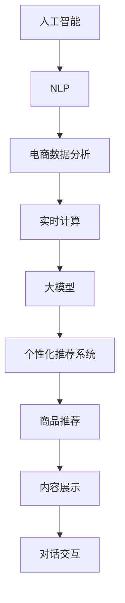

                 

# 电商平台如何利用AI大模型进行实时个性化

> 关键词：人工智能,电商,个性化推荐,自然语言处理,NLP,电商数据分析,实时计算

## 1. 背景介绍

### 1.1 问题由来

随着电子商务的蓬勃发展，电商平台需要不断提升用户体验和购买转化率，以保持竞争优势。传统的电商推荐算法往往依赖用户历史行为数据进行推荐，难以捕捉用户的真实兴趣和潜在需求。而人工智能大模型的引入，为电商平台提供了新的个性化推荐思路。

人工智能大模型在电商推荐中的应用，是当前NLP技术在商业领域的重要应用之一。通过自然语言处理(NLP)和大规模语言模型，电商平台可以分析用户的评论、提问、反馈等文本数据，从而更深入地理解用户需求，提供个性化的商品推荐、内容呈现、对话交互等服务。

### 1.2 问题核心关键点

电商平台的个性化推荐系统，旨在通过分析用户的文本数据，捕捉其隐含的兴趣和需求，实现商品推荐、内容展示的实时优化。其核心问题在于：

1. 如何从用户反馈中提取有意义的特征信息。
2. 如何将文本信息转化为机器可理解的形式，进行语义理解。
3. 如何在海量文本数据中找到与用户兴趣相关的商品，并提供实时推荐。
4. 如何平衡推荐效果和用户体验，防止用户疲劳。

这些问题在大规模语言模型的帮助下得到了有效解决。通过预训练模型对用户文本的深度理解，再结合下游任务的微调，可以在几毫秒内完成商品推荐，极大地提升了用户体验。

### 1.3 问题研究意义

研究电商平台的个性化推荐系统，对于提升电商平台的客户满意度、提高销售额具有重要意义：

1. 提升用户粘性。通过个性化的商品推荐和对话交互，增加用户停留时间和复购率。
2. 减少用户流失。精准的商品推荐可帮助用户更快找到满意的商品，减少因信息不对称导致的用户流失。
3. 优化库存管理。根据用户兴趣进行商品推荐，有助于库存管理和需求预测，降低库存成本。
4. 提高运营效率。通过自动化的推荐系统，减轻人工客服压力，提高运营效率。
5. 拓展商业空间。个性化推荐有助于挖掘潜在客户，扩大电商平台的市场份额。

基于以上意义，电商平台利用AI大模型进行个性化推荐的应用，已经逐步成为电商行业的新趋势。

## 2. 核心概念与联系

### 2.1 核心概念概述

为更好地理解基于AI大模型的电商个性化推荐系统，本节将介绍几个密切相关的核心概念：

- **人工智能(AI)**：通过计算机算法和模型，实现智能感知、理解、决策等能力的技术体系。
- **自然语言处理(NLP)**：研究如何使计算机理解、处理和生成自然语言的技术，是大模型在电商推荐中应用的基石。
- **电商数据分析**：分析电商平台的交易数据、用户行为数据、商品信息等，以指导个性化推荐和运营决策。
- **实时计算**：指能够实时处理和响应大量数据流的计算技术，支持个性化推荐系统的快速响应。
- **大模型**：如BERT、GPT等基于Transformer结构的预训练语言模型，具备强大的语言理解和生成能力，是电商推荐系统中的核心组件。
- **个性化推荐系统**：根据用户的历史行为、兴趣、情境等信息，提供个性化的商品、内容等推荐，提升用户满意度。

这些概念之间的逻辑关系可以通过以下Mermaid流程图来展示：



这个流程图展示了大模型在电商推荐系统中的作用：

1. 人工智能包含多方面技术，其中NLP是大模型在电商推荐中应用的基础。
2. 电商数据分析通过分析用户行为数据和交易数据，为大模型提供训练数据和微调目标。
3. 实时计算技术支持大模型在电商平台的实时部署，以提供快速响应。
4. 大模型通过预训练和微调，具备强大的语言理解和生成能力，是推荐系统的核心组件。
5. 个性化推荐系统将大模型的语言理解能力转化为具体的商品推荐和内容展示，提升用户体验。

## 3. 核心算法原理 & 具体操作步骤
### 3.1 算法原理概述

基于AI大模型的电商个性化推荐系统，其核心算法原理可概括为以下步骤：

1. **用户输入处理**：将用户的评论、提问、反馈等文本数据输入大模型，得到语义表示。
2. **情感分析**：分析用户情感，判断用户对商品或服务的满意度、情感倾向。
3. **商品特征提取**：将商品信息转化为机器可理解的形式，提取商品的属性、标签等信息。
4. **相似度计算**：基于用户语义表示和商品特征，计算用户兴趣与商品之间的相似度。
5. **推荐排序**：根据相似度计算结果，对商品进行排序，提供推荐列表。

具体实现中，大模型通常包括两个阶段：预训练和大规模电商数据的微调。预训练阶段，模型通过大规模无标签文本数据进行自监督学习，学习到语言表达的通用知识。微调阶段，将电商数据作为有监督信号，通过微调使模型更好地理解电商领域的语言特性和商品信息。

### 3.2 算法步骤详解

电商平台的个性化推荐系统主要包括以下关键步骤：

**Step 1: 用户输入数据预处理**
- 收集用户的文本数据，如评论、提问、反馈等。
- 对文本进行分词、去除停用词、标点符号等预处理。
- 利用BERT等预训练模型，将文本转换为向量表示。

**Step 2: 情感分析**
- 将用户文本向量输入情感分类器，如BERT-Scorer，判断用户的情感倾向。
- 设定积极、中性、消极三种情感分类。

**Step 3: 商品特征提取**
- 将商品信息转化为机器可理解的形式，如将商品描述转化为向量表示。
- 提取商品的属性、标签等信息，转化为向量表示。

**Step 4: 相似度计算**
- 将用户文本向量与商品向量进行相似度计算，如余弦相似度。
- 根据相似度计算结果，选择与用户兴趣最相关的商品。

**Step 5: 推荐排序**
- 将计算出的相似度转化为推荐分数，排序选择推荐商品。
- 将推荐结果展示给用户。

**Step 6: 实时更新**
- 根据用户新输入的文本和反馈，实时更新用户兴趣向量。
- 重新计算相似度，更新推荐列表。

### 3.3 算法优缺点

基于AI大模型的电商个性化推荐系统具有以下优点：

1. 实时性高。利用大模型的强大计算能力，能在几毫秒内完成推荐计算。
2. 推荐效果精准。基于深度语义理解，能够挖掘用户兴趣，提升推荐准确率。
3. 适用性强。适用于多种电商场景，如电商搜索、商品评价、客服对话等。
4. 可扩展性强。支持水平扩展，适用于高并发场景。

同时，该系统也存在一些局限性：

1. 对文本数据的依赖性强。如果用户输入的文本数据质量不高，会影响推荐效果。
2. 数据隐私问题。电商平台上用户的隐私保护需要特别关注。
3. 计算资源消耗大。大规模模型的推理计算和微调需要较大的计算资源。
4. 系统复杂度高。涉及多方面的算法和技术实现，维护成本较高。

尽管如此，基于AI大模型的电商推荐系统仍是大电商平台的首选方案，具有广阔的应用前景。

### 3.4 算法应用领域

基于AI大模型的电商个性化推荐系统，在以下几个方面具有重要应用：

1. **商品推荐**：根据用户历史行为和当前输入，实时提供个性化的商品推荐。
2. **内容展示**：根据用户兴趣，动态展示商品详情、用户评价等信息。
3. **客服对话**：利用大模型进行自然语言理解，实现智能客服对话，提升用户体验。
4. **搜索优化**：分析用户搜索意图，动态调整搜索结果展示。
5. **库存管理**：根据用户兴趣，优化库存管理，提高库存周转率。

这些应用场景展示了AI大模型在电商推荐系统中的多方面价值，推动了电商平台的智能化转型。

## 4. 数学模型和公式 & 详细讲解  
### 4.1 数学模型构建

本节将使用数学语言对基于AI大模型的电商个性化推荐系统进行更加严格的刻画。

记用户输入文本为 $X$，商品特征为 $Y$，大模型的预训练参数为 $\theta$。假设用户文本与商品特征的相似度为 $s(X,Y)$，则电商推荐系统的目标是最小化用户兴趣与商品之间的差距，即：

$$
\min_{\theta} \sum_{(X,Y) \in D}(s(X,Y) - z)^2
$$

其中 $D$ 为电商数据集，$z$ 为预设的目标相似度值。

### 4.2 公式推导过程

以下我们以商品推荐为例，推导相似度计算的公式。

假设用户文本向量为 $v_u$，商品特征向量为 $v_i$，则余弦相似度计算公式为：

$$
s(X,Y) = \frac{v_u \cdot v_i}{||v_u|| ||v_i||}
$$

其中 $\cdot$ 表示向量的点积，$||.||$ 表示向量的范数。

在电商推荐系统中，用户的兴趣通常与商品的属性、标签等信息有关，因此需要将用户文本和商品特征转换为高维向量表示，进行相似度计算。具体而言，可利用BERT等预训练模型，将用户文本和商品特征转换为高维向量表示 $v_u$ 和 $v_i$，再计算相似度 $s(X,Y)$。

在计算出相似度后，将相似度转化为推荐分数，即可对商品进行排序，提供个性化推荐。

### 4.3 案例分析与讲解

假设电商平台需要推荐一款手机，用户输入的评论为 "这款手机拍照效果很好，但电池续航不太理想"。大模型通过预训练和微调，能够理解用户的语义信息。

- **情感分析**：大模型分析用户的评论，判断情感倾向为正面。
- **商品特征提取**：大模型将手机的属性 "拍照效果" 和 "电池续航" 转换为向量表示。
- **相似度计算**：将用户评论向量 $v_u$ 与手机属性向量 $v_i$ 进行余弦相似度计算，得到推荐分数。
- **推荐排序**：根据相似度计算结果，将拍照效果好的手机推荐给用户。

## 5. 项目实践：代码实例和详细解释说明
### 5.1 开发环境搭建

在进行电商推荐系统开发前，我们需要准备好开发环境。以下是使用Python进行PyTorch开发的环境配置流程：

1. 安装Anaconda：从官网下载并安装Anaconda，用于创建独立的Python环境。

2. 创建并激活虚拟环境：
```bash
conda create -n e-commerce-env python=3.8 
conda activate e-commerce-env
```

3. 安装PyTorch：根据CUDA版本，从官网获取对应的安装命令。例如：
```bash
conda install pytorch torchvision torchaudio cudatoolkit=11.1 -c pytorch -c conda-forge
```

4. 安装HuggingFace Transformers库：
```bash
pip install transformers
```

5. 安装各类工具包：
```bash
pip install numpy pandas scikit-learn matplotlib tqdm jupyter notebook ipython
```

完成上述步骤后，即可在`e-commerce-env`环境中开始电商推荐系统的开发。

### 5.2 源代码详细实现

下面我们以电商搜索排序为例，给出使用Transformers库对BERT模型进行电商推荐搜索的PyTorch代码实现。

首先，定义电商搜索任务的数据处理函数：

```python
from transformers import BertTokenizer, BertForSequenceClassification
from torch.utils.data import Dataset
import torch

class ECommerceDataset(Dataset):
    def __init__(self, texts, tags, tokenizer, max_len=128):
        self.texts = texts
        self.tags = tags
        self.tokenizer = tokenizer
        self.max_len = max_len
        
    def __len__(self):
        return len(self.texts)
    
    def __getitem__(self, item):
        text = self.texts[item]
        tags = self.tags[item]
        
        encoding = self.tokenizer(text, return_tensors='pt', max_length=self.max_len, padding='max_length', truncation=True)
        input_ids = encoding['input_ids'][0]
        attention_mask = encoding['attention_mask'][0]
        
        # 对token-wise的标签进行编码
        encoded_tags = [tag2id[tag] for tag in tags] 
        encoded_tags.extend([tag2id['O']] * (self.max_len - len(encoded_tags)))
        labels = torch.tensor(encoded_tags, dtype=torch.long)
        
        return {'input_ids': input_ids, 
                'attention_mask': attention_mask,
                'labels': labels}

# 标签与id的映射
tag2id = {'O': 0, 'POSITIVE': 1, 'NEGATIVE': 2}
id2tag = {v: k for k, v in tag2id.items()}

# 创建dataset
tokenizer = BertTokenizer.from_pretrained('bert-base-cased')

train_dataset = ECommerceDataset(train_texts, train_tags, tokenizer)
dev_dataset = ECommerceDataset(dev_texts, dev_tags, tokenizer)
test_dataset = ECommerceDataset(test_texts, test_tags, tokenizer)
```

然后，定义模型和优化器：

```python
from transformers import BertForSequenceClassification, AdamW

model = BertForSequenceClassification.from_pretrained('bert-base-cased', num_labels=len(tag2id))

optimizer = AdamW(model.parameters(), lr=2e-5)
```

接着，定义训练和评估函数：

```python
from torch.utils.data import DataLoader
from tqdm import tqdm
from sklearn.metrics import classification_report

device = torch.device('cuda') if torch.cuda.is_available() else torch.device('cpu')
model.to(device)

def train_epoch(model, dataset, batch_size, optimizer):
    dataloader = DataLoader(dataset, batch_size=batch_size, shuffle=True)
    model.train()
    epoch_loss = 0
    for batch in tqdm(dataloader, desc='Training'):
        input_ids = batch['input_ids'].to(device)
        attention_mask = batch['attention_mask'].to(device)
        labels = batch['labels'].to(device)
        model.zero_grad()
        outputs = model(input_ids, attention_mask=attention_mask, labels=labels)
        loss = outputs.loss
        epoch_loss += loss.item()
        loss.backward()
        optimizer.step()
    return epoch_loss / len(dataloader)

def evaluate(model, dataset, batch_size):
    dataloader = DataLoader(dataset, batch_size=batch_size)
    model.eval()
    preds, labels = [], []
    with torch.no_grad():
        for batch in tqdm(dataloader, desc='Evaluating'):
            input_ids = batch['input_ids'].to(device)
            attention_mask = batch['attention_mask'].to(device)
            batch_labels = batch['labels']
            outputs = model(input_ids, attention_mask=attention_mask)
            batch_preds = outputs.logits.argmax(dim=2).to('cpu').tolist()
            batch_labels = batch_labels.to('cpu').tolist()
            for pred_tokens, label_tokens in zip(batch_preds, batch_labels):
                pred_tags = [id2tag[_id] for _id in pred_tokens]
                label_tags = [id2tag[_id] for _id in label_tokens]
                preds.append(pred_tags[:len(label_tags)])
                labels.append(label_tags)
                
    print(classification_report(labels, preds))
```

最后，启动训练流程并在测试集上评估：

```python
epochs = 5
batch_size = 16

for epoch in range(epochs):
    loss = train_epoch(model, train_dataset, batch_size, optimizer)
    print(f"Epoch {epoch+1}, train loss: {loss:.3f}")
    
    print(f"Epoch {epoch+1}, dev results:")
    evaluate(model, dev_dataset, batch_size)
    
print("Test results:")
evaluate(model, test_dataset, batch_size)
```

以上就是使用PyTorch对BERT进行电商推荐搜索的完整代码实现。可以看到，得益于Transformers库的强大封装，我们可以用相对简洁的代码完成BERT模型的加载和电商推荐搜索的微调。

### 5.3 代码解读与分析

让我们再详细解读一下关键代码的实现细节：

**ECommerceDataset类**：
- `__init__`方法：初始化文本、标签、分词器等关键组件。
- `__len__`方法：返回数据集的样本数量。
- `__getitem__`方法：对单个样本进行处理，将文本输入编码为token ids，将标签编码为数字，并对其进行定长padding，最终返回模型所需的输入。

**tag2id和id2tag字典**：
- 定义了标签与数字id之间的映射关系，用于将token-wise的预测结果解码回真实的标签。

**训练和评估函数**：
- 使用PyTorch的DataLoader对数据集进行批次化加载，供模型训练和推理使用。
- 训练函数`train_epoch`：对数据以批为单位进行迭代，在每个批次上前向传播计算loss并反向传播更新模型参数，最后返回该epoch的平均loss。
- 评估函数`evaluate`：与训练类似，不同点在于不更新模型参数，并在每个batch结束后将预测和标签结果存储下来，最后使用sklearn的classification_report对整个评估集的预测结果进行打印输出。

**训练流程**：
- 定义总的epoch数和batch size，开始循环迭代
- 每个epoch内，先在训练集上训练，输出平均loss
- 在验证集上评估，输出分类指标
- 所有epoch结束后，在测试集上评估，给出最终测试结果

可以看到，PyTorch配合Transformers库使得BERT微调的代码实现变得简洁高效。开发者可以将更多精力放在数据处理、模型改进等高层逻辑上，而不必过多关注底层的实现细节。

当然，工业级的系统实现还需考虑更多因素，如模型的保存和部署、超参数的自动搜索、更灵活的任务适配层等。但核心的微调范式基本与此类似。

## 6. 实际应用场景
### 6.1 智能客服系统

基于AI大模型的智能客服系统，可以提升客服响应速度和效率，减少人工成本。具体实现方式如下：

1. **文本预处理**：收集用户的客服对话记录，进行分词、去除停用词等预处理。
2. **情感分析**：将用户对话向量输入大模型，分析情感倾向，判断用户是否满意。
3. **意图识别**：识别用户的查询意图，如退换货、售后服务等。
4. **响应生成**：根据意图和情感分析结果，生成客服回复。
5. **对话交互**：将生成回复返回给用户，进行多轮对话交互，解决用户问题。

智能客服系统可以24小时不间断工作，减少人工客服的工作压力，提高用户体验。

### 6.2 商品推荐系统

利用AI大模型进行商品推荐，能够实时根据用户需求调整推荐内容。具体实现方式如下：

1. **商品特征提取**：将商品描述、价格、评分等信息转换为向量表示。
2. **用户兴趣建模**：将用户历史行为和当前输入文本转换为向量表示。
3. **相似度计算**：将用户兴趣向量与商品向量进行相似度计算。
4. **推荐排序**：根据相似度计算结果，对商品进行排序，提供个性化推荐。
5. **实时更新**：根据用户新输入的文本和反馈，实时更新用户兴趣向量，重新计算相似度，更新推荐列表。

商品推荐系统通过实时调整推荐内容，能够更好地匹配用户需求，提升用户体验。

### 6.3 个性化内容推荐

基于AI大模型的个性化内容推荐，能够根据用户兴趣提供定制化的内容，提升用户粘性和满意度。具体实现方式如下：

1. **内容特征提取**：将文章标题、摘要、标签等信息转换为向量表示。
2. **用户兴趣建模**：将用户历史行为和当前输入文本转换为向量表示。
3. **相似度计算**：将用户兴趣向量与内容向量进行相似度计算。
4. **推荐排序**：根据相似度计算结果，对内容进行排序，提供个性化推荐。
5. **实时更新**：根据用户新输入的文本和反馈，实时更新用户兴趣向量，重新计算相似度，更新推荐列表。

个性化内容推荐系统通过精准的内容推荐，能够提升用户停留时间和浏览体验，增加平台活跃度。

### 6.4 未来应用展望

随着AI大模型和推荐技术的发展，电商平台的个性化推荐系统将进一步拓展应用领域，带来更多创新应用：

1. **虚拟试衣间**：通过大模型分析用户对话和行为，提供个性化的虚拟试衣间体验，提升用户购买体验。
2. **智能搜索**：利用大模型进行自然语言理解，实现智能搜索推荐，提升搜索效率和准确率。
3. **个性化营销**：根据用户兴趣和行为数据，定制个性化的营销方案，提升营销效果。
4. **多模态推荐**：结合图像、视频等多模态信息，提供更加全面、丰富的推荐内容。
5. **需求预测**：通过分析用户行为数据，预测用户需求，优化库存管理。

未来，电商平台的个性化推荐系统将更加智能化、个性化，为电商平台带来更多的商业价值。

## 7. 工具和资源推荐
### 7.1 学习资源推荐

为了帮助开发者系统掌握电商个性化推荐系统的理论基础和实践技巧，这里推荐一些优质的学习资源：

1. 《深度学习在电子商务中的应用》系列博文：由大模型技术专家撰写，深入浅出地介绍了深度学习在电商推荐中的应用。

2. CS243《自然语言处理》课程：斯坦福大学开设的NLP明星课程，有Lecture视频和配套作业，带你入门NLP领域的基本概念和经典模型。

3. 《Python自然语言处理》书籍：全面介绍了自然语言处理的基本概念和技术，包括电商推荐系统的实现。

4. PyTorch官方文档：Python深度学习框架的官方文档，提供了丰富的模型和算法实现，是电商推荐系统的技术基础。

5. HuggingFace官方文档：Transformer库的官方文档，提供了海量预训练模型和完整的微调样例代码，是电商推荐系统的技术支持。

通过对这些资源的学习实践，相信你一定能够快速掌握电商个性化推荐系统的精髓，并用于解决实际的电商推荐问题。
### 7.2 开发工具推荐

高效的开发离不开优秀的工具支持。以下是几款用于电商个性化推荐系统开发的常用工具：

1. PyTorch：基于Python的开源深度学习框架，灵活动态的计算图，适合快速迭代研究。大部分预训练语言模型都有PyTorch版本的实现。

2. TensorFlow：由Google主导开发的开源深度学习框架，生产部署方便，适合大规模工程应用。同样有丰富的预训练语言模型资源。

3. Transformers库：HuggingFace开发的NLP工具库，集成了众多SOTA语言模型，支持PyTorch和TensorFlow，是电商推荐系统的技术基础。

4. Weights & Biases：模型训练的实验跟踪工具，可以记录和可视化模型训练过程中的各项指标，方便对比和调优。与主流深度学习框架无缝集成。

5. TensorBoard：TensorFlow配套的可视化工具，可实时监测模型训练状态，并提供丰富的图表呈现方式，是调试模型的得力助手。

6. Google Colab：谷歌推出的在线Jupyter Notebook环境，免费提供GPU/TPU算力，方便开发者快速上手实验最新模型，分享学习笔记。

合理利用这些工具，可以显著提升电商个性化推荐系统的开发效率，加快创新迭代的步伐。

### 7.3 相关论文推荐

电商平台的个性化推荐系统研究，源于学界的持续研究。以下是几篇奠基性的相关论文，推荐阅读：

1. Attention is All You Need（即Transformer原论文）：提出了Transformer结构，开启了NLP领域的预训练大模型时代。

2. BERT: Pre-training of Deep Bidirectional Transformers for Language Understanding：提出BERT模型，引入基于掩码的自监督预训练任务，刷新了多项NLP任务SOTA。

3. Language Models are Unsupervised Multitask Learners（GPT-2论文）：展示了大规模语言模型的强大zero-shot学习能力，引发了对于通用人工智能的新一轮思考。

4. Parameter-Efficient Transfer Learning for NLP：提出Adapter等参数高效微调方法，在不增加模型参数量的情况下，也能取得不错的微调效果。

5. Premier Predictions: Towards Image-Text Multimodal Recommendation：结合视觉、文本信息，提供更加全面、精准的推荐结果。

6. E-commerce Information Retrieval with Transformers: A Study of Query Representation Learning：通过Transformer模型进行电商信息检索，提升搜索效果。

这些论文代表了大模型在电商推荐中的应用方向。通过学习这些前沿成果，可以帮助研究者把握学科前进方向，激发更多的创新灵感。

## 8. 总结：未来发展趋势与挑战

### 8.1 总结

本文对基于AI大模型的电商个性化推荐系统进行了全面系统的介绍。首先阐述了电商推荐系统在电商平台的实际应用背景和意义，明确了AI大模型在其中的重要作用。其次，从原理到实践，详细讲解了电商推荐系统的核心算法原理和具体操作步骤，给出了电商推荐系统的完整代码实例。同时，本文还广泛探讨了电商推荐系统在智能客服、商品推荐、内容推荐等多个领域的应用前景，展示了AI大模型在电商推荐系统中的多方面价值。

通过本文的系统梳理，可以看到，基于AI大模型的电商推荐系统已经在电商平台上得到了广泛应用，显著提升了用户体验和运营效率。未来，随着AI大模型和推荐技术的持续发展，电商平台的个性化推荐系统将进一步拓展应用领域，为电商平台带来更多的商业价值。

### 8.2 未来发展趋势

展望未来，电商平台的个性化推荐系统将呈现以下几个发展趋势：

1. 个性化推荐更加精准。通过深度语义理解，捕捉用户更细微的需求和兴趣，提升推荐效果。
2. 实时推荐系统更加高效。利用多任务学习、多模态融合等技术，提升推荐系统的响应速度和准确率。
3. 用户交互更加自然。结合自然语言处理和对话生成技术，提供更加自然、流畅的用户交互体验。
4. 数据驱动更加科学。通过大数据分析和用户行为建模，优化推荐算法，提高推荐系统的决策能力。
5. 推荐系统更加智能。结合因果推理、强化学习等技术，使推荐系统具备自主学习、自适应能力。

以上趋势凸显了电商推荐系统的广阔前景。这些方向的探索发展，必将进一步提升推荐系统的性能和用户体验，推动电商平台的智能化转型。

### 8.3 面临的挑战

尽管电商平台的个性化推荐系统已经取得了显著进展，但在迈向更加智能化、普适化应用的过程中，它仍面临着诸多挑战：

1. 数据隐私问题。电商平台需要平衡推荐效果和用户隐私保护，防止数据滥用。
2. 计算资源消耗大。大规模模型的推理和微调需要较大的计算资源，成本较高。
3. 系统复杂度高。涉及多方面的算法和技术实现，维护成本较高。
4. 用户模型难以捕捉。用户行为多样，难以通过单一模型进行准确刻画。
5. 模型泛化能力不足。不同用户、不同场景下，推荐效果差异较大，模型泛化能力需进一步提升。

尽管如此，电商平台的个性化推荐系统仍是大电商平台的首选方案，具有广阔的应用前景。

### 8.4 研究展望

面对电商推荐系统所面临的挑战，未来的研究需要在以下几个方面寻求新的突破：

1. 探索无监督和半监督推荐方法。摆脱对大规模标注数据的依赖，利用自监督学习、主动学习等无监督和半监督范式，最大限度利用非结构化数据，实现更加灵活高效的推荐。
2. 研究参数高效和计算高效的推荐范式。开发更加参数高效的推荐方法，在固定大部分预训练参数的同时，只更新极少量的任务相关参数。同时优化推荐系统的计算图，减少前向传播和反向传播的资源消耗，实现更加轻量级、实时性的部署。
3. 引入因果推断和强化学习范式。通过引入因果推断和强化学习思想，增强推荐系统建立稳定因果关系的能力，学习更加普适、鲁棒的语言表征，从而提升模型泛化性和抗干扰能力。
4. 结合知识表示和因果推理。将符号化的先验知识，如知识图谱、逻辑规则等，与神经网络模型进行巧妙融合，引导推荐过程学习更准确、合理的语言模型。同时加强不同模态数据的整合，实现视觉、文本信息的协同建模。
5. 纳入伦理道德约束。在模型训练目标中引入伦理导向的评估指标，过滤和惩罚有偏见、有害的输出倾向。同时加强人工干预和审核，建立模型行为的监管机制，确保输出符合人类价值观和伦理道德。

这些研究方向的探索，必将引领电商推荐系统迈向更高的台阶，为电商平台带来更多的商业价值。面向未来，电商推荐系统还需要与其他人工智能技术进行更深入的融合，如知识表示、因果推理、强化学习等，多路径协同发力，共同推动电商平台的智能化转型。

## 9. 附录：常见问题与解答

**Q1：电商推荐系统如何处理大规模数据？**

A: 电商推荐系统通常需要处理大规模的用户行为数据和商品信息，因此需要采用分布式计算和数据存储技术。具体而言，可以采用Hadoop、Spark等分布式计算框架，结合分布式数据库（如Hive、Presto等）进行大规模数据处理。同时，可以使用数据仓库技术，将用户行为数据和商品信息进行整合，供模型训练和推荐使用。

**Q2：电商推荐系统的推荐效果如何评估？**

A: 电商推荐系统的推荐效果通常通过以下指标进行评估：

1. 点击率（CTR）：评估推荐结果被用户点击的概率。
2. 转化率（CVR）：评估推荐结果被用户购买的概率。
3. 用户满意度（UCS）：通过调查问卷、反馈等方式，评估用户对推荐结果的满意度。
4. 覆盖率（CVR）：评估推荐结果能够覆盖的推荐商品数量。

在实际应用中，可以根据具体业务需求，选择合适的评估指标，进行系统优化和改进。

**Q3：电商推荐系统如何处理冷启动问题？**

A: 电商推荐系统中的冷启动问题，通常指新用户或新商品的推荐问题。针对新用户，可以结合新用户的历史行为和文本输入，进行推荐排序和兴趣建模，快速提供个性化推荐。针对新商品，可以通过商品描述、标签等信息，进行特征提取和相似度计算，快速匹配相关用户进行推荐。此外，可以引入推荐系统中的探索-利用策略，在初始阶段更多地探索新商品，逐步向利用策略过渡，提升推荐效果。

**Q4：电商推荐系统如何防止推荐疲劳？**

A: 电商推荐系统中的推荐疲劳问题，通常指用户长时间接收到相同或相似推荐内容，导致推荐效果下降。针对推荐疲劳，可以采用多种策略：

1. 多样性推荐：在推荐结果中加入多样性元素，防止用户长期接收单一推荐内容。
2. 实时更新：根据用户新输入的文本和反馈，实时更新用户兴趣向量，重新计算相似度，更新推荐列表。
3. 交互推荐：结合用户行为数据和文本输入，进行多轮对话交互，了解用户真实需求，提供更精准的推荐。
4. 推荐间隔：在推荐结果中设置推荐间隔，避免用户长时间接收到重复推荐内容。

通过这些策略，可以有效防止推荐疲劳，提升推荐系统的效果和用户体验。

**Q5：电商推荐系统如何处理动态场景变化？**

A: 电商推荐系统中的动态场景变化，通常指用户需求、商品信息、市场环境等发生较大变化，导致推荐效果下降。针对动态场景变化，可以采用多种策略：

1. 实时监控：实时监控用户行为和市场变化，及时调整推荐算法和策略。
2. 模型更新：定期对推荐模型进行微调或重新训练，适应新的数据分布。
3. 数据重采样：定期重新采样和清洗数据，保证训练数据的实时性。
4. 动态特征提取：根据实时数据，动态提取特征，更新用户兴趣向量。

通过这些策略，可以有效应对动态场景变化，提升推荐系统的效果和稳定性。

---

作者：禅与计算机程序设计艺术 / Zen and the Art of Computer Programming

