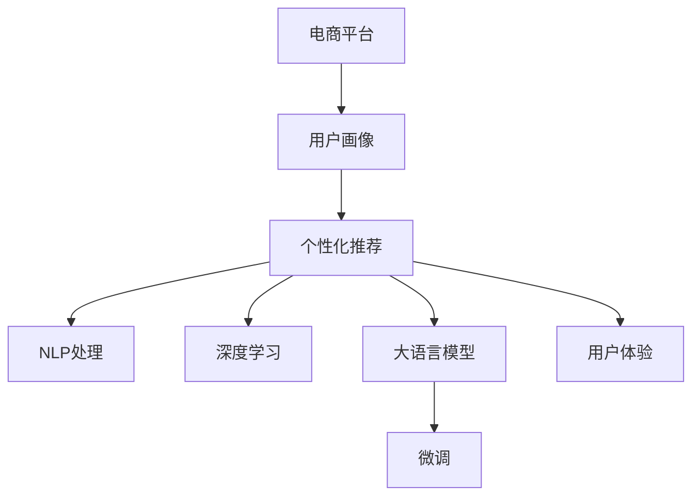

                 

# 电商平台引入AI大模型后的用户体验变革

> 关键词：电商平台,用户画像,个性化推荐,自然语言处理,NLP,大语言模型,深度学习,用户体验

## 1. 背景介绍

### 1.1 问题由来

随着互联网电商的迅速发展，各大电商平台面临着用户增长迅速、个性化需求提升等挑战。传统的电商推荐系统多采用基于规则或协同过滤的推荐算法，但由于数据量庞大、用户行为复杂，这些方法难以精准捕捉用户兴趣变化，推荐效果不佳。如何提升推荐系统智能化水平，为用户提供更个性化、精准的购物体验，成为电商平台亟需解决的问题。

### 1.2 问题核心关键点

- 用户画像：构建详细的用户画像，了解用户偏好和行为模式。
- 个性化推荐：根据用户画像，提供个性化的商品推荐。
- 自然语言处理(NLP)：利用NLP技术进行用户查询理解、商品描述解析，提升推荐系统智能水平。
- 大语言模型：使用预训练的大语言模型，通过微调提升推荐模型性能。
- 用户体验：通过改善推荐系统，提升用户满意度，增加用户粘性。

通过引入AI大模型，电商平台可以大幅提升推荐系统的智能化水平，满足用户个性化需求，提升整体用户体验。

### 1.3 问题研究意义

研究AI大模型在电商平台中的应用，对于推动电商平台智能化转型、优化用户购物体验具有重要意义：

- 精准推荐：AI大模型可以分析用户海量数据，发现用户兴趣变化，提供更精准的推荐结果。
- 提升销量：个性化推荐能够满足用户个性化需求，有效提升用户转化率和购物满意度。
- 成本节约：AI大模型可以自动优化推荐策略，减少人工干预和运营成本。
- 用户粘性：更精准的推荐系统能够提升用户购物体验，增强用户粘性。
- 数据驱动：通过数据驱动推荐，更好地理解用户需求，为电商业务决策提供科学依据。

## 2. 核心概念与联系

### 2.1 核心概念概述

为更好地理解AI大模型在电商平台中的用户推荐系统优化，本节将介绍几个密切相关的核心概念：

- 电商平台：指通过互联网进行商品交易的平台，如淘宝、京东、拼多多等。
- 用户画像：指对用户的行为、兴趣、需求等信息进行分析和描述，用于个性化推荐。
- 个性化推荐系统：指根据用户画像，提供个性化的商品推荐。
- 自然语言处理(NLP)：指利用计算机技术处理、理解、生成自然语言的技术，如文本分类、实体识别、情感分析等。
- 大语言模型：指通过自监督学习在大规模语料上预训练的通用语言模型，如BERT、GPT等。
- 深度学习：指利用神经网络模型处理数据的技术，用于优化推荐系统性能。
- 用户体验：指用户在电商平台上的购物体验，包括界面友好、推荐精准、支付便捷等。

这些核心概念之间的逻辑关系可以通过以下Mermaid流程图来展示：



这个流程图展示了几大核心概念及其之间的联系：

1. 电商平台通过用户行为数据构建用户画像。
2. 基于用户画像，利用NLP技术和深度学习优化个性化推荐系统。
3. 使用预训练的大语言模型，通过微调提升推荐模型性能。
4. 最终通过优化后的个性化推荐系统，提升用户体验。

## 3. 核心算法原理 & 具体操作步骤
### 3.1 算法原理概述

基于大语言模型优化电商推荐系统，核心在于利用NLP技术处理用户查询和商品描述，构建用户画像，并通过深度学习模型进行个性化推荐。

具体步骤如下：

1. 收集用户行为数据，包括浏览记录、购买记录、评论等。
2. 利用NLP技术对用户查询和商品描述进行解析，提取用户兴趣和商品特征。
3. 构建用户画像，刻画用户的兴趣、需求、行为模式等信息。
4. 设计推荐模型，利用深度学习模型对用户画像和商品特征进行处理，生成推荐结果。
5. 使用大语言模型对推荐模型进行微调，提升模型的精准度和泛化能力。

通过以上步骤，电商平台可以构建出更加智能化、精准的推荐系统，大幅提升用户体验。

### 3.2 算法步骤详解

以下详细介绍基于大语言模型优化电商推荐系统的详细步骤：

**Step 1: 数据收集与预处理**

- 收集用户行为数据：包括浏览记录、购买记录、评论、搜索记录等。
- 数据清洗与预处理：去除无关信息、处理缺失值、归一化等。

**Step 2: 用户画像构建**

- 文本分析：利用NLP技术对用户查询和商品描述进行情感分析、实体识别、主题建模等，提取用户兴趣和商品特征。
- 用户画像：将用户兴趣、需求、行为模式等信息进行整合，形成详细的用户画像。

**Step 3: 推荐模型设计**

- 模型选择：选择适当的深度学习模型，如协同过滤、矩阵分解、神经网络等。
- 特征提取：设计特征提取器，将用户画像和商品特征转换为模型输入。
- 训练模型：在标注数据集上训练推荐模型，调整模型参数。

**Step 4: 大语言模型微调**

- 预训练模型：选择预训练的大语言模型，如BERT、GPT等。
- 微调模型：在大语言模型的基础上，使用推荐模型作为任务，进行微调训练。
- 优化参数：优化模型超参数，如学习率、批大小、迭代轮数等。

**Step 5: 模型评估与部署**

- 模型评估：在验证集上评估推荐模型性能，如准确率、召回率、F1-score等。
- 部署上线：将微调后的模型部署到电商平台，实时生成推荐结果。
- 反馈循环：定期收集用户反馈，优化推荐策略和模型性能。

### 3.3 算法优缺点

基于大语言模型优化电商推荐系统有以下优点：

- 精准推荐：AI大模型能够处理大规模数据，发现用户兴趣变化，提供更精准的推荐结果。
- 泛化能力强：大语言模型可以学习通用的语言表示，提升推荐模型的泛化能力。
- 数据驱动：通过深度学习模型和NLP技术，可以更好地理解用户需求，优化推荐策略。
- 用户满意度高：更精准的推荐系统能够提升用户购物体验，增加用户粘性。

同时，该方法也存在一定的局限性：

- 数据质量要求高：推荐模型性能高度依赖于数据质量，数据偏差可能影响推荐效果。
- 模型复杂度高：大语言模型的训练和微调过程较为复杂，需要较高的计算资源。
- 算法黑盒：深度学习模型的决策过程不透明，难以解释，存在一定的信任危机。

尽管存在这些局限性，但就目前而言，基于大语言模型的推荐方法仍是电商平台优化推荐系统的有效手段。未来相关研究的重点在于如何进一步降低推荐算法对数据的依赖，提高推荐系统的透明度和可解释性，同时兼顾模型的实时性和高效性。

### 3.4 算法应用领域

基于大语言模型优化电商推荐系统的方法，已在各大电商平台中得到广泛应用，如淘宝、京东、拼多多等。以下是几个典型应用场景：

- 个性化推荐：根据用户画像，提供个性化的商品推荐，提升用户满意度。
- 用户行为分析：利用NLP技术分析用户行为数据，提升广告投放效果。
- 商品分类与推荐：利用NLP技术对商品描述进行分类，提升推荐系统性能。
- 智能客服：利用NLP技术处理用户查询，提升客服响应效率。
- 评论分析：利用NLP技术对用户评论进行情感分析，提升商品优化策略。

除了以上场景外，大语言模型还可以用于构建电商平台的搜索系统、社交系统、广告投放等多个领域，进一步拓展电商平台的智能化水平。

## 4. 数学模型和公式 & 详细讲解 & 举例说明
### 4.1 数学模型构建

基于大语言模型优化电商推荐系统，涉及多个数学模型，本节将详细讲解其中的关键数学模型。

记电商平台为 $E$，用户集合为 $U$，商品集合为 $I$。用户画像 $P$ 包括用户兴趣 $I_1$、行为模式 $B$ 等信息。推荐模型 $R$ 根据用户画像和商品特征 $X$ 生成推荐结果 $Y$。

推荐模型的目标是最小化预测误差的平方和，即：

$$
\min_{R} \frac{1}{n}\sum_{i=1}^n (y_i - \hat{y}_i)^2
$$

其中，$y_i$ 为真实标签，$\hat{y}_i$ 为模型预测值。

使用大语言模型对推荐模型进行微调，可以表示为：

$$
\min_{\theta} \mathcal{L}(\theta) = \frac{1}{N}\sum_{i=1}^N \ell(R(x_i;\theta), y_i)
$$

其中，$\theta$ 为微调后的模型参数，$\mathcal{L}$ 为损失函数，$\ell$ 为推荐模型的损失函数。

### 4.2 公式推导过程

以下以推荐模型的损失函数为例，详细推导其数学表达式。

推荐模型的损失函数通常为交叉熵损失，即：

$$
\ell(R(x_i;\theta), y_i) = -y_i\log \hat{y}_i - (1-y_i)\log (1-\hat{y}_i)
$$

其中，$\hat{y}_i$ 为推荐模型对商品 $i$ 的推荐概率，$y_i$ 为真实标签。

使用大语言模型微调推荐模型，可以将其表示为：

$$
\min_{\theta} \frac{1}{N}\sum_{i=1}^N \ell(R(x_i;\theta), y_i) = \min_{\theta} \frac{1}{N}\sum_{i=1}^N [y_i\log \hat{y}_i + (1-y_i)\log (1-\hat{y}_i)]
$$

在优化过程中，通过梯度下降算法更新模型参数 $\theta$，使得损失函数最小化。

### 4.3 案例分析与讲解

考虑一个电商平台的推荐系统优化案例。假设有两个用户，用户1喜欢穿红色衣服，用户2喜欢穿蓝色衣服。电商平台使用大语言模型，对推荐模型进行微调。

在微调前，推荐模型对于穿红色衣服和穿蓝色衣服的商品均给予相同推荐概率。

在微调后，推荐模型会根据用户画像，学习到用户兴趣，推荐与用户兴趣一致的商品。用户1得到更多红色衣服推荐，用户2得到更多蓝色衣服推荐。

通过上述案例，可以看到，大语言模型通过微调优化推荐模型，能够学习用户兴趣，提供更精准的推荐结果，提升用户体验。

## 5. 项目实践：代码实例和详细解释说明
### 5.1 开发环境搭建

在进行电商推荐系统优化前，我们需要准备好开发环境。以下是使用Python进行PyTorch开发的环境配置流程：

1. 安装Anaconda：从官网下载并安装Anaconda，用于创建独立的Python环境。

2. 创建并激活虚拟环境：
```bash
conda create -n pytorch-env python=3.8 
conda activate pytorch-env
```

3. 安装PyTorch：根据CUDA版本，从官网获取对应的安装命令。例如：
```bash
conda install pytorch torchvision torchaudio cudatoolkit=11.1 -c pytorch -c conda-forge
```

4. 安装PyTorch Lightning：
```bash
pip install torchlightning
```

5. 安装各类工具包：
```bash
pip install numpy pandas scikit-learn matplotlib tqdm jupyter notebook ipython
```

完成上述步骤后，即可在`pytorch-env`环境中开始电商推荐系统优化的实践。

### 5.2 源代码详细实现

这里我们以基于BERT的电商推荐系统优化为例，给出使用PyTorch Lightning进行NLP任务开发和模型微调的PyTorch代码实现。

首先，定义推荐任务的数据处理函数：

```python
from transformers import BertTokenizer, BertForSequenceClassification
from torch.utils.data import Dataset
import torch

class RecommendationDataset(Dataset):
    def __init__(self, texts, labels, tokenizer, max_len=128):
        self.texts = texts
        self.labels = labels
        self.tokenizer = tokenizer
        self.max_len = max_len
        
    def __len__(self):
        return len(self.texts)
    
    def __getitem__(self, item):
        text = self.texts[item]
        label = self.labels[item]
        
        encoding = self.tokenizer(text, return_tensors='pt', max_length=self.max_len, padding='max_length', truncation=True)
        input_ids = encoding['input_ids'][0]
        attention_mask = encoding['attention_mask'][0]
        
        # 对label进行编码
        encoded_label = label2id[label] 
        encoded_label = torch.tensor(encoded_label, dtype=torch.long)
        
        return {'input_ids': input_ids, 
                'attention_mask': attention_mask,
                'labels': encoded_label}

# 标签与id的映射
label2id = {'like': 0, 'dislike': 1}
id2label = {v: k for k, v in label2id.items()}

# 创建dataset
tokenizer = BertTokenizer.from_pretrained('bert-base-cased')

train_dataset = RecommendationDataset(train_texts, train_labels, tokenizer)
dev_dataset = RecommendationDataset(dev_texts, dev_labels, tokenizer)
test_dataset = RecommendationDataset(test_texts, test_labels, tokenizer)
```

然后，定义模型和优化器：

```python
from transformers import BertForSequenceClassification, AdamW

model = BertForSequenceClassification.from_pretrained('bert-base-cased', num_labels=len(label2id))

optimizer = AdamW(model.parameters(), lr=2e-5)
```

接着，定义训练和评估函数：

```python
from torch.utils.data import DataLoader
from tqdm import tqdm
from sklearn.metrics import classification_report

device = torch.device('cuda') if torch.cuda.is_available() else torch.device('cpu')
model.to(device)

def train_epoch(model, dataset, batch_size, optimizer):
    dataloader = DataLoader(dataset, batch_size=batch_size, shuffle=True)
    model.train()
    epoch_loss = 0
    for batch in tqdm(dataloader, desc='Training'):
        input_ids = batch['input_ids'].to(device)
        attention_mask = batch['attention_mask'].to(device)
        labels = batch['labels'].to(device)
        model.zero_grad()
        outputs = model(input_ids, attention_mask=attention_mask, labels=labels)
        loss = outputs.loss
        epoch_loss += loss.item()
        loss.backward()
        optimizer.step()
    return epoch_loss / len(dataloader)

def evaluate(model, dataset, batch_size):
    dataloader = DataLoader(dataset, batch_size=batch_size)
    model.eval()
    preds, labels = [], []
    with torch.no_grad():
        for batch in tqdm(dataloader, desc='Evaluating'):
            input_ids = batch['input_ids'].to(device)
            attention_mask = batch['attention_mask'].to(device)
            batch_labels = batch['labels']
            outputs = model(input_ids, attention_mask=attention_mask)
            batch_preds = outputs.logits.argmax(dim=2).to('cpu').tolist()
            batch_labels = batch_labels.to('cpu').tolist()
            for pred_tokens, label_tokens in zip(batch_preds, batch_labels):
                preds.append(pred_tokens[:len(label_tokens)])
                labels.append(label_tokens)
                
    print(classification_report(labels, preds))
```

最后，启动训练流程并在测试集上评估：

```python
epochs = 5
batch_size = 16

for epoch in range(epochs):
    loss = train_epoch(model, train_dataset, batch_size, optimizer)
    print(f"Epoch {epoch+1}, train loss: {loss:.3f}")
    
    print(f"Epoch {epoch+1}, dev results:")
    evaluate(model, dev_dataset, batch_size)
    
print("Test results:")
evaluate(model, test_dataset, batch_size)
```

以上就是使用PyTorch Lightning对BERT进行电商推荐系统优化的完整代码实现。可以看到，得益于PyTorch Lightning的强大封装，我们可以用相对简洁的代码完成BERT模型的加载和微调。

### 5.3 代码解读与分析

让我们再详细解读一下关键代码的实现细节：

**RecommendationDataset类**：
- `__init__`方法：初始化文本、标签、分词器等关键组件。
- `__len__`方法：返回数据集的样本数量。
- `__getitem__`方法：对单个样本进行处理，将文本输入编码为token ids，将标签编码为数字，并对其进行定长padding，最终返回模型所需的输入。

**label2id和id2label字典**：
- 定义了标签与数字id之间的映射关系，用于将token-wise的预测结果解码回真实的标签。

**训练和评估函数**：
- 使用PyTorch的DataLoader对数据集进行批次化加载，供模型训练和推理使用。
- 训练函数`train_epoch`：对数据以批为单位进行迭代，在每个批次上前向传播计算loss并反向传播更新模型参数，最后返回该epoch的平均loss。
- 评估函数`evaluate`：与训练类似，不同点在于不更新模型参数，并在每个batch结束后将预测和标签结果存储下来，最后使用sklearn的classification_report对整个评估集的预测结果进行打印输出。

**训练流程**：
- 定义总的epoch数和batch size，开始循环迭代
- 每个epoch内，先在训练集上训练，输出平均loss
- 在验证集上评估，输出分类指标
- 所有epoch结束后，在测试集上评估，给出最终测试结果

可以看到，PyTorch Lightning配合BERT的强大封装，使得电商推荐系统优化的代码实现变得简洁高效。开发者可以将更多精力放在数据处理、模型改进等高层逻辑上，而不必过多关注底层的实现细节。

当然，工业级的系统实现还需考虑更多因素，如模型的保存和部署、超参数的自动搜索、更灵活的任务适配层等。但核心的微调范式基本与此类似。

## 6. 实际应用场景
### 6.1 智能客服系统

基于大语言模型优化的电商推荐系统，可以广泛应用于智能客服系统的构建。传统客服往往需要配备大量人力，高峰期响应缓慢，且一致性和专业性难以保证。而使用优化的推荐系统，可以7x24小时不间断服务，快速响应客户咨询，用自然流畅的语言解答各类常见问题。

在技术实现上，可以收集企业内部的历史客服对话记录，将问题和最佳答复构建成监督数据，在此基础上对预训练推荐模型进行微调。微调后的推荐模型能够自动理解用户意图，匹配最合适的答复模板进行回复。对于客户提出的新问题，还可以接入检索系统实时搜索相关内容，动态组织生成回答。如此构建的智能客服系统，能大幅提升客户咨询体验和问题解决效率。

### 6.2 商品推荐系统

传统的商品推荐系统多采用基于协同过滤或规则的推荐算法，难以捕捉用户个性化需求。通过引入大语言模型，电商平台可以大幅提升推荐系统的智能化水平，提升推荐精准度。

具体而言，可以收集用户浏览、点击、购买等行为数据，提取商品描述、用户评论等文本内容。利用NLP技术对文本内容进行解析，提取商品特征和用户兴趣，构建详细的用户画像。在用户画像的基础上，设计推荐模型，并使用大语言模型进行微调，生成个性化推荐结果。推荐系统可以实时更新推荐策略，提升用户满意度和转化率。

### 6.3 广告投放系统

电商平台可以通过大语言模型优化广告投放系统，提升广告点击率和转化率。具体做法如下：

1. 收集用户行为数据，包括浏览记录、购买记录、点击记录等。
2. 利用NLP技术对用户行为数据进行解析，提取用户兴趣和行为模式。
3. 设计广告模型，并使用大语言模型进行微调，生成个性化广告。
4. 在广告投放时，根据用户画像和广告模型生成个性化推荐，提升广告效果。

通过上述优化，电商平台可以提升广告投放的精准度和效果，降低广告投放成本，提高广告ROI。

### 6.4 未来应用展望

随着大语言模型和微调方法的不断发展，基于大语言模型的推荐系统将在更多领域得到应用，为电商平台的智能化转型提供更多可能性。

在智能制造领域，基于大语言模型的推荐系统可以优化产品设计和供应链管理，提升生产效率和产品质量。

在智能物流领域，推荐系统可以优化仓储和配送策略，提高物流效率和客户满意度。

在智能家居领域，推荐系统可以优化家居产品推荐，提升用户购物体验和生活质量。

未来，随着预训练语言模型的不断进步和微调技术的发展，基于大语言模型的推荐系统将有更广泛的应用场景，为电商平台的业务升级提供强大的技术支持。

## 7. 工具和资源推荐
### 7.1 学习资源推荐

为了帮助开发者系统掌握大语言模型在电商平台中的应用，这里推荐一些优质的学习资源：

1. 《深度学习入门：基于Python的理论与实现》系列博文：由知名深度学习专家撰写，系统讲解了深度学习在电商推荐系统中的应用。

2. 《自然语言处理综论》课程：斯坦福大学开设的NLP明星课程，涵盖NLP的各类经典模型和应用，包括推荐系统。

3. 《深度学习推荐系统》书籍：详细介绍了推荐系统的各类算法和实践，包括大语言模型在推荐系统中的应用。

4. PyTorch Lightning官方文档：PyTorch Lightning的官方文档，提供了丰富的模型和训练示例，方便上手实践。

5. HuggingFace官方文档：Transformers库的官方文档，提供了海量预训练模型和微调样例代码，是进行电商推荐系统开发的利器。

通过对这些资源的学习实践，相信你一定能够快速掌握大语言模型在电商平台中的应用，并用于解决实际的电商推荐问题。
###  7.2 开发工具推荐

高效的开发离不开优秀的工具支持。以下是几款用于电商推荐系统优化的常用工具：

1. PyTorch：基于Python的开源深度学习框架，灵活动态的计算图，适合快速迭代研究。大部分预训练语言模型都有PyTorch版本的实现。

2. TensorFlow：由Google主导开发的开源深度学习框架，生产部署方便，适合大规模工程应用。同样有丰富的预训练语言模型资源。

3. PyTorch Lightning：简单易用的深度学习框架，支持动态计算图，方便快速搭建和训练模型。

4. Weights & Biases：模型训练的实验跟踪工具，可以记录和可视化模型训练过程中的各项指标，方便对比和调优。与主流深度学习框架无缝集成。

5. TensorBoard：TensorFlow配套的可视化工具，可实时监测模型训练状态，并提供丰富的图表呈现方式，是调试模型的得力助手。

6. Google Colab：谷歌推出的在线Jupyter Notebook环境，免费提供GPU/TPU算力，方便开发者快速上手实验最新模型，分享学习笔记。

合理利用这些工具，可以显著提升电商推荐系统的开发效率，加快创新迭代的步伐。

### 7.3 相关论文推荐

大语言模型在电商平台中的应用研究源于学界的持续探索。以下是几篇奠基性的相关论文，推荐阅读：

1. Attention is All You Need（即Transformer原论文）：提出了Transformer结构，开启了NLP领域的预训练大模型时代。

2. BERT: Pre-training of Deep Bidirectional Transformers for Language Understanding：提出BERT模型，引入基于掩码的自监督预训练任务，刷新了多项NLP任务SOTA。

3. Large-Scale Multi-Task Learning for Recommendation：提出在大规模推荐数据上多任务学习的推荐模型，提升了推荐系统的效果。

4. Deep Personalized PageRank for Recommendation Systems：提出深度个性化PageRank算法，通过优化用户画像和推荐模型，提升推荐系统效果。

5. Scalable and Diverse Recommendation via Hierarchical Decomposition：提出分层分解方法，解决推荐系统中的稀疏性和多样性问题。

这些论文代表了大语言模型在电商推荐系统中的研究进展。通过学习这些前沿成果，可以帮助研究者把握学科前进方向，激发更多的创新灵感。

## 8. 总结：未来发展趋势与挑战

### 8.1 总结

本文对基于大语言模型优化电商平台推荐系统的过程进行了全面系统的介绍。首先阐述了电商推荐系统的背景和优化需求，明确了推荐系统的智能化转型方向。其次，从原理到实践，详细讲解了推荐系统的数学模型和关键算法，给出了电商推荐系统优化的完整代码实现。同时，本文还广泛探讨了推荐系统在电商平台的各类应用场景，展示了微调方法在电商领域的巨大潜力。

通过本文的系统梳理，可以看到，基于大语言模型的电商推荐系统正在成为电商平台智能化转型的重要手段，极大地提升了推荐系统的智能化水平，满足了用户个性化需求，提升了整体用户体验。未来，随着预训练语言模型的不断进步和微调技术的发展，基于大语言模型的推荐系统将有更广泛的应用场景，为电商平台的业务升级提供强大的技术支持。

### 8.2 未来发展趋势

展望未来，电商推荐系统的智能化水平还将不断提升，主要趋势如下：

1. 用户画像更加精细化：通过大数据分析，进一步细化用户画像，刻画用户兴趣和行为模式。

2. 推荐模型更加多样化：引入更多深度学习模型和多任务学习方法，提升推荐系统效果。

3. 个性化推荐更加精准：利用NLP技术解析用户查询和商品描述，提升推荐系统个性化水平。

4. 实时推荐更加快速：通过模型优化和算法改进，实现实时推荐，提升用户体验。

5. 数据驱动更加深入：引入更多外部数据和先验知识，提升推荐系统决策的科学性和可靠性。

6. 推荐系统更加自动化：引入自动化调参和优化算法，提升模型训练效率和效果。

以上趋势凸显了电商推荐系统智能化转型的广阔前景。这些方向的探索发展，必将进一步提升推荐系统性能，为电商平台带来更多的价值。

### 8.3 面临的挑战

尽管电商推荐系统在智能化转型方面取得了一定的进展，但在迈向更加智能化、普适化应用的过程中，仍然面临诸多挑战：

1. 数据隐私和安全：电商平台收集用户行为数据，需要妥善处理用户隐私和安全问题。

2. 模型复杂度和成本：大语言模型的训练和微调过程较为复杂，需要较高的计算资源，增加了系统部署成本。

3. 推荐系统可解释性：深度学习模型的决策过程不透明，难以解释，存在一定的信任危机。

4. 推荐系统泛化能力：推荐模型在实际应用中，面临数据分布变化的问题，泛化能力不足。

5. 实时推荐系统架构：实时推荐系统需要高效的架构设计和资源管理，提高推荐系统的响应速度和稳定性。

6. 系统集成和兼容：推荐系统需要与其他系统进行集成，确保数据和功能的兼容性和稳定性。

正视电商推荐系统面临的这些挑战，积极应对并寻求突破，将是大语言模型推荐系统不断进步的关键。相信随着学界和产业界的共同努力，这些挑战终将一一被克服，大语言模型推荐系统必将在构建智能电商中发挥重要作用。

### 8.4 研究展望

面向未来，大语言模型推荐系统的研究需要在以下几个方面寻求新的突破：

1. 探索低成本的推荐算法：降低推荐系统对数据和计算资源的依赖，提升推荐系统的普及性和可扩展性。

2. 引入先验知识和规则：将符号化的先验知识与神经网络模型结合，提升推荐系统的效果和可解释性。

3. 多模态数据的融合：引入视觉、语音等多模态数据，提升推荐系统的综合能力。

4. 因果推理和决策优化：引入因果推理和优化算法，提升推荐系统决策的合理性和科学性。

5. 系统架构和效率优化：通过模型裁剪、量化加速等技术，提升推荐系统的实时性和效率。

6. 安全性和隐私保护：引入隐私保护和安全性机制，确保推荐系统的可靠性和安全性。

这些研究方向的探索，必将引领大语言模型推荐系统的不断进步，为构建智能电商提供更多可能性。

