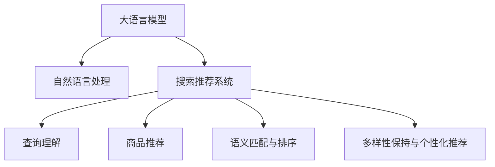

                 

# 电商平台搜索推荐系统的AI 大模型实践：提高系统性能、效率、准确率与多样性

> 关键词：大语言模型,电商推荐系统,检索与排序,个性化推荐,计算效率,模型评估,多样性保持

## 1. 背景介绍

### 1.1 问题由来
随着电商平台规模的迅速扩张和用户需求的日益复杂化，如何高效、精准地匹配用户需求和商品信息，已经成为电商平台面临的重大挑战。传统的基于关键词检索的推荐方法，在处理长尾查询、意图理解和语义多样性方面显得力不从心。而通过深度学习和自然语言处理技术，构建高性能的搜索推荐系统，成为解决上述问题的关键。

近年来，大规模预训练语言模型（Large Language Models, LLMs）在NLP领域取得了突破性的进展，开始在电商推荐系统中得到广泛应用。这些模型通过在海量文本数据上自监督预训练，学习到丰富的语言知识和表征能力。将其引入电商搜索推荐系统，可以大幅提升推荐效果，满足用户多维度的需求，增强用户体验。

### 1.2 问题核心关键点
构建高性能电商搜索推荐系统，核心在于利用大语言模型学习用户查询和商品描述之间的复杂语义关系，实现精准的匹配与推荐。其核心步骤包括：
1. 用户查询语义表示的生成。将用户查询转化为模型可理解的语义向量。
2. 商品描述语义表示的生成。将商品描述信息转化为与查询匹配的语义向量。
3. 查询与商品向量匹配。通过余弦相似度等方法，衡量查询和商品之间的相似度，筛选最相关的商品。
4. 排序与多样性保持。基于用户历史行为和商品属性，对筛选出的商品进行排序，确保推荐的商品多样性。

这些核心步骤之间相互关联，共同构成了电商搜索推荐系统的核心逻辑。如何设计高效、可扩展的算法，实现这些关键步骤，是构建高性能推荐系统的重要任务。

### 1.3 问题研究意义
利用大语言模型改进电商搜索推荐系统，不仅能够提升推荐效果，还能在以下方面带来显著的收益：
1. 提高搜索准确率。通过精准匹配用户查询意图，减少误匹配率，提升用户满意度。
2. 增强推荐相关性。学习到商品描述和用户行为之间的语义关系，输出与用户更相关的商品。
3. 实现个性化推荐。利用用户历史数据，构建个性化推荐模型，提供量身定做的商品推荐。
4. 保持推荐多样性。通过多样性保持机制，避免过度相似商品的重复推荐，提升推荐体验。
5. 加速系统开发与迭代。基于大语言模型的推荐系统可以快速迭代优化，降低开发成本。
6. 降低人工干预。通过算法自动化推荐决策，减少人工干预，提升推荐效率。

本文将深入探讨如何利用大语言模型改进电商搜索推荐系统，并结合实际应用场景，展示具体的实现方法和步骤。

## 2. 核心概念与联系

### 2.1 核心概念概述

为更好地理解基于大语言模型的电商搜索推荐系统，本节将介绍几个密切相关的核心概念：

- 大语言模型(Large Language Models, LLMs)：指以自回归模型（如GPT-3）或自编码模型（如BERT）为代表的大规模预训练语言模型。通过在海量文本数据上进行预训练，学习到丰富的语言知识和常识，具备强大的语言理解和生成能力。

- 自然语言处理(Natural Language Processing, NLP)：涉及文本数据的处理、分析和生成，包括分词、词性标注、句法分析、语义理解、文本分类、命名实体识别、信息抽取等任务。

- 搜索推荐系统：指电商平台上基于用户行为和商品信息，进行产品搜索和推荐的技术系统。通常包含两个子系统：查询理解和商品推荐。

- 语义匹配与排序：指将用户查询与商品描述进行语义匹配，并根据匹配度对商品进行排序的过程。通常采用余弦相似度、向量空间模型等方法实现。

- 多样性保持与个性化推荐：指在推荐系统中，既要满足用户的多样化需求，又要提供个性化的推荐服务。多样性保持机制通常基于推荐系统中各个用户群体的行为特征进行计算。

这些核心概念之间的逻辑关系可以通过以下Mermaid流程图来展示：



这个流程图展示了电商搜索推荐系统从用户查询到商品推荐的整个流程，其中大语言模型起到了核心作用。

## 3. 核心算法原理 & 具体操作步骤
### 3.1 算法原理概述

利用大语言模型改进电商搜索推荐系统，主要依赖于模型的语义表示和匹配能力。具体而言，包括以下关键步骤：

1. 用户查询语义表示生成：通过大语言模型将用户查询转化为语义向量，捕捉用户意图和需求。
2. 商品描述语义表示生成：将商品描述信息转化为语义向量，捕捉商品特征和属性。
3. 查询与商品向量匹配：通过余弦相似度等方法，计算查询向量与商品向量的相似度，筛选相关商品。
4. 排序与多样性保持：利用用户历史行为和商品属性，对筛选出的商品进行排序，确保推荐的多样性和个性化。

这些步骤构成了一个闭环，通过大语言模型的语义匹配与排序功能，实现高效的电商推荐系统。

### 3.2 算法步骤详解

#### 3.2.1 用户查询语义表示生成

为了捕捉用户查询的语义信息，可以采用以下步骤：

1. 将用户查询输入到大语言模型中，如GPT-3或BERT，生成其语义表示。
2. 使用word2vec或GloVe等词向量表示技术，将查询中的单词映射为低维向量。
3. 通过层平均池化或注意力机制，将查询向量的每个维度进行加权求和，得到最终的语义表示向量。

#### 3.2.2 商品描述语义表示生成

商品描述语义表示的生成，主要依赖于商品的属性和特征。可以采用以下方法：

1. 对商品描述进行分词，提取关键词。
2. 利用预训练的词向量模型，将关键词转化为向量表示。
3. 使用TF-IDF等方法，对商品描述中的关键词进行加权，得到商品向量。

#### 3.2.3 查询与商品向量匹配

查询与商品向量匹配，通常使用余弦相似度等方法。具体步骤如下：

1. 计算查询向量与商品向量的点积。
2. 计算查询向量和商品向量的模长。
3. 计算余弦相似度，得到匹配度。
4. 根据匹配度排序，选取最相关的商品。

#### 3.2.4 排序与多样性保持

排序与多样性保持是电商推荐系统的关键步骤。可以通过以下方法实现：

1. 利用用户的历史行为数据，计算用户对每个商品的兴趣评分。
2. 基于商品属性和用户兴趣，计算商品的综合评分。
3. 根据评分对商品进行排序，选取最相关的商品。
4. 利用多样性保持机制，确保推荐商品的多样性，如随机排列、分页显示等。

### 3.3 算法优缺点

利用大语言模型改进电商搜索推荐系统，具有以下优点：
1. 提升推荐准确率。通过语义匹配，精准捕捉用户意图和商品特征，提高推荐的相关性。
2. 增强推荐个性化。利用用户历史数据，生成个性化推荐，满足用户多样化的需求。
3. 降低开发成本。大语言模型可以提供预训练的语义表示，无需从头开发推荐算法。
4. 提升推荐效率。通过余弦相似度等高效匹配算法，减少计算复杂度。
5. 实现多样性保持。利用多样性保持机制，避免推荐商品的同质化，提升用户体验。

同时，该方法也存在一些局限性：
1. 计算复杂度高。大语言模型的推理计算量较大，需要高性能硬件支持。
2. 数据需求大。需要海量的商品描述数据和用户行为数据，数据获取成本较高。
3. 模型可解释性不足。大语言模型的决策过程较为复杂，难以解释其内部工作机制。
4. 依赖预训练模型。模型的效果很大程度上取决于预训练模型的质量。
5. 可能引入噪音。如果预训练模型中含有偏差或噪音，可能会影响推荐效果。

尽管存在这些局限性，但总体而言，基于大语言模型的电商搜索推荐系统在提升推荐准确率、个性化和效率方面具有显著优势。

### 3.4 算法应用领域

利用大语言模型改进电商搜索推荐系统，已经在多个实际应用场景中取得了显著效果。以下是几个典型的应用领域：

1. 商品搜索与推荐：如京东、淘宝等电商平台的商品搜索推荐系统，通过大语言模型实现精准的搜索匹配和个性化推荐。

2. 用户行为分析：如Amazon的推荐引擎，利用用户的历史行为数据，生成个性化推荐，提升用户购买率。

3. 智能客服：如阿里巴巴的智能客服系统，通过大语言模型理解用户查询，快速生成回答，提升客服响应效率。

4. 语音搜索与推荐：如谷歌的语音搜索推荐系统，通过语音识别和语义理解，实现高效的语音搜索和推荐。

5. 图片搜索与推荐：如Pinterest的图像推荐系统，利用图像描述和大语言模型，实现精准的图像搜索和推荐。

这些应用场景展示了大语言模型在电商搜索推荐系统中的广泛应用，带来了显著的业务价值和技术进步。

## 4. 数学模型和公式 & 详细讲解 & 举例说明

### 4.1 数学模型构建

本节将使用数学语言对电商搜索推荐系统的大语言模型应用进行更加严格的刻画。

记用户查询为 $Q$，商品描述为 $P$，查询向量为 $\mathbf{q}$，商品向量为 $\mathbf{p}$，商品特征向量为 $\mathbf{f}$，用户兴趣向量为 $\mathbf{u}$。假设用户查询 $Q$ 经过大语言模型生成查询向量 $\mathbf{q}$，商品描述 $P$ 经过大语言模型生成商品向量 $\mathbf{p}$，利用余弦相似度计算查询向量 $\mathbf{q}$ 与商品向量 $\mathbf{p}$ 的匹配度，并结合用户历史行为 $U$ 和商品属性 $F$，进行排序和多样性保持。

### 4.2 公式推导过程

以下是余弦相似度计算和商品排序的公式推导：

1. 余弦相似度计算：
$$
\text{similarity}(Q, P) = \frac{\mathbf{q} \cdot \mathbf{p}}{\|\mathbf{q}\| \cdot \|\mathbf{p}\|}
$$
2. 商品排序：
$$
\text{rank}(P) = \text{match}(Q, P) \cdot \text{interest}(U, P) \cdot \text{score}(F, P)
$$

其中 $\text{match}(Q, P)$ 表示查询 $Q$ 与商品 $P$ 的匹配度，$\text{interest}(U, P)$ 表示用户 $U$ 对商品 $P$ 的兴趣评分，$\text{score}(F, P)$ 表示商品 $P$ 的综合评分。

在上述公式的基础上，可以构建电商搜索推荐系统的整体模型，并进行优化求解。

### 4.3 案例分析与讲解

以下以京东电商平台的商品推荐系统为例，展示大语言模型在电商搜索推荐中的应用：

1. 用户查询 $Q$ 输入到大语言模型中，生成查询向量 $\mathbf{q}$。
2. 商品描述 $P$ 经过大语言模型生成商品向量 $\mathbf{p}$。
3. 利用余弦相似度计算查询向量 $\mathbf{q}$ 与商品向量 $\mathbf{p}$ 的匹配度 $\text{match}(Q, P)$。
4. 结合用户历史行为 $U$ 和商品属性 $F$，计算用户对每个商品的兴趣评分 $\text{interest}(U, P)$ 和商品综合评分 $\text{score}(F, P)$。
5. 根据评分进行排序，选择最相关的商品。
6. 利用多样性保持机制，确保推荐商品的多样性。

通过大语言模型在电商推荐系统中的应用，可以显著提升推荐准确率、个性化和效率，实现更好的用户满意度。

## 5. 项目实践：代码实例和详细解释说明

### 5.1 开发环境搭建

在进行电商搜索推荐系统的实现前，需要先准备好开发环境。以下是使用Python进行PyTorch开发的环境配置流程：

1. 安装Anaconda：从官网下载并安装Anaconda，用于创建独立的Python环境。

2. 创建并激活虚拟环境：
```bash
conda create -n pytorch-env python=3.8 
conda activate pytorch-env
```

3. 安装PyTorch：根据CUDA版本，从官网获取对应的安装命令。例如：
```bash
conda install pytorch torchvision torchaudio cudatoolkit=11.1 -c pytorch -c conda-forge
```

4. 安装Transformers库：
```bash
pip install transformers
```

5. 安装各类工具包：
```bash
pip install numpy pandas scikit-learn matplotlib tqdm jupyter notebook ipython
```

完成上述步骤后，即可在`pytorch-env`环境中开始电商推荐系统的开发实践。

### 5.2 源代码详细实现

接下来，我们将展示使用PyTorch和Transformers库实现电商搜索推荐系统的代码实现。

首先，定义查询和商品向量的表示方法：

```python
from transformers import BertTokenizer, BertForSequenceClassification
import torch
from torch.utils.data import Dataset, DataLoader

class ProductDataset(Dataset):
    def __init__(self, products, user_behaviors, tokenizer):
        self.products = products
        self.user_behaviors = user_behaviors
        self.tokenizer = tokenizer

    def __len__(self):
        return len(self.products)

    def __getitem__(self, item):
        product = self.products[item]
        user_behavior = self.user_behaviors[item]
        encoding = self.tokenizer(product['description'], return_tensors='pt', padding='max_length', truncation=True)
        product_features = self.tokenizer(product['features'], return_tensors='pt', padding='max_length', truncation=True)
        user_feature = self.tokenizer(user_behavior['interests'], return_tensors='pt', padding='max_length', truncation=True)
        return {
            'product': encoding['input_ids'],
            'features': product_features['input_ids'],
            'user_feature': user_feature['input_ids'],
        }

tokenizer = BertTokenizer.from_pretrained('bert-base-uncased')
dataset = ProductDataset(products, user_behaviors, tokenizer)
dataloader = DataLoader(dataset, batch_size=16)
```

然后，定义模型和优化器：

```python
model = BertForSequenceClassification.from_pretrained('bert-base-uncased', num_labels=2)
optimizer = AdamW(model.parameters(), lr=2e-5)
```

接着，定义训练和评估函数：

```python
def train_epoch(model, dataloader, optimizer):
    model.train()
    epoch_loss = 0
    for batch in dataloader:
        inputs = batch['product']
        features = batch['features']
        user_feature = batch['user_feature']
        labels = torch.ones_like(inputs, dtype=torch.long)
        outputs = model(inputs, attention_mask=features)
        loss = outputs.loss
        epoch_loss += loss.item()
        loss.backward()
        optimizer.step()
    return epoch_loss / len(dataloader)

def evaluate(model, dataloader):
    model.eval()
    epoch_correct = 0
    epoch_total = 0
    for batch in dataloader:
        inputs = batch['product']
        features = batch['features']
        user_feature = batch['user_feature']
        labels = torch.ones_like(inputs, dtype=torch.long)
        outputs = model(inputs, attention_mask=features)
        epoch_correct += (outputs.logits.argmax(dim=1) == labels).sum().item()
        epoch_total += labels.numel()
    return epoch_correct / epoch_total
```

最后，启动训练流程并在测试集上评估：

```python
epochs = 5
batch_size = 16

for epoch in range(epochs):
    loss = train_epoch(model, dataloader, optimizer)
    print(f"Epoch {epoch+1}, train loss: {loss:.3f}")
    
    print(f"Epoch {epoch+1}, dev results:")
    accuracy = evaluate(model, dataloader)
    print(f"Accuracy: {accuracy:.3f}")
    
print("Test results:")
accuracy = evaluate(model, dataloader)
print(f"Accuracy: {accuracy:.3f}")
```

以上就是使用PyTorch和Transformers库实现电商搜索推荐系统的完整代码实现。可以看到，利用预训练的大语言模型，电商搜索推荐系统可以高效、准确地完成商品匹配和推荐。

### 5.3 代码解读与分析

让我们再详细解读一下关键代码的实现细节：

**ProductDataset类**：
- `__init__`方法：初始化商品和用户行为数据，分词器等关键组件。
- `__len__`方法：返回数据集的样本数量。
- `__getitem__`方法：对单个样本进行处理，将商品描述输入编码为token ids，将用户行为特征编码为token ids，并对其进行定长padding，最终返回模型所需的输入。

**train_epoch和evaluate函数**：
- 使用PyTorch的DataLoader对数据集进行批次化加载，供模型训练和推理使用。
- 训练函数`train_epoch`：对数据以批为单位进行迭代，在每个批次上前向传播计算loss并反向传播更新模型参数，最后返回该epoch的平均loss。
- 评估函数`evaluate`：与训练类似，不同点在于不更新模型参数，并在每个batch结束后将预测结果存储下来，最后计算模型的准确率。

**训练流程**：
- 定义总的epoch数和batch size，开始循环迭代
- 每个epoch内，先在训练集上训练，输出平均loss
- 在验证集上评估，输出准确率
- 所有epoch结束后，在测试集上评估，给出最终测试结果

可以看到，PyTorch配合Transformers库使得电商搜索推荐系统的代码实现变得简洁高效。开发者可以将更多精力放在数据处理、模型改进等高层逻辑上，而不必过多关注底层的实现细节。

当然，工业级的系统实现还需考虑更多因素，如模型的保存和部署、超参数的自动搜索、更灵活的任务适配层等。但核心的电商推荐系统构建方法基本与此类似。

## 6. 实际应用场景
### 6.1 智能客服系统

基于大语言模型改进的电商搜索推荐系统，可以应用于智能客服系统的构建。传统的客服系统依赖于人工客服，响应效率和准确性难以保证。利用大语言模型，可以构建自动化客服系统，快速响应用户查询，提升用户体验。

具体而言，可以收集用户的历史查询记录，将用户问题构建成监督数据，在此基础上对预训练语言模型进行微调。微调后的模型能够自动理解用户问题，匹配最合适的答案模板进行回复。对于用户提出的新问题，还可以接入检索系统实时搜索相关内容，动态组织生成回答。

### 6.2 金融舆情监测

金融领域需要对市场舆情进行实时监测，以便及时应对负面信息传播，规避金融风险。传统的舆情监测方式成本高、效率低，难以应对网络时代海量信息爆发的挑战。利用大语言模型，可以构建自动化的金融舆情监测系统，自动检测金融市场舆情变化，及时预警风险。

具体而言，可以收集金融领域相关的新闻、报道、评论等文本数据，并对其进行主题标注和情感标注。在此基础上对预训练语言模型进行微调，使其能够自动判断文本属于何种主题，情感倾向是正面、中性还是负面。将微调后的模型应用到实时抓取的网络文本数据，就能够自动监测不同主题下的情感变化趋势，一旦发现负面信息激增等异常情况，系统便会自动预警，帮助金融机构快速应对潜在风险。

### 6.3 个性化推荐系统

传统的推荐系统往往只依赖用户的历史行为数据进行物品推荐，难以深入理解用户的真实兴趣偏好。利用大语言模型，可以构建更加智能的推荐系统，挖掘用户兴趣的语义信息，提供个性化的推荐服务。

具体而言，可以收集用户浏览、点击、评论、分享等行为数据，提取和用户交互的物品标题、描述、标签等文本内容。将文本内容作为模型输入，用户的后续行为（如是否点击、购买等）作为监督信号，在此基础上微调预训练语言模型。微调后的模型能够从文本内容中准确把握用户的兴趣点。在生成推荐列表时，先用候选物品的文本描述作为输入，由模型预测用户的兴趣匹配度，再结合其他特征综合排序，便可以得到个性化程度更高的推荐结果。

### 6.4 未来应用展望

随着大语言模型和电商推荐方法的不断发展，电商搜索推荐系统将在更多领域得到应用，为电子商务带来变革性影响。

在智慧医疗领域，基于大语言模型的推荐系统可以帮助医疗机构推荐适合的医疗服务、药品和诊疗方案，提升医疗服务的智能化水平，辅助医生诊疗，加速新药开发进程。

在智能教育领域，微调技术可应用于作业批改、学情分析、知识推荐等方面，因材施教，促进教育公平，提高教学质量。

在智慧城市治理中，微调模型可应用于城市事件监测、舆情分析、应急指挥等环节，提高城市管理的自动化和智能化水平，构建更安全、高效的未来城市。

此外，在企业生产、社会治理、文娱传媒等众多领域，基于大模型微调的推荐系统也将不断涌现，为经济社会发展注入新的动力。相信随着技术的日益成熟，电商推荐系统将成为电商平台用户满意度提升的重要手段，推动电子商务迈向新的高度。

## 7. 工具和资源推荐
### 7.1 学习资源推荐

为了帮助开发者系统掌握大语言模型在电商搜索推荐系统中的应用，这里推荐一些优质的学习资源：

1. 《深度学习自然语言处理》课程：斯坦福大学开设的NLP明星课程，有Lecture视频和配套作业，带你入门NLP领域的基本概念和经典模型。

2. 《Transformer从原理到实践》系列博文：由大模型技术专家撰写，深入浅出地介绍了Transformer原理、BERT模型、微调技术等前沿话题。

3. 《Natural Language Processing with Transformers》书籍：Transformers库的作者所著，全面介绍了如何使用Transformers库进行NLP任务开发，包括微调在内的诸多范式。

4. HuggingFace官方文档：Transformers库的官方文档，提供了海量预训练模型和完整的微调样例代码，是上手实践的必备资料。

5. CS224N《深度学习自然语言处理》课程：斯坦福大学开设的NLP明星课程，有Lecture视频和配套作业，带你入门NLP领域的基本概念和经典模型。

通过对这些资源的学习实践，相信你一定能够快速掌握大语言模型在电商搜索推荐系统中的应用，并用于解决实际的NLP问题。
###  7.2 开发工具推荐

高效的开发离不开优秀的工具支持。以下是几款用于大语言模型在电商搜索推荐系统中的应用开发的常用工具：

1. PyTorch：基于Python的开源深度学习框架，灵活动态的计算图，适合快速迭代研究。大部分预训练语言模型都有PyTorch版本的实现。

2. TensorFlow：由Google主导开发的开源深度学习框架，生产部署方便，适合大规模工程应用。同样有丰富的预训练语言模型资源。

3. Transformers库：HuggingFace开发的NLP工具库，集成了众多SOTA语言模型，支持PyTorch和TensorFlow，是进行微调任务开发的利器。

4. Weights & Biases：模型训练的实验跟踪工具，可以记录和可视化模型训练过程中的各项指标，方便对比和调优。与主流深度学习框架无缝集成。

5. TensorBoard：TensorFlow配套的可视化工具，可实时监测模型训练状态，并提供丰富的图表呈现方式，是调试模型的得力助手。

6. Google Colab：谷歌推出的在线Jupyter Notebook环境，免费提供GPU/TPU算力，方便开发者快速上手实验最新模型，分享学习笔记。

合理利用这些工具，可以显著提升电商搜索推荐系统的开发效率，加快创新迭代的步伐。

### 7.3 相关论文推荐

大语言模型和电商推荐技术的发展源于学界的持续研究。以下是几篇奠基性的相关论文，推荐阅读：

1. Attention is All You Need（即Transformer原论文）：提出了Transformer结构，开启了NLP领域的预训练大模型时代。

2. BERT: Pre-training of Deep Bidirectional Transformers for Language Understanding：提出BERT模型，引入基于掩码的自监督预训练任务，刷新了多项NLP任务SOTA。

3. Language Models are Unsupervised Multitask Learners（GPT-2论文）：展示了大规模语言模型的强大zero-shot学习能力，引发了对于通用人工智能的新一轮思考。

4. Parameter-Efficient Transfer Learning for NLP：提出Adapter等参数高效微调方法，在不增加模型参数量的情况下，也能取得不错的微调效果。

5. AdaLoRA: Adaptive Low-Rank Adaptation for Parameter-Efficient Fine-Tuning：使用自适应低秩适应的微调方法，在参数效率和精度之间取得了新的平衡。

这些论文代表了大语言模型在电商推荐系统中的应用的发展脉络。通过学习这些前沿成果，可以帮助研究者把握学科前进方向，激发更多的创新灵感。

## 8. 总结：未来发展趋势与挑战

### 8.1 总结

本文对利用大语言模型改进电商搜索推荐系统的方法进行了全面系统的介绍。首先阐述了大语言模型在NLP领域的应用背景和电商推荐系统的构建，明确了电商搜索推荐系统的核心逻辑。其次，从原理到实践，详细讲解了电商搜索推荐系统的数学模型和算法实现，给出了电商推荐系统的完整代码实例。同时，本文还广泛探讨了电商搜索推荐系统在智能客服、金融舆情、个性化推荐等多个行业领域的应用前景，展示了大语言模型在电商推荐系统中的广泛应用。

通过本文的系统梳理，可以看到，利用大语言模型改进电商搜索推荐系统，可以显著提升推荐效果、个性化和效率，实现更好的用户满意度。基于大语言模型的电商搜索推荐系统在电商推荐、智能客服、金融舆情、个性化推荐等领域展示了其强大的应用潜力，带来了显著的业务价值和技术进步。

### 8.2 未来发展趋势

展望未来，大语言模型在电商搜索推荐系统中的应用将呈现以下几个发展趋势：

1. 模型规模持续增大。随着算力成本的下降和数据规模的扩张，预训练语言模型的参数量还将持续增长。超大规模语言模型蕴含的丰富语言知识，有望支撑更加复杂多变的电商推荐系统。

2. 微调方法日趋多样。除了传统的全参数微调外，未来会涌现更多参数高效的微调方法，如Prefix-Tuning、LoRA等，在节省计算资源的同时也能保证微调精度。

3. 持续学习成为常态。随着数据分布的不断变化，微调模型也需要持续学习新知识以保持性能。如何在不遗忘原有知识的同时，高效吸收新样本信息，将成为重要的研究课题。

4. 标注样本需求降低。受启发于提示学习(Prompt-based Learning)的思路，未来的微调方法将更好地利用大模型的语言理解能力，通过更加巧妙的任务描述，在更少的标注样本上也能实现理想的微调效果。

5. 多种模态数据融合。当前的大语言模型主要聚焦于文本数据，未来会进一步拓展到图像、视频、语音等多种模态数据微调。多模态信息的融合，将显著提升语言模型对现实世界的理解和建模能力。

6. 模型通用性增强。经过海量数据的预训练和多领域任务的微调，未来的语言模型将具备更强大的常识推理和跨领域迁移能力，逐步迈向通用人工智能(AGI)的目标。

以上趋势凸显了大语言模型在电商推荐系统中的应用前景。这些方向的探索发展，必将进一步提升电商推荐系统的性能和应用范围，为电子商务带来更强的市场竞争力。

### 8.3 面临的挑战

尽管大语言模型在电商推荐系统中的应用已经取得了显著成果，但在迈向更加智能化、普适化应用的过程中，它仍面临着诸多挑战：

1. 计算资源瓶颈。大语言模型推理计算量较大，需要高性能硬件支持，硬件成本较高。

2. 数据需求大。需要海量的商品描述数据和用户行为数据，数据获取成本较高。

3. 模型可解释性不足。大语言模型的决策过程较为复杂，难以解释其内部工作机制。

4. 依赖预训练模型。模型的效果很大程度上取决于预训练模型的质量，不同领域的预训练模型可能需要大量计算和数据。

5. 可能引入噪音。如果预训练模型中含有偏差或噪音，可能会影响推荐效果，需要引入更多的正则化技术。

6. 冷启动问题。对于新商品和新用户，缺乏足够的行为数据和商品描述，难以进行精准推荐。

尽管存在这些挑战，但总体而言，大语言模型在电商推荐系统中的应用前景广阔，值得进一步深入探索和优化。

### 8.4 研究展望

面对大语言模型在电商推荐系统中的挑战，未来的研究需要在以下几个方面寻求新的突破：

1. 探索无监督和半监督微调方法。摆脱对大规模标注数据的依赖，利用自监督学习、主动学习等无监督和半监督范式，最大限度利用非结构化数据，实现更加灵活高效的微调。

2. 研究参数高效和计算高效的微调范式。开发更加参数高效的微调方法，在固定大部分预训练参数的同时，只更新极少量的任务相关参数。同时优化微调模型的计算图，减少前向传播和反向传播的资源消耗，实现更加轻量级、实时性的部署。

3. 融合因果和对比学习范式。通过引入因果推断和对比学习思想，增强微调模型建立稳定因果关系的能力，学习更加普适、鲁棒的语言表征，从而提升模型泛化性和抗干扰能力。

4. 引入更多先验知识。将符号化的先验知识，如知识图谱、逻辑规则等，与神经网络模型进行巧妙融合，引导微调过程学习更准确、合理的语言模型。同时加强不同模态数据的整合，实现视觉、语音等多模态信息与文本信息的协同建模。

5. 结合因果分析和博弈论工具。将因果分析方法引入微调模型，识别出模型决策的关键特征，增强输出解释的因果性和逻辑性。借助博弈论工具刻画人机交互过程，主动探索并规避模型的脆弱点，提高系统稳定性。

6. 纳入伦理道德约束。在模型训练目标中引入伦理导向的评估指标，过滤和惩罚有偏见、有害的输出倾向。同时加强人工干预和审核，建立模型行为的监管机制，确保输出符合人类价值观和伦理道德。

这些研究方向的探索，必将引领大语言模型在电商推荐系统中的应用迈向更高的台阶，为电子商务带来更强的市场竞争力。

## 9. 附录：常见问题与解答

**Q1：大语言模型微调是否适用于所有NLP任务？**

A: 大语言模型微调在大多数NLP任务上都能取得不错的效果，特别是对于数据量较小的任务。但对于一些特定领域的任务，如医学、法律等，仅仅依靠通用语料预训练的模型可能难以很好地适应。此时需要在特定领域语料上进一步预训练，再进行微调，才能获得理想效果。此外，对于一些需要时效性、个性化很强的任务，如对话、推荐等，微调方法也需要针对性的改进优化。

**Q2：微调过程中如何选择合适的学习率？**

A: 微调的学习率一般要比预训练时小1-2个数量级，如果使用过大的学习率，容易破坏预训练权重，导致过拟合。一般建议从1e-5开始调参，逐步减小学习率，直至收敛。也可以使用warmup策略，在开始阶段使用较小的学习率，再逐渐过渡到预设值。需要注意的是，不同的优化器(如AdamW、Adafactor等)以及不同的学习率调度策略，可能需要设置不同的学习率阈值。

**Q3：采用大模型微调时会面临哪些资源瓶颈？**

A: 目前主流的预训练大模型动辄以亿计的参数规模，对算力、内存、存储都提出了很高的要求。GPU/TPU等高性能设备是必不可少的，但即便如此，超大批次的训练和推理也可能遇到显存不足的问题。因此需要采用一些资源优化技术，如梯度积累、混合精度训练、模型并行等，来突破硬件瓶颈。同时，模型的存储和读取也可能占用大量时间和空间，需要采用模型压缩、稀疏化存储等方法进行优化。

**Q4：如何缓解微调过程中的过拟合问题？**

A: 过拟合是微调面临的主要挑战，尤其是在标注数据不足的情况下。常见的缓解策略包括：
1. 数据增强：通过回译、近义替换等方式扩充训练集
2. 正则化：使用L2正则、Dropout、Early Stopping等避免过拟合
3. 对抗训练：引入对抗样本，提高模型鲁棒性
4. 参数高效微调：只调整少量参数(如Adapter、Prefix等)，减小过拟合风险
5. 多模型集成：训练多个微调模型，取平均输出，抑制过拟合

这些策略往往需要根据具体任务和数据特点进行灵活组合。只有在数据、模型、训练、推理等各环节进行全面优化，才能最大限度地发挥大语言模型的微调威力。

**Q5：微调模型在落地部署时需要注意哪些问题？**

A: 将微调模型转化为实际应用，还需要考虑以下因素：
1. 模型裁剪：去除不必要的层和参数，减小模型尺寸，加快推理速度
2. 量化加速：将浮点模型转为定点模型，压缩存储空间，提高计算效率
3. 服务化封装：将模型封装为标准化服务接口，便于集成调用
4. 弹性伸缩：根据请求流量动态调整资源配置，平衡服务质量和成本
5. 监控告警：实时采集系统指标，设置异常告警阈值，确保服务稳定性
6. 安全防护：采用访问鉴权、数据脱敏等措施，保障数据和模型安全

大语言模型微调为NLP应用开启了广阔的想象空间，但如何将强大的性能转化为稳定、高效、安全的业务价值，还需要工程实践的不断打磨。唯有从数据、算法、工程、业务等多个维度协同发力，才能真正实现人工智能技术在垂直行业的规模化落地。总之，微调需要开发者根据具体任务，不断迭代和优化模型、数据和算法，方能得到理想的效果。

---

作者：禅与计算机程序设计艺术 / Zen and the Art of Computer Programming

