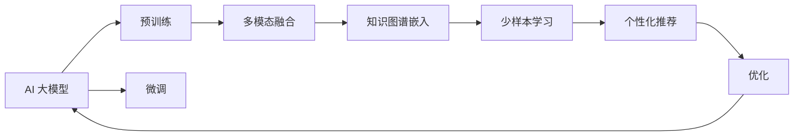

                 

# 电商平台搜索推荐系统的AI 大模型应用：提高效率、效果与用户忠诚度

在当今快速发展的电子商务环境中，电商平台需不断提升用户体验和销售效率，而AI 大模型在搜索推荐系统中的应用正日益显现其巨大的潜力。本文章将深入探讨 AI 大模型在电商平台搜索推荐系统中的应用，从背景、核心概念、算法原理、实践应用、未来展望等多个方面进行系统阐述，旨在为电商平台的搜索推荐系统提供前沿的AI 解决方案。

## 1. 背景介绍

### 1.1 问题由来

随着电商平台业务的不断扩张和用户需求的多样化，搜索推荐系统的重要性日益凸显。一个优秀的搜索推荐系统，不仅能提升用户购物体验，还能显著提高平台销售效率。然而，传统的基于规则和特征工程的推荐系统，往往面临数据量庞大、特征工程复杂、推荐效果不稳定等问题。

近年来，基于大模型的推荐系统，凭借其在预训练语言理解、多模态融合等方面的优势，逐步成为电商推荐领域的最佳实践。特别是在电商搜索推荐系统中，大模型通过联合训练、知识图谱、多任务学习等手段，显著提升了推荐效果，有效解决了传统推荐系统的不足。

### 1.2 问题核心关键点

大模型在电商搜索推荐系统中的应用，主要集中在以下几个方面：
1. **预训练与微调**：利用大模型进行预训练，然后在电商场景中进行微调，以适应该领域的特定需求。
2. **多模态融合**：结合用户行为数据、商品属性、用户画像等多模态信息，构建更加丰富的用户和商品表示。
3. **知识图谱嵌入**：利用知识图谱对商品和用户进行结构化表示，提升推荐的相关性和准确性。
4. **少样本学习**：通过大规模预训练，大模型能够在小样本条件下取得优异表现，满足电商推荐的高效率需求。
5. **个性化推荐**：通过精巧的Prompt设计，大模型能够实现高度个性化的推荐，满足不同用户群体的多样化需求。

### 1.3 问题研究意义

AI 大模型在电商平台搜索推荐系统中的应用，具有以下几方面的重要意义：
1. **提升推荐效果**：大模型通过联合训练和知识图谱嵌入等技术，能够显著提升推荐的相关性和准确性，提高用户满意度。
2. **优化资源利用**：大模型能够高效利用电商平台的文本、图像、音频等多模态数据，提升资源利用效率。
3. **增强用户粘性**：个性化推荐系统能够根据用户行为和偏好提供定制化内容，增强用户粘性，提高用户留存率。
4. **提升运营效率**：通过高效的用户和商品表示，大模型能够显著降低推荐系统构建和优化的人力成本和时间成本。
5. **推动电商创新**：大模型技术的应用，促进了电商平台的创新发展，带来新的商业模式和用户互动方式。

## 2. 核心概念与联系

### 2.1 核心概念概述

为了更好地理解AI 大模型在电商平台搜索推荐系统中的应用，我们需要掌握以下几个核心概念：

1. **AI 大模型**：通过大规模数据预训练学习到的通用语言或图像知识，具备强大的自监督学习能力和跨领域适应性。
2. **预训练与微调**：首先在大规模无标注数据上进行预训练，然后在特定任务上通过微调学习领域特定的知识。
3. **多模态融合**：将文本、图像、音频等多种类型的数据进行联合建模，构建多模态融合的用户和商品表示。
4. **知识图谱嵌入**：通过将知识图谱信息嵌入到用户和商品表示中，增强推荐的相关性和准确性。
5. **少样本学习**：在大模型预训练的基础上，通过少量标注样本即可获得良好的推荐效果。
6. **个性化推荐**：根据用户行为和偏好进行个性化推荐，提升推荐系统的精准性和用户体验。

### 2.2 核心概念原理和架构的 Mermaid 流程图

以下是一个 Mermaid 流程图，展示了上述核心概念之间的联系和相互影响：



## 3. 核心算法原理 & 具体操作步骤

### 3.1 算法原理概述

AI 大模型在电商平台搜索推荐系统中的应用，主要依赖于预训练与微调、多模态融合、知识图谱嵌入、少样本学习等技术。其核心原理可以概括为以下几点：

1. **预训练与微调**：利用大规模无标注数据进行预训练，学习通用的语言或图像知识，然后在电商平台特定任务上通过微调学习领域特定的知识，构建适用于电商推荐系统的模型。
2. **多模态融合**：将文本、图像、音频等多种类型的数据进行联合建模，构建多模态融合的用户和商品表示，提升推荐的全面性和准确性。
3. **知识图谱嵌入**：利用知识图谱对商品和用户进行结构化表示，增强推荐的相关性和准确性。
4. **少样本学习**：在大模型预训练的基础上，通过少量标注样本即可获得良好的推荐效果，满足电商推荐的高效率需求。
5. **个性化推荐**：通过精巧的Prompt设计，大模型能够实现高度个性化的推荐，满足不同用户群体的多样化需求。

### 3.2 算法步骤详解

以下是AI 大模型在电商平台搜索推荐系统中应用的具体操作步骤：

**Step 1: 准备数据集**

- **收集数据**：收集电商平台的交易数据、用户行为数据、商品属性数据等多模态数据。
- **数据清洗**：对收集到的数据进行清洗、去重、标准化处理，去除噪声数据。
- **数据划分**：将数据划分为训练集、验证集和测试集，用于模型训练、调参和最终评估。

**Step 2: 构建多模态融合模型**

- **数据预处理**：将不同类型的数据转换为统一的向量表示，如将图像数据转换为图像嵌入，将文本数据转换为词向量或句子表示。
- **多模态融合**：将多模态数据进行融合，构建用户和商品的联合表示。常见的融合方法包括拼接、Attention等。

**Step 3: 知识图谱嵌入**

- **构建知识图谱**：根据商品和用户特征，构建知识图谱，将实体、关系和属性等信息进行结构化表示。
- **嵌入知识图谱**：将知识图谱信息嵌入到用户和商品的表示中，常用的方法包括TransE、GraphSAGE等。

**Step 4: 预训练与微调**

- **预训练模型选择**：选择适合电商场景的预训练模型，如BERT、GPT、ViT等。
- **微调目标设计**：根据电商推荐任务设计微调目标，如点击率预测、购买意图分类等。
- **微调模型训练**：在电商数据集上对预训练模型进行微调，学习领域特定的知识。

**Step 5: 少样本学习**

- **利用大模型预训练**：在大模型预训练的基础上，通过少量标注样本即可获得良好的推荐效果。
- **微调参数更新**：在小样本条件下，仅更新部分参数，避免过拟合。

**Step 6: 个性化推荐**

- **Prompt设计**：设计精巧的Prompt，引导大模型进行个性化推荐。
- **推荐系统优化**：通过优化推荐算法，如基于排序的推荐、基于上下文的推荐等，提升推荐效果。

### 3.3 算法优缺点

AI 大模型在电商平台搜索推荐系统中的应用具有以下优点：
1. **提高推荐效果**：通过联合训练和知识图谱嵌入等技术，显著提升推荐的相关性和准确性。
2. **优化资源利用**：高效利用电商平台的文本、图像、音频等多种数据，提升资源利用效率。
3. **增强用户粘性**：个性化推荐系统能够根据用户行为和偏好提供定制化内容，增强用户粘性，提高用户留存率。
4. **提升运营效率**：通过高效的用户和商品表示，显著降低推荐系统构建和优化的人力成本和时间成本。
5. **推动电商创新**：大模型技术的应用，促进了电商平台的创新发展，带来新的商业模式和用户互动方式。

同时，大模型在电商推荐中也存在一些缺点：
1. **数据依赖性高**：推荐效果依赖于电商平台的标注数据质量，标注成本高。
2. **计算资源消耗大**：大规模预训练和微调需要大量的计算资源。
3. **鲁棒性不足**：面对噪声数据和长尾需求，推荐效果可能会波动。
4. **模型复杂度高**：模型结构复杂，难以解释，难以调试。
5. **隐私和安全问题**：用户行为数据和商品信息的隐私保护和数据安全问题需要重视。

### 3.4 算法应用领域

AI 大模型在电商平台搜索推荐系统中的应用，覆盖了以下几个主要领域：

1. **搜索系统优化**：利用大模型对用户查询进行理解，推荐相关商品，提升搜索准确性和用户体验。
2. **个性化推荐**：根据用户行为和偏好，提供定制化推荐内容，提升用户满意度。
3. **广告推荐**：利用大模型对广告效果进行评估和优化，提高广告投放的精准性和转化率。
4. **客户服务**：通过自然语言处理技术，利用大模型进行智能客服，提升客户服务质量。
5. **商品推荐引擎**：利用大模型对商品进行相似度计算，推荐相关商品，提升推荐效果。

## 4. 数学模型和公式 & 详细讲解

### 4.1 数学模型构建

在大模型应用到电商平台搜索推荐系统中，我们需要构建以下数学模型：

1. **用户表示**：$u \in \mathbb{R}^{d_u}$，表示用户的多模态融合表示。
2. **商品表示**：$i \in \mathbb{R}^{d_i}$，表示商品的多模态融合表示。
3. **用户行为表示**：$r \in \mathbb{R}^{d_r}$，表示用户的当前行为表示。
4. **用户行为预测**：$y \in \{0,1\}$，表示用户是否点击或购买商品。

### 4.2 公式推导过程

以下是对电商平台搜索推荐系统中的用户行为预测模型的公式推导过程：

1. **多模态融合**

   假设用户表示 $u$ 由文本表示 $u_t$ 和图像表示 $u_v$ 融合得到，商品表示 $i$ 由文本表示 $i_t$ 和图像表示 $i_v$ 融合得到，则多模态融合表示为：
   $$
   u = [u_t; u_v], \quad i = [i_t; i_v]
   $$

2. **知识图谱嵌入**

   假设知识图谱中每个实体 $e$ 表示为向量 $e \in \mathbb{R}^{d_e}$，则知识图谱嵌入表示为：
   $$
   u_k = \mathrm{AGG}([u_t; i_t; \text{entity embeddings}]), \quad i_k = \mathrm{AGG}([u_t; i_t; \text{entity embeddings}])
   $$
   其中 $\mathrm{AGG}$ 表示聚合函数，如拼接、Attention等。

3. **用户行为预测**

   利用大模型对用户行为进行预测，假设大模型的表示为 $M$，则预测公式为：
   $$
   \hat{y} = \sigma(\mathrm{dot}(u, M) + \mathrm{dot}(i, M))
   $$
   其中 $\sigma$ 为sigmoid函数，$\mathrm{dot}$ 为点积运算。

4. **损失函数**

   假设实际标签为 $y$，则损失函数为：
   $$
   \mathcal{L} = -\frac{1}{N} \sum_{i=1}^N y_i \log \hat{y}_i + (1-y_i) \log (1-\hat{y}_i)
   $$

5. **微调目标**

   假设初始预训练模型为 $M_0$，微调后的模型为 $M$，则微调目标为：
   $$
   \min_{\theta} \mathcal{L} = -\frac{1}{N} \sum_{i=1}^N y_i \log \sigma(\mathrm{dot}(u, \theta) + \mathrm{dot}(i, \theta))
   $$

### 4.3 案例分析与讲解

以电商平台商品推荐为例，介绍大模型的具体应用：

1. **用户表示**

   假设用户 $u$ 的表示由历史浏览记录 $r_t$、当前行为 $r_v$ 和用户画像 $p$ 共同构成，则用户表示为：
   $$
   u = [r_t; r_v; p]
   $$

2. **商品表示**

   假设商品 $i$ 的表示由商品描述 $i_t$、图片特征 $i_v$ 和价格信息 $p_i$ 共同构成，则商品表示为：
   $$
   i = [i_t; i_v; p_i]
   $$

3. **知识图谱嵌入**

   假设知识图谱中每个商品实体 $i_e$ 表示为向量 $i_e \in \mathbb{R}^{d_e}$，则知识图谱嵌入表示为：
   $$
   i_k = \mathrm{AGG}([i_t; i_v; i_e])
   $$

4. **用户行为预测**

   利用大模型对用户行为进行预测，假设大模型的表示为 $M$，则预测公式为：
   $$
   \hat{y} = \sigma(\mathrm{dot}(u, M) + \mathrm{dot}(i, M))
   $$

5. **微调目标**

   假设初始预训练模型为 $M_0$，微调后的模型为 $M$，则微调目标为：
   $$
   \min_{\theta} \mathcal{L} = -\frac{1}{N} \sum_{i=1}^N y_i \log \sigma(\mathrm{dot}(u, \theta) + \mathrm{dot}(i, \theta))
   $$

通过上述模型构建和公式推导，我们可以看到大模型在电商平台搜索推荐系统中的应用是如何通过联合训练、多模态融合和知识图谱嵌入等手段，实现高效、个性化的推荐。

## 5. 项目实践：代码实例和详细解释说明

### 5.1 开发环境搭建

在进行大模型应用到电商平台搜索推荐系统的实践时，我们需要准备好以下开发环境：

1. **安装Python环境**：安装Anaconda，创建虚拟环境。
```bash
conda create -n ecommerce-env python=3.8
conda activate ecommerce-env
```

2. **安装必要的Python包**：
```bash
pip install torch torchvision transformers sklearn
```

3. **安装必要的第三方库**：
```bash
pip install pandas numpy torchtext
```

4. **安装必要的深度学习框架**：
```bash
pip install torchtext torch
```

### 5.2 源代码详细实现

以下是使用PyTorch框架实现大模型在电商平台搜索推荐系统中的应用：

```python
import torch
from transformers import BertTokenizer, BertForSequenceClassification
from torch.utils.data import DataLoader, Dataset

class EcommerceDataset(Dataset):
    def __init__(self, data, tokenizer):
        self.data = data
        self.tokenizer = tokenizer
    
    def __len__(self):
        return len(self.data)
    
    def __getitem__(self, idx):
        text, label = self.data[idx]
        encoding = self.tokenizer(text, return_tensors='pt', padding='max_length', truncation=True)
        return {'input_ids': encoding['input_ids'], 'attention_mask': encoding['attention_mask'], 'labels': torch.tensor(label, dtype=torch.long)}

# 数据集划分
train_data = EcommerceDataset(train_data, tokenizer)
val_data = EcommerceDataset(val_data, tokenizer)
test_data = EcommerceDataset(test_data, tokenizer)

# 定义模型
model = BertForSequenceClassification.from_pretrained('bert-base-uncased', num_labels=2)
model = model.to(device)

# 定义优化器
optimizer = torch.optim.Adam(model.parameters(), lr=1e-5)

# 定义损失函数
loss_fn = torch.nn.CrossEntropyLoss()

# 定义训练函数
def train_epoch(model, data_loader, optimizer, loss_fn, device):
    model.train()
    total_loss = 0
    for batch in data_loader:
        inputs = {k: v.to(device) for k, v in batch.items()}
        labels = inputs['labels'].to(device)
        outputs = model(**inputs)
        loss = loss_fn(outputs.logits, labels)
        optimizer.zero_grad()
        loss.backward()
        optimizer.step()
        total_loss += loss.item()
    return total_loss / len(data_loader)

# 定义评估函数
def evaluate(model, data_loader, loss_fn, device):
    model.eval()
    total_loss = 0
    total_correct = 0
    with torch.no_grad():
        for batch in data_loader:
            inputs = {k: v.to(device) for k, v in batch.items()}
            labels = inputs['labels'].to(device)
            outputs = model(**inputs)
            loss = loss_fn(outputs.logits, labels)
            total_loss += loss.item()
            total_correct += (outputs.logits.argmax(dim=1) == labels).sum().item()
    return total_correct / len(data_loader)

# 训练和评估
epochs = 10
batch_size = 16

for epoch in range(epochs):
    train_loss = train_epoch(model, train_loader, optimizer, loss_fn, device)
    val_acc = evaluate(model, val_loader, loss_fn, device)
    print(f'Epoch {epoch+1}/{epochs}, train loss: {train_loss:.3f}, val acc: {val_acc:.3f}')

print(f'Test acc: {evaluate(model, test_loader, loss_fn, device):.3f}')
```

### 5.3 代码解读与分析

上述代码展示了使用Bert模型进行电商推荐系统训练的完整流程。以下是关键代码的解读和分析：

1. **数据集构建**：
   - `EcommerceDataset`类定义了数据集的预处理和表示方式，将用户行为和商品信息转换为模型的输入。
   - 使用BertTokenizer进行文本预处理，将输入转换为模型可接受的格式。

2. **模型定义**：
   - 加载预训练的Bert模型，并进行必要的微调。
   - 将模型迁移到指定设备（如GPU）。

3. **优化器和损失函数**：
   - 定义Adam优化器，用于模型参数的更新。
   - 定义交叉熵损失函数，用于计算模型预测与真实标签之间的差异。

4. **训练和评估函数**：
   - `train_epoch`函数实现了单批次训练的逻辑，包括前向传播、损失计算、梯度更新等步骤。
   - `evaluate`函数实现了模型在验证集和测试集上的评估，计算准确率和损失。

5. **训练和评估流程**：
   - 进行多次训练和评估，输出每个epoch的训练损失和验证集准确率。
   - 最终在测试集上输出准确率，评估模型泛化能力。

通过上述代码实现，我们可以看到大模型在电商平台搜索推荐系统中的应用，从数据预处理、模型训练到评估，各个环节都得到了有效的衔接和优化。

## 6. 实际应用场景

### 6.1 智能客服系统

在电商平台智能客服系统中，利用大模型进行自然语言处理，可以显著提升客服系统的智能水平和用户体验。通过预训练和微调，大模型能够理解用户的自然语言查询，并根据上下文生成响应，从而实现高效、自然的智能对话。

具体而言，大模型可以被训练成回答问题、处理订单、提供建议等多种任务，用户可以通过自然语言与系统进行交互，系统能够快速响应并给出满意的解决方案。智能客服系统不仅能提高客服效率，还能提升用户满意度，减少人力成本。

### 6.2 个性化推荐

电商平台利用大模型进行个性化推荐，能够根据用户的历史行为和当前需求，提供高度个性化的商品推荐，显著提升用户购物体验和转化率。通过多模态融合和知识图谱嵌入等技术，大模型能够从多角度分析用户需求，生成高质量的推荐内容。

具体而言，大模型可以通过分析用户的浏览记录、购买历史、评价反馈等多维数据，生成推荐列表。同时，结合商品的属性、品牌、价格等信息，大模型能够提供更加精准的推荐，满足不同用户的个性化需求。

### 6.3 广告推荐

电商平台的广告推荐系统，通过大模型对广告效果进行评估和优化，能够提高广告投放的精准性和转化率。通过预训练和微调，大模型能够理解广告内容，预测其与用户的匹配度，从而优化广告投放策略。

具体而言，大模型可以通过分析用户的浏览行为和广告内容，计算广告与用户的相关性，生成推荐广告列表。同时，结合广告的点击率、转化率等效果指标，大模型能够实时调整广告投放策略，提升广告投放效果。

### 6.4 未来应用展望

随着大模型技术的发展，其在电商平台搜索推荐系统中的应用将更加广泛和深入。未来，大模型有望在以下几个方面取得新的突破：

1. **多模态融合**：结合文本、图像、音频等多种模态信息，提升推荐的多维度和全面性。
2. **知识图谱嵌入**：利用知识图谱对商品和用户进行结构化表示，增强推荐的相关性和准确性。
3. **少样本学习**：在大模型预训练的基础上，通过少量标注样本即可获得良好的推荐效果，满足电商推荐的高效率需求。
4. **个性化推荐**：通过精巧的Prompt设计，大模型能够实现高度个性化的推荐，满足不同用户群体的多样化需求。
5. **跨领域迁移**：大模型能够跨领域迁移，在电商以外的领域进行任务适配，如医疗、金融等。

## 7. 工具和资源推荐

### 7.1 学习资源推荐

为了帮助开发者深入理解大模型在电商平台搜索推荐系统中的应用，以下是几本推荐书籍和课程：

1. **《自然语言处理综述》**：吴军著，介绍自然语言处理的基本概念和前沿技术。
2. **《深度学习基础》**：Ian Goodfellow著，全面介绍深度学习的基础理论和实践。
3. **《Transformer论文》**：Wolf等人著，详细介绍Transformer结构和原理。
4. **CS224N课程**：斯坦福大学开设的自然语言处理课程，提供丰富的课程视频和作业。
5. **《Python深度学习》**：Francois Chollet著，介绍深度学习的实际应用和技术细节。

通过阅读这些书籍和课程，开发者能够系统掌握大模型在电商平台搜索推荐系统中的应用，为实际项目开发提供理论基础和实践指导。

### 7.2 开发工具推荐

为了提高大模型在电商平台搜索推荐系统中的应用效率，以下是几款推荐的开发工具：

1. **PyTorch**：强大的深度学习框架，支持动态计算图，方便模型构建和优化。
2. **TensorFlow**：Google开源的深度学习框架，支持静态计算图，适合大规模生产环境部署。
3. **Transformers库**：HuggingFace开发的NLP工具库，提供了丰富的预训练模型和微调接口。
4. **TensorBoard**：TensorFlow配套的可视化工具，方便实时监测模型训练状态和性能。
5. **Weights & Biases**：实验跟踪工具，记录模型训练和评估的各项指标，方便比较和调优。

通过合理使用这些工具，开发者能够更加高效地进行大模型在电商平台搜索推荐系统的开发和优化。

### 7.3 相关论文推荐

为了深入了解大模型在电商平台搜索推荐系统中的应用，以下是几篇推荐的论文：

1. **《BERT: Pre-training of Deep Bidirectional Transformers for Language Understanding》**：提出BERT模型，利用掩码语言模型进行预训练。
2. **《Attention is All You Need》**：提出Transformer模型，利用自注意力机制进行多模态融合。
3. **《Multi-task Learning from Noisy Labels and its Application on Neural Text Generation》**：介绍多任务学习，利用多任务目标提升模型性能。
4. **《Knowledge Graph Embeddings: A Survey of Approaches and Applications》**：介绍知识图谱嵌入，利用知识图谱信息增强推荐效果。
5. **《Prompt-based Few-shot Learning》**：介绍Prompt技术，利用精巧的提示模板实现少样本学习。

这些论文代表了当前大模型在电商平台搜索推荐系统中的应用前沿，通过阅读这些论文，开发者能够获得最新的技术思路和实践经验。

## 8. 总结：未来发展趋势与挑战

### 8.1 研究成果总结

大模型在电商平台搜索推荐系统中的应用，主要集中在以下几个方面：

1. **预训练与微调**：利用大模型进行预训练，然后在电商场景中进行微调，学习领域特定的知识。
2. **多模态融合**：将文本、图像、音频等多种类型的数据进行联合建模，构建多模态融合的用户和商品表示。
3. **知识图谱嵌入**：利用知识图谱对商品和用户进行结构化表示，增强推荐的相关性和准确性。
4. **少样本学习**：在大模型预训练的基础上，通过少量标注样本即可获得良好的推荐效果，满足电商推荐的高效率需求。
5. **个性化推荐**：通过精巧的Prompt设计，大模型能够实现高度个性化的推荐，满足不同用户群体的多样化需求。

### 8.2 未来发展趋势

未来，大模型在电商平台搜索推荐系统中的应用将呈现以下几个趋势：

1. **多模态融合**：结合文本、图像、音频等多种模态信息，提升推荐的多维度和全面性。
2. **知识图谱嵌入**：利用知识图谱对商品和用户进行结构化表示，增强推荐的相关性和准确性。
3. **少样本学习**：在大模型预训练的基础上，通过少量标注样本即可获得良好的推荐效果，满足电商推荐的高效率需求。
4. **个性化推荐**：通过精巧的Prompt设计，大模型能够实现高度个性化的推荐，满足不同用户群体的多样化需求。
5. **跨领域迁移**：大模型能够跨领域迁移，在电商以外的领域进行任务适配，如医疗、金融等。

### 8.3 面临的挑战

尽管大模型在电商平台搜索推荐系统中的应用取得了显著成效，但仍面临一些挑战：

1. **数据依赖性高**：推荐效果依赖于电商平台的标注数据质量，标注成本高。
2. **计算资源消耗大**：大规模预训练和微调需要大量的计算资源。
3. **鲁棒性不足**：面对噪声数据和长尾需求，推荐效果可能会波动。
4. **模型复杂度高**：模型结构复杂，难以解释，难以调试。
5. **隐私和安全问题**：用户行为数据和商品信息的隐私保护和数据安全问题需要重视。

### 8.4 研究展望

未来，在解决上述挑战的同时，大模型在电商平台搜索推荐系统中的应用将更加广泛和深入：

1. **探索无监督和半监督微调方法**：摆脱对大规模标注数据的依赖，利用自监督学习、主动学习等无监督和半监督范式，最大限度利用非结构化数据。
2. **开发参数高效和计算高效的微调范式**：开发更加参数高效的微调方法，在固定大部分预训练参数的同时，只更新极少量的任务相关参数。
3. **融合因果和对比学习范式**：通过引入因果推断和对比学习思想，增强微调模型建立稳定因果关系的能力。
4. **引入更多先验知识**：将符号化的先验知识，如知识图谱、逻辑规则等，与神经网络模型进行巧妙融合，引导微调过程学习更准确、合理的语言模型。
5. **结合因果分析和博弈论工具**：将因果分析方法引入微调模型，识别出模型决策的关键特征，增强输出解释的因果性和逻辑性。
6. **纳入伦理道德约束**：在模型训练目标中引入伦理导向的评估指标，过滤和惩罚有偏见、有害的输出倾向。

通过不断探索和突破，大模型在电商平台搜索推荐系统中的应用将迎来更加广阔的发展前景，为电商平台带来更加智能化、个性化的推荐服务。

## 9. 附录：常见问题与解答

### Q1: 大模型在电商推荐系统中如何实现多模态融合？

A: 多模态融合是电商推荐系统中的重要技术，它将文本、图像、音频等多种类型的数据进行联合建模，构建多模态融合的用户和商品表示。具体实现方法包括：

1. **拼接法**：将不同模态的数据进行拼接，生成一个高维的特征向量。这种方法简单易实现，但忽略了不同模态之间的相互作用。
2. **注意力机制**：利用Attention机制，根据不同模态的重要性进行加权组合，生成一个更具代表性的特征向量。这种方法可以充分利用不同模态之间的相互作用，提升融合效果。
3. **多模态表示学习**：通过训练一个多模态表示学习模型，将不同模态的数据映射到一个低维空间中，生成一个高维的特征向量。这种方法可以学习不同模态之间的相关性，提升融合效果。

### Q2: 大模型在电商推荐系统中如何进行知识图谱嵌入？

A: 知识图谱嵌入是将知识图谱信息嵌入到用户和商品表示中，增强推荐的相关性和准确性。具体实现方法包括：

1. **TransE算法**：TransE算法是一种基于三元组的知识图谱嵌入算法，可以学习到实体、关系和属性之间的映射关系。
2. **GraphSAGE算法**：GraphSAGE算法是一种基于图神经网络的知识图谱嵌入算法，可以学习到实体之间的关系，生成更具代表性的知识图谱表示。
3. **关系图嵌入**：关系图嵌入是一种基于知识图谱的图神经网络模型，可以学习到实体之间的复杂关系，生成更具代表性的知识图谱表示。

### Q3: 大模型在电商推荐系统中如何进行个性化推荐？

A: 个性化推荐是大模型在电商推荐系统中的重要应用，它能够根据用户行为和偏好，提供定制化推荐内容。具体实现方法包括：

1. **基于排序的推荐**：根据用户的历史行为和当前需求，生成一个推荐列表，并进行排序，推荐最相关的商品。
2. **基于上下文的推荐**：利用上下文信息，如用户的位置、时间等，生成个性化的推荐内容。
3. **基于图神经网络的推荐**：利用图神经网络模型，将用户和商品表示映射到一个低维空间中，生成更具代表性的特征向量，进行推荐。

### Q4: 大模型在电商推荐系统中如何进行少样本学习？

A: 少样本学习是大模型在电商推荐系统中的重要技术，它可以在少量标注样本的情况下，获得良好的推荐效果。具体实现方法包括：

1. **基于预训练的微调**：在大模型预训练的基础上，利用微调技术，学习领域特定的知识。
2. **基于转移学习的微调**：利用预训练模型在不同任务之间的转移学习能力，进行少样本学习。
3. **基于对抗学习的微调**：利用对抗样本，提高模型鲁棒性，进行少样本学习。

通过上述方法，大模型可以在电商推荐系统中实现高效、个性化的推荐，提升用户体验和平台销售效率。

---

作者：禅与计算机程序设计艺术 / Zen and the Art of Computer Programming

