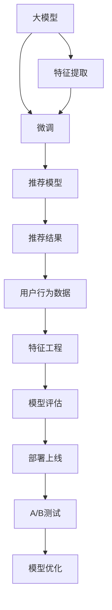

                 

# 电商平台搜索推荐系统的AI 大模型应用：提高系统性能、效率、准确率与多样性

## 1. 背景介绍

### 1.1 问题由来

随着互联网电商的快速发展和普及，电商平台的用户规模和交易量持续增长，用户对购物体验的需求也越来越高。传统的电商推荐系统往往基于朴素贝叶斯、矩阵分解等模型，依赖用户的点击行为数据，难以充分挖掘用户的多维度兴趣和个性化需求，导致推荐的准确性和多样性不足。而基于大模型的推荐系统通过学习大规模无标签数据，具备强大的数据理解和知识迁移能力，能够实现更加精细化的推荐，大幅提升用户体验。

近年来，基于大模型的电商推荐系统已经成为研究热点。其中最具代表性的就是OpenAI的GPT系列模型、Google的BERT等，通过在大规模文本数据上预训练，然后利用微调技术，将模型应用于电商推荐等实际场景中，取得了显著的效果。但这些技术在电商推荐中的具体实现和应用，对于工程实践者来说仍有较多需要深入了解和掌握的地方。

### 1.2 问题核心关键点

目前，基于大模型的电商推荐系统主要涉及以下几个关键点：

- **预训练模型**：如BERT、GPT等大模型，通过在大规模语料上预训练，学习通用的语言表示。
- **微调技术**：将预训练模型应用于电商推荐等特定任务，通过有监督的微调过程，优化模型参数，使其适应特定领域的需求。
- **数据准备**：收集和处理电商平台的用户行为数据，提取合适的特征，生成监督样本。
- **模型评估**：通过点击率、转化率等指标，评估推荐模型的效果，进行参数调整。
- **部署上线**：将微调后的模型部署到电商平台中，实时提供推荐服务。

本文将重点介绍如何使用大模型进行电商推荐系统的构建和优化，包括模型预训练、微调、特征提取、推荐模型评估和部署等关键环节。

## 2. 核心概念与联系

### 2.1 核心概念概述

为更好地理解基于大模型的电商推荐系统，本节将介绍几个密切相关的核心概念：

- **大模型**：以BERT、GPT等预训练模型为代表，通过在大规模无标签数据上学习通用语言表示，具备强大的数据理解和迁移能力。
- **微调**：将大模型应用于特定领域或任务，通过有监督的微调过程，优化模型参数，使其适应具体应用场景。
- **特征提取**：从电商平台用户行为数据中提取和构建有意义的特征，供模型进行学习和推理。
- **推荐模型评估**：通过点击率、转化率、平均排序位置等指标，评估推荐模型的效果。
- **部署上线**：将微调后的模型部署到生产环境，实时提供推荐服务，并通过A/B测试等手段不断优化模型性能。

这些核心概念之间的逻辑关系可以通过以下Mermaid流程图来展示：



这个流程图展示了大模型在电商推荐系统中的核心概念及其之间的关系：

1. 大模型通过预训练获得基础能力。
2. 特征提取对用户行为数据进行处理，构建模型输入。
3. 微调在大模型基础上进行有监督学习，优化适应电商推荐任务。
4. 推荐模型根据用户行为数据和特征，生成推荐结果。
5. 模型评估对推荐结果进行评估，决定是否继续微调。
6. 部署上线将微调后的模型提供服务，并进行A/B测试。
7. 模型优化根据测试结果，不断调整模型参数，提高推荐效果。

这些概念共同构成了基于大模型的电商推荐系统框架，使其能够实现高效、精准的推荐。

## 3. 核心算法原理 & 具体操作步骤

### 3.1 算法原理概述

基于大模型的电商推荐系统，本质上是利用大模型的预训练知识和微调能力，通过用户行为数据的学习和推理，生成个性化的推荐结果。其核心思想是：

1. **预训练模型**：通过在大规模无标签数据上预训练，学习通用的语言表示和知识图谱，构建大模型的基础能力。
2. **特征提取**：从用户行为数据中提取有意义的特征，供模型进行学习。
3. **微调过程**：在大模型基础上，通过有监督的微调过程，优化模型参数，使其适应电商推荐任务。
4. **推荐模型**：根据用户行为数据和特征，使用微调后的模型生成推荐结果。
5. **模型评估**：通过点击率、转化率等指标，评估推荐模型的效果。
6. **部署上线**：将微调后的模型部署到生产环境，实时提供推荐服务，并通过A/B测试不断优化模型。

基于大模型的电商推荐系统，通过这些步骤，能够实现高效、精准的推荐，提升用户体验，增加电商平台交易量。

### 3.2 算法步骤详解

基于大模型的电商推荐系统一般包括以下几个关键步骤：

**Step 1: 数据准备**

- 收集电商平台的交易记录、浏览记录、评价记录等用户行为数据。
- 提取合适的特征，如用户ID、商品ID、浏览时长、评价情感等。
- 将用户ID和商品ID映射到词向量表示。

**Step 2: 预训练模型选择**

- 选择合适的预训练语言模型，如BERT、GPT等。
- 将用户ID和商品ID映射到预训练模型的词向量表示。

**Step 3: 微调模型构建**

- 在大模型基础上，构建适应电商推荐任务的微调模型。
- 添加任务适配层，如全连接层、注意力机制等。
- 设置微调超参数，如学习率、批大小、迭代轮数等。

**Step 4: 特征工程**

- 从用户行为数据中提取特征，如用户ID、商品ID、浏览时长、评价情感等。
- 将特征进行标准化和归一化处理。
- 构建训练集、验证集和测试集。

**Step 5: 微调训练**

- 将特征和词向量表示输入微调模型。
- 在训练集上，进行有监督的微调训练，优化模型参数。
- 在验证集上，评估模型性能，调整超参数。

**Step 6: 模型评估**

- 在测试集上，评估微调后的推荐模型效果。
- 使用点击率、转化率、平均排序位置等指标，评估模型性能。
- 进行A/B测试，比较不同模型的效果。

**Step 7: 部署上线**

- 将微调后的模型部署到生产环境。
- 实时提供推荐服务，处理用户查询请求。
- 根据A/B测试结果，不断优化模型参数。

### 3.3 算法优缺点

基于大模型的电商推荐系统具有以下优点：

1. **数据利用率高**：大模型可以充分利用用户行为数据，学习用户的多维度兴趣和需求。
2. **推荐效果好**：大模型通过预训练和微调，具备强大的数据理解和知识迁移能力，能够生成更加精准的推荐结果。
3. **模型可解释性高**：大模型通过微调过程，部分参数被固定，部分参数被微调，更容易进行特征分析。
4. **适应性强**：大模型能够适应不同电商平台的业务特点，实现快速部署和迭代优化。

同时，该方法也存在一些局限性：

1. **数据成本高**：电商平台的标注数据往往难以获得，需要耗费大量时间和人力。
2. **模型复杂度高**：大模型参数量较大，训练和推理所需资源较多。
3. **过拟合风险**：大模型容易过拟合，需要控制模型复杂度和训练数据量。
4. **实时性要求高**：电商推荐系统要求实时响应，大模型的推理速度需要优化。
5. **安全性和隐私问题**：电商推荐系统涉及用户隐私数据，需要严格控制数据访问和使用。

尽管存在这些局限性，但就目前而言，基于大模型的电商推荐系统仍是目前电商推荐领域的主流技术范式。未来相关研究的重点在于如何进一步降低数据成本，提高模型推理效率，同时兼顾模型复杂度和实时性等因素。

### 3.4 算法应用领域

基于大模型的电商推荐系统已经在多个电商平台上得到了广泛应用，如亚马逊、淘宝、京东等，取得了显著的效果。以下是几个典型的应用场景：

- **个性化推荐**：根据用户历史行为数据，生成个性化的商品推荐，提升用户体验。
- **搜索优化**：通过用户查询，生成搜索建议，优化搜索体验。
- **内容推荐**：推荐相关的商品、文章、视频等，丰富用户浏览体验。
- **广告投放**：推荐适合用户的广告，提高广告效果和用户体验。
- **价格调整**：基于用户行为数据，调整商品价格，提升销售转化率。

除了上述这些经典场景外，大模型还被创新性地应用到更多场景中，如智能客服、智能仓储、智能营销等，为电商平台的数字化转型提供了新的动力。

## 4. 数学模型和公式 & 详细讲解  
### 4.1 数学模型构建

本节将使用数学语言对基于大模型的电商推荐系统进行更加严格的刻画。

记电商推荐任务为 $T=\{(x_i,y_i)\}_{i=1}^N, x_i \in \mathbb{R}^d, y_i \in \{1,0\}$，其中 $x_i$ 为电商平台的商品ID和用户行为数据的词向量表示，$y_i$ 表示用户是否点击商品。

假设微调后的电商推荐模型为 $M_{\theta}(x_i) \in [0,1]$，表示用户点击商品的概率。则推荐任务的目标函数为：

$$
\mathcal{L}(\theta) = -\frac{1}{N} \sum_{i=1}^N [y_i\log M_{\theta}(x_i)+(1-y_i)\log(1-M_{\theta}(x_i))]
$$

其中 $\log$ 为自然对数。

微调的优化目标是最小化经验风险：

$$
\theta^* = \mathop{\arg\min}_{\theta} \mathcal{L}(\theta)
$$

在实践中，我们通常使用基于梯度的优化算法（如AdamW、SGD等）来近似求解上述最优化问题。设 $\eta$ 为学习率，$\lambda$ 为正则化系数，则参数的更新公式为：

$$
\theta \leftarrow \theta - \eta \nabla_{\theta}\mathcal{L}(\theta) - \eta\lambda\theta
$$

其中 $\nabla_{\theta}\mathcal{L}(\theta)$ 为损失函数对参数 $\theta$ 的梯度，可通过反向传播算法高效计算。

### 4.2 公式推导过程

以下我们以点击率预测任务为例，推导点击率预测模型的损失函数及其梯度的计算公式。

假设模型 $M_{\theta}$ 在输入 $x_i$ 上的输出为 $\hat{p}=M_{\theta}(x_i)$，表示用户点击商品的概率。真实标签 $y_i \in \{0,1\}$。则二分类交叉熵损失函数定义为：

$$
\ell(M_{\theta}(x_i),y_i) = -[y_i\log \hat{p} + (1-y_i)\log(1-\hat{p})]
$$

将其代入经验风险公式，得：

$$
\mathcal{L}(\theta) = -\frac{1}{N}\sum_{i=1}^N [y_i\log \hat{p_i} + (1-y_i)\log(1-\hat{p_i})]
$$

根据链式法则，损失函数对参数 $\theta_k$ 的梯度为：

$$
\frac{\partial \mathcal{L}(\theta)}{\partial \theta_k} = -\frac{1}{N}\sum_{i=1}^N \left(\frac{y_i}{\hat{p}_i} - \frac{1-y_i}{1-\hat{p}_i}\right) \frac{\partial \hat{p}_i}{\partial \theta_k}
$$

其中 $\frac{\partial \hat{p}_i}{\partial \theta_k}$ 可进一步递归展开，利用自动微分技术完成计算。

在得到损失函数的梯度后，即可带入参数更新公式，完成模型的迭代优化。重复上述过程直至收敛，最终得到适应电商推荐任务的最优模型参数 $\theta^*$。

## 5. 项目实践：代码实例和详细解释说明
### 5.1 开发环境搭建

在进行电商推荐系统构建前，我们需要准备好开发环境。以下是使用Python进行TensorFlow开发的环境配置流程：

1. 安装Anaconda：从官网下载并安装Anaconda，用于创建独立的Python环境。

2. 创建并激活虚拟环境：
```bash
conda create -n tf-env python=3.8 
conda activate tf-env
```

3. 安装TensorFlow：根据CUDA版本，从官网获取对应的安装命令。例如：
```bash
conda install tensorflow -c tensorflow
```

4. 安装TensorBoard：用于可视化模型训练状态和结果。
```bash
pip install tensorboard
```

5. 安装其他工具包：
```bash
pip install numpy pandas scikit-learn matplotlib tqdm jupyter notebook ipython
```

完成上述步骤后，即可在`tf-env`环境中开始电商推荐系统的构建。

### 5.2 源代码详细实现

下面我们以电商推荐系统中的点击率预测任务为例，给出使用TensorFlow进行模型训练的PyTorch代码实现。

首先，定义点击率预测任务的数学模型：

```python
import tensorflow as tf

# 定义输入和输出
input_size = 10  # 商品ID和用户行为数据的维度
output_size = 1  # 点击率预测任务的输出维度

# 定义模型结构
model = tf.keras.Sequential([
    tf.keras.layers.Dense(32, activation='relu', input_shape=(input_size,)),
    tf.keras.layers.Dense(output_size, activation='sigmoid')
])

# 编译模型
model.compile(optimizer='adam', loss='binary_crossentropy', metrics=['accuracy'])
```

然后，加载和预处理数据集：

```python
# 加载训练集、验证集和测试集
train_dataset = tf.keras.preprocessing.text_dataset.TextDataset(train_texts, train_labels, tokenizer)
valid_dataset = tf.keras.preprocessing.text_dataset.TextDataset(valid_texts, valid_labels, tokenizer)
test_dataset = tf.keras.preprocessing.text_dataset.TextDataset(test_texts, test_labels, tokenizer)

# 将文本数据转换为词向量表示
train_dataset = train_dataset.map(lambda x, y: (x['input_ids'], x['attention_mask'], y))
valid_dataset = valid_dataset.map(lambda x, y: (x['input_ids'], x['attention_mask'], y))
test_dataset = test_dataset.map(lambda x, y: (x['input_ids'], x['attention_mask'], y))

# 进行词向量表示的填充
train_dataset = train_dataset.padded_batch(16)
valid_dataset = valid_dataset.padded_batch(16)
test_dataset = test_dataset.padded_batch(16)
```

接着，进行模型训练：

```python
# 定义训练轮数和批次大小
epochs = 5
batch_size = 16

# 训练模型
model.fit(train_dataset, epochs=epochs, batch_size=batch_size, validation_data=valid_dataset)
```

最后，评估模型性能：

```python
# 在测试集上评估模型性能
test_loss, test_acc = model.evaluate(test_dataset)
print('Test accuracy:', test_acc)
```

以上就是使用TensorFlow进行电商推荐系统构建的完整代码实现。可以看到，得益于TensorFlow的强大封装，我们可以用相对简洁的代码完成电商推荐模型的构建和训练。

### 5.3 代码解读与分析

让我们再详细解读一下关键代码的实现细节：

**定义模型结构**：
- `tf.keras.Sequential`：使用序列模型，将多个层堆叠在一起。
- `Dense`层：全连接层，用于将输入转换为输出。
- `relu`激活函数：非线性激活函数，增加模型的表达能力。
- `sigmoid`激活函数：输出层激活函数，用于预测点击率的概率。

**加载和预处理数据集**：
- `TextDataset`类：使用TensorFlow提供的数据集类，从文本数据加载和预处理。
- `map`方法：对每个样本进行预处理，如提取词向量表示。
- `padded_batch`方法：对样本进行填充和批处理。

**训练模型**：
- `fit`方法：使用`Adam`优化器进行模型训练，交叉熵损失函数和准确率作为评估指标。
- `epochs`参数：训练轮数。
- `batch_size`参数：批次大小。
- `validation_data`参数：验证集。

**评估模型**：
- `evaluate`方法：使用测试集评估模型性能，返回损失和准确率。
- `print`语句：输出模型在测试集上的准确率。

可以看到，TensorFlow在电商推荐系统的构建中提供了完善的封装，使得模型的构建和训练变得简单高效。开发者可以将更多精力放在数据处理、模型优化等高层逻辑上，而不必过多关注底层的实现细节。

当然，工业级的系统实现还需考虑更多因素，如模型的保存和部署、超参数的自动搜索、更灵活的任务适配层等。但核心的电商推荐系统构建流程基本与此类似。

## 6. 实际应用场景

### 6.1 智能客服

智能客服系统是电商平台中用户互动的重要环节。通过电商推荐系统，智能客服可以根据用户之前的查询记录，生成个性化的回答，提高用户满意度。

具体而言，智能客服系统可以部署在电商平台的用户服务页面，实时接收用户的咨询请求。系统根据用户的咨询内容，从电商推荐模型中生成相应的回答，自动回复用户。对于复杂的问题，系统可以将用户转接至人工客服。

### 6.2 个性化推荐

个性化推荐系统是电商平台的核心功能之一，通过点击率预测等任务，为用户推荐合适的商品，提高点击率和购买率。

在实际应用中，电商推荐模型可以集成到电商平台的前端推荐页面，实时为用户生成个性化推荐。系统可以根据用户的浏览行为和搜索记录，动态调整推荐策略，提升推荐效果。

### 6.3 内容推荐

内容推荐系统可以推荐相关的商品、文章、视频等内容，丰富用户浏览体验。

具体实现中，内容推荐系统可以使用电商推荐模型的输出，根据用户的浏览和评价记录，推荐用户可能感兴趣的内容。系统可以将推荐结果展示在电商平台的相关页面上，增加用户粘性。

### 6.4 广告投放

电商推荐系统可以生成个性化的广告推荐，提高广告效果和用户体验。

广告系统可以根据用户的浏览记录和点击记录，从电商推荐模型中生成相应的广告推荐。系统可以将推荐结果展示在电商平台的首页或搜索结果页，增加广告点击率。

### 6.5 价格调整

价格调整系统可以根据用户的购买行为和评价记录，生成个性化推荐，调整商品价格，提高销售转化率。

具体而言，价格调整系统可以集成到电商平台的商品页面，根据用户的浏览和购买记录，动态调整商品价格。系统可以使用电商推荐模型生成价格调整策略，优化商品定价，提高销售效果。

### 6.6 智能仓储

智能仓储系统可以根据用户的购买记录，优化库存管理和商品调配，减少库存成本和缺货率。

在实际应用中，智能仓储系统可以使用电商推荐模型的输出，根据用户的购买记录，预测未来的销售趋势。系统可以优化库存管理，减少库存积压和缺货率，提高仓储效率。

## 7. 工具和资源推荐
### 7.1 学习资源推荐

为了帮助开发者系统掌握电商推荐系统的技术基础和实践技巧，这里推荐一些优质的学习资源：

1. 《深度学习基础》系列书籍：由深度学习领域专家撰写，系统介绍深度学习的原理和应用。

2. 《TensorFlow实战》书籍：由TensorFlow官方文档撰写团队，详细介绍TensorFlow的使用方法和最佳实践。

3. 《深度学习与推荐系统》课程：由清华大学等名校开设，系统介绍推荐系统的理论基础和算法实现。

4. 《机器学习实战》书籍：由O'Reilly出版社，详细介绍机器学习算法的实现和应用。

5. Kaggle平台：数据科学竞赛平台，提供丰富的数据集和比赛，帮助开发者实践和提升技能。

通过对这些资源的学习实践，相信你一定能够快速掌握电商推荐系统的精髓，并用于解决实际的电商问题。

### 7.2 开发工具推荐

高效的开发离不开优秀的工具支持。以下是几款用于电商推荐系统开发的常用工具：

1. TensorFlow：由Google主导开发的开源深度学习框架，生产部署方便，适合大规模工程应用。

2. PyTorch：基于Python的开源深度学习框架，灵活动态的计算图，适合快速迭代研究。

3. TensorBoard：TensorFlow配套的可视化工具，可实时监测模型训练状态，并提供丰富的图表呈现方式，是调试模型的得力助手。

4. Weights & Biases：模型训练的实验跟踪工具，可以记录和可视化模型训练过程中的各项指标，方便对比和调优。

5. Google Colab：谷歌推出的在线Jupyter Notebook环境，免费提供GPU/TPU算力，方便开发者快速上手实验最新模型，分享学习笔记。

合理利用这些工具，可以显著提升电商推荐系统的开发效率，加快创新迭代的步伐。

### 7.3 相关论文推荐

电商推荐系统的发展源于学界的持续研究。以下是几篇奠基性的相关论文，推荐阅读：

1. Attention Is All You Need：提出Transformer结构，开启了电商推荐系统中的预训练范式。

2. BERT: Pre-training of Deep Bidirectional Transformers for Language Understanding：提出BERT模型，引入基于掩码的自监督预训练任务，刷新了多项电商推荐系统SOTA。

3. Parameter-Efficient Transfer Learning for NLP：提出Adapter等参数高效微调方法，在不增加模型参数量的情况下，也能取得不错的电商推荐系统效果。

4. Scaling Up with Scalable Gradient Methods：提出分布式梯度优化方法，提高电商推荐系统的训练效率和可扩展性。

5. Training Deep Neural Networks using Momentum：提出动量优化算法，优化电商推荐系统的训练过程，提升模型性能。

这些论文代表了大模型在电商推荐系统中的应用和发展脉络。通过学习这些前沿成果，可以帮助研究者把握学科前进方向，激发更多的创新灵感。

## 8. 总结：未来发展趋势与挑战

### 8.1 总结

本文对基于大模型的电商推荐系统进行了全面系统的介绍。首先阐述了大模型和微调技术的研究背景和意义，明确了电商推荐系统在大模型框架下的工作原理和优化目标。其次，从原理到实践，详细讲解了电商推荐模型的数学模型构建和训练步骤，给出了完整的代码实现。同时，本文还广泛探讨了电商推荐系统在多个行业领域的应用前景，展示了大模型技术在电商推荐中的广泛应用。最后，本文精选了电商推荐系统的各类学习资源，力求为读者提供全方位的技术指引。

通过本文的系统梳理，可以看到，基于大模型的电商推荐系统正在成为电商推荐领域的重要范式，极大地拓展了电商推荐系统的应用边界，催生了更多的落地场景。受益于大规模语料的预训练，推荐系统能够更加精细化地为用户推荐商品，提升用户体验，增加电商平台交易量。未来，伴随大模型和微调方法的持续演进，相信电商推荐系统将进一步实现智能化、个性化、实时化的推荐，推动电商平台向更高质量的发展。

### 8.2 未来发展趋势

展望未来，大模型在电商推荐系统中的应用将呈现以下几个发展趋势：

1. **数据利用率提高**：大模型能够充分利用用户行为数据，学习用户的多维度兴趣和需求，实现更加精准的推荐。
2. **推荐效果提升**：通过预训练和微调，大模型具备强大的数据理解和迁移能力，能够生成更加精准的推荐结果。
3. **实时性增强**：大模型的推理速度进一步提升，实现实时推荐，提高用户体验。
4. **个性化程度加深**：通过用户行为数据的深入分析，生成更加个性化的推荐内容。
5. **多模态融合**：将视觉、语音、文本等多模态信息进行融合，实现更加全面的推荐系统。
6. **用户隐私保护**：注重用户隐私保护，合理使用用户数据，增强用户信任。

以上趋势凸显了大模型在电商推荐系统中的广泛应用前景。这些方向的探索发展，必将进一步提升电商推荐系统的性能和用户满意度，推动电商平台向更高质量的发展。

### 8.3 面临的挑战

尽管大模型在电商推荐系统中的应用已经取得显著成效，但在迈向更加智能化、普适化应用的过程中，仍面临诸多挑战：

1. **数据成本高**：电商平台的标注数据往往难以获得，需要耗费大量时间和人力。
2. **模型复杂度高**：大模型参数量较大，训练和推理所需资源较多。
3. **实时性要求高**：电商推荐系统要求实时响应，大模型的推理速度需要优化。
4. **用户隐私保护**：电商推荐系统涉及用户隐私数据，需要严格控制数据访问和使用。

尽管存在这些挑战，但就目前而言，基于大模型的电商推荐系统仍是目前电商推荐领域的主流技术范式。未来相关研究的重点在于如何进一步降低数据成本，提高模型推理效率，同时兼顾模型复杂度和实时性等因素。

### 8.4 研究展望

面对电商推荐系统面临的种种挑战，未来的研究需要在以下几个方面寻求新的突破：

1. **探索无监督和半监督微调方法**：摆脱对大规模标注数据的依赖，利用自监督学习、主动学习等无监督和半监督范式，最大限度利用非结构化数据，实现更加灵活高效的电商推荐。
2. **研究参数高效和计算高效的微调范式**：开发更加参数高效的微调方法，在固定大部分预训练参数的同时，只更新极少量的任务相关参数。同时优化微调模型的计算图，减少前向传播和反向传播的资源消耗，实现更加轻量级、实时性的部署。
3. **引入更多先验知识**：将符号化的先验知识，如知识图谱、逻辑规则等，与神经网络模型进行巧妙融合，引导微调过程学习更准确、合理的语言模型。同时加强不同模态数据的整合，实现视觉、语音等多模态信息与文本信息的协同建模。
4. **结合因果分析和博弈论工具**：将因果分析方法引入电商推荐模型，识别出模型决策的关键特征，增强输出解释的因果性和逻辑性。借助博弈论工具刻画人机交互过程，主动探索并规避模型的脆弱点，提高系统稳定性。
5. **纳入伦理道德约束**：在模型训练目标中引入伦理导向的评估指标，过滤和惩罚有偏见、有害的输出倾向。同时加强人工干预和审核，建立模型行为的监管机制，确保输出符合人类价值观和伦理道德。

这些研究方向的探索，必将引领电商推荐系统迈向更高的台阶，为构建安全、可靠、可解释、可控的智能系统铺平道路。面向未来，电商推荐系统还需要与其他人工智能技术进行更深入的融合，如知识表示、因果推理、强化学习等，多路径协同发力，共同推动自然语言理解和智能交互系统的进步。只有勇于创新、敢于突破，才能不断拓展大模型在电商推荐系统中的边界，让智能技术更好地造福电商平台。

## 9. 附录：常见问题与解答

**Q1：电商推荐系统是否适用于所有电商平台？**

A: 电商推荐系统在大规模电商平台中已经取得了显著的效果，但不同电商平台的业务特点和数据分布差异较大。因此在具体实施时，需要根据电商平台的实际需求和数据特点，进行定制化的设计和优化。

**Q2：如何选择合适的预训练语言模型？**

A: 电商推荐系统可以选择多种预训练语言模型，如BERT、GPT等。选择时应考虑模型规模、计算资源、训练时间等因素。一般建议选择已经在电商领域表现优异的模型，如OpenAI的GPT系列、Google的BERT等。

**Q3：电商推荐系统如何进行特征提取？**

A: 电商推荐系统可以从用户行为数据中提取有意义的特征，如用户ID、商品ID、浏览时长、评价情感等。通常使用自然语言处理技术进行文本数据处理，提取词向量表示。

**Q4：电商推荐系统的评估指标有哪些？**

A: 电商推荐系统的评估指标包括点击率、转化率、平均排序位置等。常用的评估指标还包括准确率、召回率、F1值等。

**Q5：电商推荐系统如何提高实时性？**

A: 电商推荐系统可以通过优化模型结构、使用分布式训练、减少计算量等方法提高实时性。同时可以使用缓存技术，提高数据读取和处理的效率。

这些问题的回答，希望能对电商推荐系统的研究和应用提供一些有价值的参考。总之，大模型在电商推荐系统中的应用前景广阔，但也需要结合具体业务特点进行深入研究和优化。相信在未来，大模型技术将会在电商推荐系统中发挥更大的作用，推动电商平台向更加智能化、个性化、实时化的方向发展。

---

作者：禅与计算机程序设计艺术 / Zen and the Art of Computer Programming

