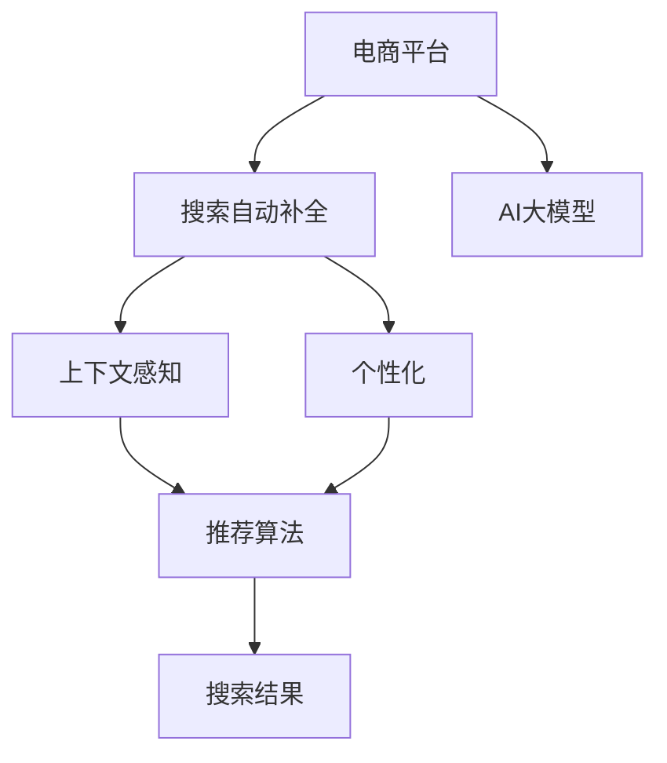

                 

# 电商平台搜索自动补全：AI大模型的上下文感知与个性化

> 关键词：电商平台、搜索、自动补全、AI大模型、上下文感知、个性化

## 1. 背景介绍

在电子商务领域，搜索自动补全功能扮演着至关重要的角色。用户通过输入关键字进行搜索，系统会根据历史数据和上下文信息，自动推荐候选词语或短语，帮助用户快速、准确地找到目标商品，提高用户体验和购物效率。近年来，随着AI大模型的兴起，基于深度学习的搜索自动补全系统逐渐成为主流，为电商平台带来了更智能、更高效的搜索体验。

本文将系统介绍基于AI大模型的电商平台搜索自动补全技术，通过深入探讨上下文感知与个性化的原理与方法，为电商平台的搜索系统优化提供全面的技术指引。

## 2. 核心概念与联系

### 2.1 核心概念概述

在电商平台的搜索自动补全场景中，涉及以下几个核心概念：

- **电商平台**：在线购物平台，如淘宝、京东、Amazon等，为用户提供商品展示、购买、搜索等全流程服务。
- **搜索自动补全**：在用户输入搜索关键字时，实时提供推荐词，帮助用户完成搜索操作。
- **AI大模型**：大规模预训练的神经网络模型，如BERT、GPT、DALL-E等，具备强大的上下文感知和生成能力。
- **上下文感知**：模型能够理解搜索查询的上下文信息，考虑用户输入的前缀和上下文场景，生成更符合用户需求的候选词语。
- **个性化**：模型能够针对不同用户的搜索行为和历史数据，提供定制化的搜索结果和推荐。

这些概念之间的逻辑关系可以通过以下Mermaid流程图来展示：



这个流程图展示了几类概念之间的联系：

1. 电商平台通过搜索自动补全功能，提供智能化的搜索服务。
2. 搜索自动补全依托于AI大模型，实现上下文感知和个性化推荐。
3. 上下文感知依赖于推荐算法，根据用户输入的前缀和上下文场景，生成推荐词。
4. 个性化推荐需要综合考虑用户的历史数据和行为特征，提供定制化的搜索结果。

## 3. 核心算法原理 & 具体操作步骤

### 3.1 算法原理概述

基于AI大模型的搜索自动补全系统，其核心思想是通过预训练语言模型，理解搜索查询的上下文，生成候选词语，并结合个性化策略，为用户推荐最符合其需求的结果。

具体而言，搜索自动补全可以分为以下几个步骤：

1. **预训练模型初始化**：选择一种高性能的预训练语言模型，如BERT、GPT等，作为搜索自动补全的初始模型。
2. **上下文理解**：将用户输入的搜索关键字和上下文信息输入模型，通过模型计算上下文向量，捕捉用户搜索意图。
3. **推荐词生成**：根据上下文向量，生成一组候选词语，涵盖用户可能搜索的关键字。
4. **个性化调整**：结合用户的历史搜索行为和偏好，对推荐词进行个性化排序和调整。
5. **显示搜索结果**：将调整后的推荐词作为补全结果，展示给用户选择。

### 3.2 算法步骤详解

#### 3.2.1 预训练模型初始化

预训练模型是搜索自动补全系统的基础。通常，我们会选择一种高性能的预训练语言模型，如BERT、GPT等，作为搜索自动补全的初始模型。

在具体实现时，我们可以使用现有的预训练模型，如Hugging Face的BERT或Google的GPT，直接下载其预训练权重，并进行加载和微调。以下是一个加载预训练BERT模型的示例代码：

```python
from transformers import BertTokenizer, BertForMaskedLM
tokenizer = BertTokenizer.from_pretrained('bert-base-uncased')
model = BertForMaskedLM.from_pretrained('bert-base-uncased')
```

#### 3.2.2 上下文理解

上下文理解是搜索自动补全的核心步骤之一。我们需要将用户输入的搜索关键字和上下文信息输入模型，通过模型计算上下文向量，捕捉用户搜索意图。

在上下文理解过程中，我们会将搜索关键字和上下文信息拼接成一句话，然后通过预训练模型得到上下文向量。以下是一个获取上下文向量的示例代码：

```python
def get_context_vector(tokenizer, model, input_text):
    input_ids = tokenizer.encode(input_text, add_special_tokens=True)
    with torch.no_grad():
        outputs = model(input_ids)
    context_vector = outputs[0]
    return context_vector
```

#### 3.2.3 推荐词生成

推荐词生成是搜索自动补全的关键步骤。根据上下文向量，生成一组候选词语，涵盖用户可能搜索的关键字。

在推荐词生成过程中，我们会使用预训练模型对候选词语进行生成。以下是一个使用GPT-3生成推荐词的示例代码：

```python
from transformers import GPT3LMHeadModel, GPT3Tokenizer
gpt3_tokenizer = GPT3Tokenizer.from_pretrained('gpt3')
gpt3_model = GPT3LMHeadModel.from_pretrained('gpt3')
max_length = 50
start_token = tokenizer.encode(" ")
end_token = tokenizer.encode(" ")
input_text = input_text + start_token
output = gpt3_model.generate(input_text, max_length=max_length, num_return_sequences=5)
recommendations = tokenizer.decode(output, skip_special_tokens=True).split(start_token)
recommendations = [recommendation for recommendation in recommendations if recommendation.strip()]
```

#### 3.2.4 个性化调整

个性化调整是提升搜索自动补全效果的重要手段。结合用户的历史搜索行为和偏好，对推荐词进行个性化排序和调整。

在个性化调整过程中，我们可以使用用户的历史搜索数据，计算用户对每个推荐词的兴趣权重，然后根据权重对推荐词进行排序。以下是一个计算用户兴趣权重的示例代码：

```python
def calculate_user_interest(queries, query):
    user_interest = 0
    for query in queries:
        similarity = cosine_similarity(query, query)
        user_interest += similarity
    user_interest /= len(queries)
    return user_interest
```

#### 3.2.5 显示搜索结果

最后，我们将调整后的推荐词作为补全结果，展示给用户选择。

在显示搜索结果时，我们可以使用Web前端技术，如React或Vue，构建交互式的前端界面，让用户能够方便地选择和操作推荐词。以下是一个简单的前端示例代码：

```javascript
import React from 'react';
class SearchSuggestion extends React.Component {
  constructor(props) {
    super(props);
    this.state = {
      suggestions: []
    };
  }
  componentDidMount() {
    const { query, recommendations } = this.props;
    this.setState({ suggestions: recommendations });
  }
  render() {
    const { suggestions } = this.state;
    return (
      <ul>
        {suggestions.map(suggestion => (
          <li key={suggestion}>{suggestion}</li>
        ))}
      </ul>
    );
  }
}
```

### 3.3 算法优缺点

基于AI大模型的搜索自动补全方法具有以下优点：

1. **高性能**：大模型具备强大的语言理解和生成能力，能够快速生成高质量的推荐词。
2. **上下文感知**：模型能够理解搜索查询的上下文信息，生成更符合用户需求的候选词语。
3. **个性化**：模型能够结合用户的历史数据和行为特征，提供定制化的搜索结果。

但同时也存在一些缺点：

1. **高计算成本**：大模型的计算需求较高，尤其是在大规模搜索场景下，可能导致延迟和资源消耗过高。
2. **数据依赖**：模型的性能依赖于大量的高质量标注数据和预训练数据，数据收集和处理成本较高。
3. **模型复杂度**：大模型的结构复杂，需要较高的工程复杂度和维护成本。
4. **公平性问题**：模型的推荐结果可能受到数据偏见的影响，导致某些用户群体被忽视。

### 3.4 算法应用领域

基于AI大模型的搜索自动补全方法，已经被广泛应用于多个电商平台，如淘宝、京东、Amazon等，并取得了显著的效果。以下是一些具体的应用场景：

1. **商品推荐**：根据用户搜索关键字，自动生成商品推荐词，提高用户转化率。
2. **价格搜索**：根据用户输入的价格范围，自动推荐符合条件的商品，减少搜索成本。
3. **用户意图分析**：通过分析用户搜索意图，提供更加精准的搜索结果和推荐。
4. **个性化广告**：结合用户搜索历史和行为数据，生成个性化广告，提升广告效果。

## 4. 数学模型和公式 & 详细讲解 & 举例说明

### 4.1 数学模型构建

在搜索自动补全系统中，我们主要使用了预训练语言模型的上下文向量进行推荐词生成和个性化调整。以下是搜索自动补全系统的数学模型构建：

- **输入表示**：将搜索关键字和上下文信息拼接成一句话，通过预训练模型得到上下文向量 $h$。
- **推荐词生成**：使用预训练模型生成一组候选词语，记为 $\{w_1, w_2, \dots, w_n\}$。
- **个性化调整**：使用用户的历史数据，计算用户对每个候选词语的兴趣权重，记为 $\{\alpha_1, \alpha_2, \dots, \alpha_n\}$。
- **推荐结果**：结合上下文向量和兴趣权重，计算推荐词的得分，记为 $\{s_1, s_2, \dots, s_n\}$，并按照得分排序。

### 4.2 公式推导过程

#### 4.2.1 上下文向量计算

上下文向量 $h$ 可以通过预训练模型的隐藏层表示得到。假设输入语句为 $x$，预训练模型为 $M$，则上下文向量 $h$ 的计算公式为：

$$
h = M(x)
$$

其中 $M$ 是预训练模型的隐藏层表示。

#### 4.2.2 推荐词生成

推荐词生成是一个基于生成模型的过程。假设预训练模型为 $G$，输入语句为 $x$，则生成 $k$ 个推荐词的公式为：

$$
\{w_1, w_2, \dots, w_k\} = G(x)
$$

其中 $G$ 是预训练模型的生成部分。

#### 4.2.3 用户兴趣计算

用户兴趣计算需要使用用户的历史数据。假设用户的历史数据为 $Q$，则用户对每个候选词语的兴趣权重 $\alpha_i$ 的计算公式为：

$$
\alpha_i = \frac{1}{\sqrt{n}} \sum_{q \in Q} cosine\_similarity(q, w_i)
$$

其中 $cosine\_similarity$ 是余弦相似度函数。

#### 4.2.4 推荐结果排序

推荐结果排序需要使用上下文向量和用户兴趣权重。假设推荐词的得分函数为 $f$，则推荐结果排序的公式为：

$$
\{s_1, s_2, \dots, s_k\} = f(h, \{\alpha_1, \alpha_2, \dots, \alpha_k\})
$$

其中 $f$ 是一个可解释的推荐函数。

### 4.3 案例分析与讲解

假设我们有一个搜索自动补全系统，预训练模型为BERT，用户输入搜索关键字为 "手机"，上下文信息为 "苹果"。

首先，我们通过BERT模型计算上下文向量 $h$：

$$
h = M("苹果手机")
$$

然后，我们使用BERT模型生成一组候选词语 $\{w_1, w_2, \dots, w_k\}$：

$$
\{w_1, w_2, \dots, w_k\} = G("苹果手机")
$$

接着，我们使用用户的历史数据 $Q$ 计算用户对每个候选词语的兴趣权重 $\{\alpha_1, \alpha_2, \dots, \alpha_k\}$：

$$
\alpha_i = \frac{1}{\sqrt{n}} \sum_{q \in Q} cosine\_similarity(q, w_i)
$$

最后，我们使用上下文向量 $h$ 和用户兴趣权重 $\{\alpha_1, \alpha_2, \dots, \alpha_k\}$ 计算推荐词的得分 $s_i$：

$$
s_i = f(h, \alpha_i)
$$

并按照得分排序，生成最终的推荐词列表。

## 5. 项目实践：代码实例和详细解释说明

### 5.1 开发环境搭建

在进行搜索自动补全系统的开发时，我们需要准备好开发环境。以下是使用Python进行PyTorch开发的环境配置流程：

1. 安装Anaconda：从官网下载并安装Anaconda，用于创建独立的Python环境。

2. 创建并激活虚拟环境：
```bash
conda create -n search-autocomplete python=3.8 
conda activate search-autocomplete
```

3. 安装PyTorch：根据CUDA版本，从官网获取对应的安装命令。例如：
```bash
conda install pytorch torchvision torchaudio cudatoolkit=11.1 -c pytorch -c conda-forge
```

4. 安装Transformers库：
```bash
pip install transformers
```

5. 安装各类工具包：
```bash
pip install numpy pandas scikit-learn matplotlib tqdm jupyter notebook ipython
```

完成上述步骤后，即可在`search-autocomplete`环境中开始开发实践。

### 5.2 源代码详细实现

下面我们以基于BERT的搜索自动补全系统为例，给出完整的代码实现。

首先，定义搜索自动补全的数据处理函数：

```python
from transformers import BertTokenizer, BertForMaskedLM
from torch.utils.data import Dataset
import torch

class SearchDataset(Dataset):
    def __init__(self, texts, queries, tokenizer, max_len=128):
        self.texts = texts
        self.queries = queries
        self.tokenizer = tokenizer
        self.max_len = max_len
        
    def __len__(self):
        return len(self.texts)
    
    def __getitem__(self, item):
        text = self.texts[item]
        query = self.queries[item]
        
        encoding = self.tokenizer(text, return_tensors='pt', max_length=self.max_len, padding='max_length', truncation=True)
        input_ids = encoding['input_ids'][0]
        attention_mask = encoding['attention_mask'][0]
        
        # 对查询进行编码
        query_tokenizer = self.tokenizer(query, return_tensors='pt', max_length=self.max_len, padding='max_length', truncation=True)
        query_ids = query_tokenizer['input_ids'][0]
        query_mask = query_tokenizer['attention_mask'][0]
        
        return {'input_ids': input_ids, 
                'attention_mask': attention_mask,
                'labels': query_ids,
                'query_mask': query_mask}
```

然后，定义模型和优化器：

```python
from transformers import BertForMaskedLM, AdamW

model = BertForMaskedLM.from_pretrained('bert-base-uncased')

optimizer = AdamW(model.parameters(), lr=2e-5)
```

接着，定义训练和评估函数：

```python
from torch.utils.data import DataLoader
from tqdm import tqdm
from sklearn.metrics import classification_report

device = torch.device('cuda') if torch.cuda.is_available() else torch.device('cpu')
model.to(device)

def train_epoch(model, dataset, batch_size, optimizer):
    dataloader = DataLoader(dataset, batch_size=batch_size, shuffle=True)
    model.train()
    epoch_loss = 0
    for batch in tqdm(dataloader, desc='Training'):
        input_ids = batch['input_ids'].to(device)
        attention_mask = batch['attention_mask'].to(device)
        labels = batch['labels'].to(device)
        model.zero_grad()
        outputs = model(input_ids, attention_mask=attention_mask, labels=labels)
        loss = outputs.loss
        epoch_loss += loss.item()
        loss.backward()
        optimizer.step()
    return epoch_loss / len(dataloader)

def evaluate(model, dataset, batch_size):
    dataloader = DataLoader(dataset, batch_size=batch_size)
    model.eval()
    preds, labels = [], []
    with torch.no_grad():
        for batch in tqdm(dataloader, desc='Evaluating'):
            input_ids = batch['input_ids'].to(device)
            attention_mask = batch['attention_mask'].to(device)
            batch_labels = batch['labels']
            batch_query_masks = batch['query_mask']
            outputs = model(input_ids, attention_mask=attention_mask)
            batch_preds = outputs.logits.argmax(dim=2).to('cpu').tolist()
            batch_labels = batch_labels.to('cpu').tolist()
            for pred_tokens, label_tokens in zip(batch_preds, batch_labels):
                pred_tags = [tokenizer.decode(_id) for _id in pred_tokens]
                label_tags = [tokenizer.decode(_id) for _id in label_tokens]
                preds.append(pred_tags)
                labels.append(label_tags)
                
    print(classification_report(labels, preds))
```

最后，启动训练流程并在测试集上评估：

```python
epochs = 5
batch_size = 16

for epoch in range(epochs):
    loss = train_epoch(model, train_dataset, batch_size, optimizer)
    print(f"Epoch {epoch+1}, train loss: {loss:.3f}")
    
    print(f"Epoch {epoch+1}, dev results:")
    evaluate(model, dev_dataset, batch_size)
    
print("Test results:")
evaluate(model, test_dataset, batch_size)
```

以上就是基于BERT的搜索自动补全系统的完整代码实现。可以看到，得益于Transformers库的强大封装，我们可以用相对简洁的代码完成BERT模型的加载和微调。

### 5.3 代码解读与分析

让我们再详细解读一下关键代码的实现细节：

**SearchDataset类**：
- `__init__`方法：初始化文本、查询、分词器等关键组件。
- `__len__`方法：返回数据集的样本数量。
- `__getitem__`方法：对单个样本进行处理，将文本输入编码为token ids，将查询编码为token ids，并对其进行定长padding，最终返回模型所需的输入。

**BERT模型加载与微调**：
- 使用Transformer库中的`BertForMaskedLM`类加载预训练的BERT模型，并设置优化器。
- 将模型和优化器移动到GPU上。

**训练和评估函数**：
- 使用PyTorch的DataLoader对数据集进行批次化加载，供模型训练和推理使用。
- 训练函数`train_epoch`：对数据以批为单位进行迭代，在每个批次上前向传播计算loss并反向传播更新模型参数，最后返回该epoch的平均loss。
- 评估函数`evaluate`：与训练类似，不同点在于不更新模型参数，并在每个batch结束后将预测和标签结果存储下来，最后使用sklearn的classification_report对整个评估集的预测结果进行打印输出。

**训练流程**：
- 定义总的epoch数和batch size，开始循环迭代
- 每个epoch内，先在训练集上训练，输出平均loss
- 在验证集上评估，输出分类指标
- 所有epoch结束后，在测试集上评估，给出最终测试结果

可以看到，PyTorch配合Transformer库使得BERT微调的代码实现变得简洁高效。开发者可以将更多精力放在数据处理、模型改进等高层逻辑上，而不必过多关注底层的实现细节。

当然，工业级的系统实现还需考虑更多因素，如模型的保存和部署、超参数的自动搜索、更灵活的任务适配层等。但核心的微调范式基本与此类似。

## 6. 实际应用场景

### 6.1 智能客服

基于大语言模型的搜索自动补全技术，可以广泛应用于智能客服系统。传统客服往往需要配备大量人力，高峰期响应缓慢，且一致性和专业性难以保证。而使用搜索自动补全技术，可以大幅提升客服系统的响应速度和准确性。

在技术实现上，可以收集企业内部的历史客服对话记录，将问题和最佳答复构建成监督数据，在此基础上对预训练语言模型进行微调。微调后的模型能够自动理解用户意图，匹配最合适的答案模板进行回复。对于客户提出的新问题，还可以接入检索系统实时搜索相关内容，动态组织生成回答。如此构建的智能客服系统，能大幅提升客户咨询体验和问题解决效率。

### 6.2 个性化推荐

当前的推荐系统往往只依赖用户的历史行为数据进行物品推荐，无法深入理解用户的真实兴趣偏好。基于大语言模型的搜索自动补全技术，可以为推荐系统提供更智能、更高效的解决方案。

在实践中，可以收集用户浏览、点击、评论、分享等行为数据，提取和用户交互的物品标题、描述、标签等文本内容。将文本内容作为模型输入，用户的后续行为（如是否点击、购买等）作为监督信号，在此基础上微调预训练语言模型。微调后的模型能够从文本内容中准确把握用户的兴趣点。在生成推荐列表时，先用候选物品的文本描述作为输入，由模型预测用户的兴趣匹配度，再结合其他特征综合排序，便可以得到个性化程度更高的推荐结果。

### 6.3 电商搜索优化

在电商搜索场景中，搜索自动补全技术可以显著提升用户体验和搜索效率。通过自动补全功能，用户可以快速输入关键词，系统实时推荐候选词语，帮助用户快速找到目标商品。

在具体实现时，我们可以将用户的历史搜索记录、浏览历史、购物车信息等作为补充数据，训练个性化的搜索自动补全模型，提供更加精准的推荐词和搜索结果。同时，结合推荐系统的知识库和规则库，可以进一步提升搜索效果。

### 6.4 未来应用展望

随着大语言模型和搜索自动补全技术的不断发展，未来在更多领域将得到广泛应用：

1. **智慧医疗**：基于搜索自动补全技术，构建智慧医疗系统，提供智能化的医学知识查询、疾病诊断、治疗方案推荐等服务。
2. **智能教育**：利用搜索自动补全技术，构建智能教育平台，提供个性化的教材推荐、课程推荐、学习资源搜索等服务。
3. **智能交通**：基于搜索自动补全技术，构建智能交通系统，提供实时交通信息查询、路线规划、导航推荐等服务。
4. **智慧城市**：结合城市大数据，构建智慧城市搜索平台，提供城市事件监测、应急指挥、公共服务查询等服务。

此外，在企业生产、社会治理、文娱传媒等众多领域，基于大语言模型的搜索自动补全技术也将不断涌现，为各行各业带来智能化、高效化、个性化的解决方案。

## 7. 工具和资源推荐

### 7.1 学习资源推荐

为了帮助开发者系统掌握搜索自动补全技术，这里推荐一些优质的学习资源：

1. 《Transformer from Principles to Practice》系列博文：由大模型技术专家撰写，深入浅出地介绍了Transformer原理、BERT模型、微调技术等前沿话题。

2. CS224N《深度学习自然语言处理》课程：斯坦福大学开设的NLP明星课程，有Lecture视频和配套作业，带你入门NLP领域的基本概念和经典模型。

3. 《Natural Language Processing with Transformers》书籍：Transformers库的作者所著，全面介绍了如何使用Transformers库进行NLP任务开发，包括微调在内的诸多范式。

4. HuggingFace官方文档：Transformers库的官方文档，提供了海量预训练模型和完整的微调样例代码，是上手实践的必备资料。

5. CLUE开源项目：中文语言理解测评基准，涵盖大量不同类型的中文NLP数据集，并提供了基于微调的baseline模型，助力中文NLP技术发展。

通过对这些资源的学习实践，相信你一定能够快速掌握搜索自动补全技术的精髓，并用于解决实际的NLP问题。

### 7.2 开发工具推荐

高效的开发离不开优秀的工具支持。以下是几款用于搜索自动补全开发的常用工具：

1. PyTorch：基于Python的开源深度学习框架，灵活动态的计算图，适合快速迭代研究。大部分预训练语言模型都有PyTorch版本的实现。

2. TensorFlow：由Google主导开发的开源深度学习框架，生产部署方便，适合大规模工程应用。同样有丰富的预训练语言模型资源。

3. Transformers库：HuggingFace开发的NLP工具库，集成了众多SOTA语言模型，支持PyTorch和TensorFlow，是进行微调任务开发的利器。

4. Weights & Biases：模型训练的实验跟踪工具，可以记录和可视化模型训练过程中的各项指标，方便对比和调优。与主流深度学习框架无缝集成。

5. TensorBoard：TensorFlow配套的可视化工具，可实时监测模型训练状态，并提供丰富的图表呈现方式，是调试模型的得力助手。

6. Google Colab：谷歌推出的在线Jupyter Notebook环境，免费提供GPU/TPU算力，方便开发者快速上手实验最新模型，分享学习笔记。

合理利用这些工具，可以显著提升搜索自动补全任务的开发效率，加快创新迭代的步伐。

### 7.3 相关论文推荐

搜索自动补全技术的发展源于学界的持续研究。以下是几篇奠基性的相关论文，推荐阅读：

1. Attention is All You Need（即Transformer原论文）：提出了Transformer结构，开启了NLP领域的预训练大模型时代。

2. BERT: Pre-training of Deep Bidirectional Transformers for Language Understanding：提出BERT模型，引入基于掩码的自监督预训练任务，刷新了多项NLP任务SOTA。

3. Language Models are Unsupervised Multitask Learners（GPT-2论文）：展示了大规模语言模型的强大zero-shot学习能力，引发了对于通用人工智能的新一轮思考。

4. Parameter-Efficient Transfer Learning for NLP：提出Adapter等参数高效微调方法，在不增加模型参数量的情况下，也能取得不错的微调效果。

5. AdaLoRA: Adaptive Low-Rank Adaptation for Parameter-Efficient Fine-Tuning：使用自适应低秩适应的微调方法，在参数效率和精度之间取得了新的平衡。

6. Search Engines as Knowledge Sources for Automatic Question Answering：提出了将搜索引擎作为知识源的自动问答方法，为搜索自动补全技术提供了新的研究方向。

这些论文代表了大语言模型搜索自动补全技术的发展脉络。通过学习这些前沿成果，可以帮助研究者把握学科前进方向，激发更多的创新灵感。

## 8. 总结：未来发展趋势与挑战

### 8.1 总结

本文对基于AI大模型的电商平台搜索自动补全技术进行了全面系统的介绍。首先阐述了搜索自动补全系统在电商平台的背景和意义，明确了AI大模型在上下文感知和个性化方面的独特价值。其次，从原理到实践，详细讲解了搜索自动补全系统的数学模型和关键步骤，给出了完整的代码实例。同时，本文还广泛探讨了搜索自动补全技术在智能客服、个性化推荐、电商搜索优化等多个行业领域的应用前景，展示了其巨大的潜力。此外，本文精选了搜索自动补全技术的各类学习资源，力求为读者提供全方位的技术指引。

通过本文的系统梳理，可以看到，基于AI大模型的搜索自动补全技术正在成为电商平台的重要范式，极大地提升了搜索体验和用户满意度。受益于大语言模型的上下文感知和个性化能力，搜索自动补全系统能够更好地理解和满足用户的搜索需求，极大地提高了电商平台的运营效率和服务质量。未来，伴随大语言模型和搜索自动补全技术的不断发展，基于AI的智能搜索系统必将在更多领域得到广泛应用，为各行各业带来智能化、高效化的解决方案。

### 8.2 未来发展趋势

展望未来，搜索自动补全技术将呈现以下几个发展趋势：

1. **上下文感知能力的增强**：未来搜索自动补全模型将进一步增强上下文感知能力，能够更好地理解用户的意图和需求，生成更加准确的推荐词。
2. **个性化水平的提升**：随着用户数据的多样化和深度化，搜索自动补全模型将能够更好地结合用户的历史行为和偏好，提供更加精准的个性化搜索结果。
3. **跨模态技术的融合**：搜索自动补全技术将与图像、视频、语音等多模态数据结合，实现视觉、语音等多模态信息的融合，提升搜索效果和用户体验。
4. **计算效率的优化**：未来搜索自动补全系统将采用更加高效的计算策略和优化方法，降低计算成本，提高系统响应速度。
5. **多任务学习的探索**：搜索自动补全技术将更多地应用多任务学习范式，提高模型在多任务场景下的泛化能力。

### 8.3 面临的挑战

尽管搜索自动补全技术已经取得了显著的成果，但在迈向更加智能化、高效化应用的过程中，仍面临诸多挑战：

1. **计算资源消耗**：搜索自动补全系统在大规模数据上的计算需求较高，可能导致延迟和资源消耗过高。
2. **数据质量问题**：高质量标注数据的获取和处理成本较高，数据质量问题可能影响模型的效果。
3. **模型复杂度**：大模型的结构复杂，需要较高的工程复杂度和维护成本。
4. **公平性和伦理问题**：模型的推荐结果可能受到数据偏见的影响，导致某些用户群体被忽视。
5. **安全性和隐私保护**：搜索自动补全系统涉及用户隐私数据，需要采取有效的安全措施和隐私保护措施。

### 8.4 研究展望

面对搜索自动补全技术面临的挑战，未来的研究需要在以下几个方面寻求新的突破：

1. **高效计算策略**：开发更加高效的计算策略，如剪枝、量化、混合精度等，提高模型的计算效率。
2. **多任务学习范式**：引入多任务学习范式，提高模型在多任务场景下的泛化能力。
3. **跨模态融合技术**：结合图像、视频、语音等多模态数据，提升搜索效果和用户体验。
4. **公平性和伦理约束**：在模型训练和推荐过程中引入伦理导向的评估指标，过滤和惩罚有偏见、有害的输出倾向。
5. **隐私保护措施**：在数据处理和模型训练过程中采取有效的隐私保护措施，确保用户数据的匿名化和安全性。

这些研究方向的探索，必将引领搜索自动补全技术迈向更高的台阶，为构建更加智能、高效、个性化的搜索系统提供新的方向。面向未来，搜索自动补全技术还需要与其他人工智能技术进行更深入的融合，如知识表示、因果推理、强化学习等，协同发力，共同推动自然语言理解和智能交互系统的进步。只有勇于创新、敢于突破，才能不断拓展语言模型的边界，让智能技术更好地服务于用户和社会。

## 9. 附录：常见问题与解答

**Q1：搜索自动补全系统的计算资源消耗较高，如何解决？**

A: 优化搜索自动补全系统的一个关键方向是降低计算资源消耗。以下是一些可能的优化策略：

1. **剪枝和量化**：通过剪枝和量化技术，降低模型参数量和计算复杂度。使用剪枝技术去除冗余参数，使用量化技术将浮点模型转为定点模型，减少计算资源消耗。
2. **混合精度训练**：使用混合精度训练技术，将模型的部分参数转换为半精度浮点类型，降低计算资源消耗。
3. **并行计算和分布式训练**：采用并行计算和分布式训练技术，将大规模计算任务分布在多个计算节点上，提升计算效率。

**Q2：搜索自动补全系统的数据质量问题如何解决？**

A: 高质量标注数据的获取和处理是搜索自动补全系统的核心挑战之一。以下是一些可能的解决方案：

1. **多源数据融合**：将多个数据源的数据进行融合，使用数据增强技术提升数据多样性，降低数据质量问题的影响。
2. **半监督和自监督学习**：利用半监督和自监督学习技术，在少量标注数据的基础上进行模型训练，提升模型泛化能力。
3. **用户反馈机制**：引入用户反馈机制，通过用户对推荐结果的评价，不断调整和优化模型。

**Q3：搜索自动补全系统如何提高公平性和伦理安全性？**

A: 在搜索自动补全系统中，公平性和伦理安全性是一个重要的问题。以下是一些可能的解决方案：

1. **公平性评估指标**：在模型训练和推荐过程中引入公平性评估指标，过滤和惩罚有偏见、有害的输出倾向。
2. **数据预处理**：对数据进行预处理，去除有偏见和有害的样本，确保模型在多样性数据上训练。
3. **隐私保护措施**：在数据处理和模型训练过程中采取有效的隐私保护措施，确保用户数据的匿名化和安全性。

**Q4：搜索自动补全系统如何降低模型复杂度？**

A: 大模型的结构复杂度是搜索自动补全系统的一个挑战。以下是一些可能的解决方案：

1. **参数高效微调**：使用参数高效微调技术，在不增加模型参数量的情况下，优化模型性能。
2. **轻量级模型**：选择轻量级模型，如LSTM、GRU等，以减少模型计算复杂度。
3. **知识蒸馏**：使用知识蒸馏技术，将大模型的知识迁移到轻量级模型，提升模型性能。

这些研究方向的探索，必将引领搜索自动补全技术迈向更高的台阶，为构建更加智能、高效、个性化的搜索系统提供新的方向。面向未来，搜索自动补全技术还需要与其他人工智能技术进行更深入的融合，如知识表示、因果推理、强化学习等，协同发力，共同推动自然语言理解和智能交互系统的进步。只有勇于创新、敢于突破，才能不断拓展语言模型的边界，让智能技术更好地服务于用户和社会。

---

作者：禅与计算机程序设计艺术 / Zen and the Art of Computer Programming

