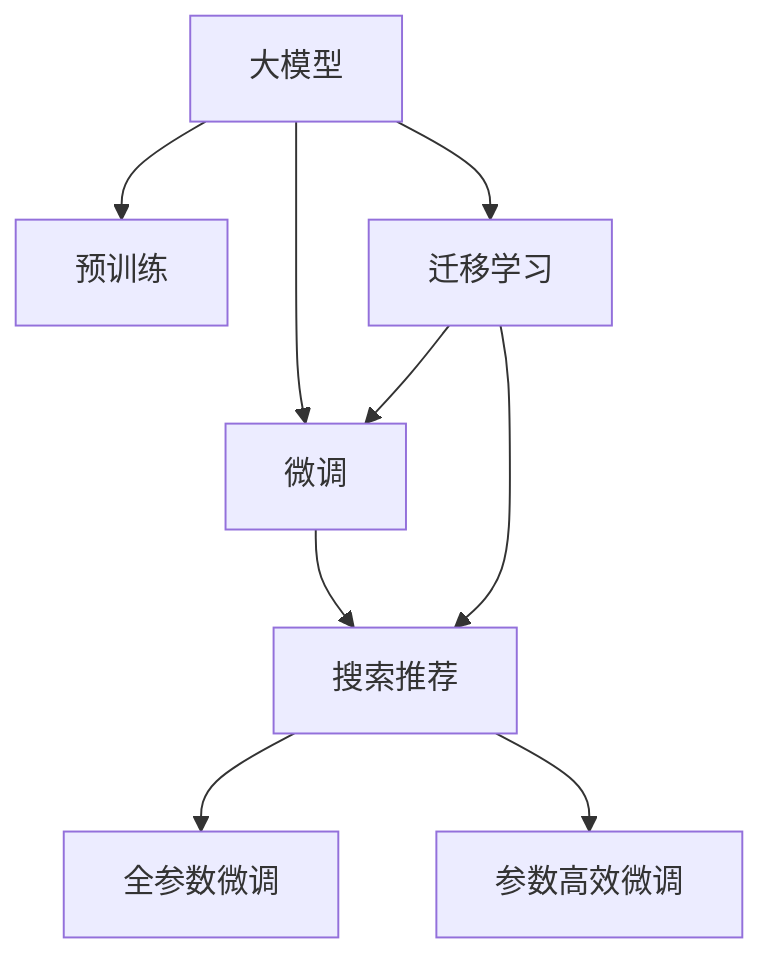

                 

# 电商平台的AI 大模型实践：以搜索推荐系统为核心的转型

> 关键词：人工智能, 大模型, 电商, 搜索推荐系统, 数据挖掘, 深度学习, 应用案例

## 1. 背景介绍

### 1.1 问题由来

随着互联网电商的快速发展，电商平台需要处理海量用户行为数据，提供精准的搜索推荐服务，提升用户体验和销售转化率。传统的搜索推荐系统主要依赖统计学方法和特征工程，需要频繁迭代模型，缺乏对大规模用户行为数据的深度挖掘和利用。近年来，随着深度学习技术和大规模预训练语言模型的兴起，基于大模型的推荐系统逐渐成为电商平台的转型方向。

大模型技术可以学习到用户行为背后的深层语义和关联信息，具备更强的泛化能力和迁移学习能力，能够在极少量的标注样本下快速优化推荐效果。本文聚焦于电商平台的AI 大模型实践，以搜索推荐系统为核心，系统介绍大模型的应用，并探讨其实际应用场景和未来发展趋势。

### 1.2 问题核心关键点

当前电商平台的搜索推荐系统主要面临以下几个核心挑战：

- 如何高效利用海量的用户行为数据，挖掘用户的深层次需求和兴趣。
- 如何结合上下文信息，提升搜索推荐的个性化和准确性。
- 如何应对长尾需求和冷启动问题，保证用户满意度。
- 如何在高并发环境下，保证搜索推荐的实时性和稳定性。

大模型技术提供了数据驱动的深度表示学习能力，通过大规模预训练模型的微调，能够从用户行为数据中学习到丰富的语义和关联信息，从而在以上几个方面取得突破。本文将介绍基于大模型的搜索推荐系统架构及其核心算法，重点探讨其在电商平台的实际应用和效果。

## 2. 核心概念与联系

### 2.1 核心概念概述

为更好地理解基于大模型的电商搜索推荐系统，本节将介绍几个密切相关的核心概念：

- 大模型( Large Model)：以Transformer、BERT等深度学习模型为代表的大规模预训练语言模型。通过在海量文本数据上进行预训练，学习到语言的通用表示。
- 微调(Fine-Tuning)：指在预训练模型的基础上，使用特定任务的数据集进行微调，优化模型在特定任务上的性能。
- 迁移学习(Transfer Learning)：指将一个领域学习到的知识，迁移到另一个不同但相关的领域。通过迁移学习，可以提高模型在特定任务上的性能。
- 预训练-微调(Pre-training & Fine-Tuning)：大模型通过在大规模无标签文本上预训练，然后在特定任务上进行微调，从而提高模型性能。
- 推荐系统(Recommendation System)：通过用户行为数据挖掘，向用户推荐可能感兴趣的物品的系统。推荐系统是电商平台的核心功能之一。

这些核心概念之间的逻辑关系可以通过以下Mermaid流程图来展示：



这个流程图展示了从大模型的预训练到微调的整个流程，以及与推荐系统之间的关联：

1. 大模型通过预训练获得基础能力。
2. 微调是对预训练模型进行任务特定的优化，以提升模型在特定任务上的性能。
3. 推荐系统可以应用微调后的模型，实现个性化推荐。
4. 迁移学习促进了预训练-微调的范式，将知识从预训练领域迁移到推荐领域。

这些概念共同构成了基于大模型的电商推荐系统的基础框架，使其能够在各种场景下发挥强大的推荐能力。

## 3. 核心算法原理 & 具体操作步骤
### 3.1 算法原理概述

基于大模型的电商搜索推荐系统，本质上是一个基于深度学习的推荐范式。其核心思想是：利用大规模预训练语言模型学习用户行为数据的深度语义表示，并通过微调优化模型在推荐任务上的性能。

具体来说，假设搜索推荐模型为 $M_{\theta}$，其中 $\theta$ 为模型参数。给定用户历史行为数据 $D=\{(x_i,y_i)\}_{i=1}^N$，其中 $x_i$ 为用户行为，$y_i$ 为推荐结果，微调的目标是最小化模型在推荐任务上的损失函数 $\mathcal{L}$：

$$
\theta^* = \mathop{\arg\min}_{\theta} \mathcal{L}(M_{\theta},D)
$$

其中 $\mathcal{L}$ 为推荐任务设计的损失函数，通常包括交叉熵损失、均方误差损失等。

通过梯度下降等优化算法，微调过程不断更新模型参数 $\theta$，最小化损失函数 $\mathcal{L}$，使得模型输出逼近真实标签。由于 $\theta$ 已经通过预训练获得了较好的初始化，因此即便在标注样本不足的情况下，也能较快收敛到理想的模型参数 $\hat{\theta}$。

### 3.2 算法步骤详解

基于大模型的电商搜索推荐系统一般包括以下几个关键步骤：

**Step 1: 准备预训练模型和数据集**
- 选择合适的预训练语言模型 $M_{\theta}$ 作为初始化参数，如 BERT、GPT 等。
- 准备电商领域相关的新闻、评论、行为数据集 $D=\{(x_i,y_i)\}_{i=1}^N$，划分为训练集、验证集和测试集。

**Step 2: 添加推荐任务适配层**
- 根据推荐任务类型，在预训练模型顶层设计合适的输出层和损失函数。
- 对于评分预测任务，通常在顶层添加线性分类器和交叉熵损失函数。
- 对于多选择推荐任务，通常使用softmax函数输出概率分布，并以交叉熵为损失函数。

**Step 3: 设置微调超参数**
- 选择合适的优化算法及其参数，如 AdamW、SGD 等，设置学习率、批大小、迭代轮数等。
- 设置正则化技术及强度，包括权重衰减、Dropout、Early Stopping等。
- 确定冻结预训练参数的策略，如仅微调顶层，或全部参数都参与微调。

**Step 4: 执行梯度训练**
- 将训练集数据分批次输入模型，前向传播计算损失函数。
- 反向传播计算参数梯度，根据设定的优化算法和学习率更新模型参数。
- 周期性在验证集上评估模型性能，根据性能指标决定是否触发 Early Stopping。
- 重复上述步骤直到满足预设的迭代轮数或 Early Stopping 条件。

**Step 5: 测试和部署**
- 在测试集上评估微调后模型 $M_{\hat{\theta}}$ 的性能，对比微调前后的精度提升。
- 使用微调后的模型对新样本进行推理预测，集成到实际的应用系统中。
- 持续收集新的用户行为数据，定期重新微调模型，以适应数据分布的变化。

以上是基于大模型的电商搜索推荐系统的一般流程。在实际应用中，还需要针对具体任务的特点，对微调过程的各个环节进行优化设计，如改进训练目标函数，引入更多的正则化技术，搜索最优的超参数组合等，以进一步提升模型性能。

### 3.3 算法优缺点

基于大模型的电商搜索推荐系统具有以下优点：

1. 深度学习表示能力强。大模型能够学习到用户行为的深层语义信息，提升推荐精度。
2. 泛化能力强。大模型在少量标注样本下，也能快速适应新任务，优化推荐效果。
3. 迁移能力强。预训练模型在不同任务上迁移学习能力较强，易于迁移到其他领域。
4. 实时性高。微调后的大模型能实时响应推荐请求，提供个性化推荐。

同时，该方法也存在以下局限性：

1. 对标注数据依赖高。微调效果很大程度上取决于标注数据的质量和数量，标注成本较高。
2. 需要大模型硬件支持。训练和推理大模型需要高性能的硬件设备，如GPU/TPU。
3. 对数据分布要求高。微调模型对数据分布变化敏感，无法处理长期未接触的新用户或物品。
4. 可解释性不足。大模型往往像"黑盒"，难以解释推荐过程和决策依据。

尽管存在这些局限性，但就目前而言，基于大模型的推荐系统仍是大模型应用的主流范式。未来相关研究的重点在于如何进一步降低标注数据的依赖，提高模型的跨领域迁移能力，同时兼顾可解释性和伦理安全性等因素。

### 3.4 算法应用领域

基于大模型的电商搜索推荐系统，已经在多个实际应用中取得显著效果，例如：

- 商品推荐：根据用户历史行为，推荐可能感兴趣的商品。
- 个性化新闻推荐：根据用户阅读行为，推荐个性化新闻内容。
- 智能客服：结合用户搜索历史，推荐最合适的商品和客服人员。
- 个性化广告推荐：根据用户浏览行为，推荐相关广告。

除了上述这些经典任务外，大模型推荐系统还被创新性地应用到更多场景中，如推荐系统多目标优化、实时推荐排序、推荐系统公平性等，为电商平台的个性化推荐服务提供了新的解决方案。

## 4. 数学模型和公式 & 详细讲解  
### 4.1 数学模型构建

本节将使用数学语言对基于大模型的电商搜索推荐系统进行更加严格的刻画。

记搜索推荐模型为 $M_{\theta}$，其中 $\theta$ 为模型参数。给定电商推荐任务的数据集 $D=\{(x_i,y_i)\}_{i=1}^N$，其中 $x_i$ 为用户行为，$y_i$ 为推荐结果。微调的目标是最小化损失函数 $\mathcal{L}(\theta)$，定义如下：

$$
\mathcal{L}(\theta) = -\frac{1}{N}\sum_{i=1}^N \ell(M_{\theta}(x_i),y_i)
$$

其中 $\ell$ 为推荐任务设计的损失函数，通常包括交叉熵损失、均方误差损失等。在评分预测任务中，通常使用二分类交叉熵损失：

$$
\ell(M_{\theta}(x),y) = -[y\log M_{\theta}(x) + (1-y)\log (1-M_{\theta}(x))]
$$

在多选择推荐任务中，通常使用多分类交叉熵损失：

$$
\ell(M_{\theta}(x),y) = -\sum_{i=1}^N y_i \log M_{\theta}(x_i)
$$

### 4.2 公式推导过程

以下我们以评分预测任务为例，推导交叉熵损失函数及其梯度的计算公式。

假设模型 $M_{\theta}$ 在输入 $x$ 上的输出为 $\hat{y}=M_{\theta}(x) \in [0,1]$，表示用户对商品的评分。真实标签 $y \in \{1,0\}$。则二分类交叉熵损失函数定义为：

$$
\ell(M_{\theta}(x),y) = -[y\log \hat{y} + (1-y)\log (1-\hat{y})]
$$

将其代入经验风险公式，得：

$$
\mathcal{L}(\theta) = -\frac{1}{N}\sum_{i=1}^N [y_i\log M_{\theta}(x_i)+(1-y_i)\log(1-M_{\theta}(x_i))]
$$

根据链式法则，损失函数对参数 $\theta_k$ 的梯度为：

$$
\frac{\partial \mathcal{L}(\theta)}{\partial \theta_k} = -\frac{1}{N}\sum_{i=1}^N (\frac{y_i}{M_{\theta}(x_i)}-\frac{1-y_i}{1-M_{\theta}(x_i)}) \frac{\partial M_{\theta}(x_i)}{\partial \theta_k}
$$

其中 $\frac{\partial M_{\theta}(x_i)}{\partial \theta_k}$ 可进一步递归展开，利用自动微分技术完成计算。

在得到损失函数的梯度后，即可带入参数更新公式，完成模型的迭代优化。重复上述过程直至收敛，最终得到适应电商推荐任务的最优模型参数 $\theta^*$。

## 5. 项目实践：代码实例和详细解释说明
### 5.1 开发环境搭建

在进行电商搜索推荐系统微调实践前，我们需要准备好开发环境。以下是使用Python进行PyTorch开发的环境配置流程：

1. 安装Anaconda：从官网下载并安装Anaconda，用于创建独立的Python环境。

2. 创建并激活虚拟环境：
```bash
conda create -n pytorch-env python=3.8 
conda activate pytorch-env
```

3. 安装PyTorch：根据CUDA版本，从官网获取对应的安装命令。例如：
```bash
conda install pytorch torchvision torchaudio cudatoolkit=11.1 -c pytorch -c conda-forge
```

4. 安装Transformers库：
```bash
pip install transformers
```

5. 安装各类工具包：
```bash
pip install numpy pandas scikit-learn matplotlib tqdm jupyter notebook ipython
```

完成上述步骤后，即可在`pytorch-env`环境中开始电商搜索推荐系统的微调实践。

### 5.2 源代码详细实现

下面我们以电商商品推荐系统为例，给出使用Transformers库对BERT模型进行微调的PyTorch代码实现。

首先，定义电商商品推荐任务的数据处理函数：

```python
from transformers import BertTokenizer
from torch.utils.data import Dataset
import torch

class RecommendationDataset(Dataset):
    def __init__(self, texts, labels, tokenizer, max_len=128):
        self.texts = texts
        self.labels = labels
        self.tokenizer = tokenizer
        self.max_len = max_len
        
    def __len__(self):
        return len(self.texts)
    
    def __getitem__(self, item):
        text = self.texts[item]
        label = self.labels[item]
        
        encoding = self.tokenizer(text, return_tensors='pt', max_length=self.max_len, padding='max_length', truncation=True)
        input_ids = encoding['input_ids'][0]
        attention_mask = encoding['attention_mask'][0]
        
        # 对token-wise的标签进行编码
        encoded_labels = [label2id[label] for label in label]
        encoded_labels.extend([label2id['O']] * (self.max_len - len(encoded_labels)))
        labels = torch.tensor(encoded_labels, dtype=torch.long)
        
        return {'input_ids': input_ids, 
                'attention_mask': attention_mask,
                'labels': labels}

# 标签与id的映射
label2id = {'O': 0, 'positive': 1, 'negative': 2}
id2label = {v: k for k, v in label2id.items()}

# 创建dataset
tokenizer = BertTokenizer.from_pretrained('bert-base-cased')

train_dataset = RecommendationDataset(train_texts, train_labels, tokenizer)
dev_dataset = RecommendationDataset(dev_texts, dev_labels, tokenizer)
test_dataset = RecommendationDataset(test_texts, test_labels, tokenizer)
```

然后，定义模型和优化器：

```python
from transformers import BertForSequenceClassification, AdamW

model = BertForSequenceClassification.from_pretrained('bert-base-cased', num_labels=len(label2id))

optimizer = AdamW(model.parameters(), lr=2e-5)
```

接着，定义训练和评估函数：

```python
from torch.utils.data import DataLoader
from tqdm import tqdm
from sklearn.metrics import accuracy_score

device = torch.device('cuda') if torch.cuda.is_available() else torch.device('cpu')
model.to(device)

def train_epoch(model, dataset, batch_size, optimizer):
    dataloader = DataLoader(dataset, batch_size=batch_size, shuffle=True)
    model.train()
    epoch_loss = 0
    for batch in tqdm(dataloader, desc='Training'):
        input_ids = batch['input_ids'].to(device)
        attention_mask = batch['attention_mask'].to(device)
        labels = batch['labels'].to(device)
        model.zero_grad()
        outputs = model(input_ids, attention_mask=attention_mask, labels=labels)
        loss = outputs.loss
        epoch_loss += loss.item()
        loss.backward()
        optimizer.step()
    return epoch_loss / len(dataloader)

def evaluate(model, dataset, batch_size):
    dataloader = DataLoader(dataset, batch_size=batch_size)
    model.eval()
    preds, labels = [], []
    with torch.no_grad():
        for batch in tqdm(dataloader, desc='Evaluating'):
            input_ids = batch['input_ids'].to(device)
            attention_mask = batch['attention_mask'].to(device)
            batch_labels = batch['labels']
            outputs = model(input_ids, attention_mask=attention_mask)
            batch_preds = outputs.logits.argmax(dim=2).to('cpu').tolist()
            batch_labels = batch_labels.to('cpu').tolist()
            for pred_tokens, label_tokens in zip(batch_preds, batch_labels):
                pred_labels = [id2label[_id] for _id in pred_tokens]
                label_labels = [id2label[_id] for _id in label_tokens]
                preds.append(pred_labels[:len(label_labels)])
                labels.append(label_labels)
                
    print(f'Accuracy: {accuracy_score(labels, preds)}')
```

最后，启动训练流程并在测试集上评估：

```python
epochs = 5
batch_size = 16

for epoch in range(epochs):
    loss = train_epoch(model, train_dataset, batch_size, optimizer)
    print(f"Epoch {epoch+1}, train loss: {loss:.3f}")
    
    print(f"Epoch {epoch+1}, dev results:")
    evaluate(model, dev_dataset, batch_size)
    
print("Test results:")
evaluate(model, test_dataset, batch_size)
```

以上就是使用PyTorch对BERT进行电商商品推荐系统微调的完整代码实现。可以看到，得益于Transformers库的强大封装，我们可以用相对简洁的代码完成BERT模型的加载和微调。

### 5.3 代码解读与分析

让我们再详细解读一下关键代码的实现细节：

**RecommendationDataset类**：
- `__init__`方法：初始化文本、标签、分词器等关键组件。
- `__len__`方法：返回数据集的样本数量。
- `__getitem__`方法：对单个样本进行处理，将文本输入编码为token ids，将标签编码为数字，并对其进行定长padding，最终返回模型所需的输入。

**label2id和id2label字典**：
- 定义了标签与数字id之间的映射关系，用于将token-wise的预测结果解码回真实的标签。

**训练和评估函数**：
- 使用PyTorch的DataLoader对数据集进行批次化加载，供模型训练和推理使用。
- 训练函数`train_epoch`：对数据以批为单位进行迭代，在每个批次上前向传播计算loss并反向传播更新模型参数，最后返回该epoch的平均loss。
- 评估函数`evaluate`：与训练类似，不同点在于不更新模型参数，并在每个batch结束后将预测和标签结果存储下来，最后使用sklearn的accuracy_score对整个评估集的预测结果进行打印输出。

**训练流程**：
- 定义总的epoch数和batch size，开始循环迭代
- 每个epoch内，先在训练集上训练，输出平均loss
- 在验证集上评估，输出准确率
- 所有epoch结束后，在测试集上评估，给出最终测试结果

可以看到，PyTorch配合Transformers库使得BERT微调的代码实现变得简洁高效。开发者可以将更多精力放在数据处理、模型改进等高层逻辑上，而不必过多关注底层的实现细节。

当然，工业级的系统实现还需考虑更多因素，如模型的保存和部署、超参数的自动搜索、更灵活的任务适配层等。但核心的微调范式基本与此类似。

## 6. 实际应用场景
### 6.1 智能推荐系统

电商平台的搜索推荐系统通过微调大模型，能够在用户搜索时实时生成个性化的商品推荐，显著提升用户购物体验和转化率。具体实现流程如下：

1. 数据收集：收集用户浏览、点击、购买等行为数据，构建用户行为记录。
2. 数据预处理：清洗、去重、归一化处理数据，生成训练集、验证集和测试集。
3. 模型微调：使用预训练的BERT等大模型，在电商数据集上进行微调，学习用户行为的深层语义表示。
4. 推荐生成：将用户当前搜索词或浏览历史输入微调后的模型，生成推荐商品列表。
5. 效果评估：在测试集上评估模型性能，优化推荐效果。

通过以上流程，电商平台的推荐系统能够实现从用户行为数据中学习并生成个性化推荐，同时还能实时响应搜索请求，提升推荐效果。

### 6.2 用户画像构建

电商平台的搜索推荐系统不仅能够生成个性化推荐，还能构建详细的用户画像，帮助商家更好地了解用户需求和行为。具体实现流程如下：

1. 数据收集：收集用户历史行为、人口属性、兴趣标签等数据，构建用户画像。
2. 数据预处理：清洗、去重、归一化处理数据，生成训练集、验证集和测试集。
3. 模型微调：使用预训练的BERT等大模型，在电商数据集上进行微调，学习用户行为的深层语义表示。
4. 画像生成：将用户画像数据输入微调后的模型，生成用户兴趣画像。
5. 效果评估：在测试集上评估模型性能，优化用户画像构建效果。

通过以上流程，电商平台能够构建详细的用户画像，帮助商家更好地了解用户需求和行为，制定更精准的营销策略，提升用户满意度和商家收益。

### 6.3 实时查询优化

电商平台的搜索推荐系统需要实时响应用户查询，提供快速准确的推荐结果。为了提高实时查询的响应速度，可以进行以下优化：

1. 模型裁剪：去除不必要的层和参数，减小模型尺寸，加快推理速度。
2. 量化加速：将浮点模型转为定点模型，压缩存储空间，提高计算效率。
3. 分布式训练：利用分布式计算技术，加速模型的训练和推理。
4. 缓存机制：在热点查询处缓存推荐结果，减少实时查询时的计算负担。

通过以上优化，电商平台的搜索推荐系统能够在高并发环境下，保证实时性和稳定性，提升用户体验。

### 6.4 未来应用展望

随着大模型技术的发展，基于大模型的电商搜索推荐系统将在更多场景中得到应用，为电商平台的数字化转型提供新动力。

1. 个性化内容推荐：不仅限于商品推荐，未来将扩展到内容推荐领域，如视频、音乐、新闻等。
2. 智能客服：结合用户搜索记录，推荐最合适的客服人员，提升客户体验。
3. 智能定价：根据用户画像和历史购买行为，动态调整商品价格，提升销售转化率。
4. 智能供应链：通过用户行为数据分析，优化库存和物流管理，提升供应链效率。
5. 新客挖掘：通过个性化推荐和新用户画像构建，提升新客转化率和复购率。

这些新应用将进一步提升电商平台的智能化水平，推动产业升级。相信在未来，基于大模型的电商搜索推荐系统将在更多领域得到应用，带来更广泛的商业价值和社会影响。

## 7. 工具和资源推荐
### 7.1 学习资源推荐

为了帮助开发者系统掌握大模型在电商推荐系统中的应用，这里推荐一些优质的学习资源：

1. 《深度学习与推荐系统》课程：由斯坦福大学开设的深度学习课程，系统讲解深度学习在推荐系统中的应用。
2. 《Recommender Systems》书籍：由KDD会议论文集精选，涵盖推荐系统的各种前沿技术。
3. 《Python推荐系统实战》书籍：介绍了基于Python的推荐系统开发，包括模型微调和推荐系统设计等。
4. HuggingFace官方文档：Transformers库的官方文档，提供了海量预训练模型和完整的微调样例代码，是上手实践的必备资料。
5. PyTorch官方文档：PyTorch框架的官方文档，提供了深度学习模型的训练和推理指导。

通过对这些资源的学习实践，相信你一定能够快速掌握大模型在电商推荐系统中的应用，并用于解决实际的推荐问题。
###  7.2 开发工具推荐

高效的开发离不开优秀的工具支持。以下是几款用于电商推荐系统微调开发的常用工具：

1. PyTorch：基于Python的开源深度学习框架，灵活动态的计算图，适合快速迭代研究。
2. TensorFlow：由Google主导开发的开源深度学习框架，生产部署方便，适合大规模工程应用。
3. Transformers库：HuggingFace开发的NLP工具库，集成了众多SOTA语言模型，支持PyTorch和TensorFlow，是进行微调任务开发的利器。
4. Weights & Biases：模型训练的实验跟踪工具，可以记录和可视化模型训练过程中的各项指标，方便对比和调优。
5. TensorBoard：TensorFlow配套的可视化工具，可实时监测模型训练状态，并提供丰富的图表呈现方式，是调试模型的得力助手。
6. Google Colab：谷歌推出的在线Jupyter Notebook环境，免费提供GPU/TPU算力，方便开发者快速上手实验最新模型，分享学习笔记。

合理利用这些工具，可以显著提升电商推荐系统的开发效率，加快创新迭代的步伐。

### 7.3 相关论文推荐

大模型技术的发展源于学界的持续研究。以下是几篇奠基性的相关论文，推荐阅读：

1. Attention is All You Need：提出了Transformer结构，开启了NLP领域的预训练大模型时代。
2. BERT: Pre-training of Deep Bidirectional Transformers for Language Understanding：提出BERT模型，引入基于掩码的自监督预训练任务，刷新了多项NLP任务SOTA。
3. Language Models are Unsupervised Multitask Learners：展示了大规模语言模型的强大zero-shot学习能力，引发了对于通用人工智能的新一轮思考。
4. Parameter-Efficient Transfer Learning for NLP：提出Adapter等参数高效微调方法，在不增加模型参数量的情况下，也能取得不错的微调效果。
5. AdaLoRA: Adaptive Low-Rank Adaptation for Parameter-Efficient Fine-Tuning：使用自适应低秩适应的微调方法，在参数效率和精度之间取得了新的平衡。

这些论文代表了大模型技术的发展脉络。通过学习这些前沿成果，可以帮助研究者把握学科前进方向，激发更多的创新灵感。

## 8. 总结：未来发展趋势与挑战
### 8.1 总结

本文对基于大模型的电商搜索推荐系统进行了全面系统的介绍。首先阐述了电商搜索推荐系统的背景和重要性，明确了大模型的应用价值。其次，从原理到实践，详细讲解了基于大模型的推荐系统架构及其核心算法，给出了微调任务开发的完整代码实例。同时，本文还探讨了电商搜索推荐系统在大模型微调下的应用场景和未来发展趋势。

通过本文的系统梳理，可以看到，基于大模型的电商搜索推荐系统正在成为电商平台的转型方向，通过深度学习表示学习和迁移学习能力，能够在大量用户行为数据中挖掘到深层语义信息，提升推荐效果。借助大模型的微调，电商平台的搜索推荐系统能够实现实时响应，快速生成个性化推荐，提升用户体验和销售转化率。未来，随着大模型技术的发展，基于大模型的电商搜索推荐系统将在更多领域得到应用，为电商平台的数字化转型提供新动力。

### 8.2 未来发展趋势

展望未来，基于大模型的电商搜索推荐系统将呈现以下几个发展趋势：

1. 深度学习表示能力更强。随着预训练模型参数量的不断增加，其表示能力将进一步提升，能够在更复杂多变的推荐场景中取得更好效果。
2. 微调方法更加多样。除了传统的全参数微调外，未来会涌现更多参数高效的微调方法，如LoRA等，在节省计算资源的同时也能保证微调精度。
3. 实时性更高。随着硬件算力提升和模型裁剪技术的发展，微调后的模型将能够更高效地进行实时推荐，保证用户体验。
4. 用户画像构建更加丰富。通过多模态数据的融合，能够构建更全面、更准确的电商用户画像，为推荐系统提供更多信息。
5. 模型泛化能力更强。通过迁移学习和多领域微调，大模型将在更多电商场景中取得成功应用，实现跨领域知识的迁移和共享。
6. 用户体验更优。通过个性化推荐和实时查询优化，大模型推荐系统能够提供更加智能、高效的推荐服务，提升用户满意度。

以上趋势凸显了基于大模型的电商搜索推荐系统的广阔前景。这些方向的探索发展，必将进一步提升电商平台的智能化水平，推动产业升级。

### 8.3 面临的挑战

尽管基于大模型的电商搜索推荐系统已经取得了瞩目成就，但在迈向更加智能化、普适化应用的过程中，它仍面临诸多挑战：

1. 数据隐私问题。电商搜索推荐系统需要处理大量用户行为数据，如何保障用户隐私和数据安全，防止数据泄露，是一个重要问题。
2. 数据标注成本高。电商推荐系统的标注数据通常需要人工审核和标注，成本较高，如何降低标注成本，减少人力投入，是一个需要解决的问题。
3. 模型鲁棒性不足。微调模型对数据分布变化敏感，面对新领域或新物品时，泛化性能可能下降，如何提升模型鲁棒性，是一个重要研究方向。
4. 系统效率问题。电商推荐系统需要实时响应用户查询，如何提高系统效率，提升用户体验，是一个重要挑战。
5. 模型可解释性不足。大模型往往像"黑盒"，难以解释推荐过程和决策依据，如何提升模型可解释性，是一个重要课题。
6. 知识图谱的融合。电商推荐系统需要与外部知识图谱结合，进行知识融合和推理，如何有效整合知识，提升推荐效果，是一个重要研究方向。

这些挑战需要开发者从多个维度进行持续优化和改进，才能真正实现大模型在电商平台的成功应用。

### 8.4 研究展望

面对基于大模型的电商搜索推荐系统所面临的挑战，未来的研究需要在以下几个方面寻求新的突破：

1. 引入更多预训练任务。利用其他预训练任务，如问答、语言生成等，增强大模型的知识表示能力，提升推荐效果。
2. 开发更高效微调算法。研究参数高效微调、混合微调等算法，提高微调效率，降低计算成本。
3. 引入因果推断方法。通过因果推断方法，增强推荐系统的稳定性，提升推荐精度。
4. 优化推荐算法。引入强化学习、多目标优化等算法，优化推荐策略，提升推荐效果。
5. 提升用户画像质量。通过用户画像的多模态融合，提升用户画像构建效果，提供更精准的推荐。
6. 引入更多外部知识。将外部知识图谱、逻辑规则等与大模型结合，提升推荐效果。

这些研究方向将为大模型的电商推荐系统提供新的突破点，进一步提升其智能化水平和用户体验，推动电商平台的数字化转型。相信随着学界和产业界的共同努力，基于大模型的电商推荐系统将会在更多领域得到应用，带来更广泛的商业价值和社会影响。

## 9. 附录：常见问题与解答

**Q1：电商平台的搜索推荐系统是否适用于所有推荐场景？**

A: 电商平台的搜索推荐系统主要聚焦于商品推荐，但对于其他推荐场景，如新闻、视频、音乐等，也可以进行适应性改进。需要根据不同的推荐任务和数据特点，对模型进行微调和优化。

**Q2：电商平台的搜索推荐系统如何处理长尾需求和冷启动问题？**

A: 电商平台的搜索推荐系统通常会采用多目标优化算法，提升对长尾需求的推荐效果。对于冷启动用户，可以通过用户画像构建和行为预测，提供个性化推荐，帮助用户快速融入平台。

**Q3：电商平台的搜索推荐系统如何应对数据分布变化？**

A: 电商平台的搜索推荐系统需要定期进行模型微调，以适应数据分布的变化。可以结合用户画像和历史行为数据，动态调整推荐策略，保证推荐效果。

**Q4：电商平台的搜索推荐系统如何处理推荐过程中的偏见和歧视问题？**

A: 电商平台的搜索推荐系统需要引入公平性评估指标，避免对某些群体或物品的推荐偏见。可以通过多种公平性算法，如消除偏差、数据平衡等方法，提升推荐系统的公平性。

**Q5：电商平台的搜索推荐系统如何提升用户体验？**

A: 电商平台的搜索推荐系统需要结合用户行为数据和历史行为数据，动态调整推荐策略，提升用户体验。可以通过个性化推荐、实时查询优化、用户画像构建等方法，提升用户体验和满意度。

通过本文的系统梳理，可以看到，基于大模型的电商搜索推荐系统正在成为电商平台的转型方向，通过深度学习表示学习和迁移学习能力，能够在大量用户行为数据中挖掘到深层语义信息，提升推荐效果。借助大模型的微调，电商平台的搜索推荐系统能够实现实时响应，快速生成个性化推荐，提升用户体验和销售转化率。未来，随着大模型技术的发展，基于大模型的电商搜索推荐系统将在更多领域得到应用，为电商平台的数字化转型提供新动力。

