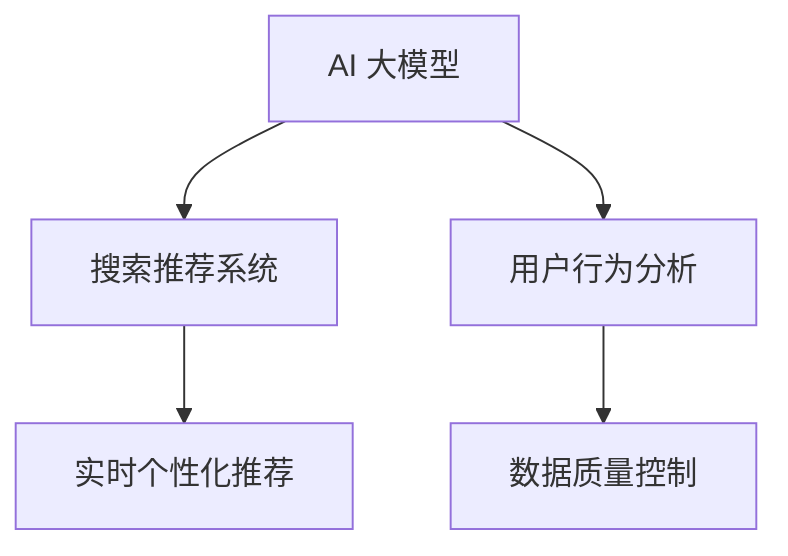

                 

# 电商平台的AI 大模型实践：搜索推荐系统是核心，数据质量控制是关键

> 关键词：电商平台, 搜索推荐系统, AI 大模型, 数据质量控制, 用户行为分析, 实时个性化推荐

## 1. 背景介绍

### 1.1 问题由来

在电商领域，用户搜索、浏览、购买等行为数据量庞大且多样，如何高效地利用这些数据为用户推荐更符合其需求的商品，是提高用户满意度、增加交易转化率的关键。传统的推荐系统往往依赖手工特征工程和规则，难以处理复杂的数据和实时变化的用户需求。人工智能技术，特别是大模型，逐渐成为解决这一问题的有力工具。

AI 大模型通过对用户行为数据的深度学习，能够捕捉用户喜好、兴趣的多维特征，自动学习商品之间的复杂关系，从而实现更加精准和个性化的推荐。搜索推荐系统作为电商平台的核心组件，直接关联到平台的用户体验和收入效益，因此其AI 大模型实践显得尤为重要。

### 1.2 问题核心关键点

AI 大模型在电商平台的搜索推荐系统中的核心关键点包括：

1. **模型选择**：如何选择合适的预训练模型和微调策略，以适应电商平台的复杂场景。
2. **数据质量**：如何保证用户行为数据的准确性和代表性，为模型提供高质量的训练样本。
3. **模型优化**：如何调整模型参数、损失函数、正则化等，以提升模型的泛化能力和鲁棒性。
4. **实时推荐**：如何设计高效的推理引擎，实现实时个性化的商品推荐。
5. **系统架构**：如何将AI 大模型无缝集成到电商平台的现有架构中，确保高可用性和可扩展性。

## 2. 核心概念与联系

### 2.1 核心概念概述

为更好地理解AI 大模型在电商平台的搜索推荐系统中的实践，本节将介绍几个密切相关的核心概念：

- **AI 大模型**：以Transformer、BERT等深度学习架构为代表的、具有强大语言和图像理解能力的大型预训练模型。通过在大规模数据集上进行预训练，可以自动学习到丰富的知识表示，适用于各种自然语言处理和计算机视觉任务。

- **搜索推荐系统**：电子商务平台的核心功能之一，旨在通过分析用户的行为数据和商品信息，为用户推荐最符合其需求的商品，提升用户体验和平台转化率。

- **数据质量控制**：确保用户行为数据的准确性、完整性和代表性，以提升模型的训练效果和泛化能力。数据质量控制是模型训练和推荐系统性能提升的关键环节。

- **用户行为分析**：通过分析用户搜索、浏览、购买等行为数据，挖掘用户的兴趣偏好、购买意向等深层次信息，为个性化推荐提供数据支持。

- **实时个性化推荐**：利用AI 大模型对用户实时输入的查询和上下文信息进行分析和推理，实时生成个性化推荐结果，提升用户体验。

这些核心概念之间的逻辑关系可以通过以下Mermaid流程图来展示：



这个流程图展示了AI 大模型与搜索推荐系统的核心联系：

1. AI 大模型通过对用户行为数据的学习，提取用户和商品的特征表示。
2. 用户行为分析利用AI 大模型提取的特征，进行深度数据分析和挖掘。
3. 数据质量控制确保用户行为数据的高质量，提升模型训练效果。
4. 实时个性化推荐系统利用AI 大模型和用户行为分析的结果，实时生成推荐结果。

## 3. 核心算法原理 & 具体操作步骤
### 3.1 算法原理概述

电商平台的搜索推荐系统，通过AI 大模型实现用户的个性化推荐。其核心算法原理基于监督学习和迁移学习的范式，即在大量标注数据上训练模型，然后通过微调使其适应具体的推荐场景。

假设用户行为数据集为 $D=\{(x_i,y_i)\}_{i=1}^N$，其中 $x_i$ 为用户行为特征，$y_i$ 为推荐商品的标签。电商平台的推荐系统即基于这一数据集，在预训练的AI 大模型 $M_{\theta}$ 的基础上进行微调，优化模型参数 $\theta$，使其能够根据输入的用户行为特征 $x$ 预测推荐商品的标签 $y$。

推荐系统的损失函数 $\mathcal{L}$ 通常使用交叉熵损失或均方误差损失，衡量模型预测与实际标签的差异。微调的目标是最小化经验风险，即：

$$
\hat{\theta}=\mathop{\arg\min}_{\theta} \mathcal{L}(M_{\theta},D)
$$

通过梯度下降等优化算法，微调过程不断更新模型参数 $\theta$，最小化损失函数 $\mathcal{L}$，使得模型预测逼近真实标签。由于AI 大模型已经通过预训练获得了较好的初始化，因此即便在标注数据量较小的电商平台上，也能较快收敛到理想的模型参数 $\hat{\theta}$。

### 3.2 算法步骤详解

电商平台的AI 大模型微调一般包括以下几个关键步骤：

**Step 1: 准备数据集和预训练模型**

- 收集电商平台上的用户行为数据，包括搜索记录、浏览历史、购买记录等。
- 将数据集划分为训练集、验证集和测试集。
- 选择合适的预训练模型 $M_{\theta}$，如BERT、GPT等，作为初始化参数。

**Step 2: 设计任务适配层**

- 根据电商推荐系统的具体需求，设计合适的输出层和损失函数。
- 对于分类推荐任务，通常在顶层添加线性分类器和交叉熵损失函数。
- 对于排序推荐任务，可以使用回归损失函数，如均方误差损失。

**Step 3: 设置微调超参数**

- 选择合适的优化算法及其参数，如Adam、SGD等，设置学习率、批大小、迭代轮数等。
- 设置正则化技术及强度，包括权重衰减、Dropout、Early Stopping等。
- 确定冻结预训练参数的策略，如仅微调顶层，或全部参数都参与微调。

**Step 4: 执行梯度训练**

- 将训练集数据分批次输入模型，前向传播计算损失函数。
- 反向传播计算参数梯度，根据设定的优化算法和学习率更新模型参数。
- 周期性在验证集上评估模型性能，根据性能指标决定是否触发Early Stopping。
- 重复上述步骤直到满足预设的迭代轮数或Early Stopping条件。

**Step 5: 测试和部署**

- 在测试集上评估微调后模型 $M_{\hat{\theta}}$ 的性能，对比微调前后的精度提升。
- 使用微调后的模型对新用户输入的查询进行实时推荐，集成到电商平台的推荐系统。
- 持续收集新的用户行为数据，定期重新微调模型，以适应用户行为的变化。

以上是电商平台上基于监督学习的大模型微调的一般流程。在实际应用中，还需要针对具体场景进行优化设计，如改进训练目标函数，引入更多的正则化技术，搜索最优的超参数组合等，以进一步提升模型性能。

### 3.3 算法优缺点

AI 大模型在电商平台的搜索推荐系统中的微调方法具有以下优点：

1. **高效性**：通过微调，可以显著提升推荐系统的推荐效果，特别是在标注数据较少的情况下。
2. **可解释性**：大模型通过学习用户行为数据，可以提供深层次的解释，帮助理解用户需求和推荐机制。
3. **灵活性**：微调过程可以根据具体场景和需求进行定制化调整，适应不同的电商应用。
4. **普适性**：AI 大模型在多种任务上表现优异，可以应用于搜索、推荐、广告等电商平台的多个环节。

同时，该方法也存在一定的局限性：

1. **数据依赖**：微调效果很大程度上取决于标注数据的质量和数量，标注数据的收集和处理成本较高。
2. **泛化能力有限**：当目标任务与预训练数据的分布差异较大时，微调的性能提升有限。
3. **可解释性不足**：微调后的模型通常缺乏可解释性，难以对其推理逻辑进行分析和调试。
4. **资源消耗大**：大模型的推理和微调过程对计算资源和内存资源有较高要求。

尽管存在这些局限性，但就目前而言，基于监督学习的微调方法仍是电商平台上搜索推荐系统的主要范式。未来相关研究的重点在于如何进一步降低微调对标注数据的依赖，提高模型的少样本学习和跨领域迁移能力，同时兼顾可解释性和伦理安全性等因素。

### 3.4 算法应用领域

AI 大模型在电商平台的搜索推荐系统中的应用领域广泛，具体包括：

- **个性化推荐**：根据用户历史行为数据，为用户推荐个性化商品，提升转化率和满意度。
- **实时搜索**：对用户的实时搜索查询进行实时处理，快速返回匹配度高的商品列表。
- **广告投放**：通过分析用户行为数据，精准投放广告，提升广告效果和ROI。
- **客户服务**：利用大模型进行智能客服，快速响应用户问题，提高客户满意度。
- **供应链优化**：分析销售数据和市场趋势，优化供应链管理，提升运营效率。

除了上述这些主要应用外，AI 大模型还被创新性地应用于内容生成、商品定价、用户细分等多个电商场景中，为电商平台的智能化转型提供了新的动力。

## 4. 数学模型和公式 & 详细讲解 & 举例说明
### 4.1 数学模型构建

电商平台的推荐系统，通过AI 大模型实现用户个性化推荐。假设用户行为数据集为 $D=\{(x_i,y_i)\}_{i=1}^N$，其中 $x_i$ 为用户行为特征，$y_i$ 为推荐商品的标签。

定义模型 $M_{\theta}$ 在输入 $x_i$ 上的输出为 $\hat{y}=M_{\theta}(x_i)$。推荐系统的损失函数 $\mathcal{L}$ 通常使用交叉熵损失，衡量模型预测与实际标签的差异。

$$
\ell(M_{\theta}(x_i),y_i) = -[y_i\log M_{\theta}(x_i)+(1-y_i)\log(1-M_{\theta}(x_i))]
$$

将其代入经验风险公式，得：

$$
\mathcal{L}(\theta) = -\frac{1}{N}\sum_{i=1}^N [y_i\log M_{\theta}(x_i)+(1-y_i)\log(1-M_{\theta}(x_i))]
$$

根据链式法则，损失函数对参数 $\theta_k$ 的梯度为：

$$
\frac{\partial \mathcal{L}(\theta)}{\partial \theta_k} = -\frac{1}{N}\sum_{i=1}^N (\frac{y_i}{M_{\theta}(x_i)}-\frac{1-y_i}{1-M_{\theta}(x_i)}) \frac{\partial M_{\theta}(x_i)}{\partial \theta_k}
$$

其中 $\frac{\partial M_{\theta}(x_i)}{\partial \theta_k}$ 可进一步递归展开，利用自动微分技术完成计算。

### 4.2 公式推导过程

以分类推荐任务为例，推导交叉熵损失函数及其梯度的计算公式。

假设模型 $M_{\theta}$ 在输入 $x$ 上的输出为 $\hat{y}=M_{\theta}(x) \in [0,1]$，表示样本属于正类的概率。真实标签 $y \in \{0,1\}$。则二分类交叉熵损失函数定义为：

$$
\ell(M_{\theta}(x),y) = -[y\log \hat{y} + (1-y)\log (1-\hat{y})]
$$

将其代入经验风险公式，得：

$$
\mathcal{L}(\theta) = -\frac{1}{N}\sum_{i=1}^N [y_i\log M_{\theta}(x_i)+(1-y_i)\log(1-M_{\theta}(x_i))]
$$

根据链式法则，损失函数对参数 $\theta_k$ 的梯度为：

$$
\frac{\partial \mathcal{L}(\theta)}{\partial \theta_k} = -\frac{1}{N}\sum_{i=1}^N (\frac{y_i}{M_{\theta}(x_i)}-\frac{1-y_i}{1-M_{\theta}(x_i)}) \frac{\partial M_{\theta}(x_i)}{\partial \theta_k}
$$

在得到损失函数的梯度后，即可带入参数更新公式，完成模型的迭代优化。重复上述过程直至收敛，最终得到适应电商推荐任务的最优模型参数 $\theta^*$。

### 4.3 案例分析与讲解

以电商平台上的个性化推荐为例，假设我们有一组用户行为数据集 $D=\{(x_i,y_i)\}_{i=1}^N$，其中 $x_i$ 为用户的浏览历史、搜索关键词、购买记录等特征，$y_i$ 为推荐商品ID。

我们选取BERT模型作为初始化参数，在电商推荐系统的训练集上进行微调。首先，将用户行为特征 $x_i$ 输入BERT模型，得到隐层表示 $\tilde{x}_i$。然后，在顶部添加线性分类器，对 $\tilde{x}_i$ 进行分类，得到推荐商品ID $y_i$。

微调的优化目标是最小化交叉熵损失：

$$
\mathcal{L}(\theta) = -\frac{1}{N}\sum_{i=1}^N [y_i\log M_{\theta}(x_i)+(1-y_i)\log(1-M_{\theta}(x_i))]
$$

其中 $M_{\theta}(x_i)$ 为BERT模型在输入 $x_i$ 上的输出，表示用户行为特征的表示向量。通过梯度下降等优化算法，微调过程不断更新模型参数 $\theta$，最小化损失函数 $\mathcal{L}$，使得模型输出逼近真实标签。

在训练过程中，还需要使用正则化技术如L2正则、Dropout、Early Stopping等，以防止过拟合。同时，可以考虑冻结预训练模型的一部分层，只微调顶层，以减少计算资源消耗。

最终，在验证集上评估微调后的模型性能，如果达到预期效果，则将其部署到电商平台的推荐系统中，实时处理用户输入的查询，生成个性化推荐结果。

## 5. 项目实践：代码实例和详细解释说明
### 5.1 开发环境搭建

在进行电商推荐系统的AI 大模型微调实践前，我们需要准备好开发环境。以下是使用Python进行PyTorch开发的环境配置流程：

1. 安装Anaconda：从官网下载并安装Anaconda，用于创建独立的Python环境。

2. 创建并激活虚拟环境：
```bash
conda create -n pytorch-env python=3.8 
conda activate pytorch-env
```

3. 安装PyTorch：根据CUDA版本，从官网获取对应的安装命令。例如：
```bash
conda install pytorch torchvision torchaudio cudatoolkit=11.1 -c pytorch -c conda-forge
```

4. 安装Transformers库：
```bash
pip install transformers
```

5. 安装各类工具包：
```bash
pip install numpy pandas scikit-learn matplotlib tqdm jupyter notebook ipython
```

完成上述步骤后，即可在`pytorch-env`环境中开始微调实践。

### 5.2 源代码详细实现

这里我们以电商平台的个性化推荐任务为例，给出使用Transformers库对BERT模型进行微调的PyTorch代码实现。

首先，定义数据处理函数：

```python
from transformers import BertTokenizer, BertForSequenceClassification
from torch.utils.data import Dataset, DataLoader
from torch import nn, optim
from tqdm import tqdm
import torch.nn.functional as F

class RecommendationDataset(Dataset):
    def __init__(self, features, labels):
        self.features = features
        self.labels = labels
        
    def __len__(self):
        return len(self.features)
    
    def __getitem__(self, item):
        return self.features[item], self.labels[item]

class BertRecommender(nn.Module):
    def __init__(self, num_labels):
        super(BertRecommender, self).__init__()
        self.bert = BertForSequenceClassification.from_pretrained('bert-base-uncased', num_labels=num_labels)
        self.classifier = nn.Linear(768, 2)
        
    def forward(self, x):
        features = self.bert(x)
        logits = self.classifier(features)
        return logits
```

然后，定义训练和评估函数：

```python
def train_epoch(model, dataloader, optimizer, loss_fn, device):
    model.train()
    losses = []
    for batch in dataloader:
        inputs = batch[0].to(device)
        targets = batch[1].to(device)
        outputs = model(inputs)
        loss = loss_fn(outputs, targets)
        losses.append(loss.item())
        optimizer.zero_grad()
        loss.backward()
        optimizer.step()
    return sum(losses) / len(dataloader)

def evaluate(model, dataloader, loss_fn, device):
    model.eval()
    losses = []
    for batch in dataloader:
        inputs = batch[0].to(device)
        targets = batch[1].to(device)
        outputs = model(inputs)
        loss = loss_fn(outputs, targets)
        losses.append(loss.item())
    return sum(losses) / len(dataloader)
```

接着，启动训练流程并在测试集上评估：

```python
epochs = 5
batch_size = 32
learning_rate = 5e-5
weight_decay = 0.01
early_stop patience = 3

device = torch.device('cuda') if torch.cuda.is_available() else torch.device('cpu')
model.to(device)

loss_fn = nn.CrossEntropyLoss()

optimizer = optim.AdamW(model.parameters(), lr=learning_rate, weight_decay=weight_decay)

train_dataset = RecommendationDataset(train_features, train_labels)
dev_dataset = RecommendationDataset(dev_features, dev_labels)
test_dataset = RecommendationDataset(test_features, test_labels)

train_dataloader = DataLoader(train_dataset, batch_size=batch_size, shuffle=True)
dev_dataloader = DataLoader(dev_dataset, batch_size=batch_size, shuffle=False)
test_dataloader = DataLoader(test_dataset, batch_size=batch_size, shuffle=False)

best_val_loss = float('inf')
for epoch in range(epochs):
    train_loss = train_epoch(model, train_dataloader, optimizer, loss_fn, device)
    val_loss = evaluate(model, dev_dataloader, loss_fn, device)
    print(f'Epoch {epoch+1}, Train Loss: {train_loss:.4f}, Val Loss: {val_loss:.4f}')
    
    if val_loss < best_val_loss:
        best_val_loss = val_loss
        torch.save(model.state_dict(), 'best_model.pth')
    else:
        if epoch >= patience:
            break

print(f'Best Model Val Loss: {best_val_loss:.4f}')
```

以上就是使用PyTorch对BERT进行电商推荐任务微调的完整代码实现。可以看到，得益于Transformers库的强大封装，我们可以用相对简洁的代码完成BERT模型的加载和微调。

### 5.3 代码解读与分析

让我们再详细解读一下关键代码的实现细节：

**BertRecommender类**：
- `__init__`方法：初始化BERT模型和分类器。
- `forward`方法：定义模型前向传播过程，将用户行为特征输入BERT模型，经过分类器输出预测结果。

**数据集和模型**：
- `RecommendationDataset类`：定义用户行为特征和推荐标签的数据集。
- `BertRecommender类`：定义用于个性化推荐的BERT模型。

**训练和评估函数**：
- `train_epoch`函数：对数据以批为单位进行迭代，在每个批次上前向传播计算损失并反向传播更新模型参数。
- `evaluate`函数：与训练类似，不同点在于不更新模型参数，并在每个batch结束后将预测和标签结果存储下来，最后使用自定义的损失函数计算平均损失。

**训练流程**：
- 定义总的epoch数和batch size，开始循环迭代。
- 每个epoch内，先在训练集上训练，输出平均损失。
- 在验证集上评估，如果损失低于之前的最小值，则保存模型。
- 所有epoch结束后，在测试集上评估，给出最终测试结果。

可以看到，PyTorch配合Transformers库使得BERT微调的代码实现变得简洁高效。开发者可以将更多精力放在数据处理、模型改进等高层逻辑上，而不必过多关注底层的实现细节。

当然，工业级的系统实现还需考虑更多因素，如模型的保存和部署、超参数的自动搜索、更灵活的任务适配层等。但核心的微调范式基本与此类似。

## 6. 实际应用场景
### 6.1 智能客服系统

基于大模型微调的搜索推荐技术，可以广泛应用于智能客服系统的构建。传统客服往往需要配备大量人力，高峰期响应缓慢，且一致性和专业性难以保证。而使用微调后的搜索推荐模型，可以7x24小时不间断服务，快速响应客户咨询，用自然流畅的语言解答各类常见问题。

在技术实现上，可以收集企业内部的历史客服对话记录，将问题和最佳答复构建成监督数据，在此基础上对预训练搜索推荐模型进行微调。微调后的搜索推荐模型能够自动理解用户意图，匹配最合适的答复。对于客户提出的新问题，还可以接入检索系统实时搜索相关内容，动态组织生成回答。如此构建的智能客服系统，能大幅提升客户咨询体验和问题解决效率。

### 6.2 金融舆情监测

金融机构需要实时监测市场舆论动向，以便及时应对负面信息传播，规避金融风险。传统的人工监测方式成本高、效率低，难以应对网络时代海量信息爆发的挑战。基于大模型微调的文本分类和情感分析技术，为金融舆情监测提供了新的解决方案。

具体而言，可以收集金融领域相关的新闻、报道、评论等文本数据，并对其进行主题标注和情感标注。在此基础上对预训练语言模型进行微调，使其能够自动判断文本属于何种主题，情感倾向是正面、中性还是负面。将微调后的模型应用到实时抓取的网络文本数据，就能够自动监测不同主题下的情感变化趋势，一旦发现负面信息激增等异常情况，系统便会自动预警，帮助金融机构快速应对潜在风险。

### 6.3 个性化推荐系统

当前的推荐系统往往只依赖用户的历史行为数据进行物品推荐，无法深入理解用户的真实兴趣偏好。基于大模型微调技术，个性化推荐系统可以更好地挖掘用户行为背后的语义信息，从而提供更精准、多样的推荐内容。

在实践中，可以收集用户浏览、点击、评论、分享等行为数据，提取和用户交互的物品标题、描述、标签等文本内容。将文本内容作为模型输入，用户的后续行为（如是否点击、购买等）作为监督信号，在此基础上微调预训练语言模型。微调后的模型能够从文本内容中准确把握用户的兴趣点。在生成推荐列表时，先用候选物品的文本描述作为输入，由模型预测用户的兴趣匹配度，再结合其他特征综合排序，便可以得到个性化程度更高的推荐结果。

### 6.4 未来应用展望

随着大模型和微调方法的不断发展，基于微调范式将在更多领域得到应用，为传统行业带来变革性影响。

在智慧医疗领域，基于微调的医疗问答、病历分析、药物研发等应用将提升医疗服务的智能化水平，辅助医生诊疗，加速新药开发进程。

在智能教育领域，微调技术可应用于作业批改、学情分析、知识推荐等方面，因材施教，促进教育公平，提高教学质量。

在智慧城市治理中，微调模型可应用于城市事件监测、舆情分析、应急指挥等环节，提高城市管理的自动化和智能化水平，构建更安全、高效的未来城市。

此外，在企业生产、社会治理、文娱传媒等众多领域，基于大模型微调的人工智能应用也将不断涌现，为经济社会发展注入新的动力。相信随着技术的日益成熟，微调方法将成为人工智能落地应用的重要范式，推动人工智能技术在垂直行业的规模化落地。总之，微调需要开发者根据具体任务，不断迭代和优化模型、数据和算法，方能得到理想的效果。

## 7. 工具和资源推荐
### 7.1 学习资源推荐

为了帮助开发者系统掌握大模型微调的理论基础和实践技巧，这里推荐一些优质的学习资源：

1. 《Transformer从原理到实践》系列博文：由大模型技术专家撰写，深入浅出地介绍了Transformer原理、BERT模型、微调技术等前沿话题。

2. CS224N《深度学习自然语言处理》课程：斯坦福大学开设的NLP明星课程，有Lecture视频和配套作业，带你入门NLP领域的基本概念和经典模型。

3. 《Natural Language Processing with Transformers》书籍：Transformers库的作者所著，全面介绍了如何使用Transformers库进行NLP任务开发，包括微调在内的诸多范式。

4. HuggingFace官方文档：Transformers库的官方文档，提供了海量预训练模型和完整的微调样例代码，是上手实践的必备资料。

5. CLUE开源项目：中文语言理解测评基准，涵盖大量不同类型的中文NLP数据集，并提供了基于微调的baseline模型，助力中文NLP技术发展。

通过对这些资源的学习实践，相信你一定能够快速掌握大模型微调的精髓，并用于解决实际的NLP问题。
###  7.2 开发工具推荐

高效的开发离不开优秀的工具支持。以下是几款用于大模型微调开发的常用工具：

1. PyTorch：基于Python的开源深度学习框架，灵活动态的计算图，适合快速迭代研究。大部分预训练语言模型都有PyTorch版本的实现。

2. TensorFlow：由Google主导开发的开源深度学习框架，生产部署方便，适合大规模工程应用。同样有丰富的预训练语言模型资源。

3. Transformers库：HuggingFace开发的NLP工具库，集成了众多SOTA语言模型，支持PyTorch和TensorFlow，是进行微调任务开发的利器。

4. Weights & Biases：模型训练的实验跟踪工具，可以记录和可视化模型训练过程中的各项指标，方便对比和调优。与主流深度学习框架无缝集成。

5. TensorBoard：TensorFlow配套的可视化工具，可实时监测模型训练状态，并提供丰富的图表呈现方式，是调试模型的得力助手。

6. Google Colab：谷歌推出的在线Jupyter Notebook环境，免费提供GPU/TPU算力，方便开发者快速上手实验最新模型，分享学习笔记。

合理利用这些工具，可以显著提升大模型微调任务的开发效率，加快创新迭代的步伐。

### 7.3 相关论文推荐

大语言模型和微调技术的发展源于学界的持续研究。以下是几篇奠基性的相关论文，推荐阅读：

1. Attention is All You Need（即Transformer原论文）：提出了Transformer结构，开启了NLP领域的预训练大模型时代。

2. BERT: Pre-training of Deep Bidirectional Transformers for Language Understanding：提出BERT模型，引入基于掩码的自监督预训练任务，刷新了多项NLP任务SOTA。

3. Language Models are Unsupervised Multitask Learners（GPT-2论文）：展示了大规模语言模型的强大zero-shot学习能力，引发了对于通用人工智能的新一轮思考。

4. Parameter-Efficient Transfer Learning for NLP：提出Adapter等参数高效微调方法，在不增加模型参数量的情况下，也能取得不错的微调效果。

5. Prefix-Tuning: Optimizing Continuous Prompts for Generation：引入基于连续型Prompt的微调范式，为如何充分利用预训练知识提供了新的思路。

6. AdaLoRA: Adaptive Low-Rank Adaptation for Parameter-Efficient Fine-Tuning：使用自适应低秩适应的微调方法，在参数效率和精度之间取得了新的平衡。

这些论文代表了大模型微调技术的发展脉络。通过学习这些前沿成果，可以帮助研究者把握学科前进方向，激发更多的创新灵感。

## 8. 总结：未来发展趋势与挑战
### 8.1 总结

本文对基于监督学习的大语言模型微调方法进行了全面系统的介绍。首先阐述了大语言模型和微调技术的研究背景和意义，明确了微调在拓展预训练模型应用、提升下游任务性能方面的独特价值。其次，从原理到实践，详细讲解了监督微调的数学原理和关键步骤，给出了微调任务开发的完整代码实例。同时，本文还广泛探讨了微调方法在智能客服、金融舆情、个性化推荐等多个行业领域的应用前景，展示了微调范式的巨大潜力。此外，本文精选了微调技术的各类学习资源，力求为读者提供全方位的技术指引。

通过本文的系统梳理，可以看到，基于大模型微调的方法正在成为NLP领域的重要范式，极大地拓展了预训练语言模型的应用边界，催生了更多的落地场景。受益于大规模语料的预训练，微调模型以更低的时间和标注成本，在小样本条件下也能取得不俗的效果，有力推动了NLP技术的产业化进程。未来，伴随预训练语言模型和微调方法的持续演进，相信NLP技术将在更广阔的应用领域大放异彩，深刻影响人类的生产生活方式。

### 8.2 未来发展趋势

展望未来，大语言模型微调技术将呈现以下几个发展趋势：

1. 模型规模持续增大。随着算力成本的下降和数据规模的扩张，预训练语言模型的参数量还将持续增长。超大规模语言模型蕴含的丰富语言知识，有望支撑更加复杂多变的下游任务微调。

2. 微调方法日趋多样。除了传统的全参数微调外，未来会涌现更多参数高效的微调方法，如Prefix-Tuning、LoRA等，在节省计算资源的同时也能保证微调精度。

3. 持续学习成为常态。随着数据分布的不断变化，微调模型也需要持续学习新知识以保持性能。如何在不遗忘原有知识的同时，高效吸收新样本信息，将成为重要的研究课题。

4. 标注样本需求降低。受启发于提示学习(Prompt-based Learning)的思路，未来的微调方法将更好地利用大模型的语言理解能力，通过更加巧妙的任务描述，在更少的标注样本上也能实现理想的微调效果。

5. 多模态微调崛起。当前的微调主要聚焦于纯文本数据，未来会进一步拓展到图像、视频、语音等多模态数据微调。多模态信息的融合，将显著提升语言模型对现实世界的理解和建模能力。

6. 模型通用性增强。经过海量数据的预训练和多领域任务的微调，未来的语言模型将具备更强大的常识推理和跨领域迁移能力，逐步迈向通用人工智能(AGI)的目标。

以上趋势凸显了大语言模型微调技术的广阔前景。这些方向的探索发展，必将进一步提升NLP系统的性能和应用范围，为人类认知智能的进化带来深远影响。

### 8.3 面临的挑战

尽管大语言模型微调技术已经取得了瞩目成就，但在迈向更加智能化、普适化应用的过程中，它仍面临着诸多挑战：

1. 标注成本瓶颈。虽然微调大大降低了标注数据的需求，但对于长尾应用场景，难以获得充足的高质量标注数据，成为制约微调性能的瓶颈。如何进一步降低微调对标注样本的依赖，将是一大难题。

2. 模型鲁棒性不足。当前微调模型面对域外数据时，泛化性能往往大打折扣。对于测试样本的微小扰动，微调模型的预测也容易发生波动。如何提高微调模型的鲁棒性，避免灾难性遗忘，还需要更多理论和实践的积累。

3. 推理效率有待提高。大规模语言模型虽然精度高，但在实际部署时往往面临推理速度慢、内存占用大等效率问题。如何在保证性能的同时，简化模型结构，提升推理速度，优化资源占用，将是重要的优化方向。

4. 可解释性亟需加强。当前微调模型更像是"黑盒"系统，难以解释其内部工作机制和决策逻辑。对于医疗、金融等高风险应用，算法的可解释性和可审计性尤为重要。如何赋予微调模型更强的可解释性，将是亟待攻克的难题。

5. 安全性有待保障。预训练语言模型难免会学习到有偏见、有害的信息，通过微调传递到下游任务，产生误导性、歧视性的输出，给实际应用带来安全隐患。如何从数据和算法层面消除模型偏见，避免恶意用途，确保输出的安全性，也将是重要的研究课题。

6. 知识整合能力不足。现有的微调模型往往局限于任务内数据，难以灵活吸收和运用更广泛的先验知识。如何让微调过程更好地与外部知识库、规则库等专家知识结合，形成更加全面、准确的信息整合能力，还有很大的想象空间。

正视微调面临的这些挑战，积极应对并寻求突破，将是大语言模型微调走向成熟的必由之路。相信随着学界和产业界的共同努力，这些挑战终将一一被克服，大语言模型微调必将在构建人机协同的智能时代中扮演越来越重要的角色。

### 8.4 研究展望

面对大语言模型微调所面临的种种挑战，未来的研究需要在以下几个方面寻求新的突破：

1. 探索无监督和半监督微调方法。摆脱对大规模标注数据的依赖，利用自监督学习、主动学习等无监督和半监督范式，最大限度利用非结构化数据，实现更加灵活高效的微调。

2. 研究参数高效和计算高效的微调范式。开发更加参数高效的微调方法，在固定大部分预训练参数的同时，只更新极少量的任务相关参数。同时优化微调模型的计算图，减少前向传播和反向传播的资源消耗，实现更加轻量级、实时性的部署。

3. 融合因果和对比学习范式。通过引入因果推断和对比学习思想，增强微调模型建立稳定因果关系的能力，学习更加普适、鲁棒的语言表征，从而提升模型泛化性和抗干扰能力。

4. 引入更多先验知识。将符号化的先验知识，如知识图谱、逻辑规则等，与神经网络模型进行巧妙融合，引导微调过程学习更准确、合理的语言模型。同时加强不同模态数据的整合，实现视觉、语音等多模态信息与文本信息的协同建模。

5. 结合因果分析和博弈论工具。将因果分析方法引入微调模型，识别出模型决策的关键特征，增强输出解释的因果性和逻辑性。借助博弈论工具刻画人机交互过程，主动探索并规避模型的脆弱点，提高系统稳定性。

6. 纳入伦理道德约束。在模型训练目标中引入伦理导向的评估指标，过滤和惩罚有偏见、有害的输出倾向。同时加强人工干预和审核，建立模型行为的监管机制，确保输出符合人类价值观和伦理道德。

这些研究方向的探索，必将引领大语言模型微调技术迈向更高的台阶，为构建安全、可靠、可解释、可控的智能系统铺平道路。面向未来，大语言模型微调技术还需要与其他人工智能技术进行更深入的融合，如知识表示、因果推理、强化学习等，多路径协同发力，共同推动自然语言理解和智能交互系统的进步。只有勇于创新、敢于突破，才能不断拓展语言模型的边界，让智能技术更好地造福人类社会。

## 9. 附录：常见问题与解答

**Q1：大语言模型微调是否适用于所有NLP任务？**

A: 大语言模型微调在大多数NLP任务上都能取得不错的效果，特别是对于数据量较小的任务。但对于一些特定领域的任务，如医学、法律等，仅仅依靠通用语料预训练的模型可能难以很好地适应。此时需要在特定领域语料上进一步预训练，再进行微调，才能获得理想效果。此外，对于一些需要时效性、个性化很强的任务，如对话、推荐等，微调方法也需要针对性的改进优化。

**Q2：微调过程中如何选择合适的学习率？**

A: 微调的学习率一般要比预训练时小1-2个数量级，如果使用过大的学习率，容易破坏预训练权重，导致过拟合。一般建议从1e-5开始调参，逐步减小学习率，直至收敛。也可以使用warmup策略，在开始阶段使用较小的学习率，再逐渐过渡到预设值。需要注意的是，不同的优化器(如Adam、Adafactor等)以及不同的学习率调度策略，可能需要设置不同的学习率阈值。

**Q3：采用大模型微调时会面临哪些资源瓶颈？**

A: 目前主流的预训练大模型动辄以亿计的参数规模，对算力、内存、存储都提出了很高的要求。GPU/TPU等高性能设备是必不可少的，但即便如此，超大批次的训练和推理也可能遇到显存不足的问题。因此需要采用一些资源优化技术，如梯度积累、混合精度训练、模型并行等，来突破硬件瓶颈。同时，模型的存储和读取也可能占用大量时间和空间，需要采用模型压缩、稀疏化存储等方法进行优化。

**Q4：如何缓解微调过程中的过拟合问题？**

A: 过拟合是微调面临的主要挑战，尤其是在标注数据不足的情况下。常见的缓解策略包括：
1. 数据增强：通过回译、近义替换等方式扩充训练集
2. 正则化：使用L2正则、Dropout、Early Stopping等避免过拟合
3. 对抗训练：引入对抗样本，提高模型鲁棒性
4. 参数高效微调：只调整少量参数(如Adapter、Prefix等)，减小过拟合风险
5. 多模型集成：训练多个微调模型，取平均输出，抑制过拟合

这些策略往往需要根据具体任务和数据特点进行灵活组合。只有在数据、模型、训练、推理等各环节进行全面优化，才能最大限度地发挥大模型微调的威力。

**Q5：微调模型在落地部署时需要注意哪些问题？**

A: 将微调模型转化为实际应用，还需要考虑以下因素：
1. 模型裁剪：去除不必要的层和参数，减小模型尺寸，加快推理速度
2. 量化加速：将浮点模型转为定点模型，压缩存储空间，提高计算效率
3. 服务化封装：将模型封装为标准化服务接口，便于集成调用
4. 弹性伸缩：根据请求流量动态调整资源配置，平衡服务质量和成本
5. 监控告警：实时采集系统指标，设置异常告警阈值，确保服务稳定性
6. 安全防护：采用访问鉴权、数据脱敏等措施，保障数据和模型安全

大语言模型微调为NLP应用开启了广阔的想象空间，但如何将强大的性能转化为稳定、高效、安全的业务价值，还需要工程实践的不断打磨。唯有从数据、算法、工程、业务等多个维度协同发力，才能真正实现人工智能技术在垂直行业的规模化落地。总之，微调需要开发者根据具体任务，不断迭代和优化模型、数据和算法，方能得到理想的效果。

---

作者：禅与计算机程序设计艺术 / Zen and the Art of Computer Programming

