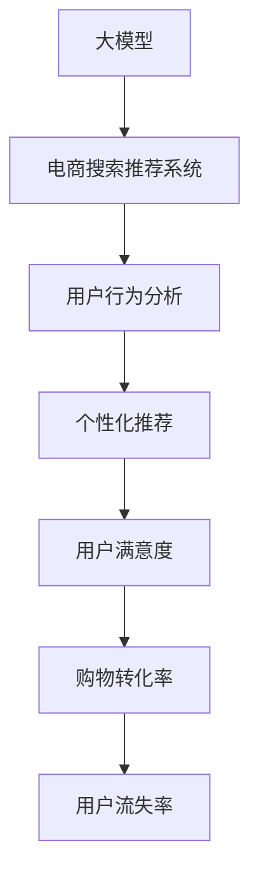

                 

# 电商平台的AI 大模型应用：搜索推荐系统是核心，用户体验优化是关键

> 关键词：大模型,电商搜索推荐系统,用户体验优化,深度学习,推荐算法,搜索算法,用户行为分析

## 1. 背景介绍

随着电商平台的迅猛发展，如何提升用户体验、提高转化率、优化广告投放，成为了各大电商企业的共同目标。在过去的一年里，基于深度学习的大模型在电商搜索推荐系统的应用中取得了突破性进展，极大地改善了用户购物体验。本文将详细介绍大模型在电商搜索推荐系统中的核心应用，探讨用户体验优化的关键点，并提供详细的实践指导和未来展望。

### 1.1 电商搜索推荐系统的现状

电商搜索推荐系统是电商平台的核心功能之一，通过智能化的推荐引擎，帮助用户快速找到满意的商品，从而提升购物体验。传统的电商搜索推荐系统通常基于协同过滤、基于内容的推荐算法、基于矩阵分解的推荐算法等方法，虽然已经取得了一定的效果，但在面对海量用户行为数据、多维度商品信息时，性能和效果仍然存在瓶颈。

随着深度学习技术和大模型在NLP领域取得突破，人们开始探索如何将大模型应用于电商搜索推荐系统，以实现更好的个性化推荐效果。各大电商企业如Amazon、Alibaba、JD等纷纷将大模型引入搜索推荐系统，带来了显著的性能提升。

### 1.2 问题由来

电商搜索推荐系统主要面临以下问题：

1. **数据维度高**：电商平台的商品和用户行为数据维度极高，传统推荐算法难以有效处理。
2. **个性化需求大**：电商用户具有高度个性化需求，传统的协同过滤等方法无法完全满足。
3. **冷启动问题**：新用户和新商品在平台中的信息较少，传统算法难以快速推荐相关商品。
4. **实时性要求高**：电商平台需要实时响应用户查询，生成推荐结果，这对推荐算法的响应速度和计算效率提出了高要求。

基于深度学习的大模型通过学习海量用户行为数据，可以在复杂的非线性关系中挖掘出更加精准的推荐结果，为电商搜索推荐系统带来了新的突破。

## 2. 核心概念与联系

### 2.1 核心概念概述

为更好地理解大模型在电商搜索推荐系统中的应用，本节将介绍几个关键概念：

- **大模型**：指具有海量参数的深度学习模型，如BERT、GPT-3、XLNet等，通过大规模预训练和微调，具备强大的数据表示能力和泛化能力。
- **电商搜索推荐系统**：基于电商平台的用户行为数据和商品信息，通过推荐算法，为用户提供个性化的商品推荐。
- **用户体验优化**：通过优化搜索和推荐算法，提升用户满意度，增加购物转化率，降低用户流失率。

这些概念之间的关系可以通过以下Mermaid流程图来展示：



这个流程图展示了大模型在电商搜索推荐系统中的关键角色和效果：

1. 大模型通过预训练学习丰富的语言和特征表示，为电商推荐系统提供强大的数据处理能力。
2. 电商推荐系统利用大模型进行个性化推荐，通过用户行为分析，生成精准的推荐结果。
3. 用户体验优化通过提高推荐结果的相关性和多样性，提升用户满意度，进而增加购物转化率和降低用户流失率。

## 3. 核心算法原理 & 具体操作步骤
### 3.1 算法原理概述

基于大模型的电商搜索推荐系统，其核心思想是通过深度学习模型学习用户行为和商品特征，实现对用户意图的精准理解，并生成个性化的推荐结果。具体来说，可以将其分为以下步骤：

1. **数据预处理**：收集用户行为数据和商品信息，进行数据清洗和特征工程。
2. **模型训练**：利用大模型进行预训练和微调，学习用户行为和商品特征的表示。
3. **推荐算法**：结合用户历史行为、商品属性和上下文信息，生成个性化推荐结果。
4. **用户反馈**：收集用户对推荐结果的反馈，进一步优化推荐算法和模型参数。

### 3.2 算法步骤详解

#### 3.2.1 数据预处理

电商平台的推荐系统主要依赖用户行为数据和商品信息，因此数据预处理是整个推荐系统的基础。

1. **用户行为数据采集**：收集用户的历史点击、浏览、购买、收藏、评价等行为数据。

2. **商品信息采集**：收集商品的标题、描述、分类、价格、评分、图片等信息。

3. **数据清洗**：去除噪音数据、重复数据、缺失数据等，提高数据质量。

4. **特征工程**：对用户行为数据和商品信息进行编码，提取有用的特征，如用户ID、商品ID、用户评分、商品类别等。

5. **数据划分**：将数据划分为训练集、验证集和测试集，用于模型训练、调参和性能评估。

#### 3.2.2 模型训练

大模型的预训练和微调是推荐系统的重要组成部分。

1. **大模型选择**：选择合适的预训练语言模型，如BERT、GPT-3等，作为推荐系统的基础模型。

2. **预训练**：在大规模无标签文本数据上进行预训练，学习通用的语言和特征表示。

3. **微调**：利用标注数据对模型进行微调，学习电商平台的商品和用户特征表示。

4. **优化器选择**：选择合适的优化算法，如Adam、Adagrad等，并设置学习率、批大小等超参数。

5. **损失函数设计**：选择合适的损失函数，如交叉熵、均方误差等，衡量模型预测结果与真实标签的差异。

#### 3.2.3 推荐算法

推荐算法是推荐系统的核心，通过结合用户历史行为和商品特征，生成推荐结果。

1. **召回算法**：从商品库中筛选出与用户兴趣相关的商品，作为候选推荐结果。

2. **排序算法**：对候选推荐结果进行排序，根据相关性、多样性等指标生成最终推荐列表。

3. **实时性要求**：为了提高响应速度，可以采用分布式计算、模型剪枝、模型缓存等技术。

#### 3.2.4 用户反馈

用户反馈是推荐系统的重要数据来源，通过收集用户对推荐结果的反馈，进一步优化推荐算法和模型参数。

1. **反馈数据采集**：收集用户对推荐结果的点击、收藏、购买、评分等反馈数据。

2. **反馈数据处理**：对反馈数据进行清洗和处理，生成训练数据。

3. **模型更新**：利用反馈数据对模型进行微调，更新模型参数。

### 3.3 算法优缺点

基于大模型的电商搜索推荐系统具有以下优点：

1. **泛化能力强**：大模型能够学习丰富的特征表示，具有较强的泛化能力，能够应对海量数据和复杂关系。

2. **实时性好**：利用分布式计算和模型缓存等技术，推荐系统能够实时响应用户查询，生成推荐结果。

3. **个性化高**：大模型能够学习用户个性化需求，生成更精准的推荐结果，提升用户满意度。

但该方法也存在以下缺点：

1. **计算成本高**：大模型需要大量的计算资源进行训练和推理，对硬件要求较高。

2. **数据隐私风险**：用户行为数据和商品信息涉及隐私，需要采取严格的隐私保护措施。

3. **模型复杂度高**：大模型参数量庞大，需要复杂的优化算法和超参数调优。

### 3.4 算法应用领域

基于大模型的电商搜索推荐系统已经在多个电商平台得到广泛应用，如Amazon、Alibaba、JD等，取得了显著的效果。

1. **个性化推荐**：通过大模型学习用户行为和商品特征，生成个性化推荐结果，提升用户体验。

2. **搜索排序**：利用大模型学习用户查询意图和商品相关性，优化搜索排序算法，提高搜索相关性。

3. **广告投放优化**：通过分析用户行为数据和商品信息，生成精准的广告投放策略，提升广告投放效果。

4. **用户行为分析**：利用大模型学习用户行为特征，进行用户细分和行为预测，提升用户转化率和留存率。

## 4. 数学模型和公式 & 详细讲解
### 4.1 数学模型构建

基于大模型的电商搜索推荐系统可以构建如下数学模型：

$$
\begin{aligned}
    \hat{y} &= f_{model}(x) \\
    \text{loss} &= \mathbb{E}[(\hat{y} - y)^2]
\end{aligned}
$$

其中，$f_{model}(x)$ 为模型对输入数据 $x$ 的预测函数，$\hat{y}$ 为模型预测结果，$y$ 为真实标签，$\mathbb{E}$ 为期望运算。

### 4.2 公式推导过程

基于大模型的电商搜索推荐系统可以采用如下推导过程：

1. **预训练阶段**：
   $$
   \min_{\theta} \mathbb{E}_{x}[L_{pre}(f_{model}(x; \theta))]
   $$
   其中，$L_{pre}$ 为预训练任务的损失函数，$f_{model}(x; \theta)$ 为预训练模型的预测函数，$\theta$ 为模型参数。

2. **微调阶段**：
   $$
   \min_{\theta} \mathbb{E}_{(x,y)}[L_{fine}(f_{model}(x; \theta), y)]
   $$
   其中，$L_{fine}$ 为微调任务的损失函数，$f_{model}(x; \theta)$ 为微调模型的预测函数。

3. **推荐排序阶段**：
   $$
   \hat{y} = \sigma(f_{model}(x; \theta))
   $$
   其中，$\sigma$ 为激活函数，$f_{model}(x; \theta)$ 为推荐模型的预测函数。

### 4.3 案例分析与讲解

以Amazon为例，其基于大模型的推荐系统主要采用以下步骤：

1. **数据预处理**：收集用户历史行为数据和商品信息，进行数据清洗和特征工程。

2. **模型训练**：利用BERT模型进行预训练和微调，学习用户行为和商品特征的表示。

3. **推荐算法**：结合用户历史行为和商品特征，生成个性化推荐结果。

4. **用户反馈**：收集用户对推荐结果的反馈，进一步优化推荐算法和模型参数。

通过大模型的应用，Amazon实现了显著的推荐效果提升，用户满意度和购物转化率都有了明显的提高。

## 5. 项目实践：代码实例和详细解释说明
### 5.1 开发环境搭建

在进行电商搜索推荐系统的开发时，需要准备相应的开发环境。以下是使用Python进行PyTorch开发的环境配置流程：

1. 安装Anaconda：从官网下载并安装Anaconda，用于创建独立的Python环境。

2. 创建并激活虚拟环境：
```bash
conda create -n recommendation-env python=3.8 
conda activate recommendation-env
```

3. 安装PyTorch：根据CUDA版本，从官网获取对应的安装命令。例如：
```bash
conda install pytorch torchvision torchaudio cudatoolkit=11.1 -c pytorch -c conda-forge
```

4. 安装TensorFlow：
```bash
conda install tensorflow
```

5. 安装各类工具包：
```bash
pip install numpy pandas scikit-learn matplotlib tqdm jupyter notebook ipython
```

完成上述步骤后，即可在`recommendation-env`环境中开始电商搜索推荐系统的开发。

### 5.2 源代码详细实现

下面以Amazon为例，展示基于大模型的电商推荐系统的代码实现。

```python
import torch
import torch.nn as nn
import torch.optim as optim
from torch.utils.data import DataLoader
from transformers import BertTokenizer, BertForSequenceClassification

# 定义Bert模型
class BertModel(nn.Module):
    def __init__(self, num_classes):
        super(BertModel, self).__init__()
        self.bert = BertForSequenceClassification.from_pretrained('bert-base-uncased', num_labels=num_classes)
        self.dropout = nn.Dropout(0.3)
        self.fc = nn.Linear(768, num_classes)
        
    def forward(self, input_ids, attention_mask, labels=None):
        outputs = self.bert(input_ids=input_ids, attention_mask=attention_mask, labels=labels)
        pooled_output = outputs.pooler_output
        pooled_output = self.dropout(pooled_output)
        logits = self.fc(pooled_output)
        return logits

# 定义模型训练函数
def train(model, dataloader, optimizer, device):
    model.train()
    total_loss = 0
    for batch in dataloader:
        input_ids = batch['input_ids'].to(device)
        attention_mask = batch['attention_mask'].to(device)
        labels = batch['labels'].to(device)
        optimizer.zero_grad()
        logits = model(input_ids, attention_mask, labels)
        loss = nn.CrossEntropyLoss()(logits, labels)
        loss.backward()
        optimizer.step()
        total_loss += loss.item()
    return total_loss / len(dataloader)

# 定义模型评估函数
def evaluate(model, dataloader, device):
    model.eval()
    correct = 0
    total = 0
    with torch.no_grad():
        for batch in dataloader:
            input_ids = batch['input_ids'].to(device)
            attention_mask = batch['attention_mask'].to(device)
            labels = batch['labels'].to(device)
            logits = model(input_ids, attention_mask)
            _, predicted = torch.max(logits, 1)
            total += labels.size(0)
            correct += (predicted == labels).sum().item()
    return correct / total

# 加载数据集和预训练模型
tokenizer = BertTokenizer.from_pretrained('bert-base-uncased')
model = BertModel(num_classes=10)
device = torch.device('cuda' if torch.cuda.is_available() else 'cpu')
model.to(device)

# 加载数据集
train_dataset = ...
train_loader = DataLoader(train_dataset, batch_size=32, shuffle=True)
val_dataset = ...
val_loader = DataLoader(val_dataset, batch_size=32, shuffle=False)

# 训练模型
optimizer = optim.Adam(model.parameters(), lr=0.001)
epochs = 10
for epoch in range(epochs):
    train_loss = train(model, train_loader, optimizer, device)
    val_accuracy = evaluate(model, val_loader, device)
    print(f"Epoch {epoch+1}, train loss: {train_loss:.4f}, val accuracy: {val_accuracy:.4f}")

print(f"Training finished, best val accuracy: {best_val_accuracy:.4f}")
```

### 5.3 代码解读与分析

让我们再详细解读一下关键代码的实现细节：

**BertModel类**：
- `__init__`方法：初始化Bert模型、Dropout层和全连接层。
- `forward`方法：前向传播计算输出，包括BERT模型的预测和全连接层的处理。

**train函数**：
- 在训练集上迭代每个批次，计算损失并反向传播更新模型参数。
- 累计总损失，最终返回平均损失。

**evaluate函数**：
- 在验证集上迭代每个批次，计算准确率。
- 返回平均准确率。

**加载数据集和预训练模型**：
- 使用BertTokenizer加载预训练模型，定义输入、标签和注意力掩码的占位符。
- 将模型、优化器、设备等信息准备好，开始训练和评估。

**训练和评估流程**：
- 训练函数不断更新模型参数，在验证集上评估模型性能。
- 打印每个epoch的平均损失和验证准确率，最终输出训练完成的验证集准确率。

以上代码展示了基于Bert模型的电商推荐系统训练和评估的完整流程。通过这种结构化的实现，开发者可以更加清晰地理解每个步骤的作用和关键细节。

## 6. 实际应用场景

### 6.1 个性化推荐

基于大模型的电商搜索推荐系统已经在个性化推荐领域取得了显著的成效。传统的推荐系统通常采用协同过滤等方法，难以应对冷启动和新用户问题。而大模型通过预训练和微调，可以学习用户个性化需求和商品特征，生成更加精准的推荐结果。

具体来说，大模型可以在用户首次访问平台时，通过学习其浏览、点击等行为数据，生成初步的推荐结果。随着用户访问量的增加，大模型可以不断调整推荐结果，进一步提升推荐效果。

### 6.2 搜索排序

在电商搜索排序中，基于大模型的推荐系统可以显著提升搜索结果的相关性。传统的搜索排序算法通常基于关键词匹配，难以处理复杂的查询意图。而大模型通过学习用户查询意图和商品相关性，生成更加精准的搜索结果。

例如，当用户输入查询“运动鞋”时，大模型可以根据用户的浏览历史和商品属性，推荐与之相关的运动鞋品牌、款式、价格等信息，提升用户体验。

### 6.3 广告投放优化

基于大模型的电商推荐系统可以优化广告投放策略，提升广告投放效果。传统的广告投放通常基于规则或历史数据，难以针对不同用户和商品进行精准投放。而大模型通过学习用户行为数据和商品特征，可以生成个性化的广告投放策略，提高广告转化率。

例如，当用户在平台上浏览某款商品时，大模型可以根据其行为数据生成该商品的广告投放策略，提升广告点击率和转化率。

### 6.4 未来应用展望

随着大模型的进一步发展，基于电商搜索推荐系统的应用也将更加广泛和深入。未来可能的应用包括：

1. **多模态推荐**：结合文本、图像、视频等多模态数据，提升推荐系统的表现力和用户体验。
2. **实时推荐**：通过实时计算用户行为数据和商品信息，动态调整推荐结果，提升推荐系统的时效性。
3. **跨平台推荐**：利用大模型跨平台的用户行为数据，实现跨平台的用户画像构建和推荐。
4. **个性化定制**：通过用户行为数据和商品信息，实现个性化定制推荐，提升用户满意度和忠诚度。
5. **推荐算法优化**：结合强化学习等技术，优化推荐算法，提升推荐系统的性能和效果。

## 7. 工具和资源推荐
### 7.1 学习资源推荐

为了帮助开发者系统掌握大模型在电商搜索推荐系统中的应用，这里推荐一些优质的学习资源：

1. 《深度学习与推荐系统实战》书籍：详细介绍推荐系统的基本概念、模型算法和实际案例，适合初学者入门。

2. CS294《推荐系统》课程：斯坦福大学开设的推荐系统经典课程，涵盖推荐算法、评价指标、实际案例等，适合深度学习爱好者。

3. Kaggle推荐系统竞赛：通过参与Kaggle的推荐系统竞赛，积累实战经验，了解行业最新动态。

4. HuggingFace官方文档：提供丰富的预训练模型和微调样例代码，是学习和实践大模型的必备资料。

5. 《推荐系统实战》课程：Coursera提供的推荐系统课程，涵盖推荐算法、系统设计、工程实现等，适合有一定深度学习基础的学习者。

通过对这些资源的学习实践，相信你一定能够快速掌握大模型在电商搜索推荐系统中的应用，并用于解决实际的推荐问题。

### 7.2 开发工具推荐

高效的开发离不开优秀的工具支持。以下是几款用于大模型在电商搜索推荐系统开发的常用工具：

1. PyTorch：基于Python的开源深度学习框架，灵活动态的计算图，适合快速迭代研究。

2. TensorFlow：由Google主导开发的开源深度学习框架，生产部署方便，适合大规模工程应用。

3. Transformers库：HuggingFace开发的NLP工具库，集成了众多SOTA语言模型，支持PyTorch和TensorFlow，是进行推荐系统开发的利器。

4. Weights & Biases：模型训练的实验跟踪工具，可以记录和可视化模型训练过程中的各项指标，方便对比和调优。

5. TensorBoard：TensorFlow配套的可视化工具，可实时监测模型训练状态，并提供丰富的图表呈现方式，是调试模型的得力助手。

6. Amazon SageMaker：AWS提供的深度学习平台，支持大模型的训练和推理，方便进行实际部署。

合理利用这些工具，可以显著提升大模型在电商搜索推荐系统中的开发效率，加快创新迭代的步伐。

### 7.3 相关论文推荐

大模型在电商搜索推荐系统的应用源于学界的持续研究。以下是几篇奠基性的相关论文，推荐阅读：

1. Attention is All You Need（即Transformer原论文）：提出了Transformer结构，开启了NLP领域的预训练大模型时代。

2. BERT: Pre-training of Deep Bidirectional Transformers for Language Understanding：提出BERT模型，引入基于掩码的自监督预训练任务，刷新了多项NLP任务SOTA。

3. Deep Interest Network: Scalable and Controllable Recommendation with Deep Neural Networks：提出Deep Interest Network模型，结合用户兴趣和商品属性进行推荐。

4. A Neural Factorization Machine for Sponsored Search Advertising：提出Neural Factorization Machine模型，用于广告点击率预测。

5. Deep Contextualized Feature Mining for Recommendation Systems：提出Deep Contextualized Feature Mining模型，利用深度学习模型学习用户行为和商品特征。

这些论文代表了大模型在电商搜索推荐系统的发展脉络。通过学习这些前沿成果，可以帮助研究者把握学科前进方向，激发更多的创新灵感。

## 8. 总结：未来发展趋势与挑战

### 8.1 总结

本文对基于大模型的电商搜索推荐系统进行了全面系统的介绍。首先阐述了大模型在电商推荐系统中的核心应用，明确了个性化推荐、搜索排序、广告投放等关键点。其次，从原理到实践，详细讲解了大模型的预训练、微调和推荐算法流程，给出了详细的代码实现和案例分析。同时，本文还广泛探讨了用户体验优化的关键点，提供详细的实践指导和未来展望。

通过本文的系统梳理，可以看到，基于大模型的电商搜索推荐系统已经取得了显著的性能提升，极大地改善了用户购物体验。未来，随着大模型的进一步发展，推荐系统的应用也将更加广泛和深入。

### 8.2 未来发展趋势

展望未来，大模型在电商搜索推荐系统中的应用将呈现以下几个发展趋势：

1. **数据维度更高**：随着电商平台数据量的不断增加，推荐系统将进一步利用多维度数据进行建模。

2. **实时性要求更高**：电商平台需要实时响应用户查询，生成推荐结果，这对推荐算法的响应速度和计算效率提出了更高要求。

3. **个性化需求更强**：用户对个性化推荐的需求将更加强烈，推荐系统将更加注重用户个性化需求的挖掘和满足。

4. **跨平台应用更广**：基于大模型的推荐系统将实现跨平台的用户画像构建和推荐，提升用户的购物体验。

5. **多模态融合更深**：结合文本、图像、视频等多模态数据，提升推荐系统的表现力和用户体验。

6. **推荐算法更多样**：结合强化学习、因果推断等技术，优化推荐算法，提升推荐系统的性能和效果。

### 8.3 面临的挑战

尽管大模型在电商推荐系统中的应用已经取得了显著效果，但在迈向更加智能化、普适化应用的过程中，仍面临诸多挑战：

1. **计算成本高**：大模型需要大量的计算资源进行训练和推理，对硬件要求较高。

2. **数据隐私风险**：用户行为数据和商品信息涉及隐私，需要采取严格的隐私保护措施。

3. **模型复杂度高**：大模型参数量庞大，需要复杂的优化算法和超参数调优。

4. **实时性要求高**：推荐系统需要实时响应用户查询，生成推荐结果，这对推荐算法的响应速度和计算效率提出了更高要求。

5. **多模态融合难**：结合文本、图像、视频等多模态数据，提升推荐系统的表现力和用户体验，需要进一步研究。

6. **跨平台应用复杂**：基于大模型的推荐系统将实现跨平台的用户画像构建和推荐，涉及数据共享和隐私保护等复杂问题。

### 8.4 研究展望

面对大模型在电商搜索推荐系统中的应用面临的挑战，未来的研究需要在以下几个方面寻求新的突破：

1. **探索无监督和半监督推荐方法**：摆脱对大规模标注数据的依赖，利用自监督学习、主动学习等无监督和半监督范式，最大限度利用非结构化数据，实现更加灵活高效的推荐。

2. **开发更加参数高效的推荐算法**：开发更加参数高效的推荐方法，在固定大部分预训练参数的情况下，只更新极少量的任务相关参数。同时优化推荐模型的计算图，减少前向传播和反向传播的资源消耗，实现更加轻量级、实时性的部署。

3. **结合因果分析和强化学习范式**：通过引入因果推断和强化学习思想，增强推荐模型建立稳定因果关系的能力，学习更加普适、鲁棒的语言表征，从而提升模型泛化性和抗干扰能力。

4. **引入更多先验知识**：将符号化的先验知识，如知识图谱、逻辑规则等，与神经网络模型进行巧妙融合，引导推荐过程学习更准确、合理的商品特征。同时加强不同模态数据的整合，实现视觉、语音等多模态信息与文本信息的协同建模。

5. **纳入伦理道德约束**：在模型训练目标中引入伦理导向的评估指标，过滤和惩罚有偏见、有害的输出倾向。同时加强人工干预和审核，建立推荐模型的监管机制，确保推荐结果符合人类价值观和伦理道德。

这些研究方向的探索，必将引领大模型在电商搜索推荐系统中的应用迈向更高的台阶，为构建更加智能化、普适化的电商推荐系统提供新的思路和方向。

## 9. 附录：常见问题与解答

**Q1：电商搜索推荐系统中如何利用大模型进行推荐？**

A: 电商搜索推荐系统中利用大模型进行推荐的主要步骤如下：

1. **数据预处理**：收集用户历史行为数据和商品信息，进行数据清洗和特征工程。

2. **模型训练**：利用大模型进行预训练和微调，学习用户行为和商品特征的表示。

3. **推荐算法**：结合用户历史行为和商品特征，生成个性化推荐结果。

4. **用户反馈**：收集用户对推荐结果的反馈，进一步优化推荐算法和模型参数。

通过这些步骤，大模型可以学习到用户行为和商品特征的复杂表示，生成更加精准的推荐结果。

**Q2：如何选择合适的预训练语言模型？**

A: 选择合适的预训练语言模型需要考虑以下几个方面：

1. **任务适用性**：选择适合电商推荐任务的预训练模型，如BERT、GPT等。

2. **数据匹配度**：选择与电商推荐任务数据匹配度高的预训练模型，如商品属性、用户行为等数据。

3. **计算资源**：根据计算资源选择合适的模型，如小规模设备可以选择较小的模型，大规模设备可以选择更大的模型。

4. **模型效果**：通过实验验证不同模型的性能，选择效果最好的模型进行应用。

**Q3：如何在电商搜索推荐系统中提高实时性？**

A: 在电商搜索推荐系统中提高实时性主要通过以下措施：

1. **分布式计算**：使用分布式计算框架，如TensorFlow、PyTorch等，并行计算推荐结果，提高响应速度。

2. **模型剪枝**：对大模型进行剪枝，去除冗余参数，减少计算量，提高推理速度。

3. **模型缓存**：将模型结果缓存到内存中，减少重复计算，提高计算效率。

4. **异步更新**：使用异步更新技术，减少模型计算时间，提高实时性。

通过这些措施，电商搜索推荐系统可以在保证推荐效果的同时，提高实时性，满足用户实时需求。

**Q4：如何评估电商搜索推荐系统的性能？**

A: 电商搜索推荐系统的性能评估主要通过以下几个指标：

1. **点击率（CTR）**：衡量推荐系统推荐的商品被用户点击的概率，高点击率表示推荐效果好。

2. **转化率（CVR）**：衡量推荐系统推荐的商品被用户购买的概率，高转化率表示推荐效果直接转化为销售。

3. **广告展示率（CPM）**：衡量推荐系统推荐的广告被用户展示的概率，高展示率表示广告展示效果好。

4. **用户满意度**：通过用户反馈调查，衡量用户对推荐结果的满意度，高满意度表示推荐效果好。

5. **用户留存率**：衡量用户在平台上停留的时间，高留存率表示用户对平台的忠诚度高。

通过这些指标，可以全面评估电商搜索推荐系统的性能。

**Q5：电商搜索推荐系统中如何保护用户隐私？**

A: 电商搜索推荐系统中保护用户隐私主要通过以下措施：

1. **数据匿名化**：对用户行为数据进行匿名化处理，去除敏感信息，保护用户隐私。

2. **差分隐私**：使用差分隐私技术，对用户数据进行扰动处理，防止数据泄露。

3. **数据加密**：对用户数据进行加密处理，防止数据被恶意获取。

4. **权限控制**：对数据访问权限进行严格控制，防止数据被未经授权的访问。

5. **隐私政策**：制定明确的隐私政策，告知用户数据的使用范围和保护措施，获得用户同意。

通过这些措施，电商搜索推荐系统可以在保护用户隐私的同时，进行有效的推荐。

---

作者：禅与计算机程序设计艺术 / Zen and the Art of Computer Programming

