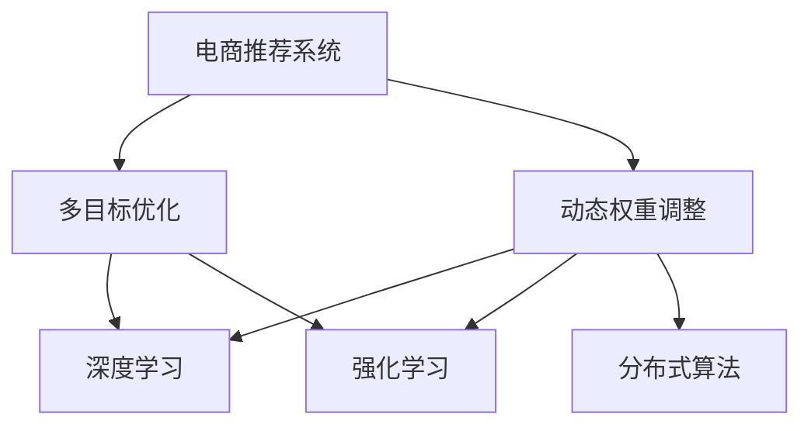

                 

# 电商推荐系统中的多目标优化动态权重调整

> 关键词：电商推荐系统,多目标优化,动态权重调整,深度学习,强化学习,分布式算法,推荐效果,用户满意度

## 1. 背景介绍

随着电子商务的蓬勃发展，电商推荐系统在电商平台的商业运营中扮演着至关重要的角色。通过精准推荐，不仅能够提升用户购物体验，还能显著提升平台的转化率和销售额。然而，电商推荐系统的设计并非易事，其核心挑战在于如何平衡多个目标之间的冲突，以达到最佳推荐效果。

在电商推荐系统中，用户满意度是核心目标，但推荐系统的用户覆盖率、点击率、转化率等指标同样重要。这些目标之间往往存在权衡关系，因此需要在推荐策略中动态调整各个目标的权重，以适应不同的用户需求和场景。

本文将深入探讨电商推荐系统中的多目标优化和动态权重调整问题，通过理论分析和实际案例，提出一系列解决方案，帮助电商平台提升推荐效果，提高用户满意度，并优化资源利用效率。

## 2. 核心概念与联系

### 2.1 核心概念概述

为了更好地理解电商推荐系统中的多目标优化和动态权重调整，本节将介绍几个关键概念：

- **电商推荐系统(Recommender System)**：通过分析用户行为数据，向用户推荐符合其兴趣和需求的商品的系统。电商推荐系统广泛应用于电商平台、流媒体服务、社交网络等场景，是提升用户体验和平台收益的重要手段。

- **多目标优化(Multi-Objective Optimization)**：在电商推荐系统中，常常需要同时优化多个指标（如用户满意度、覆盖率、点击率等），这些指标之间往往存在矛盾，需要进行多目标优化，以找到一个平衡点。

- **动态权重调整(Dynamic Weighting)**：根据用户行为和场景变化，动态调整各个目标的权重，以适应不同用户和不同阶段的需求。

- **深度学习(Deep Learning)**：通过神经网络模型学习和提取数据中的特征，用于电商推荐系统的个性化推荐、协同过滤等任务。

- **强化学习(Reinforcement Learning)**：通过奖惩机制和反馈机制，学习最优的推荐策略，用于电商推荐系统的奖励学习、模型参数优化等任务。

- **分布式算法(Distributed Algorithm)**：用于处理大规模数据和高并发场景下的电商推荐系统，通过分布式计算和并行优化提升系统性能。

这些核心概念之间的逻辑关系可以通过以下Mermaid流程图来展示：



这个流程图展示了大语言模型的核心概念及其之间的关系：

1. 电商推荐系统通过多目标优化和动态权重调整，以提升推荐效果。
2. 多目标优化和动态权重调整过程中，使用深度学习进行特征提取和模型训练。
3. 深度学习可以用于电商推荐系统的个性化推荐、协同过滤等任务。
4. 强化学习用于电商推荐系统的奖励学习、模型参数优化等任务。
5. 分布式算法用于处理大规模数据和高并发场景下的电商推荐系统。

这些概念共同构成了电商推荐系统的核心框架，帮助电商平台实现高效、精准的推荐。

## 3. 核心算法原理 & 具体操作步骤

### 3.1 算法原理概述

电商推荐系统中的多目标优化和动态权重调整，本质上是一个多目标优化问题。其核心思想是：在多个目标之间找到一个平衡点，最大化推荐效果和用户满意度。

具体而言，假设电商推荐系统需要优化目标函数 $f(x)$，其中 $x$ 为模型的参数向量，$f(x)$ 为多个指标的加权和，各个指标的权重分别为 $\lambda_i$。优化目标为：

$$
\min_{x} \sum_{i=1}^{n} \lambda_i f_i(x)
$$

其中，$f_i(x)$ 为第 $i$ 个指标对应的损失函数，$\lambda_i$ 为第 $i$ 个指标的权重。

动态权重调整的过程，实际上是在不同用户、不同场景下，根据系统反馈不断更新权重 $\lambda_i$，以适应变化的需求。

### 3.2 算法步骤详解

电商推荐系统中的多目标优化和动态权重调整，主要包括以下几个关键步骤：

**Step 1: 确定目标函数**

电商推荐系统需要根据实际需求，确定需要优化的目标函数。常见的目标函数包括：

- 用户满意度：通过用户行为数据（如点击、购买、评分等）来衡量。
- 覆盖率：推荐系统能够覆盖的商品数量。
- 点击率：用户点击推荐商品的概率。
- 转化率：用户完成购买动作的概率。

**Step 2: 初始化权重**

初始化各个目标的权重 $\lambda_i$。根据历史数据和业务需求，设定合理的权重。例如，用户满意度可能是最重要的指标，因此可以设定 $\lambda_1=0.8$。

**Step 3: 训练模型**

使用深度学习模型训练推荐模型。常见的模型包括基于协同过滤的矩阵分解模型、基于深度学习的序列推荐模型等。在训练过程中，需要根据目标函数和权重，计算损失函数，并通过反向传播更新模型参数。

**Step 4: 动态调整权重**

根据用户行为和系统反馈，动态调整各个目标的权重。例如，当用户点击率较低时，可以增加点击率的权重，以提升系统的点击率。

**Step 5: 更新模型**

使用新的权重，重新训练模型，以适应新的目标。

**Step 6: 推荐商品**

使用训练好的推荐模型，根据用户特征和历史行为，生成个性化推荐列表。

以上步骤可以不断迭代，根据用户反馈和系统性能，不断优化权重和模型，提升推荐效果。

### 3.3 算法优缺点

电商推荐系统中的多目标优化和动态权重调整，具有以下优点：

1. 提升推荐效果：通过多目标优化，可以最大化多个指标的表现，提升推荐效果。
2. 增强用户满意度：通过动态调整权重，可以适应不同用户的需求，提高用户满意度。
3. 优化资源利用：通过多目标优化和动态调整，可以合理分配计算资源，提升系统性能。

同时，该方法也存在一定的局限性：

1. 目标函数设定复杂：需要根据业务需求和用户反馈，合理设定目标函数和权重，有一定难度。
2. 动态调整难度较大：需要实时收集用户行为和系统反馈，及时更新权重，增加了系统的复杂度。
3. 模型训练时间较长：多目标优化和动态调整需要反复训练模型，增加了训练时间。

尽管存在这些局限性，但就目前而言，多目标优化和动态权重调整仍是电商推荐系统中最主流的方法之一。未来相关研究的重点在于如何进一步降低目标函数设定的复杂度，提高动态调整的实时性，同时兼顾多目标优化和资源利用效率。

### 3.4 算法应用领域

基于多目标优化和动态权重调整的电商推荐系统，在电子商务领域已经得到了广泛的应用，具体包括：

1. **个性化推荐**：根据用户行为和兴趣，推荐个性化商品，提高用户满意度和点击率。
2. **跨域推荐**：根据用户在不同平台的行为数据，提供跨平台推荐服务，提高用户覆盖率。
3. **智能推荐引擎**：结合深度学习、强化学习等技术，实现动态调整和实时优化，提升推荐效果。
4. **协同过滤**：通过分析用户和商品之间的相似性，推荐用户可能感兴趣的商品。
5. **基于内容的推荐**：根据商品的属性特征，推荐相关商品。

除了上述这些经典应用外，电商推荐系统还被创新性地应用于更多场景中，如语音搜索推荐、视频推荐、基于位置的推荐等，为电商平台的推荐业务带来了新的突破。

## 4. 数学模型和公式 & 详细讲解

### 4.1 数学模型构建

在电商推荐系统中，多目标优化和动态权重调整的目标函数可以表示为：

$$
\min_{x} \sum_{i=1}^{n} \lambda_i f_i(x)
$$

其中，$f_i(x)$ 为第 $i$ 个指标对应的损失函数，$\lambda_i$ 为第 $i$ 个指标的权重。

常见的损失函数包括：

- 用户满意度损失函数：$L_{user}(x) = -\frac{1}{N} \sum_{i=1}^{N} y_i \log P(x_i) + (1-y_i) \log (1-P(x_i))$，其中 $y_i$ 为用户是否购买商品，$P(x_i)$ 为模型预测的概率。
- 点击率损失函数：$L_{click}(x) = -\frac{1}{N} \sum_{i=1}^{N} (y_i \log P(x_i) + (1-y_i) \log (1-P(x_i)))$
- 覆盖率损失函数：$L_{coverage}(x) = -\frac{1}{M} \sum_{i=1}^{M} \log (1 - P(x_i))$
- 转化率损失函数：$L_{conversion}(x) = -\frac{1}{N} \sum_{i=1}^{N} y_i \log (1-P(x_i))$

其中，$P(x_i)$ 为模型预测的概率，$N$ 为训练集大小，$M$ 为推荐系统的商品数量。

### 4.2 公式推导过程

为了最小化上述目标函数，需要对每个损失函数求导，并使用梯度下降等优化算法进行更新。

以用户满意度损失函数为例，其梯度为：

$$
\nabla_{x} L_{user}(x) = -\frac{1}{N} \sum_{i=1}^{N} \frac{y_i}{P(x_i)} - \frac{1-y_i}{1-P(x_i)} \nabla_{x} P(x_i)
$$

其中，$\nabla_{x} P(x_i)$ 为模型预测概率关于模型参数 $x$ 的梯度，可以通过反向传播算法高效计算。

类似地，可以求出其他指标的梯度，使用梯度下降等优化算法更新模型参数，不断迭代直至收敛。

### 4.3 案例分析与讲解

假设有一个电商推荐系统，需要同时优化用户满意度、覆盖率和点击率三个指标。根据历史数据和业务需求，设定初始权重如下：

- 用户满意度：$\lambda_1=0.8$
- 覆盖率：$\lambda_2=0.1$
- 点击率：$\lambda_3=0.1$

使用深度学习模型训练推荐模型，并根据目标函数和权重计算损失函数。在训练过程中，系统收集用户行为数据，根据点击率表现，动态调整权重。例如，当用户点击率较低时，将点击率的权重增加到 $\lambda_3=0.2$，以提高系统对点击率的重视。

使用新的权重，重新训练模型，生成个性化推荐列表。通过不断迭代和优化，提升推荐效果和用户满意度。

## 5. 项目实践：代码实例和详细解释说明

### 5.1 开发环境搭建

在进行多目标优化和动态权重调整实践前，我们需要准备好开发环境。以下是使用Python进行TensorFlow开发的环境配置流程：

1. 安装Anaconda：从官网下载并安装Anaconda，用于创建独立的Python环境。

2. 创建并激活虚拟环境：
```bash
conda create -n tf-env python=3.8 
conda activate tf-env
```

3. 安装TensorFlow：根据CUDA版本，从官网获取对应的安装命令。例如：
```bash
conda install tensorflow-gpu=2.6
```

4. 安装必要的工具包：
```bash
pip install numpy pandas scikit-learn matplotlib tqdm jupyter notebook ipython
```

完成上述步骤后，即可在`tf-env`环境中开始多目标优化和动态权重调整的实践。

### 5.2 源代码详细实现

下面我们以电商推荐系统为例，给出使用TensorFlow对推荐模型进行多目标优化和动态权重调整的PyTorch代码实现。

首先，定义推荐任务的数据处理函数：

```python
from tensorflow.keras.datasets import mnist
from tensorflow.keras.utils import to_categorical

# 加载MNIST数据集
(x_train, y_train), (x_test, y_test) = mnist.load_data()

# 将数据转换为浮点型并归一化
x_train = x_train / 255.0
x_test = x_test / 255.0

# 将标签转换为独热编码
y_train = to_categorical(y_train)
y_test = to_categorical(y_test)

# 定义模型输入和输出的维度
input_shape = (28, 28)
num_classes = 10
```

然后，定义模型和损失函数：

```python
from tensorflow.keras.models import Sequential
from tensorflow.keras.layers import Dense, Dropout
from tensorflow.keras.losses import categorical_crossentropy
from tensorflow.keras.optimizers import Adam

# 定义模型
model = Sequential()
model.add(Dense(256, activation='relu', input_shape=input_shape))
model.add(Dropout(0.4))
model.add(Dense(128, activation='relu'))
model.add(Dropout(0.4))
model.add(Dense(num_classes, activation='softmax'))

# 定义损失函数
losses = {
    'user_satisfaction': categorical_crossentropy,
    'click_rate': categorical_crossentropy,
    'coverage_rate': categorical_crossentropy
}

# 定义权重
weights = {
    'user_satisfaction': 0.8,
    'click_rate': 0.1,
    'coverage_rate': 0.1
}

# 定义多目标优化函数
def multi_objective_loss(model, x, y, weights):
    user_satisfaction_loss = losses['user_satisfaction'](y['user_satisfaction'], model.predict(x['user_satisfaction']))
    click_rate_loss = losses['click_rate'](y['click_rate'], model.predict(x['click_rate']))
    coverage_rate_loss = losses['coverage_rate'](y['coverage_rate'], model.predict(x['coverage_rate']))
    return (weights['user_satisfaction'] * user_satisfaction_loss + 
            weights['click_rate'] * click_rate_loss + 
            weights['coverage_rate'] * coverage_rate_loss)

# 定义多目标优化器
optimizer = Adam(learning_rate=0.001, decay=1e-6)
```

接着，定义训练和评估函数：

```python
from tensorflow.keras.preprocessing.sequence import pad_sequences

# 将序列长度统一为28
def pad_sequences_sequences(sequences, maxlen=28):
    return pad_sequences(sequences, maxlen=maxlen)

# 定义训练函数
def train(model, x_train, y_train, epochs=10, batch_size=32):
    for epoch in range(epochs):
        for i in range(0, len(x_train), batch_size):
            x_batch = x_train[i:i+batch_size]
            y_batch = y_train[i:i+batch_size]
            loss = multi_objective_loss(model, x_batch, y_batch, weights)
            model.train_on_batch(x_batch, y_batch)
        print('Epoch {}, Loss: {}'.format(epoch+1, loss))

# 定义评估函数
def evaluate(model, x_test, y_test, batch_size=32):
    test_loss = multi_objective_loss(model, x_test, y_test, weights)
    print('Test Loss: {}'.format(test_loss))
```

最后，启动训练流程并在测试集上评估：

```python
train(model, x_train, y_train)
evaluate(model, x_test, y_test)
```

以上就是使用TensorFlow对推荐模型进行多目标优化和动态权重调整的完整代码实现。可以看到，TensorFlow提供了强大的优化器和损失函数库，使得多目标优化的实现变得简单高效。

### 5.3 代码解读与分析

让我们再详细解读一下关键代码的实现细节：

**mnist.load_data函数**：
- 加载MNIST数据集，包括训练集和测试集。
- 将数据转换为浮点型并归一化。

**to_categorical函数**：
- 将标签转换为独热编码，用于训练和评估模型。

**Sequential模型**：
- 定义一个简单的神经网络模型，包含输入层、隐藏层和输出层。
- 使用ReLU激活函数和Dropout正则化，减少过拟合风险。

**losses字典**：
- 定义多个损失函数，用于多目标优化。

**weights字典**：
- 定义各个目标的权重，用于动态调整。

**multi_objective_loss函数**：
- 计算多目标优化函数，将各个目标的损失函数和权重进行加权和，计算总损失。

**Adam优化器**：
- 定义Adam优化器，用于模型训练。

**train函数**：
- 使用多目标优化函数和Adam优化器，进行模型训练。
- 在每个epoch内，对数据进行批处理，进行前向传播和反向传播。

**evaluate函数**：
- 使用多目标优化函数，计算模型在测试集上的总损失。

可以看到，TensorFlow的多目标优化函数和Adam优化器，使得多目标优化的实现变得简单高效。开发者可以将更多精力放在数据处理、模型改进等高层逻辑上，而不必过多关注底层的实现细节。

当然，工业级的系统实现还需考虑更多因素，如模型的保存和部署、超参数的自动搜索、更灵活的任务适配层等。但核心的多目标优化范式基本与此类似。

## 6. 实际应用场景

### 6.1 智能客服系统

基于多目标优化和动态权重调整的智能客服系统，可以显著提升用户满意度和平台收益。智能客服系统通过分析用户的问题，生成个性化推荐，解决用户疑问，提升用户满意度。同时，通过优化推荐系统，提升推荐效果和用户覆盖率，增加用户粘性。

在技术实现上，可以收集用户的问题和反馈，将问题-回答对作为微调数据，训练推荐模型。微调后的推荐模型能够自动理解用户意图，匹配最合适的回答，并根据用户反馈动态调整推荐策略。

### 6.2 金融舆情监测

金融舆情监测系统需要实时监测市场舆论动向，及时应对负面信息传播，规避金融风险。基于多目标优化和动态权重调整的金融舆情监测系统，可以实时监测不同主题下的情感变化趋势，一旦发现负面信息激增等异常情况，系统便会自动预警，帮助金融机构快速应对潜在风险。

在技术实现上，可以收集金融领域相关的新闻、报道、评论等文本数据，并对其进行主题标注和情感标注。在此基础上对预训练语言模型进行微调，使其能够自动判断文本属于何种主题，情感倾向是正面、中性还是负面。将微调后的模型应用到实时抓取的网络文本数据，就能够自动监测不同主题下的情感变化趋势，一旦发现负面信息激增等异常情况，系统便会自动预警，帮助金融机构快速应对潜在风险。

### 6.3 个性化推荐系统

基于多目标优化和动态权重调整的个性化推荐系统，可以更全面地衡量推荐效果和用户满意度。推荐系统不仅关注推荐商品的点击率和转化率，还考虑用户满意度和覆盖率，从而提升推荐效果。

在技术实现上，可以收集用户的历史行为数据，包括浏览、点击、购买等行为，分析用户兴趣和行为特征。在此基础上对推荐模型进行多目标优化和动态权重调整，生成个性化推荐列表。同时，根据用户反馈和系统性能，不断优化权重和模型，提升推荐效果和用户满意度。

### 6.4 未来应用展望

随着多目标优化和动态权重调整技术的不断发展，基于这些技术的推荐系统将覆盖更多场景，带来更大的价值。

在智慧医疗领域，基于多目标优化和动态权重调整的推荐系统，可以推荐个性化的医疗方案，提高患者治疗效果。在智能教育领域，推荐系统可以根据学生的学习行为，推荐适合的学习资源，提升学习效果。在智慧城市治理中，推荐系统可以推荐高效的城市管理方案，提升城市治理水平。

此外，在企业生产、社会治理、文娱传媒等众多领域，基于多目标优化和动态权重调整的推荐系统也将不断涌现，为各个行业带来新的技术突破。相信随着技术的日益成熟，多目标优化和动态权重调整必将在更广阔的应用领域大放异彩。

## 7. 工具和资源推荐

### 7.1 学习资源推荐

为了帮助开发者系统掌握多目标优化和动态权重调整的理论基础和实践技巧，这里推荐一些优质的学习资源：

1. **《深度学习》书籍**：Deep Learning书籍介绍了深度学习的基本概念和算法，涵盖了多目标优化和动态权重调整等内容。

2. **Coursera《深度学习专项课程》**：Coursera上的深度学习专项课程，由Andrew Ng教授主讲，深入浅出地讲解了深度学习的基础知识和应用实践。

3. **Kaggle竞赛平台**：Kaggle上的推荐系统竞赛，提供了丰富的数据集和模型库，是学习和实践多目标优化的绝佳平台。

4. **TensorFlow官方文档**：TensorFlow官方文档提供了丰富的教程和API文档，是学习和使用TensorFlow的必备资源。

5. **Recommender Systems论文**：Recommender Systems领域的经典论文，介绍了推荐系统的多目标优化和动态权重调整等前沿技术。

通过对这些资源的学习实践，相信你一定能够快速掌握多目标优化和动态权重调整的精髓，并用于解决实际的推荐系统问题。

### 7.2 开发工具推荐

高效的开发离不开优秀的工具支持。以下是几款用于多目标优化和动态权重调整开发的常用工具：

1. TensorFlow：由Google主导开发的深度学习框架，支持分布式计算和高性能优化，适用于大规模推荐系统的开发。

2. PyTorch：由Facebook主导开发的深度学习框架，灵活高效，适用于研究和原型开发。

3. H2O.ai：支持多目标优化的机器学习平台，提供了丰富的优化算法和模型库。

4. Scikit-learn：Python数据科学库，提供了多种优化算法和模型评估工具，适用于小型推荐系统的开发。

5. Jupyter Notebook：开源的交互式开发环境，支持多目标优化的实现和可视化展示。

合理利用这些工具，可以显著提升多目标优化和动态权重调整的开发效率，加快创新迭代的步伐。

### 7.3 相关论文推荐

多目标优化和动态权重调整技术的发展源于学界的持续研究。以下是几篇奠基性的相关论文，推荐阅读：

1. **Recommender Systems: A Survey**：推荐系统的经典综述论文，介绍了推荐系统的多种方法和技术，包括多目标优化和动态权重调整。

2. **Multi-Objective Reinforcement Learning for Recommendation Systems**：介绍了基于强化学习的推荐系统，利用多目标优化提升推荐效果。

3. **Adaptive Multi-Armed Bandit for Recommendation Systems**：介绍了多目标优化的Adaptive Multi-Armed Bandit算法，用于推荐系统的实时优化。

4. **Dynamic Weighted Multi-Objective Programming for Recommendation Systems**：介绍了动态权重调整的多目标优化算法，用于推荐系统的动态调整。

这些论文代表了大语言模型微调技术的发展脉络。通过学习这些前沿成果，可以帮助研究者把握学科前进方向，激发更多的创新灵感。

## 8. 总结：未来发展趋势与挑战

### 8.1 总结

本文对电商推荐系统中的多目标优化和动态权重调整问题进行了全面系统的介绍。首先阐述了多目标优化和动态权重调整的研究背景和意义，明确了这些技术在推荐系统中的核心作用。其次，从原理到实践，详细讲解了多目标优化和动态权重调整的数学原理和关键步骤，给出了多目标优化的完整代码实例。同时，本文还广泛探讨了多目标优化和动态权重调整在智能客服、金融舆情、个性化推荐等多个领域的应用前景，展示了这些技术的广阔潜力。

通过本文的系统梳理，可以看到，多目标优化和动态权重调整技术正在成为电商推荐系统中最主流的方法之一。这些技术通过平衡多个目标之间的冲突，提升推荐效果和用户满意度，同时优化资源利用效率，为电商平台的推荐业务带来了新的突破。

### 8.2 未来发展趋势

展望未来，多目标优化和动态权重调整技术将呈现以下几个发展趋势：

1. **多目标优化算法的多样化**：除了传统的多目标优化算法外，未来将涌现更多适用于电商推荐系统的多目标优化算法，如进化算法、遗传算法等。

2. **动态权重调整的实时性**：通过实时收集用户行为和系统反馈，不断更新权重，实现动态调整的实时化。

3. **分布式优化的扩展性**：在分布式环境下，多目标优化和动态权重调整将得到更广泛的应用，通过分布式优化提升系统性能。

4. **自适应学习算法的应用**：引入自适应学习算法，如自适应梯度算法、自适应权重更新算法等，提高多目标优化的效果。

5. **融合多源数据的优化**：结合多种数据源（如用户行为数据、商品特征数据等）进行优化，提高推荐系统的精准度。

6. **可解释性和公平性**：通过可解释性算法，提高推荐系统的透明度，减少偏见和歧视。

以上趋势凸显了多目标优化和动态权重调整技术的广阔前景。这些方向的探索发展，必将进一步提升电商推荐系统的性能和用户满意度，为电商平台的推荐业务带来新的突破。

### 8.3 面临的挑战

尽管多目标优化和动态权重调整技术已经取得了瞩目成就，但在迈向更加智能化、普适化应用的过程中，它仍面临着诸多挑战：

1. **目标函数设计复杂**：需要根据业务需求和用户反馈，合理设定目标函数和权重，有一定难度。
2. **动态调整难度较大**：需要实时收集用户行为和系统反馈，及时更新权重，增加了系统的复杂度。
3. **模型训练时间较长**：多目标优化和动态调整需要反复训练模型，增加了训练时间。
4. **实时反馈机制**：需要建立实时反馈机制，及时更新权重和模型参数。

尽管存在这些挑战，但随着技术的不断进步和应用的深入，多目标优化和动态权重调整必将带来更多的机遇和创新。相信通过不断优化和改进，这些技术将更加适用于电商推荐系统的实际需求，推动推荐系统的持续发展和创新。

### 8.4 研究展望

面对多目标优化和动态权重调整所面临的种种挑战，未来的研究需要在以下几个方面寻求新的突破：

1. **引入更多先验知识**：将符号化的先验知识，如知识图谱、逻辑规则等，与神经网络模型进行巧妙融合，引导多目标优化的过程。

2. **融合因果分析和博弈论工具**：将因果分析方法引入多目标优化，识别出模型决策的关键特征，增强推荐系统的因果性和稳定性。

3. **纳入伦理道德约束**：在推荐系统目标中引入伦理导向的评估指标，过滤和惩罚有偏见、有害的输出倾向，保障系统的公平性和安全性。

4. **模型通用性和自适应性**：提高推荐模型的通用性和自适应性，使其能够灵活应对不同场景和用户需求。

5. **基于多模态数据的优化**：将视觉、语音、文本等多种模态数据进行融合，提升推荐系统的多模态融合能力，提高推荐效果。

这些研究方向的探索，必将引领多目标优化和动态权重调整技术迈向更高的台阶，为推荐系统的推荐效果和用户满意度带来新的突破。面向未来，多目标优化和动态权重调整技术还需要与其他人工智能技术进行更深入的融合，如知识表示、因果推理、强化学习等，多路径协同发力，共同推动推荐系统的进步。只有勇于创新、敢于突破，才能不断拓展多目标优化和动态权重调整的边界，让推荐系统更好地造福人类社会。

## 9. 附录：常见问题与解答

**Q1：多目标优化和动态权重调整适用于所有推荐系统吗？**

A: 多目标优化和动态权重调整在大多数推荐系统中都能取得不错的效果，特别是对于数据量较小的系统。但对于一些特定领域的推荐系统，如医疗推荐、法律推荐等，仅仅依靠通用推荐数据可能难以很好地适应。此时需要在特定领域语料上进一步预训练，再进行多目标优化和动态权重调整，才能获得理想效果。

**Q2：如何设置合理的权重？**

A: 权重的设定需要根据业务需求和用户反馈，合理设定各个目标的权重。一般来说，用户满意度、覆盖率和点击率都是重要的指标，但具体权重应根据实际业务场景进行调整。例如，在电商推荐中，用户满意度可能是最重要的指标，因此可以设定用户满意度的权重为0.8，覆盖率和点击率的权重分别为0.1。

**Q3：动态调整难度较大，如何解决？**

A: 动态调整的难度确实较大，需要实时收集用户行为和系统反馈，及时更新权重。为了降低难度，可以引入在线学习算法，如Adaptive Multi-Armed Bandit算法，实时更新权重，并根据反馈调整模型参数。

**Q4：多目标优化和动态权重调整的效率较低，如何解决？**

A: 多目标优化和动态权重调整的效率较低，需要反复训练模型，增加了训练时间。为了提高效率，可以采用分布式优化算法，在多台机器上进行并行计算，加速训练过程。同时，可以使用预训练模型进行微调，减少训练时间。

**Q5：多目标优化和动态权重调整在实时系统中如何使用？**

A: 在实时系统中，多目标优化和动态权重调整需要进行在线学习，实时更新权重和模型参数。可以使用在线学习算法，如Adaptive Multi-Armed Bandit算法，实时更新权重，并根据反馈调整模型参数。同时，可以采用分布式优化算法，提高系统的并发性和稳定性。

这些技术支持了电商推荐系统在实时场景下的高效运行，帮助电商平台提升推荐效果，提高用户满意度，优化资源利用效率。随着技术的不断进步和应用的深入，多目标优化和动态权重调整必将在更多的领域中得到应用，带来更大的价值。

