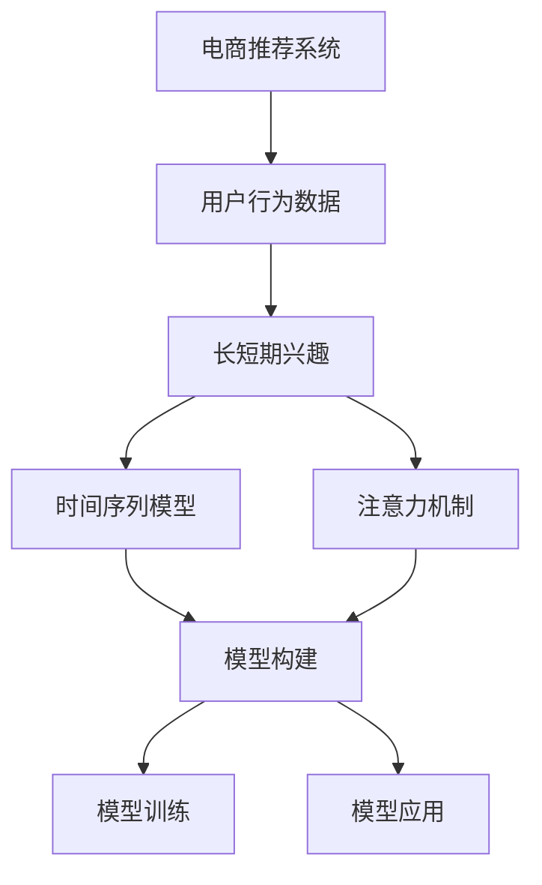

                 

# 电商推荐系统中的长短期兴趣建模

## 1. 背景介绍

随着电商平台的兴起，个性化推荐系统成为了各大电商网站的核心竞争力之一。根据最新统计，超过80%的电商交易是通过推荐系统完成的，推荐系统不仅能够显著提高用户满意度，也能大幅提升电商网站的转化率和收入。然而，由于用户兴趣变化多端、行为数据分散等因素，构建一个高效、准确的推荐系统，仍然是一个巨大的挑战。

### 1.1 问题由来

电商推荐系统的核心任务是预测用户对某项商品或服务的评分，从而为用户推荐相关的商品或服务，并提高其购买转化率。然而，用户兴趣具有强烈的时效性，这使得传统的推荐算法难以捕捉用户的即时需求。同时，用户的长期兴趣和短期兴趣往往是并存的，一个优秀的推荐系统需要同时关注用户的长期行为和短期行为，才能更准确地预测用户需求。

为了解决这个问题，长短期兴趣建模（Long and Short-Term Interest Modeling）成为了近年来推荐系统的研究热点。长短期兴趣建模旨在通过组合不同时间跨度的用户行为数据，建模用户的即时兴趣和长期兴趣，从而实现更精准、更及时的推荐。

### 1.2 问题核心关键点

长短期兴趣建模的关键在于如何高效地处理和融合不同时间跨度的用户行为数据，并从中提取有用的特征，用于预测用户的即时兴趣和长期兴趣。常见的方法包括使用时间序列模型、加权序列模型、多层注意力机制等。

具体来说，长短期兴趣建模可以分为以下几个关键点：
1. 数据准备：将不同时间跨度的用户行为数据进行清洗和整合，形成统一的时间序列。
2. 特征工程：通过降维、归一化、编码等手段，对用户行为数据进行特征提取。
3. 模型构建：构建合适的长短期兴趣建模模型，包括选择合适的时间序列模型或注意力机制等。
4. 模型训练：在标注数据集上训练模型，并通过交叉验证等手段调优模型参数。
5. 模型应用：在电商网站中集成推荐模型，进行实时的商品推荐。

## 2. 核心概念与联系

### 2.1 核心概念概述

为了更好地理解长短期兴趣建模，本节将介绍几个关键的概念和它们之间的联系：

- **电商推荐系统**：电商推荐系统是指使用机器学习和数据挖掘技术，对用户历史行为数据进行分析，预测用户对商品的兴趣，并为用户推荐合适的商品或服务。
- **用户行为数据**：用户行为数据包括用户的浏览、点击、购买等操作数据，是推荐系统预测用户兴趣和推荐商品的基础。
- **长短期兴趣**：长短期兴趣是指用户在长时间跨度和短时间跨度上的兴趣表现，例如用户在过去一个月内的购买记录和过去一周内的浏览记录。
- **时间序列模型**：时间序列模型是用于处理时间序列数据的统计模型，如ARIMA、LSTM等，能够捕捉用户行为数据的时间依赖性。
- **注意力机制**：注意力机制是一种常用的神经网络组件，能够帮助模型聚焦于最相关的用户行为数据，提高模型的泛化能力。

这些核心概念之间的逻辑关系可以通过以下Mermaid流程图来展示：



这个流程图展示了电商推荐系统、用户行为数据、长短期兴趣、时间序列模型和注意力机制之间的关系：

1. 电商推荐系统使用用户行为数据作为输入，建模长短期兴趣。
2. 时间序列模型用于处理用户行为数据，捕捉时间依赖性。
3. 注意力机制用于聚焦于最相关的用户行为数据，提高模型的泛化能力。
4. 模型构建模块将时间序列模型和注意力机制结合起来，构建长短期兴趣建模模型。
5. 模型训练模块对构建好的模型进行训练，以优化模型参数。
6. 模型应用模块将训练好的模型集成到电商推荐系统中，进行实时推荐。

## 3. 核心算法原理 & 具体操作步骤
### 3.1 算法原理概述

长短期兴趣建模的核心理念是使用时间序列模型和注意力机制，对不同时间跨度的用户行为数据进行建模，从而预测用户的即时兴趣和长期兴趣。

具体来说，长短期兴趣建模包括以下几个步骤：
1. **数据清洗**：将不同时间跨度的用户行为数据进行清洗和整合，形成统一的时间序列。
2. **特征工程**：对用户行为数据进行特征提取，如将用户浏览记录编码为向量，用于后续的建模。
3. **模型选择**：选择合适的长短期兴趣建模模型，如使用LSTM捕捉用户行为数据的时间依赖性，使用注意力机制聚焦于最相关的数据。
4. **模型训练**：在标注数据集上训练模型，并使用交叉验证等手段调优模型参数。
5. **模型应用**：在电商网站中集成推荐模型，进行实时的商品推荐。

### 3.2 算法步骤详解

**Step 1: 数据准备**
- **数据清洗**：将不同时间跨度的用户行为数据进行清洗和整合，形成统一的时间序列。这一步包括去除无效数据、处理缺失值、时间序列对齐等。
- **数据归一化**：对用户行为数据进行归一化，使得不同维度的数据具有可比性。
- **特征编码**：将用户行为数据编码为向量，便于后续建模。

**Step 2: 特征工程**
- **特征提取**：根据电商推荐系统的任务需求，提取有意义的特征，如用户的购买记录、浏览记录、评分记录等。
- **特征降维**：对高维特征进行降维处理，以减少模型的复杂度，提高训练效率。
- **特征转换**：对特征进行转换，如将数值型特征进行归一化，将类别型特征进行独热编码等。

**Step 3: 模型选择**
- **时间序列模型**：选择合适的时序模型，如ARIMA、LSTM等，用于捕捉用户行为数据的时间依赖性。
- **注意力机制**：选择注意力机制，如自注意力机制、多头注意力机制等，用于聚焦于最相关的用户行为数据。

**Step 4: 模型训练**
- **模型初始化**：对选定的模型进行初始化，如使用随机初始化的权重矩阵。
- **训练循环**：使用标注数据集进行迭代训练，调整模型参数，最小化损失函数。
- **交叉验证**：使用交叉验证等手段评估模型性能，防止模型过拟合。

**Step 5: 模型应用**
- **实时推荐**：将训练好的模型集成到电商推荐系统中，对用户实时行为进行预测，并推荐合适的商品。
- **A/B测试**：使用A/B测试等手段评估模型的推荐效果，并进行调整优化。

### 3.3 算法优缺点

长短期兴趣建模的优势在于能够同时关注用户的长期行为和即时行为，从而更准确地预测用户需求。其主要优点包括：
1. **精度高**：通过综合不同时间跨度的用户行为数据，能够更准确地预测用户的即时兴趣和长期兴趣。
2. **鲁棒性强**：能够处理长时间跨度的用户行为数据，适用于用户兴趣变化较慢的场景。
3. **易于扩展**：能够轻松地集成多种特征，如文本特征、图像特征等。

然而，长短期兴趣建模也存在一些缺点：
1. **计算量大**：需要处理大量的时间序列数据，计算量较大。
2. **模型复杂度高**：长短期兴趣建模模型通常比较复杂，需要较多的训练时间和计算资源。
3. **过拟合风险高**：由于模型参数较多，容易出现过拟合现象。

### 3.4 算法应用领域

长短期兴趣建模在电商推荐系统中有着广泛的应用，涵盖了以下几个方面：
1. **个性化推荐**：根据用户的历史行为数据，预测用户对某项商品或服务的评分，为用户推荐合适的商品。
2. **用户画像构建**：通过综合用户的长期行为数据，构建用户画像，了解用户偏好和行为模式。
3. **需求预测**：预测用户未来的购买需求，帮助商家进行库存管理和价格调整。
4. **广告投放优化**：根据用户的兴趣和行为数据，优化广告投放策略，提高广告点击率。

此外，长短期兴趣建模在金融、医疗、社交网络等多个领域也有着广泛的应用前景，能够帮助这些领域更好地理解和预测用户行为。

## 4. 数学模型和公式 & 详细讲解 & 举例说明
### 4.1 数学模型构建

长短期兴趣建模的数学模型可以分为以下几个部分：

- **输入层**：接收不同时间跨度的用户行为数据，并将其编码为向量。
- **时间序列模型层**：使用时间序列模型，如LSTM，捕捉用户行为数据的时间依赖性。
- **注意力机制层**：使用注意力机制，聚焦于最相关的用户行为数据，提高模型的泛化能力。
- **输出层**：根据输入层和中间层的输出，输出预测结果，如用户评分、商品推荐等。

### 4.2 公式推导过程

以一个简单的LSTM+Attention模型为例，推导其数学模型公式。

假设用户行为数据为 $x_{t}=(x_{t-1},x_{t-2},...,x_0)$，其中 $x_t$ 表示在时间 $t$ 的用户行为数据，可以是浏览记录、购买记录等。模型的输入序列为 $x=\{x_t\}$，输出序列为 $y=\{y_t\}$。

时间序列模型层为LSTM，假设LSTM的隐状态为 $h_t$，输出门为 $o_t$。注意力机制层的注意力权重为 $\alpha_t$，总权重为 $\alpha$。

假设模型的损失函数为交叉熵损失，即：

$$
\mathcal{L} = -\sum_{t=0}^{T} \log \hat{y_t}
$$

其中 $T$ 表示用户行为数据的时间跨度，$y_t$ 表示在时间 $t$ 的预测结果，$\hat{y_t}$ 表示模型预测的结果。

模型的前向传播过程如下：

1. **输入层**：将用户行为数据 $x_t$ 编码为向量 $x_t'$，并按时间顺序排列。
2. **LSTM层**：对用户行为数据进行LSTM处理，得到隐状态 $h_t$ 和输出门 $o_t$。
3. **注意力机制层**：计算每个时间步的注意力权重 $\alpha_t$，聚焦于最相关的用户行为数据。
4. **输出层**：根据隐状态 $h_t$ 和注意力权重 $\alpha_t$，输出预测结果 $\hat{y_t}$。

### 4.3 案例分析与讲解

以一个电商推荐系统为例，展示长短期兴趣建模的具体实现过程。

假设电商网站有 $N$ 个用户，每个用户在 $T$ 个时间步内有 $M$ 次行为记录。使用LSTM+Attention模型，对用户行为数据进行建模。具体步骤如下：

1. **数据准备**：将用户的浏览记录、购买记录等行为数据进行清洗和整合，形成统一的时间序列。
2. **特征工程**：将用户行为数据编码为向量，并使用归一化、编码等手段进行特征提取。
3. **模型选择**：选择LSTM和Attention机制，用于捕捉用户行为数据的时间依赖性和重要性。
4. **模型训练**：使用交叉验证等手段评估模型性能，并进行调优。
5. **模型应用**：在电商网站中集成推荐模型，进行实时的商品推荐。

## 5. 项目实践：代码实例和详细解释说明
### 5.1 开发环境搭建

在进行长短期兴趣建模实践前，我们需要准备好开发环境。以下是使用Python进行TensorFlow开发的完整环境配置流程：

1. 安装Anaconda：从官网下载并安装Anaconda，用于创建独立的Python环境。

2. 创建并激活虚拟环境：
```bash
conda create -n tf-env python=3.8 
conda activate tf-env
```

3. 安装TensorFlow：根据CUDA版本，从官网获取对应的安装命令。例如：
```bash
pip install tensorflow tensorflow-addons
```

4. 安装各类工具包：
```bash
pip install numpy pandas scikit-learn matplotlib tqdm jupyter notebook ipython
```

完成上述步骤后，即可在`tf-env`环境中开始长短期兴趣建模实践。

### 5.2 源代码详细实现

下面以一个简单的LSTM+Attention模型为例，展示长短期兴趣建模的代码实现。

```python
import tensorflow as tf
from tensorflow.keras.layers import Input, LSTM, Dense, Dropout, Embedding, Attention
from tensorflow.keras.models import Model

# 定义LSTM+Attention模型
def lstm_attention_model(input_shape, output_dim):
    input_seq = Input(shape=input_shape)
    lstm_layer = LSTM(units=64, return_sequences=True)(input_seq)
    attention_layer = Attention()([lstm_layer, lstm_layer])
    dense_layer = Dense(units=output_dim, activation='softmax')(attention_layer)
    return Model(inputs=input_seq, outputs=dense_layer)

# 构建模型
input_shape = (30, 10)
output_dim = 1
model = lstm_attention_model(input_shape, output_dim)

# 编译模型
model.compile(optimizer='adam', loss='binary_crossentropy', metrics=['accuracy'])

# 训练模型
model.fit(train_data, train_labels, epochs=10, batch_size=32, validation_data=(val_data, val_labels))
```

以上是使用TensorFlow构建LSTM+Attention模型的完整代码实现。可以看到，TensorFlow提供了高度灵活的API，使得构建复杂的神经网络模型变得非常简单。

### 5.3 代码解读与分析

让我们再详细解读一下关键代码的实现细节：

**定义LSTM+Attention模型**：
- **Input层**：接收用户行为数据，将其编码为向量。
- **LSTM层**：使用LSTM处理用户行为数据，得到隐状态和输出门。
- **Attention层**：使用Attention机制，聚焦于最相关的用户行为数据。
- **Dense层**：输出预测结果。

**训练模型**：
- **compile方法**：定义优化器、损失函数和评估指标。
- **fit方法**：使用训练数据集训练模型，并进行交叉验证评估。

## 6. 实际应用场景
### 6.1 智能推荐系统

长短期兴趣建模在智能推荐系统中有着广泛的应用，能够根据用户的历史行为数据，预测用户对某项商品或服务的评分，并为用户推荐合适的商品。

在技术实现上，可以收集用户的历史浏览、点击、购买等行为数据，使用LSTM+Attention模型对用户行为数据进行建模。微调模型后，可以在电商网站中集成推荐模型，进行实时的商品推荐。

### 6.2 用户画像构建

长短期兴趣建模能够帮助电商网站构建用户画像，了解用户偏好和行为模式。通过综合用户的长期行为数据，可以构建详细的用户画像，了解用户的兴趣和需求，从而进行更精准的推荐。

在技术实现上，可以使用LSTM+Attention模型对用户的长期行为数据进行建模，并提取有用的特征，如用户的浏览记录、购买记录等。通过综合这些特征，可以构建出用户的详细画像。

### 6.3 需求预测

长短期兴趣建模能够帮助电商网站预测用户未来的购买需求，从而进行库存管理和价格调整。通过综合用户的长期行为数据，可以预测用户未来的购买需求，帮助商家更好地管理库存和制定价格策略。

在技术实现上，可以使用LSTM+Attention模型对用户行为数据进行建模，并预测用户未来的购买需求。通过综合这些预测结果，可以优化库存管理和价格策略。

### 6.4 未来应用展望

随着长短期兴趣建模技术的不断进步，其在电商推荐系统中的应用将更加广泛。未来，长短期兴趣建模可能将融入更多的业务场景，如广告投放优化、用户流失预测等。

在广告投放优化方面，长短期兴趣建模能够根据用户的兴趣和行为数据，优化广告投放策略，提高广告点击率。在用户流失预测方面，长短期兴趣建模能够预测用户流失概率，帮助电商网站进行用户挽留。

此外，长短期兴趣建模在金融、医疗、社交网络等多个领域也有着广泛的应用前景，能够帮助这些领域更好地理解和预测用户行为。

## 7. 工具和资源推荐
### 7.1 学习资源推荐

为了帮助开发者系统掌握长短期兴趣建模的理论基础和实践技巧，这里推荐一些优质的学习资源：

1. 《深度学习》系列书籍：由Ian Goodfellow、Yoshua Bengio、Aaron Courville合著，是深度学习领域的经典教材，涵盖了深度学习的基本概念和算法。

2. TensorFlow官方文档：TensorFlow是当前最流行的深度学习框架之一，提供了丰富的API和工具，用于构建和训练深度学习模型。

3. PyTorch官方文档：PyTorch是另一个流行的深度学习框架，提供了灵活的动态计算图和丰富的组件，用于构建和训练深度学习模型。

4. Kaggle数据集：Kaggle提供了大量的数据集，可以用于机器学习和深度学习的研究和实践。

5. Coursera深度学习课程：Coursera提供了多门深度学习课程，涵盖深度学习的基本概念和算法，由斯坦福大学等知名学府教授授课。

通过对这些资源的学习实践，相信你一定能够快速掌握长短期兴趣建模的精髓，并用于解决实际的电商推荐问题。

### 7.2 开发工具推荐

高效的开发离不开优秀的工具支持。以下是几款用于长短期兴趣建模开发的常用工具：

1. TensorFlow：由Google主导开发的深度学习框架，生产部署方便，适合大规模工程应用。

2. PyTorch：由Facebook主导开发的深度学习框架，灵活动态的计算图，适合快速迭代研究。

3. Keras：由François Chollet开发的高层API，可以简化神经网络的构建过程。

4. Weights & Biases：模型训练的实验跟踪工具，可以记录和可视化模型训练过程中的各项指标，方便对比和调优。

5. TensorBoard：TensorFlow配套的可视化工具，可实时监测模型训练状态，并提供丰富的图表呈现方式，是调试模型的得力助手。

合理利用这些工具，可以显著提升长短期兴趣建模任务的开发效率，加快创新迭代的步伐。

### 7.3 相关论文推荐

长短期兴趣建模的研究始于2013年，自此以后得到了广泛的研究和应用。以下是几篇奠基性的相关论文，推荐阅读：

1. Item-based Collaborative Filtering（即协同过滤算法）：提出了基于用户的协同过滤算法，用于推荐系统中的用户推荐。

2. Matrix Factorization：提出了基于矩阵分解的推荐算法，用于推荐系统中的商品推荐。

3. Attention Mechanisms in Deep Learning：介绍了注意力机制的基本概念和应用，适用于长短期兴趣建模中的注意力机制。

4. Long Short-Term Memory Networks：介绍了LSTM的基本概念和应用，适用于长短期兴趣建模中的时间序列建模。

5. Deep Neural Networks for Language Understanding（即Transformer）：介绍了Transformer的基本概念和应用，适用于长短期兴趣建模中的神经网络建模。

这些论文代表了大语言模型微调技术的发展脉络。通过学习这些前沿成果，可以帮助研究者把握学科前进方向，激发更多的创新灵感。

## 8. 总结：未来发展趋势与挑战
### 8.1 总结

本文对长短期兴趣建模方法进行了全面系统的介绍。首先阐述了长短期兴趣建模的研究背景和意义，明确了其在大规模推荐系统中的独特价值。其次，从原理到实践，详细讲解了长短期兴趣建模的数学原理和关键步骤，给出了模型构建的完整代码实例。同时，本文还广泛探讨了长短期兴趣建模在电商推荐系统中的应用前景，展示了其巨大的潜力。

通过本文的系统梳理，可以看到，长短期兴趣建模正在成为推荐系统的重要范式，极大地拓展了深度学习模型的应用边界，催生了更多的落地场景。未来，伴随深度学习技术的发展和优化，长短期兴趣建模必将在推荐系统等领域继续大放异彩。

### 8.2 未来发展趋势

展望未来，长短期兴趣建模技术将呈现以下几个发展趋势：

1. **模型规模持续增大**：随着算力成本的下降和数据规模的扩张，深度学习模型的参数量还将持续增长。超大规模深度学习模型蕴含的丰富知识，有望支撑更加复杂多变的推荐任务。

2. **多模态推荐兴起**：除了传统的文本和图像数据，未来推荐系统将越来越多地使用语音、视频等多模态数据，实现跨模态推荐。

3. **实时推荐系统成为主流**：随着计算能力的提升和数据处理技术的进步，实时推荐系统将逐渐普及，能够实现对用户即时需求的快速响应。

4. **个性化推荐精度提升**：未来推荐系统将更加注重用户个性化需求的满足，通过综合多模态数据和深度学习模型，实现更精准、更及时的推荐。

5. **推荐系统智能性增强**：未来的推荐系统将更加注重用户行为模式的理解和预测，通过强化学习等技术，实现更加智能、更加个性化的推荐。

以上趋势凸显了长短期兴趣建模技术的广阔前景。这些方向的探索发展，必将进一步提升推荐系统的性能和应用范围，为电商推荐系统带来新的突破。

### 8.3 面临的挑战

尽管长短期兴趣建模技术已经取得了瞩目成就，但在迈向更加智能化、普适化应用的过程中，它仍面临着诸多挑战：

1. **数据稀疏性**：用户行为数据往往具有稀疏性，难以覆盖用户所有兴趣点。如何利用有限的标注数据，构建更加全面的用户画像，是一个重要的问题。

2. **用户行为复杂性**：用户行为具有高度复杂性，难以简单地用数学模型进行建模。如何高效地捕捉用户行为中的非线性关系，是一个重要的研究方向。

3. **推荐系统公平性**：推荐系统容易出现数据偏差，导致不公平的推荐结果。如何设计公平、公正的推荐算法，是一个亟待解决的问题。

4. **隐私保护问题**：用户行为数据往往包含敏感信息，如何在推荐系统中保护用户隐私，是一个重要的问题。

5. **推荐系统鲁棒性**：推荐系统在面对异常数据和噪声时，容易产生错误的推荐结果。如何提高推荐系统的鲁棒性，是一个重要的研究方向。

6. **计算资源限制**：深度学习模型的计算资源需求高，如何在有限的计算资源下，实现高效的推荐系统，是一个重要的问题。

正视长短期兴趣建模面临的这些挑战，积极应对并寻求突破，将是大规模推荐系统走向成熟的必由之路。相信随着学界和产业界的共同努力，这些挑战终将一一被克服，长短期兴趣建模必将在构建智能推荐系统方面发挥更大的作用。

### 8.4 研究展望

面对长短期兴趣建模所面临的种种挑战，未来的研究需要在以下几个方面寻求新的突破：

1. **多模态推荐模型**：结合多模态数据，构建更加全面、准确的推荐模型，如融合文本、图像、语音等多模态信息。

2. **深度学习模型优化**：优化深度学习模型，减少计算资源消耗，提高推荐系统的实时性，如采用轻量级模型、压缩技术等。

3. **推荐系统公平性**：设计公平、公正的推荐算法，减少数据偏差，提高推荐系统的公平性，如使用多种评估指标、反偏见算法等。

4. **隐私保护技术**：开发隐私保护技术，保护用户隐私，如差分隐私、联邦学习等。

5. **推荐系统鲁棒性**：提高推荐系统的鲁棒性，减少异常数据和噪声的影响，如使用异常检测、鲁棒回归等。

6. **推荐系统可解释性**：提高推荐系统的可解释性，帮助用户理解推荐结果，如使用可解释的机器学习模型、推荐解释算法等。

这些研究方向将引领长短期兴趣建模技术迈向更高的台阶，为构建更加智能、更加公平、更加隐私保护的推荐系统提供新的突破点。

## 9. 附录：常见问题与解答
**Q1: 长短期兴趣建模如何处理用户行为数据中的噪声和异常值？**

A: 长短期兴趣建模中，用户行为数据中的噪声和异常值对模型的性能有较大影响，需要通过以下方法进行处理：

1. 数据清洗：去除无效数据和异常值，保留有意义的特征。

2. 特征选择：通过特征选择算法，去除无关或冗余的特征，减少噪声的影响。

3. 异常检测：使用异常检测算法，识别并处理异常值，减少异常值对模型的影响。

4. 数据增强：使用数据增强技术，如随机裁剪、旋转等，生成更多的训练数据，提高模型的鲁棒性。

5. 正则化：使用正则化技术，如L1、L2正则化，减少模型的过拟合现象，提高模型的泛化能力。

**Q2: 长短期兴趣建模如何处理用户行为的稀疏性？**

A: 用户行为数据通常具有稀疏性，即用户的某些行为数据缺失或未记录。处理用户行为的稀疏性可以通过以下方法：

1. 数据填充：使用填充技术，如均值填充、最邻近填充等，填补缺失的数据。

2. 特征预测：使用特征预测技术，如线性回归、KNN等，预测缺失的数据。

3. 矩阵分解：使用矩阵分解技术，如SVD、SVD++等，对用户行为数据进行低秩分解，保留有用的信息。

4. 时间插值：使用时间插值技术，如线性插值、三次样条插值等，填补缺失的数据。

5. 深度学习模型：使用深度学习模型，如神经网络、深度信念网络等，对用户行为数据进行建模，捕捉用户行为中的非线性关系。

这些方法可以根据具体问题进行选择，以提高长短期兴趣建模的性能和鲁棒性。

**Q3: 长短期兴趣建模如何处理用户行为数据中的冷启动问题？**

A: 长短期兴趣建模在面对冷启动问题（即用户没有历史行为数据）时，可以通过以下方法进行处理：

1. 基线推荐：使用基于用户的历史行为数据进行推荐，如协同过滤、内容推荐等。

2. 隐式反馈：利用用户的隐式反馈信息，如点击率、浏览时间等，进行推荐。

3. 跨域推荐：利用用户在其他平台或领域的行为数据，进行推荐，如跨域推荐系统。

4. 预训练模型：使用预训练模型，如BERT、GPT等，对用户行为数据进行预训练，提取有用的特征，进行推荐。

5. 冷启动推荐算法：开发专门的冷启动推荐算法，如基于兴趣的推荐、基于行为的推荐等。

这些方法可以根据具体问题进行选择，以提高长短期兴趣建模的性能和鲁棒性。

**Q4: 长短期兴趣建模如何处理多模态数据？**

A: 长短期兴趣建模处理多模态数据，可以通过以下方法：

1. 特征融合：将不同模态的数据进行融合，生成统一的多模态特征。

2. 多模态神经网络：使用多模态神经网络，如CNN、RNN、Transformer等，对多模态数据进行建模。

3. 深度融合：使用深度融合技术，如Stacked Denoising Autoencoders、Hierarchical Attention Networks等，对多模态数据进行融合。

4. 跨模态推荐算法：开发跨模态推荐算法，如Fusion Networks、Coupled Matrix Factorization等，对多模态数据进行推荐。

5. 数据增强：使用数据增强技术，如图像旋转、视频剪辑等，生成更多的训练数据。

这些方法可以根据具体问题进行选择，以提高长短期兴趣建模的性能和鲁棒性。

**Q5: 长短期兴趣建模如何处理用户行为数据的缺失值？**

A: 用户行为数据中的缺失值通常会影响模型的性能，可以通过以下方法进行处理：

1. 插值法：使用插值法，如均值插值、中值插值等，填补缺失值。

2. 模型法：使用模型法，如KNN、回归模型等，预测缺失值。

3. 多模态融合：使用多模态融合技术，将缺失值转化为多模态信息，进行填补。

4. 特征工程：通过特征工程，生成更加鲁棒的特征，减少缺失值对模型的影响。

5. 数据增强：使用数据增强技术，如数据合成、噪声注入等，生成更多的训练数据，减少缺失值对模型的影响。

这些方法可以根据具体问题进行选择，以提高长短期兴趣建模的性能和鲁棒性。

---

作者：禅与计算机程序设计艺术 / Zen and the Art of Computer Programming

