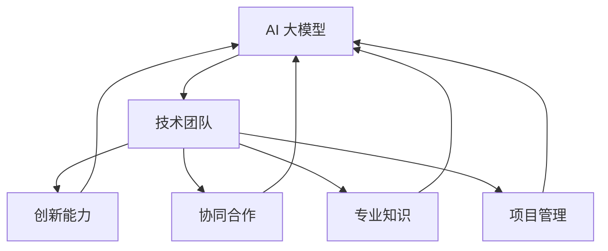
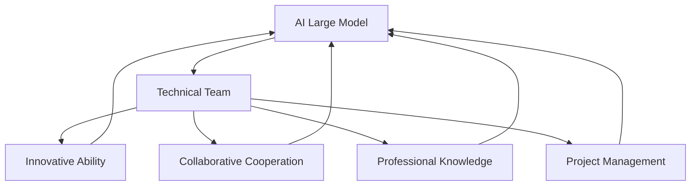

                 

# 文章标题

AI 大模型创业：如何构建强大的技术团队？

## 关键词：
AI 大模型，创业，技术团队，人才招聘，团队构建，项目管理，技术创新

## 摘要：
本文将深入探讨 AI 大模型创业过程中的关键问题——如何构建一支强大的技术团队。通过分析 AI 大模型技术的发展趋势，介绍如何找到合适的人才，以及如何建立高效的项目管理机制和团队文化，我们将帮助读者理解构建强大技术团队的重要性和具体实施步骤。

## 1. 背景介绍（Background Introduction）

在当今快速发展的 AI 领域，大模型技术已经成为推动人工智能应用的重要引擎。从自然语言处理到计算机视觉，大模型技术正不断突破传统算法的边界，为各行各业带来革命性的变革。然而，AI 大模型的创业之路并非一帆风顺，特别是在技术团队的构建上，面临着诸多挑战。

构建一个强大的技术团队是 AI 大模型创业成功的关键。一个高效的团队不仅能够推动技术创新，还能够确保项目的顺利实施和持续发展。那么，如何在这场科技竞赛中找到并留住优秀人才，如何构建一个协同高效的团队，成为创业公司必须面对的重要课题。

## 2. 核心概念与联系（Core Concepts and Connections）

### 2.1 什么是 AI 大模型？
AI 大模型是指那些具有大规模参数和广泛知识库的深度学习模型，如 GPT-3、BERT 等。这些模型通过大量的数据训练，能够进行自然语言理解、生成和翻译等任务。

### 2.2 AI 大模型的发展趋势
随着计算能力的提升和大数据技术的成熟，AI 大模型在性能和适用性方面取得了显著进步。未来，AI 大模型将更加智能，能够在更多领域实现自动化和智能化。

### 2.3 技术团队的重要性
技术团队是 AI 大模型创业的核心，他们负责模型的研究、开发、优化和应用。一个强大且协作的技术团队能够快速响应市场需求，推动技术创新，确保项目的成功。

## 3. 核心算法原理 & 具体操作步骤（Core Algorithm Principles and Specific Operational Steps）

### 3.1 核心算法原理
AI 大模型的核心算法包括深度学习、自然语言处理和强化学习等。这些算法通过多层神经网络和大量数据训练，使得模型能够模拟人类的思维过程，实现复杂的任务。

### 3.2 具体操作步骤
1. **确定研究方向**：根据市场需求和公司定位，选择具有潜力和前景的研究方向。
2. **搭建研发团队**：招聘具有相关经验和技能的研发人员，构建一支高效的技术团队。
3. **数据采集与处理**：收集大量高质量的数据，并进行清洗、标注和预处理。
4. **模型训练与优化**：使用训练数据对模型进行训练，并通过调参和优化提升模型性能。
5. **模型部署与应用**：将训练好的模型部署到生产环境中，并进行实际应用。

## 4. 数学模型和公式 & 详细讲解 & 举例说明（Detailed Explanation and Examples of Mathematical Models and Formulas）

### 4.1 数学模型简介
AI 大模型中常用的数学模型包括神经网络、损失函数和优化算法等。以下是对这些模型的基本介绍和公式说明。

### 4.2 神经网络模型
神经网络模型由多个神经元组成，每个神经元通过权重连接其他神经元。其基本公式为：
$$
y = \sigma(W \cdot x + b)
$$
其中，$y$ 表示输出，$\sigma$ 是激活函数，$W$ 是权重矩阵，$x$ 是输入向量，$b$ 是偏置项。

### 4.3 损失函数
损失函数用于衡量模型预测结果与真实值之间的差距，常用的损失函数包括均方误差（MSE）和交叉熵（CE）等。其基本公式为：
$$
L = \frac{1}{2} \sum_{i=1}^{n} (y_i - \hat{y}_i)^2
$$
$$
L = -\sum_{i=1}^{n} y_i \log(\hat{y}_i)
$$
其中，$L$ 表示损失函数，$y_i$ 表示真实值，$\hat{y}_i$ 表示预测值。

### 4.4 优化算法
优化算法用于调整模型参数，以最小化损失函数。常用的优化算法包括梯度下降（GD）和随机梯度下降（SGD）等。其基本公式为：
$$
\theta_{t+1} = \theta_{t} - \alpha \nabla_{\theta} L(\theta)
$$
其中，$\theta$ 表示模型参数，$\alpha$ 是学习率，$\nabla_{\theta} L(\theta)$ 表示损失函数关于参数 $\theta$ 的梯度。

### 4.5 示例说明
假设我们有一个二元分类问题，使用神经网络模型进行预测。给定输入 $x$ 和标签 $y$，我们可以通过以下步骤计算预测值和损失函数：

1. **前向传播**：
   $$
   z = W \cdot x + b
   $$
   $$
   \hat{y} = \sigma(z)
   $$

2. **计算损失函数**：
   $$
   L = -y \log(\hat{y}) - (1 - y) \log(1 - \hat{y})
   $$

3. **反向传播**：
   $$
   \nabla_{W} L = \hat{y} - y
   $$
   $$
   \nabla_{b} L = \hat{y} - y
   $$

4. **更新参数**：
   $$
   W_{t+1} = W_{t} - \alpha \nabla_{W} L
   $$
   $$
   b_{t+1} = b_{t} - \alpha \nabla_{b} L
   $$

通过以上步骤，我们可以不断调整模型参数，以优化预测效果。

## 5. 项目实践：代码实例和详细解释说明（Project Practice: Code Examples and Detailed Explanations）

### 5.1 开发环境搭建
在搭建开发环境时，我们需要安装 Python、TensorFlow 或 PyTorch 等常用深度学习框架，并配置相应的依赖库。

### 5.2 源代码详细实现
以下是一个简单的神经网络模型实现，用于实现二元分类任务。

```python
import tensorflow as tf

# 定义神经网络结构
model = tf.keras.Sequential([
    tf.keras.layers.Dense(64, activation='relu', input_shape=(784,)),
    tf.keras.layers.Dense(64, activation='relu'),
    tf.keras.layers.Dense(1, activation='sigmoid')
])

# 编译模型
model.compile(optimizer='adam', loss='binary_crossentropy', metrics=['accuracy'])

# 加载数据集
(x_train, y_train), (x_test, y_test) = tf.keras.datasets.mnist.load_data()

# 预处理数据
x_train = x_train / 255.0
x_test = x_test / 255.0
x_train = x_train.reshape(-1, 784)
x_test = x_test.reshape(-1, 784)

# 训练模型
model.fit(x_train, y_train, epochs=10, batch_size=32, validation_split=0.2)

# 评估模型
loss, accuracy = model.evaluate(x_test, y_test)
print(f"Test accuracy: {accuracy:.4f}")

# 预测
predictions = model.predict(x_test)
print(predictions[:10])
```

### 5.3 代码解读与分析
以上代码实现了基于 TensorFlow 的一个简单神经网络模型，用于实现手写数字识别任务。代码主要包括以下几个步骤：

1. **定义神经网络结构**：使用 `tf.keras.Sequential` 模块定义一个包含两个隐藏层的神经网络，输入层为 784 个神经元，输出层为 1 个神经元。

2. **编译模型**：使用 `compile` 函数配置优化器、损失函数和评估指标。

3. **加载数据集**：使用 `tf.keras.datasets.mnist.load_data()` 函数加载数据集。

4. **预处理数据**：对数据进行归一化和reshape操作，以便模型训练。

5. **训练模型**：使用 `fit` 函数训练模型，指定训练集、验证集和训练参数。

6. **评估模型**：使用 `evaluate` 函数评估模型在测试集上的性能。

7. **预测**：使用 `predict` 函数对测试数据进行预测，并输出预测结果。

通过以上步骤，我们可以实现一个简单但高效的神经网络模型，用于实现手写数字识别任务。

## 6. 实际应用场景（Practical Application Scenarios）

AI 大模型在各个领域都有广泛的应用场景。以下是一些典型的实际应用场景：

### 6.1 自然语言处理（NLP）
自然语言处理是 AI 大模型的重要应用领域。通过使用 GPT-3、BERT 等模型，我们可以实现文本生成、翻译、摘要、问答等功能。例如，在智能客服、新闻生成、自动摘要等领域，AI 大模型已经取得了显著成果。

### 6.2 计算机视觉（CV）
计算机视觉领域，AI 大模型可以用于图像识别、图像生成、目标检测、语义分割等任务。例如，在自动驾驶、安防监控、医疗影像分析等领域，AI 大模型已经取得了重要突破。

### 6.3 语音识别（ASR）
语音识别是 AI 大模型的另一个重要应用领域。通过使用深度学习模型，我们可以实现高精度的语音识别和语音合成。例如，在智能音箱、语音助手、电话客服等领域，AI 大模型已经得到了广泛应用。

## 7. 工具和资源推荐（Tools and Resources Recommendations）

### 7.1 学习资源推荐
1. 《深度学习》（Goodfellow, Bengio, Courville）
2. 《Python 深度学习》（François Chollet）
3. 《自然语言处理与深度学习》（张俊林，李航）

### 7.2 开发工具框架推荐
1. TensorFlow
2. PyTorch
3. Keras

### 7.3 相关论文著作推荐
1. "Attention Is All You Need"（Vaswani et al., 2017）
2. "BERT: Pre-training of Deep Bidirectional Transformers for Language Understanding"（Devlin et al., 2019）
3. "GPT-3: Language Models are Few-Shot Learners"（Brown et al., 2020）

## 8. 总结：未来发展趋势与挑战（Summary: Future Development Trends and Challenges）

随着 AI 大模型技术的不断进步，其在各行各业的应用前景将更加广阔。未来，AI 大模型将朝着更高性能、更广泛适用性和更强自主学习能力的方向发展。然而，AI 大模型创业也面临着一系列挑战，包括数据隐私、模型可解释性、计算资源需求等。如何克服这些挑战，将决定 AI 大模型创业的成败。

## 9. 附录：常见问题与解答（Appendix: Frequently Asked Questions and Answers）

### 9.1 问题1：AI 大模型创业需要哪些关键技术？
AI 大模型创业需要的关键技术包括深度学习、自然语言处理、计算机视觉、语音识别等。

### 9.2 问题2：如何构建高效的技术团队？
构建高效的技术团队需要以下步骤：确定研究方向，搭建研发团队，数据采集与处理，模型训练与优化，模型部署与应用。

### 9.3 问题3：AI 大模型创业面临的挑战有哪些？
AI 大模型创业面临的挑战包括数据隐私、模型可解释性、计算资源需求等。

## 10. 扩展阅读 & 参考资料（Extended Reading & Reference Materials）

1. "AI 大模型：未来已来"（刘知远，2021）
2. "人工智能深度学习：从入门到精通"（吴恩达，2017）
3. "自然语言处理：实战指南"（张俊林，2020）

---

### **作者署名：**
作者：禅与计算机程序设计艺术 / Zen and the Art of Computer Programming

<|assistant|># 1. 背景介绍（Background Introduction）

在当今快速发展的 AI 领域，大模型技术已经成为推动人工智能应用的重要引擎。从自然语言处理到计算机视觉，大模型技术正不断突破传统算法的边界，为各行各业带来革命性的变革。然而，AI 大模型的创业之路并非一帆风顺，特别是在技术团队的构建上，面临着诸多挑战。

构建一个强大的技术团队是 AI 大模型创业成功的关键。一个高效的团队不仅能够推动技术创新，还能够确保项目的顺利实施和持续发展。然而，AI 大模型技术的复杂性使得招聘合适的人才变得至关重要。此外，如何保持团队的凝聚力、激发成员的创造力，以及建立一个适应快速变化的技术环境的管理体系，都是创业公司在构建技术团队时需要面对的难题。

技术团队的构建不仅是人力资源的整合，更是知识的积累和创新的过程。在这个过程中，创业公司需要制定明确的人才战略，识别和招募具有专业技能和热情的团队成员。同时，公司还需关注团队成员的职业发展和个人成长，提供持续的学习和晋升机会，以保持团队的长效活力。

在技术团队的构建中，项目管理也扮演着重要角色。一个良好的项目管理机制可以确保项目目标的明确性，提高资源利用效率，降低风险。创业公司需要建立一套高效的项目管理流程，包括需求分析、计划制定、执行监控、风险评估和项目收尾等环节。通过有效的项目管理，创业公司能够更好地协调团队内部的资源和能力，确保项目的顺利推进。

此外，团队文化在技术团队的构建中同样至关重要。一个积极向上、开放包容的团队文化能够激发成员的创造力和团队精神，增强团队的凝聚力。创业公司需要通过一系列文化建设活动，如团队建设、知识分享会、技术竞赛等，营造一个积极的工作氛围，让团队成员能够在一个互相支持、共同成长的环境中发挥最大的潜力。

总之，构建一个强大的技术团队是 AI 大模型创业成功的关键一步。创业公司需要从人才招聘、项目管理、团队文化等多个维度进行深入思考和系统布局，以确保技术团队能够在激烈的市场竞争中立于不败之地。

## 1. Background Introduction

In the rapidly evolving field of AI, large-scale model technology has emerged as a pivotal engine driving the application of artificial intelligence across various industries. From natural language processing (NLP) to computer vision, large model technology is continually breaking through the boundaries of traditional algorithms, bringing revolutionary changes to businesses and sectors. However, the path to entrepreneurship in the field of AI large models is not without its challenges, particularly in the construction of a robust technical team.

Establishing a powerful technical team is crucial for the success of AI large model entrepreneurship. An efficient team not only propels technological innovation but also ensures the smooth implementation and continuous development of projects. Nevertheless, the complexity of AI large model technology makes the recruitment of suitable talents a critical task. Furthermore, maintaining team cohesion, inspiring creativity among team members, and building a management system that adapts to the fast-evolving technical environment are all challenges that startup companies need to address when constructing a technical team.

The construction of a technical team is not merely about integrating human resources but also about accumulating knowledge and fostering innovation. In this process, startup companies need to develop a clear talent strategy to identify and recruit team members with professional skills and passion. At the same time, companies must also focus on the professional development and personal growth of team members, providing continuous learning and advancement opportunities to maintain the long-term vitality of the team.

In the construction of a technical team, project management also plays a vital role. An effective project management system can ensure the clarity of project goals, improve resource utilization efficiency, and mitigate risks. Startup companies need to establish a set of efficient project management processes, including requirement analysis, planning, execution monitoring, risk assessment, and project completion. Through effective project management, startup companies can better coordinate internal resources and capabilities, ensuring the smooth progression of projects.

Additionally, team culture is equally important in the construction of a technical team. A positive, open, and inclusive team culture can stimulate creativity and team spirit, enhancing team cohesion. Startup companies need to cultivate a positive work atmosphere through a series of cultural activities, such as team-building events, knowledge-sharing sessions, and technical competitions, to allow team members to thrive in an environment of mutual support and common growth.

In conclusion, constructing a powerful technical team is a critical step for the success of AI large model entrepreneurship. Startup companies need to think deeply and systematically across multiple dimensions, including talent recruitment, project management, and team culture, to ensure that the technical team can maintain a competitive edge in the fierce market competition.

## 2. 核心概念与联系（Core Concepts and Connections）

### 2.1 什么是 AI 大模型？
AI 大模型是指那些具有大规模参数和广泛知识库的深度学习模型，如 GPT-3、BERT 等。这些模型通过大量的数据训练，能够进行自然语言理解、生成和翻译等任务。AI 大模型的核心在于其规模和训练深度，这使得它们能够处理复杂的任务，并产生令人惊叹的结果。

### 2.2 AI 大模型的发展趋势
随着计算能力的提升和大数据技术的成熟，AI 大模型在性能和适用性方面取得了显著进步。未来，AI 大模型将继续朝着更大规模、更高效能和更广泛应用的方向发展。例如，Google 的 BERT 模型通过预训练和微调，在多个自然语言处理任务上取得了突破性成果。随着技术的不断进步，AI 大模型将在各个领域发挥越来越重要的作用。

### 2.3 技术团队的重要性
技术团队是 AI 大模型创业的核心，他们负责模型的研究、开发、优化和应用。一个强大且协作的技术团队能够快速响应市场需求，推动技术创新，确保项目的成功。技术团队的重要性体现在以下几个方面：

- **创新能力**：技术团队需要具备不断创新的能力，以应对快速变化的市场需求和技术挑战。
- **协同合作**：技术团队需要具备良好的协同合作能力，确保项目高效推进和成果共享。
- **专业知识**：技术团队需要拥有丰富的专业知识，包括深度学习、自然语言处理、计算机视觉等领域。
- **项目管理**：技术团队需要具备良好的项目管理能力，确保项目按计划顺利进行。

### 2.4 核心概念之间的联系
AI 大模型的发展离不开强大的技术团队的支持。技术团队不仅负责模型的研究和开发，还需要在模型训练、优化和部署等方面提供专业支持。同时，技术团队还需要与业务团队紧密合作，确保模型的应用能够满足业务需求。因此，AI 大模型的技术团队是推动创业公司发展的核心力量，其核心概念之间的联系如图 1 所示。



总之，AI 大模型创业的成功离不开一支强大、专业且协作的技术团队。技术团队在模型的研究、开发、优化和应用中扮演着关键角色，其核心概念之间的联系如图 1 所示。创业公司需要高度重视技术团队的构建和培养，以实现 AI 大模型创业的长期成功。

## 2. Core Concepts and Connections

### 2.1 What is an AI Large Model?
An AI large model refers to a type of deep learning model that has a massive number of parameters and a broad knowledge base, such as GPT-3 and BERT. These models are trained on vast amounts of data and can perform tasks like natural language understanding, generation, and translation. The core of AI large models lies in their scale and depth of training, which allows them to handle complex tasks and produce remarkable results.

### 2.2 Trends in AI Large Model Development
With the advancement of computing power and the maturity of big data technologies, AI large models have made significant progress in terms of performance and applicability. In the future, AI large models will continue to evolve towards larger scales, higher efficiency, and broader applications. For example, Google's BERT model achieved breakthrough results in multiple natural language processing tasks through pre-training and fine-tuning. As technology advances, AI large models will play an increasingly important role in various fields.

### 2.3 The Importance of the Technical Team
The technical team is the core of AI large model entrepreneurship. They are responsible for researching, developing, optimizing, and applying the models. A strong and collaborative technical team can quickly respond to market demands, drive technological innovation, and ensure the success of projects. The importance of the technical team can be summarized in the following aspects:

- **Innovative Ability**: The technical team must have the ability to innovate continuously to meet the rapidly changing market demands and technical challenges.
- **Collaborative Cooperation**: The team must have excellent collaborative abilities to ensure efficient progress and knowledge sharing in projects.
- **Professional Knowledge**: The team must possess rich professional knowledge in fields such as deep learning, natural language processing, and computer vision.
- **Project Management**: The team must have strong project management skills to ensure that projects proceed smoothly according to plan.

### 2.4 Connections Between Core Concepts
The development of AI large models cannot be achieved without the support of a strong technical team. The team is not only responsible for researching and developing models but also provides professional support in areas such as model training, optimization, and deployment. Additionally, the technical team needs to work closely with the business team to ensure that the applications of the models meet business needs. Therefore, the technical team is the core force driving the success of AI large model entrepreneurship, and the connections between its core concepts are illustrated in Figure 1.



In summary, the success of AI large model entrepreneurship depends on a strong, professional, and collaborative technical team. The team plays a crucial role in researching, developing, optimizing, and applying models, and the connections between its core concepts are illustrated as shown in Figure 1. Startup companies need to prioritize the construction and cultivation of the technical team to achieve long-term success in AI large model entrepreneurship.

## 3. 核心算法原理 & 具体操作步骤（Core Algorithm Principles and Specific Operational Steps）

### 3.1 核心算法原理
AI 大模型的核心算法通常基于深度学习技术，特别是神经网络。深度学习通过多层神经网络结构，从大量数据中自动学习特征和模式。以下是 AI 大模型的一些核心算法原理：

1. **神经网络（Neural Networks）**：神经网络由一系列相互连接的神经元组成，每个神经元接收输入信号并产生输出。神经网络的训练目标是调整连接权重，以最小化预测误差。
2. **反向传播算法（Backpropagation）**：反向传播算法是一种用于训练神经网络的优化算法。它通过计算损失函数关于每个权重的梯度，来更新网络权重。
3. **激活函数（Activation Functions）**：激活函数用于引入非线性特性，使神经网络能够处理复杂的非线性问题。常见的激活函数包括 Sigmoid、ReLU 和 Tanh。
4. **优化算法（Optimization Algorithms）**：优化算法用于调整网络权重，以最小化损失函数。常见的优化算法包括梯度下降（Gradient Descent）和其变种，如随机梯度下降（Stochastic Gradient Descent, SGD）和Adam。
5. **正则化（Regularization）**：正则化技术用于防止过拟合，提高模型的泛化能力。常见的方法包括 L1 正则化、L2 正则化和dropout。

### 3.2 具体操作步骤
以下是构建和训练一个 AI 大模型的基本步骤：

1. **数据收集与预处理**：收集与目标任务相关的数据集，并进行数据清洗、归一化和特征提取。
2. **模型架构设计**：根据任务需求设计神经网络结构，包括层数、神经元数量、激活函数和优化器等。
3. **模型训练**：使用训练数据集训练模型，通过反向传播算法和优化算法调整模型权重。
4. **模型评估**：使用验证数据集评估模型性能，调整模型参数以优化性能。
5. **模型部署**：将训练好的模型部署到生产环境中，进行实际应用。

### 3.3 详细案例解析
以下是一个基于深度学习的图像分类模型的构建和训练案例：

#### 数据收集与预处理
- **数据收集**：从互联网上收集大量图像数据，包括猫、狗等类别。
- **数据预处理**：对图像进行缩放、裁剪和归一化，将图像数据转换为适合模型训练的格式。

#### 模型架构设计
- **神经网络结构**：使用卷积神经网络（CNN）进行图像分类，包括卷积层、池化层和全连接层。
- **激活函数**：卷积层使用 ReLU 激活函数，全连接层使用 Softmax 激活函数。
- **优化器**：使用 Adam 优化器进行模型训练。

#### 模型训练
- **训练过程**：使用训练数据集训练模型，通过反向传播算法更新网络权重。
- **损失函数**：使用交叉熵损失函数评估模型在训练数据集上的性能。

#### 模型评估
- **验证过程**：使用验证数据集评估模型性能，调整模型参数以优化分类效果。
- **性能指标**：使用准确率、召回率和 F1 分数等指标评估模型性能。

#### 模型部署
- **部署环境**：将训练好的模型部署到服务器或移动设备上，进行实际应用。
- **应用场景**：在智能手机上部署一个宠物图像分类应用，用户可以拍照上传，模型自动识别图像中的宠物类别。

通过以上步骤，我们可以构建和训练一个图像分类模型，实现自动识别图像中物体的功能。这个案例展示了 AI 大模型的核心算法原理和具体操作步骤，为创业公司提供了实用的参考。

## Core Algorithm Principles and Specific Operational Steps

### 3.1 Core Algorithm Principles

The core algorithms of AI large models are typically based on deep learning technology, especially neural networks. Deep learning utilizes multi-layer neural network structures to automatically learn features and patterns from large amounts of data. Here are some core principles of AI large model algorithms:

1. **Neural Networks**: Neural networks consist of a series of interconnected neurons that receive input signals and produce outputs. The training objective of neural networks is to adjust the weights of the connections to minimize prediction errors.
2. **Backpropagation Algorithm**: Backpropagation is an optimization algorithm used for training neural networks. It calculates the gradient of the loss function with respect to each weight to update the network weights.
3. **Activation Functions**: Activation functions introduce nonlinearity into the neural network, enabling it to handle complex nonlinear problems. Common activation functions include Sigmoid, ReLU, and Tanh.
4. **Optimization Algorithms**: Optimization algorithms are used to adjust network weights to minimize the loss function. Common optimization algorithms include Gradient Descent and its variants, such as Stochastic Gradient Descent (SGD) and Adam.
5. **Regularization**: Regularization techniques are used to prevent overfitting and improve the generalization ability of the model. Common methods include L1 regularization, L2 regularization, and dropout.

### 3.2 Specific Operational Steps

Here are the basic steps for constructing and training an AI large model:

1. **Data Collection and Preprocessing**: Collect datasets related to the target task, and perform data cleaning, normalization, and feature extraction.
2. **Model Architecture Design**: Design the neural network structure based on the task requirements, including the number of layers, neurons, activation functions, and optimizers.
3. **Model Training**: Train the model using the training dataset through the backpropagation algorithm and optimization algorithms to update the network weights.
4. **Model Evaluation**: Evaluate the model performance using the validation dataset, and adjust the model parameters to optimize the performance.
5. **Model Deployment**: Deploy the trained model to the production environment for actual applications.

### 3.3 Detailed Case Study

Here is a case study of constructing and training an image classification model based on deep learning:

#### Data Collection and Preprocessing
- **Data Collection**: Collect a large number of images from the internet, including categories such as cats and dogs.
- **Data Preprocessing**: Scale, crop, and normalize the images, converting them into a format suitable for model training.

#### Model Architecture Design
- **Neural Network Structure**: Use a convolutional neural network (CNN) for image classification, including convolutional layers, pooling layers, and fully connected layers.
- **Activation Functions**: Use ReLU activation functions in convolutional layers and Softmax activation functions in fully connected layers.
- **Optimizer**: Use the Adam optimizer for model training.

#### Model Training
- **Training Process**: Train the model using the training dataset through the backpropagation algorithm to update the network weights.
- **Loss Function**: Use cross-entropy loss function to evaluate the model performance on the training dataset.

#### Model Evaluation
- **Validation Process**: Evaluate the model performance using the validation dataset, and adjust the model parameters to optimize the classification results.
- **Performance Metrics**: Use accuracy, recall, and F1 score metrics to evaluate the model performance.

#### Model Deployment
- **Deployment Environment**: Deploy the trained model to servers or mobile devices for actual applications.
- **Application Scenarios**: Deploy a pet image classification application on smartphones, allowing users to take photos and the model to automatically identify the categories of pets in the images.

Through these steps, we can construct and train an image classification model that can automatically identify objects in images. This case study demonstrates the core algorithm principles and specific operational steps of AI large models, providing practical references for startup companies.

## 4. 数学模型和公式 & 详细讲解 & 举例说明（Detailed Explanation and Examples of Mathematical Models and Formulas）

### 4.1 数学模型简介

在 AI 大模型领域，数学模型是核心组成部分。以下将介绍一些常用的数学模型和公式，包括神经网络中的损失函数、优化算法等。

#### 损失函数（Loss Function）

损失函数用于衡量模型预测值与真实值之间的差距，常见损失函数包括：

1. **均方误差（Mean Squared Error, MSE）**
   $$
   MSE = \frac{1}{n}\sum_{i=1}^{n}(y_i - \hat{y}_i)^2
   $$
   其中，$y_i$ 为真实值，$\hat{y}_i$ 为预测值，$n$ 为样本数量。

2. **交叉熵（Cross-Entropy）**
   $$
   CE = -\frac{1}{n}\sum_{i=1}^{n}y_i \log(\hat{y}_i)
   $$
   其中，$y_i$ 为真实值（通常为0或1），$\hat{y}_i$ 为预测值。

#### 优化算法（Optimization Algorithm）

优化算法用于更新模型参数，以最小化损失函数。以下介绍几种常用的优化算法：

1. **梯度下降（Gradient Descent）**
   $$
   \theta_{t+1} = \theta_{t} - \alpha \nabla_{\theta} L(\theta)
   $$
   其中，$\theta$ 为模型参数，$\alpha$ 为学习率，$L(\theta)$ 为损失函数，$\nabla_{\theta} L(\theta)$ 为损失函数关于参数 $\theta$ 的梯度。

2. **随机梯度下降（Stochastic Gradient Descent, SGD）**
   $$
   \theta_{t+1} = \theta_{t} - \alpha \nabla_{\theta} L(\theta; x^{(t)})
   $$
   其中，$x^{(t)}$ 为第 $t$ 个训练样本，其他符号与梯度下降相同。

3. **Adam 优化器（Adam Optimizer）**
   $$
   \theta_{t+1} = \theta_{t} - \alpha \frac{m_{t}}{1 - \beta_1^t} - \beta_2 \frac{v_{t}}{1 - \beta_2^t}
   $$
   其中，$m_{t}$ 和 $v_{t}$ 分别为 $t$ 时刻的动量和方差估计，$\beta_1$ 和 $\beta_2$ 分别为动量和方差的指数衰减率。

### 4.2 举例说明

#### 举例 1：均方误差（MSE）计算

假设我们有一个包含 5 个样本的数据集，真实值和预测值分别为 $y = [1, 0, 1, 1, 0]$ 和 $\hat{y} = [0.9, 0.1, 0.8, 0.9, 0.2]$，计算均方误差。

$$
MSE = \frac{1}{5}\sum_{i=1}^{5}(y_i - \hat{y}_i)^2 = \frac{1}{5}[(1 - 0.9)^2 + (0 - 0.1)^2 + (1 - 0.8)^2 + (1 - 0.9)^2 + (0 - 0.2)^2] = 0.08
$$

#### 举例 2：交叉熵（Cross-Entropy）计算

假设我们有一个二分类问题，真实值为 $y = [1, 0, 1, 0]$，预测值为 $\hat{y} = [0.7, 0.3, 0.8, 0.2]$，计算交叉熵。

$$
CE = -\frac{1}{4}\sum_{i=1}^{4}y_i \log(\hat{y}_i) = -\frac{1}{4}[1 \cdot \log(0.7) + 0 \cdot \log(0.3) + 1 \cdot \log(0.8) + 0 \cdot \log(0.2)] \approx 0.303
$$

通过以上例子，我们可以看到数学模型和公式在 AI 大模型中的应用。这些模型和公式帮助我们在训练和优化模型时度量性能，并指导参数调整。

## Detailed Explanation and Examples of Mathematical Models and Formulas

### 4.1 Introduction to Mathematical Models

In the field of AI large models, mathematical models are the core components. Here, we will introduce some commonly used mathematical models and formulas, including loss functions and optimization algorithms in neural networks.

#### Loss Functions

Loss functions measure the discrepancy between predicted values and true values. Common loss functions include:

1. **Mean Squared Error (MSE)**
   $$
   MSE = \frac{1}{n}\sum_{i=1}^{n}(y_i - \hat{y}_i)^2
   $$
   where $y_i$ is the true value, $\hat{y}_i$ is the predicted value, and $n$ is the number of samples.

2. **Cross-Entropy**
   $$
   CE = -\frac{1}{n}\sum_{i=1}^{n}y_i \log(\hat{y}_i)
   $$
   where $y_i$ is the true value (usually 0 or 1), and $\hat{y}_i$ is the predicted value.

#### Optimization Algorithms

Optimization algorithms are used to update model parameters to minimize the loss function. Here are several commonly used optimization algorithms:

1. **Gradient Descent**
   $$
   \theta_{t+1} = \theta_{t} - \alpha \nabla_{\theta} L(\theta)
   $$
   where $\theta$ is the model parameter, $\alpha$ is the learning rate, $L(\theta)$ is the loss function, and $\nabla_{\theta} L(\theta)$ is the gradient of the loss function with respect to the parameter $\theta$.

2. **Stochastic Gradient Descent (SGD)**
   $$
   \theta_{t+1} = \theta_{t} - \alpha \nabla_{\theta} L(\theta; x^{(t)})
   $$
   where $x^{(t)}$ is the $t$-th training sample, and other symbols are the same as in gradient descent.

3. **Adam Optimizer**
   $$
   \theta_{t+1} = \theta_{t} - \alpha \frac{m_{t}}{1 - \beta_1^t} - \beta_2 \frac{v_{t}}{1 - \beta_2^t}
   $$
   where $m_{t}$ and $v_{t}$ are the momentum and variance estimates at time $t$, respectively, $\beta_1$ and $\beta_2$ are the exponential decay rates for momentum and variance.

### 4.2 Examples

#### Example 1: Calculating Mean Squared Error (MSE)

Assume we have a dataset with 5 samples, where the true values and predicted values are $y = [1, 0, 1, 1, 0]$ and $\hat{y} = [0.9, 0.1, 0.8, 0.9, 0.2]$, respectively. Calculate the MSE.

$$
MSE = \frac{1}{5}\sum_{i=1}^{5}(y_i - \hat{y}_i)^2 = \frac{1}{5}[(1 - 0.9)^2 + (0 - 0.1)^2 + (1 - 0.8)^2 + (1 - 0.9)^2 + (0 - 0.2)^2] = 0.08
$$

#### Example 2: Calculating Cross-Entropy

Assume we have a binary classification problem where the true values and predicted values are $y = [1, 0, 1, 0]$ and $\hat{y} = [0.7, 0.3, 0.8, 0.2]$, respectively. Calculate the cross-entropy.

$$
CE = -\frac{1}{4}\sum_{i=1}^{4}y_i \log(\hat{y}_i) = -\frac{1}{4}[1 \cdot \log(0.7) + 0 \cdot \log(0.3) + 1 \cdot \log(0.8) + 0 \cdot \log(0.2)] \approx 0.303
$$

Through these examples, we can see the application of mathematical models and formulas in AI large models. These models and formulas help us measure performance during model training and guide parameter adjustments.

## 5. 项目实践：代码实例和详细解释说明（Project Practice: Code Examples and Detailed Explanations）

### 5.1 开发环境搭建

在开始项目实践之前，我们需要搭建一个合适的开发环境。以下是在 Ubuntu 系统上搭建深度学习开发环境的基本步骤：

1. **安装 Python**：在 Ubuntu 上安装 Python，可以选择安装 Python 3.8 或更高版本。
2. **安装 TensorFlow**：TensorFlow 是深度学习中最常用的框架之一。使用以下命令安装：
   $$
   pip install tensorflow
   $$
3. **安装其他依赖库**：安装一些常用的依赖库，如 NumPy、Pandas 和 Matplotlib，可以使用以下命令：
   $$
   pip install numpy pandas matplotlib
   $$

### 5.2 源代码详细实现

以下是一个简单的深度学习项目实例，使用 TensorFlow 框架实现一个基于卷积神经网络的图像分类器。

```python
import tensorflow as tf
from tensorflow.keras import datasets, layers, models

# 加载数据集
(train_images, train_labels), (test_images, test_labels) = datasets.cifar10.load_data()

# 预处理数据
train_images = train_images.astype('float32') / 255.0
test_images = test_images.astype('float32') / 255.0

# 构建卷积神经网络模型
model = models.Sequential()
model.add(layers.Conv2D(32, (3, 3), activation='relu', input_shape=(32, 32, 3)))
model.add(layers.MaxPooling2D((2, 2)))
model.add(layers.Conv2D(64, (3, 3), activation='relu'))
model.add(layers.MaxPooling2D((2, 2)))
model.add(layers.Conv2D(64, (3, 3), activation='relu'))

# 添加全连接层
model.add(layers.Flatten())
model.add(layers.Dense(64, activation='relu'))
model.add(layers.Dense(10, activation='softmax'))

# 编译模型
model.compile(optimizer='adam',
              loss=tf.keras.losses.SparseCategoricalCrossentropy(from_logits=True),
              metrics=['accuracy'])

# 训练模型
model.fit(train_images, train_labels, epochs=10, validation_data=(test_images, test_labels))

# 评估模型
test_loss, test_acc = model.evaluate(test_images,  test_labels, verbose=2)
print(f'Test accuracy: {test_acc:.4f}')
```

### 5.3 代码解读与分析

以上代码实现了一个简单的基于卷积神经网络的图像分类器，用于对 CIFAR-10 数据集进行分类。以下是代码的详细解读和分析：

1. **加载数据集**：使用 TensorFlow 的 datasets 模块加载数据集，CIFAR-10 是一个包含 10 个类别、60,000 个训练图像和 10,000 个测试图像的数据集。

2. **预处理数据**：将图像数据转换为浮点型，并除以 255 进行归一化处理，以便模型训练。

3. **构建卷积神经网络模型**：使用 `models.Sequential` 模块构建一个序列模型，包括卷积层、池化层和全连接层。

   - **卷积层**：第一个卷积层使用 32 个 3x3 的卷积核，激活函数为 ReLU。
   - **池化层**：第一个池化层使用 2x2 的最大池化。
   - **卷积层**：第二个卷积层使用 64 个 3x3 的卷积核，激活函数为 ReLU。
   - **池化层**：第二个池化层使用 2x2 的最大池化。
   - **卷积层**：第三个卷积层使用 64 个 3x3 的卷积核，激活函数为 ReLU。

4. **添加全连接层**：将卷积层输出展平后添加两个全连接层，第一个全连接层有 64 个神经元，激活函数为 ReLU；第二个全连接层有 10 个神经元，激活函数为 softmax。

5. **编译模型**：编译模型时，选择 Adam 优化器和基于类别的交叉熵损失函数，并指定准确率作为评估指标。

6. **训练模型**：使用训练数据集训练模型，指定训练轮数和验证数据集。

7. **评估模型**：使用测试数据集评估模型性能，输出测试准确率。

通过以上步骤，我们实现了对 CIFAR-10 数据集的图像分类。这个项目实例展示了如何使用 TensorFlow 框架构建和训练一个深度学习模型，为创业公司在 AI 大模型领域的项目实践提供了参考。

### 5.1 Setting Up the Development Environment

Before embarking on a project practice, it is essential to set up an appropriate development environment. Here are the basic steps to set up a deep learning development environment on Ubuntu:

1. **Install Python**: Install Python 3.8 or a newer version on Ubuntu.
2. **Install TensorFlow**: TensorFlow is one of the most commonly used frameworks in deep learning. You can install it using the following command:
   $$
   pip install tensorflow
   $$
3. **Install Additional Dependencies**: Install common dependencies such as NumPy, Pandas, and Matplotlib using the following command:
   $$
   pip install numpy pandas matplotlib
   $$

### 5.2 Detailed Implementation of the Source Code

Below is an example of a simple deep learning project implemented using TensorFlow, creating a convolutional neural network (CNN) classifier for the CIFAR-10 dataset.

```python
import tensorflow as tf
from tensorflow.keras import datasets, layers, models

# Load the dataset
(train_images, train_labels), (test_images, test_labels) = datasets.cifar10.load_data()

# Preprocess the data
train_images = train_images.astype('float32') / 255.0
test_images = test_images.astype('float32') / 255.0

# Build the CNN model
model = models.Sequential()
model.add(layers.Conv2D(32, (3, 3), activation='relu', input_shape=(32, 32, 3)))
model.add(layers.MaxPooling2D((2, 2)))
model.add(layers.Conv2D(64, (3, 3), activation='relu'))
model.add(layers.MaxPooling2D((2, 2)))
model.add(layers.Conv2D(64, (3, 3), activation='relu'))

# Add fully connected layers
model.add(layers.Flatten())
model.add(layers.Dense(64, activation='relu'))
model.add(layers.Dense(10, activation='softmax'))

# Compile the model
model.compile(optimizer='adam',
              loss=tf.keras.losses.SparseCategoricalCrossentropy(from_logits=True),
              metrics=['accuracy'])

# Train the model
model.fit(train_images, train_labels, epochs=10, validation_data=(test_images, test_labels))

# Evaluate the model
test_loss, test_acc = model.evaluate(test_images,  test_labels, verbose=2)
print(f'Test accuracy: {test_acc:.4f}')
```

### 5.3 Code Explanation and Analysis

The above code implements a simple CNN classifier for the CIFAR-10 dataset. Here is a detailed explanation and analysis of the code:

1. **Load the Dataset**: Use the TensorFlow datasets module to load the CIFAR-10 dataset, which consists of 60,000 training images and 10,000 test images across 10 categories.

2. **Preprocess the Data**: Convert the image data to float32 and normalize it by dividing by 255 to prepare it for model training.

3. **Build the CNN Model**: Construct a sequential model using the `models.Sequential` module, including convolutional layers, pooling layers, and fully connected layers.

   - **Convolutional Layer**: The first convolutional layer has 32 3x3 filters with a ReLU activation function.
   - **Pooling Layer**: The first pooling layer uses a 2x2 max pooling.
   - **Convolutional Layer**: The second convolutional layer has 64 3x3 filters with a ReLU activation function.
   - **Pooling Layer**: The second pooling layer uses a 2x2 max pooling.
   - **Convolutional Layer**: The third convolutional layer has 64 3x3 filters with a ReLU activation function.

4. **Add Fully Connected Layers**: After flattening the output of the convolutional layers, add two fully connected layers. The first fully connected layer has 64 neurons with a ReLU activation function, and the second has 10 neurons with a softmax activation function.

5. **Compile the Model**: Compile the model with the Adam optimizer and sparse categorical cross-entropy loss function, specifying accuracy as the metric for evaluation.

6. **Train the Model**: Train the model using the training data, specifying the number of epochs and validation data.

7. **Evaluate the Model**: Evaluate the model's performance on the test data, outputting the test accuracy.

Through these steps, we have implemented image classification on the CIFAR-10 dataset. This project example demonstrates how to build and train a deep learning model using TensorFlow, providing a reference for startups in the AI large model domain.

## 6. 实际应用场景（Practical Application Scenarios）

AI 大模型在各个领域都有广泛的应用场景，以下是一些典型的实际应用场景及其具体实例。

### 6.1 自然语言处理（NLP）

自然语言处理是 AI 大模型的主要应用领域之一。通过 GPT-3、BERT 等模型，可以实现多种 NLP 任务，如图文转换、机器翻译、情感分析等。

#### 实例 1：图文转换

利用 GPT-3 模型，可以将图像内容转换为相应的文本描述。例如，在旅游领域，用户上传一张风景照片，模型自动生成该照片的旅游攻略。

#### 实例 2：机器翻译

BERT 模型在机器翻译任务中表现出色，可以支持多种语言之间的快速翻译。例如，Google Translate 使用 BERT 模型提供高质量的翻译服务。

#### 实例 3：情感分析

通过 AI 大模型对社交媒体数据进行分析，可以识别用户对某一产品或事件的情感倾向。这对于品牌管理、市场调研等具有重要意义。

### 6.2 计算机视觉（CV）

计算机视觉领域，AI 大模型可以实现图像识别、目标检测、图像生成等任务。

#### 实例 1：图像识别

使用 ResNet、VGG 等模型，可以实现对各种图像内容的自动分类和识别。例如，在医疗领域，AI 大模型可以帮助医生快速识别病变组织。

#### 实例 2：目标检测

YOLO、Faster R-CNN 等模型在目标检测任务中具有高效性。例如，自动驾驶汽车使用这些模型进行交通标志和行人的检测。

#### 实例 3：图像生成

GAN（生成对抗网络）模型可以生成高质量的图像。例如，在娱乐行业，使用 GAN 生成虚拟人物的图像，为游戏和影视制作提供素材。

### 6.3 语音识别（ASR）

语音识别技术是 AI 大模型在语音领域的应用。通过 WaveNet、Transformer 等模型，可以实现高精度的语音识别和语音合成。

#### 实例 1：语音识别

使用 WaveNet 模型，可以将语音信号转换为对应的文本。例如，智能音箱和语音助手使用这些模型提供语音搜索和交互服务。

#### 实例 2：语音合成

使用 Transformer 模型，可以生成自然流畅的语音。例如，Apple 的 Siri 和 Amazon 的 Alexa 使用这些模型提供语音合成功能。

### 6.4 其他领域

AI 大模型在金融、医疗、教育等领域的应用也日益广泛。

#### 实例 1：金融风控

通过 AI 大模型分析历史交易数据，可以识别潜在的金融风险。例如，银行使用这些模型进行信用评估和风险控制。

#### 实例 2：医疗诊断

AI 大模型可以帮助医生进行疾病诊断。例如，使用深度学习模型分析医学影像，辅助医生进行癌症筛查。

#### 实例 3：教育辅助

通过 AI 大模型，可以为学习者提供个性化的学习方案。例如，智能教学系统使用这些模型分析学习数据，为学习者提供针对性的教学资源。

总之，AI 大模型在各个领域的应用正在不断拓展，其强大的计算能力和广泛适应性使得其在解决复杂问题时具有显著优势。随着技术的不断进步，AI 大模型将在未来为人类带来更多便利和创新。

### 6. Practical Application Scenarios

AI large models have a wide range of applications in various fields. Here are some typical practical scenarios and their specific examples.

#### 6.1 Natural Language Processing (NLP)

NLP is one of the primary application areas for AI large models. Using models like GPT-3 and BERT, a variety of NLP tasks can be accomplished, including text-to-image generation, machine translation, sentiment analysis, and more.

##### Example 1: Text-to-Image Generation

Utilizing GPT-3, it is possible to convert image content into corresponding textual descriptions. For instance, in the tourism industry, users can upload a photo of a landscape, and the model automatically generates a travel guide for that location.

##### Example 2: Machine Translation

BERT models excel in machine translation tasks, supporting rapid translation between multiple languages. For instance, Google Translate employs BERT models to provide high-quality translation services.

##### Example 3: Sentiment Analysis

By analyzing social media data with AI large models, it is possible to identify users' emotional tendencies towards a product or event. This is significant for brand management and market research.

#### 6.2 Computer Vision (CV)

In the field of computer vision, AI large models can handle tasks such as image recognition, object detection, and image generation.

##### Example 1: Image Recognition

Using models like ResNet and VGG, various image content can be automatically classified and recognized. For instance, in the medical field, AI large models can assist doctors in quickly identifying pathological tissues.

##### Example 2: Object Detection

Models such as YOLO and Faster R-CNN are efficient for object detection tasks. For instance, autonomous vehicles use these models to detect traffic signs and pedestrians.

##### Example 3: Image Generation

GAN (Generative Adversarial Networks) models can generate high-quality images. For instance, in the entertainment industry, GANs are used to create images of virtual characters for gaming and film production.

#### 6.3 Speech Recognition (ASR)

Speech recognition technology is an application of AI large models in the speech field. Models like WaveNet and Transformer can achieve high-accuracy speech recognition and speech synthesis.

##### Example 1: Speech Recognition

Using WaveNet models, speech signals can be converted into corresponding text. For instance, smart speakers and voice assistants use these models to provide voice search and interaction services.

##### Example 2: Speech Synthesis

Using Transformer models, natural and fluent speech can be generated. For instance, Apple's Siri and Amazon's Alexa use these models for speech synthesis capabilities.

#### 6.4 Other Fields

AI large models are also increasingly applied in finance, healthcare, education, and other fields.

##### Example 1: Financial Risk Management

By analyzing historical transaction data, AI large models can identify potential financial risks. For instance, banks use these models for credit assessment and risk control.

##### Example 2: Medical Diagnosis

AI large models can assist doctors in disease diagnosis. For instance, using deep learning models to analyze medical images can help doctors conduct cancer screenings.

##### Example 3: Educational Assistance

Through AI large models, personalized learning plans can be provided for learners. For instance, intelligent teaching systems use these models to analyze learning data and offer targeted teaching resources.

In summary, AI large models are increasingly being applied across various fields, with their powerful computational capabilities and broad applicability providing significant advantages in solving complex problems. As technology advances, AI large models will bring even more convenience and innovation to humanity.

## 7. 工具和资源推荐（Tools and Resources Recommendations）

在 AI 大模型创业过程中，选择合适的工具和资源对于项目的成功至关重要。以下是一些建议，包括学习资源、开发工具和框架，以及相关论文和著作。

### 7.1 学习资源推荐

1. **书籍**：
   - 《深度学习》（Goodfellow, Bengio, Courville）：这是深度学习的经典教材，适合初学者和进阶者。
   - 《Python 深度学习》（François Chollet）：针对 Python 语言和深度学习框架 Keras 的实用指南。
   - 《自然语言处理与深度学习》（张俊林，李航）：详细介绍了自然语言处理和深度学习的关系及应用。

2. **在线课程**：
   - Coursera 上的“深度学习专项课程”（Deep Learning Specialization）由 Andrew Ng 开设，适合系统学习深度学习基础知识。
   - edX 上的“自然语言处理纳米学位”（Natural Language Processing with Deep Learning）提供了丰富的实践机会。

3. **博客和网站**：
   - TensorFlow 官方博客（tensorflow.github.io）：提供最新的深度学习技术动态和教程。
   - PyTorch 官方文档（pytorch.org/docs/stable/）：详细的 PyTorch 框架文档和教程。

### 7.2 开发工具框架推荐

1. **深度学习框架**：
   - TensorFlow：由 Google 开发，广泛应用于工业界和学术界，具有丰富的模型库和工具。
   - PyTorch：由 Facebook 开发，以其动态计算图和易用性受到广泛关注。
   - Keras：是一个高层次的神经网络 API，能够运行在 TensorFlow 和 Theano 之上，简化了深度学习模型的构建和训练。

2. **数据预处理工具**：
   - Pandas：Python 的数据操作库，用于数据清洗、转换和分析。
   - NumPy：提供高性能的数组计算，是数据科学和深度学习的基石。

3. **版本控制工具**：
   - Git：分布式版本控制系统，用于代码管理和协作开发。
   - GitHub：代码托管和协作平台，提供丰富的社区资源和项目模板。

### 7.3 相关论文著作推荐

1. **论文**：
   - “Attention Is All You Need”（Vaswani et al., 2017）：介绍了 Transformer 模型，对自然语言处理领域产生了重大影响。
   - “BERT: Pre-training of Deep Bidirectional Transformers for Language Understanding”（Devlin et al., 2019）：提出了 BERT 模型，推动了自然语言处理技术的进步。
   - “GPT-3: Language Models are Few-Shot Learners”（Brown et al., 2020）：介绍了 GPT-3 模型，展示了大规模语言模型的强大能力。

2. **著作**：
   - 《AI 时代：人工智能的崛起与影响》（吴恩达）：探讨了人工智能的未来发展及其对社会的影响。
   - 《深度学习：从理论到实践》（Ahuja, Bhatia, Choudhury）：深入介绍了深度学习的基础理论和实际应用。

通过这些工具和资源，创业公司可以快速掌握 AI 大模型的相关知识，构建和优化自己的模型，为项目的成功奠定坚实的基础。

### 7. Tools and Resources Recommendations

Selecting the right tools and resources is crucial for the success of AI large model ventures. Here are recommendations for learning resources, development tools and frameworks, as well as related papers and publications.

### 7.1 Learning Resources Recommendations

1. **Books**:
   - *Deep Learning* (Goodfellow, Bengio, Courville): A classic textbook on deep learning, suitable for both beginners and advanced learners.
   - *Python Deep Learning* (François Chollet): A practical guide to deep learning with Python and the Keras framework.
   - *Natural Language Processing and Deep Learning* (Zhang Junlin, Li Hang): A detailed introduction to the relationship and applications of natural language processing and deep learning.

2. **Online Courses**:
   - The "Deep Learning Specialization" on Coursera, taught by Andrew Ng, is suitable for a systematic study of deep learning fundamentals.
   - The "Natural Language Processing with Deep Learning" nanodegree on edX offers ample practical opportunities.

3. **Blogs and Websites**:
   - The official TensorFlow blog (tensorflow.github.io) provides the latest news and tutorials on deep learning technology.
   - The PyTorch official documentation (pytorch.org/docs/stable/) offers detailed documentation and tutorials for the PyTorch framework.

### 7.2 Development Tools and Framework Recommendations

1. **Deep Learning Frameworks**:
   - TensorFlow: Developed by Google, widely used in industry and academia, with a rich library of models and tools.
   - PyTorch: Developed by Facebook, known for its dynamic computation graphs and ease of use.
   - Keras: A high-level neural network API that runs on top of TensorFlow and Theano, simplifying the construction and training of deep learning models.

2. **Data Preprocessing Tools**:
   - Pandas: A Python library for data manipulation, used for data cleaning, transformation, and analysis.
   - NumPy: Provides high-performance array computing and is a cornerstone of data science and deep learning.

3. **Version Control Tools**:
   - Git: A distributed version control system used for code management and collaborative development.
   - GitHub: A code hosting and collaboration platform offering a wealth of community resources and project templates.

### 7.3 Related Papers and Publications Recommendations

1. **Papers**:
   - "Attention Is All You Need" (Vaswani et al., 2017): Introduces the Transformer model, which has had a significant impact on the field of natural language processing.
   - "BERT: Pre-training of Deep Bidirectional Transformers for Language Understanding" (Devlin et al., 2019): Proposes the BERT model, which has propelled the advancement of natural language processing technologies.
   - "GPT-3: Language Models are Few-Shot Learners" (Brown et al., 2020): Introduces the GPT-3 model, showcasing the powerful capabilities of large-scale language models.

2. **Publications**:
   - *AI Age: The Rise and Impact of Artificial Intelligence* (Andrew Ng): Explores the future development of artificial intelligence and its societal impacts.
   - *Deep Learning: From Theory to Practice* (Ahuja, Bhatia, Choudhury): Provides an in-depth introduction to the fundamentals and practical applications of deep learning.

By leveraging these tools and resources, startups can quickly gain knowledge in AI large model technologies, build and optimize their models, and lay a solid foundation for their ventures.

## 8. 总结：未来发展趋势与挑战（Summary: Future Development Trends and Challenges）

AI 大模型技术正快速发展，未来趋势和挑战并存。随着计算能力的提升、数据资源的丰富和算法的优化，AI 大模型将在更多领域展现其强大的能力。以下是未来发展的几个关键趋势和面临的挑战：

### 8.1 发展趋势

1. **更大规模模型**：随着技术的进步，未来的 AI 大模型将更加庞大，拥有更多的参数和更强的计算能力。这将为解决复杂问题提供更强的基础。
2. **跨领域应用**：AI 大模型在自然语言处理、计算机视觉、语音识别等领域的成功应用将推动其在更多领域的拓展，如医疗、金融、教育等。
3. **个性化与自适应**：未来的 AI 大模型将更加注重个性化服务，根据用户的需求和环境自适应调整模型行为，提供更精准的服务。
4. **硬件加速**：硬件技术的发展，如 GPU、TPU 的普及，将大大加速 AI 大模型的训练和推理过程，提高模型的性能和效率。

### 8.2 面临的挑战

1. **数据隐私**：AI 大模型对大量数据的依赖引发了数据隐私问题。如何在保证模型性能的同时保护用户隐私，是一个亟待解决的问题。
2. **模型可解释性**：复杂的 AI 大模型往往缺乏可解释性，用户难以理解模型的决策过程。提升模型的可解释性，让用户信任并接受 AI 大模型，是一个重要挑战。
3. **计算资源需求**：AI 大模型的训练和推理需要巨大的计算资源，这给资源有限的创业公司带来了巨大的成本压力。
4. **算法公平性**：AI 大模型可能会在不同群体中产生偏见，如何保证算法的公平性和公正性，避免歧视和偏见，是一个重要的社会问题。

### 8.3 发展策略

1. **人才引进与培养**：构建一支强大且高效的技术团队是关键，通过引进高水平的人才和培养现有团队，提升整体技术实力。
2. **技术创新与研发**：持续进行技术创新和研发，保持技术领先优势，推动 AI 大模型在更多领域的应用。
3. **合作与交流**：加强与其他企业和研究机构的合作与交流，共享资源和经验，共同推动 AI 大模型技术的发展。
4. **社会责任**：在追求商业利益的同时，关注社会责任，确保 AI 大模型的发展符合伦理和法律要求。

总之，未来 AI 大模型的发展将充满机遇与挑战。创业公司需要紧跟技术发展趋势，积极应对挑战，制定有效的发展策略，以实现 AI 大模型创业的成功。

### 8. Summary: Future Development Trends and Challenges

The technology of AI large models is rapidly advancing, with both opportunities and challenges on the horizon. As computational power increases, data resources become richer, and algorithms are optimized, AI large models will demonstrate their powerful capabilities in an even wider range of fields. Here are some key trends and challenges for the future:

### 8.1 Trends in Development

1. **Larger-scale Models**: With technological advancements, future AI large models will be even larger, with more parameters and stronger computational capabilities. This will provide a stronger foundation for solving complex problems.
2. **Cross-Domain Applications**: The successful application of AI large models in fields such as natural language processing, computer vision, and speech recognition will drive their expansion into more domains, including healthcare, finance, and education.
3. **Personalization and Adaptability**: Future AI large models will place greater emphasis on personalized services, adjusting model behavior based on user needs and environmental conditions to provide more precise services.
4. **Hardware Acceleration**: Advances in hardware technology, such as the widespread use of GPUs and TPUs, will significantly accelerate the training and inference processes for AI large models, improving their performance and efficiency.

### 8.2 Challenges Faced

1. **Data Privacy**: The dependence of AI large models on large amounts of data raises concerns about privacy. Ensuring model performance while protecting user privacy is a pressing issue.
2. **Model Interpretability**: Complex AI large models often lack interpretability, making it difficult for users to understand the decision-making process. Improving model interpretability is crucial for gaining user trust and acceptance.
3. **Computation Resource Requirements**: The training and inference of AI large models require enormous computational resources, posing significant cost pressures for startups with limited resources.
4. **Algorithm Fairness**: AI large models may produce biases across different groups, and ensuring algorithmic fairness and impartiality to avoid discrimination and bias is an important social issue.

### 8.3 Strategies for Development

1. **Talent Recruitment and Cultivation**: Building a strong and efficient technical team is key. By recruiting high-level talent and cultivating existing teams, overall technical capability can be enhanced.
2. **Technological Innovation and R&D**: Continuously innovate and develop new technologies to maintain a technological edge and promote the application of AI large models in more fields.
3. **Collaboration and Exchange**: Strengthen collaboration and communication with other companies and research institutions to share resources and experience, jointly driving the development of AI large model technology.
4. **Social Responsibility**: While pursuing business interests, focus on social responsibility to ensure that the development of AI large models complies with ethical and legal requirements.

In summary, the future development of AI large models will be filled with opportunities and challenges. Startups need to closely follow technological trends, actively address challenges, and develop effective strategies to achieve success in AI large model entrepreneurship.

