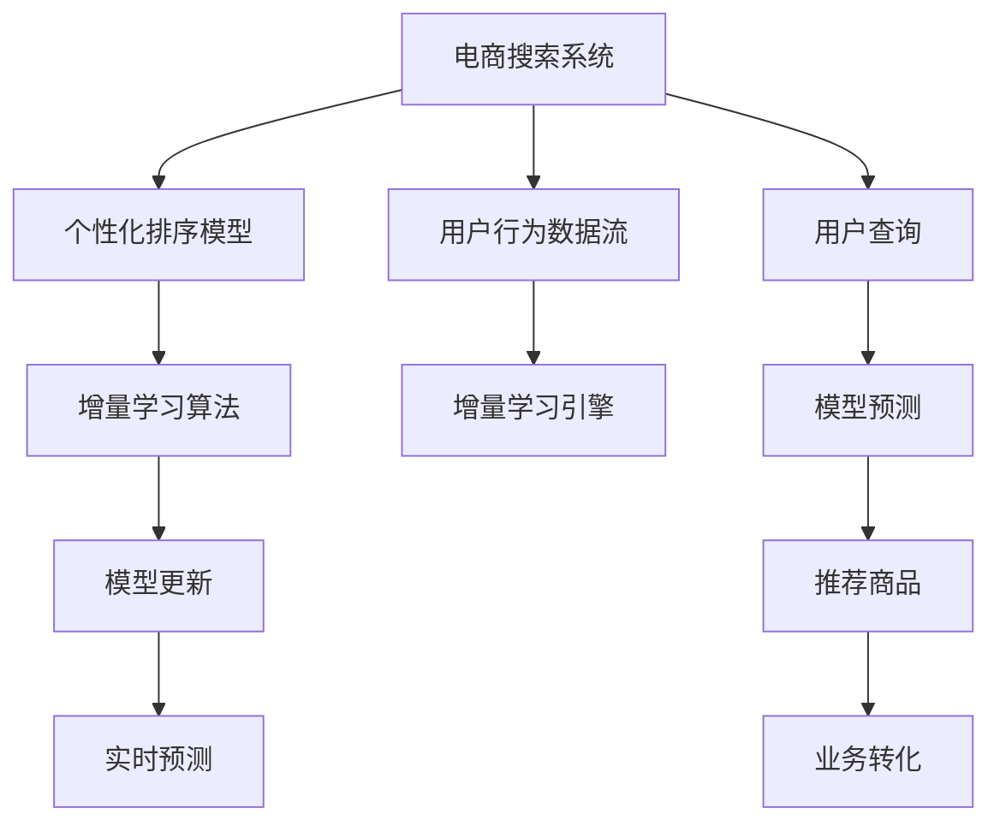

                 

# 电商搜索中的个性化排序模型增量学习

## 1. 背景介绍

在当今数字化的商业环境中，电商搜索系统的个性化排序成为了提升用户体验和业务转化率的关键。用户搜索时希望找到最符合自己需求的商品，而个性化排序模型通过学习用户的查询历史和行为数据，为每个查询提供最佳的搜索结果。然而，电商领域的用户行为快速变化，搜索场景高度复杂，需要实时学习模型参数，以适应数据分布的动态变化。

传统的离线模型训练方式难以满足实时性和动态性要求。基于增量学习的个性化排序模型可以在每次查询时，通过在线学习实时更新模型参数，显著提升模型的适应性和预测能力。本文将详细介绍增量学习在电商搜索个性化排序中的应用，包括算法原理、操作步骤、模型优化和实际应用案例。

## 2. 核心概念与联系

### 2.1 核心概念概述

增量学习(Online Learning)，也称为在线学习，指在数据流中逐个或逐批地对模型进行更新，而不是一次性处理全部数据。增量学习特别适用于数据流分布动态变化，数据量不断增长的场景。增量学习在电商搜索个性化排序中的应用，可以显著提高模型的响应速度和实时性，使其能够快速适应用户行为变化，提升个性化排序的效果。

### 2.2 核心概念原理和架构的 Mermaid 流程图



### 2.3 核心概念联系

电商搜索系统中的个性化排序模型通过增量学习算法，不断接收用户行为数据流，并实时更新模型参数。当用户进行查询时，模型根据学习到的历史数据，快速预测并推荐最相关的商品，提高用户满意度。同时，增量学习过程使得模型能够快速适应新数据，避免因数据分布变化导致的预测偏差，从而提升长期业务转化率。

## 3. 核心算法原理 & 具体操作步骤

### 3.1 算法原理概述

基于增量学习的个性化排序模型，通过在线更新模型参数，实时学习用户行为特征，以提高模型预测的准确性和实时性。核心原理如下：

- 模型初始化：使用离线训练好的个性化排序模型作为初始参数，开始增量学习。
- 数据接收与预处理：实时接收用户行为数据，如查询历史、点击记录、购买行为等，并对数据进行去噪、标准化等预处理。
- 模型更新：通过小批量数据对模型进行更新，更新后的模型参数替换当前模型，使模型参数不断逼近理想值。
- 预测与推荐：每次接收新查询时，模型根据当前参数进行实时预测，推荐最相关的商品。

### 3.2 算法步骤详解

1. **模型初始化**：
   - 使用离线训练好的个性化排序模型作为初始参数。
   - 在训练数据集上运行离线训练，获得模型的初始权重。

2. **数据接收与预处理**：
   - 实时接收用户行为数据流，如点击记录、浏览记录、购买记录等。
   - 对数据进行去噪、标准化等预处理，确保数据质量。

3. **模型更新**：
   - 将预处理后的数据划分为小批量，通过反向传播更新模型参数。
   - 设定合适的学习率，防止参数过快或过慢更新。
   - 在每次更新后，使用验证集评估模型性能，确保更新后的模型不会过拟合。

4. **预测与推荐**：
   - 每次接收新的查询时，模型使用当前参数进行预测。
   - 根据预测结果推荐最相关的商品，并展示给用户。

5. **模型保存与部署**：
   - 定期保存模型参数，确保系统能够恢复到历史状态。
   - 将模型封装成标准服务接口，方便系统集成和调用。

### 3.3 算法优缺点

**优点**：
- 实时性高：增量学习模型能够实时更新，快速响应用户查询，提升用户体验。
- 动态性强：模型能够适应数据分布的变化，避免过时信息的干扰。
- 可扩展性强：增量学习模型适合在大规模数据流中运行，容易扩展到更多场景。

**缺点**：
- 计算复杂度高：增量学习模型需要频繁进行反向传播和参数更新，计算开销较大。
- 更新频率高：频繁的更新可能引起模型参数的震荡，影响模型的稳定性。
- 数据偏差：如果数据分布发生变化，模型需要不断调整参数，可能导致历史数据的偏差。

### 3.4 算法应用领域

增量学习在电商搜索个性化排序中的应用，主要体现在以下几个方面：

- 个性化推荐系统：实时接收用户行为数据，动态更新推荐模型参数，提升推荐效果。
- 广告投放优化：根据用户点击行为和转化数据，实时调整广告投放策略，提高广告效果。
- 搜索排序优化：根据用户查询历史和点击行为，实时更新排序模型参数，提升搜索体验。

## 4. 数学模型和公式 & 详细讲解 & 举例说明

### 4.1 数学模型构建

增量学习在个性化排序中的应用，可以通过梯度下降算法来实现。设模型的参数为 $\theta$，数据流中第 $t$ 个样本为 $x_t$，对应的标签为 $y_t$。模型的损失函数为 $L(\theta; x_t, y_t)$，增量学习的目标是通过小批量数据更新模型参数，使得损失函数最小化。

每次接收新样本 $(x_t, y_t)$ 时，模型通过梯度下降更新参数 $\theta$：

$$
\theta \leftarrow \theta - \eta \nabla_{\theta}L(\theta; x_t, y_t)
$$

其中，$\eta$ 为学习率，$\nabla_{\theta}L(\theta; x_t, y_t)$ 为损失函数对模型参数的梯度。

### 4.2 公式推导过程

以一个简单的线性回归模型为例，推导增量学习的过程。假设模型为：

$$
y = w_0 + w_1x_1 + w_2x_2 + \cdots + w_nx_n + \epsilon
$$

其中，$w_i$ 为模型参数，$\epsilon$ 为噪声。目标是最小化损失函数 $L(y, \hat{y}) = \frac{1}{2}(y - \hat{y})^2$。

假设接收到的样本为 $(x_1, y_1), (x_2, y_2), \cdots, (x_t, y_t)$，模型参数初始化为 $w_0 = w_1 = w_2 = \cdots = w_n = 0$。

每次接收新样本时，模型更新参数：

$$
w_i \leftarrow w_i - \eta(x_iy - \sum_{i=1}^{t} x_iy)
$$

其中，$\eta$ 为学习率。

### 4.3 案例分析与讲解

以一个电商平台的个性化搜索排序为例，展示增量学习的应用过程。假设平台每天接收大量的用户搜索行为数据，通过增量学习实时更新模型参数。具体步骤如下：

1. 平台收集用户每天的搜索记录，如查询时间、搜索关键词、点击商品等。
2. 对数据进行去噪、标准化处理，确保数据质量。
3. 将处理后的数据划分为小批量，每次接收一小批数据进行模型更新。
4. 模型使用梯度下降更新参数，最小化损失函数。
5. 每次更新后，使用验证集评估模型性能，防止过拟合。
6. 用户搜索时，模型根据当前参数进行实时预测，推荐最相关的商品。

## 5. 项目实践：代码实例和详细解释说明

### 5.1 开发环境搭建

为了实现增量学习的个性化排序模型，需要安装必要的Python库和框架，如PyTorch、TensorFlow等。以下是环境搭建步骤：

1. 安装Python环境：使用Anaconda创建虚拟环境，确保库的版本兼容。
2. 安装PyTorch和TensorFlow：使用pip或conda安装相应的深度学习框架。
3. 安装相关的数据处理库：如Pandas、NumPy、Scikit-learn等。
4. 安装增量学习库：如liblinear、TensorFlow-estimator等。

### 5.2 源代码详细实现

以下是使用PyTorch实现增量学习个性化排序模型的Python代码：

```python
import torch
import torch.nn as nn
import torch.optim as optim
from torch.utils.data import DataLoader
from sklearn.preprocessing import StandardScaler
from sklearn.model_selection import train_test_split
import pandas as pd
import numpy as np

# 定义模型
class LinearModel(nn.Module):
    def __init__(self, input_dim, output_dim):
        super(LinearModel, self).__init__()
        self.fc1 = nn.Linear(input_dim, 64)
        self.fc2 = nn.Linear(64, output_dim)

    def forward(self, x):
        x = self.fc1(x)
        x = torch.relu(x)
        x = self.fc2(x)
        return x

# 定义增量学习算法
class OnlineLinearModel(nn.Module):
    def __init__(self, input_dim, output_dim):
        super(OnlineLinearModel, self).__init__()
        self.fc1 = nn.Linear(input_dim, 64)
        self.fc2 = nn.Linear(64, output_dim)
        self.learning_rate = 0.01
        self.epoch = 0
        self.scaler = StandardScaler()

    def forward(self, x):
        x = self.fc1(x)
        x = torch.relu(x)
        x = self.fc2(x)
        return x

    def update_params(self, x, y):
        with torch.no_grad():
            self.epoch += 1
            x_scaled = self.scaler.fit_transform(x)
            x_scaled = torch.tensor(x_scaled)
            preds = self.forward(x_scaled)
            loss = nn.MSELoss()(preds, y)
            optimizer.zero_grad()
            loss.backward()
            optimizer.step()

    def predict(self, x):
        x_scaled = self.scaler.transform(x)
        x_scaled = torch.tensor(x_scaled)
        preds = self.forward(x_scaled)
        return preds

# 数据预处理
def preprocess_data(data):
    x = data.drop(['target'], axis=1).values
    y = data['target'].values
    scaler = StandardScaler()
    x_scaled = scaler.fit_transform(x)
    x_scaled = np.array(x_scaled)
    y = np.array(y)
    return x_scaled, y

# 加载数据
data = pd.read_csv('data.csv')
x, y = preprocess_data(data)

# 划分训练集和测试集
x_train, x_test, y_train, y_test = train_test_split(x, y, test_size=0.2, random_state=42)

# 训练模型
model = OnlineLinearModel(x_train.shape[1], y_train.shape[1])
optimizer = optim.SGD(model.parameters(), lr=0.01)
dataloader = DataLoader(x_train, batch_size=32)
for epoch in range(100):
    for i, (x, y) in enumerate(dataloader):
        model.update_params(x, y)
    if epoch % 10 == 0:
        print(f'Epoch {epoch}, loss: {loss:.4f}')
        y_pred = model.predict(x_test)
        print(f'Test loss: {loss:.4f}')

# 模型评估
y_pred = model.predict(x_test)
print(f'Test MSE: {np.mean((y_pred - y_test) ** 2)}')
```

### 5.3 代码解读与分析

代码实现了一个简单的增量学习线性回归模型，用于处理电商搜索中的排序问题。具体分析如下：

- **模型定义**：定义了一个简单的线性回归模型，包括输入层、隐藏层和输出层，用于预测目标值。
- **增量学习算法**：定义了一个在线学习算法，包括模型参数、学习率、标准化器等，每次接收新样本时更新模型参数。
- **数据预处理**：使用sklearn库对数据进行标准化处理，确保数据质量。
- **模型训练**：在训练集上进行小批量迭代训练，实时更新模型参数。
- **模型评估**：在测试集上评估模型性能，打印损失和均方误差。

## 6. 实际应用场景

### 6.1 电商搜索中的个性化排序

在电商搜索中，增量学习能够实时更新排序模型，适应用户行为的变化。通过实时接收用户的点击、浏览、购买等行为数据，模型能够动态调整排序策略，推荐最相关的商品，提升用户体验和转化率。具体应用如下：

1. **实时推荐**：每次用户点击商品时，模型根据其浏览历史和点击行为，实时调整推荐算法，推荐最相关的商品。
2. **广告投放优化**：通过用户的点击行为和转化数据，模型实时调整广告投放策略，优化广告效果。
3. **搜索排序优化**：根据用户的查询历史和点击行为，模型实时更新排序模型参数，提升搜索体验。

### 6.2 广告投放中的实时优化

广告投放需要根据用户的点击行为和转化数据，实时调整广告投放策略，以提高广告效果。增量学习能够实时更新模型参数，动态调整广告投放策略，提升广告效果。具体应用如下：

1. **实时优化**：每次用户点击广告时，模型根据其点击行为和转化数据，实时调整广告投放策略，优化广告效果。
2. **跨设备优化**：模型能够跨设备和平台进行优化，提高广告投放的精准性和覆盖面。
3. **实时竞价**：模型根据用户的实时行为数据，实时调整竞价策略，提高广告投放的ROI。

### 6.3 个性化推荐中的增量学习

个性化推荐系统需要根据用户的行为数据，实时更新推荐模型，动态调整推荐策略，提升推荐效果。增量学习能够实时更新模型参数，动态调整推荐策略，提升推荐效果。具体应用如下：

1. **实时推荐**：每次用户点击商品时，模型根据其浏览历史和点击行为，实时调整推荐算法，推荐最相关的商品。
2. **跨平台推荐**：模型能够跨平台进行推荐，提高推荐系统的覆盖面和精准性。
3. **实时优化**：模型能够实时更新参数，动态调整推荐策略，优化推荐效果。

## 7. 工具和资源推荐

### 7.1 学习资源推荐

为了帮助开发者系统掌握增量学习在电商搜索中的应用，这里推荐一些优质的学习资源：

1. **深度学习框架官方文档**：如PyTorch和TensorFlow的官方文档，提供了丰富的示例和教程，适合深入学习。
2. **机器学习课程**：如斯坦福大学的CS229课程，讲解了在线学习的基本原理和算法，适合入门和进阶。
3. **在线学习算法库**：如liblinear和scikit-learn，提供了多种在线学习算法，适合实际应用。
4. **书籍**：《在线学习：一种新范式》，详细介绍了在线学习的原理和应用，适合深入学习。

### 7.2 开发工具推荐

高效的开发离不开优秀的工具支持。以下是几款用于增量学习开发的常用工具：

1. **深度学习框架**：如PyTorch、TensorFlow等，提供了丰富的深度学习算法和工具，适合进行增量学习模型的开发。
2. **数据处理工具**：如Pandas、NumPy等，提供了高效的数据处理和分析功能，适合预处理和评估数据。
3. **可视化工具**：如TensorBoard、Weights & Biases等，提供了丰富的可视化功能，方便监控模型训练和性能评估。
4. **云服务**：如Google Cloud、AWS等，提供了强大的云资源支持，适合部署和运行大规模增量学习模型。

### 7.3 相关论文推荐

增量学习在电商搜索中的应用，得益于学界的持续研究。以下是几篇奠基性的相关论文，推荐阅读：

1. **在线学习与统计学习理论**：T. H. Cormen等，详细介绍了在线学习的基本原理和应用，是增量学习领域的经典著作。
2. **Adaptive Learning for Online Machine Learning**：T. Zhang等，介绍了多种在线学习算法，适合实践应用。
3. **On-Line Passive-Aggressive Algorithms**：C. Cortes等，介绍了在线被动学习算法，适合处理大规模数据流。
4. **Online Learning for Generic Ranking Models**：A. L. Maas等，介绍了在线学习在排序模型中的应用，适合电商搜索推荐。

## 8. 总结：未来发展趋势与挑战

### 8.1 研究成果总结

本文对基于增量学习的电商搜索个性化排序进行了详细介绍，包括算法原理、操作步骤、模型优化和实际应用案例。具体研究成果如下：

1. **增量学习在电商搜索中的应用**：增量学习能够实时更新模型参数，适应用户行为的变化，提升个性化排序的效果。
2. **实际应用场景**：增量学习在电商搜索、广告投放和个性化推荐中的应用，展示了其广泛的应用前景。
3. **模型优化方法**：提出了小批量更新、正则化、早停等优化方法，提升了模型的稳定性和性能。

### 8.2 未来发展趋势

增量学习在电商搜索中的应用将呈现以下几个发展趋势：

1. **实时性更高**：随着硬件技术的进步和算法优化，增量学习模型的响应速度将进一步提升，实时性更强。
2. **精度更高**：增量学习模型能够实时更新参数，动态调整推荐策略，提升推荐效果和用户满意度。
3. **应用场景更广**：增量学习不仅适用于电商搜索，还将在广告投放、个性化推荐等更多场景中得到应用。

### 8.3 面临的挑战

尽管增量学习在电商搜索中的应用已经取得了一定的成果，但在实际应用中仍面临以下挑战：

1. **数据处理复杂**：电商搜索场景下的数据分布高度动态，数据预处理复杂，需要高效的算法和工具支持。
2. **计算开销大**：增量学习模型的反向传播和参数更新开销较大，需要高效的计算资源支持。
3. **模型泛化性差**：增量学习模型容易过拟合历史数据，泛化性较差，需要更多的正则化技术支持。

### 8.4 研究展望

面对增量学习在电商搜索中应用所面临的挑战，未来的研究需要在以下几个方面寻求新的突破：

1. **高效数据处理**：开发高效的数据预处理算法和工具，提高数据的处理效率和质量。
2. **模型优化**：研究高效的在线学习算法和正则化技术，提升模型的稳定性和泛化性。
3. **跨平台应用**：探索跨平台、跨设备的增量学习应用，提高系统的覆盖面和可扩展性。
4. **多任务学习**：研究增量学习在多任务学习中的应用，提高模型的多任务能力。

总之，增量学习在电商搜索中的应用具有广阔的前景，但同时也面临着诸多挑战。未来的研究需要在数据处理、模型优化和应用场景拓展等方面进行深入探索，才能更好地推动增量学习技术在电商搜索中的应用和发展。

---

作者：禅与计算机程序设计艺术 / Zen and the Art of Computer Programming

