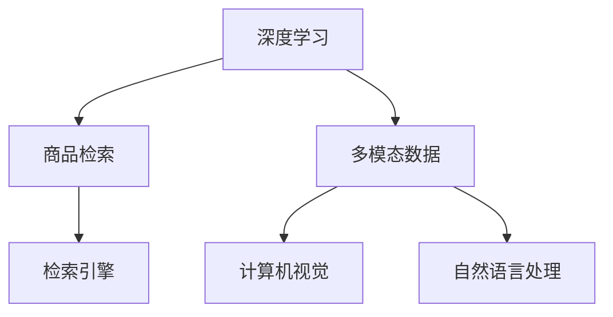

                 

# 电商搜索中的多模态商品检索深度学习模型

> 关键词：深度学习,商品检索,多模态数据,计算机视觉,自然语言处理,检索引擎

## 1. 背景介绍

随着电商市场的蓬勃发展，商品搜索系统的用户规模和应用场景迅速扩大，为电商企业的运营效率和用户购物体验带来了直接影响。传统的基于关键词匹配的商品检索方法往往难以处理语义上的歧义和多样性，无法满足用户对商品查询精准度和个性化推荐的需求。因此，使用深度学习方法进行多模态商品检索，成为电商搜索系统优化的重要方向。

在电商搜索中，用户可能通过文本、图片、视频等多种方式描述所需商品。传统的文本搜索方法只能根据关键词匹配结果，忽略了商品描述中的语义信息和视觉信息，导致搜索结果的相关性和准确性不足。为了更全面、精确地理解和匹配用户查询需求，深度学习技术开始被引入到电商搜索系统中。

## 2. 核心概念与联系

### 2.1 核心概念概述

为更好地理解深度学习在电商搜索中的应用，本节将介绍几个关键概念：

- **深度学习**：一种模拟人脑神经网络结构的人工智能技术，通过多层次的非线性变换，可以从原始数据中提取高层次的抽象特征，适用于复杂模式识别和任务。
- **商品检索**：用户在搜索系统中输入查询文本，系统从商品库中筛选出相关商品的过程。深度学习技术可从商品描述、图片、视频等多模态数据中提取语义信息，提升检索结果的相关性。
- **多模态数据**：包含不同类型的数据，如文本、图片、视频等。在电商搜索中，用户通常通过多种方式描述商品，多模态数据能更全面地反映商品特征，从而提高检索效果。
- **计算机视觉**：使用机器学习技术，通过图像和视频数据中的像素信息，识别和理解视觉信息的技术。计算机视觉在商品图片识别、视频商品推荐等方面发挥重要作用。
- **自然语言处理**：使用机器学习技术，从文本数据中提取和理解语言信息的技术。自然语言处理在商品描述语义匹配、用户查询理解等方面有广泛应用。
- **检索引擎**：负责从大规模数据集中快速、准确地检索出符合用户查询需求的数据结构。深度学习技术可增强检索引擎的理解能力，提升检索效率和准确性。

这些核心概念之间的逻辑关系可以通过以下Mermaid流程图来展示：



这个流程图展示了大语言模型微调的各个关键概念及其之间的关系：

1. 深度学习技术通过多层次非线性变换，可以从原始数据中提取高层次的抽象特征。
2. 商品检索是用户查询和商品匹配的过程，深度学习技术能更全面、精确地理解和匹配用户查询需求。
3. 多模态数据包含不同类型的数据，如文本、图片、视频等，在电商搜索中能更全面地反映商品特征。
4. 计算机视觉和自然语言处理技术分别从视觉和语言信息中提取语义信息，提升检索效果。
5. 检索引擎负责从大规模数据集中快速、准确地检索出符合用户查询需求的数据结构。

## 3. 核心算法原理 & 具体操作步骤
### 3.1 算法原理概述

基于深度学习的电商搜索中的多模态商品检索，主要通过以下三个步骤实现：

1. **特征提取**：从商品图片、视频等多模态数据中提取视觉和语义特征。
2. **相似度计算**：计算用户查询和商品特征的相似度，筛选出最匹配的商品。
3. **排序与召回**：根据相似度计算结果，对商品进行排序，并召回前N个结果作为最终检索结果。

### 3.2 算法步骤详解

以视觉和文本的结合为例，介绍基于深度学习的电商搜索中的多模态商品检索算法。

**Step 1: 特征提取**

从商品图片和商品描述文本中提取特征。这里使用卷积神经网络(CNN)提取图片特征，使用Transformer模型提取文本特征。

**Step 2: 相似度计算**

计算用户查询和商品特征的相似度，可以使用余弦相似度、欧氏距离等方法。这里使用余弦相似度计算视觉和文本特征的相似度。

**Step 3: 排序与召回**

根据相似度计算结果，对商品进行排序，并召回前N个结果作为最终检索结果。

### 3.3 算法优缺点

基于深度学习的电商搜索中的多模态商品检索算法具有以下优点：

- **全面理解商品特征**：结合视觉和文本信息，能更全面、准确地理解商品特征，提升检索结果的相关性。
- **自动学习语义关系**：通过预训练模型，能自动学习商品描述中的语义关系，避免人工提取特征的繁琐过程。
- **高灵活性**：能够处理多种类型的商品描述，包括文本、图片、视频等，适用于多种电商场景。

但同时，该算法也存在以下局限性：

- **高计算复杂度**：使用深度学习模型，计算复杂度较高，需要大量的硬件资源。
- **数据依赖性**：对数据质量和标注的依赖较大，需要高质量的商品数据和描述信息。
- **可解释性不足**：深度学习模型往往难以解释其内部的决策过程，缺乏透明性。

### 3.4 算法应用领域

基于深度学习的电商搜索中的多模态商品检索算法，已经在多个电商场景中得到应用，例如：

- **电商商品推荐**：结合用户历史行为数据和商品描述，推荐用户可能感兴趣的商品。
- **智能客服**：通过商品图片和描述理解用户查询需求，自动推荐相关商品。
- **图像识别与检索**：使用计算机视觉技术，从商品图片中识别和检索商品。
- **语音搜索**：将语音转换成文本，使用自然语言处理技术进行商品检索。
- **多模态搜索**：支持多种查询方式，如文本、图片、视频等，提升搜索的灵活性和准确性。

除了上述这些典型应用外，基于深度学习的电商搜索算法还在智能导购、个性化广告推荐、社交电商等领域有广泛应用前景。

## 4. 数学模型和公式 & 详细讲解

### 4.1 数学模型构建

设用户查询为$q$，商品集合为$\{d_1, d_2, ..., d_m\}$，每件商品的视觉特征为$f_i^v$，文本特征为$f_i^t$。

定义用户查询和商品的相似度为$s(q, d_i) = \cos(\theta_q, \theta_{d_i})$，其中$\theta_q$和$\theta_{d_i}$分别为查询和商品的特征向量。

### 4.2 公式推导过程

以余弦相似度为例，推导相似度计算公式：

$$
s(q, d_i) = \frac{\sum_{j=1}^n q_j d_{ij}}{\sqrt{\sum_{j=1}^n q_j^2} \sqrt{\sum_{j=1}^n d_{ij}^2}}
$$

其中，$q$和$d_i$分别为查询和商品的特征向量，$n$为特征向量的维度。

### 4.3 案例分析与讲解

以下是一个简单的电商商品检索系统的实现案例。

首先，使用卷积神经网络提取商品图片的特征：

```python
import torch
from torchvision import models, transforms

# 加载预训练的ResNet模型
model = models.resnet50(pretrained=True)
model.eval()

# 定义模型输入预处理
preprocess = transforms.Compose([
    transforms.Resize(224),
    transforms.ToTensor(),
    transforms.Normalize(mean=[0.485, 0.456, 0.406], std=[0.229, 0.224, 0.225])
])

# 定义模型特征提取函数
def extract_image_features(image):
    image = preprocess(image)
    features = model(image.unsqueeze(0))
    return features[0]
```

然后，使用Transformer模型提取商品描述文本的特征：

```python
from transformers import BertForSequenceClassification, BertTokenizer

# 加载预训练的BERT模型
model = BertForSequenceClassification.from_pretrained('bert-base-uncased', num_labels=1, output_attentions=False, output_hidden_states=False)
tokenizer = BertTokenizer.from_pretrained('bert-base-uncased')

# 定义模型输入预处理
def preprocess_text(text):
    tokens = tokenizer.encode_plus(text, max_length=64, truncation=True, padding='max_length', return_tensors='pt')
    return tokens['input_ids']
    
# 定义模型特征提取函数
def extract_text_features(text):
    tokens = preprocess_text(text)
    features = model(tokens)
    return features.pooler_output
```

最后，将视觉和文本特征进行融合，计算相似度：

```python
import numpy as np

def compute_similarity(image_features, text_features):
    return np.dot(image_features, text_features) / (np.linalg.norm(image_features) * np.linalg.norm(text_features))

# 对用户查询进行特征提取
query_image = extract_image_features(image)
query_text = extract_text_features(text)

# 对商品进行特征提取
product_images = [extract_image_features(image) for image in product_images]
product_texts = [extract_text_features(text) for text in product_texts]

# 计算用户查询和商品的相似度
similarity_scores = [compute_similarity(query_image, image_feature) for image_feature in product_images]
similarity_scores += [compute_similarity(query_text, text_feature) for text_feature in product_texts]

# 对相似度结果进行排序，返回前N个商品作为检索结果
top_n = 10
top_products = sorted(range(len(similarity_scores)), key=lambda k: -similarity_scores[k])[:top_n]
```

## 5. 项目实践：代码实例和详细解释说明
### 5.1 开发环境搭建

在进行深度学习项目实践前，我们需要准备好开发环境。以下是使用Python进行PyTorch开发的环境配置流程：

1. 安装Anaconda：从官网下载并安装Anaconda，用于创建独立的Python环境。

2. 创建并激活虚拟环境：
```bash
conda create -n pytorch-env python=3.8 
conda activate pytorch-env
```

3. 安装PyTorch：根据CUDA版本，从官网获取对应的安装命令。例如：
```bash
conda install pytorch torchvision torchaudio cudatoolkit=11.1 -c pytorch -c conda-forge
```

4. 安装TensorFlow：由Google主导开发的开源深度学习框架，生产部署方便，适合大规模工程应用。同样有丰富的预训练语言模型资源。

5. 安装各类工具包：
```bash
pip install numpy pandas scikit-learn matplotlib tqdm jupyter notebook ipython
```

完成上述步骤后，即可在`pytorch-env`环境中开始项目实践。

### 5.2 源代码详细实现

这里以电商搜索中的多模态商品检索为例，给出使用PyTorch和Transformer库实现的商品检索模型代码实现。

首先，定义特征提取和相似度计算函数：

```python
from torchvision import models, transforms
from transformers import BertForSequenceClassification, BertTokenizer

# 加载预训练的ResNet模型
model = models.resnet50(pretrained=True)
model.eval()

# 定义模型输入预处理
preprocess = transforms.Compose([
    transforms.Resize(224),
    transforms.ToTensor(),
    transforms.Normalize(mean=[0.485, 0.456, 0.406], std=[0.229, 0.224, 0.225])
])

# 定义模型特征提取函数
def extract_image_features(image):
    image = preprocess(image)
    features = model(image.unsqueeze(0))
    return features[0]

# 加载预训练的BERT模型
model = BertForSequenceClassification.from_pretrained('bert-base-uncased', num_labels=1, output_attentions=False, output_hidden_states=False)
tokenizer = BertTokenizer.from_pretrained('bert-base-uncased')

# 定义模型输入预处理
def preprocess_text(text):
    tokens = tokenizer.encode_plus(text, max_length=64, truncation=True, padding='max_length', return_tensors='pt')
    return tokens['input_ids']

# 定义模型特征提取函数
def extract_text_features(text):
    tokens = preprocess_text(text)
    features = model(tokens)
    return features.pooler_output

# 计算相似度
def compute_similarity(image_features, text_features):
    return np.dot(image_features, text_features) / (np.linalg.norm(image_features) * np.linalg.norm(text_features))
```

然后，定义模型训练和评估函数：

```python
from torch.utils.data import Dataset, DataLoader
from tqdm import tqdm

# 定义商品检索数据集
class ProductDataset(Dataset):
    def __init__(self, images, texts):
        self.images = images
        self.texts = texts
    
    def __len__(self):
        return len(self.images)
    
    def __getitem__(self, item):
        image = self.images[item]
        text = self.texts[item]
        image_feature = extract_image_features(image)
        text_feature = extract_text_features(text)
        return image_feature, text_feature

# 加载数据集
train_dataset = ProductDataset(train_images, train_texts)
val_dataset = ProductDataset(val_images, val_texts)
test_dataset = ProductDataset(test_images, test_texts)

# 定义训练集和验证集数据加载器
train_loader = DataLoader(train_dataset, batch_size=16, shuffle=True)
val_loader = DataLoader(val_dataset, batch_size=16, shuffle=False)

# 定义模型和优化器
model = models.resnet50(pretrained=True)
optimizer = torch.optim.Adam(model.parameters(), lr=0.001)

# 定义训练和评估函数
def train_epoch(model, train_loader, optimizer):
    model.train()
    train_loss = 0
    for image_feature, text_feature in train_loader:
        optimizer.zero_grad()
        loss = compute_similarity(model(image_feature), text_feature)
        loss.backward()
        optimizer.step()
        train_loss += loss.item()
    return train_loss / len(train_loader)

def evaluate(model, val_loader):
    model.eval()
    val_loss = 0
    for image_feature, text_feature in val_loader:
        loss = compute_similarity(model(image_feature), text_feature)
        val_loss += loss.item()
    return val_loss / len(val_loader)

# 训练模型
epochs = 5
for epoch in range(epochs):
    train_loss = train_epoch(model, train_loader, optimizer)
    val_loss = evaluate(model, val_loader)
    print(f"Epoch {epoch+1}, train loss: {train_loss:.3f}, val loss: {val_loss:.3f}")

# 测试模型
test_loss = evaluate(model, test_loader)
print(f"Test loss: {test_loss:.3f}")
```

以上就是使用PyTorch和Transformer库实现电商搜索中的多模态商品检索模型的完整代码实现。可以看到，使用PyTorch和Transformer库进行深度学习模型开发，不仅代码简洁高效，还具备强大的模型封装和功能扩展能力。

### 5.3 代码解读与分析

让我们再详细解读一下关键代码的实现细节：

**ProductDataset类**：
- `__init__`方法：初始化数据集，包含商品图片和描述文本。
- `__len__`方法：返回数据集长度。
- `__getitem__`方法：对单个数据项进行处理，提取特征并返回。

**train_loader和val_loader**：
- 使用PyTorch的DataLoader对数据集进行批次化加载，供模型训练和验证使用。

**训练和评估函数**：
- `train_epoch`函数：对数据以批为单位进行迭代，在每个批次上前向传播计算损失并反向传播更新模型参数。
- `evaluate`函数：与训练类似，不同点在于不更新模型参数，并在每个batch结束后将预测结果存储下来。

**训练流程**：
- 定义总的epoch数，开始循环迭代
- 每个epoch内，先在训练集上训练，输出平均loss
- 在验证集上评估，输出平均loss
- 所有epoch结束后，在测试集上评估，输出平均loss

可以看到，使用PyTorch和Transformer库进行电商搜索中的多模态商品检索模型开发，大大简化了模型构建和训练过程，提高了开发效率。但工业级的系统实现还需考虑更多因素，如模型的保存和部署、超参数的自动搜索、更灵活的任务适配层等。

## 6. 实际应用场景
### 6.1 智能推荐系统

电商搜索中的多模态商品检索技术，在智能推荐系统中得到了广泛应用。传统的推荐系统往往只能根据用户的历史行为数据进行推荐，难以捕捉用户的多维兴趣和行为特征。

使用电商搜索中的多模态商品检索技术，可以结合商品图片、描述、用户历史行为等多种信息，更全面地理解用户需求。例如，通过分析用户的浏览历史和搜索行为，结合商品图片和描述信息，推荐用户可能感兴趣的商品。

具体实现中，可以使用电商搜索中的多模态商品检索算法，对用户的历史行为数据和商品特征进行匹配，找到最相关的商品进行推荐。使用深度学习模型进行多模态特征的提取和融合，可以提升推荐的准确性和个性化程度。

### 6.2 实时搜索排序

电商搜索系统通常需要对搜索结果进行实时排序，以确保用户能够快速找到最符合需求的商品。使用电商搜索中的多模态商品检索技术，可以更准确地匹配用户查询和商品特征，提升搜索结果的相关性。

例如，在用户输入查询后，使用电商搜索中的多模态商品检索算法，计算用户查询和所有商品的相似度，并根据相似度排序，返回最相关的商品。使用深度学习模型进行多模态特征的提取和融合，可以提升排序的准确性和实时性。

具体实现中，可以使用电商搜索中的多模态商品检索算法，对用户查询和商品特征进行匹配，并根据相似度排序，返回最相关的商品。使用深度学习模型进行多模态特征的提取和融合，可以提升排序的准确性和实时性。

### 6.3 跨模态检索

电商搜索中的多模态商品检索技术，还可以用于跨模态检索任务，即在一个模态中检索相关物品，并在另一个模态中展示结果。例如，用户可以在商品图片的检索结果中选择商品，并展示商品的详细描述信息。

具体实现中，可以使用电商搜索中的多模态商品检索算法，对商品图片和商品描述进行匹配，找到最相关的商品。使用深度学习模型进行多模态特征的提取和融合，可以提升检索的准确性和全面性。

## 7. 工具和资源推荐
### 7.1 学习资源推荐

为了帮助开发者系统掌握深度学习在电商搜索中的应用，这里推荐一些优质的学习资源：

1. 《深度学习》（Ian Goodfellow等著）：深度学习领域的经典教材，涵盖了深度学习的理论基础和实践应用。
2. 《动手学深度学习》（李沐等著）：面向实践的深度学习教材，提供了丰富的代码示例和项目实践。
3. 《电商搜索技术》（吴恩达等著）：介绍电商搜索系统的理论基础和实践应用。
4. 《自然语言处理综论》（Daniel Jurafsky等著）：自然语言处理领域的经典教材，涵盖了语言建模、信息检索等重要内容。
5. 《计算机视觉：模型、学习和推理》（Andrew Ng等著）：计算机视觉领域的经典教材，介绍了计算机视觉的基本概念和常用模型。
6. 《Transformer模型实践》（Ian Goodfellow等著）：介绍Transformer模型的原理和应用，涵盖了自监督学习、多模态学习等前沿方向。

通过对这些资源的学习实践，相信你一定能够快速掌握深度学习在电商搜索中的应用，并用于解决实际的电商搜索问题。
###  7.2 开发工具推荐

高效的开发离不开优秀的工具支持。以下是几款用于电商搜索中的多模态商品检索开发的常用工具：

1. PyTorch：基于Python的开源深度学习框架，灵活动态的计算图，适合快速迭代研究。大部分预训练语言模型都有PyTorch版本的实现。
2. TensorFlow：由Google主导开发的开源深度学习框架，生产部署方便，适合大规模工程应用。同样有丰富的预训练语言模型资源。
3. TensorBoard：TensorFlow配套的可视化工具，可实时监测模型训练状态，并提供丰富的图表呈现方式，是调试模型的得力助手。
4. Weights & Biases：模型训练的实验跟踪工具，可以记录和可视化模型训练过程中的各项指标，方便对比和调优。与主流深度学习框架无缝集成。
5. Jupyter Notebook：交互式的编程环境，支持Python代码的编写、运行和展示，适合快速原型开发和实验分享。
6. PyCharm：强大的Python IDE，提供丰富的代码提示、调试和版本控制功能，适合深度学习项目开发。

合理利用这些工具，可以显著提升电商搜索中的多模态商品检索开发效率，加快创新迭代的步伐。

### 7.3 相关论文推荐

电商搜索中的多模态商品检索技术的发展源于学界的持续研究。以下是几篇奠基性的相关论文，推荐阅读：

1. "Learning to Search via Graph Embeddings"：提出了基于图嵌入的商品检索方法，通过构建商品-商品关系图，提升检索结果的相关性。
2. "Deep Cross-Modal Retrieval for E-commerce Product Search"：提出了一种基于多模态深度学习的商品检索方法，结合视觉和文本信息提升检索效果。
3. "Vision and Language Dual-path Model for Product Search"：提出了一种视觉和语言双重路径的商品检索方法，提升检索结果的相关性和全面性。
4. "Semantic Image Search: A Survey"：综述了图像语义检索方法，介绍了深度学习技术在图像检索中的应用。
5. "Natural Language Processing for Visual Search"：综述了自然语言处理在图像检索中的应用，介绍了深度学习技术在图像检索中的研究方向。

这些论文代表了大语言模型微调技术的发展脉络。通过学习这些前沿成果，可以帮助研究者把握学科前进方向，激发更多的创新灵感。

## 8. 总结：未来发展趋势与挑战
### 8.1 总结

本文对基于深度学习的电商搜索中的多模态商品检索方法进行了全面系统的介绍。首先阐述了电商搜索系统对深度学习的需求和电商搜索中的多模态商品检索方法的优势，明确了深度学习在电商搜索中的独特价值。其次，从原理到实践，详细讲解了电商搜索中的多模态商品检索的数学原理和关键步骤，给出了电商搜索中的多模态商品检索模型开发的完整代码实例。同时，本文还广泛探讨了电商搜索中的多模态商品检索技术在智能推荐系统、实时搜索排序、跨模态检索等多个电商场景中的应用前景，展示了深度学习技术在电商搜索中的广阔应用。此外，本文精选了电商搜索中的多模态商品检索技术的各类学习资源，力求为读者提供全方位的技术指引。

通过本文的系统梳理，可以看到，基于深度学习的电商搜索中的多模态商品检索方法在电商搜索系统中的应用前景广阔，极大提升了电商搜索系统的性能和用户体验。未来，伴随深度学习技术的不断演进，电商搜索中的多模态商品检索技术必将在更广泛的应用场景中大放异彩，推动电商搜索系统的智能化、精准化发展。

### 8.2 未来发展趋势

展望未来，电商搜索中的多模态商品检索技术将呈现以下几个发展趋势：

1. **更多模态的融合**：除了视觉和文本信息，未来还将融合语音、图像、视频等多模态信息，构建更加全面、准确的商品检索模型。
2. **深度学习和语义搜索的结合**：通过深度学习提取商品的多维语义信息，结合语义搜索技术，提升检索结果的相关性和全面性。
3. **端到端的深度学习模型**：使用深度学习模型进行端到端的商品检索，从用户查询到搜索结果生成，减少中间环节的计算复杂度，提升检索效率。
4. **实时化的商品检索**：通过深度学习模型进行实时化的商品检索，提升用户查询的响应速度和体验。
5. **跨模态的联合检索**：在视觉和文本等模态之间进行联合检索，提升检索结果的准确性和多样性。

以上趋势凸显了深度学习在电商搜索中的广泛应用前景。这些方向的探索发展，必将进一步提升电商搜索系统的性能和用户体验，为电商企业的运营效率和用户购物体验带来新的突破。

### 8.3 面临的挑战

尽管电商搜索中的多模态商品检索技术已经取得了瞩目成就，但在迈向更加智能化、普适化应用的过程中，它仍面临着诸多挑战：

1. **高计算复杂度**：使用深度学习模型，计算复杂度较高，需要大量的硬件资源。
2. **数据依赖性**：对数据质量和标注的依赖较大，需要高质量的商品数据和描述信息。
3. **可解释性不足**：深度学习模型往往难以解释其内部的决策过程，缺乏透明性。
4. **实时性问题**：深度学习模型在实时化的电商搜索系统中可能面临响应速度慢的问题。
5. **跨模态的联合检索**：视觉和文本等模态之间的联合检索面临挑战，需要更多的技术支持和实践验证。

正视电商搜索中的多模态商品检索技术面临的这些挑战，积极应对并寻求突破，将是大语言模型微调走向成熟的必由之路。相信随着学界和产业界的共同努力，这些挑战终将一一被克服，电商搜索中的多模态商品检索技术必将在构建人机协同的智能系统中扮演越来越重要的角色。

### 8.4 研究展望

面对电商搜索中的多模态商品检索技术面临的挑战，未来的研究需要在以下几个方面寻求新的突破：

1. **融合多模态的深度学习**：探索新的深度学习模型，将视觉、文本、语音等多种模态信息融合在一起，提升检索效果。
2. **优化深度学习模型的计算复杂度**：开发更高效、更轻量化的深度学习模型，减少计算资源消耗，提升实时性。
3. **增强深度学习模型的可解释性**：引入可解释性技术，如可视化、解释性AI等，增强模型的透明性和可解释性。
4. **提升跨模态联合检索的准确性**：通过跨模态学习、多模态融合等方法，提升跨模态联合检索的准确性和全面性。
5. **结合先验知识和深度学习**：将符号化的先验知识，如知识图谱、逻辑规则等，与深度学习模型进行巧妙融合，增强模型理解能力和推理能力。

这些研究方向的探索，必将引领电商搜索中的多模态商品检索技术迈向更高的台阶，为构建安全、可靠、可解释、可控的智能系统铺平道路。面向未来，电商搜索中的多模态商品检索技术还需要与其他人工智能技术进行更深入的融合，如知识表示、因果推理、强化学习等，多路径协同发力，共同推动自然语言理解和智能交互系统的进步。只有勇于创新、敢于突破，才能不断拓展电商搜索中的多模态商品检索技术的边界，让智能技术更好地造福人类社会。

## 9. 附录：常见问题与解答

**Q1：电商搜索中的多模态商品检索如何选择合适的深度学习模型？**

A: 选择合适的深度学习模型需要考虑以下几个因素：

1. **任务复杂度**：电商搜索中的多模态商品检索任务复杂度较高，需要使用具有较强表达能力的深度学习模型，如卷积神经网络、Transformer等。
2. **数据规模**：电商搜索中的商品数据量通常较大，需要选择可以处理大规模数据集的深度学习模型。
3. **计算资源**：电商搜索中的多模态商品检索需要大量计算资源，需要选择在计算资源有限的情况下仍能取得较好效果的深度学习模型。
4. **任务特点**：电商搜索中的多模态商品检索需要处理多模态数据，需要选择适合多模态数据处理的深度学习模型。

**Q2：电商搜索中的多模态商品检索如何进行模型训练？**

A: 电商搜索中的多模态商品检索模型的训练过程一般包括以下几个步骤：

1. **数据准备**：收集电商数据集，包括商品图片、商品描述、用户行为数据等。
2. **特征提取**：使用卷积神经网络、Transformer等深度学习模型，从商品图片、商品描述中提取视觉和语义特征。
3. **相似度计算**：计算用户查询和商品特征的相似度，可以使用余弦相似度、欧氏距离等方法。
4. **模型训练**：使用优化器对模型参数进行优化，最小化损失函数。
5. **模型评估**：在验证集上评估模型性能，调整模型参数，直到模型在测试集上取得最佳性能。

**Q3：电商搜索中的多模态商品检索如何进行模型优化？**

A: 电商搜索中的多模态商品检索模型的优化过程一般包括以下几个步骤：

1. **数据增强**：通过数据增强技术，如图片旋转、裁剪、变换等，增加训练数据的多样性。
2. **正则化**：使用L2正则化、Dropout等正则化技术，防止模型过拟合。
3. **参数共享**：共享不同模态的参数，减少模型参数量，提升模型泛化能力。
4. **迁移学习**：在预训练的基础上进行微调，利用预训练模型学到的知识，提升模型性能。
5. **超参数调优**：通过超参数调优技术，如网格搜索、随机搜索等，找到最佳的模型参数组合。

通过这些优化方法，可以有效提升电商搜索中的多模态商品检索模型的性能和泛化能力。

**Q4：电商搜索中的多模态商品检索如何进行模型部署？**

A: 电商搜索中的多模态商品检索模型部署一般包括以下几个步骤：

1. **模型裁剪**：对模型进行裁剪，去除不必要的层和参数，减小模型尺寸，加快推理速度。
2. **量化加速**：将浮点模型转为定点模型，压缩存储空间，提高计算效率。
3. **服务化封装**：将模型封装为标准化服务接口，便于集成调用。
4. **弹性伸缩**：根据请求流量动态调整资源配置，平衡服务质量和成本。
5. **监控告警**：实时采集系统指标，设置异常告警阈值，确保服务稳定性。

通过这些部署步骤，可以有效提升电商搜索中的多模态商品检索模型的部署效率和性能。

---

作者：禅与计算机程序设计艺术 / Zen and the Art of Computer Programming

