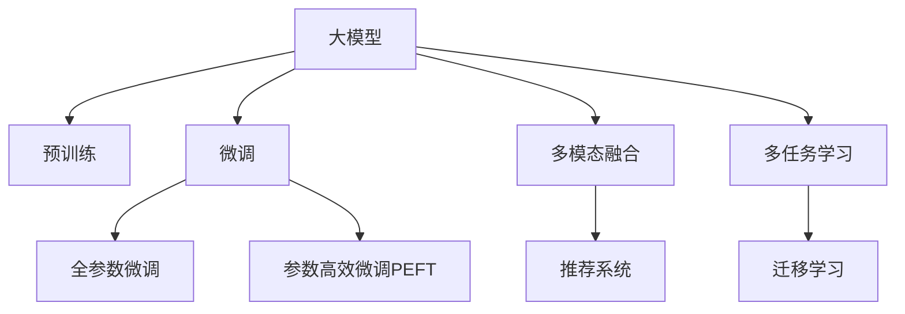

                 

# 电商搜索中的情感分析：AI大模型方案

> 关键词：电商搜索,情感分析,大模型,深度学习,自然语言处理(NLP),多模态融合,推荐系统

## 1. 背景介绍

### 1.1 问题由来
在当今数字经济时代，电商平台作为连接消费者和商家的重要桥梁，其搜索体验对用户体验和转化率具有重要影响。搜索中的情感分析是优化用户体验、提升搜索效果的关键环节。情感分析不仅可以帮助电商平台理解用户对搜索结果的态度，还能用于改进搜索算法，提供更加符合用户情感需求的搜索结果。

传统的情感分析方法依赖于人工标注的数据集，训练成本高、效率低，难以应对大规模、高复杂度的电商搜索场景。而基于人工智能大模型的情感分析方法，利用其在处理海量文本数据上的强大能力，可以显著降低标注成本，提升情感分析的准确性和时效性。

### 1.2 问题核心关键点
电商搜索中的情感分析，关键在于如何高效、准确地理解用户对搜索结果的情感倾向。主要包括以下几个核心问题：
- 数据收集与预处理：如何构建高质量、多样化的电商搜索数据集，并进行有效的文本清洗和标准化。
- 模型选择与优化：如何选择适合电商搜索场景的情感分析模型，并进行高效的微调。
- 多模态融合：如何将电商搜索中的多模态信息（如文本、图片、评分等）融合到情感分析模型中，提升模型效果。
- 推荐系统集成：如何将情感分析结果应用于电商推荐系统中，实现个性化推荐。

这些问题的解决，将极大地提升电商平台的搜索体验和推荐效果。

### 1.3 问题研究意义
电商搜索中的情感分析，对于提升用户体验、增加用户粘性、优化运营策略具有重要意义：
- 提升用户体验：通过理解用户对搜索结果的情感反馈，电商平台可以及时调整搜索算法，优化搜索排序，提供更加符合用户期望的搜索结果。
- 增加用户粘性：对搜索结果进行情感分析，可以识别出用户满意或不满意的商品，并及时进行反馈和改进，从而增加用户的满意度和忠诚度。
- 优化运营策略：通过情感分析，电商平台可以获得用户对不同商品和服务的情感反馈，用于优化产品组合、促销策略等，提升整体运营效率和盈利能力。

因此，研究电商搜索中的情感分析问题，对于电商平台实现智能化、个性化的用户服务具有重要价值。

## 2. 核心概念与联系

### 2.1 核心概念概述

为更好地理解基于大模型的电商搜索情感分析方法，本节将介绍几个密切相关的核心概念：

- 大模型：如BERT、GPT等，经过大规模无标签文本预训练，具备强大的语言理解和生成能力。
- 预训练：在无标签文本数据上进行自监督学习，学习通用语言表示。
- 微调：基于有标签数据对大模型进行任务特定优化，提升模型在特定任务上的性能。
- 多模态融合：将不同模态（如文本、图片、评分等）信息整合到模型中，提升模型效果。
- 推荐系统：通过用户行为、商品属性、情感反馈等信息，实现个性化推荐。
- 多任务学习：在同一个模型中同时优化多个任务，提升模型多任务处理能力。
- 迁移学习：在某个任务上预训练的模型，可以迁移到另一个相关任务上进行微调。

这些核心概念之间的逻辑关系可以通过以下Mermaid流程图来展示：



这个流程图展示了大模型及其与电商搜索情感分析相关的核心概念的逻辑关系：

1. 大模型通过预训练获得基础能力。
2. 微调是对预训练模型进行任务特定的优化，可以提升模型在特定任务上的性能。
3. 多模态融合将不同模态的信息整合到模型中，进一步提升模型效果。
4. 推荐系统将情感分析结果应用于个性化推荐，优化用户购物体验。
5. 多任务学习和迁移学习可以提升模型在多个任务上的泛化能力，更好地适应电商搜索场景。

## 3. 核心算法原理 & 具体操作步骤

### 3.1 算法原理概述

基于大模型的电商搜索情感分析，本质上是一个有监督的细粒度迁移学习过程。其核心思想是：将预训练的大模型视作一个强大的"情感特征提取器"，通过电商搜索任务的有监督数据对其进行微调，使其能够学习到用户对搜索结果的情感倾向，从而提升模型的情感分析效果。

形式化地，假设预训练模型为 $M_{\theta}$，其中 $\theta$ 为预训练得到的模型参数。给定电商搜索任务 $T$ 的标注数据集 $D=\{(x_i,y_i)\}_{i=1}^N, x_i \in \mathcal{X}, y_i \in \mathcal{Y}$，微调的目标是找到新的模型参数 $\hat{\theta}$，使得：

$$
\hat{\theta}=\mathop{\arg\min}_{\theta} \mathcal{L}(M_{\theta},D)
$$

其中 $\mathcal{L}$ 为针对任务 $T$ 设计的损失函数，用于衡量模型预测输出与真实标签之间的差异。常见的损失函数包括交叉熵损失、均方误差损失等。

通过梯度下降等优化算法，微调过程不断更新模型参数 $\theta$，最小化损失函数 $\mathcal{L}$，使得模型输出逼近真实标签。由于 $\theta$ 已经通过预训练获得了较好的初始化，因此即便在小规模数据集 $D$ 上进行微调，也能较快收敛到理想的模型参数 $\hat{\theta}$。

### 3.2 算法步骤详解

基于大模型的电商搜索情感分析一般包括以下几个关键步骤：

**Step 1: 准备预训练模型和数据集**
- 选择合适的预训练语言模型 $M_{\theta}$ 作为初始化参数，如 BERT、GPT 等。
- 准备电商搜索任务的标注数据集 $D$，划分为训练集、验证集和测试集。一般要求标注数据与预训练数据的分布不要差异过大。

**Step 2: 添加任务适配层**
- 根据电商搜索任务的输出类型（如评分、评论、情感分类等），在预训练模型顶层设计合适的输出层和损失函数。
- 对于评分任务，通常在顶层添加线性分类器和交叉熵损失函数。
- 对于评论情感分类任务，可以使用二分类或多分类交叉熵损失函数。

**Step 3: 设置微调超参数**
- 选择合适的优化算法及其参数，如 AdamW、SGD 等，设置学习率、批大小、迭代轮数等。
- 设置正则化技术及强度，包括权重衰减、Dropout、Early Stopping等。
- 确定冻结预训练参数的策略，如仅微调顶层，或全部参数都参与微调。

**Step 4: 执行梯度训练**
- 将训练集数据分批次输入模型，前向传播计算损失函数。
- 反向传播计算参数梯度，根据设定的优化算法和学习率更新模型参数。
- 周期性在验证集上评估模型性能，根据性能指标决定是否触发 Early Stopping。
- 重复上述步骤直到满足预设的迭代轮数或 Early Stopping 条件。

**Step 5: 测试和部署**
- 在测试集上评估微调后模型 $M_{\hat{\theta}}$ 的性能，对比微调前后的精度提升。
- 使用微调后的模型对新样本进行情感分析，集成到实际的应用系统中。
- 持续收集新的数据，定期重新微调模型，以适应数据分布的变化。

以上是基于大模型的电商搜索情感分析的一般流程。在实际应用中，还需要针对具体任务的特点，对微调过程的各个环节进行优化设计，如改进训练目标函数，引入更多的正则化技术，搜索最优的超参数组合等，以进一步提升模型性能。

### 3.3 算法优缺点

基于大模型的电商搜索情感分析方法具有以下优点：
1. 简单高效。只需准备少量标注数据，即可对预训练模型进行快速适配，获得较大的性能提升。
2. 通用适用。适用于各种电商搜索任务，包括评分预测、评论情感分类等，设计简单的任务适配层即可实现微调。
3. 参数高效。利用参数高效微调技术，在固定大部分预训练权重不变的情况下，仍可取得不错的提升。
4. 效果显著。在学术界和工业界的诸多任务上，基于微调的方法已经刷新了最先进的性能指标。

同时，该方法也存在一定的局限性：
1. 依赖标注数据。微调的效果很大程度上取决于标注数据的质量和数量，获取高质量标注数据的成本较高。
2. 迁移能力有限。当目标任务与预训练数据的分布差异较大时，微调的性能提升有限。
3. 负面效果传递。预训练模型的固有偏见、有害信息等，可能通过微调传递到下游任务，造成负面影响。
4. 可解释性不足。微调模型的决策过程通常缺乏可解释性，难以对其推理逻辑进行分析和调试。

尽管存在这些局限性，但就目前而言，基于大模型的微调方法仍是大语言模型应用的主流范式。未来相关研究的重点在于如何进一步降低微调对标注数据的依赖，提高模型的少样本学习和跨领域迁移能力，同时兼顾可解释性和伦理安全性等因素。

### 3.4 算法应用领域

基于大模型的电商搜索情感分析方法，在电商领域已经得到了广泛的应用，覆盖了几乎所有常见的情感分析任务，例如：

- 评分预测：预测用户对商品的评分。使用电商搜索数据集作为微调数据，训练模型学习评分与文本的关联。
- 评论情感分类：将用户评论分类为正面、中性或负面。将评论文本作为输入，分类器输出作为情感标签，进行微调训练。
- 热销商品推荐：基于用户评论和评分，推荐热门商品。将评论和评分数据整合到模型中，进行联合训练。
- 用户满意度分析：分析用户对购物体验的满意度，改进商品和服务的质量。
- 市场趋势预测：预测电商平台上各商品的流行趋势，指导库存管理和商品推荐。

除了上述这些经典任务外，电商搜索中的情感分析方法也被创新性地应用于更多场景中，如广告投放优化、客服满意度评估、品牌声誉管理等，为电商行业带来了新的商业价值。

## 4. 数学模型和公式 & 详细讲解  
### 4.1 数学模型构建

本节将使用数学语言对基于大模型的电商搜索情感分析过程进行更加严格的刻画。

记预训练语言模型为 $M_{\theta}$，其中 $\theta$ 为预训练得到的模型参数。假设电商搜索任务的标注数据集为 $D=\{(x_i,y_i)\}_{i=1}^N, x_i \in \mathcal{X}, y_i \in \mathcal{Y}$。

定义模型 $M_{\theta}$ 在输入 $x$ 上的输出为 $\hat{y}=M_{\theta}(x) \in [0,1]$，表示样本属于正类的概率。真实标签 $y \in \{0,1\}$。则二分类交叉熵损失函数定义为：

$$
\ell(M_{\theta}(x),y) = -[y\log \hat{y} + (1-y)\log (1-\hat{y})]
$$

将其代入经验风险公式，得：

$$
\mathcal{L}(\theta) = -\frac{1}{N}\sum_{i=1}^N [y_i\log M_{\theta}(x_i)+(1-y_i)\log(1-M_{\theta}(x_i))]
$$

根据链式法则，损失函数对参数 $\theta_k$ 的梯度为：

$$
\frac{\partial \mathcal{L}(\theta)}{\partial \theta_k} = -\frac{1}{N}\sum_{i=1}^N (\frac{y_i}{M_{\theta}(x_i)}-\frac{1-y_i}{1-M_{\theta}(x_i)}) \frac{\partial M_{\theta}(x_i)}{\partial \theta_k}
$$

其中 $\frac{\partial M_{\theta}(x_i)}{\partial \theta_k}$ 可进一步递归展开，利用自动微分技术完成计算。

在得到损失函数的梯度后，即可带入参数更新公式，完成模型的迭代优化。重复上述过程直至收敛，最终得到适应电商搜索任务的最优模型参数 $\theta^*$。

### 4.2 公式推导过程

以下我们以评分预测任务为例，推导交叉熵损失函数及其梯度的计算公式。

假设模型 $M_{\theta}$ 在输入 $x$ 上的输出为 $\hat{y}=M_{\theta}(x) \in [0,1]$，表示样本属于高评分的概率。真实标签 $y \in [0,1]$。则评分预测的交叉熵损失函数定义为：

$$
\ell(M_{\theta}(x),y) = -[y\log \hat{y} + (1-y)\log (1-\hat{y})]
$$

将其代入经验风险公式，得：

$$
\mathcal{L}(\theta) = -\frac{1}{N}\sum_{i=1}^N [y_i\log M_{\theta}(x_i)+(1-y_i)\log(1-M_{\theta}(x_i))]
$$

根据链式法则，损失函数对参数 $\theta_k$ 的梯度为：

$$
\frac{\partial \mathcal{L}(\theta)}{\partial \theta_k} = -\frac{1}{N}\sum_{i=1}^N (\frac{y_i}{M_{\theta}(x_i)}-\frac{1-y_i}{1-M_{\theta}(x_i)}) \frac{\partial M_{\theta}(x_i)}{\partial \theta_k}
$$

其中 $\frac{\partial M_{\theta}(x_i)}{\partial \theta_k}$ 可进一步递归展开，利用自动微分技术完成计算。

在得到损失函数的梯度后，即可带入参数更新公式，完成模型的迭代优化。重复上述过程直至收敛，最终得到适应电商搜索任务的最优模型参数 $\theta^*$。

## 5. 项目实践：代码实例和详细解释说明
### 5.1 开发环境搭建

在进行电商搜索情感分析项目实践前，我们需要准备好开发环境。以下是使用Python进行PyTorch开发的环境配置流程：

1. 安装Anaconda：从官网下载并安装Anaconda，用于创建独立的Python环境。

2. 创建并激活虚拟环境：
```bash
conda create -n pytorch-env python=3.8 
conda activate pytorch-env
```

3. 安装PyTorch：根据CUDA版本，从官网获取对应的安装命令。例如：
```bash
conda install pytorch torchvision torchaudio cudatoolkit=11.1 -c pytorch -c conda-forge
```

4. 安装Transformers库：
```bash
pip install transformers
```

5. 安装各类工具包：
```bash
pip install numpy pandas scikit-learn matplotlib tqdm jupyter notebook ipython
```

完成上述步骤后，即可在`pytorch-env`环境中开始电商搜索情感分析项目实践。

### 5.2 源代码详细实现

下面以评分预测任务为例，给出使用Transformers库对BERT模型进行电商搜索情感分析的PyTorch代码实现。

首先，定义评分预测任务的数据处理函数：

```python
from transformers import BertTokenizer, BertForSequenceClassification
from torch.utils.data import Dataset
import torch

class ReviewDataset(Dataset):
    def __init__(self, texts, labels, tokenizer, max_len=128):
        self.texts = texts
        self.labels = labels
        self.tokenizer = tokenizer
        self.max_len = max_len
        
    def __len__(self):
        return len(self.texts)
    
    def __getitem__(self, item):
        text = self.texts[item]
        label = self.labels[item]
        
        encoding = self.tokenizer(text, return_tensors='pt', max_length=self.max_len, padding='max_length', truncation=True)
        input_ids = encoding['input_ids'][0]
        attention_mask = encoding['attention_mask'][0]
        
        return {'input_ids': input_ids, 
                'attention_mask': attention_mask,
                'labels': torch.tensor(label, dtype=torch.long)}
```

然后，定义模型和优化器：

```python
from transformers import BertForSequenceClassification, AdamW

model = BertForSequenceClassification.from_pretrained('bert-base-cased', num_labels=2)

optimizer = AdamW(model.parameters(), lr=2e-5)
```

接着，定义训练和评估函数：

```python
from torch.utils.data import DataLoader
from tqdm import tqdm
from sklearn.metrics import roc_auc_score

device = torch.device('cuda') if torch.cuda.is_available() else torch.device('cpu')
model.to(device)

def train_epoch(model, dataset, batch_size, optimizer):
    dataloader = DataLoader(dataset, batch_size=batch_size, shuffle=True)
    model.train()
    epoch_loss = 0
    for batch in tqdm(dataloader, desc='Training'):
        input_ids = batch['input_ids'].to(device)
        attention_mask = batch['attention_mask'].to(device)
        labels = batch['labels'].to(device)
        model.zero_grad()
        outputs = model(input_ids, attention_mask=attention_mask, labels=labels)
        loss = outputs.loss
        epoch_loss += loss.item()
        loss.backward()
        optimizer.step()
    return epoch_loss / len(dataloader)

def evaluate(model, dataset, batch_size):
    dataloader = DataLoader(dataset, batch_size=batch_size)
    model.eval()
    preds, labels = [], []
    with torch.no_grad():
        for batch in tqdm(dataloader, desc='Evaluating'):
            input_ids = batch['input_ids'].to(device)
            attention_mask = batch['attention_mask'].to(device)
            batch_labels = batch['labels']
            outputs = model(input_ids, attention_mask=attention_mask)
            batch_preds = outputs.logits.argmax(dim=1).to('cpu').tolist()
            batch_labels = batch_labels.to('cpu').tolist()
            for pred, label in zip(batch_preds, batch_labels):
                preds.append(pred)
                labels.append(label)
                
    print(roc_auc_score(labels, preds))
```

最后，启动训练流程并在测试集上评估：

```python
epochs = 5
batch_size = 16

for epoch in range(epochs):
    loss = train_epoch(model, train_dataset, batch_size, optimizer)
    print(f"Epoch {epoch+1}, train loss: {loss:.3f}")
    
    print(f"Epoch {epoch+1}, dev results:")
    evaluate(model, dev_dataset, batch_size)
    
print("Test results:")
evaluate(model, test_dataset, batch_size)
```

以上就是使用PyTorch对BERT进行电商搜索情感分析项目实践的完整代码实现。可以看到，得益于Transformers库的强大封装，我们可以用相对简洁的代码完成BERT模型的加载和微调。

### 5.3 代码解读与分析

让我们再详细解读一下关键代码的实现细节：

**ReviewDataset类**：
- `__init__`方法：初始化文本、标签、分词器等关键组件。
- `__len__`方法：返回数据集的样本数量。
- `__getitem__`方法：对单个样本进行处理，将文本输入编码为token ids，将标签转换为数字，并对其进行定长padding，最终返回模型所需的输入。

**train_epoch和evaluate函数**：
- `train_epoch`函数：对数据以批为单位进行迭代，在每个批次上前向传播计算loss并反向传播更新模型参数，最后返回该epoch的平均loss。
- `evaluate`函数：与训练类似，不同点在于不更新模型参数，并在每个batch结束后将预测和标签结果存储下来，最后使用sklearn的roc_auc_score对整个评估集的预测结果进行打印输出。

**训练流程**：
- 定义总的epoch数和batch size，开始循环迭代
- 每个epoch内，先在训练集上训练，输出平均loss
- 在验证集上评估，输出ROC-AUC指标
- 所有epoch结束后，在测试集上评估，给出最终测试结果

可以看到，PyTorch配合Transformers库使得BERT微调的代码实现变得简洁高效。开发者可以将更多精力放在数据处理、模型改进等高层逻辑上，而不必过多关注底层的实现细节。

当然，工业级的系统实现还需考虑更多因素，如模型的保存和部署、超参数的自动搜索、更灵活的任务适配层等。但核心的微调范式基本与此类似。

## 6. 实际应用场景
### 6.1 智能客服系统

基于大模型的电商搜索情感分析方法，可以广泛应用于智能客服系统的构建。智能客服系统可以帮助电商平台自动化处理大量客服请求，提升客服效率和服务质量。

在技术实现上，可以收集用户的历史客服对话记录，将问题和最佳答复构建成监督数据，在此基础上对预训练大模型进行微调。微调后的模型能够自动理解用户意图，匹配最合适的答复模板进行回复。对于用户提出的新问题，还可以接入检索系统实时搜索相关内容，动态组织生成回答。如此构建的智能客服系统，能大幅提升客服响应速度和用户满意度。

### 6.2 商品推荐系统

电商平台的商品推荐系统通过分析用户行为和商品属性，为用户推荐符合其兴趣的商品。情感分析可以进一步提升推荐的个性化程度和精准度。

在推荐系统中，情感分析模型可以将用户对商品的情感反馈（如评论、评分等）作为额外特征，与用户行为数据和商品属性数据整合到推荐模型中。通过训练，情感分析模型能够学习到商品与用户情感的关联，提升推荐模型的效果。具体而言，可以将评分预测模型集成到推荐系统中，预测用户对商品的情感评分，并根据评分高低进行排序推荐。

### 6.3 用户行为分析

电商平台的业务运营依赖于对用户行为的理解和分析。情感分析可以提供用户对商品和服务的情感倾向，帮助电商平台优化产品组合、促销策略等。

在用户行为分析中，情感分析模型可以将用户对商品、服务、广告等的情感反馈作为指标，用于评估不同产品组合和促销策略的效果。例如，可以使用情感分析模型预测用户对不同广告文案的情感反应，选择最有效的广告策略。

### 6.4 未来应用展望

随着大模型和情感分析技术的发展，基于微调范式将在更多领域得到应用，为电商行业带来变革性影响。

在智慧物流领域，情感分析可以用于分析物流运输过程中用户的满意度，优化物流管理和用户体验。

在智能广告领域，情感分析可以用于评估广告内容的效果，选择最符合用户偏好的广告素材。

在品牌管理领域，情感分析可以用于监测品牌声誉的变化趋势，提升品牌管理策略的有效性。

此外，在健康医疗、社交媒体、旅游出行等众多领域，基于大模型的情感分析方法也将不断涌现，为各行各业带来新的商业价值。相信随着技术的日益成熟，情感分析技术将成为电商行业的重要支撑，推动智能化、个性化用户体验的不断提升。

## 7. 工具和资源推荐
### 7.1 学习资源推荐

为了帮助开发者系统掌握大模型电商搜索情感分析的理论基础和实践技巧，这里推荐一些优质的学习资源：

1. 《Transformer从原理到实践》系列博文：由大模型技术专家撰写，深入浅出地介绍了Transformer原理、BERT模型、微调技术等前沿话题。

2. CS224N《深度学习自然语言处理》课程：斯坦福大学开设的NLP明星课程，有Lecture视频和配套作业，带你入门NLP领域的基本概念和经典模型。

3. 《Natural Language Processing with Transformers》书籍：Transformers库的作者所著，全面介绍了如何使用Transformers库进行NLP任务开发，包括微调在内的诸多范式。

4. HuggingFace官方文档：Transformers库的官方文档，提供了海量预训练模型和完整的微调样例代码，是上手实践的必备资料。

5. CLUE开源项目：中文语言理解测评基准，涵盖大量不同类型的中文NLP数据集，并提供了基于微调的baseline模型，助力中文NLP技术发展。

通过对这些资源的学习实践，相信你一定能够快速掌握大模型电商搜索情感分析的精髓，并用于解决实际的NLP问题。
###  7.2 开发工具推荐

高效的开发离不开优秀的工具支持。以下是几款用于大模型电商搜索情感分析开发的常用工具：

1. PyTorch：基于Python的开源深度学习框架，灵活动态的计算图，适合快速迭代研究。大部分预训练语言模型都有PyTorch版本的实现。

2. TensorFlow：由Google主导开发的开源深度学习框架，生产部署方便，适合大规模工程应用。同样有丰富的预训练语言模型资源。

3. Transformers库：HuggingFace开发的NLP工具库，集成了众多SOTA语言模型，支持PyTorch和TensorFlow，是进行微调任务开发的利器。

4. Weights & Biases：模型训练的实验跟踪工具，可以记录和可视化模型训练过程中的各项指标，方便对比和调优。与主流深度学习框架无缝集成。

5. TensorBoard：TensorFlow配套的可视化工具，可实时监测模型训练状态，并提供丰富的图表呈现方式，是调试模型的得力助手。

6. Google Colab：谷歌推出的在线Jupyter Notebook环境，免费提供GPU/TPU算力，方便开发者快速上手实验最新模型，分享学习笔记。

合理利用这些工具，可以显著提升大模型电商搜索情感分析的开发效率，加快创新迭代的步伐。

### 7.3 相关论文推荐

大模型和情感分析技术的发展源于学界的持续研究。以下是几篇奠基性的相关论文，推荐阅读：

1. Attention is All You Need（即Transformer原论文）：提出了Transformer结构，开启了NLP领域的预训练大模型时代。

2. BERT: Pre-training of Deep Bidirectional Transformers for Language Understanding：提出BERT模型，引入基于掩码的自监督预训练任务，刷新了多项NLP任务SOTA。

3. Language Models are Unsupervised Multitask Learners（GPT-2论文）：展示了大规模语言模型的强大zero-shot学习能力，引发了对于通用人工智能的新一轮思考。

4. Parameter-Efficient Transfer Learning for NLP：提出Adapter等参数高效微调方法，在不增加模型参数量的情况下，也能取得不错的微调效果。

5. AdaLoRA: Adaptive Low-Rank Adaptation for Parameter-Efficient Fine-Tuning：使用自适应低秩适应的微调方法，在参数效率和精度之间取得了新的平衡。

这些论文代表了大模型电商搜索情感分析技术的发展脉络。通过学习这些前沿成果，可以帮助研究者把握学科前进方向，激发更多的创新灵感。

## 8. 总结：未来发展趋势与挑战

### 8.1 总结

本文对基于大模型的电商搜索情感分析方法进行了全面系统的介绍。首先阐述了大模型和情感分析的研究背景和意义，明确了情感分析在电商搜索场景中的应用价值。其次，从原理到实践，详细讲解了情感分析的数学原理和关键步骤，给出了电商搜索情感分析项目开发的完整代码实例。同时，本文还广泛探讨了情感分析方法在智能客服、商品推荐、用户行为分析等多个电商应用场景中的应用前景，展示了情感分析技术带来的商业价值。

通过本文的系统梳理，可以看到，基于大模型的电商搜索情感分析方法正在成为电商领域的重要技术范式，极大地提升了电商平台的搜索体验和推荐效果。借助大模型的强大语言理解和生成能力，情感分析可以自动理解用户情感倾向，辅助电商运营决策，提升用户满意度和品牌忠诚度。未来，伴随情感分析技术的不断进步，电商搜索中的用户体验和个性化推荐将得到显著提升，为电商平台带来新的竞争优势。

### 8.2 未来发展趋势

展望未来，电商搜索情感分析技术将呈现以下几个发展趋势：

1. 模型规模持续增大。随着算力成本的下降和数据规模的扩张，预训练语言模型的参数量还将持续增长。超大模态语言模型蕴含的丰富语言知识，有望支撑更加复杂多变的电商搜索场景。

2. 微调方法日趋多样。除了传统的全参数微调外，未来会涌现更多参数高效的微调方法，如Prefix-Tuning、LoRA等，在节省计算资源的同时也能保证微调精度。

3. 持续学习成为常态。随着数据分布的不断变化，电商搜索情感分析模型也需要持续学习新知识以保持性能。如何在不遗忘原有知识的同时，高效吸收新样本信息，将成为重要的研究课题。

4. 标注样本需求降低。受启发于提示学习(Prompt-based Learning)的思路，未来的情感分析方法将更好地利用大模型的语言理解能力，通过更加巧妙的任务描述，在更少的标注样本上也能实现理想的微调效果。

5. 多模态融合崛起。当前的电商搜索情感分析主要聚焦于文本数据，未来会进一步拓展到图像、视频、评分等多模态数据融合。多模态信息的融合，将显著提升模型对现实世界的理解和建模能力。

6. 模型通用性增强。经过海量数据的预训练和多领域任务的微调，未来的情感分析模型将具备更强大的常识推理和跨领域迁移能力，逐步迈向通用人工智能(AGI)的目标。

以上趋势凸显了大模型电商搜索情感分析技术的广阔前景。这些方向的探索发展，必将进一步提升电商平台的搜索体验和推荐效果，为电商平台带来新的商业价值。

### 8.3 面临的挑战

尽管大模型电商搜索情感分析技术已经取得了瞩目成就，但在迈向更加智能化、普适化应用的过程中，它仍面临着诸多挑战：

1. 标注成本瓶颈。虽然微调大大降低了标注数据的需求，但对于长尾应用场景，难以获得充足的高质量标注数据，成为制约微调性能的瓶颈。如何进一步降低微调对标注样本的依赖，将是一大难题。

2. 模型鲁棒性不足。当前情感分析模型面对域外数据时，泛化性能往往大打折扣。对于测试样本的微小扰动，情感分析模型的预测也容易发生波动。如何提高情感分析模型的鲁棒性，避免灾难性遗忘，还需要更多理论和实践的积累。

3. 推理效率有待提高。大规模语言模型虽然精度高，但在实际部署时往往面临推理速度慢、内存占用大等效率问题。如何在保证性能的同时，简化模型结构，提升推理速度，优化资源占用，将是重要的优化方向。

4. 可解释性亟需加强。当前情感分析模型更像是"黑盒"系统，难以解释其内部工作机制和决策逻辑。对于医疗、金融等高风险应用，算法的可解释性和可审计性尤为重要。如何赋予情感分析模型更强的可解释性，将是亟待攻克的难题。

5. 安全性有待保障。预训练语言模型难免会学习到有偏见、有害的信息，通过微调传递到下游任务，产生误导性、歧视性的输出，给实际应用带来安全隐患。如何从数据和算法层面消除模型偏见，避免恶意用途，确保输出的安全性，也将是重要的研究课题。

6. 知识整合能力不足。现有的情感分析模型往往局限于任务内数据，难以灵活吸收和运用更广泛的先验知识。如何让情感分析过程更好地与外部知识库、规则库等专家知识结合，形成更加全面、准确的信息整合能力，还有很大的想象空间。

正视电商搜索情感分析面临的这些挑战，积极应对并寻求突破，将是大模型电商搜索情感分析走向成熟的必由之路。相信随着学界和产业界的共同努力，这些挑战终将一一被克服，电商搜索情感分析必将在构建人机协同的智能时代中扮演越来越重要的角色。

### 8.4 研究展望

面向未来，电商搜索情感分析技术需要在以下几个方面寻求新的突破：

1. 探索无监督和半监督情感分析方法。摆脱对大规模标注数据的依赖，利用自监督学习、主动学习等无监督和半监督范式，最大限度利用非结构化数据，实现更加灵活高效的情感分析。

2. 研究参数高效和计算高效的情感分析范式。开发更加参数高效的情感分析方法，在固定大部分预训练参数的同时，只更新极少量的任务相关参数。同时优化情感分析模型的计算图，减少前向传播和反向传播的资源消耗，实现更加轻量级、实时性的部署。

3. 融合因果和对比学习范式。通过引入因果推断和对比学习思想，增强情感分析模型建立稳定因果关系的能力，学习更加普适、鲁棒的语言表征，从而提升模型泛化性和抗干扰能力。

4. 引入更多先验知识。将符号化的先验知识，如知识图谱、逻辑规则等，与神经网络模型进行巧妙融合，引导情感分析过程学习更准确、合理的语言模型。同时加强不同模态数据的整合，实现视觉、语音等多模态信息与文本信息的协同建模。

5. 结合因果分析和博弈论工具。将因果分析方法引入情感分析模型，识别出模型决策的关键特征，增强输出解释的因果性和逻辑性。借助博弈论工具刻画人机交互过程，主动探索并规避模型的脆弱点，提高系统稳定性。

6. 纳入伦理道德约束。在模型训练目标中引入伦理导向的评估指标，过滤和惩罚有偏见、有害的输出倾向。同时加强人工干预和审核，建立模型行为的监管机制，确保输出符合人类价值观和伦理道德。

这些研究方向的探索，必将引领电商搜索情感分析技术迈向更高的台阶，为构建安全、可靠、可解释、可控的智能系统铺平道路。面向未来，电商搜索情感分析技术还需要与其他人工智能技术进行更深入的融合，如知识表示、因果推理、强化学习等，多路径协同发力，共同推动自然语言理解和智能交互系统的进步。只有勇于创新、敢于突破，才能不断拓展语言模型的边界，让智能技术更好地造福人类社会。

## 9. 附录：常见问题与解答

**Q1：电商搜索中的情感分析是否适用于所有商品和用户？**

A: 电商搜索中的情感分析在大多数商品和用户上都能取得不错的效果，特别是对于销售量较高的热门商品和活跃用户。但对于某些特殊商品（如定制化产品、高价值商品等）和用户（如价格敏感型用户、长尾用户等），情感分析的效果可能受到限制。此时需要根据具体场景，采用更复杂的模型或引入其他特征进行优化。

**Q2：如何选择适合的预训练大模型？**

A: 选择预训练大模型需要考虑多个因素，包括模型规模、预训练任务、性能表现等。对于电商搜索情感分析任务，可以考虑使用BERT、GPT、RoBERTa等预训练语言模型。BERT在通用语言理解上表现优异，适合大多数任务；GPT在生成能力和语言多样性上更强，适合需要生成文本的任务；RoBERTa在大规模数据上的训练效果更好，适合长尾小众商品的分析。具体选择可以根据任务需求和可用资源进行权衡。

**Q3：如何优化电商搜索中的情感分析模型？**

A: 电商搜索中的情感分析模型优化可以从以下几个方面入手：
1. 数据增强：通过对训练数据进行回译、近义替换等方式扩充训练集。
2. 正则化：使用L2正则、Dropout、Early Stopping等避免过拟合。
3. 模型压缩：去除不必要的层和参数，减小模型尺寸，加快推理速度。
4. 多任务学习：在同一个模型中同时优化多个任务，提升模型泛化能力。
5. 参数高效微调：只调整少量参数，减小过拟合风险。
6. 多模态融合：将文本、图片、评分等信息整合到模型中，提升模型效果。

以上优化策略需要根据具体任务和数据特点进行灵活组合，以进一步提升情感分析模型的性能。

**Q4：如何将情感分析结果应用于推荐系统？**

A: 情感分析结果可以用于电商推荐系统的多轮推荐过程中。具体步骤如下：
1. 使用情感分析模型预测用户对商品的情感评分。
2. 将情感评分与用户行为数据和商品属性数据整合到推荐模型中。
3. 根据情感评分排序推荐商品，优先展示用户情感倾向较高的商品。
4. 实时收集用户的情感反馈，动态调整推荐策略。

通过情感分析结果的引入，推荐系统可以更全面地理解用户偏好，提供更精准的个性化推荐。

**Q5：情感分析结果如何评估？**

A: 电商搜索中的情感分析效果可以通过多个指标进行评估，包括准确率、召回率、F1分数、ROC-AUC等。具体评估指标需要根据具体任务进行选择。例如，对于评分预测任务，可以使用MAE、RMSE等指标；对于评论情感分类任务，可以使用准确率、召回率等指标。评估过程中可以使用交叉验证等技术，确保评估结果的可靠性。

以上是电商搜索中的情感分析技术的一些关键问题和解决方法，希望对您有所帮助。通过不断探索和优化，电商搜索情感分析技术必将为电商平台带来更多的商业价值和用户体验。

---

作者：禅与计算机程序设计艺术 / Zen and the Art of Computer Programming

