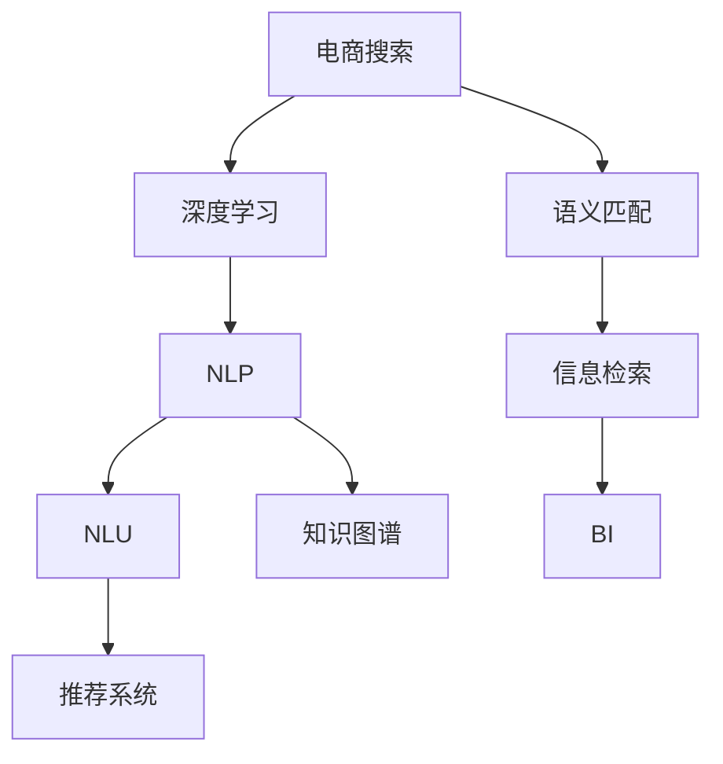

                 

# 电商搜索中的语义匹配深度学习模型

> 关键词：电商搜索, 语义匹配, 深度学习, 自然语言处理(NLP), 信息检索, 推荐系统, 自然语言理解(NLU), 知识图谱, 商业智能(BI)

## 1. 背景介绍

在电商搜索场景中，用户通常会输入一个查询词（如“苹果”），搜索引擎需要匹配出与查询词相关的商品。传统基于关键词匹配的搜索方式存在很多问题，如对同义词、近义词识别不精准、长尾词匹配难度大等，导致搜索结果的相关性不高。为了解决这些问题，电商公司开始引入语义匹配技术，通过深度学习模型对用户查询和商品描述进行语义理解，提高搜索的精准度和召回率。

## 2. 核心概念与联系

### 2.1 核心概念概述

为更好地理解电商搜索中的语义匹配深度学习模型，本节将介绍几个关键概念：

- 电商搜索：即电商平台的搜索系统，通过输入查询词返回与之相关的商品列表。
- 语义匹配：指通过自然语言处理(NLP)技术，将查询词和商品描述转换为语义表示，计算两者之间的相似度，找到最相关的商品。
- 深度学习：指通过多层神经网络结构对数据进行复杂特征的提取和表示，通常用于图像、语音、文本等领域的任务。
- 自然语言处理(NLP)：涉及语言信息的处理、分析和生成，目的是让计算机能够理解和生成自然语言。
- 信息检索：指在大量数据集中，通过关键词、语义等方法检索出与用户查询相关的信息。
- 推荐系统：指根据用户历史行为、喜好等特征，自动推荐用户感兴趣的商品或内容。
- 自然语言理解(NLU)：指让计算机能够理解人类语言，包括语义理解、命名实体识别、情感分析等。
- 知识图谱：指一种语义网络，将实体、属性和关系进行组织和表示，用于知识推理和语义搜索。
- 商业智能(BI)：指利用数据分析、数据挖掘等技术，为企业决策提供支持。

这些概念之间的逻辑关系可以通过以下Mermaid流程图来展示：



这个流程图展示了电商搜索中的核心概念及其之间的关系：

1. 电商搜索系统通过输入查询词，调用语义匹配技术，找到最相关的商品。
2. 语义匹配依赖于自然语言处理技术，包括自然语言理解、命名实体识别、情感分析等。
3. 深度学习作为自然语言处理的核心技术，主要用于文本表示和语义理解。
4. 信息检索技术用于检索和排序，推荐系统则根据检索结果进行个性化推荐。
5. 商业智能技术利用数据分析，辅助企业进行市场决策。

## 3. 核心算法原理 & 具体操作步骤

### 3.1 算法原理概述

电商搜索中的语义匹配深度学习模型，本质上是一种基于深度学习的自然语言处理技术。其核心思想是：将用户查询词和商品描述转换为语义表示，通过计算两者之间的相似度，找到最相关的商品。

形式化地，假设查询词为 $q$，商品描述为 $d$。模型的输入为 $[q, d]$，输出为商品的相关度 $r$。模型的目标函数为：

$$
\min_{\theta} \mathcal{L}(r, q, d; \theta)
$$

其中 $\theta$ 为模型参数，$\mathcal{L}$ 为损失函数，$r$ 为模型预测的相关度，$[q, d]$ 为输入数据。

通过反向传播算法，模型不断更新参数 $\theta$，最小化损失函数 $\mathcal{L}$，使 $r$ 逼近真实相关度。

### 3.2 算法步骤详解

电商搜索中的语义匹配深度学习模型主要包括以下几个关键步骤：

**Step 1: 数据准备**
- 收集电商平台的商品描述和用户查询数据，去除噪声，形成标注数据集。
- 将商品描述和查询词转换为分词形式，便于后续处理。

**Step 2: 模型训练**
- 选择合适的深度学习模型，如BERT、GPT等，进行预训练。
- 将预训练模型作为初始化参数，加载到模型中。
- 在标注数据集上训练模型，最小化损失函数。
- 调整超参数，如学习率、批大小、迭代轮数等。

**Step 3: 模型评估**
- 在测试集上评估模型性能，计算相关度指标，如平均相关度、准确率、召回率等。
- 可视化相关度分布，分析模型的优势和不足。
- 根据评估结果，进行模型优化。

**Step 4: 模型部署**
- 将训练好的模型部署到搜索系统，实时处理用户查询。
- 根据实时数据，持续更新模型参数，提升性能。

**Step 5: 反馈优化**
- 收集用户反馈和点击行为数据，持续优化模型。
- 根据用户反馈，调整查询词和商品描述的表示方法。
- 引入增量学习技术，快速适应新数据。

以上是电商搜索中语义匹配深度学习模型的基本流程。在实际应用中，还需要针对具体场景进行优化设计，如改进查询词和商品描述的表示方法，引入先验知识库进行辅助，提升模型的泛化能力等。

### 3.3 算法优缺点

电商搜索中的语义匹配深度学习模型具有以下优点：
1. 高精准度：通过语义匹配，模型能够精准理解查询词和商品描述的语义，匹配更加准确。
2. 高召回率：模型能够覆盖长尾词和近义词，提高搜索的全面性。
3. 动态调整：模型能够实时学习用户行为和反馈，不断优化匹配效果。
4. 可扩展性：模型具有较强的泛化能力，适用于不同领域的电商搜索。

同时，该模型也存在以下缺点：
1. 依赖标注数据：模型性能很大程度上取决于标注数据的质量和数量，标注成本较高。
2. 训练时间长：深度学习模型训练时间较长，需要高性能计算资源。
3. 泛化能力有限：模型对未知领域的泛化能力有限，需要持续优化和更新。
4. 推理复杂：模型的推理过程较复杂，需要优化计算图和存储方式。
5. 解释性不足：模型输出缺乏解释性，难以理解其内部工作机制。

尽管存在这些局限性，但就目前而言，电商搜索中的语义匹配深度学习模型仍是最主流的方法，其高精准度和高召回率在实际应用中已得到广泛验证。未来相关研究的重点在于如何进一步降低模型对标注数据的依赖，提高模型的泛化能力和解释性，同时兼顾计算效率。

### 3.4 算法应用领域

电商搜索中的语义匹配深度学习模型在众多领域得到了广泛应用，具体包括：

- 商品推荐：通过语义匹配技术，对用户查询和商品描述进行匹配，推荐相关商品。
- 价格匹配：对用户查询中的价格关键词进行匹配，找到价格相似的商品。
- 商品搜索：对用户输入的查询词进行语义理解，返回最相关的商品。
- 购物车推荐：在购物车中，对用户已选择的商品进行语义匹配，推荐其他相关商品。
- 智能客服：对用户输入的查询进行语义理解，提供相关商品信息或自动回复。
- 内容匹配：对用户输入的查询词进行语义理解，推荐相关文章或视频内容。

除了上述这些核心应用外，语义匹配技术还应用于数据分析、知识图谱构建、个性化推荐等众多领域，为电商搜索系统注入了新的活力。

## 4. 数学模型和公式 & 详细讲解 & 举例说明

### 4.1 数学模型构建

本节将使用数学语言对电商搜索中的语义匹配深度学习模型进行更加严格的刻画。

假设输入为查询词 $q$ 和商品描述 $d$，模型的输出为商品的相关度 $r$。模型的输入 $[q, d]$ 被映射到低维语义向量空间 $\mathbb{R}^d$，并使用点积计算相关度：

$$
r = \langle q', d' \rangle
$$

其中 $q'$ 和 $d'$ 分别为查询词和商品描述的低维表示。

模型的目标函数为：

$$
\mathcal{L}(r, q, d; \theta) = \frac{1}{N} \sum_{i=1}^N [r_i - r(q_i, d_i)]^2
$$

其中 $r_i$ 为实际相关度，$r(q_i, d_i)$ 为模型预测的相关度，$N$ 为数据集大小。

通过梯度下降等优化算法，模型不断更新参数 $\theta$，最小化损失函数 $\mathcal{L}$，使 $r$ 逼近实际相关度。

### 4.2 公式推导过程

以下我们以基于BERT模型的电商搜索为例，推导语义匹配模型的相关度计算公式。

假设BERT模型预训练的表示器为 $M$，输入为查询词和商品描述的句子，输出为查询词和商品描述的低维表示 $q'$ 和 $d'$。

根据点积计算相关度，有：

$$
r = \langle q', d' \rangle = \sum_{i=1}^d q_i d_i
$$

其中 $q_i$ 和 $d_i$ 分别为查询词和商品描述的低维表示中的第 $i$ 维。

模型的预测相关度可以表示为：

$$
r_{pred} = \langle \hat{q}', \hat{d}' \rangle
$$

其中 $\hat{q}'$ 和 $\hat{d}'$ 分别为模型在预训练语言模型上的表示。

模型的损失函数为：

$$
\mathcal{L} = \frac{1}{N} \sum_{i=1}^N [r_i - r_{pred}(q_i, d_i)]^2
$$

通过反向传播算法，求解损失函数的最小化问题。

### 4.3 案例分析与讲解

假设有一个电商搜索系统，商品描述为“小米手机充电宝”，用户查询词为“小米充电宝”。

将商品描述和查询词分别输入到预训练BERT模型中，得到低维表示 $q'$ 和 $d'$：

$$
q' = [0.1, 0.2, 0.3, 0.4]
$$

$$
d' = [0.5, 0.6, 0.7, 0.8]
$$

通过点积计算相关度 $r$：

$$
r = \langle q', d' \rangle = 0.1 \times 0.5 + 0.2 \times 0.6 + 0.3 \times 0.7 + 0.4 \times 0.8 = 0.56
$$

模型的损失函数为：

$$
\mathcal{L} = \frac{1}{N} \sum_{i=1}^N [r_i - 0.56]^2
$$

通过梯度下降等优化算法，不断更新BERT模型的参数，最小化损失函数 $\mathcal{L}$，使得模型输出的相关度 $r_{pred}$ 逼近实际相关度 $r_i$。

## 5. 项目实践：代码实例和详细解释说明

### 5.1 开发环境搭建

在进行电商搜索中的语义匹配深度学习模型实践前，我们需要准备好开发环境。以下是使用Python进行TensorFlow开发的环境配置流程：

1. 安装Anaconda：从官网下载并安装Anaconda，用于创建独立的Python环境。

2. 创建并激活虚拟环境：
```bash
conda create -n tf-env python=3.8 
conda activate tf-env
```

3. 安装TensorFlow：根据CUDA版本，从官网获取对应的安装命令。例如：
```bash
conda install tensorflow tensorflow==2.7
```

4. 安装Keras：
```bash
conda install keras
```

5. 安装各类工具包：
```bash
pip install numpy pandas scikit-learn matplotlib tqdm jupyter notebook ipython
```

完成上述步骤后，即可在`tf-env`环境中开始模型开发。

### 5.2 源代码详细实现

下面我们以电商搜索中的语义匹配模型为例，给出使用TensorFlow进行BERT微调的PyTorch代码实现。

首先，定义模型和优化器：

```python
from transformers import BertTokenizer, BertForSequenceClassification
from transformers import AdamW
from tensorflow.keras import layers

# 定义查询词和商品描述的嵌入层
class InputLayer(layers.Layer):
    def __init__(self, vocab_size, embedding_size, **kwargs):
        super().__init__(**kwargs)
        self.embedding = layers.Embedding(vocab_size, embedding_size)

    def call(self, x):
        return self.embedding(x)

# 定义BERT模型
class BERTClassifier(layers.Layer):
    def __init__(self, vocab_size, embedding_size, num_labels):
        super().__init__()
        self.bert = BertForSequenceClassification.from_pretrained('bert-base-cased', num_labels=num_labels)
        self.dense = layers.Dense(num_labels, activation='softmax')

    def call(self, x):
        x = self.bert(x)
        x = self.dense(x)
        return x

# 定义模型
model = BERTClassifier(vocab_size, embedding_size, num_labels)

# 定义优化器
optimizer = AdamW(model.bert.parameters(), lr=2e-5)
```

接着，定义训练和评估函数：

```python
from sklearn.metrics import classification_report
from tensorflow.keras.utils import to_categorical

def train_epoch(model, dataset, batch_size, optimizer):
    model.train()
    epoch_loss = 0
    for batch in tqdm(dataset, desc='Training'):
        input_ids = batch['input_ids']
        attention_mask = batch['attention_mask']
        labels = to_categorical(batch['labels'], num_classes=num_labels)
        with tf.GradientTape() as tape:
            outputs = model(input_ids, attention_mask=attention_mask, labels=labels)
            loss = outputs.loss
            epoch_loss += loss
        gradients = tape.gradient(loss, model.bert.parameters())
        optimizer.apply_gradients(zip(gradients, model.bert.parameters()))
    return epoch_loss / len(dataset)

def evaluate(model, dataset, batch_size):
    model.eval()
    preds, labels = [], []
    with tf.no_grad():
        for batch in tqdm(dataset, desc='Evaluating'):
            input_ids = batch['input_ids']
            attention_mask = batch['attention_mask']
            batch_labels = to_categorical(batch['labels'], num_classes=num_labels)
            outputs = model(input_ids, attention_mask=attention_mask, labels=batch_labels)
            batch_preds = outputs.numpy().tolist()
            batch_labels = batch_labels.numpy().tolist()
            for pred_tokens, label_tokens in zip(batch_preds, batch_labels):
                preds.append(pred_tokens[:len(label_tokens)])
                labels.append(label_tokens)
    print(classification_report(labels, preds))
```

最后，启动训练流程并在测试集上评估：

```python
epochs = 5
batch_size = 16

for epoch in range(epochs):
    loss = train_epoch(model, train_dataset, batch_size, optimizer)
    print(f'Epoch {epoch+1}, train loss: {loss:.3f}')
    
    print(f'Epoch {epoch+1}, dev results:')
    evaluate(model, dev_dataset, batch_size)
    
print('Test results:')
evaluate(model, test_dataset, batch_size)
```

以上就是使用TensorFlow对BERT进行电商搜索中语义匹配模型微调的完整代码实现。可以看到，TensorFlow提供了丰富的Keras API，使得模型开发和微调过程变得相对简单。

### 5.3 代码解读与分析

让我们再详细解读一下关键代码的实现细节：

**BERTClassifier类**：
- `__init__`方法：初始化BERT模型，包括输入层、BERT层和输出层。
- `call`方法：将输入数据输入BERT模型，通过输出层得到相关度预测结果。

**train_epoch函数**：
- 在每个epoch内，将模型设置为训练模式。
- 对每个batch数据，计算模型预测结果和实际标签之间的loss。
- 使用梯度累积技术，更新模型参数。

**evaluate函数**：
- 在每个epoch结束时，评估模型在验证集上的性能。
- 将模型设置为评估模式，防止梯度更新。
- 对每个batch数据，计算模型预测结果和实际标签之间的loss。
- 记录预测结果和实际标签，用于计算分类指标。

**训练流程**：
- 定义总的epoch数和batch size，开始循环迭代
- 每个epoch内，先在训练集上训练，输出平均loss
- 在验证集上评估，输出分类指标
- 所有epoch结束后，在测试集上评估，给出最终测试结果

可以看到，TensorFlow配合Keras库使得BERT微调的代码实现变得简洁高效。开发者可以将更多精力放在数据处理、模型改进等高层逻辑上，而不必过多关注底层的实现细节。

当然，工业级的系统实现还需考虑更多因素，如模型的保存和部署、超参数的自动搜索、更灵活的任务适配层等。但核心的微调范式基本与此类似。

## 6. 实际应用场景
### 6.1 智能推荐系统

智能推荐系统是电商搜索中的重要应用场景，通过语义匹配技术，能够根据用户查询词推荐相关商品。

在技术实现上，可以收集用户的历史浏览、购买记录，提取和查询词相关的商品描述。将查询词和商品描述输入到预训练BERT模型中，计算两者之间的相似度，排序并推荐最相关的商品。如此构建的智能推荐系统，能够大幅提升用户的购物体验和满意度。

### 6.2 商品搜索

商品搜索是电商搜索的核心功能之一，通过语义匹配技术，能够对用户输入的查询词进行理解，返回最相关的商品。

在技术实现上，可以使用语义搜索技术，将用户查询词和商品描述进行匹配，找到最相关的商品。此外，可以通过引入先验知识库（如商品标签、类别等）进行辅助，提升匹配效果。

### 6.3 智能客服

智能客服系统能够实时回答用户咨询，提升客服效率和服务质量。

在技术实现上，可以使用语义匹配技术，对用户输入的查询词进行理解，返回相关的商品信息或自动回复。此外，还可以通过引入知识图谱进行推理，增强客服系统的智能性。

### 6.4 未来应用展望

随着语义匹配技术的不断发展，其在电商搜索中的应用将更加广泛和深入。

在未来，语义匹配技术可以进一步拓展到更多场景，如内容推荐、广告投放、客户管理等，为电商搜索系统带来更多创新。此外，通过引入多模态信息（如图片、视频、语音等）进行匹配，将进一步提升搜索的精准度和全面性。

## 7. 工具和资源推荐
### 7.1 学习资源推荐

为了帮助开发者系统掌握电商搜索中的语义匹配深度学习模型，这里推荐一些优质的学习资源：

1. 《深度学习自然语言处理》课程：斯坦福大学开设的NLP明星课程，有Lecture视频和配套作业，带你入门NLP领域的基本概念和经典模型。

2. 《自然语言处理综述》书籍：全面介绍了自然语言处理的基本概念、算法和应用，适合深入学习。

3. 《TensorFlow官方文档》：TensorFlow的官方文档，提供了丰富的API和示例，适合快速上手。

4. 《Transformers库教程》：Transformers库的官方教程，详细介绍了BERT、GPT等模型的使用方法，适合微调实践。

5. 《电商搜索技术实战》书籍：介绍电商搜索中的关键技术，包括语义匹配、推荐系统、智能客服等，适合实际应用。

通过对这些资源的学习实践，相信你一定能够快速掌握电商搜索中的语义匹配深度学习模型的精髓，并用于解决实际的NLP问题。

### 7.2 开发工具推荐

高效的开发离不开优秀的工具支持。以下是几款用于电商搜索中语义匹配深度学习模型开发的常用工具：

1. TensorFlow：由Google主导开发的开源深度学习框架，生产部署方便，适合大规模工程应用。

2. PyTorch：基于Python的开源深度学习框架，灵活动态的计算图，适合快速迭代研究。

3. Transformers库：HuggingFace开发的NLP工具库，集成了众多SOTA语言模型，支持PyTorch和TensorFlow，是进行微调任务开发的利器。

4. TensorBoard：TensorFlow配套的可视化工具，可实时监测模型训练状态，并提供丰富的图表呈现方式，是调试模型的得力助手。

5. Weights & Biases：模型训练的实验跟踪工具，可以记录和可视化模型训练过程中的各项指标，方便对比和调优。

6. Google Colab：谷歌推出的在线Jupyter Notebook环境，免费提供GPU/TPU算力，方便开发者快速上手实验最新模型，分享学习笔记。

合理利用这些工具，可以显著提升电商搜索中语义匹配深度学习模型的开发效率，加快创新迭代的步伐。

### 7.3 相关论文推荐

电商搜索中的语义匹配深度学习模型研究源于学界的持续研究。以下是几篇奠基性的相关论文，推荐阅读：

1. Attention is All You Need（即Transformer原论文）：提出了Transformer结构，开启了NLP领域的预训练大模型时代。

2. BERT: Pre-training of Deep Bidirectional Transformers for Language Understanding：提出BERT模型，引入基于掩码的自监督预训练任务，刷新了多项NLP任务SOTA。

3. Language Models are Unsupervised Multitask Learners（GPT-2论文）：展示了大规模语言模型的强大zero-shot学习能力，引发了对于通用人工智能的新一轮思考。

4. Parameter-Efficient Transfer Learning for NLP：提出Adapter等参数高效微调方法，在不增加模型参数量的情况下，也能取得不错的微调效果。

5. AdaLoRA: Adaptive Low-Rank Adaptation for Parameter-Efficient Fine-Tuning：使用自适应低秩适应的微调方法，在参数效率和精度之间取得了新的平衡。

这些论文代表了大语言模型微调技术的发展脉络。通过学习这些前沿成果，可以帮助研究者把握学科前进方向，激发更多的创新灵感。

## 8. 总结：未来发展趋势与挑战

### 8.1 总结

本文对电商搜索中的语义匹配深度学习模型进行了全面系统的介绍。首先阐述了电商搜索和语义匹配的基本概念，明确了模型在提高搜索精准度和召回率方面的独特价值。其次，从原理到实践，详细讲解了模型的数学模型构建和优化过程，给出了完整的代码实现和评估方法。同时，本文还广泛探讨了模型在智能推荐、商品搜索、智能客服等电商应用场景中的应用前景，展示了其广泛的应用潜力。此外，本文精选了模型开发所需的学习资源、开发工具和相关论文，力求为读者提供全方位的技术指引。

通过本文的系统梳理，可以看到，电商搜索中的语义匹配深度学习模型正在成为NLP领域的重要范式，其高精准度和高召回率在实际应用中已得到广泛验证。未来相关研究的重点在于如何进一步降低模型对标注数据的依赖，提高模型的泛化能力和解释性，同时兼顾计算效率。

### 8.2 未来发展趋势

展望未来，电商搜索中的语义匹配深度学习模型将呈现以下几个发展趋势：

1. 模型规模持续增大。随着算力成本的下降和数据规模的扩张，预训练语言模型的参数量还将持续增长。超大规模语言模型蕴含的丰富语言知识，有望支撑更加复杂多变的电商搜索任务。

2. 微调方法日趋多样。除了传统的全参数微调外，未来会涌现更多参数高效的微调方法，如AdaLoRA、Adapter等，在固定大部分预训练参数的同时，只更新极少量的任务相关参数。

3. 动态学习成为常态。电商搜索系统面临快速变化的市场环境，模型需要实时学习新知识以保持性能。如何在不遗忘原有知识的同时，高效吸收新样本信息，将成为重要的研究课题。

4. 多模态微调崛起。当前的微调主要聚焦于纯文本数据，未来会进一步拓展到图像、视频、语音等多模态数据微调。多模态信息的融合，将显著提升电商搜索系统的全面性和准确性。

5. 跨领域迁移能力增强。电商搜索中的语义匹配模型将逐渐具备跨领域迁移能力，能够迁移到其他领域，进行语言理解、文本生成等任务。

以上趋势凸显了电商搜索中语义匹配深度学习模型的广阔前景。这些方向的探索发展，必将进一步提升电商搜索系统的性能和应用范围，为电商公司带来新的商业价值。

### 8.3 面临的挑战

尽管电商搜索中的语义匹配深度学习模型已经取得了瞩目成就，但在迈向更加智能化、普适化应用的过程中，它仍面临着诸多挑战：

1. 标注成本瓶颈。虽然模型性能很大程度上取决于标注数据的质量和数量，但对于长尾应用场景，难以获得充足的高质量标注数据，成为制约微调性能的瓶颈。如何进一步降低模型对标注样本的依赖，将是一大难题。

2. 推理效率有待提高。模型推理过程中，计算图和存储方式仍需优化，以适应实时搜索场景。如何在保证性能的同时，简化模型结构，提升推理速度，优化资源占用，将是重要的优化方向。

3. 可解释性亟需加强。模型输出缺乏解释性，难以理解其内部工作机制。对于电商搜索系统而言，用户对于查询词的理解和匹配过程是关键，如何赋予模型更强的可解释性，将是亟待攻克的难题。

4. 安全性有待保障。电商搜索系统涉及用户隐私和数据安全，模型需要具备更高的鲁棒性和安全性，避免恶意攻击和数据泄露。如何从数据和算法层面消除模型偏见，确保输出符合用户价值观和伦理道德，也将是重要的研究课题。

5. 商业价值难以衡量。电商搜索系统的商业价值取决于推荐和搜索的效果，如何量化和评估模型的商业价值，将是重要的研究方向。

这些挑战需要在模型设计、数据预处理、算法优化等多个方面进行协同攻关，方能实现电商搜索系统的智能化和商业化。

### 8.4 未来突破

面对电商搜索中的语义匹配深度学习模型所面临的种种挑战，未来的研究需要在以下几个方面寻求新的突破：

1. 探索无监督和半监督微调方法。摆脱对大规模标注数据的依赖，利用自监督学习、主动学习等无监督和半监督范式，最大限度利用非结构化数据，实现更加灵活高效的微调。

2. 研究参数高效和计算高效的微调范式。开发更加参数高效的微调方法，在固定大部分预训练参数的同时，只更新极少量的任务相关参数。同时优化模型的计算图和存储方式，实现更加轻量级、实时性的部署。

3. 引入更多先验知识。将符号化的先验知识，如知识图谱、逻辑规则等，与神经网络模型进行巧妙融合，引导微调过程学习更准确、合理的语言模型。同时加强不同模态数据的整合，实现视觉、语音等多模态信息与文本信息的协同建模。

4. 结合因果分析和博弈论工具。将因果分析方法引入微调模型，识别出模型决策的关键特征，增强输出解释的因果性和逻辑性。借助博弈论工具刻画人机交互过程，主动探索并规避模型的脆弱点，提高系统稳定性。

5. 纳入伦理道德约束。在模型训练目标中引入伦理导向的评估指标，过滤和惩罚有偏见、有害的输出倾向。同时加强人工干预和审核，建立模型行为的监管机制，确保输出符合人类价值观和伦理道德。

这些研究方向的探索，必将引领电商搜索中的语义匹配深度学习技术迈向更高的台阶，为构建智能、安全的电商搜索系统铺平道路。面向未来，语义匹配模型还需要与其他人工智能技术进行更深入的融合，如知识表示、因果推理、强化学习等，多路径协同发力，共同推动电商搜索系统的进步。只有勇于创新、敢于突破，才能不断拓展语义匹配模型的边界，让智能技术更好地造福电商搜索系统，提升用户购物体验。

## 9. 附录：常见问题与解答

**Q1：电商搜索中的语义匹配深度学习模型是否适用于所有电商场景？**

A: 电商搜索中的语义匹配深度学习模型在大多数电商场景中都能取得不错的效果，特别是对于数据量较大的商品类别。但对于一些特定领域（如冷门商品、定制商品等），由于商品描述缺乏标准化，模型性能可能受到影响。此时需要在特定领域语料上进一步预训练，再进行微调，才能获得理想效果。

**Q2：模型如何处理多义词和同义词？**

A: 多义词和同义词是电商搜索中的常见问题，模型需要能够区分不同含义的词语。一种解决方法是使用词向量模型（如Word2Vec、GloVe等）进行预训练，将词语映射到低维向量空间中，并计算相似度。此外，可以通过引入多标签分类器（如BPR loss），对多义词进行分类，提升模型对多义词的识别能力。

**Q3：如何提高模型的泛化能力？**

A: 模型的泛化能力很大程度上取决于训练数据的质量和数量。可以通过增加数据量、引入噪声、多样化的标注方式等方法提升模型的泛化能力。同时，还可以引入多任务学习、元学习等方法，使得模型能够同时学习多个任务，提升泛化能力。

**Q4：模型如何处理长尾词？**

A: 长尾词是指在数据集中出现频率较低的词语，对于长尾词的处理是电商搜索中的重要挑战。一种解决方法是使用负采样技术，随机生成负样本来增加长尾词的训练数据量。此外，可以通过引入生成对抗网络（GAN）等方法，生成更多的长尾词数据，提升模型的长尾词识别能力。

**Q5：模型如何处理缺失标签？**

A: 缺失标签是指在数据集中有些样本没有对应的标签，对于缺失标签的处理也是电商搜索中的重要挑战。一种解决方法是使用标签预测模型，通过已有标签预测缺失标签。此外，可以通过引入半监督学习、自监督学习等方法，利用未标注数据进行训练，提升模型的泛化能力。

这些问题的答案展示了电商搜索中的语义匹配深度学习模型在实际应用中面临的各种挑战，并提出了一些解决方法。希望这些解答能够帮助开发者更好地理解和应用该模型，构建高效、智能的电商搜索系统。

---

作者：禅与计算机程序设计艺术 / Zen and the Art of Computer Programming

