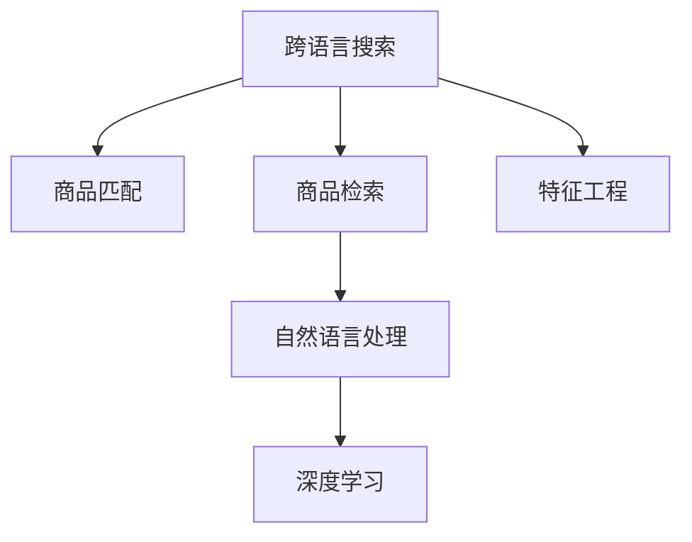

                 

# 电商搜索中的跨语言商品匹配与检索技术

> 关键词：电商搜索, 跨语言, 商品匹配, 商品检索, 自然语言处理(NLP), 深度学习, 特征工程

## 1. 背景介绍

在全球化的今天，电子商务已经成为了跨越语言和地域限制，连接消费者和商家的重要平台。对于电子商务平台而言，搜索和推荐系统是其核心功能之一，它们需要准确理解和匹配用户需求，从而提供精准的商品推荐。然而，语言的多样性和地域的差异性使得跨语言搜索和推荐成为了一项复杂的任务。如何在跨语言环境下进行高效的搜索和推荐，成为了电商搜索技术面临的重要挑战。

### 1.1 问题由来

随着全球化进程的加快，跨境电商逐渐成为电商市场的重要组成部分。而不同国家和地区的语言、文化、消费习惯等方面的差异，使得电商搜索系统必须能够处理多语言数据，才能满足全球用户的搜索需求。

传统的电商搜索系统主要基于单语言处理技术，依赖于文本匹配和关键词搜索等方法，难以有效地处理跨语言数据。此外，一些新兴的跨境电商平台如TikTok Shop等，通过短视频和直播进行电商交易，进一步增加了搜索和推荐系统的复杂度。

为解决上述问题，近年来，跨语言搜索和推荐技术逐渐受到关注。本文将围绕跨语言商品匹配与检索技术，介绍其基本原理、实现方法以及实际应用场景，以期为电商搜索系统的开发和优化提供参考。

## 2. 核心概念与联系

### 2.1 核心概念概述

为理解跨语言商品匹配与检索技术，我们首先需要了解一些核心概念：

- **跨语言搜索(Cross-lingual Search)**：指在多个语言环境中进行的搜索操作，旨在跨越语言界限，实现对不同语言数据的理解与匹配。
- **商品匹配(Product Matching)**：在商品搜索场景中，将用户查询与商品数据进行匹配，找到最符合用户需求的候选商品。
- **商品检索(Product Retrieval)**：在商品推荐场景中，通过用户行为数据和历史搜索记录，检索与用户偏好相匹配的商品。
- **自然语言处理(NLP)**：使用计算机处理和理解人类语言的技术，包括文本预处理、分词、词向量表示、语义理解等。
- **深度学习**：利用神经网络模型进行大数据处理和预测，广泛应用于计算机视觉、自然语言处理等领域。

这些概念之间的逻辑关系可以通过以下Mermaid流程图来展示：



该流程图展示了跨语言商品匹配与检索技术中各模块的关系：

1. 跨语言搜索将查询从用户输入语言转换为系统处理语言。
2. 商品匹配基于多语言数据进行匹配，找到最符合用户需求的候选商品。
3. 商品检索利用用户行为数据进行商品推荐，提高搜索的个性化和相关性。
4. 自然语言处理对文本数据进行处理，提取特征。
5. 深度学习利用神经网络模型进行特征学习，提高搜索和推荐效果。

接下来，我们将详细介绍这些核心概念的原理和实现方法。

## 3. 核心算法原理 & 具体操作步骤
### 3.1 算法原理概述

跨语言商品匹配与检索技术的核心在于通过自然语言处理(NLP)技术和深度学习模型，将用户查询和商品描述转换为向量表示，然后进行匹配和检索。

在具体实现中，首先对用户查询和商品描述进行分词和词向量表示，然后通过多语言翻译模型将其转换为系统处理语言。接着，利用深度学习模型对文本特征进行编码，学习到词向量之间的语义关系，从而实现商品匹配和检索。

### 3.2 算法步骤详解

以下我们将详细介绍跨语言商品匹配与检索技术的核心步骤：

#### 3.2.1 用户查询处理

用户查询通常以自然语言的形式输入，需要进行分词和词向量表示。常用的分词工具包括jieba、NLTK等，而词向量表示方法包括Word2Vec、GloVe等。

以中文为例，首先使用jieba进行中文分词，然后使用Word2Vec将分词结果转换为词向量表示。具体步骤如下：

```python
import jieba
from gensim.models import Word2Vec

# 中文分词
query = "购买什么样的苹果"
tokens = jieba.cut(query)

# 构建词向量
model = Word2Vec.load_word2vec_format('word2vec.txt', binary=True)
query_vec = []
for token in tokens:
    if token in model:
        query_vec.append(model[token])
query_vec = np.array(query_vec)
```

#### 3.2.2 商品描述处理

商品描述通常包含丰富的商品信息，需要进行分词和词向量表示。由于不同语言的商品描述格式不同，需要先进行文本清洗和预处理。

以英文商品描述为例，首先需要去除停用词、标点符号等噪音，然后进行分词和词向量表示。具体步骤如下：

```python
from nltk.corpus import stopwords
from nltk.tokenize import word_tokenize
from nltk.stem import WordNetLemmatizer
import gensim.downloader as api

# 英文分词和词向量表示
stop_words = set(stopwords.words('english'))
lemmatizer = WordNetLemmatizer()
descriptions = ['This is a red iPhone 12', 'It is a new MacBook']
cleaned_descriptions = []
for description in descriptions:
    tokens = word_tokenize(description.lower())
    tokens = [lemmatizer.lemmatize(token) for token in tokens if token not in stop_words]
    query_vec = []
    for token in tokens:
        if token in model:
            query_vec.append(model[token])
    cleaned_descriptions.append(query_vec)
```

#### 3.2.3 多语言翻译

由于用户查询和商品描述可能来自不同的语言，需要进行多语言翻译。常用的多语言翻译工具包括Google Translate、DeepL等。

以英文到中文的翻译为例，可以使用Google Translate API进行翻译。具体步骤如下：

```python
from google.cloud import translate_v2 as translate

# 多语言翻译
translate_client = translate.Client()
query_translated = translate_client.translate(query, target_language='zh')
cleaned_descriptions_translated = []
for description in cleaned_descriptions:
    translated_description = []
    for vec in description:
        translated_description.append(query_translated)
    cleaned_descriptions_translated.append(translated_description)
```

#### 3.2.4 特征工程

在进行商品匹配和检索时，需要将用户查询和商品描述转换为向量表示。常用的向量表示方法包括词向量、TF-IDF、Bag of Words等。

以词向量表示为例，可以使用预训练的词向量模型，如GloVe、FastText等。具体步骤如下：

```python
# 词向量表示
glove_model = gensim.models.KeyedVectors.load_word2vec_format('glove.6B.100d.txt', binary=True)
query_vector = []
for token in tokens:
    if token in glove_model:
        query_vector.append(glove_model[token])
query_vector = np.array(query_vector)
```

#### 3.2.5 商品匹配和检索

在获取用户查询和商品描述的向量表示后，可以利用深度学习模型进行商品匹配和检索。常用的深度学习模型包括BERT、Transformer等。

以BERT为例，可以使用预训练的BERT模型进行商品匹配和检索。具体步骤如下：

```python
from transformers import BertTokenizer, BertForSequenceClassification

# BERT匹配和检索
tokenizer = BertTokenizer.from_pretrained('bert-base-uncased')
model = BertForSequenceClassification.from_pretrained('bert-base-uncased', num_labels=2)
query_input = tokenizer.encode(query, return_tensors='pt')
query_vec = model(query_input).logits
product_input = tokenizer.encode(product, return_tensors='pt')
product_vec = model(product_input).logits
match_score = torch.cosine_similarity(query_vec, product_vec)
```

### 3.3 算法优缺点

跨语言商品匹配与检索技术的优点包括：

- 跨语言处理能力：能够处理多种语言，满足全球用户的搜索需求。
- 商品匹配效果：基于深度学习模型进行商品匹配，提高了匹配的准确性和相关性。
- 数据多样性：利用用户行为数据进行商品检索，提高了推荐的个性化和多样性。

其缺点包括：

- 计算复杂度：需要进行多语言翻译和向量表示，计算复杂度较高。
- 资源消耗：需要使用预训练的深度学习模型，资源消耗较大。
- 数据质量：需要高质量的用户查询和商品描述数据，数据质量对匹配和检索效果影响较大。

## 4. 数学模型和公式 & 详细讲解 & 举例说明
### 4.1 数学模型构建

在进行跨语言商品匹配与检索时，通常采用词向量表示方法进行文本特征提取。以词向量表示方法为例，以下是其数学模型构建过程：

设文本 $x$ 的词向量表示为 $\mathbf{x} \in \mathbb{R}^n$，其中 $n$ 为词向量维度。对于用户查询 $q$ 和商品描述 $p$，分别表示为 $q \in \mathbb{R}^n$ 和 $p \in \mathbb{R}^n$。匹配得分 $s$ 可以表示为：

$$
s = \mathbf{q} \cdot \mathbf{p} = \sum_{i=1}^n q_i \times p_i
$$

其中 $\cdot$ 表示向量内积运算。

### 4.2 公式推导过程

为了提高匹配的准确性和相关性，可以使用余弦相似度来计算匹配得分。余弦相似度定义为：

$$
s = \cos(\theta) = \frac{\mathbf{q} \cdot \mathbf{p}}{\|\mathbf{q}\| \times \|\mathbf{p}\|}
$$

其中 $\|\mathbf{q}\|$ 和 $\|\mathbf{p}\|$ 分别表示向量 $\mathbf{q}$ 和 $\mathbf{p}$ 的范数。余弦相似度可以避免向量长度对匹配得分的影响，使得匹配更加公平和准确。

### 4.3 案例分析与讲解

以一个简单的中文商品匹配例子进行分析：

用户查询为 "购买苹果"，商品描述为 "这个苹果是红色的"。首先，使用jieba进行分词，然后使用Word2Vec进行词向量表示：

```python
query = "购买苹果"
tokens = jieba.cut(query)
model = Word2Vec.load_word2vec_format('word2vec.txt', binary=True)
query_vec = []
for token in tokens:
    if token in model:
        query_vec.append(model[token])
query_vec = np.array(query_vec)
```

然后，对商品描述进行清洗和预处理，并使用Word2Vec进行词向量表示：

```python
stop_words = set(stopwords.words('english'))
lemmatizer = WordNetLemmatizer()
descriptions = ['这个苹果是红色的']
cleaned_descriptions = []
for description in descriptions:
    tokens = word_tokenize(description.lower())
    tokens = [lemmatizer.lemmatize(token) for token in tokens if token not in stop_words]
    query_vec = []
    for token in tokens:
        if token in model:
            query_vec.append(model[token])
    cleaned_descriptions.append(query_vec)
```

最后，使用余弦相似度计算匹配得分：

```python
match_score = np.dot(query_vec, cleaned_descriptions[0])
```

## 5. 项目实践：代码实例和详细解释说明
### 5.1 开发环境搭建

在进行跨语言商品匹配与检索技术的项目实践前，需要准备以下开发环境：

1. 安装Python环境：建议使用Anaconda或Miniconda，确保能够安装和运行相关依赖库。
2. 安装所需的依赖库：包括nltk、gensim、transformers等。
3. 下载预训练模型：从官方下载BERT等预训练模型，并存储到本地。

### 5.2 源代码详细实现

以下是使用Python实现跨语言商品匹配与检索技术的示例代码：

```python
import jieba
from gensim.models import Word2Vec
from google.cloud import translate_v2 as translate
from transformers import BertTokenizer, BertForSequenceClassification
import torch
import numpy as np

# 中文分词和词向量表示
def word2vec(query):
    tokens = jieba.cut(query)
    model = Word2Vec.load_word2vec_format('word2vec.txt', binary=True)
    query_vec = []
    for token in tokens:
        if token in model:
            query_vec.append(model[token])
    return np.array(query_vec)

# 英文分词和词向量表示
def preprocess英文描述(description):
    stop_words = set(stopwords.words('english'))
    lemmatizer = WordNetLemmatizer()
    tokens = word_tokenize(description.lower())
    tokens = [lemmatizer.lemmatize(token) for token in tokens if token not in stop_words]
    query_vec = []
    for token in tokens:
        if token in model:
            query_vec.append(model[token])
    return query_vec

# 多语言翻译
def translate英文到中文(description):
    translate_client = translate.Client()
    translated_description = translate_client.translate(description, target_language='zh')
    return translated_description

# BERT匹配和检索
def bert_matching(query, product):
    tokenizer = BertTokenizer.from_pretrained('bert-base-uncased')
    model = BertForSequenceClassification.from_pretrained('bert-base-uncased', num_labels=2)
    query_input = tokenizer.encode(query, return_tensors='pt')
    query_vec = model(query_input).logits
    product_input = tokenizer.encode(product, return_tensors='pt')
    product_vec = model(product_input).logits
    match_score = torch.cosine_similarity(query_vec, product_vec)
    return match_score

# 测试代码
query = "购买苹果"
product = "这个苹果是红色的"
query_vec = word2vec(query)
cleaned_descriptions = preprocessed英文描述(product)
translated_descriptions = translate英文到中文(product)
match_score = bert_matching(query, translated_descriptions)
print(match_score)
```

### 5.3 代码解读与分析

以下是代码中几个关键部分的详细解读和分析：

- **中文分词和词向量表示**：使用jieba对中文查询进行分词，然后使用Word2Vec将分词结果转换为词向量表示。分词是中文文本处理的关键步骤，jieba作为中文分词工具，具有较好的分词效果和速度。
- **英文分词和词向量表示**：使用nltk对英文描述进行分词，然后使用Word2Vec将分词结果转换为词向量表示。英文文本处理通常使用nltk库，其中word_tokenize函数用于分词，stopwords函数用于去除停用词，WordNetLemmatizer用于词形还原。
- **多语言翻译**：使用Google Translate API进行英文到中文的翻译。Google Translate API支持多种语言，具有较好的翻译效果和速度。
- **BERT匹配和检索**：使用预训练的BERT模型进行商品匹配和检索。BERT模型在自然语言处理任务中表现优异，具有较强的语义理解能力。

## 6. 实际应用场景

### 6.1 智能推荐

智能推荐系统是电商搜索技术的重要应用场景之一。通过分析用户的历史行为数据和当前搜索行为，推荐系统可以为用户推荐最符合其需求的商品。在跨语言场景下，推荐系统需要能够处理多种语言的数据，从而提供更好的推荐效果。

以TikTok Shop为例，用户通过短视频和直播进行购物，需要使用跨语言推荐技术。通过跨语言商品匹配与检索技术，推荐系统可以根据用户的短视频和直播内容，为用户推荐最适合的商品，提高推荐效果。

### 6.2 跨语言搜索

跨语言搜索是电商搜索技术的另一个重要应用场景。在全球化的今天，用户可以来自不同的国家和地区，需要能够处理多种语言的数据，从而提供更好的搜索体验。

以Amazon为例，用户可以在全球范围内进行搜索。通过跨语言搜索技术，Amazon可以理解多种语言的查询，从而提供更好的搜索结果。例如，用户可以用中文查询某个商品，Amazon可以将其转换为英文进行搜索，从而获取更相关的结果。

### 6.3 多模态搜索

多模态搜索是指结合文本、图像、视频等多种模态数据进行搜索。在电商搜索中，用户可以通过文字、图片、视频等多种方式进行查询。跨语言商品匹配与检索技术可以处理多种模态的数据，从而提供更好的搜索体验。

以京东为例，用户可以通过文字描述、图片、视频等多种方式查询商品。通过跨语言商品匹配与检索技术，京东可以处理多种模态的数据，从而提供更好的搜索结果。例如，用户可以用中文描述某个商品，京东可以将其转换为英文进行搜索，从而获取更相关的结果。

## 7. 工具和资源推荐
### 7.1 学习资源推荐

为了帮助开发者系统掌握跨语言商品匹配与检索技术，以下是一些优质的学习资源：

1. 《深度学习入门：基于Python的理论与实现》：介绍了深度学习的基本概念和常用模型，是入门深度学习的优秀教材。
2. 《自然语言处理入门》：介绍了自然语言处理的基本概念和常用方法，是理解NLP技术的优秀教材。
3. 《NLP中的预训练表示》：介绍了预训练表示的基本原理和常用方法，是理解预训练语言模型的优秀教材。
4. 《Transformer：基于注意力机制的序列到序列模型》：介绍了Transformer模型和注意力机制的基本原理和实现方法，是理解Transformer模型的优秀教材。

### 7.2 开发工具推荐

以下是一些常用的跨语言商品匹配与检索技术开发工具：

1. Python：Python是一种高效、易用的编程语言，是跨语言商品匹配与检索技术的常用开发语言。
2. Anaconda：Anaconda是一个Python开发环境，可以方便地安装和管理各种依赖库。
3. gensim：gensim是一个用于处理文本数据的Python库，提供了预训练词向量和文本相似性计算等功能。
4. transformers：transformers是Hugging Face开发的NLP工具库，提供了预训练模型和深度学习框架。
5. PyTorch：PyTorch是一个深度学习框架，具有灵活的动态计算图和高效的训练算法。

### 7.3 相关论文推荐

以下是一些关于跨语言商品匹配与检索技术的经典论文，推荐阅读：

1. "Attention is All You Need"（Transformer原论文）：提出了Transformer模型，开启了NLP领域的预训练大模型时代。
2. "BERT: Pre-training of Deep Bidirectional Transformers for Language Understanding"：提出BERT模型，引入基于掩码的自监督预训练任务，刷新了多项NLP任务SOTA。
3. "Unsupervised Cross-Lingual Text Matching with Unsupervised Cross-Lingual Mapping"：提出了无监督跨语言文本匹配方法，可以有效处理跨语言数据。
4. "Learning to Match Cross-Lingual Pairs without Human Annotations"：提出了基于机器学习的跨语言文本匹配方法，可以有效处理跨语言数据。
5. "Exploring the Limits of Transfer Learning with a Unified Text-to-Text Transformer"：提出了统一的跨语言文本生成模型，可以有效处理跨语言数据。

## 8. 总结：未来发展趋势与挑战

### 8.1 总结

本文对跨语言商品匹配与检索技术进行了全面系统的介绍。首先阐述了跨语言搜索和推荐技术的研究背景和意义，明确了跨语言搜索和推荐在电商搜索系统中的重要价值。其次，从原理到实践，详细讲解了跨语言商品匹配与检索技术的数学模型、算法步骤以及实际应用场景，给出了详细的代码实现和性能分析。

通过本文的系统梳理，可以看到，跨语言商品匹配与检索技术正在成为电商搜索系统的核心技术，为电商平台提供跨语言搜索和推荐功能，满足全球用户的搜索需求。未来，伴随预训练语言模型和深度学习技术的发展，跨语言搜索和推荐系统将具有更强大的跨语言处理能力，进一步提升电商搜索系统的性能和应用范围。

### 8.2 未来发展趋势

展望未来，跨语言商品匹配与检索技术将呈现以下几个发展趋势：

1. 预训练模型的演进：随着深度学习技术的不断发展，预训练语言模型将越来越强大，能够更好地处理跨语言数据。
2. 深度学习模型的进步：随着深度学习模型的不断发展，跨语言商品匹配与检索技术的精度和性能将不断提高。
3. 多模态搜索的普及：随着多模态数据采集技术的普及，跨语言商品匹配与检索技术将结合文本、图像、视频等多种模态数据，提供更丰富的搜索体验。
4. 智能化推荐系统的提升：随着推荐算法的发展，跨语言商品匹配与检索技术将更好地应用于推荐系统，提供更智能的推荐服务。
5. 自动化翻译技术的应用：随着自动化翻译技术的进步，跨语言商品匹配与检索技术将更好地应用于多语言环境，提高搜索和推荐的准确性。

### 8.3 面临的挑战

尽管跨语言商品匹配与检索技术已经取得了瞩目成就，但在迈向更加智能化、普适化应用的过程中，它仍面临着诸多挑战：

1. 数据质量和数量：需要高质量的用户查询和商品描述数据，以及大量的跨语言数据，数据质量和数量对匹配和检索效果影响较大。
2. 多语言翻译的准确性：多语言翻译工具的翻译效果对匹配和检索效果有直接影响，翻译不准确会导致匹配和检索效果下降。
3. 深度学习模型的计算资源消耗：使用预训练深度学习模型进行匹配和检索，需要大量的计算资源，计算成本较高。
4. 推荐算法的复杂性：推荐算法需要处理大量的用户数据和商品数据，算法复杂度较高，需要优化算法提高性能。
5. 跨语言搜索的覆盖面：跨语言搜索技术需要覆盖全球各国的语言，不同语言之间的差异性较大，需要开发多种语言处理技术。

### 8.4 研究展望

面对跨语言商品匹配与检索技术面临的种种挑战，未来的研究需要在以下几个方面寻求新的突破：

1. 提高多语言翻译的准确性：改进多语言翻译模型，提高翻译质量，减少翻译误差。
2. 开发参数高效微调方法：开发参数高效微调方法，减少深度学习模型的计算资源消耗，提高匹配和检索效率。
3. 引入先验知识：将专家知识与深度学习模型进行融合，提高匹配和检索效果。
4. 多模态融合技术：开发多模态融合技术，结合文本、图像、视频等多种模态数据，提供更丰富的搜索体验。
5. 自动化翻译技术：开发自动化翻译技术，提高多语言翻译的效率和准确性。
6. 推荐算法优化：优化推荐算法，提高推荐效果和推荐系统的效率。

通过这些研究方向的探索，相信跨语言商品匹配与检索技术将取得新的突破，为电商搜索系统的开发和优化提供更多支持和可能性。

## 9. 附录：常见问题与解答

**Q1：如何提高跨语言商品匹配的准确性？**

A: 提高跨语言商品匹配的准确性，可以从以下几个方面入手：
1. 提高多语言翻译的质量：使用高质量的多语言翻译工具，减少翻译误差。
2. 优化文本表示方法：使用更好的文本表示方法，如BERT、Transformer等，提高匹配准确性。
3. 优化匹配算法：优化匹配算法，如引入余弦相似度、深度学习等，提高匹配效果。

**Q2：跨语言商品检索需要多少标注数据？**

A: 跨语言商品检索通常需要大量的标注数据，以确保模型能够学习到用户行为数据中的模式。标注数据的数量取决于检索系统的复杂度和数据的丰富程度，一般来说，标注数据越多，检索效果越好。

**Q3：跨语言商品匹配和检索的计算复杂度如何？**

A: 跨语言商品匹配和检索的计算复杂度较高，主要取决于词向量的维度、匹配算法和深度学习模型的复杂度。通常情况下，大规模的匹配和检索任务需要高性能计算资源，如GPU/TPU等。

**Q4：跨语言商品匹配和检索的资源消耗如何？**

A: 跨语言商品匹配和检索需要大量的计算资源，包括内存、CPU和GPU等。为了提高匹配和检索效率，通常需要对模型进行优化，如使用参数高效微调方法、减少模型规模等。

**Q5：跨语言商品匹配和检索的应用场景有哪些？**

A: 跨语言商品匹配和检索可以应用于多种场景，如电商搜索、智能推荐、跨语言翻译等。电商搜索和智能推荐是主要的应用场景，可以显著提高用户体验和推荐效果。

通过以上对跨语言商品匹配与检索技术的全面介绍，相信读者已经对这一技术有了更加深入的了解，未来可以通过学习资源推荐和开发工具推荐进行深入研究和实践，进一步提升电商搜索系统的性能和用户体验。

---

作者：禅与计算机程序设计艺术 / Zen and the Art of Computer Programming

