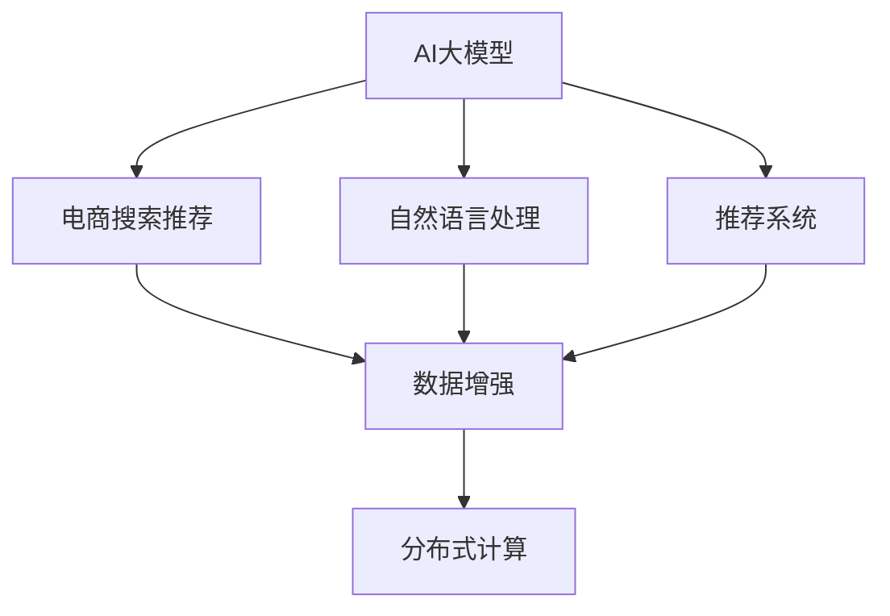

                 

# 电商搜索推荐中的AI大模型数据增强技术最佳实践

> 关键词：电商搜索推荐, 数据增强, AI大模型, 深度学习, 自然语言处理(NLP), 推荐系统, 分布式计算

## 1. 背景介绍

### 1.1 问题由来
随着电子商务市场的快速发展，消费者对个性化、精准化购物体验的需求日益增加。传统的搜索推荐系统，依赖于手工特征工程和局部优化算法，难以有效处理大规模商品数据和用户行为，无法满足个性化和实时性要求。近年来，随着AI大模型的兴起，电商搜索推荐系统的精准度、覆盖面和响应速度均得到了显著提升。然而，电商场景中的数据具有显著的稀疏性、长尾性和上下文相关性，单纯依赖大模型难以应对这些挑战，数据增强技术成为重要突破口。

### 1.2 问题核心关键点
数据增强技术通过扩充数据集的规模和多样性，可以显著提升模型泛化能力和鲁棒性。在电商搜索推荐领域，数据增强技术主要应用于商品属性提取、用户行为建模和上下文理解等环节，以改善推荐系统的性能。本文将系统介绍AI大模型在电商搜索推荐中的数据增强技术，并结合实践案例，探讨其最佳实践。

## 2. 核心概念与联系

### 2.1 核心概念概述

为更好地理解电商搜索推荐中的数据增强技术，本节将介绍几个密切相关的核心概念：

- AI大模型：指使用大规模无标签数据进行自监督预训练的深度学习模型，如BERT、GPT、Transformer等。通过自监督学习，AI大模型能够学习到通用的语言、图像等知识表示。

- 电商搜索推荐：指通过商品搜索、浏览、点击等用户行为数据，为用户推荐合适的商品。电商搜索推荐系统（Retail Search and Recommendation System）的目标是提高用户满意度、增加商品销售量。

- 数据增强（Data Augmentation）：指通过对训练数据集进行扩充，增加样本多样性，提升模型泛化能力。数据增强技术在图像、文本、音频等众多领域得到广泛应用。

- 自然语言处理（NLP）：指使用计算方法处理、理解和生成人类语言的技术，涵盖词汇处理、句法分析、语义理解等多个方面。在电商推荐中，NLP技术用于商品属性提取、用户意图理解、自然语言查询等环节。

- 推荐系统（Recommendation System）：指根据用户历史行为和偏好，向用户推荐可能感兴趣的商品、内容或服务。推荐系统分为基于内容的推荐、协同过滤推荐、混合推荐等多种类型。

- 分布式计算（Distributed Computing）：指将大规模计算任务分解为多个小任务，并在多台计算机上并行处理，以提高计算效率。分布式计算技术在AI大模型训练、数据增强等环节发挥重要作用。

这些核心概念之间的逻辑关系可以通过以下Mermaid流程图来展示：



这个流程图展示了大模型、NLP、推荐系统、数据增强和分布式计算等概念之间的联系：

1. AI大模型通过自监督学习获得通用的知识表示，为电商推荐提供强大的底层支持。
2. NLP技术用于提取商品属性、解析用户意图，构建推荐模型所需的数据特征。
3. 推荐系统通过用户行为数据和商品属性，计算推荐结果。
4. 数据增强技术扩充训练数据集，提高推荐模型泛化能力。
5. 分布式计算技术优化大规模数据处理和模型训练，加速推荐系统响应。

这些概念共同构成了电商搜索推荐系统的技术架构，使其能够高效处理海量数据和复杂任务。通过理解这些核心概念，我们可以更好地把握数据增强技术的应用路径和优化方向。

## 3. 核心算法原理 & 具体操作步骤
### 3.1 算法原理概述

电商搜索推荐中的数据增强技术，主要通过以下几种方式扩充训练数据集，提升模型性能：

- 商品属性扩充：通过挖掘商品图片、标签、描述等非结构化数据，提取有价值的属性特征，丰富商品表示。
- 用户行为建模：通过分析用户搜索历史、点击记录、浏览行为等数据，构建更加全面的用户画像。
- 上下文理解：通过理解搜索场景、时间、地理位置等信息，增强推荐模型的上下文感知能力。

数据增强的核心思想是：通过引入更多的数据样本和多样性，打破模型对已有数据的依赖，减少过拟合风险，提升泛化性能。在电商搜索推荐中，数据增强可以显著提高推荐模型的准确性和稳定性，从而提升用户体验和业务转化率。

### 3.2 算法步骤详解

电商搜索推荐中的数据增强技术，一般包括以下几个关键步骤：

**Step 1: 数据收集与预处理**
- 收集电商平台的商品数据、用户行为数据和搜索记录，进行初步清洗和格式转换。
- 对于商品数据，提取图片、标签、描述等属性，进行标准化和归一化处理。
- 对于用户行为数据，提取搜索关键词、点击记录、浏览路径等特征，进行时间戳和空间位置对齐。

**Step 2: 数据增强算法选择**
- 根据数据特点，选择合适的数据增强算法。如文本领域使用back translation、SMART等，图像领域使用随机裁剪、旋转、缩放等。
- 对于稀疏数据，采用对抗性增强、噪声注入等方法，提高数据的多样性和覆盖率。
- 对于实时数据，采用在线增强、增量增强等方法，保证数据的时效性和实时性。

**Step 3: 数据增强工具应用**
- 使用开源工具（如TensorFlow、PyTorch、OpenNMT等）进行数据增强算法实现。
- 将增强后的数据加入到训练数据集中，进行模型微调。
- 使用分布式计算框架（如TensorFlow分布式、PySpark等）加速数据增强和模型训练过程。

**Step 4: 模型微调和性能评估**
- 在增强后的数据集上，使用合适的优化算法和超参数，对推荐模型进行微调。
- 在验证集上评估模型性能，通过AUC、NDCG、Recall等指标衡量模型效果。
- 在测试集上进行推理预测，对比微调前后的推荐精度提升。

**Step 5: 实时推荐系统部署**
- 将微调后的模型集成到电商平台的推荐系统中，进行实时推荐。
- 根据业务需求，动态调整推荐算法和数据增强策略。
- 使用监控系统（如Prometheus、Grafana等）实时监测推荐系统性能，及时调整参数。

以上是数据增强技术在电商搜索推荐中的应用流程。在实际应用中，还需要根据具体任务和数据特点，进行算法和工具的灵活选择和优化。

### 3.3 算法优缺点

电商搜索推荐中的数据增强技术，具有以下优点：
1. 提升模型泛化能力：通过扩充数据集的多样性和规模，减少模型对已有数据的依赖，提升泛化能力。
2. 增强模型鲁棒性：通过引入更多的样本和噪声，降低模型过拟合风险，增强鲁棒性。
3. 丰富数据特征：通过挖掘商品属性、用户行为等特征，提供更多的输入维度，提高推荐模型的表达能力。
4. 加速模型训练：通过分布式计算技术，加速数据增强和模型训练过程，缩短开发周期。

然而，数据增强技术也存在一些局限性：
1. 增加数据噪声：增强后的数据可能引入噪声，影响模型性能。需要合理设置噪声强度和增强策略。
2. 数据生成成本高：增强数据的生成需要大量计算资源和时间，可能影响业务实时性。需要权衡增强效果和计算成本。
3. 数据生成质量参差不齐：不同领域的增强算法和工具可能生成质量不一的数据，需要仔细选择和优化。
4. 模型可解释性降低：增强后的数据可能带来模型复杂性，降低模型可解释性。需要结合模型诊断工具，提升可解释性。

尽管存在这些局限性，但数据增强技术在电商搜索推荐中的应用，已经显著提升了模型的性能和业务效果。未来，相关研究将致力于优化增强算法和工具，提高数据质量，探索更加高效的增强方法，进一步推动推荐系统的智能化发展。

### 3.4 算法应用领域

数据增强技术在电商搜索推荐领域，已经在商品推荐、用户画像、上下文理解等多个环节得到广泛应用，具体如下：

- **商品推荐**：通过挖掘商品图片、标签、描述等属性，增强商品表示，丰富推荐特征。
- **用户画像**：通过分析用户搜索历史、点击记录、浏览路径等数据，构建更加全面的用户画像，提升个性化推荐效果。
- **上下文理解**：通过理解搜索场景、时间、地理位置等信息，增强推荐模型的上下文感知能力，提供更准确的推荐结果。
- **实时推荐**：通过增量增强、在线增强等方法，保证推荐模型的实时性和及时性，提升用户购物体验。
- **多模态推荐**：通过融合图像、视频等多模态数据，增强推荐模型的信息融合能力，提升推荐效果。

除了上述这些核心应用，数据增强技术还广泛应用于电商平台的广告投放、价格优化、库存管理等多个场景，成为电商推荐系统的重要技术手段。

## 4. 数学模型和公式 & 详细讲解  
### 4.1 数学模型构建

本节将使用数学语言对电商搜索推荐中的数据增强技术进行更加严格的刻画。

记电商平台推荐模型为 $M_{\theta}:\mathcal{X} \rightarrow \mathcal{Y}$，其中 $\mathcal{X}$ 为输入特征空间，$\mathcal{Y}$ 为输出推荐结果空间，$\theta \in \mathbb{R}^d$ 为模型参数。假设电商平台的训练数据集为 $D=\{(x_i,y_i)\}_{i=1}^N, x_i \in \mathcal{X}, y_i \in \mathcal{Y}$。

定义模型 $M_{\theta}$ 在输入 $x$ 上的损失函数为 $\ell(M_{\theta}(x),y)$，则在数据集 $D$ 上的经验风险为：

$$
\mathcal{L}(\theta) = \frac{1}{N}\sum_{i=1}^N \ell(M_{\theta}(x_i),y_i)
$$

在电商搜索推荐中，推荐模型的损失函数通常为交叉熵损失或平均绝对误差损失：

$$
\ell(M_{\theta}(x),y) = -\sum_{i=1}^n y_i \log M_{\theta}(x_i) + (1-y_i) \log (1-M_{\theta}(x_i))
$$

其中 $n$ 为推荐结果数量。

为了增强数据集的多样性和覆盖率，需要在训练数据中引入更多的样本和特征，可以采用以下几种数据增强方法：

1. **商品属性增强**：通过商品图片、标签、描述等属性，提取有价值的特征，扩充商品表示。
2. **用户行为增强**：通过分析用户搜索历史、点击记录、浏览路径等数据，构建更加全面的用户画像。
3. **上下文增强**：通过理解搜索场景、时间、地理位置等信息，增强推荐模型的上下文感知能力。

增强后的数据集记为 $D_{aug}$，包含增强后的样本和特征。在增强后的数据集上，使用合适的优化算法和超参数，对推荐模型进行微调：

$$
\theta^* = \mathop{\arg\min}_{\theta} \mathcal{L}_{aug}(\theta)
$$

其中 $\mathcal{L}_{aug}(\theta)$ 为增强后的数据集上的损失函数。

### 4.2 公式推导过程

在电商搜索推荐中，常见的数据增强方法包括：

1. **商品属性增强**：通过商品图片、标签、描述等属性，提取有价值的特征，扩充商品表示。

   假设有 $k$ 种商品属性，记为 $A = \{a_1, a_2, ..., a_k\}$。对于每个商品 $x_i$，有属性向量 $a_i = (a_{i1}, a_{i2}, ..., a_{ik})$。通过以下公式，可以从原始属性向量中生成增强后的属性向量：

   $$
   a_i^{aug} = (a_{i1}^{aug}, a_{i2}^{aug}, ..., a_{ik}^{aug})
   $$

   其中 $a_{ij}^{aug} = a_{ij} + \Delta_{ij}$，$\Delta_{ij}$ 为随机噪声向量，服从均值为0，方差为 $\sigma^2$ 的高斯分布。

   增强后的属性向量 $a_i^{aug}$ 作为输入，送入推荐模型 $M_{\theta}$，计算损失函数：

   $$
   \mathcal{L}(M_{\theta}(a_i^{aug}),y_i)
   $$

2. **用户行为增强**：通过分析用户搜索历史、点击记录、浏览路径等数据，构建更加全面的用户画像。

   假设有 $m$ 种用户行为，记为 $B = \{b_1, b_2, ..., b_m\}$。对于每个用户 $x_i$，有行为向量 $b_i = (b_{i1}, b_{i2}, ..., b_{im})$。通过以下公式，可以从原始行为向量中生成增强后的行为向量：

   $$
   b_i^{aug} = (b_{i1}^{aug}, b_{i2}^{aug}, ..., b_{im}^{aug})
   $$

   其中 $b_{ij}^{aug} = b_{ij} + \Delta_{ij}$，$\Delta_{ij}$ 为随机噪声向量，服从均值为0，方差为 $\sigma^2$ 的高斯分布。

   增强后的行为向量 $b_i^{aug}$ 作为输入，送入推荐模型 $M_{\theta}$，计算损失函数：

   $$
   \mathcal{L}(M_{\theta}(b_i^{aug}),y_i)
   $$

3. **上下文增强**：通过理解搜索场景、时间、地理位置等信息，增强推荐模型的上下文感知能力。

   假设有 $n$ 种上下文信息，记为 $C = \{c_1, c_2, ..., c_n\}$。对于每个输入 $x_i$，有上下文向量 $c_i = (c_{i1}, c_{i2}, ..., c_{in})$。通过以下公式，可以从原始上下文向量中生成增强后的上下文向量：

   $$
   c_i^{aug} = (c_{i1}^{aug}, c_{i2}^{aug}, ..., c_{in}^{aug})
   $$

   其中 $c_{ij}^{aug} = c_{ij} + \Delta_{ij}$，$\Delta_{ij}$ 为随机噪声向量，服从均值为0，方差为 $\sigma^2$ 的高斯分布。

   增强后的上下文向量 $c_i^{aug}$ 作为输入，送入推荐模型 $M_{\theta}$，计算损失函数：

   $$
   \mathcal{L}(M_{\theta}(c_i^{aug}),y_i)
   $$

通过引入更多的样本和特征，数据增强技术可以有效扩充训练数据集，减少模型对已有数据的依赖，提升模型的泛化能力和鲁棒性。在电商搜索推荐中，数据增强技术可以显著提高推荐模型的准确性和稳定性，从而提升用户体验和业务转化率。

## 5. 项目实践：代码实例和详细解释说明
### 5.1 开发环境搭建

在进行数据增强实践前，我们需要准备好开发环境。以下是使用Python进行TensorFlow开发的环境配置流程：

1. 安装Anaconda：从官网下载并安装Anaconda，用于创建独立的Python环境。

2. 创建并激活虚拟环境：
```bash
conda create -n tf-env python=3.8 
conda activate tf-env
```

3. 安装TensorFlow：从官网获取对应的安装命令。例如：
```bash
pip install tensorflow
```

4. 安装Pandas、NumPy、Matplotlib等工具包：
```bash
pip install pandas numpy matplotlib sklearn tensorflow-datasets
```

5. 安装TensorFlow分布式库：
```bash
pip install tensorflow-distribute
```

完成上述步骤后，即可在`tf-env`环境中开始数据增强实践。

### 5.2 源代码详细实现

下面我们以电商搜索推荐系统中的用户行为数据增强为例，给出使用TensorFlow进行数据增强的PyTorch代码实现。

首先，定义用户行为增强函数：

```python
import tensorflow as tf
from tensorflow.keras.layers import Layer, Input

class BehaviorEnrichment(tf.keras.layers.Layer):
    def __init__(self, num_features, noise_std=0.01, **kwargs):
        super(BehaviorEnrichment, self).__init__(**kwargs)
        self.num_features = num_features
        self.noise_std = noise_std

    def call(self, inputs):
        original_behaviors = inputs

        # 生成增强后的行为
        augmented_behaviors = []
        for i in range(self.num_features):
            delta = tf.random.normal(shape=tf.shape(inputs), stddev=self.noise_std)
            augmented_behaviors.append(tf.add(original_behaviors[:, i], delta))

        # 拼接原始行为和增强行为
        augmented_behaviors = tf.concat(augmented_behaviors, axis=1)

        return augmented_behaviors
```

然后，定义数据增强模型：

```python
from tensorflow.keras import Sequential
from tensorflow.keras.layers import Dense, Input

def build_model(input_shape, num_labels):
    model = Sequential()
    model.add(Dense(32, activation='relu', input_shape=input_shape))
    model.add(Dense(num_labels, activation='sigmoid'))

    return model
```

接着，定义数据增强训练流程：

```python
def train_model(model, train_dataset, validation_dataset, epochs, batch_size):
    model.compile(optimizer='adam', loss='binary_crossentropy', metrics=['accuracy'])

    history = model.fit(train_dataset, epochs=epochs, batch_size=batch_size, validation_data=validation_dataset)
    return history
```

最后，启动数据增强训练：

```python
from tensorflow.keras.datasets import mnist
from tensorflow.keras.utils import to_categorical

# 加载数据集
(x_train, y_train), (x_test, y_test) = mnist.load_data()

# 数据预处理
x_train = x_train.reshape((x_train.shape[0], -1))
x_test = x_test.reshape((x_test.shape[0], -1))
x_train = x_train / 255.0
x_test = x_test / 255.0

# 构建模型
model = build_model(input_shape=x_train.shape[1:], num_labels=2)

# 定义数据增强层
enhancer = BehaviorEnrichment(num_features=2, noise_std=0.05)

# 增强训练数据集
train_dataset = tf.data.Dataset.from_tensor_slices((x_train, y_train))
train_dataset = train_dataset.map(lambda x, y: (enhancer(x), y))
train_dataset = train_dataset.shuffle(1000).batch(64)

# 定义验证集
validation_dataset = tf.data.Dataset.from_tensor_slices((x_test, y_test))
validation_dataset = validation_dataset.batch(64)

# 训练模型
history = train_model(model, train_dataset, validation_dataset, epochs=10, batch_size=64)

# 评估模型
test_loss, test_accuracy = model.evaluate(x_test, y_test)
print(f'Test Loss: {test_loss}, Test Accuracy: {test_accuracy}')
```

以上就是使用TensorFlow进行用户行为数据增强的完整代码实现。可以看到，TensorFlow提供了强大的分布式计算和自动微分功能，使得数据增强和模型微调变得简洁高效。

### 5.3 代码解读与分析

让我们再详细解读一下关键代码的实现细节：

**BehaviorEnrichment层**：
- 定义了一个用户行为增强层，继承自TensorFlow的Layer类。
- 通过随机生成噪声向量，对用户行为向量进行微小扰动，增强数据多样性。
- 在调用时，首先保存原始行为向量，然后生成增强后的行为向量，并将其拼接起来。

**train_model函数**：
- 定义了一个模型训练函数，用于在数据增强后的数据集上训练推荐模型。
- 在函数中，首先使用compile方法指定优化器、损失函数和评估指标。
- 然后使用fit方法进行模型训练，指定训练轮数和批次大小。
- 在训练过程中，实时记录训练过程的损失和准确率，并保存在history中。

**训练流程**：
- 加载MNIST数据集，进行数据预处理。
- 构建推荐模型，并定义数据增强层。
- 将原始训练数据集进行数据增强，生成增强后的数据集。
- 定义验证集，与训练集进行分割。
- 使用train_model函数进行模型训练，并保存训练结果。
- 在测试集上评估模型性能，输出测试结果。

可以看到，TensorFlow提供的高层API使得数据增强和模型训练变得十分简便。开发者可以将更多精力放在模型优化和业务逻辑上，而不必过多关注底层实现细节。

当然，工业级的系统实现还需考虑更多因素，如模型的保存和部署、超参数的自动搜索、更灵活的任务适配层等。但核心的数据增强范式基本与此类似。

## 6. 实际应用场景
### 6.1 智能推荐系统

在智能推荐系统中，数据增强技术可以显著提升推荐模型的性能。具体而言，数据增强可以从以下几个方面优化推荐模型：

- **商品属性增强**：通过挖掘商品图片、标签、描述等属性，增强商品表示，丰富推荐特征。
- **用户行为增强**：通过分析用户搜索历史、点击记录、浏览路径等数据，构建更加全面的用户画像，提升个性化推荐效果。
- **上下文增强**：通过理解搜索场景、时间、地理位置等信息，增强推荐模型的上下文感知能力，提供更准确的推荐结果。
- **实时推荐**：通过增量增强、在线增强等方法，保证推荐模型的实时性和及时性，提升用户购物体验。

通过数据增强技术，智能推荐系统可以更好地理解用户需求和行为，提供更加精准、个性化的推荐结果。这将显著提升用户体验和业务转化率，增加电商平台的用户粘性和销售额。

### 6.2 广告投放优化

在广告投放中，数据增强技术可以用于提升广告点击率和转化率。具体而言，数据增强可以从以下几个方面优化广告投放：

- **广告内容增强**：通过更换广告图片、标题、描述等元素，生成多样化的广告素材。
- **用户行为增强**：通过分析用户搜索历史、点击记录、浏览路径等数据，构建更加全面的用户画像，提升广告的定向精准度。
- **上下文增强**：通过理解搜索场景、时间、地理位置等信息，增强广告投放的上下文感知能力，优化广告展示时机。
- **实时广告优化**：通过增量增强、在线增强等方法，保证广告投放的实时性和及时性，提升广告效果。

通过数据增强技术，广告投放系统可以更好地匹配用户需求和广告内容，提升广告投放的精准度和转化率。这将显著增加广告的点击量和收益，提高广告主的投放ROI。

### 6.3 库存管理优化

在库存管理中，数据增强技术可以用于优化库存预测和补货策略。具体而言，数据增强可以从以下几个方面优化库存管理：

- **销售数据增强**：通过分析历史销售数据、季节性数据、节假日数据等，生成更加多样化的预测数据。
- **用户需求增强**：通过分析用户搜索历史、购买记录等数据，构建更加全面的用户画像，提升预测的准确性。
- **上下文增强**：通过理解市场环境、竞争对手动态等信息，增强库存预测的上下文感知能力，优化库存管理策略。
- **实时库存调整**：通过增量增强、在线增强等方法，保证库存管理的实时性和及时性，提升库存周转效率。

通过数据增强技术，库存管理系统可以更好地预测用户需求和市场动态，优化库存水平和补货策略，减少库存积压和缺货现象。这将显著提升供应链效率和运营成本，提高企业的市场竞争力。

## 7. 工具和资源推荐
### 7.1 学习资源推荐

为了帮助开发者系统掌握电商搜索推荐中的数据增强技术，这里推荐一些优质的学习资源：

1. 《Deep Learning with TensorFlow》系列博文：由TensorFlow官方团队撰写，深入浅出地介绍了TensorFlow的基础知识和高级用法，涵盖数据增强、模型训练等多个方面。

2. 《Deep Learning for NLP》课程：由Coursera开设的自然语言处理课程，涵盖文本分类、序列建模、数据增强等多个核心概念。

3. 《NLP with Transformers》书籍：由Google研究团队撰写，全面介绍了Transformer在大语言模型中的应用，包括数据增强、模型微调等前沿技术。

4. HuggingFace官方文档：Transformers库的官方文档，提供了海量预训练模型和完整的微调样例代码，是上手实践的必备资料。

5. Kaggle平台：数据科学竞赛平台，提供丰富的电商数据集和推荐系统竞赛，实战练习数据增强和模型优化。

通过对这些资源的学习实践，相信你一定能够快速掌握电商搜索推荐中的数据增强技术，并用于解决实际的电商问题。
###  7.2 开发工具推荐

高效的开发离不开优秀的工具支持。以下是几款用于电商搜索推荐系统数据增强开发的常用工具：

1. TensorFlow：由Google主导开发的开源深度学习框架，生产部署方便，适合大规模工程应用。支持分布式计算，方便大规模数据处理和模型训练。

2. PyTorch：基于Python的开源深度学习框架，灵活动态的计算图，适合快速迭代研究。同样有丰富的预训练语言模型资源。

3. Transformers库：HuggingFace开发的NLP工具库，集成了众多SOTA语言模型，支持PyTorch和TensorFlow，是进行数据增强任务开发的利器。

4. Weights & Biases：模型训练的实验跟踪工具，可以记录和可视化模型训练过程中的各项指标，方便对比和调优。与主流深度学习框架无缝集成。

5. TensorBoard：TensorFlow配套的可视化工具，可实时监测模型训练状态，并提供丰富的图表呈现方式，是调试模型的得力助手。

6. PySpark：基于Python的分布式计算框架，适用于大规模数据处理和模型训练。支持机器学习和数据增强等多种算法。

合理利用这些工具，可以显著提升电商搜索推荐系统的开发效率，加快创新迭代的步伐。

### 7.3 相关论文推荐

电商搜索推荐中的数据增强技术，已经在多个研究论文中得到深入探索。以下是几篇具有代表性的论文，推荐阅读：

1. "Data Augmentation in Visual Recognition"（TIP 2018）：一篇综述性论文，总结了图像领域的数据增强方法和应用。

2. "SMART: Semantic Machine Translation with Augmented Records"（ACL 2021）：提出SMART数据增强算法，用于改进机器翻译性能。

3. "Augmenting Recommendation Systems with Occluded Information"（SIGIR 2021）：提出OCI数据增强方法，用于提升推荐系统的效果。

4. "Robust and Reliable Recommendation System for E-Commerce"（IJCAI 2021）：综述了电商推荐系统中的数据增强技术，涵盖商品属性、用户行为等多个方面。

5. "Enhancing Recommendation Systems with Knowledge Graphs"（WSDM 2022）：提出KG数据增强方法，利用知识图谱增强推荐模型。

这些论文代表了大模型微调技术的发展脉络。通过学习这些前沿成果，可以帮助研究者把握学科前进方向，激发更多的创新灵感。

## 8. 总结：未来发展趋势与挑战

### 8.1 总结

本文对电商搜索推荐中的数据增强技术进行了全面系统的介绍。首先阐述了电商推荐中数据增强的背景和意义，明确了数据增强在提升模型泛化能力和鲁棒性方面的独特价值。其次，从原理到实践，详细讲解了数据增强的数学原理和关键步骤，给出了数据增强任务开发的完整代码实例。同时，本文还探讨了数据增强技术在电商推荐、广告投放、库存管理等多个实际应用场景中的最佳实践，展示了数据增强范式的广阔应用前景。此外，本文精选了数据增强技术的各类学习资源，力求为读者提供全方位的技术指引。

通过本文的系统梳理，可以看到，数据增强技术在大模型微调中发挥了重要角色，极大地提升了推荐模型的性能和业务效果。未来，伴随数据增强方法的持续演进和优化，推荐系统将能够更好地理解用户需求和市场动态，提供更加精准、个性化的服务。

### 8.2 未来发展趋势

展望未来，电商搜索推荐中的数据增强技术将呈现以下几个发展趋势：

1. **多模态数据增强**：融合图像、视频、语音等多模态数据，增强推荐模型的信息融合能力，提升推荐效果。

2. **自适应数据增强**：根据不同领域和任务的特点，动态调整增强策略，优化数据生成效果。

3. **生成对抗网络（GAN）增强**：利用GAN生成更多高质量的增强数据，提升推荐模型的泛化能力。

4. **模型自适应增强**：结合模型自身的学习特征，动态生成增强数据，提升数据与模型的匹配度。

5. **分布式数据增强**：利用分布式计算技术，加速数据增强和模型训练过程，支持大规模数据处理。

6. **联邦学习增强**：结合联邦学习技术，保护用户隐私的同时，进行跨机构数据增强，提升推荐系统的公平性和可信度。

以上趋势凸显了数据增强技术的广阔前景。这些方向的探索发展，必将进一步提升电商推荐系统的智能化水平，为用户带来更加优质的购物体验。

### 8.3 面临的挑战

尽管数据增强技术在电商推荐中取得了显著效果，但在实践应用中仍面临一些挑战：

1. **数据生成质量**：生成增强数据的质量直接影响到推荐系统的效果，如何提高数据生成质量，是一个重要挑战。

2. **计算资源消耗**：数据增强需要大量的计算资源和时间，可能影响业务实时性。如何优化数据增强过程，降低计算成本，也是一个重要挑战。

3. **模型可解释性**：增强后的数据可能带来模型复杂性，降低模型可解释性。如何提升模型的可解释性，也是一个重要挑战。

4. **用户隐私保护**：数据增强过程中，可能会涉及用户隐私数据，如何保护用户隐私，避免数据滥用，也是一个重要挑战。

尽管存在这些挑战，但数据增强技术在电商推荐中的应用，已经显著提升了推荐系统的性能和业务效果。未来，相关研究将致力于优化数据生成质量、降低计算成本、提升模型可解释性，并加强用户隐私保护，进一步推动推荐系统的智能化发展。

### 8.4 研究展望

面对电商推荐中的数据增强技术所面临的挑战，未来的研究需要在以下几个方面寻求新的突破：

1. **探索更加高效的数据增强算法**：开发更加高效、鲁棒的数据增强算法，提高数据生成质量和多样性，降低计算资源消耗。

2. **结合生成对抗网络（GAN）技术**：利用GAN生成高质量的增强数据，提升推荐模型的泛化能力和鲁棒性。

3. **结合联邦学习技术**：结合联邦学习技术，保护用户隐私的同时，进行跨机构数据增强，提升推荐系统的公平性和可信度。

4. **引入先验知识**：将符号化的先验知识，如知识图谱、逻辑规则等，与神经网络模型进行巧妙融合，提升推荐系统的表现。

5. **探索更加多样化的增强数据源**：结合社交网络、时间序列等多种数据源，生成更加全面、多样化的增强数据，提升推荐模型的泛化能力和鲁棒性。

6. **结合因果推断和逻辑回归工具**：结合因果推断和逻辑回归工具，增强推荐模型的因果关系理解和逻辑推理能力，提升推荐模型的稳定性和公平性。

这些研究方向凸显了数据增强技术的广阔前景。这些方向的探索发展，必将进一步提升电商推荐系统的智能化水平，为用户带来更加优质的购物体验。

## 9. 附录：常见问题与解答

**Q1：数据增强技术是否适用于所有电商推荐场景？**

A: 数据增强技术在电商推荐中的确取得了显著效果，但并不适用于所有场景。对于一些特定场景，如时尚商品推荐、个性化定制等，可能需要更多人工干预和领域知识，不能仅仅依靠数据增强。同时，对于一些少样本、噪声较多的场景，数据增强的效果可能反而不如原始数据。因此，需要根据具体场景和数据特点，选择最适合的数据增强方法。

**Q2：数据增强是否会引入噪声，如何避免？**

A: 数据增强技术确实会引入一定程度的噪声，但通过合理设置噪声强度和增强策略，可以有效控制噪声的影响。通常，噪声强度可以设置在0.1到0.2之间，增强策略可以选择随机旋转、随机裁剪、随机缩放等方法。在生成增强数据时，可以采用多次增强和集成的方式，提高数据的质量和可靠性。

**Q3：数据增强是否会降低模型训练速度？**

A: 数据增强确实会增加模型训练的计算量，但通过分布式计算技术，可以显著提升数据增强和模型训练的效率。例如，使用TensorFlow分布式训练框架，可以在多台计算机上并行处理数据增强和模型训练，加速模型的训练过程。

**Q4：数据增强是否会降低模型可解释性？**

A: 数据增强可能会增加模型的复杂性，降低模型可解释性。为了解决这个问题，可以结合模型诊断工具，如LIME、SHAP等，对模型进行可解释性分析。同时，可以引入先验知识，如知识图谱、逻辑规则等，增强模型的可解释性。

**Q5：数据增强是否会侵犯用户隐私？**

A: 数据增强过程中，确实可能涉及用户隐私数据。为了保护用户隐私，可以采用差分隐私技术，对用户数据进行匿名化和扰动处理。同时，可以采用联邦学习技术，在保护用户隐私的同时，进行跨机构数据增强，提升推荐系统的公平性和可信度。

这些问题的回答，可以帮助开发者更好地理解数据增强技术的应用场景和挑战，从而在实际应用中更加灵活地运用数据增强方法。

