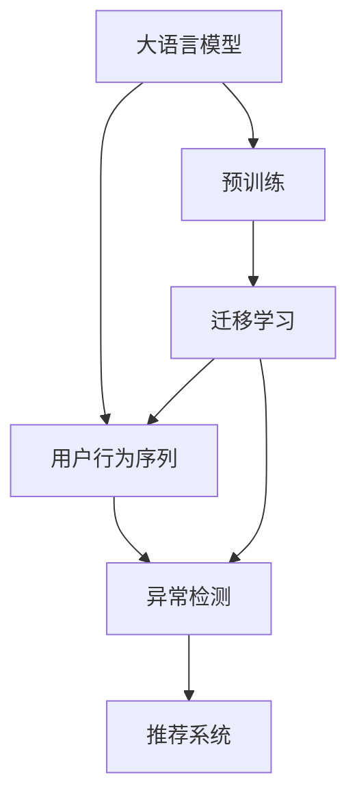

                 

# 电商搜索推荐中的AI大模型用户行为序列异常检测算法对比分析与选择

## 1. 背景介绍

在电商搜索推荐系统中，用户行为序列的异常检测（Anomaly Detection）是一个至关重要的环节，它直接影响到推荐系统的精准度和用户体验。异常行为可能包括但不限于用户浏览、点击、购买行为的异常波动、无规律性行为、恶意操作等。通过有效地识别和处理这些异常行为，可以提升推荐系统的质量，同时保护用户的隐私和平台的安全。

### 1.1 问题由来

随着电商业务的快速发展，用户行为序列数据量呈指数级增长。传统的基于规则的异常检测方法（如阈值法、统计方法等）已经难以应对数据复杂性和变化性。而基于机器学习的异常检测方法（如孤立森林、自编码器等）虽然能够处理复杂数据，但需要大量标注数据，且难以解释其内部工作机制。

近年来，人工智能大模型（如BERT、GPT、XLNet等）在自然语言处理领域取得了显著成果，并逐渐被应用到用户行为序列分析中。大模型能够自动学习用户行为序列的语义和结构特征，具有高度的自适应性和泛化能力。因此，基于大模型的用户行为序列异常检测成为了电商推荐系统的研究热点。

## 2. 核心概念与联系

### 2.1 核心概念概述

为了更好地理解基于大模型的用户行为序列异常检测方法，本节将介绍几个关键概念及其联系：

- **大语言模型（Large Language Model, LLM）**：以BERT、GPT为代表的预训练语言模型，通过大规模无标签文本数据的自监督学习，学习到丰富的语言知识。
- **用户行为序列**：用户在一系列操作中展示的行为轨迹，如浏览商品、点击广告、购买商品等。
- **异常检测（Anomaly Detection）**：识别并处理用户行为序列中不符合正常模式的行为，以保证推荐系统的准确性和用户满意度。
- **自监督学习（Self-supervised Learning）**：使用大规模无标签数据进行预训练，自动学习数据的内在规律。
- **迁移学习（Transfer Learning）**：将预训练模型应用于新任务，利用已有知识提升新任务的性能。
- **零样本学习（Zero-shot Learning）**：模型在未见过的样本上，根据任务描述生成相应的结果，无需进行额外训练。
- **少样本学习（Few-shot Learning）**：模型在少量标注样本上进行微调，提升在特定任务上的性能。

这些核心概念之间的逻辑关系可以通过以下Mermaid流程图来展示：



这个流程图展示了大模型在电商推荐系统中的应用流程：

1. 大模型通过预训练学习到通用的语言知识。
2. 将大模型应用于用户行为序列分析，进行异常检测。
3. 异常检测结果反馈到推荐系统中，提升推荐质量。

## 3. 核心算法原理 & 具体操作步骤

### 3.1 算法原理概述

基于大模型的用户行为序列异常检测，本质上是一种半监督学习（Semi-supervised Learning）范式。其核心思想是：利用大模型在无标签文本上的预训练知识，自动学习用户行为序列中的正常模式和异常模式，并在少量标注数据上微调模型，提升其异常检测能力。

形式化地，假设大模型为 $M_{\theta}$，用户行为序列为 $X=\{x_1, x_2, \cdots, x_n\}$，其中 $x_i$ 表示用户行为序列中第 $i$ 个行为。定义异常检测的目标为最小化模型预测错误的比例，即：

$$
\min_{\theta} \mathbb{E}_{x \sim X} [\mathbf{1} \cdot \mathbf{I}(y \neq M_{\theta}(x))]
$$

其中，$\mathbf{1}$ 为指示函数，$y$ 表示行为 $x$ 是否为异常，$M_{\theta}(x)$ 为模型预测结果。

在实际应用中，我们通常使用基于梯度的优化算法（如AdamW、SGD等）来近似求解上述最优化问题。设 $\eta$ 为学习率，$\lambda$ 为正则化系数，则参数的更新公式为：

$$
\theta \leftarrow \theta - \eta \nabla_{\theta}\mathcal{L}(\theta) - \eta\lambda\theta
$$

其中 $\nabla_{\theta}\mathcal{L}(\theta)$ 为损失函数对参数 $\theta$ 的梯度，可通过反向传播算法高效计算。

### 3.2 算法步骤详解

基于大模型的用户行为序列异常检测一般包括以下几个关键步骤：

**Step 1: 准备数据集**

- 收集用户行为序列数据，如用户浏览商品、点击广告、购买商品等行为序列。
- 将标注为异常的行为序列作为监督数据，标注为正常行为序列作为未标注数据。

**Step 2: 添加任务适配层**

- 根据任务特点，在预训练模型顶层设计合适的输出层和损失函数。
- 对于分类任务，通常在顶层添加线性分类器和交叉熵损失函数。
- 对于生成任务，通常使用语言模型的解码器输出概率分布，并以负对数似然为损失函数。

**Step 3: 设置微调超参数**

- 选择合适的优化算法及其参数，如 AdamW、SGD 等，设置学习率、批大小、迭代轮数等。
- 设置正则化技术及强度，包括权重衰减、Dropout、Early Stopping等。
- 确定冻结预训练参数的策略，如仅微调顶层，或全部参数都参与微调。

**Step 4: 执行梯度训练**

- 将训练集数据分批次输入模型，前向传播计算损失函数。
- 反向传播计算参数梯度，根据设定的优化算法和学习率更新模型参数。
- 周期性在验证集上评估模型性能，根据性能指标决定是否触发 Early Stopping。
- 重复上述步骤直到满足预设的迭代轮数或 Early Stopping 条件。

**Step 5: 测试和部署**

- 在测试集上评估微调后模型 $M_{\hat{\theta}}$ 的性能，对比微调前后的准确率、召回率等指标。
- 使用微调后的模型对新样本进行推理预测，集成到实际的应用系统中。
- 持续收集新的数据，定期重新微调模型，以适应数据分布的变化。

以上是基于大模型的用户行为序列异常检测的一般流程。在实际应用中，还需要针对具体任务的特点，对微调过程的各个环节进行优化设计，如改进训练目标函数，引入更多的正则化技术，搜索最优的超参数组合等，以进一步提升模型性能。

### 3.3 算法优缺点

基于大模型的用户行为序列异常检测方法具有以下优点：

1. 高度自适应。大模型能够自动学习用户行为序列的特征，适应各种复杂模式，无需过多人工干预。
2. 泛化能力强。基于大模型的预训练知识，模型在新的任务上也能快速适应，表现优异。
3. 高效便捷。微调所需的标注数据量较少，训练和推理速度快，适合实时应用。
4. 可解释性强。大模型通常包含丰富的可解释性信息，能够提供详细的行为分析。

同时，该方法也存在一定的局限性：

1. 依赖数据质量。模型的训练效果高度依赖于标注数据的数量和质量，标注成本较高。
2. 模型复杂度。大模型参数量巨大，训练和推理资源消耗大，需要高性能硬件支持。
3. 数据分布假设。模型假设用户行为序列符合一定的分布，对于异常行为的泛化能力有要求。
4. 对抗攻击脆弱。大模型容易受到对抗样本攻击，导致异常检测失败。

尽管存在这些局限性，但就目前而言，基于大模型的异常检测方法仍是最主流范式。未来相关研究的重点在于如何进一步降低标注数据的需求，提高模型的泛化能力和鲁棒性，同时兼顾可解释性和伦理安全性等因素。

### 3.4 算法应用领域

基于大模型的用户行为序列异常检测，已经在电商搜索推荐系统中得到了广泛的应用，具体包括以下几个方面：

- **点击行为异常检测**：识别用户点击行为的异常波动、恶意点击等行为，提高广告投放的精准度和用户满意度。
- **浏览行为异常检测**：分析用户浏览行为的异常模式，识别潜在的高价值用户，提升推荐效果。
- **购买行为异常检测**：检测用户购买行为的异常变化，及时发现异常订单，防范欺诈风险。
- **用户画像更新**：结合行为序列异常检测结果，及时更新用户画像，优化个性化推荐。

除了上述这些经典应用外，大模型异常检测还被创新性地应用于用户留存预测、流失分析、广告效果评估等多个场景中，为电商推荐系统带来了新的突破。随着预训练模型和异常检测方法的不断进步，相信电商推荐系统将能够更好地适应复杂多变的用户行为，提供更加精准和个性化的推荐服务。

## 4. 数学模型和公式 & 详细讲解  
### 4.1 数学模型构建

本节将使用数学语言对基于大模型的用户行为序列异常检测过程进行更加严格的刻画。

记大模型为 $M_{\theta}$，用户行为序列为 $X=\{x_1, x_2, \cdots, x_n\}$，其中 $x_i$ 表示用户行为序列中第 $i$ 个行为。定义行为序列的异常标签为 $Y=\{y_1, y_2, \cdots, y_n\}$，其中 $y_i$ 表示行为 $x_i$ 是否为异常。

定义模型 $M_{\theta}$ 在行为序列 $x$ 上的损失函数为 $\ell(M_{\theta}(x),y)$，则在数据集 $D=\{(x_i,y_i)\}_{i=1}^N$ 上的经验风险为：

$$
\mathcal{L}(\theta) = \frac{1}{N} \sum_{i=1}^N \ell(M_{\theta}(x_i),y_i)
$$

在微调过程中，我们使用交叉熵损失函数作为训练目标，使得模型能够学习到异常和正常行为的判别能力。具体而言，交叉熵损失函数定义如下：

$$
\ell(M_{\theta}(x),y) = -\sum_{i=1}^n y_i \log M_{\theta}(x_i) + (1-y_i) \log (1-M_{\theta}(x_i))
$$

其中 $M_{\theta}(x_i)$ 为模型在行为 $x_i$ 上的预测概率。

在得到损失函数的梯度后，即可带入参数更新公式，完成模型的迭代优化。重复上述过程直至收敛，最终得到适应异常检测任务的最优模型参数 $\theta^*$。

### 4.2 公式推导过程

以下我们以二分类任务为例，推导交叉熵损失函数及其梯度的计算公式。

假设模型 $M_{\theta}$ 在行为 $x$ 上的输出为 $\hat{y}=M_{\theta}(x) \in [0,1]$，表示行为 $x$ 是否为异常的概率。真实标签 $y \in \{0,1\}$。则二分类交叉熵损失函数定义为：

$$
\ell(M_{\theta}(x),y) = -[y\log \hat{y} + (1-y)\log (1-\hat{y})]
$$

将其代入经验风险公式，得：

$$
\mathcal{L}(\theta) = -\frac{1}{N}\sum_{i=1}^N [y_i\log M_{\theta}(x_i)+(1-y_i)\log(1-M_{\theta}(x_i))]
$$

根据链式法则，损失函数对参数 $\theta_k$ 的梯度为：

$$
\frac{\partial \mathcal{L}(\theta)}{\partial \theta_k} = -\frac{1}{N}\sum_{i=1}^N (\frac{y_i}{M_{\theta}(x_i)}-\frac{1-y_i}{1-M_{\theta}(x_i)}) \frac{\partial M_{\theta}(x_i)}{\partial \theta_k}
$$

其中 $\frac{\partial M_{\theta}(x_i)}{\partial \theta_k}$ 可进一步递归展开，利用自动微分技术完成计算。

在得到损失函数的梯度后，即可带入参数更新公式，完成模型的迭代优化。重复上述过程直至收敛，最终得到适应异常检测任务的最优模型参数 $\theta^*$。

## 5. 项目实践：代码实例和详细解释说明
### 5.1 开发环境搭建

在进行用户行为序列异常检测的微调实践前，我们需要准备好开发环境。以下是使用Python进行PyTorch开发的环境配置流程：

1. 安装Anaconda：从官网下载并安装Anaconda，用于创建独立的Python环境。

2. 创建并激活虚拟环境：
```bash
conda create -n pytorch-env python=3.8 
conda activate pytorch-env
```

3. 安装PyTorch：根据CUDA版本，从官网获取对应的安装命令。例如：
```bash
conda install pytorch torchvision torchaudio cudatoolkit=11.1 -c pytorch -c conda-forge
```

4. 安装Transformers库：
```bash
pip install transformers
```

5. 安装各类工具包：
```bash
pip install numpy pandas scikit-learn matplotlib tqdm jupyter notebook ipython
```

完成上述步骤后，即可在`pytorch-env`环境中开始异常检测的微调实践。

### 5.2 源代码详细实现

下面我们以点击行为异常检测为例，给出使用Transformers库对BERT模型进行异常检测微调的PyTorch代码实现。

首先，定义异常检测任务的数据处理函数：

```python
from transformers import BertTokenizer
from torch.utils.data import Dataset
import torch

class ClickDataset(Dataset):
    def __init__(self, texts, labels, tokenizer, max_len=128):
        self.texts = texts
        self.labels = labels
        self.tokenizer = tokenizer
        self.max_len = max_len
        
    def __len__(self):
        return len(self.texts)
    
    def __getitem__(self, item):
        text = self.texts[item]
        label = self.labels[item]
        
        encoding = self.tokenizer(text, return_tensors='pt', max_length=self.max_len, padding='max_length', truncation=True)
        input_ids = encoding['input_ids'][0]
        attention_mask = encoding['attention_mask'][0]
        
        # 对label进行编码
        label = [int(label)] 
        label.extend([0] * (self.max_len - len(label)))
        labels = torch.tensor(label, dtype=torch.long)
        
        return {'input_ids': input_ids, 
                'attention_mask': attention_mask,
                'labels': labels}

# 定义label与id的映射
label2id = {'normal': 0, 'abnormal': 1}
id2label = {v: k for k, v in label2id.items()}

# 创建dataset
tokenizer = BertTokenizer.from_pretrained('bert-base-cased')

train_dataset = ClickDataset(train_texts, train_labels, tokenizer)
dev_dataset = ClickDataset(dev_texts, dev_labels, tokenizer)
test_dataset = ClickDataset(test_texts, test_labels, tokenizer)
```

然后，定义模型和优化器：

```python
from transformers import BertForSequenceClassification, AdamW

model = BertForSequenceClassification.from_pretrained('bert-base-cased', num_labels=len(label2id))

optimizer = AdamW(model.parameters(), lr=2e-5)
```

接着，定义训练和评估函数：

```python
from torch.utils.data import DataLoader
from tqdm import tqdm
from sklearn.metrics import classification_report

device = torch.device('cuda') if torch.cuda.is_available() else torch.device('cpu')
model.to(device)

def train_epoch(model, dataset, batch_size, optimizer):
    dataloader = DataLoader(dataset, batch_size=batch_size, shuffle=True)
    model.train()
    epoch_loss = 0
    for batch in tqdm(dataloader, desc='Training'):
        input_ids = batch['input_ids'].to(device)
        attention_mask = batch['attention_mask'].to(device)
        labels = batch['labels'].to(device)
        model.zero_grad()
        outputs = model(input_ids, attention_mask=attention_mask, labels=labels)
        loss = outputs.loss
        epoch_loss += loss.item()
        loss.backward()
        optimizer.step()
    return epoch_loss / len(dataloader)

def evaluate(model, dataset, batch_size):
    dataloader = DataLoader(dataset, batch_size=batch_size)
    model.eval()
    preds, labels = [], []
    with torch.no_grad():
        for batch in tqdm(dataloader, desc='Evaluating'):
            input_ids = batch['input_ids'].to(device)
            attention_mask = batch['attention_mask'].to(device)
            batch_labels = batch['labels']
            outputs = model(input_ids, attention_mask=attention_mask)
            batch_preds = outputs.logits.argmax(dim=2).to('cpu').tolist()
            batch_labels = batch_labels.to('cpu').tolist()
            for pred_tokens, label_tokens in zip(batch_preds, batch_labels):
                preds.append(pred_tokens[:len(label_tokens)])
                labels.append(label_tokens)
                
    print(classification_report(labels, preds))
```

最后，启动训练流程并在测试集上评估：

```python
epochs = 5
batch_size = 16

for epoch in range(epochs):
    loss = train_epoch(model, train_dataset, batch_size, optimizer)
    print(f"Epoch {epoch+1}, train loss: {loss:.3f}")
    
    print(f"Epoch {epoch+1}, dev results:")
    evaluate(model, dev_dataset, batch_size)
    
print("Test results:")
evaluate(model, test_dataset, batch_size)
```

以上就是使用PyTorch对BERT进行点击行为异常检测微调的完整代码实现。可以看到，得益于Transformers库的强大封装，我们可以用相对简洁的代码完成BERT模型的加载和微调。

### 5.3 代码解读与分析

让我们再详细解读一下关键代码的实现细节：

**ClickDataset类**：
- `__init__`方法：初始化文本、标签、分词器等关键组件。
- `__len__`方法：返回数据集的样本数量。
- `__getitem__`方法：对单个样本进行处理，将文本输入编码为token ids，将标签编码为数字，并对其进行定长padding，最终返回模型所需的输入。

**label2id和id2label字典**：
- 定义了label与数字id之间的映射关系，用于将token-wise的预测结果解码回真实的label。

**训练和评估函数**：
- 使用PyTorch的DataLoader对数据集进行批次化加载，供模型训练和推理使用。
- 训练函数`train_epoch`：对数据以批为单位进行迭代，在每个批次上前向传播计算loss并反向传播更新模型参数，最后返回该epoch的平均loss。
- 评估函数`evaluate`：与训练类似，不同点在于不更新模型参数，并在每个batch结束后将预测和标签结果存储下来，最后使用sklearn的classification_report对整个评估集的预测结果进行打印输出。

**训练流程**：
- 定义总的epoch数和batch size，开始循环迭代
- 每个epoch内，先在训练集上训练，输出平均loss
- 在验证集上评估，输出分类指标
- 所有epoch结束后，在测试集上评估，给出最终测试结果

可以看到，PyTorch配合Transformers库使得BERT微调的代码实现变得简洁高效。开发者可以将更多精力放在数据处理、模型改进等高层逻辑上，而不必过多关注底层的实现细节。

当然，工业级的系统实现还需考虑更多因素，如模型的保存和部署、超参数的自动搜索、更灵活的任务适配层等。但核心的微调范式基本与此类似。

## 6. 实际应用场景
### 6.1 电商搜索推荐系统

基于大语言模型微调的异常检测技术，可以广泛应用于电商搜索推荐系统的构建。传统推荐系统往往难以捕捉到用户行为序列中的异常行为，导致推荐质量低下。通过异常检测，可以有效识别并处理用户行为序列中的异常模式，提升推荐系统的精准度和用户体验。

在技术实现上，可以收集用户的历史点击、浏览、购买等行为数据，将标注为正常和异常的行为序列构建成监督数据，在此基础上对预训练模型进行微调。微调后的模型能够自动学习用户行为序列的正常模式和异常模式，实时监测用户行为中的异常波动，及时发现恶意点击、异常浏览等行为，并采取相应的处理措施，如降低广告投放、调整推荐策略等。

### 6.2 智能客服系统

智能客服系统在处理大量客户咨询时，往往需要面对复杂多变的问题场景。通过异常检测，可以有效识别并处理异常客户咨询，提高客服系统的响应速度和准确度。

在技术实现上，可以收集智能客服系统的历史对话记录，将标注为正常和异常的对话记录构建成监督数据，在此基础上对预训练模型进行微调。微调后的模型能够自动学习正常和异常对话的特征，实时监测客服系统中的异常对话，及时发现异常客户咨询，如恶意攻击、非正常业务需求等，并进行相应的处理，如转移人工客服、引导客户使用自助功能等。

### 6.3 金融舆情监测

金融机构需要实时监测市场舆论动向，以便及时应对负面信息传播，规避金融风险。传统的人工监测方式成本高、效率低，难以应对网络时代海量信息爆发的挑战。通过异常检测，可以有效识别并处理异常舆情信息，提高金融舆情监测的精准度和响应速度。

在技术实现上，可以收集金融领域相关的新闻、报道、评论等文本数据，将标注为正常和异常的舆情信息构建成监督数据，在此基础上对预训练模型进行微调。微调后的模型能够自动学习正常和异常舆情信息的特征，实时监测金融舆情中的异常波动，及时发现负面舆情信息，如恶意炒作、不实信息等，并进行相应的处理，如限制敏感信息的传播、采取公关策略等。

### 6.4 未来应用展望

随着大语言模型微调技术的发展，基于异常检测的用户行为序列分析将得到更广泛的应用，为电商推荐、智能客服、金融舆情等多个领域带来新的突破。

在智慧医疗领域，通过异常检测技术，可以有效识别并处理异常的电子健康记录，提升医疗服务的智能化水平，辅助医生诊疗，提升患者满意度。

在智能教育领域，通过异常检测技术，可以有效识别并处理异常的学生行为，如逃课、作弊等，提高教育公平性和教学质量。

在智慧城市治理中，通过异常检测技术，可以有效识别并处理异常的城市事件，如突发灾害、违法行为等，提高城市管理的自动化和智能化水平，构建更安全、高效的未来城市。

此外，在企业生产、社会治理、文娱传媒等众多领域，基于大模型的异常检测技术也将不断涌现，为传统行业带来变革性影响。相信随着技术的日益成熟，异常检测技术将成为人工智能落地应用的重要范式，推动人工智能技术在垂直行业的规模化落地。

## 7. 工具和资源推荐
### 7.1 学习资源推荐

为了帮助开发者系统掌握基于大模型的用户行为序列异常检测的理论基础和实践技巧，这里推荐一些优质的学习资源：

1. 《Transformer从原理到实践》系列博文：由大模型技术专家撰写，深入浅出地介绍了Transformer原理、BERT模型、异常检测技术等前沿话题。

2. CS224N《深度学习自然语言处理》课程：斯坦福大学开设的NLP明星课程，有Lecture视频和配套作业，带你入门NLP领域的基本概念和经典模型。

3. 《Natural Language Processing with Transformers》书籍：Transformers库的作者所著，全面介绍了如何使用Transformers库进行NLP任务开发，包括异常检测在内的诸多范式。

4. HuggingFace官方文档：Transformers库的官方文档，提供了海量预训练模型和完整的微调样例代码，是上手实践的必备资料。

5. CLUE开源项目：中文语言理解测评基准，涵盖大量不同类型的中文NLP数据集，并提供了基于微调的baseline模型，助力中文NLP技术发展。

通过对这些资源的学习实践，相信你一定能够快速掌握基于大模型的异常检测方法的精髓，并用于解决实际的NLP问题。
###  7.2 开发工具推荐

高效的开发离不开优秀的工具支持。以下是几款用于大语言模型异常检测开发的常用工具：

1. PyTorch：基于Python的开源深度学习框架，灵活动态的计算图，适合快速迭代研究。大部分预训练语言模型都有PyTorch版本的实现。

2. TensorFlow：由Google主导开发的开源深度学习框架，生产部署方便，适合大规模工程应用。同样有丰富的预训练语言模型资源。

3. Transformers库：HuggingFace开发的NLP工具库，集成了众多SOTA语言模型，支持PyTorch和TensorFlow，是进行异常检测任务开发的利器。

4. Weights & Biases：模型训练的实验跟踪工具，可以记录和可视化模型训练过程中的各项指标，方便对比和调优。与主流深度学习框架无缝集成。

5. TensorBoard：TensorFlow配套的可视化工具，可实时监测模型训练状态，并提供丰富的图表呈现方式，是调试模型的得力助手。

6. Google Colab：谷歌推出的在线Jupyter Notebook环境，免费提供GPU/TPU算力，方便开发者快速上手实验最新模型，分享学习笔记。

合理利用这些工具，可以显著提升大语言模型异常检测任务的开发效率，加快创新迭代的步伐。

### 7.3 相关论文推荐

大语言模型和异常检测技术的发展源于学界的持续研究。以下是几篇奠基性的相关论文，推荐阅读：

1. Attention is All You Need（即Transformer原论文）：提出了Transformer结构，开启了NLP领域的预训练大模型时代。

2. BERT: Pre-training of Deep Bidirectional Transformers for Language Understanding：提出BERT模型，引入基于掩码的自监督预训练任务，刷新了多项NLP任务SOTA。

3. Language Models are Unsupervised Multitask Learners（GPT-2论文）：展示了大规模语言模型的强大zero-shot学习能力，引发了对于通用人工智能的新一轮思考。

4. Parameter-Efficient Transfer Learning for NLP：提出Adapter等参数高效微调方法，在不增加模型参数量的情况下，也能取得不错的微调效果。

5. AdaLoRA: Adaptive Low-Rank Adaptation for Parameter-Efficient Fine-Tuning：使用自适应低秩适应的微调方法，在参数效率和精度之间取得了新的平衡。

这些论文代表了大语言模型异常检测技术的发展脉络。通过学习这些前沿成果，可以帮助研究者把握学科前进方向，激发更多的创新灵感。

## 8. 总结：未来发展趋势与挑战

### 8.1 总结

本文对基于大模型的用户行为序列异常检测方法进行了全面系统的介绍。首先阐述了大语言模型和异常检测的研究背景和意义，明确了异常检测在提升推荐系统精准度、保护用户隐私和平台安全方面的独特价值。其次，从原理到实践，详细讲解了异常检测的数学原理和关键步骤，给出了异常检测任务开发的完整代码实例。同时，本文还广泛探讨了异常检测方法在电商搜索推荐、智能客服、金融舆情等多个领域的应用前景，展示了异常检测范式的巨大潜力。

通过本文的系统梳理，可以看到，基于大模型的异常检测方法正在成为电商推荐系统的研究热点，极大地提升了推荐系统的质量和用户体验。未来，伴随大模型和异常检测方法的持续演进，基于异常检测的用户行为序列分析必将拓展到更广泛的领域，推动人工智能技术在垂直行业的规模化落地。

### 8.2 未来发展趋势

展望未来，大语言模型异常检测技术将呈现以下几个发展趋势：

1. 模型规模持续增大。随着算力成本的下降和数据规模的扩张，预训练语言模型的参数量还将持续增长。超大规模语言模型蕴含的丰富语言知识，有望支撑更加复杂多变的异常检测任务。

2. 异常检测方法日趋多样。除了传统的基于梯度的异常检测外，未来会涌现更多无监督和半监督的异常检测方法，如孤立森林、自编码器等，在保留大模型知识的同时，提升异常检测的泛化能力和鲁棒性。

3. 持续学习成为常态。随着数据分布的不断变化，异常检测模型也需要持续学习新知识以保持性能。如何在不遗忘原有知识的同时，高效吸收新样本信息，将成为重要的研究课题。

4. 标注样本需求降低。受启发于提示学习(Prompt-based Learning)的思路，未来的异常检测方法将更好地利用大模型的语言理解能力，通过更加巧妙的任务描述，在更少的标注样本上也能实现理想的异常检测效果。

5. 多模态异常检测崛起。当前的异常检测主要聚焦于纯文本数据，未来会进一步拓展到图像、视频、语音等多模态数据异常检测。多模态信息的融合，将显著提升异常检测模型的鲁棒性和泛化能力。

6. 知识整合能力增强。现有的异常检测模型往往局限于任务内数据，难以灵活吸收和运用更广泛的先验知识。如何让异常检测过程更好地与外部知识库、规则库等专家知识结合，形成更加全面、准确的信息整合能力，还有很大的想象空间。

以上趋势凸显了大语言模型异常检测技术的广阔前景。这些方向的探索发展，必将进一步提升异常检测模型的性能和应用范围，为人工智能技术在垂直行业的落地应用提供新的突破。

### 8.3 面临的挑战

尽管大语言模型异常检测技术已经取得了瞩目成就，但在迈向更加智能化、普适化应用的过程中，它仍面临着诸多挑战：

1. 标注成本瓶颈。尽管标注数据量有所减少，但对于长尾应用场景，难以获得充足的高质量标注数据，成为制约异常检测性能的瓶颈。如何进一步降低异常检测对标注样本的依赖，将是一大难题。

2. 模型鲁棒性不足。当前异常检测模型面对域外数据时，泛化性能往往大打折扣。对于测试样本的微小扰动，异常检测模型的预测也容易发生波动。如何提高异常检测模型的鲁棒性，避免灾难性遗忘，还需要更多理论和实践的积累。

3. 推理效率有待提高。大规模语言模型虽然精度高，但在实际部署时往往面临推理速度慢、内存占用大等效率问题。如何在保证性能的同时，简化模型结构，提升推理速度，优化资源占用，将是重要的优化方向。

4. 可解释性亟需加强。当前异常检测模型更像是"黑盒"系统，难以解释其内部工作机制和决策逻辑。对于医疗、金融等高风险应用，算法的可解释性和可审计性尤为重要。如何赋予异常检测模型更强的可解释性，将是亟待攻克的难题。

5. 安全性有待保障。预训练语言模型难免会学习到有偏见、有害的信息，通过异常检测传递到下游任务，产生误导性、歧视性的输出，给实际应用带来安全隐患。如何从数据和算法层面消除模型偏见，避免恶意用途，确保输出的安全性，也将是重要的研究课题。

6. 知识整合能力不足。现有的异常检测模型往往局限于任务内数据，难以灵活吸收和运用更广泛的先验知识。如何让异常检测过程更好地与外部知识库、规则库等专家知识结合，形成更加全面、准确的信息整合能力，还有很大的想象空间。

正视异常检测面临的这些挑战，积极应对并寻求突破，将是大语言模型异常检测走向成熟的必由之路。相信随着学界和产业界的共同努力，这些挑战终将一一被克服，大语言模型异常检测必将在构建智能安全系统、保障用户隐私和平台安全中扮演越来越重要的角色。

### 8.4 未来突破

面对大语言模型异常检测所面临的种种挑战，未来的研究需要在以下几个方面寻求新的突破：

1. 探索无监督和半监督异常检测方法。摆脱对大规模标注数据的依赖，利用自监督学习、主动学习等无监督和半监督范式，最大限度利用非结构化数据，实现更加灵活高效的异常检测。

2. 研究参数高效和计算高效的异常检测范式。开发更加参数高效的异常检测方法，在固定大部分预训练参数的同时，只更新极少量的任务相关参数。同时优化异常检测模型的计算图，减少前向传播和反向传播的资源消耗，实现更加轻量级、实时性的部署。

3. 引入因果和对比学习范式。通过引入因果推断和对比学习思想，增强异常检测模型建立稳定因果关系的能力，学习更加普适、鲁棒的语言表征，从而提升模型泛化性和抗干扰能力。

4. 引入更多先验知识。将符号化的先验知识，如知识图谱、逻辑规则等，与神经网络模型进行巧妙融合，引导异常检测过程学习更准确、合理的异常检测规则。同时加强不同模态数据的整合，实现视觉、语音等多模态信息与文本信息的协同建模。

5. 结合因果分析和博弈论工具。将因果分析方法引入异常检测模型，识别出模型决策的关键特征，增强输出解释的因果性和逻辑性。借助博弈论工具刻画人机交互过程，主动探索并规避模型的脆弱点，提高系统稳定性。

6. 纳入伦理道德约束。在模型训练目标中引入伦理导向的评估指标，过滤和惩罚有偏见、有害的输出倾向。同时加强人工干预和审核，建立模型行为的监管机制，确保输出符合人类价值观和伦理道德。

这些研究方向的探索，必将引领大语言模型异常检测技术迈向更高的台阶，为构建安全、可靠、可解释、可控的智能系统铺平道路。面向未来，大语言模型异常检测技术还需要与其他人工智能技术进行更深入的融合，如知识表示、因果推理、强化学习等，多路径协同发力，共同推动自然语言理解和智能交互系统的进步。只有勇于创新、敢于突破，才能不断拓展语言模型的边界，让智能技术更好地造福人类社会。

## 9. 附录：常见问题与解答

**Q1：基于大模型的异常检测方法是否适用于所有异常检测任务？**

A: 基于大模型的异常检测方法在大多数异常检测任务上都能取得不错的效果，特别是对于数据量较小的任务。但对于一些特定领域的任务，如医学、法律等，仅仅依靠通用语料预训练的模型可能难以很好地适应。此时需要在特定领域语料上进一步预训练，再进行微调，才能获得理想效果。此外，对于一些需要时效性、个性化很强的任务，如对话、推荐等，异常检测方法也需要针对性的改进优化。

**Q2：如何进行异常检测模型的超参数调优？**

A: 异常检测模型的超参数调优是一个关键环节，通常需要经过多次实验和对比，才能找到最优的超参数组合。常用的超参数包括学习率、批大小、迭代轮数、正则化系数等。以下是一些调优建议：

1. 学习率：一般建议从1e-5开始调参，逐步减小学习率，直至收敛。也可以使用warmup策略，在开始阶段使用较小的学习率，再逐渐过渡到预设值。
2. 批大小：通常建议设置 batch_size=16~32，根据硬件资源和数据规模灵活调整。
3. 迭代轮数：通常建议设置 epochs=5~10，根据数据规模和模型复杂度调整。
4. 正则化：通常建议设置正则化系数 $\lambda=1e-5$，可以抑制过拟合。

可以通过交叉验证、网格搜索等方法，综合考虑训练时间、模型性能、泛化能力等因素，找到最优的超参数组合。

**Q3：异常检测模型在落地部署时需要注意哪些问题？**

A: 将异常检测模型转化为实际应用，还需要考虑以下因素：

1. 模型裁剪：去除不必要的层和参数，减小模型尺寸，加快推理速度。
2. 量化加速：将浮点模型转为定点模型，压缩存储空间，提高计算效率。
3. 服务化封装：将模型封装为标准化服务接口，便于集成调用。
4. 弹性伸缩：根据请求流量动态调整资源配置，平衡服务质量和成本。
5. 监控告警：实时采集系统指标，设置异常告警阈值，确保服务稳定性。
6. 安全防护：采用访问鉴权、数据脱敏等措施，保障数据和模型安全。

异常检测模型需要与业务系统深度结合，才能实现高效的部署和应用。开发者需要综合考虑性能、效率、安全性等因素，设计合理的模型封装和服务接口。

**Q4：异常检测模型如何处理对抗样本攻击？**

A: 异常检测模型容易受到对抗样本攻击，导致异常检测失败。针对对抗样本攻击，有以下几种防御策略：

1. 对抗训练：引入对抗样本，训练模型对对抗样本的鲁棒性。
2. 鲁棒性增强：设计鲁棒性更强的模型结构，如ResNet、Inception等。
3. 样本筛选：对输入数据进行预处理，移除对抗样本。
4. 异常检测指标：引入新的异常检测指标，如AUROC、F1-score等，评估模型的鲁棒性。

开发者需要根据具体应用场景，选择适当的防御策略，提升异常检测模型的鲁棒性和安全性。

**Q5：异常检测模型如何与业务系统集成？**

A: 异常检测模型需要与业务系统深度集成，才能发挥其价值。通常需要考虑以下几个环节：

1. 接口设计：设计标准化的API接口，方便业务系统调用。
2. 数据同步：实时同步异常检测结果，更新业务系统状态。
3. 异常处理：根据异常检测结果，触发相应的业务处理流程，如预警、报警等。
4. 用户反馈：设计用户反馈机制，收集用户对异常检测结果的反馈，不断优化模型性能。

异常检测模型需要与业务系统协同工作，才能实现高效、稳定的应用。开发者需要综合考虑模型性能、业务需求、用户体验等因素，设计合理的集成方案。

通过本文的系统梳理，可以看到，基于大模型的异常检测方法正在成为电商推荐系统、智能客服、金融舆情等多个领域的重要技术。未来，伴随大模型和异常检测方法的持续演进，基于异常检测的用户行为序列分析必将拓展到更广泛的领域，推动人工智能技术在垂直行业的规模化落地。相信随着技术的日益成熟，异常检测技术将成为人工智能落地应用的重要范式，推动人工智能技术在垂直行业的规模化落地。

