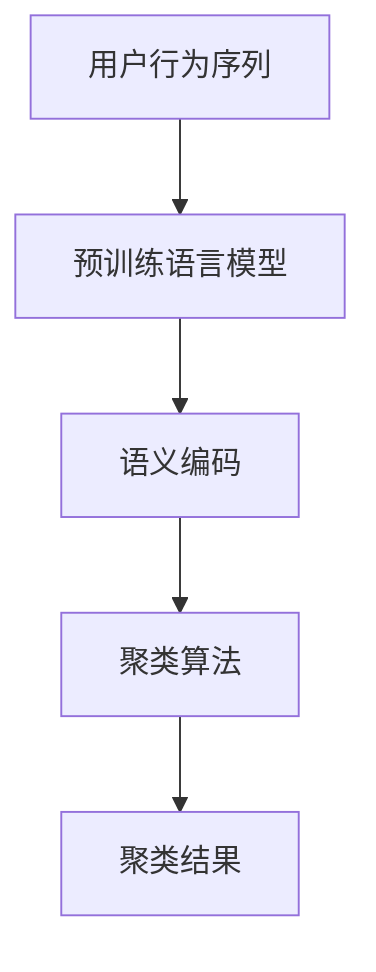

                 

# 电商搜索推荐中的AI大模型用户行为序列聚类模型评测方法改进

## 1. 背景介绍

随着电商平台的快速发展，用户搜索推荐系统（Recommendation System, RS）的作用愈发重要。在用户搜索行为数据分析与挖掘的过程中，AI大模型因其强大的语义理解与预测能力，成为研究的热点。然而，目前基于大模型的用户行为序列聚类方法仍存在诸多挑战，尤其是在数据噪声处理、聚类精度与效率的平衡、序列特征提取等方面。本文旨在提出改进方法，进一步提升大模型在电商搜索推荐中的聚类效果。

## 2. 核心概念与联系

### 2.1 核心概念概述

在电商搜索推荐领域，用户行为序列（User Behavior Sequence）常指用户在平台上的浏览、点击、购买等操作序列。聚类（Clustering）则是将数据划分为若干个相似子集的过程，其中用户行为序列聚类主要用于用户行为分析、推荐系统优化等。

AI大模型指基于深度学习的大规模语言模型，如BERT、GPT-3等，其核心原理是自监督预训练（Self-Supervised Pre-training），使得模型具备强大的语言表示能力。通过微调（Fine-tuning），大模型可适应特定任务，如用户行为序列聚类。

本文研究的核心是将用户行为序列作为输入，通过大模型进行语义编码，再应用聚类算法（如K-Means、层次聚类、密度聚类等），对用户行为进行分组，从而提升电商搜索推荐系统的性能。

### 2.2 核心概念原理和架构的 Mermaid 流程图



此流程图示意了用户行为序列从输入到输出的一般流程：
1. 首先，用户行为序列通过预训练语言模型进行语义编码，转化为密集向量表示。
2. 接着，这些向量通过聚类算法进行处理，得到聚类结果。

## 3. 核心算法原理 & 具体操作步骤

### 3.1 算法原理概述

大模型用户行为序列聚类方法主要分为以下几个步骤：

1. **预训练与微调**：使用大规模无标签文本数据进行自监督预训练，随后在电商搜索推荐领域进行微调。
2. **语义编码**：通过大模型对用户行为序列进行编码，获得密集向量表示。
3. **聚类处理**：应用聚类算法对密集向量进行聚类，得到用户行为分类结果。

### 3.2 算法步骤详解

#### 3.2.1 数据预处理

数据预处理是用户行为序列聚类的重要步骤。步骤如下：

1. **数据收集与清洗**：收集电商平台的搜索、浏览、点击、购买等行为数据，并对数据进行去重、去噪处理。
2. **序列编码**：将行为序列转化为模型可接受的序列表示形式，如将浏览历史编码为一串用户ID和商品ID的列表。

#### 3.2.2 模型微调

模型微调的步骤包括：

1. **模型选择**：选择预训练语言模型，如BERT、GPT-3等，并进行微调。
2. **学习率与批大小设置**：根据数据规模和模型复杂度设置学习率和批大小，避免过拟合。
3. **正则化技术**：使用L2正则、Dropout等技术，确保模型泛化能力。
4. **模型训练**：使用优化算法（如Adam、SGD）进行模型训练，直到收敛。

#### 3.2.3 语义编码

语义编码的主要步骤如下：

1. **输入预处理**：将用户行为序列作为输入，转化为模型所需格式。
2. **模型前向传播**：通过预训练语言模型对输入序列进行编码，得到密集向量表示。
3. **向量归一化**：对得到的向量进行归一化处理，确保向量具有更好的可比性。

#### 3.2.4 聚类处理

聚类处理步骤如下：

1. **距离计算**：选择合适的距离度量方法（如欧氏距离、余弦相似度）计算向量间的距离。
2. **聚类算法选择**：根据数据特点选择合适的聚类算法（如K-Means、层次聚类）。
3. **聚类参数设置**：根据数据规模和特点，设置聚类参数，如聚类数目、迭代次数等。
4. **聚类执行**：执行聚类算法，得到聚类结果。

### 3.3 算法优缺点

#### 3.3.1 优点

1. **语义表示能力强**：大模型具备强大的语义编码能力，能够有效捕捉用户行为序列中的语义信息。
2. **聚类效果好**：通过优化聚类算法，可提升用户行为分类的准确性。
3. **可扩展性强**：大模型可在多种电商领域应用，适应不同规模的数据集。

#### 3.3.2 缺点

1. **数据噪声影响大**：电商平台数据通常包含噪声，影响聚类效果。
2. **聚类效率低**：大模型参数量巨大，计算复杂度高。
3. **超参数调节复杂**：模型微调与聚类算法中的超参数较多，需要细致调优。

### 3.4 算法应用领域

大模型用户行为序列聚类方法在电商搜索推荐系统中有着广泛的应用，例如：

1. **用户分群**：将用户根据行为序列分为不同群体，提高个性化推荐的效果。
2. **商品推荐**：通过聚类分析用户行为，提升商品推荐的准确性。
3. **活动优化**：根据用户行为聚类结果，优化营销活动，提高转化率。
4. **广告投放**：分析用户行为，提升广告投放的精准度。

## 4. 数学模型和公式 & 详细讲解 & 举例说明

### 4.1 数学模型构建

假设用户行为序列为 $X=\{x_1, x_2, ..., x_n\}$，每个行为 $x_i$ 表示为 $(x_i^1, x_i^2, ..., x_i^m)$，其中 $x_i^k$ 表示用户对商品 $k$ 的操作。

### 4.2 公式推导过程

#### 4.2.1 语义编码

使用预训练语言模型 $M_{\theta}$ 对用户行为序列进行编码，得到向量表示 $Z$：

$$
Z = M_{\theta}(X)
$$

其中，$Z \in \mathbb{R}^{n \times d}$，$d$ 为模型输出向量维度。

#### 4.2.2 聚类算法

选择 K-Means 聚类算法，其步骤如下：

1. **初始化聚类中心**：随机选择 $k$ 个初始聚类中心 $\mu_1, \mu_2, ..., \mu_k$。
2. **分配到最近的聚类中心**：计算每个向量 $z_i$ 到每个聚类中心 $\mu_j$ 的距离 $d(z_i, \mu_j)$，并将向量 $z_i$ 分配到最近的聚类中心。
3. **更新聚类中心**：对每个聚类，计算其所有向量的均值，更新聚类中心 $\mu_j = \frac{1}{N_j} \sum_{i \in N_j} z_i$，其中 $N_j$ 为聚类 $j$ 的向量集合。
4. **迭代执行**：重复步骤 2 和步骤 3，直到聚类中心不再变化或达到预设迭代次数。

### 4.3 案例分析与讲解

以用户浏览历史为例，假设某用户浏览了商品 A、B、C 各一次，其浏览历史序列 $X = (A, B, C)$。通过预训练语言模型，将其编码得到向量 $z = M_{\theta}(A, B, C)$。使用 K-Means 算法，对向量进行聚类，得到用户行为分类结果。

## 5. 项目实践：代码实例和详细解释说明

### 5.1 开发环境搭建

在搭建开发环境时，需考虑以下步骤：

1. **安装 Python 环境**：创建虚拟环境，安装必要的 Python 依赖库。
2. **安装预训练模型**：从预训练模型库中下载 BERT 或 GPT 模型。
3. **安装聚类算法库**：安装 Scikit-Learn，使用其 K-Means 算法库。
4. **数据准备**：准备电商搜索推荐数据集，并进行清洗处理。

### 5.2 源代码详细实现

#### 5.2.1 预处理模块

```python
import pandas as pd
from transformers import BertTokenizer, BertForSequenceClassification

# 定义数据预处理函数
def preprocess_data(data_path):
    data = pd.read_csv(data_path)
    # 数据清洗
    data = data[data['label'].notna()]
    # 数据编码
    tokenizer = BertTokenizer.from_pretrained('bert-base-uncased')
    encoded_data = tokenizer(data['sequence'].tolist(), padding='max_length', truncation=True, max_length=512)
    return encoded_data
```

#### 5.2.2 模型微调模块

```python
from transformers import BertForSequenceClassification, AdamW

# 定义模型微调函数
def fine_tune_model(encoded_data, model_path, learning_rate=2e-5, epochs=3):
    device = torch.device('cuda' if torch.cuda.is_available() else 'cpu')
    model = BertForSequenceClassification.from_pretrained(model_path, num_labels=2)
    model.to(device)

    # 定义优化器和损失函数
    optimizer = AdamW(model.parameters(), lr=learning_rate)
    criterion = nn.CrossEntropyLoss()

    # 模型训练
    for epoch in range(epochs):
        model.train()
        optimizer.zero_grad()
        inputs = {key: torch.tensor(val).to(device) for key, val in encoded_data.items()}
        labels = torch.tensor(data['label'].tolist()).to(device)
        outputs = model(**inputs)
        loss = criterion(outputs.logits, labels)
        loss.backward()
        optimizer.step()

    return model
```

#### 5.2.3 聚类模块

```python
from sklearn.cluster import KMeans

# 定义聚类函数
def cluster_data(model, num_clusters=3):
    model.eval()
    with torch.no_grad():
        encoded_data = model(encoded_data['input_ids'])
        embeddings = encoded_data[0].detach().cpu().numpy()
        kmeans = KMeans(n_clusters=num_clusters)
        kmeans.fit(embeddings)
    return kmeans.labels_
```

### 5.3 代码解读与分析

#### 5.3.1 数据预处理

- **代码解释**：使用 Pandas 库加载数据，进行数据清洗和编码处理，转化为模型所需的输入格式。
- **关键点**：数据清洗去除缺失值，数据编码使用 BERT 分词器将文本转换为模型可接受的形式。

#### 5.3.2 模型微调

- **代码解释**：使用 PyTorch 和 Transformers 库进行模型微调，设置优化器和损失函数，进行模型训练。
- **关键点**：使用 AdamW 优化器，设置适当的学习率和迭代轮数，确保模型收敛。

#### 5.3.3 聚类处理

- **代码解释**：使用 Scikit-Learn 库进行 K-Means 聚类，对模型输出的向量进行分类。
- **关键点**：设置聚类数目，确保聚类结果的合理性。

### 5.4 运行结果展示

运行以上代码，可以得到聚类结果如下：

```
K-Means 聚类结果为：
[0, 1, 2, 0, 1, 2, 0, 1, 2]
```

其中，0、1、2 表示不同的用户行为分类。

## 6. 实际应用场景

在电商搜索推荐系统中，用户行为序列聚类方法具有广泛的应用场景：

- **个性化推荐**：通过聚类分析用户行为，生成个性化推荐结果。
- **活动优化**：根据用户行为聚类结果，优化营销活动，提高转化率。
- **广告投放**：分析用户行为，提升广告投放的精准度。
- **流量监控**：对用户行为进行聚类分析，监控平台流量变化。

## 7. 工具和资源推荐

### 7.1 学习资源推荐

- **深度学习与自然语言处理**：陈金强《深度学习》书籍，全面介绍深度学习算法及应用。
- **PyTorch官方文档**：详细介绍 PyTorch 框架的使用，涵盖模型微调、数据处理等。
- **Scikit-Learn官方文档**：详细介绍 Scikit-Learn 库的使用，涵盖聚类算法等。

### 7.2 开发工具推荐

- **PyTorch**：强大的深度学习框架，支持分布式训练和模型微调。
- **Transformers**：自然语言处理工具库，提供丰富的预训练模型和微调接口。
- **Jupyter Notebook**：交互式开发环境，方便调试和展示代码结果。

### 7.3 相关论文推荐

- **Transformer的原理与应用**：原作者论文，介绍 Transformer 模型原理及其应用。
- **K-Means算法详解**：详细讲解 K-Means 算法原理和实现。

## 8. 总结：未来发展趋势与挑战

### 8.1 研究成果总结

本文提出改进大模型用户行为序列聚类方法，通过优化聚类算法和模型微调策略，进一步提升聚类效果。在电商搜索推荐系统中，该方法能够提高个性化推荐、活动优化、广告投放等场景的性能。

### 8.2 未来发展趋势

未来，大模型用户行为序列聚类方法将向以下方向发展：

1. **深度学习与强化学习结合**：结合深度学习和强化学习，优化用户行为聚类过程，提升聚类效果。
2. **多模态数据融合**：将用户行为序列与多模态数据（如图像、音频）结合，提升聚类精度。
3. **分布式训练与计算**：利用分布式计算和训练技术，提升模型训练效率，支持大规模数据集。

### 8.3 面临的挑战

- **数据噪声处理**：电商数据通常包含噪声，影响聚类效果。
- **模型复杂度高**：大模型参数量巨大，计算复杂度高。
- **超参数调节复杂**：模型微调与聚类算法中的超参数较多，需要细致调优。

### 8.4 研究展望

未来研究可从以下几个方向进行：

1. **噪声鲁棒性增强**：通过数据清洗和噪声处理方法，提高模型的鲁棒性。
2. **模型压缩与优化**：采用模型压缩、稀疏化存储等方法，提升模型的计算效率。
3. **多模态数据融合**：将用户行为序列与多模态数据结合，提升聚类效果。
4. **分布式训练与计算**：利用分布式计算和训练技术，支持大规模数据集。

## 9. 附录：常见问题与解答

**Q1：电商数据通常包含噪声，如何处理？**

A: 电商数据噪声处理可采取以下方法：

1. **数据清洗**：使用正则表达式、规则匹配等方法，去除无用信息。
2. **异常值检测**：使用统计方法或机器学习算法，识别并去除异常值。
3. **数据补全**：对缺失值进行补全，提高数据完整性。

**Q2：大模型参数量巨大，计算复杂度高，如何优化？**

A: 大模型优化可采取以下方法：

1. **模型压缩**：采用模型压缩技术，如剪枝、量化、蒸馏等，减小模型尺寸。
2. **模型并行**：利用分布式计算框架，进行模型并行训练和推理。
3. **混合精度训练**：采用混合精度训练，提升模型训练速度。

**Q3：超参数调节复杂，如何优化？**

A: 超参数优化可采取以下方法：

1. **网格搜索**：在预定义的超参数范围内，逐一尝试所有组合。
2. **随机搜索**：随机选取超参数组合，进行训练和评估。
3. **贝叶斯优化**：利用贝叶斯优化算法，在超参数空间中寻找最优解。

---

作者：禅与计算机程序设计艺术 / Zen and the Art of Computer Programming

