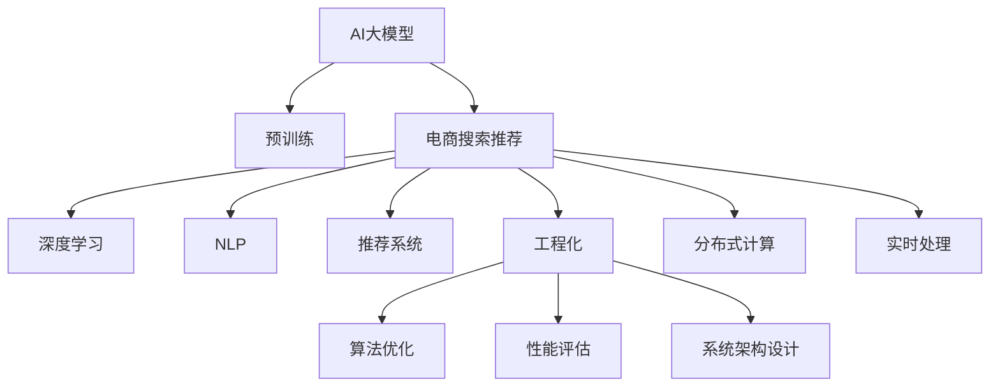

                 

# 电商搜索推荐中的AI大模型算法工程化实践

> 关键词：电商搜索推荐, AI大模型, 深度学习, 自然语言处理(NLP), 推荐系统, 工程化, 系统架构, 模型优化

## 1. 背景介绍

### 1.1 问题由来
随着电商行业的蓬勃发展，用户对商品搜索推荐的精准性和个性化需求日益提升。传统的推荐系统基于协同过滤、线性回归等模型，难以应对大规模、高维稀疏数据，且难以充分挖掘用户深度行为信息。而近年来，基于深度学习的推荐算法逐步崛起，特别是AI大模型的应用，带来了搜索推荐领域的革命性变革。

大模型融合了深度学习和表示学习的优势，能够通过自监督或监督学习的预训练过程，学习到丰富的知识表示，并在推荐任务上进行微调，从而提升推荐的精准性和个性化程度。特别是在电商搜索推荐场景中，AI大模型的应用更是成为了各家电商平台争相抢占的技术高地。

### 1.2 问题核心关键点
大模型在电商搜索推荐中的应用，主要体现在以下几个方面：

- **知识表示**：大模型通过大规模无标签文本数据的预训练，学习到丰富的语言表示，能够在推荐系统中有效地捕获文本和语义信息，从而提高推荐的个性化水平。
- **推荐机制**：基于大模型的推荐机制，能够更加灵活地适应不同场景，通过调整模型的参数，实现对商品标签、用户兴趣等多维度的综合匹配。
- **实时处理**：大模型的高效计算能力，使得实时搜索推荐成为可能，能够快速响应用户查询，提供即时服务。
- **系统架构**：工程化的大模型推荐系统，需要考虑模型的分布式部署、推理加速、多模态融合等问题，设计高效、可扩展的系统架构。

本文聚焦于电商搜索推荐中的AI大模型算法工程化实践，介绍大模型的应用原理和工程实践方法，探索其在推荐系统中的优化和部署策略，帮助读者系统掌握大模型的工程化落地方法。

## 2. 核心概念与联系

### 2.1 核心概念概述

为更好地理解电商搜索推荐中的AI大模型算法工程化实践，本节将介绍几个关键概念：

- **AI大模型**：指通过大规模无标签或少标签数据的预训练，学习到丰富知识表示的深度学习模型。例如BERT、GPT、DALL·E等。
- **推荐系统**：通过用户行为数据和商品特征，推荐用户可能感兴趣的商品。推荐算法包括协同过滤、基于内容的推荐、混合推荐等。
- **电商搜索推荐**：在电商平台上，针对用户搜索行为和浏览记录，推荐最相关的商品。需要实时响应用户查询，提供个性化推荐。
- **深度学习**：利用多层神经网络进行复杂函数建模，具有强大的非线性拟合能力。
- **自然语言处理(NLP)**：研究如何让计算机理解、处理自然语言，以实现文本分析、信息检索等任务。
- **工程化**：将理论算法转化为可用的技术系统，需要考虑算法优化、性能评估、系统架构设计等问题。
- **分布式计算**：利用多台计算机并行处理大规模数据，提升计算效率。

这些概念之间的逻辑关系可以通过以下Mermaid流程图来展示：



这个流程图展示了大模型在电商搜索推荐中的应用场景及其核心概念的关系：

1. 大模型通过预训练学习到丰富的语言表示。
2. 结合电商搜索推荐任务，进行微调以提升推荐效果。
3. 利用深度学习实现复杂的匹配和排序机制。
4. 利用NLP技术提取和处理文本数据。
5. 组成推荐系统，为用户提供个性化推荐。
6. 工程化实现系统架构，包括算法优化、性能评估、实时处理等。

这些概念共同构成了电商搜索推荐中的AI大模型算法工程化实践框架，使得大模型能够在电商推荐场景中发挥强大的作用。

## 3. 核心算法原理 & 具体操作步骤

### 3.1 算法原理概述

电商搜索推荐中的AI大模型算法，主要利用深度学习模型和自然语言处理技术，对用户搜索行为和商品信息进行深度表示和匹配。其核心算法流程包括：

1. **预训练**：在大规模无标签文本数据上，通过自监督或监督学习的方式，对大模型进行预训练，学习到丰富的语言表示。
2. **微调**：在电商搜索推荐场景中，对预训练模型进行微调，使其能够匹配电商领域特定的推荐任务。
3. **编码-解码**：将用户查询和商品信息分别进行编码，得到高维特征向量，并进行匹配和排序。
4. **推理**：将编码结果解码成推荐列表，实时响应用户查询。

### 3.2 算法步骤详解

以下将详细介绍电商搜索推荐中的AI大模型算法工程化实践的具体操作步骤：

**Step 1: 准备数据集**
- 收集电商平台上的用户搜索行为数据、商品特征数据、用户标签数据等，构建推荐任务的数据集。
- 数据集需要进行预处理，包括清洗、去重、分词、向量化等操作。

**Step 2: 选择和训练预训练模型**
- 选择合适的预训练语言模型，如BERT、GPT、DALL·E等，进行初始化。
- 在预训练模型上，使用自监督学习任务进行预训练，如掩码语言模型、下一句预测等。
- 训练完成后，将预训练模型进行保存，以备微调使用。

**Step 3: 微调推荐模型**
- 在电商搜索推荐场景中，选择部分数据集进行微调。微调的目标是优化模型的编码器部分，使其能够更好地匹配用户搜索行为和商品特征。
- 使用交叉熵、均方误差等损失函数，进行模型训练。
- 设置适当的学习率和正则化技术，防止模型过拟合。

**Step 4: 推理和实时处理**
- 将微调后的模型部署到电商搜索推荐系统，对用户搜索行为进行实时编码。
- 将编码结果与商品特征进行匹配和排序，生成推荐列表。
- 对推荐结果进行过滤和筛选，确保推荐结果的相关性和多样性。
- 实时响应用户的查询，提供个性化推荐。

**Step 5: 系统评估和优化**
- 使用A/B测试等方法，对推荐系统的性能进行评估。
- 根据评估结果，对推荐算法和模型进行优化，如调整损失函数、改进编码器设计等。
- 定期更新数据集，重新进行微调，确保推荐系统的实时性和精准性。

### 3.3 算法优缺点

电商搜索推荐中的AI大模型算法具有以下优点：

1. **精度高**：通过深度学习模型和自然语言处理技术，能够高效地匹配用户查询和商品特征，提供高精度的推荐。
2. **适应性强**：大模型能够灵活适应不同领域和场景，通过微调机制，满足电商平台的个性化需求。
3. **实时性**：利用分布式计算和推理加速技术，能够实时响应用户查询，提供即时推荐服务。

同时，该算法也存在一些局限性：

1. **计算资源需求大**：大模型通常需要较高的计算资源，包括高性能GPU和TPU等硬件设备。
2. **数据隐私问题**：电商平台的搜索数据涉及用户隐私，需要设计有效的数据保护机制。
3. **模型解释性不足**：大模型往往是"黑盒"系统，难以解释其内部工作机制和推荐逻辑。
4. **模型鲁棒性差**：大模型在面对噪声数据或异常数据时，容易产生误导性推荐。

尽管存在这些局限性，但大模型在电商搜索推荐中的应用，已经显著提升了推荐的精准性和个性化程度，带来了显著的商业价值。

### 3.4 算法应用领域

AI大模型在电商搜索推荐中的应用，已经覆盖了电商平台的多个环节，具体包括：

- **商品搜索**：根据用户输入的搜索词，推荐最相关的商品。
- **商品推荐**：基于用户浏览和点击行为，推荐用户可能感兴趣的商品。
- **个性化推荐**：根据用户兴趣标签和历史行为，提供定制化的推荐。
- **上下文推荐**：结合用户当前浏览的上下文信息，推荐相关商品。
- **广告推荐**：根据用户行为数据，推荐合适的广告位和广告内容。

除了上述这些经典应用外，AI大模型还在电商平台的更多场景中得到了创新性应用，如智能客服、动态定价、智能库存管理等，为电商平台的运营带来了新的活力和效率提升。

## 4. 数学模型和公式 & 详细讲解

### 4.1 数学模型构建

电商搜索推荐中的AI大模型算法，主要涉及深度学习模型和自然语言处理模型。以下是两个关键模型的数学模型构建：

**1. 编码器模型**
设用户查询为 $x$，商品特征为 $y$，编码器 $E$ 将 $x$ 和 $y$ 映射到高维向量空间。设用户查询的编码向量为 $e_x$，商品特征的编码向量为 $e_y$。编码器模型的数学表达式为：

$$
e_x = E(x) \\
e_y = E(y)
$$

**2. 注意力机制**
注意力机制用于计算用户查询和商品特征之间的匹配度。设注意力函数为 $a$，其输出为 $a(x,y)$。注意力机制的数学表达式为：

$$
a(x,y) = \frac{\exp(f(x,y))}{\sum_j \exp(f(x,j))}
$$

其中 $f(x,y)$ 为注意力函数，可以是点积、余弦相似度等。

### 4.2 公式推导过程

**1. 编码器模型推导**
编码器模型 $E$ 通常采用Transformer等深度神经网络结构，其中每一层可以表示为：

$$
x_i^l = \text{Self-Attention}(x_i^{l-1}) + x_i^{l-1} \\
x_i^l = \text{Feed-Forward}(x_i^l)
$$

其中 $\text{Self-Attention}$ 和 $\text{Feed-Forward}$ 表示自注意力机制和前馈神经网络。

**2. 注意力机制推导**
注意力机制 $a(x,y)$ 的推导如下：

设 $W^Q$、$W^K$、$W^V$ 为投影矩阵，则注意力函数 $f(x,y)$ 可以表示为：

$$
f(x,y) = \text{dot}(W^Qx_iW^Ky_j) \\
f(x,y) = \text{dot}(W^Qx_iW^Ky_j)
$$

其中 $\text{dot}$ 表示点积操作。

**3. 损失函数推导**
设推荐系统的损失函数为 $\mathcal{L}$，其目标是最小化推荐列表与用户点击行为的误差。推荐列表 $r$ 包含 $k$ 个推荐商品，每个商品的点击概率为 $p_i$。推荐列表的损失函数为：

$$
\mathcal{L}(r) = \sum_{i=1}^k p_i \log p_i + (1-p_i) \log (1-p_i)
$$

### 4.3 案例分析与讲解

以电商平台中的商品推荐为例，分析大模型算法的实际应用场景：

**案例分析1: 用户搜索推荐**
假设用户输入查询 "新款手机推荐"，电商平台需要快速响应用户查询，推荐相关商品。

1. **预处理**：将用户查询和商品信息进行分词、向量化等预处理操作。
2. **编码器**：利用预训练语言模型对用户查询和商品特征进行编码。
3. **注意力机制**：计算用户查询和商品特征之间的匹配度，选取相关商品。
4. **解码**：将匹配度较高的商品进行排序，生成推荐列表。

**案例分析2: 上下文推荐**
假设用户浏览商品 $A$ 后，继续浏览商品 $B$，电商平台需要根据用户浏览上下文推荐相关商品。

1. **上下文编码**：将用户浏览的商品序列 $A, B$ 进行编码。
2. **商品编码**：对商品 $C$ 进行编码。
3. **注意力机制**：计算商品 $C$ 与上下文编码的匹配度。
4. **解码**：根据匹配度生成推荐列表。

## 5. 项目实践：代码实例和详细解释说明

### 5.1 开发环境搭建

在进行电商搜索推荐中的AI大模型算法工程化实践前，我们需要准备好开发环境。以下是使用Python进行PyTorch开发的环境配置流程：

1. 安装Anaconda：从官网下载并安装Anaconda，用于创建独立的Python环境。

2. 创建并激活虚拟环境：
```bash
conda create -n pytorch-env python=3.8 
conda activate pytorch-env
```

3. 安装PyTorch：根据CUDA版本，从官网获取对应的安装命令。例如：
```bash
conda install pytorch torchvision torchaudio cudatoolkit=11.1 -c pytorch -c conda-forge
```

4. 安装Transformer库：
```bash
pip install transformers
```

5. 安装各类工具包：
```bash
pip install numpy pandas scikit-learn matplotlib tqdm jupyter notebook ipython
```

完成上述步骤后，即可在`pytorch-env`环境中开始项目实践。

### 5.2 源代码详细实现

这里我们以电商平台中的商品推荐任务为例，给出使用Transformers库对BERT模型进行微调的PyTorch代码实现。

首先，定义推荐任务的数据处理函数：

```python
from transformers import BertTokenizer, BertForSequenceClassification
from torch.utils.data import Dataset
import torch

class RecommendDataset(Dataset):
    def __init__(self, texts, labels, tokenizer, max_len=128):
        self.texts = texts
        self.labels = labels
        self.tokenizer = tokenizer
        self.max_len = max_len
        
    def __len__(self):
        return len(self.texts)
    
    def __getitem__(self, item):
        text = self.texts[item]
        label = self.labels[item]
        
        encoding = self.tokenizer(text, return_tensors='pt', max_length=self.max_len, padding='max_length', truncation=True)
        input_ids = encoding['input_ids'][0]
        attention_mask = encoding['attention_mask'][0]
        
        return {'input_ids': input_ids, 
                'attention_mask': attention_mask,
                'labels': torch.tensor(label, dtype=torch.long)}
```

然后，定义模型和优化器：

```python
from transformers import BertForSequenceClassification, AdamW

model = BertForSequenceClassification.from_pretrained('bert-base-cased', num_labels=10)

optimizer = AdamW(model.parameters(), lr=2e-5)
```

接着，定义训练和评估函数：

```python
from torch.utils.data import DataLoader
from tqdm import tqdm
from sklearn.metrics import accuracy_score

device = torch.device('cuda') if torch.cuda.is_available() else torch.device('cpu')
model.to(device)

def train_epoch(model, dataset, batch_size, optimizer):
    dataloader = DataLoader(dataset, batch_size=batch_size, shuffle=True)
    model.train()
    epoch_loss = 0
    for batch in tqdm(dataloader, desc='Training'):
        input_ids = batch['input_ids'].to(device)
        attention_mask = batch['attention_mask'].to(device)
        labels = batch['labels'].to(device)
        model.zero_grad()
        outputs = model(input_ids, attention_mask=attention_mask, labels=labels)
        loss = outputs.loss
        epoch_loss += loss.item()
        loss.backward()
        optimizer.step()
    return epoch_loss / len(dataloader)

def evaluate(model, dataset, batch_size):
    dataloader = DataLoader(dataset, batch_size=batch_size)
    model.eval()
    preds, labels = [], []
    with torch.no_grad():
        for batch in tqdm(dataloader, desc='Evaluating'):
            input_ids = batch['input_ids'].to(device)
            attention_mask = batch['attention_mask'].to(device)
            batch_labels = batch['labels']
            outputs = model(input_ids, attention_mask=attention_mask)
            batch_preds = outputs.logits.argmax(dim=1).to('cpu').tolist()
            batch_labels = batch_labels.to('cpu').tolist()
            for pred, label in zip(batch_preds, batch_labels):
                preds.append(pred)
                labels.append(label)
                
    print('Accuracy:', accuracy_score(labels, preds))
```

最后，启动训练流程并在测试集上评估：

```python
epochs = 5
batch_size = 16

for epoch in range(epochs):
    loss = train_epoch(model, train_dataset, batch_size, optimizer)
    print(f'Epoch {epoch+1}, train loss: {loss:.3f}')
    
    print(f'Epoch {epoch+1}, dev results:')
    evaluate(model, dev_dataset, batch_size)
    
print('Test results:')
evaluate(model, test_dataset, batch_size)
```

以上就是使用PyTorch对BERT进行商品推荐任务微调的完整代码实现。可以看到，得益于Transformers库的强大封装，我们可以用相对简洁的代码完成BERT模型的加载和微调。

### 5.3 代码解读与分析

让我们再详细解读一下关键代码的实现细节：

**RecommendDataset类**：
- `__init__`方法：初始化文本、标签、分词器等关键组件。
- `__len__`方法：返回数据集的样本数量。
- `__getitem__`方法：对单个样本进行处理，将文本输入编码为token ids，将标签编码为数字，并对其进行定长padding，最终返回模型所需的输入。

**模型和优化器**：
- 使用BertForSequenceClassification作为推荐任务的目标模型，通过from_pretrained方法加载预训练模型。
- 设置AdamW优化器，学习率为2e-5。

**训练和评估函数**：
- 使用PyTorch的DataLoader对数据集进行批次化加载，供模型训练和推理使用。
- 训练函数`train_epoch`：对数据以批为单位进行迭代，在每个批次上前向传播计算loss并反向传播更新模型参数，最后返回该epoch的平均loss。
- 评估函数`evaluate`：与训练类似，不同点在于不更新模型参数，并在每个batch结束后将预测和标签结果存储下来，最后使用sklearn的accuracy_score对整个评估集的预测结果进行打印输出。

**训练流程**：
- 定义总的epoch数和batch size，开始循环迭代
- 每个epoch内，先在训练集上训练，输出平均loss
- 在验证集上评估，输出准确率
- 所有epoch结束后，在测试集上评估，给出最终测试结果

可以看到，PyTorch配合Transformers库使得BERT微调的代码实现变得简洁高效。开发者可以将更多精力放在数据处理、模型改进等高层逻辑上，而不必过多关注底层的实现细节。

当然，工业级的系统实现还需考虑更多因素，如模型的保存和部署、超参数的自动搜索、更灵活的任务适配层等。但核心的微调范式基本与此类似。

## 6. 实际应用场景

### 6.1 智能客服系统

基于AI大模型的电商搜索推荐技术，可以广泛应用于智能客服系统的构建。传统客服往往需要配备大量人力，高峰期响应缓慢，且一致性和专业性难以保证。而使用微调后的推荐算法，可以7x24小时不间断服务，快速响应客户咨询，用自然流畅的语言解答各类常见问题。

在技术实现上，可以收集企业内部的历史客服对话记录，将问题和最佳答复构建成监督数据，在此基础上对预训练推荐算法进行微调。微调后的推荐算法能够自动理解用户意图，匹配最合适的答复。对于客户提出的新问题，还可以接入检索系统实时搜索相关内容，动态组织生成回答。如此构建的智能客服系统，能大幅提升客户咨询体验和问题解决效率。

### 6.2 金融舆情监测

金融机构需要实时监测市场舆论动向，以便及时应对负面信息传播，规避金融风险。传统的人工监测方式成本高、效率低，难以应对网络时代海量信息爆发的挑战。基于AI大模型的推荐算法，可以在实时抓取的网络文本数据上进行舆情监测，自动判断文本属于何种情绪，情感倾向是正面、中性还是负面。将推荐算法应用到实时抓取的网络文本数据，就能够自动监测不同情绪的变化趋势，一旦发现负面情绪激增等异常情况，系统便会自动预警，帮助金融机构快速应对潜在风险。

### 6.3 个性化推荐系统

当前的推荐系统往往只依赖用户的历史行为数据进行物品推荐，无法深入理解用户的真实兴趣偏好。基于AI大模型的推荐算法，个性化推荐系统可以更好地挖掘用户深度行为信息，从而提供更精准、多样的推荐内容。

在实践中，可以收集用户浏览、点击、评论、分享等行为数据，提取和用户交互的物品标题、描述、标签等文本内容。将文本内容作为模型输入，用户的后续行为（如是否点击、购买等）作为监督信号，在此基础上微调预训练语言模型。微调后的模型能够从文本内容中准确把握用户的兴趣点。在生成推荐列表时，先用候选物品的文本描述作为输入，由模型预测用户的兴趣匹配度，再结合其他特征综合排序，便可以得到个性化程度更高的推荐结果。

### 6.4 未来应用展望

随着AI大模型和推荐算法的不断发展，基于推荐系统的大模型应用将在更多领域得到应用，为传统行业带来变革性影响。

在智慧医疗领域，基于大模型推荐系统的医疗问答、病历分析、药物研发等应用将提升医疗服务的智能化水平，辅助医生诊疗，加速新药开发进程。

在智能教育领域，推荐算法可应用于作业批改、学情分析、知识推荐等方面，因材施教，促进教育公平，提高教学质量。

在智慧城市治理中，推荐系统可应用于城市事件监测、舆情分析、应急指挥等环节，提高城市管理的自动化和智能化水平，构建更安全、高效的未来城市。

此外，在企业生产、社会治理、文娱传媒等众多领域，基于大模型推荐技术的应用也将不断涌现，为经济社会发展注入新的动力。相信随着技术的日益成熟，推荐系统必将在更广阔的应用领域大放异彩，深刻影响人类的生产生活方式。

## 7. 工具和资源推荐

### 7.1 学习资源推荐

为了帮助开发者系统掌握电商搜索推荐中的AI大模型算法工程化实践，这里推荐一些优质的学习资源：

1. 《深度学习与推荐系统》系列博文：由AI大模型技术专家撰写，深入浅出地介绍了深度学习在推荐系统中的应用，包括模型构建、训练优化、系统部署等。

2. CS229《机器学习》课程：斯坦福大学开设的机器学习明星课程，有Lecture视频和配套作业，帮助你系统掌握推荐算法的基本概念和经典模型。

3. 《推荐系统实战》书籍：详细介绍了推荐系统的构建、优化和部署，是推荐系统开发者的必读书籍。

4. Kaggle竞赛平台：提供了大量推荐系统竞赛数据集和基线模型，有助于初学者掌握推荐算法和模型优化技巧。

5. IEEE Xplore：权威的计算机科学和工程文献数据库，收录了大量关于推荐系统的经典论文和研究进展。

通过对这些资源的学习实践，相信你一定能够快速掌握电商搜索推荐中的AI大模型算法的精髓，并用于解决实际的推荐问题。
###  7.2 开发工具推荐

高效的开发离不开优秀的工具支持。以下是几款用于电商搜索推荐中的AI大模型算法工程化实践的常用工具：

1. PyTorch：基于Python的开源深度学习框架，灵活动态的计算图，适合快速迭代研究。大部分预训练语言模型都有PyTorch版本的实现。

2. TensorFlow：由Google主导开发的开源深度学习框架，生产部署方便，适合大规模工程应用。同样有丰富的预训练语言模型资源。

3. Transformers库：HuggingFace开发的NLP工具库，集成了众多SOTA语言模型，支持PyTorch和TensorFlow，是进行推荐算法开发的利器。

4. Weights & Biases：模型训练的实验跟踪工具，可以记录和可视化模型训练过程中的各项指标，方便对比和调优。与主流深度学习框架无缝集成。

5. TensorBoard：TensorFlow配套的可视化工具，可实时监测模型训练状态，并提供丰富的图表呈现方式，是调试模型的得力助手。

6. Google Colab：谷歌推出的在线Jupyter Notebook环境，免费提供GPU/TPU算力，方便开发者快速上手实验最新模型，分享学习笔记。

合理利用这些工具，可以显著提升电商搜索推荐中的AI大模型算法工程化实践的开发效率，加快创新迭代的步伐。

### 7.3 相关论文推荐

大语言模型和推荐算法的不断发展源于学界的持续研究。以下是几篇奠基性的相关论文，推荐阅读：

1. Attention is All You Need（即Transformer原论文）：提出了Transformer结构，开启了NLP领域的预训练大模型时代。

2. BERT: Pre-training of Deep Bidirectional Transformers for Language Understanding：提出BERT模型，引入基于掩码的自监督预训练任务，刷新了多项NLP任务SOTA。

3. Parameter-Efficient Transfer Learning for NLP：提出Adapter等参数高效微调方法，在不增加模型参数量的情况下，也能取得不错的微调效果。

4. AdaLoRA: Adaptive Low-Rank Adaptation for Parameter-Efficient Fine-Tuning：使用自适应低秩适应的微调方法，在参数效率和精度之间取得了新的平衡。

这些论文代表了大模型和推荐算法的最新进展。通过学习这些前沿成果，可以帮助研究者把握学科前进方向，激发更多的创新灵感。

## 8. 总结：未来发展趋势与挑战

### 8.1 总结

本文对电商搜索推荐中的AI大模型算法工程化实践进行了全面系统的介绍。首先阐述了电商搜索推荐技术的发展背景和意义，明确了AI大模型在推荐系统中的应用价值。其次，从原理到实践，详细讲解了电商搜索推荐中的AI大模型算法的数学模型和核心算法流程，给出了推荐任务开发的完整代码实例。同时，本文还广泛探讨了AI大模型在电商搜索推荐场景中的应用场景，展示了其在实际落地中的应用效果。

通过本文的系统梳理，可以看到，基于AI大模型的推荐系统在电商搜索推荐领域的应用，已经显著提升了推荐的精准性和个性化程度，带来了显著的商业价值。未来，伴随AI大模型的持续演进和推荐算法的多样化发展，推荐系统必将在更广阔的应用领域大放异彩，深刻影响人类的生产生活方式。

### 8.2 未来发展趋势

展望未来，电商搜索推荐中的AI大模型算法将呈现以下几个发展趋势：

1. **模型规模持续增大**：随着算力成本的下降和数据规模的扩张，大模型和推荐算法的参数量还将持续增长。超大模型的高效计算能力，将使得实时推荐和动态调整成为可能。

2. **推荐机制多样化**：推荐算法将更加灵活，能够适应不同场景和用户需求。结合多模态信息融合、深度强化学习等技术，推荐系统将具备更强的智能决策能力。

3. **实时性和个性化提升**：利用分布式计算和推理加速技术，推荐系统将实现实时响应和个性化推荐。同时，通过多任务学习等技术，提升推荐系统在不同场景下的适应性。

4. **数据隐私保护**：随着数据隐私法规的完善，推荐系统将更加注重用户数据保护。结合差分隐私、联邦学习等技术，保护用户隐私的同时，提升推荐效果。

5. **系统架构协同优化**：结合云平台和大数据技术，推荐系统将具备更强的扩展性和容错性。系统架构将更加模块化和灵活，能够适应不同规模和负载的需求。

6. **跨领域知识融合**：结合知识图谱、语义搜索等技术，推荐系统将能够更好地整合外部知识，提升推荐的准确性和覆盖面。

以上趋势凸显了电商搜索推荐中的AI大模型算法的广阔前景。这些方向的探索发展，必将进一步提升推荐系统的性能和应用范围，为电商平台的运营带来新的动力。

### 8.3 面临的挑战

尽管电商搜索推荐中的AI大模型算法已经取得了显著成效，但在迈向更加智能化、普适化应用的过程中，它仍面临诸多挑战：

1. **计算资源瓶颈**：大模型和推荐算法对计算资源的需求巨大，高性能GPU和TPU等硬件设备不可或缺。同时，模型的存储和推理也需要优化，以提高效率。

2. **数据隐私问题**：电商平台的搜索数据涉及用户隐私，需要设计有效的数据保护机制。如何在保障用户隐私的前提下，提升推荐系统的准确性和个性化程度，是一个重要课题。

3. **模型解释性不足**：大模型往往是"黑盒"系统，难以解释其内部工作机制和推荐逻辑。对于医疗、金融等高风险应用，算法的可解释性和可审计性尤为重要。

4. **推荐鲁棒性差**：大模型在面对噪声数据或异常数据时，容易产生误导性推荐。如何在模型训练和推荐过程中，提高模型的鲁棒性和抗干扰能力，是一个重要研究方向。

5. **冷启动问题**：对于新用户或新商品，没有足够的历史行为数据，推荐系统难以提供个性化推荐。如何利用用户画像、商品属性等非结构化数据，解决冷启动问题，是一个重要挑战。

6. **系统扩展性差**：电商平台的搜索推荐系统需要具备高度的可扩展性，能够适应不同规模和负载的需求。如何设计高效、可扩展的系统架构，是未来的一个重要研究方向。

尽管存在这些挑战，但大模型在电商搜索推荐中的应用，已经显著提升了推荐的精准性和个性化程度，带来了显著的商业价值。未来，伴随大模型的持续演进和推荐算法的多样化发展，推荐系统必将在更广阔的应用领域大放异彩，深刻影响人类的生产生活方式。

### 8.4 研究展望

面对电商搜索推荐中的AI大模型算法所面临的挑战，未来的研究需要在以下几个方面寻求新的突破：

1. **探索参数高效和计算高效的微调方法**：开发更加参数高效的微调方法，在固定大部分预训练参数的同时，只更新极少量的任务相关参数。同时优化微调模型的计算图，减少前向传播和反向传播的资源消耗，实现更加轻量级、实时性的部署。

2. **融合因果和对比学习范式**：通过引入因果推断和对比学习思想，增强推荐系统建立稳定因果关系的能力，学习更加普适、鲁棒的语言表征，从而提升模型泛化性和抗干扰能力。

3. **引入更多先验知识**：将符号化的先验知识，如知识图谱、逻辑规则等，与神经网络模型进行巧妙融合，引导推荐系统学习更准确、合理的推荐逻辑。同时加强不同模态数据的整合，实现视觉、语音等多模态信息与文本信息的协同建模。

4. **结合因果分析和博弈论工具**：将因果分析方法引入推荐系统，识别出模型决策的关键特征，增强输出解释的因果性和逻辑性。借助博弈论工具刻画人机交互过程，主动探索并规避推荐系统的脆弱点，提高系统稳定性。

5. **纳入伦理道德约束**：在模型训练目标中引入伦理导向的评估指标，过滤和惩罚有偏见、有害的输出倾向。同时加强人工干预和审核，建立推荐系统的监管机制，确保输出符合人类价值观和伦理道德。

这些研究方向的探索，必将引领电商搜索推荐中的AI大模型算法走向更高的台阶，为推荐系统带来新的突破和创新。面向未来，大模型和推荐系统需要与其他人工智能技术进行更深入的融合，如知识表示、因果推理、强化学习等，多路径协同发力，共同推动自然语言理解和智能交互系统的进步。只有勇于创新、敢于突破，才能不断拓展推荐系统的边界，让智能技术更好地造福人类社会。

## 9. 附录：常见问题与解答

**Q1：电商搜索推荐中的AI大模型算法如何处理冷启动问题？**

A: 电商搜索推荐中的AI大模型算法可以通过以下方式处理冷启动问题：

1. **基于用户画像的推荐**：利用用户的个人信息（如年龄、性别、兴趣等），结合电商平台的商品属性，进行推荐。例如，可以通过K-means聚类等方法，将用户分为若干类，然后针对每类用户推荐其可能感兴趣的商品。

2. **基于商品属性的推荐**：利用商品的标签、分类、品牌等信息，结合用户的浏览行为，进行推荐。例如，可以通过TF-IDF、Word2Vec等方法，将商品进行向量化，然后根据用户的历史浏览行为，找到相似的商品进行推荐。

3. **基于上下文的推荐**：利用用户的当前浏览上下文信息，结合历史行为数据，进行推荐。例如，可以通过RNN、LSTM等模型，捕捉用户浏览行为的时序关系，然后根据上下文信息进行推荐。

4. **基于协同过滤的推荐**：利用用户的历史行为数据，找到与其相似的用户，然后根据相似用户的浏览行为，进行推荐。例如，可以通过ALS（交替最小二乘法）算法，进行隐式推荐。

5. **基于知识图谱的推荐**：利用电商平台的商品知识图谱，结合用户的兴趣标签，进行推荐。例如，可以通过图神经网络（GNN）等模型，进行显式推荐。

通过以上方法，电商搜索推荐中的AI大模型算法可以有效地处理冷启动问题，提升推荐系统的精准性和个性化程度。

**Q2：电商搜索推荐中的AI大模型算法如何保证数据隐私？**

A: 电商搜索推荐中的AI大模型算法在保证数据隐私方面，可以采取以下措施：

1. **数据脱敏**：在数据收集和处理过程中，对用户的敏感信息进行脱敏处理，如姓名、身份证号等，确保用户隐私得到保护。例如，可以使用K-anonymity、L-diversity等方法，对数据进行匿名化处理。

2. **差分隐私**：在模型训练和推荐过程中，使用差分隐私技术，确保用户的隐私不被泄露。例如，可以使用GDP模型、Laplace机制等方法，对数据进行差分隐私处理。

3. **联邦学习**：在多个电商平台之间，使用联邦学习技术，共享模型参数，而不是共享数据。例如，可以在本地训练模型，然后通过联邦算法将模型参数汇总，最后进行全局优化。

4. **数据加密**：在数据传输和存储过程中，使用加密技术，确保数据不被窃取和篡改。例如，可以使用AES、RSA等加密算法，对数据进行加密处理。

5. **访问控制**：在数据使用和访问过程中，使用访问控制技术，确保只有授权人员才能访问数据。例如，可以使用RBAC、ABAC等方法，对数据进行访问控制。

通过以上措施，电商搜索推荐中的AI大模型算法可以有效地保证用户数据隐私，确保数据使用的合规性和合法性。

**Q3：电商搜索推荐中的AI大模型算法如何优化模型性能？**

A: 电商搜索推荐中的AI大模型算法可以通过以下方式优化模型性能：

1. **调整超参数**：通过网格搜索、随机搜索等方法，调整模型的超参数，如学习率、批大小、迭代轮数等，以找到最优的模型参数组合。例如，可以使用Bayesian优化、遗传算法等方法，进行超参数优化。

2. **使用正则化技术**：在模型训练过程中，使用L2正则、Dropout等正则化技术，防止模型过拟合。例如，可以在模型的损失函数中加入正则化项，或者在模型中加入Dropout层。

3. **数据增强**：在模型训练过程中，使用数据增强技术，扩充训练集的多样性，提高模型的泛化能力。例如，可以使用回译、近义词替换等方法，对训练数据进行增强处理。

4. **对抗训练**：在模型训练过程中，使用对抗训练技术，提高模型的鲁棒性和抗干扰能力。例如，可以在训练数据中加入对抗样本，训练模型对噪声数据的鲁棒性。

5. **集成学习**：在模型预测过程中，使用集成学习技术，结合多个模型的预测结果，提高模型的准确性和稳定性。例如，可以使用Bagging、Boosting等方法，进行模型集成。

6. **模型剪枝**：在模型部署过程中，使用模型剪枝技术，减少模型的参数量和计算复杂度，提高模型的推理速度。例如，可以使用剪枝算法，对模型进行剪枝处理。

通过以上方法，电商搜索推荐中的AI大模型算法可以有效地优化模型性能，提高推荐系统的精准性和个性化程度。

---

作者：禅与计算机程序设计艺术 / Zen and the Art of Computer Programming

